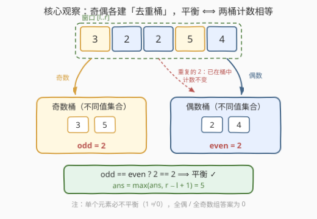
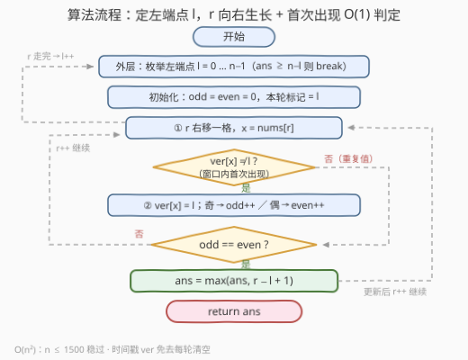

# LeetCode 最长平衡子数组 I 题解

## 1. 题目概述

- **标题 / 题号**：最长平衡子数组 I（#3719，medium）
- **链接**：https://leetcode.cn/problems/longest-balanced-subarray-i/
- **难度**：中等
- **标签**：数组、哈希表、枚举、计数

**题意**：给你一个整数数组 `nums`。如果子数组中**不同偶数**的数量等于**不同奇数**的数量，则称该子数组是**平衡的**。返回**最长**平衡子数组的**长度**。

子数组是数组中连续且**非空**的一段元素序列。

**示例 1**：

```text
输入：nums = [2,5,4,3]
输出：4
解释：最长平衡子数组是 [2, 5, 4, 3]，它有 2 个不同偶数 [2, 4] 和 2 个不同奇数 [5, 3]。
```

**示例 2**：

```text
输入：nums = [3,2,2,5,4]
输出：5
解释：最长平衡子数组是 [3, 2, 2, 5, 4]，它有 2 个不同偶数 [2, 4] 和 2 个不同奇数 [3, 5]。
```

**示例 3**：

```text
输入：nums = [1,2,3,2]
输出：3
解释：最长平衡子数组是 [2, 3, 2]，它有 1 个不同偶数 [2] 和 1 个不同奇数 [3]。
```

**约束**：

- $1 \le \text{nums.length} \le 1500$
- $1 \le \text{nums}[i] \le 10^5$

> 💡 **审题关键**：① 平衡比较的是奇/偶两侧「**不同值**」的个数而非元素个数——示例 2 的两个 `2` 只贡献 1 个偶数种类，这是全题最容易被看漏的口径；② 单个元素必不平衡（一侧计数 1、另一侧 0），因此**答案可以为 0**（如全偶数组 `[2,4,6]`），这与「单字符串必平衡、答案至少 1」的 [3713](./3713_最长的平衡子串 I.md) 形成鲜明对比；③ $n \le 1500$ 是明确的复杂度暗示：$O(n^2) \approx 1.1 \times 10^6$ 可过，官方 hint 也直言「Use brute force」。

## 2. 解题思路

### 2.1 暴力思路：枚举所有子数组，逐个重建集合

最直接的写法是双重循环枚举所有 $O(n^2)$ 个子数组，每个子数组再用两个哈希集合重新扫一遍统计不同偶数/奇数的种类数——总计 $O(n^3) \approx 3.4 \times 10^9$，超时。

暴力的浪费显而易见：**相邻两个子数组只差一个元素**，却要整套重建两个集合。消除重复劳动的方向就是把「换子数组」变成「增删一个元素」，这就是下面的增量维护。

### 2.2 核心观察：奇偶「去重桶」+ 单向生长



把平衡条件翻译成数据结构语言：

> 维护两个**去重桶**——奇数桶收集窗口内出现过的奇数值、偶数桶收集出现过的偶数值，**平衡 $\iff$ 两桶的计数相等**（一次 `O(1)` 比较）。

要让每个子数组的判定都免费，关键在**枚举的方向**：

> **固定左端点 $l$，让右端点 $r$ 单向向右生长。**

这样窗口只扩不缩，每步加入 `nums[r]` 时只可能发生两种情况之一：

- `nums[r]` 是窗口内**首次出现**的值 → 对应奇/偶桶计数 `+1`；
- 值已在桶中（重复值）→ **什么都不变**。

判定「首次出现」同样要 $O(1)$：用**时间戳数组** `ver[x]` 记录值 `x` 最后一次入桶时所在的轮次（左端点编号），`ver[x] != l` 即代表「本轮（窗口 $[l..r]$）尚未见过 $x$」——等价于每轮自动清零，省去逐轮重置的 $O(V)$ 开销。

> ⚠️ **为什么不能滑动窗口 / 双指针？** 平衡性对窗口伸缩**没有单调性**：$[1,2,4,3]$ 平衡（2 偶 2 奇），收缩成 $[2,4,3]$ 反而不平衡（2 偶 1 奇）；反过来 $[2,1,4,3,8]$ 不平衡（3 偶 2 奇），收缩成 $[1,4,3,8]$ 又变回平衡。收缩可能救回平衡也可能毁掉平衡，双指针的收缩依据不成立，只能枚举——并用 $O(1)$ 摊销判定把枚举压到 $O(n^2)$。

再送一个免费剪枝：外层循环推进到 $l$ 时，以 $l$ 开头的子数组最长不过 $n - l$；一旦 `ans >= n - l`，当前及后续所有左端点都不可能更长，直接 `break`。

### 2.3 算法流程图



**逻辑执行步骤**：

| 步骤 | 操作 | 说明 |
|------|------|------|
| ① 外层循环 | 枚举左端点 $l = 0 \dots n-1$ | `ans ≥ n−l` 时提前 `break`（剪枝） |
| ② 状态初始化 | `odd = even = 0`，本轮标记 = $l$ | 时间戳 `ver[x] ≠ l` 即视为未见 |
| ③ 内层循环 | $r$ 从 $l$ 向右移动，$x = \text{nums}[r]$ | 窗口 $[l..r]$ 单向生长 |
| ④ 首现判定 | `ver[x] ≠ l` ? | 是 → ⑤；否（重复值）→ 跳到 ⑥ |
| ⑤ 入桶计数 | `ver[x] = l`；$x$ 奇 → `odd++`，$x$ 偶 → `even++` | 严格 $O(1)$ |
| ⑥ 平衡判定 | `odd == even` ? | 是 → `ans = max(ans, r−l+1)` |
| ⑦ 内层走完 | $r > n-1$ → $l{+}{+}$ 进入下一轮 | 全部左端点处理完返回 `ans` |

> ⚠️ ④ 的「重复值绕过计数」与 ⑥ 的「重复值不破坏判定」是同一枚硬币的两面：重复值既不改变 `odd`/`even`，也不影响 `odd == even` 的成立与否，所以处理重复值天然免费——这正是「去重桶」口径下增量维护的红利。

### 2.4 示例演算

**示例 2：`nums = [3,2,2,5,4]`，左端点 $l = 0$ 一轮**：

| $r$ | 新入元素 | 奇数桶 | 偶数桶 | odd | even | 平衡？ | len | ans |
|-----|---------|--------|--------|-----|------|--------|-----|-----|
| 0 | `3` | {3} | {} | 1 | 0 | ✗ | 1 | 0 |
| 1 | `2` | {3} | {2} | 1 | 1 | ✓ | 2 | 2 |
| 2 | `2`（重复） | {3} | {2} | 1 | 1 | ✓ | 3 | 3 |
| 3 | `5` | {3,5} | {2} | 2 | 1 | ✗ | 4 | 3 |
| 4 | `4` | {3,5} | {2,4} | 2 | 2 | ✓ | 5 | **5** |

- $r=2$ 的第二个 `2` 是重复值：桶不扩、计数不动，但 `len` 变长且平衡性保持——「白捡」一格长度；
- $r=0$ 时单元素不平衡（1 ≠ 0），印证 `ans` 从 0 起步。

**示例 3 快速核对 `nums = [1,2,3,2]`**：$l=0$ 一轮最好成绩是 $[1,2]$（len 2）；$l=1$ 一轮在 $r=3$ 处 $[2,3,2]$ 平衡（{2} 与 {3} 各 1 种）→ 答案 **3**。

**边界情形**：全偶数组（如 `[2,4,6,8]`）任何子数组奇数桶恒空，`odd == even` 仅在两边同为 0 时成立——但非空子数组偶数桶至少 1，永不平衡，答案 0。

## 3. 参考代码

### C++（时间戳数组判首次出现）

```cpp
class Solution {
  public:
    int longestBalanced(vector<int>& nums) {
        int n = nums.size(), ans = 0;
        vector<int> ver(100001, -1);          // ver[x] = x 最后入桶时的轮次（左端点）
        for (int l = 0; l < n; ++l) {
            if (ans >= n - l) break;          // 剪枝：以 l 开头不可能更长
            int odd = 0, even = 0;
            for (int r = l; r < n; ++r) {
                int x = nums[r];
                if (ver[x] != l) {            // 窗口内首次出现
                    ver[x] = l;
                    (x & 1) ? ++odd : ++even;
                }
                if (odd == even) ans = max(ans, r - l + 1);
            }
        }
        return ans;
    }
};
```

> 💡 **写法要点**：
> - `ver[x] != l` 一行完成「首次出现」判别：`ver` 初始化 `-1`，各轮之间无需清空，空间 $O(V)$（$V = 10^5$）复用到底；
> - `nums[i] ≥ 1` 保证 `x & 1` 无负数坑；`(x & 1) ? ++odd : ++even` 把奇偶分流压成一行；
> - 剪枝放在外层循环**头部**：`l` 递增时 `n − l` 递减，一旦被 `ans` 追上即可整段放弃。

### Python（两个 set 直译题意）

```python
class Solution:
    def longestBalanced(self, nums: List[int]) -> int:
        n, ans = len(nums), 0
        for l in range(n):
            if ans >= n - l:                  # 剪枝：以 l 开头不可能更长
                break
            evens, odds = set(), set()
            for r in range(l, n):
                (odds if nums[r] & 1 else evens).add(nums[r])
                if len(evens) == len(odds):
                    ans = max(ans, r - l + 1)
        return ans
```

> 💡 **写法要点**：
> - `(odds if ... else evens).add(x)` 与 C++ 的时间戳版完全等价——`set` 的幂等 `add` 自动吞掉重复值，`len()` 即去重计数；
> - 固定**右**端点向左生长同样正确，关键是保持「一端固定、另一端单向移动」，让桶只进不出。

## 4. 复杂度分析

| 维度 | 复杂度 | 说明 |
|------|--------|------|
| **时间** | $O(n^2)$ | 内层总步数 $\frac{n(n+1)}{2} \approx 1.1 \times 10^6$（$n = 1500$），每步严格 $O(1)$ |
| **空间** | $O(V)$，$V = 10^5$ | C++ 时间戳数组按值域开；Python 双 set 为 $O(\min(n, V))$ |
| **对比暴力** | $O(n^3) \to O(n^2)$ | 判定从「重建两集合重扫」降为一次比较；维护靠单向生长的增量计数 |

## 5. 扩展：当 $n$ 抬到 $10^5$ 怎么办（3721. 最长平衡子数组 II）

本题的 $O(n^2)$ 在 $n \le 1500$ 下绰绰有余，但姊妹篇 [3721](https://leetcode.cn/problems/longest-balanced-subarray-ii/) 把 $n$ 升到 $10^5$——本题标签里的线段树、分治正是为 II 版埋的伏笔。$O(n^2)$ 到 $10^{10}$ 必挂，必须把「逐左端点枚举」整体干掉。

**思路：把每个值的贡献区间化，用线段树维护差值函数。** 记

$$D[r] = \text{oddDistinct}(l..r) - \text{evenDistinct}(l..r)$$

固定 $l$ 时「存在 $r$ 使子数组平衡」$\iff$ $D[r] = 0$。注意每个值 $x$ 对 $D$ 的贡献是一段**区间**：$x$ 在窗口内的首次出现位置为 $p$ 时，$x$ 给所有 $r \ge p$ 的位置贡献 $\pm 1$。于是：

1. 建一棵支持下推懒标记的线段树（叶子 $r$ 存 $D[r]$，节点维护区间 $\min/\max$）；
2. $l = 0$ 初始化：每个值按其首次出现位置 `update(p, n-1, ±1)`；
3. 左端点右滑经过位置 $l$ 时，值 $x = \text{nums}[l]$ 的首次出现位置后移到它的下一次出现 `next`（无则失效），对应做一次区间 $\pm 1$ 修正；
4. 查询：在 $[l, n-1]$ 上找**最右**的 $D[r] = 0$，更新 `ans = max(ans, r - l + 1)`。

> 💡 **找 0 为什么只需 $\min/\max$？** 固定 $l$ 时 $D[r]$ 随 $r$ 每步变化量 $\in \{-1, 0, +1\}$（多加一个元素至多让一侧去重计数 +1），相邻差 $\le 1$ 的阶梯函数满足**离散介值定理**：区间上 $\min \le 0 \le \max \iff$ 区间内存在 0。于是线段树自顶向下「左子树含 0 先走左」即可定位，单次查询 $O(\log n)$，整体 $O(n \log n)$。

| 场景 | 套路 | 复杂度 |
|------|------|--------|
| $n \lesssim 2000$（本题） | 定端点单向生长 + 去重桶 $O(1)$ 判定 | $O(n^2)$ |
| $n \le 10^5$（3721） | 首次出现贡献区间 + 线段树 range add + 介值找 0 | $O(n \log n)$ |

> 💡 同一道题的两个版本只改数据范围：I 版考「想到增量去重」，II 版考「把去重计数改造成可区间维护的代数量」。看到「不同值计数」类问题，先看 $n$ 的量级再决定枚举还是数据结构。

## 6. 面试要点

**Q1：为什么这题不能用双指针 / 滑动窗口？**

> 平衡性关于窗口伸缩无单调性。收缩既可能恢复平衡（$[2,1,4,3,8] \to [1,4,3,8]$，3 偶 2 奇变 2 偶 2 奇）也可能毁掉平衡（$[1,2,4,3] \to [2,4,3]$，2 偶 2 奇变 2 偶 1 奇），`odd - even` 的差值在伸缩时来回横跳，不存在「不满足就收缩」的保守方向。二分答案同理失效：长度与平衡与否不单调。

**Q2：「首次出现」的 $O(1)$ 判定有哪几种写法？各自的清理成本？**

> ① 每轮新建两个 set（Python 版）：零清理成本，常数稍大；② 频次数组 `freq[x]++` 判 `0→1`：跨轮必须把本轮碰过的格子清回 0（只清碰过的，不扫全值域）；③ 时间戳 `ver[x] = l`（C++ 版）：判 `ver[x] != l` 即「本轮未见」，永久免清空，是工程上最干净的写法。

**Q3：答案为什么可能为 0？哪些输入会得到 0？**

> 非空子数组至少含一个元素，单元素使一侧去重计数为 1、另一侧为 0，必不平衡。因此只要不存在任何平衡子数组（最典型：全偶或全奇数组），答案就是 0。对比 3713 那类「单元素平凡平衡」的题，本题 `ans` 必须从 0 起步，初始化成 1 会直接出错。

**Q4：剪枝 `ans >= n - l` 为什么正确？放在哪一层？**

> 以 $l$ 开头的子数组最长为 $n - l$。条件成立时当前 $l$ 无改进空间；又因 $l$ 递增导致 $n - l$ 递减，后续左端点更无可能，故外层直接 `break` 而非 `continue`。实测在答案接近 $n$ 的用例上能砍掉大量尾部轮次，最坏（答案为 0）不退化。

**Q5：II 版（3721）把复杂度压到 $O(n \log n)$ 的核心一步是什么？**

> 把「去重计数」改写成「每个值对其首次出现位置之后的整段右端点贡献 $\pm 1$」，从而 $D[r] = \text{oddDistinct} - \text{evenDistinct}$ 成为线段树上可 range add 维护的数组；再利用 $D$ 相邻差 $\le 1$ 的介值性质，用每节点的 $\min/\max$ 判定子树是否含 0 并定位最右零点。去重结构（贡献只在首现位置生效）+ 数据结构代数化，是把平方枚举升级为对数维护的通用范式。

> 💡 **一句话总结**：3719 = 定左端点向右生长的 $O(n^2)$ 枚举 + 奇偶「去重桶」的 $O(1)$ 摊销判定。三个要点带走：平衡看的是不同值口径、平衡性无单调性所以只能枚举、时间戳免清空是首现判定的最优实现。

## 同类练习题

| # | 题目 | 与本题的关联 |
|---|------|-------------|
| 3721 | [最长平衡子数组 II](https://leetcode.cn/problems/longest-balanced-subarray-ii/) | 本题 Hard 姊妹篇（$n \le 10^5$），首现贡献区间 + 线段树 range add + 介值找 0 |
| 3 | [无重复字符的最长子串](https://leetcode.cn/problems/longest-substring-without-repeating-characters/)（[题解](../0001-0100/3_无重复字符的最长子串.md)） | 「窗口内是否首次出现」$O(1)$ 判定的鼻祖，哈希记录最新下标 |
| 1695 | [删除子数组的最大得分](https://leetcode.cn/problems/maximum-erasure-value/)（[题解](../1601-1700/1695_删除子数组的最大得分.md)） | 定端点向一侧生长、集合去重的同款增量套路 |
| 2461 | [长度为 K 子数组的最大和](https://leetcode.cn/problems/maximum-sum-of-distinct-subarrays-with-length-k/)（[题解](../2401-2500/2461_长度为K子数组中的最大和.md)） | 定长窗口内的去重计数维护，练习「重复值不重计」的边界 |
| 992 | [K 个不同整数的子数组](https://leetcode.cn/problems/subarrays-with-k-different-integers/)（[题解](../0901-1000/992_K个不同整数的子数组.md)） | 恰好 K 个不同整数的子数组计数，去重计数思想的进阶应用 |
