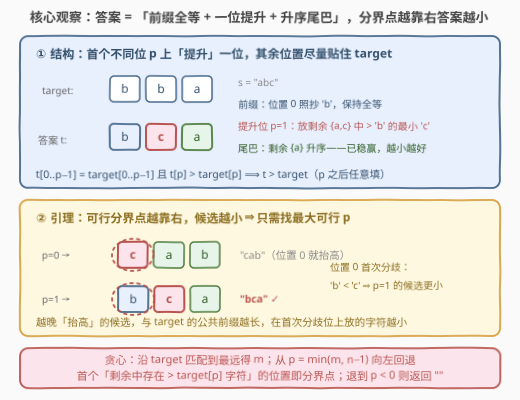
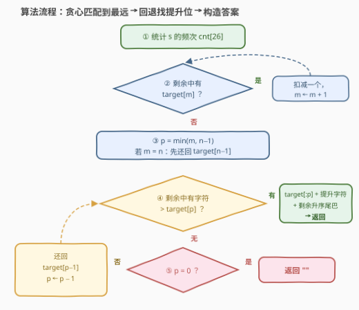

# 大于目标字符串的最小字典序排列

- **题目名称**：大于目标字符串的最小字典序排列
- **链接**：[3720. 大于目标字符串的最小字典序排列](https://leetcode.cn/problems/lexicographically-smallest-permutation-greater-than-target/)
- **难度**：中等
- **标签**：贪心、哈希表、字符串、计数

## 1. 题目概述

**题意**：给定两个长度均为 $n$ 且仅由小写字母组成的字符串 $s$ 和 $target$。返回 $s$ 的**字典序最小**的**排列**，要求该排列**严格大于** $target$；若不存在这样的排列，返回空字符串 `""`。

**示例 1**：

```text
输入：s = "abc", target = "bba"
输出："bca"
解释：s 的排列按字典序为 "abc","acb","bac","bca","cab","cba"，严格大于 "bba" 的最小者是 "bca"。
```

**示例 2**：

```text
输入：s = "leet", target = "code"
输出："eelt"
解释：s 的所有排列中，严格大于 "code" 的最小排列是 "eelt"。
```

**示例 3**：

```text
输入：s = "baba", target = "bbaa"
输出：""
解释：s 能拼出的最大排列恰为 "bbaa"，只能等于 target，没有严格更大的排列。
```

**约束条件**：

- $1 \le s.length = target.length \le 300$
- $s$ 和 $target$ 仅由小写英文字母组成

> 💡 **审题关键**：①「排列」= $s$ 的**多重集**重排——频次表 `cnt[26]` 就是全部资源，每个字符恰好用一次；② $target$ **不必是** $s$ 的排列（示例 1 中 `"bba"` 根本拼不出来），这与 [31. 下一个排列](../0001-0100/31_下一个排列.md)「在自身的排列格上走一步」有本质区别；③ 要求**严格**大于——若 $s$ 恰能拼成 $target$（示例 3），须继续找更大的；④ $n \le 300$ 允许 $O(26n)$ 的计数贪心，不必生成任何排列。

---

## 2. 解题思路

### 2.1 暴力思路

最直接的做法是把 $s$ 的全排列都生成一遍（或从 $s$ 排序后的最小排列开始不断 `next_permutation`），筛出 $> target$ 的最小者。排列数最坏 $O(n!)$，$n = 300$ 直接爆炸。

稍加观察可改进：$t > target$ 当且仅当 $t$ 与 $target$ 的**首个不同位**上 $t$ 放了更大的字符。于是可以**枚举分界位** $p \in [0, n-1]$：检查前缀 $target[0..p-1]$ 能否由 $s$ 的字符拼出（每个 $p$ 独立数一遍频次，$O(26n)$），再在扣除前缀后的剩余字符里找 $> target[p]$ 的最小者构造候选，最后取所有候选的最小值——总计 $O(26n^2)$，$n=300$ 约 $2.3 \times 10^6$ 次操作也能通过。但这个做法把每个 $p$ 当独立个体从头检查，下面的观察可以把平方降成线性。

### 2.2 核心观察：分界点 + 「越右越小」+ 贪心匹配回退



**观察一（分界点结构）**：$t > target$ $\iff$ 存在分界位 $p$：$t[0..p-1] = target[0..p-1]$ 且 $t[p] > target[p]$。$p$ 之后的字符**任意**——大小关系在位置 $p$ 就已分出胜负。

**观察二（固定 $p$ 的最小候选）**：若分界位取 $p$，则该前提下最小的 $t$ 为

$$\underbrace{target[0..p-1]}_{\text{照抄前缀}} + \underbrace{c}_{\substack{\text{剩余中} > target[p] \\ \text{的最小字符}}} + \underbrace{\text{剩余字符升序}}_{\text{已稳赢，怎么小怎么来}}$$

$p$ **可行** $\iff$ 前缀 $target[0..p-1]$ 能被 $s$ 的多重集满足，且扣除前缀后剩余中仍有字符 $> target[p]$。

**引理（越右越小）**：若 $p_1 < p_2$ 均可行，则候选($p_2$) < 候选($p_1$)。因为两者前 $p_1$ 位都与 $target$ 相同，而在位置 $p_1$：候选($p_1$) 放提升字符 $c_1 > target[p_1]$，候选($p_2$) 继续匹配放 $target[p_1]$ 本身——更小。**所以答案 = 最大可行分界位的候选**，根本无需比较所有候选。

**观察三（匹配最远处 $m$ 封顶可行域）**：沿 $target$ 从左到右「剩余里有 $target[i]$ 就扣掉它」地贪心匹配，能走到的最远位置记为 $m$。前缀 $target[0..p-1]$ 可满足 $\iff p \le m$（要延续前缀，位置 $i$ 只能放 $target[i]$，别无选择，匹配过程每步决策唯一）。

**算法成型**：先贪心匹配得 $m$（$O(n)$）；再从 $p = \min(m, n-1)$ 起向左回退——检查**当前剩余**中是否存在 $> target[p]$ 的字符（$O(26)$），若无则把 $target[p-1]$ **还回**计数、$p$ 减一继续；找到的第一个能提升的 $p$ 即答案分界位，套观察二构造；退到 $p < 0$ 说明 $s$ 拼不出更大的排列，返回 `""`。

> ⚠️ **为什么回退时是「还回 $target[p-1]$」？** 检查分界位 $p$ 时，计数表必须恰好是「扣除 $target[0..p-1]$ 后」的剩余。从 $p$ 降到 $p-1$，前缀缩短一位，多出来的自由度正是位置 $p-1$ 不再被强制放 $target[p-1]$——把它还回计数即可，无需从头重数。另外当 $m = n$（$s$ 恰能拼成整个 $target$，如示例 3）时，$p$ 上界是 $n-1$，须先把 $target[n-1]$ 还回再开始检查。

### 2.3 算法流程图



**文字版步骤**：

| 步骤 | 操作 | 说明 |
|------|------|------|
| ① 统计 | 数 $s$ 的频次 `cnt[26]` | 多重集是全部资源 |
| ② 匹配 | $m$ 从 0 起：`cnt[target[m]] > 0` 则扣减、$m{+}{+}$ | 决策唯一，走到最远得 $m$ |
| ③ 初始化 | $p = \min(m, n-1)$；若 $m = n$ 先还回 $target[n-1]$ | 可行分界位 $\le m$ 且 $\le n-1$ |
| ④ 检查 | 剩余中找 $> target[p]$ 的最小字符 | 找到 → 前缀 + 该字符 + 剩余升序，返回 |
| ⑤ 回退 | 无则还回 $target[p-1]$、$p{-}{-}$，回到 ④ | $p$ 减到 0 仍失败 → 返回 `""` |

### 2.4 示例演算

**示例 1**：$s = $ `"abc"`, $target = $ `"bba"`，初始 `cnt = {a:1, b:1, c:1}`：

| 步骤 | 操作 | 计数变化 | 结果 |
|------|------|----------|------|
| ② 匹配 $m{=}0$ | $target[0]=$ `b` 有 → 扣 | `{a:1, c:1}` | $m = 1$ |
| ② 匹配 $m{=}1$ | $target[1]=$ `b` 没有 → 停 | — | $m = 1$ |
| ④ 检查 $p{=}1$ | 剩余 $\{a, c\}$ 中 $>$ `b` 的最小是 `c` | `{a:1}` | 分界位找到 |
| 构造 | `"b"` + `"c"` + 升序 `"a"` | — | **`"bca"`** ✓ |

对照引理：$p = 0$ 其实也可行（候选 `"cab"`），但 $p = 1$ 的候选 `"bca"` 在位置 0 放 `b < c` 更小——「越右越小」正是只查最大可行 $p$ 的依据。

**示例 3**（回退到失败）：$s = $ `"baba"`, $target = $ `"bbaa"`：匹配一路扣完，$m = 4 = n$，还回 `a` 后从 $p = 3$ 逐位回退——$p=3,2$ 时剩余只有 `a`（不大于 `a`），$p=1,0$ 时剩余是 $\{a:2, b:2\}$ 中没有 $>$ `b` 的字符——每步都失败，退到 $p < 0$，返回 `""` ✓（`"bbaa"` 本身已是 $s$ 能拼出的最大排列）。

---

## 3. 参考代码

### C++

```cpp
class Solution {
  public:
    string lexGreaterPermutation(string s, string target) {
        int n = s.size();
        array<int, 26> cnt{};
        for (char c : s) ++cnt[c - 'a'];

        int m = 0;                                   // 贪心匹配：最远可满足前缀
        while (m < n && cnt[target[m] - 'a'] > 0) {
            --cnt[target[m] - 'a'];
            ++m;
        }

        int p = min(m, n - 1);
        if (m > p) ++cnt[target[m - 1] - 'a'];       // m == n：整串恰可拼成 target，回退一位

        while (p >= 0) {                             // 此刻 cnt 恰为扣除 target[0..p-1] 后的剩余
            int c = target[p] - 'a';
            int hi = -1;                             // 剩余中 > target[p] 的最小字符
            for (int k = c + 1; k < 26 && hi < 0; ++k)
                if (cnt[k] > 0) hi = k;
            if (hi >= 0) {                           // 找到提升位：前缀 + 提升 + 升序尾巴
                --cnt[hi];
                string res = target.substr(0, p);
                res.push_back('a' + hi);
                for (int k = 0; k < 26; ++k) res.append(cnt[k], 'a' + k);
                return res;
            }
            if (p == 0) break;
            ++cnt[target[p - 1] - 'a'];              // 前缀缩短一位：还回 target[p-1]
            --p;
        }
        return "";
    }
};
```

### Python

```python
class Solution:
    def lexGreaterPermutation(self, s: str, target: str) -> str:
        n = len(s)
        cnt = Counter(s)

        m = 0                              # 贪心匹配：最远可满足前缀 target[:m]
        while m < n and cnt[target[m]] > 0:
            cnt[target[m]] -= 1
            m += 1

        p = min(m, n - 1)
        if m > p:                          # m == n：整串恰可拼成 target，回退一位
            cnt[target[m - 1]] += 1

        while p >= 0:                      # cnt 恰为扣除 target[:p] 后的剩余
            hi = next((chr(k) for k in range(ord(target[p]) + 1, 123)
                       if cnt[chr(k)] > 0), '')
            if hi:                         # 找到提升位：前缀 + 提升 + 升序尾巴
                cnt[hi] -= 1
                return target[:p] + hi + ''.join(
                    k * v for k, v in sorted(cnt.items()))
            if p == 0:
                break
            cnt[target[p - 1]] += 1        # 前缀缩短一位：还回 target[p-1]
            p -= 1
        return ""
```

> 💡 **写法要点**：
> - 提升字符的查找是「$> target[p]$ 的**最小**」而非任意更大字符——同一个分界位下它让 $t[p]$ 尽可能小，且不占用尾巴里可能更小的字符。
> - 尾巴直接按 `a..z` 顺序把计数桶倒空，天然升序，无需再排序。
> - `m = n` 的分支千万别漏：它是「$s$ 恰能拼成 $target$」的情形（示例 3），此时没有任何位置还能延伸匹配，必须先还回最后一个字符才能开始回退检查。
> - `range(ord(target[p]) + 1, 123)` 即从 $target[p]+1$ 扫到 `z`（`ord('z') + 1 = 123`）。

---

## 4. 复杂度分析

| 维度 | 复杂度 | 说明 |
|------|--------|------|
| **时间复杂度** | $O(26n)$ | 匹配阶段 $O(n)$；回退至多 $n$ 步、每步查 26 个桶；构造 $O(n + 26)$ |
| **空间复杂度** | $O(26)$ | 一个计数数组（输出字符串不计） |

> 💡 $n = 300$ 时 $26n \approx 7.8 \times 10^3$，相比 $O(26n^2)$ 的逐位独立检查又快了 $n$ 倍；即便 $n$ 放大到 $10^6$ 本算法依然线性可过。

---

## 5. 扩展：「多重集跨过任意串」与 next_permutation 家族

[31. 下一个排列](../0001-0100/31_下一个排列.md)、[556. 下一个更大元素 III](../0501-0600/556_下一个更大元素 III.md) 回答的是「**给定一个串，求它自身排列格上的下一个**」：先从右找第一个降位，再在右侧后缀里找最小的大数交换、后缀升序——它们只在一个「排列格」内移动。本题则是「给定多重集，**跨过任意 target**」：$target$ 与 $s$ 的排列格毫无关系（可能拼不出来，如示例 1），所以不能排序后套 `next_permutation`；但骨架同源——**都是「尽量保住前缀 + 在某个位置放一个刚好大一点的字符 + 后缀取最小排列」**。31/556 的「保前缀」由右端最长非递减后缀自动决定，本题的「保前缀」则由贪心匹配 + 回退显式完成。

两个对称的变体值得顺手想一遍：

- **求小于 $target$ 的最大排列**：镜像做法——前缀尽量匹配，分界位放「剩余中 $< target[p]$ 的最大字符」，尾巴**降序**；同样取最大可行分界位。
- **字符集大小 $\sigma$ 一般化**：所有 26 替换成 $\sigma$，复杂度 $O(n\sigma)$；$\sigma$ 很大时可用有序多重集合（`TreeMap`/平衡树）维护剩余字符，单步查找降为 $O(\log \sigma)$，总 $O(n \log \sigma)$。

---

## 6. 面试要点

**Q1：为什么 $t > target$ 可以只看「首个不同位」？**

> 等长字符串比较规则：从左到右找第一处不同，谁在该位放的字大谁就大；全程相同则相等。所以 $t > target \iff$ 存在位置 $p$，使 $t[0..p-1]$ 与 $target$ 全等且 $t[p] > target[p]$。这个 $p$ 是唯一的（首个不同位），它把「构造 $t$」分解成「保前缀 + 提升一位 + 尾巴自由」三段。

**Q2：可行分界位有多个时，为什么取最靠右的？**

> 设 $p_1 < p_2$ 都可行。两个候选的前 $p_1$ 位都与 $target$ 相同；在位置 $p_1$，候选($p_1$) 放的是提升字符 $c_1 > target[p_1]$，而候选($p_2$) 因前缀更长仍放 $target[p_1]$ 本身——更小。故候选($p_2$) 严格更小，「越右越小」成立，只需检查从 $m$ 开始向左的第一个可行位。

**Q3：回退时把 $target[p-1]$ 还回计数，会不会漏掉或错算某些情形？**

> 不会。检查分界位 $p$ 的充要条件是「计数表恰好等于扣除 $target[0..p-1]$ 后的剩余」。$p$ 每减一，被扣除的强制前缀就短一位，唯一的变化正是 $target[p-1]$ 回归自由——还回即可精确维护这个不变量。整个过程每个字符至多被扣一次、还一次，匹配与回退合计仍是 $O(n)$ 次计数操作。

**Q4：匹配阶段「剩余里有 $target[i]$ 就用掉」为什么是安全的？**

> 要让分界位 $\ge i+1$，位置 $i$ 必须放 $target[i]$，这是唯一能延续全等前缀的选择，不存在「留着以后用更好」的取舍——不用它，$m$ 就停在 $i$，可行分界域只会更小。而 $m$ 越大，候选分界位的上界越高（越右越小），所以能匹配就匹配严格不劣。

**Q5：与 31「下一个排列」能否互相套用？**

> 不能直接套。31 的输入输出在同一个排列格内，`next_permutation` 只会走到「自身的下一个」；本题 $target$ 可以是任意串（甚至不是 $s$ 的排列），例如 $s=$ `"abc"`、$target=$ `"bba"`：$s$ 的排列格里跨过 `"bba"` 的最小排列是 `"bca"`，它既不是某个已知排列的「下一个」，也无法由 $target$ 变换得到。正确的统一视角是 Q1 的分界点结构：31/556 是其在「$target = $ 输入串本身」时的特例（此时 $m = n$ 必然成立，回退一步找到的提升位恰好等价于「第一个降位」）。

---

## 7. 同类练习题

- [31. 下一个排列](https://leetcode.cn/problems/next-permutation/)（[题解](../0001-0100/31_下一个排列.md)）：排列格内走一步——「保前缀 + 最小提升 + 升序尾巴」骨架的鼻祖，本题的 $target$ 特例
- [556. 下一个更大元素 III](https://leetcode.cn/problems/next-greater-element-iii/)（[题解](../0501-0600/556_下一个更大元素 III.md)）：把整数各位当字符集做「下一个排列」，多了位数溢出判定
- [1842. 下个由相同数字构成的回文串](https://leetcode.cn/problems/next-palindrome-using-same-digits/)（[题解](../1801-1900/1842_下个由相同数字构成的回文串.md)）：同一多重集思想加回文约束——只重排前半再镜像（会员题）
- [1754. 构造字典序最大的合并字符串](https://leetcode.cn/problems/largest-merge-of-two-strings/)（[题解](../1701-1800/1754_构造字典序最大的合并字符串.md)）：另一方向的字典序贪心构造——每步取让前缀更大的分支，与本题「每步取让前缀更小的分支」对偶
- [2375. 根据模式串构造最小数字](https://leetcode.cn/problems/construct-smallest-number-from-di-string/)（[题解](../2301-2400/2375_根据模式串构造最小数字.md)）：固定字符集 + 约束下的最小字典序构造，贪心 + 回退的同族练习
