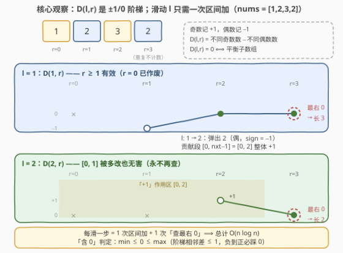
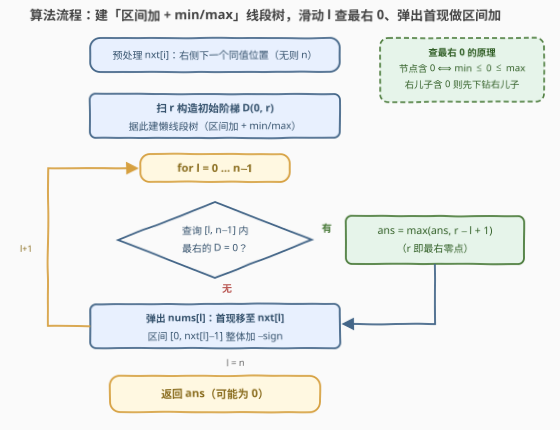

# LeetCode 最长平衡子数组 II 题解

## 1. 题目概述

- **标题 / 题号**：最长平衡子数组 II（#3721，hard）
- **链接**：https://leetcode.cn/problems/longest-balanced-subarray-ii/
- **难度**：困难
- **标签**：线段树、数组、哈希表、分治、前缀和

**题意**：给定一个整数数组 `nums`。如果子数组中**不同偶数**的数量等于**不同奇数**的数量，则称该子数组为**平衡的**。返回**最长平衡子数组**的长度。子数组是数组中连续且非空的一段元素序列。

**示例 1**：

```text
输入：nums = [2,5,4,3]
输出：4
解释：最长平衡子数组是 [2,5,4,3]。它有 2 个不同偶数 {2,4} 和 2 个不同奇数 {5,3}。
```

**示例 2**：

```text
输入：nums = [3,2,2,5,4]
输出：5
解释：最长平衡子数组是 [3,2,2,5,4]。它有 2 个不同偶数 {2,4} 和 2 个不同奇数 {3,5}。
```

**示例 3**：

```text
输入：nums = [1,2,3,2]
输出：3
解释：最长平衡子数组是 [2,3,2]。它有 1 个不同偶数 {2} 和 1 个不同奇数 {3}。
```

**约束**：

- $1 \le nums.length \le 10^5$
- $1 \le nums[i] \le 10^5$

> 💡 **审题关键**：① 数的是「**不同**」值的个数——重复元素不贡献，如 $[2,2,3]$ 的不同偶数只有 $\{2\}$ 一个，恰好与一个奇数 $\{3\}$ 平衡；② 单个元素永不平衡（一边 1、一边 0），所以**答案可能为 0**（如 $[2,4,6]$）；③ 与 [3719. 最长平衡子数组 I](https://leetcode.cn/problems/longest-balanced-subarray-i/)（$n \le 1500$，$O(n^2)$ 可过）同题面，本题 $n$ 放大到 $10^5$，必须做到 $O(n \log n)$。

## 2. 解题思路

### 2.1 暴力思路：枚举左端点，逐个判定

预处理 $prev[r]$（$r$ 左侧上一个等于 $nums[r]$ 的位置，无则 $-1$）。枚举左端点 $l$，右端点 $r$ 从 $l$ 起推进：$nums[r]$ 是窗口 $[l, r]$ 内的**新**不同值 $\iff prev[r] < l$，此时累加 $sign$（奇 $+1$、偶 $-1$）到计数器 $D$；每步检查 $D = 0$ 即结算 $r - l + 1$。总计 $O(n^2)$——$n = 1500$ 的 I 版绰绰有余，$n = 10^5$ 时 $10^{10}$ 次操作必然超时。

> 💡 暴力的浪费在于：相邻两个 $l$ 对应的整条「判定曲线」几乎一模一样——$l$ 右移一格，只有被弹出的那**一个**值的首现位置变了。$O(n^2)$ 等于把 $n$ 份近乎相同的曲线各算一遍。此外还要先排除两条歧路：
>
> - **双指针失效**：合法性对窗口扩张**不单调**。固定 $r=2$ 看 $[1,2,3]$：$l=2$ 不平衡（$\{3\}$）、$l=1$ 平衡（$\{2,3\}$）、$l=0$ 又不平衡（$\{1,2,3\}$，两奇一偶）——左端收缩过程中合法/非法交替出现，标准滑窗会错过中间的合法段。根源是 $D$ 随 $r$ 是一条来回穿越 $0$ 的阶梯，不是单调量。
> - **前缀哈希失效**：[525. 连续数组](https://leetcode.cn/problems/contiguous-array/)、[1371. 每个元音包含偶数次的最长子字符串](https://leetcode.cn/problems/find-the-longest-substring-containing-vowels-in-even-counts/) 一族把「子串性质」写成「前缀状态之差」，前提是所数的量**可加可逆**。本题数的是**不同值个数**：一个值在 $(l, r]$ 里是否首现取决于 $l$ 的位置，无法由两个前缀的状态差恢复——「去重」是有损压缩，前缀状态带不动它。

### 2.2 核心观察：首现贡献阶梯 + 滑动左端点的懒惰线段树



**观察一（符号化）**：奇数记 $+1$、偶数记 $-1$，定义

$$D(l, r) = \#\text{不同奇数}(l, r) - \#\text{不同偶数}(l, r)$$

则「平衡 $\iff D(l, r) = 0$」，目标是 $\max\,(r - l + 1)$。

**观察二（首现贡献）**：固定 $l$ 让 $r$ 增大，只有 $nums[r]$ 是窗口内**首次出现**的值时 $D$ 才 $\pm 1$，重复值步长为 $0$。因此 $D(l, r) = \sum_v sign(v)\cdot[\text{first}_{\ge l}(v) \le r]$：每个值 $v$ 的贡献是一段「从它在 $[l..]$ 中首现位置开始的水平线段」，$D(l, \cdot)$ 整体是一条**步长 $\in \{-1, 0, +1\}$ 的阶梯线**。这条阶梯有两个后果：

- 同一个 $l$ 下 $D$ 可能**多次穿 0**，最优 $r$ 取**最右**零点；
- 连续一段下标里，只要最小值 $\le 0 \le$ 最大值，中间**必踩到 0**（相邻差不超过 1，从负到正必经 0）——$\{-1, +1\}$ 这种「夹 0 却无 0」的状态不可能出现在连续段里。

**观察三（滑动 $l$ 只改一段）**：$l \to l+1$ 时，所有值的首现位置都不变，唯一的例外是 $v = nums[l]$——它恰好在 $l$ 首现，弹出后首现跳到 $nxt[l]$（$l$ 右侧下一个同值位置，无则 $n$）。于是整条阶梯只需**一次区间加**：

$$D(l+1,\, r) = D(l,\, r) - sign(v), \quad r \in [\,l,\ nxt[l]-1\,]$$

（$r \ge nxt[l]$ 的部分 $v$ 依然首现于 $nxt[l] \le r$，贡献不变；$r < l$ 的表项已作废，永不再查，所以区间加直接写 $[0,\ nxt[l]-1]$，连与 $l$ 取 max 都省了。）

**观察四（数据结构）**：把 $D(l, \cdot)$ 存进支持**区间加**的懒惰线段树，每个节点维护 $\min$ 与 $\max$：

- **含 0 判定**：节点（连续段）含 0 $\iff \min \le 0 \le \max$。⚠️ 必须同时维护 $\min$ **和** $\max$：只看 $\min$ 时「$\min = 0 \iff$ 含 0」是错的——$\{-1, 0\}$ 的 $\min$ 是 $-1$ 却含 0；而「$\min \le 0 \le \max \Rightarrow$ 含 0」又要靠观察二的阶梯性质排除 $\{-1, +1\}$。该性质只对有效区 $[l, n-1]$ 成立（作废区被历史更新改得不成阶梯），因此**下钻定位只发生在被查询区间整段覆盖的节点上**，作废区的乱值永远不会被触达。
- **查最右零点**：自顶向下**右儿子优先**下钻（右儿子 $\min \le 0 \le \max$ 则答案在其内，否则必在左儿子），$O(\log n)$ 定位。
- 区间加对 $\min/\max$ 就是整段平移，懒惰标记天然兼容。

### 2.3 算法流程图



**文字版步骤**：

| 步骤 | 操作 | 说明 |
|------|------|------|
| ① 预处理 | 倒序扫一遍求 $nxt[i]$（右侧下一个同值位置，无则 $n$） | 哈希表记 `last`，$O(n)$ |
| ② 建树 | 正序扫 $r$ 求初始阶梯 $D(0, r)$（值首现时累加 $sign$），据此建线段树 | $O(n)$ |
| ③ 结算 | $l$ 从 $0$ 到 $n-1$：查询 $[l, n-1]$ 内最右零点 $r$，有则 $ans = \max(ans,\ r - l + 1)$ | $O(\log n)$ |
| ④ 滑动 | 弹出 $nums[l]$：区间 $[0,\ nxt[l]-1]$ 整体加 $-sign(nums[l])$ | $O(\log n)$ |
| ⑤ 收尾 | 循环结束返回 $ans$（可能为 $0$，无需特判） | 总计 $O(n \log n)$ |

### 2.4 示例演算

以示例 3 $nums = [1,2,3,2]$ 为例（$n = 4$；$sign$：$1 \to +1$，$2 \to -1$，$3 \to +1$；$nxt = [4, 3, 4, 4]$）。表中「—」表示已作废、不再查询的位置：

| $l$ | 树上有效值 $D(l, r)$，$r = 0 \dots 3$ | 最右 0 | 本轮长度 | 滑动：弹出 / 区间加 |
|-----|--------------------------------------|--------|----------|---------------------|
| 0 | $1,\ 0,\ 1,\ 1$ | $r = 1$ | 2 | 弹 $1$（奇 $+1$，无下次 $\Rightarrow nxt = 4$）：$[0,3]$ 加 $-1$ |
| 1 | —，$\ -1,\ 0,\ 0$ | $r = 3$ | **3** ✓ | 弹 $2$（偶 $-1$，下次出现 $3$）：$[0,2]$ 加 $+1$ |
| 2 | —， —，$\ 1,\ 0$ | $r = 3$ | 2 | 弹 $3$（奇 $+1$，无下次）：$[0,3]$ 加 $-1$ |
| 3 | —， —， —，$\ -1$ | 无 | — | 弹 $2$：$[0,3]$ 加 $+1$（循环结束） |

最终 $ans = 3$，对应子数组 $nums[1..3] = [2,3,2]$ ✓。注意 $l=1$ 行：弹出 $2$ 后它的首现从 $1$ 跳到 $3$，贡献段 $[0, nxt-1] = [0,2]$ 整体 $+1$，其中 $[0,0]$ 是多改的作废区——无害；$r = 3$ 处 $2$ 重复出现、不再计入，$D(1,3)$ 保持 $0$。

## 3. 参考代码

### C++

```cpp
class Solution {
    int n;
    vector<int> mn, mx, tag;

    void pushUp(int p) {
        mn[p] = min(mn[2 * p], mn[2 * p + 1]);
        mx[p] = max(mx[2 * p], mx[2 * p + 1]);
    }
    void pushDown(int p) {
        if (tag[p]) {
            for (int c = 2 * p; c <= 2 * p + 1; ++c) {
                mn[c] += tag[p];
                mx[c] += tag[p];
                tag[c] += tag[p];
            }
            tag[p] = 0;
        }
    }
    void build(int p, int l, int r, const vector<int>& a) {
        if (l == r) {
            mn[p] = mx[p] = a[l];
            return;
        }
        int m = (l + r) / 2;
        build(2 * p, l, m, a);
        build(2 * p + 1, m + 1, r, a);
        pushUp(p);
    }
    void add(int p, int l, int r, int ql, int qr, int v) {
        if (qr < l || r < ql) return;
        if (ql <= l && r <= qr) {
            mn[p] += v;
            mx[p] += v;
            tag[p] += v;
            return;
        }
        pushDown(p);
        int m = (l + r) / 2;
        add(2 * p, l, m, ql, qr, v);
        add(2 * p + 1, m + 1, r, ql, qr, v);
        pushUp(p);
    }
    // [ql, qr] 内最右的值为 0 的下标；不存在返回 -1
    int query(int p, int l, int r, int ql, int qr) {
        if (qr < l || r < ql || mn[p] > 0 || mx[p] < 0) return -1;  // 整段无 0
        if (ql <= l && r <= qr) {                                   // 整段包含：右先下钻
            while (l < r) {
                pushDown(p);
                int m = (l + r) / 2;
                if (mn[2 * p + 1] <= 0 && mx[2 * p + 1] >= 0) {
                    p = 2 * p + 1;
                    l = m + 1;
                } else {
                    p = 2 * p;
                    r = m;
                }
            }
            return l;  // 叶子处必有 mn == mx == 0
        }
        pushDown(p);
        int m = (l + r) / 2;
        int res = query(2 * p + 1, m + 1, r, ql, qr);
        if (res == -1) res = query(2 * p, l, m, ql, qr);
        return res;
    }

  public:
    int longestBalanced(vector<int>& nums) {
        n = nums.size();
        vector<int> nxt(n);
        {
            unordered_map<int, int> last;
            for (int i = n - 1; i >= 0; --i) {
                auto it = last.find(nums[i]);
                nxt[i] = (it == last.end()) ? n : it->second;
                last[nums[i]] = i;
            }
        }
        vector<int> d0(n);
        {
            unordered_set<int> seen;
            int d = 0;
            for (int r = 0; r < n; ++r) {
                if (seen.insert(nums[r]).second) d += (nums[r] % 2 ? 1 : -1);
                d0[r] = d;
            }
        }
        mn.assign(4 * n, 0);
        mx.assign(4 * n, 0);
        tag.assign(4 * n, 0);
        build(1, 0, n - 1, d0);

        int ans = 0;
        for (int l = 0; l < n; ++l) {
            int r = query(1, 0, n - 1, l, n - 1);
            if (r != -1) ans = max(ans, r - l + 1);
            add(1, 0, n - 1, 0, nxt[l] - 1, nums[l] % 2 ? -1 : 1);  // 弹出首现
        }
        return ans;
    }
};
```

### Python

```python
class Solution:
    def longestBalanced(self, nums: List[int]) -> int:
        n = len(nums)

        nxt = [n] * n                       # nxt[i]：右侧下一个同值位置，无则 n
        last = {}
        for i in range(n - 1, -1, -1):
            nxt[i] = last.get(nums[i], n)
            last[nums[i]] = i

        d0 = [0] * n                        # 初始阶梯 D(0, r)
        seen = set()
        d = 0
        for r, v in enumerate(nums):
            if v not in seen:
                seen.add(v)
                d += 1 if v & 1 else -1
            d0[r] = d

        mn = [0] * (4 * n)                  # 懒线段树：区间加 + min/max
        mx = [0] * (4 * n)
        tag = [0] * (4 * n)

        def push_down(p):
            if tag[p]:
                for c in (2 * p, 2 * p + 1):
                    mn[c] += tag[p]
                    mx[c] += tag[p]
                    tag[c] += tag[p]
                tag[p] = 0

        def build(p, l, r):
            if l == r:
                mn[p] = mx[p] = d0[l]
                return
            m = (l + r) >> 1
            build(2 * p, l, m)
            build(2 * p + 1, m + 1, r)
            mn[p] = min(mn[2 * p], mn[2 * p + 1])
            mx[p] = max(mx[2 * p], mx[2 * p + 1])

        def add(p, l, r, ql, qr, v):
            if qr < l or r < ql:
                return
            if ql <= l and r <= qr:
                mn[p] += v
                mx[p] += v
                tag[p] += v
                return
            push_down(p)
            m = (l + r) >> 1
            add(2 * p, l, m, ql, qr, v)
            add(2 * p + 1, m + 1, r, ql, qr, v)
            mn[p] = min(mn[2 * p], mn[2 * p + 1])
            mx[p] = max(mx[2 * p], mx[2 * p + 1])

        def query(p, l, r, ql, qr):         # [ql, qr] 内最右零点，无则 -1
            if qr < l or r < ql or mn[p] > 0 or mx[p] < 0:
                return -1                   # 整段无 0
            if ql <= l and r <= qr:         # 整段包含：右先下钻
                while l < r:
                    push_down(p)
                    m = (l + r) >> 1
                    if mn[2 * p + 1] <= 0 <= mx[2 * p + 1]:
                        p, l = 2 * p + 1, m + 1
                    else:
                        p, r = 2 * p, m
                return l
            push_down(p)
            m = (l + r) >> 1
            res = query(2 * p + 1, m + 1, r, ql, qr)
            if res == -1:
                res = query(2 * p, l, m, ql, qr)
            return res

        build(1, 0, n - 1)
        ans = 0
        for l in range(n):
            r = query(1, 0, n - 1, l, n - 1)
            if r != -1:
                ans = max(ans, r - l + 1)
            add(1, 0, n - 1, 0, nxt[l] - 1, -1 if nums[l] & 1 else 1)
        return ans
```

> 💡 **写法要点**：
> - 区间加从 $0$ 而不是 $l$ 开始：$r < l$ 的表项已作废、永不再查，多改无害，省去与 $l$ 取 max 的边界处理。
> - 查询的「右先下钻」只发生在**整段被 $[l, n-1]$ 包含**的节点上——「$\min \le 0 \le \max \Rightarrow$ 含 0」依赖阶梯性质，而阶梯性质只在有效区成立；部分覆盖的节点只做「整段无 0」的保守剪枝（$\min > 0$ 或 $\max < 0$），继续递归。
> - 答案可能为 0（如全偶数组），`ans` 初值 0 即可，无需特判；单元素子数组因 $D = \pm 1$ 天然不会被误结算。
> - `query` 下钻到叶子时值必为 0：路径上每个被进入的子树都满足 $\min \le 0 \le \max$，叶子处即 $\min = \max = 0$。

## 4. 复杂度分析

| 维度 | 复杂度 | 说明 |
|------|--------|------|
| **时间复杂度** | $O(n \log n)$ | 预处理与建树 $O(n)$；每个 $l$ 做一次查询 + 一次区间加，各 $O(\log n)$ |
| **空间复杂度** | $O(n)$ | 线段树 $3 \times 4n$ 个 int + $nxt$ 数组 + 哈希表 |

> ⚠️ Python 递归版在 $n = 10^5$ 时约 $2 \times 10^6$ 次递归调用，CPython 实测约 2s，卡常可把 `query`/`add` 改成迭代或用 PyPy；C++ 版毫秒级。

## 5. 扩展：镜像写法与「首现贡献」家族

- **镜像写法（提示语中的「线段树建在左端点上」）**：对称地固定 $r$、滑 $r$。令 $A[l] = D(l, r)$（$l \le r$，树建在 $l$ 上）。$r \to r+1$ 时，$v = nums[r+1]$ 的「最后出现位置」从 $prev$ 跳到 $r+1$，于是 $v$ 开始对左端点区间 $[\,prev+1,\ r+1\,]$ 贡献 $sign(v)$——一次区间加；随后查询 $[0, r]$ 内**最左**零点 $l$ 结算。与本文写法完全对偶，复杂度相同，本质是同一个「固定一端、动态维护另一端」的套路照了镜子。
- **首现贡献家族**：[2262. 字符串的总引力](https://leetcode.cn/problems/total-appeal-of-a-string/)、[828. 统计子串中的唯一字符](https://leetcode.cn/problems/count-unique-characters-of-all-substrings-of-a-given-string/) 把同一套「值只在首现处贡献、覆盖一段端点区间」的数学用于**求和**；本题用于**判定 0**，于是线段树还要支持动态区间加与零点定位。
- **如果把「不同」改成「出现次数」**：$D(l, r) = \#奇次数 - \#偶次数$ 立刻变成前缀可差分的量，回到 [525. 连续数组](https://leetcode.cn/problems/contiguous-array/)「前缀差 + 首现哈希」的 $O(n)$ 世界。「不同」两个字正是本题从中等难度跃升为困难的那两个字。

## 6. 面试要点

**Q1：为什么滑动窗口/双指针在这里不适用？**

> 合法性对窗口扩张不单调：新元素的 $sign$ 可 $+1$ 可 $-1$，$D(l, r)$ 随 $r$ 是来回穿越 0 的阶梯。反例固定 $r=2$、数组 $[1,2,3]$：$l=2$ 非法 $\to l=1$ 合法 $\to l=0$ 又非法，左端收缩会错过中间合法段。凡「条件非单调」的最长子数组题，双指针都不可用——量可差分时转前缀状态哈希，不可差分时转本文的动态维护。

**Q2：为什么 525/1371 式「前缀状态 + 哈希首现」在这里失效？**

> 那一族要求子数组量 $=$ 两个前缀状态之差，即量的可加可逆性。不同值个数不可加：值 $v$ 在 $(l, r]$ 中是否首现取决于 $l$ 的位置，无法由 $f(0, r) - f(0, l)$ 恢复。「去重」是有损压缩，前缀状态带不动它——这正是必须换数据结构动态维护的原因。

**Q3：线段树为什么必须同时维护 min 和 max？**

> 「节点含 0」的判定是 $\min \le 0 \le \max$：$\min > 0$ 或 $\max < 0$ 都能排除 0。只维护 $\min$ 不行——$\{-1, 0\}$ 的 $\min$ 是 $-1 \ne 0$ 却含 0，会漏报。而「$\min \le 0 \le \max \Rightarrow$ 含 0」还需阶梯性质（相邻差 $\le 1$，负到正必经 0）排除 $\{-1, +1\}$；该性质只在有效区 $[l, n-1]$ 成立，所以下钻只对被查询区间整段覆盖的节点进行。

**Q4：为什么查询「最右零点」？为什么区间加写 $[0, nxt-1]$ 而不是 $[l, nxt-1]$？**

> 前者：同一 $l$ 的阶梯可能多次穿 0，零点中最右者才给出该 $l$ 的最长子数组；实现上右儿子优先下钻即是。后者：$r < l$ 的表项已作废、永不再查，多改无害，直接加 $[0, nxt-1]$ 省掉与 $l$ 的边界处理。

**Q5：答案何时为 0？算法如何自然覆盖？**

> 当所有子数组都「一边倒」时无平衡子数组，如全偶数组 $[2,4,6]$（任何子数组奇数种数为 0、偶数种数 $\ge 1$）。算法中每次查询都因整段 $\min > 0$（或 $\max < 0$）返回 $-1$，`ans` 保持初值 0，无需任何特判。

## 同类练习题

| # | 题目 | 与本题的关联 |
|---|------|-------------|
| 3719 | [最长平衡子数组 I](https://leetcode.cn/problems/longest-balanced-subarray-i/) | 同题面小数据版（$n \le 1500$），用 $prev[r] < l$ 判新值的 $O(n^2)$ 即可——正是本文 2.1 的暴力 |
| 525 | [连续数组](https://leetcode.cn/problems/contiguous-array/)（[题解](../0501-0600/525_连续数组.md)） | 「出现次数」版平衡——前缀差 + 首现哈希 $O(n)$；对照理解「不同」二字为何逼出线段树 |
| 2262 | [字符串的总引力](https://leetcode.cn/problems/total-appeal-of-a-string/)（[题解](../2201-2300/2262_字符串的总引力.md)） | 同一套「首现贡献覆盖一段端点区间」用于求和，本文用于判定 0 |
| 962 | [最大宽度坡](https://leetcode.cn/problems/maximum-width-ramp/)（[题解](../0901-1000/962_最大宽度坡.md)） | 同是 $\max(r - l + 1)$ 且条件非窗口单调，用单调栈解决——不同结构、同一目标函数 |
| 1438 | [绝对差不超过限制的最长连续子数组](https://leetcode.cn/problems/longest-continuous-subarray-with-absolute-diff-less-than-or-equal-to-limit/)（[题解](../1401-1500/1438_绝对差不超过限制的最长连续子数组.md)） | 条件单调（窗口越大越难合法）→ 双指针 + 有序集合即可——「何时双指针够用」的对照样本 |
