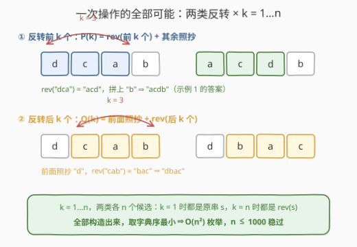
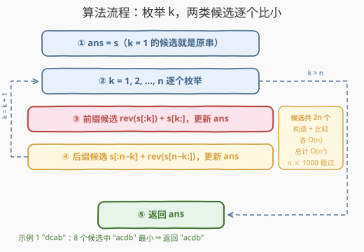

# 反转后字典序最小的字符串

- **题目名称**：反转后字典序最小的字符串
- **链接**：[3722. 反转后字典序最小的字符串](https://leetcode.cn/problems/lexicographically-smallest-string-after-reverse/)
- **难度**：中等
- **标签**：字符串、枚举、双指针、二分查找

## 1. 题目概述

给你一个由小写英文字母组成、长度为 $n$ 的字符串 `s`。你必须**恰好执行一次**操作：选择一个整数 $k$（$1 \le k \le n$），然后执行以下两个选项之一：

- 反转 `s` 的**前 $k$ 个**字符；或
- 反转 `s` 的**后 $k$ 个**字符。

返回在恰好执行一次此类操作后可以获得的**字典序最小**的字符串。

如果字符串 `a` 和 `b` 在第一个不同的位置上，`a` 中的字母在字母表中比 `b` 中对应的字母出现得更早，则称 `a` 字典序小于 `b`；若前 $\min(|a|, |b|)$ 个字符都相同，则较短的字符串字典序较小。

**示例 1**：

```text
输入：s = "dcab"
输出："acdb"
解释：选择 k = 3，反转前 3 个字符，"dca" → "acd"，得到 "acdb"。
```

**示例 2**：

```text
输入：s = "abba"
输出："aabb"
解释：选择 k = 3，反转后 3 个字符，"bba" → "abb"，得到 "aabb"。
```

**示例 3**：

```text
输入：s = "zxy"
输出："xzy"
解释：选择 k = 2，反转前 2 个字符，"zx" → "xz"，得到 "xzy"。
```

**约束条件**：

- $1 \le n = |s| \le 1000$
- `s` 仅由小写英文字母组成

> 💡 **审题关键**：① 操作的自由度只有两个——**方向**（前/后）与**长度** $k$（$1 \le k \le n$），因此所有可达结果**至多 $2n$ 个**；② 「恰好一次」不是负担：$k = 1$ 时反转 1 个字符等于没动，原串 $s$ 本身就在候选集中，**答案 $\preceq s$ 恒成立**；③ 操作是**整段反转**而非任意交换，"把字符串排个序"通常不可达（见 2.1 的反例）；④ $n \le 1000$ 是明确的复杂度暗示：$O(n^2)$ 约 $2 \times 10^6$ 量级可过——官方提示也直白地写着 "Use bruteforce"。

---

## 2. 解题思路

### 2.1 暴力思路：先排除"贪心"的诱惑

这题第一眼很像贪心：把最小的字符弄到开头不就好了？但操作被严格限定为「**整段反转一个前缀或后缀**」，既不能任意交换两个字符，也不能只重排某一段。举个反例：

> `s = "bca"`：全部候选只有 `bca` / `cba` / `acb` / `bac`（见 2.4 的枚举表），字典序最小是 **`acb`**——而"排序"得到的 `abc` 根本不可达。直觉里的"最优形状"往往不在可达集合里。

既然猜结论不可靠，那就把**可达集合完整枚举出来**：操作由「方向 × $k$」唯一决定，共 $2n$ 种组合，每种花 $O(n)$ 构造字符串并比较——总计 $O(n^2)$，在 $n \le 1000$ 下约 $2 \times 10^6$ 次字符操作，稳过。

### 2.2 核心观察：候选全集只有 $2n$ 个



把两类操作的结果写成公式（记 $\mathrm{rev}$ 为字符串反转）：

$$P(k) = \mathrm{rev}(s[0..k{-}1]) + s[k..n{-}1] \qquad Q(k) = s[0..n{-}k{-}1] + \mathrm{rev}(s[n{-}k..n{-}1])$$

- **前缀候选 $P(k)$**：首位变成 $s[k{-}1]$——原串第 $k$ 个字符被"翻"到了开头，其余字符依次后移；
- **后缀候选 $Q(k)$**：前 $n-k$ 位**原封不动**，从第 $n-k$ 位起接上倒写的尾巴；
- **边界重合**：$k = 1$ 时 $P(1) = Q(1) = s$（反转 1 个字符，等价于"不改动"）；$k = n$ 时 $P(n) = Q(n) = \mathrm{rev}(s)$（整串反转）。

这 $2n$ 个候选（去重后可能更少）**不重不漏**地覆盖了题目允许的全部结果——因为操作空间本来就只有「方向 × $k$」两个自由度。答案就是：

$$\text{ans} = \min_{1 \le k \le n} \bigl\{\, P(k),\; Q(k) \,\bigr\}$$

> 💡 一句话：别猜最优操作长什么样——操作空间只有 $2n$ 格，全部造出来取最小，既最稳妥、又已是本题预期解。

### 2.3 算法流程图



**逻辑执行步骤**：

| 步骤 | 操作 | 说明 |
|------|------|------|
| ① 初始化 | `ans = s` | $k=1$ 的候选就是原串，直接当初始答案 |
| ② 枚举 $k$ | $k = 1, 2, \dots, n$ | 外层循环同时驱动两类候选 |
| ③ 前缀候选 | 构造 $P(k) = \mathrm{rev}(s[:k]) + s[k:]$ | 反转前 $k$ 个，与 `ans` 比小 |
| ④ 后缀候选 | 构造 $Q(k) = s[:n{-}k] + \mathrm{rev}(s[n{-}k:])$ | 反转后 $k$ 个，与 `ans` 比小 |
| ⑤ 循环推进 | $k = k + 1$，回到 ② | $k > n$ 时跳出 |
| ⑥ 返回 | 输出 `ans` | 即全部候选的字典序最小值 |

> ⚠️ ③ 与 ④ 是**并列**的两步而非二选一：同一个 $k$ 下前缀、后缀各产生一个候选，都要参与比较；$k = n$ 时两者恰好相等（都是整串反转），多比一次无害。

### 2.4 示例演算

**示例 1：`s = "dcab"`，全部 8 个候选**：

| $k$ | 前缀候选 $P(k)$ | 后缀候选 $Q(k)$ |
|-----|-----------------|-----------------|
| 1 | `dcab`（$= s$） | `dcab`（$= s$） |
| 2 | `cdab` | `dcba` |
| 3 | **`acdb`** ← 答案 | `dbac` |
| 4 | `bacd`（$= \mathrm{rev}(s)$） | `bacd`（$= \mathrm{rev}(s)$） |

最小值为 `acdb` ✓——正是"把全局最小字符 `'a'` 翻到开头"的那次前缀反转（$k = 3$）。

**示例 2 / 3 快速核对**：`"abba"` 的候选中 $Q(3) = $ `"a" + rev("bba") = "aabb"` 最小——答案来自**后缀**反转，且原串本来就以最小字符开头（这正是 2.1 贪心直觉失效、必须老实枚举后缀侧的例证）；`"zxy"` 中 $P(2) = \mathrm{rev}(\text{"zx"}) + \text{"y"} = $ `"xzy"` 最小。

**边界情形**：$n = 1$ 时唯一的候选就是 $s$ 本身；整串已是最小排列（如 `"abc"`）时，最优操作就是 $k = 1$ 的"空转"，返回原串。

---

## 3. 参考代码

### C++

```cpp
class Solution {
public:
    string lexSmallest(string s) {
        int n = s.size();
        string ans = s;
        for (int k = 1; k <= n; ++k) {
            string a = s;
            reverse(a.begin(), a.begin() + k);
            if (a < ans) ans = a;
            string b = s;
            reverse(b.end() - k, b.end());
            if (b < ans) ans = b;
        }
        return ans;
    }
};
```

> 💡 **写法要点**：
> - `ans` 初始化为 `s`，等价于先计入 $k = 1$ 的候选（反转 1 个字符等于原串），循环内不必再特判"不操作"；
> - 每个 $k$ 复制两份原串分别反转前/后 $k$ 个字符，`string` 的 `<` 就是字典序比较；$k = n$ 时两个候选同为整串反转，重复比较无害；
> - `reverse(b.end() - k, b.end())` 与 `reverse(a.begin(), a.begin() + k)` 完全对称——反转的是 **$k$ 个**字符，别错写成"从下标 $k$ 开始"。

### Python

```python
class Solution:
    def lexSmallest(self, s: str) -> str:
        n = len(s)
        ans = s
        for k in range(1, n + 1):
            ans = min(ans, s[:k][::-1] + s[k:], s[:n - k] + s[n - k:][::-1])
        return ans
```

> 💡 **写法要点**：
> - `s[:k][::-1] + s[k:]` 即 $P(k)$，`s[:n-k] + s[n-k:][::-1]` 即 $Q(k)$，切片天然处理 $k = n$ 时 `s[:0]` 为空串的边界，无须特判；
> - 一行 `min` 同时比较原 `ans` 与两个新候选，三个参数逐位取字典序最小。

---

## 4. 复杂度分析

| 维度 | 复杂度 | 说明 |
|------|--------|------|
| **时间** | $O(n^2)$ | $2n$ 个候选，每个 $O(n)$ 构造 + $O(n)$ 比较；$n = 1000$ 时约 $2 \times 10^6$ 次字符级操作，距常规红线还有两个数量级余量 |
| **空间** | $O(n)$ | 同时只存 `ans` 与当前候选，不超过两个长度 $n$ 的串 |
| **量级判断** | $n \le 1000$ | 官方提示 "Use bruteforce"——数据范围就是为 $O(n^2)$ 枚举量身定制的 |

---

## 5. 扩展：候选剪枝——从 $2n$ 个砍到 $O(\text{occ})$ 个

$O(n^2)$ 在本题约束下绰绰有余，但若把 $n$ 抬到 $10^5$ 以上，逐个构造比较就行不通了。两条剪枝思路（也解释了题目标签里 **Binary Search** 的由来）：

**剪枝一：前缀候选的首位必须是全局最小字符。** $P(k)$ 的首位是 $s[k-1]$。记 $c = \min(s)$，若 $s[k-1] > c$，任取一个满足 $s[p] = c$ 的位置 $p$，则候选 $P(p+1)$ 的首位是 $c < s[k-1]$，在**第一位**就把 $P(k)$ 严格压死。于是前缀侧只需保留 $k \in \{\, p+1 : s[p] = c \,\}$，候选数从 $n$ 降到最小字符的出现次数。

**剪枝二：后缀侧看 $s[0]$ 与 $c$ 的大小关系。** $Q(k)$（$k < n$）的首位恒为 $s[0]$，与 $k$ 无关：

- 若 $s[0] > c$：所有 $k < n$ 的后缀候选在第一位就输给剪枝一的前缀候选；只剩 $Q(n) = \mathrm{rev}(s)$，且仅当 $s[n-1] = c$ 时才有一战之力；
- 若 $s[0] = c$（如示例 2 的 `"abba"`）：首位信息完全无法区分后缀候选，一个都剪不得——那题的答案恰恰来自 $Q(3)$。

拿 `"dcab"` 演示：$c = $ `'a'` 只出现在下标 $2$，前缀候选只剩 $P(3)$；$s[0] = $ `'d' > 'a'` 且 $s[3] = $ `'b' > 'a'`，后缀候选全灭。**8 个候选砍到 1 个**，且恰是答案 `acdb`。

> ⚠️ 剪枝只减少候选**个数**，候选之间的比较仍可能很"深"——两个同以 $c$ 开头的候选，也许要比到很靠后的位置才分胜负。想让每次比较降到 $O(\log n)$，可以对 `s` 与 $\mathrm{rev}(s)$ 预处理**字符串哈希**，比较两个候选时**二分**它们的最长公共前缀长度、$O(\log n)$ 定位首位差异，整体做到 $O(n \log n)$。对 $n \le 1000$ 属于杀鸡用牛刀，但"枚举空间小就全枚举、大了就剪枝 + 哈希二分"的分层思路值得收藏。

---

## 6. 面试要点

**Q1：为什么枚举 $2n$ 个候选是不重不漏的？**

> 一次操作 = 方向（前/后）× 长度 $k \in [1, n]$，操作结果由这两者唯一决定，因此可达结果集合就是 $\{P(k)\} \cup \{Q(k)\}$，至多 $2n$ 个。有"重"（$k=1$ 时两类都等于 $s$，$k=n$ 时都等于 $\mathrm{rev}(s)$）但绝不"漏"；「恰好一次」也已被 $k=1$ 的退化情形覆盖。

**Q2：$O(n^2)$ 在 $n = 1000$ 下有多稳？**

> $2n = 2000$ 个候选，每个构造 $O(n)$ 拷贝、$O(n)$ 比较，合计约 $4 \times 10^6$ 次字符级操作——离 $10^8$ 的常规红线还有两个数量级余量。官方提示 "Use bruteforce" 印证枚举就是预期解。

**Q3：为什么不能贪心地把最小字符换到开头？**

> 操作只有「整段反转前缀/后缀」，不是任意交换。`s = "bca"` 的候选是 `bca`/`cba`/`acb`/`bac`，最优 `acb`；而"排成 `abc`"根本不可达。直觉的最优形状常常不在可达集合里——受限操作题应**先算清操作空间，再谈策略**。

**Q4：剪枝一 $s[k-1] = \min(s)$ 怎么证明？后缀为什么不能如法炮制？**

> $P(k)$ 首位是 $s[k-1]$；若它大于 $c = \min(s)$，则首位为 $c$ 的候选在第一位严格更小，$P(k)$ 必非最优。后缀候选 $Q(k)$（$k < n$）的首位恒为 $s[0]$，**与 $k$ 无关**——首位不携带任何能区分 $k$ 的信息；只有当 $s[0] > c$ 时才能整族剪掉，$s[0] = c$ 时（`"abba"`）后缀候选一个都不能丢。

**Q5：实现上有哪些小坑？**

> ① $k = n$ 时 `s[:n-k]` 是空串、反转的是整段，两类候选重合——多比较一次无害，漏掉才致命；② `ans` 初值设 `s`（先计入 $k=1$ 候选），循环内无须特判；③ C++ 的 `reverse(b.end()-k, b.end())` 别写成 `b.end()-k-1`（那会反转 $k+1$ 个）；④ Python 用切片 `[::-1]` 边界天然正确，避免手写下标循环。

> 💡 **一句话总结**：3722 = 「方向 × $k$」共 $2n$ 个候选的全枚举 + 逐个取字典序最小。三个要点带走：操作空间先算清（至多 $2n$）、贪心形状未必可达（`bca` 反例）、$n \le 1000$ 放行 $O(n^2)$。

---

## 7. 同类练习题

- [2000. 反转单词前缀](https://leetcode.cn/problems/reverse-prefix-of-word/)（[题解](../1901-2000/2000_反转单词前缀.md)）：定位字符后反转其前缀——本题「前缀反转」单一操作的基础版
- [541. 反转字符串 II](https://leetcode.cn/problems/reverse-string-ii/)（[题解](../0501-0600/541_反转字符串II.md)）：按规则反转前 $k$ 个字符的纯模拟，练反转区间手感
- [2697. 字典序最小回文串](https://leetcode.cn/problems/lexicographically-smallest-palindrome/)（[题解](../2601-2700/2697_字典序最小回文串.md)）：同为「受限操作下求字典序最小」，操作限制换成"只能改对称位置"
- [670. 最大交换](https://leetcode.cn/problems/maximum-swap/)（[题解](../0601-0700/670_最大交换.md)）：枚举交换位置求最值的「最大」镜像版，对照感受操作空间的差异
- [1328. 破坏回文串](https://leetcode.cn/problems/break-a-palindrome/)（[题解](../1301-1400/1328_破坏回文串.md)）：恰好一次修改求字典序最小，多一个"无解返回空串"的边界判定
