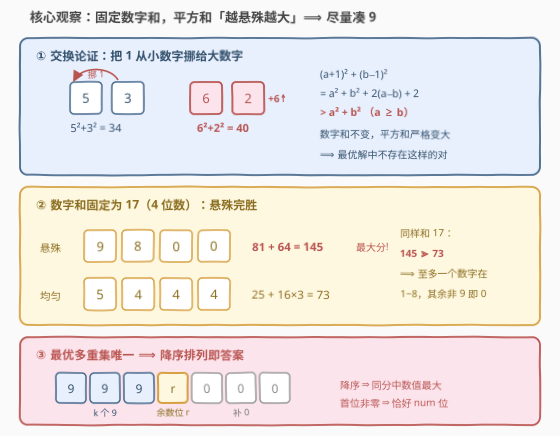
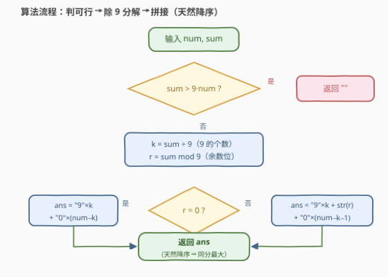

# LeetCode 数位平方和的最大值 题解

## 1. 题目概述

- **标题 / 题号**：数位平方和的最大值（#3723，medium）
- **链接**：https://leetcode.cn/problems/maximize-sum-of-squares-of-digits/
- **难度**：中等
- **标签**：贪心、数学

**题意**：给定两个**正整数** `num` 和 `sum`。若正整数 $n$ 满足：① 位数**恰好**为 `num`；② 各位数字之和**恰好**为 `sum`，则称 $n$ 为**好整数**。好整数 $n$ 的**分数**定义为各位数字的**平方和**。以字符串返回能取得**最大分数**的好整数；若同分不唯一，返回其中**最大**的那个；若不存在好整数，返回空字符串 `""`。

**示例 1**：

```text
输入：num = 2, sum = 3
输出："30"
解释：好整数有 12、21、30。分数分别为 5、5、9，30 的分数最大。
```

**示例 2**：

```text
输入：num = 2, sum = 17
输出："98"
解释：好整数有 89、98。两者分数同为 145，返回更大的 98。
```

**示例 3**：

```text
输入：num = 1, sum = 10
输出：""
解释：不存在恰好 1 位且数字和为 10 的正整数。
```

**约束**：

- $1 \le num \le 2 \times 10^5$
- $1 \le sum \le 2 \times 10^6$

> 💡 **审题关键**：① `num` 高达 $2 \times 10^5$——答案本身是一个最长 20 万位的字符串，**任何数值类型都装不下**，必须直接按字符串构造（也暗示复杂度只能 $O(num)$）；② 分数 = 数字平方和，只与**用到了哪些数字**（多重集）有关，与数字的**排列顺序**无关——可拆成「定多重集」+「定排列」两步；③ 同分取最大 ⇒ 排列方向锁定为**降序**；④ 无解判据：`num` 位数的数字和上界是 $9 \cdot num$。

## 2. 解题思路

### 2.1 暴力思路：逐位 DP 为什么行不通

最直接的框架是按位 DP：$dp[i][j]$ 表示前 $i$ 位、已用数字和为 $j$ 时能取得的最大平方和，转移时枚举第 $i$ 位填 $0 \sim 9$。但状态空间为 $O(num \times sum)$，本题约束下达 $2 \times 10^5 \times 2 \times 10^6 = 4 \times 10^{11}$，直接爆炸；即便数据范围缩小到可 DP，还需额外回溯还原 20 万位的答案串。

> 💡 约束的量级（20 万位、200 万和）本身就是提示：答案不是「搜出来的」，是「**构造出来的**」——应当存在闭式解。逐位 DP 把「数字怎么组合」当搜索问题，却忽略了平方和这个目标函数的**数学结构**。

### 2.2 核心观察：固定和下「越悬殊越大」——凑 9 贪心 + 降序排列



**观察一（可行性）**：`num` 位正整数的数字和取值范围是 $[1,\ 9 \cdot num]$（下界由首位 $\ge 1$ 达成，上界由全 9 达成）。题目保证 $sum \ge 1$，故唯一无解情形是

$$sum > 9 \cdot num \implies \text{返回 } ""$$

**观察二（交换论证：最优解「非 9 即 0」）**：分数只依赖数字多重集。若某方案中存在两个数字 $a \ge b$，满足 $a \le 8$ 且 $b \ge 1$（一个没顶到 9、一个还有余量），把 $b$ 的 1 挪给 $a$：

$$(a+1)^2 + (b-1)^2 = a^2 + b^2 + 2(a-b) + 2 > a^2 + b^2$$

数字和不变、平方和**严格变大**。因此最优方案中不存在这样的对——即**至多一个数字落在 $[1, 8]$ 内**，其余数字非 $0$ 即 $9$。结合「数字和恰为 $sum$」，最优多重集被**唯一**确定：

$$k = \left\lfloor \frac{sum}{9} \right\rfloor \text{ 个 } 9,\qquad r = sum \bmod 9\ \text{（若 } r > 0 \text{ 再添一个数字 } r\text{）}，\qquad \text{其余补 } 0$$

（$r > 0$ 时由 $sum \le 9 \cdot num$ 可得 $9k < sum \le 9 \cdot num \Rightarrow k < num$，余数位必然放得下。）

**观察三（同分取最大 ⇒ 降序）**：观察二中的增量 $2(a-b) + 2 \ge 2 > 0$ 恒正，等号取不到，说明最大分数的**多重集唯一**——所有同分好整数都是这同一组数字的排列，其中数值最大的就是**降序排列**：

$$\underbrace{99\cdots 9}_{k}\ \underbrace{r}_{\text{若有}}\ \underbrace{00\cdots 0}_{\text{补齐到 } num \text{ 位}}$$

且 $sum \ge 1$ 保证多重集含非零数字、降序排列首位必非零，「恰好 `num` 位」的要求自动满足。

> 💡 一句话：**先凑 9 定下用哪些数字，再降序定下怎么排**。两步贪心都被同一个交换论证一步锁定。
>
> ⚠️ 「同分直接取最大」不能想当然：这一步成立的前提正是最优多重集**唯一**（交换论证中等号取不到）。若目标函数换成乘积（见第 5 节），最优形态从「悬殊」反转为「均匀」，结论要整个重推——先证结构、再谈构造。

### 2.3 算法流程图



**文字版步骤**：

| 步骤 | 操作 | 说明 |
|------|------|------|
| ① 判可行 | 若 $sum > 9 \cdot num$，返回 `""` | 数字和上界 $9 \cdot num$ |
| ② 分解 | $k = \lfloor sum / 9 \rfloor$，$r = sum \bmod 9$ | 商 = 9 的个数，余数 = 中间位 |
| ③ 拼接 | `"9"` × $k$，$r > 0$ 时追加 `str(r)`，再用 `"0"` 补齐到 $num$ 位 | 拼接顺序天然降序 ⇒ 同分最大 |

### 2.4 示例演算

| 输入 | 可行性 | $k$ / $r$ | 构造过程 | 答案 |
|------|--------|-----------|----------|------|
| `num=2, sum=3` | $3 \le 18$ ✓ | $k=0,\ r=3$ | `"3"` + 补 1 个 `"0"` | `"30"` |
| `num=2, sum=17` | $17 \le 18$ ✓ | $k=1,\ r=8$ | `"9"` + `"8"` + 补 0 个 `"0"` | `"98"` |
| `num=1, sum=10` | $10 > 9$ ✗ | — | — | `""` |
| `num=5, sum=45` | $45 \le 45$ ✓ | $k=5,\ r=0$ | `"99999"`（无余数位、无补 0） | `"99999"` |

> 💡 第四行是 $r=0$ 的满额边界：$sum$ 恰为 $9 \cdot num$ 时全 9、一个 0 都不补；它与第三行（无解）一起覆盖了两端边界。

## 3. 参考代码

### C++

```cpp
class Solution {
  public:
    string maxSumOfSquares(int num, int sum) {
        if (sum > 9LL * num) return "";           // 数字和上界 9·num，越界必无解
        int k = sum / 9, r = sum % 9;
        string res;
        res.reserve(num);
        res.append(k, '9');                       // 尽量多的 9
        if (r > 0) res.push_back('0' + r);        // 至多一个「余数位」
        res.append(num - (int)res.size(), '0');   // 其余补 0（r==0 时也走这里）
        return res;                               // 拼接天然降序 ⇒ 同分最大
    }
};
```

### Python

```python
class Solution:
    def maxSumOfSquares(self, num: int, sum: int) -> str:
        if sum > 9 * num:
            return ""
        k, r = divmod(sum, 9)
        if r == 0:
            return "9" * k + "0" * (num - k)
        return "9" * k + str(r) + "0" * (num - k - 1)
```

> 💡 **写法要点**：
> - C++ 用 `append(n, ch)` 批量拼接 + `reserve(num)` 预分配，避免循环逐字符 `push_back`。
> - 本题 $9 \cdot num \le 1.8 \times 10^6$ 其实不溢 `int`，`9LL * num` 是防御性写法。
> - Python 签名中的 `sum` 遮蔽了内建函数——函数体内不要再调用内建 `sum`。

## 4. 复杂度分析

| 维度 | 复杂度 | 说明 |
|------|--------|------|
| **时间复杂度** | $O(num)$ | 判可行与除法分解 $O(1)$；构造长 $num$ 的字符串 $O(num)$（`append(n, ch)` / 字符串乘法） |
| **空间复杂度** | $O(num)$ | 输出字符串本身；不计输出则为 $O(1)$ |

> ⚠️ 别把复杂度写成 $O(1)$：哪怕计算全程常数次运算，**写出答案**就得逐字符输出 $num$ 个，$O(num)$ 是输出下界。

## 5. 扩展：凸性的对偶与变体

**求「最小分数」的对偶版**：平方和是凸函数——固定和下，最大值在**越悬殊越好**处取得（本题：凑 9），最小值则在**越均匀越好**处取得：每个数字取 $\lfloor sum/num \rfloor$ 或 $\lceil sum/num \rceil$（交换论证反向：从悬殊往均匀挪 1，平方和严格变小）。均衡多重集同样唯一，同分取最大仍是降序排列——骨架完全平移，只换「挪 1 方向」。

**把目标换成乘积**：固定和下最大化**乘积**是 AM-GM 的天下——**越均匀乘积越大**（全是 2 和 3 时最优），与本题「越悬殊平方和越大」恰好凹凸反转，参见 [343. 整数拆分](../0301-0400/343_整数拆分.md)。数字分配类问题的「悬殊 / 均匀」二象性，先看目标函数的凸凹性再定方向。

**数字上界泛化**：若每位数字上界不是 9 而是 $b$（如 16 进制数位），结论原样成立：凑 $b$ 个、放余数、补 0、降序——交换论证一行不改。

## 6. 面试要点

**Q1：为什么「尽量凑 9」的分配分数最大？如何证明？**

> 交换论证：只要存在两个数字 $a \ge b$ 且 $a \le 8$、$b \ge 1$，就有 $(a+1)^2 + (b-1)^2 = a^2 + b^2 + 2(a-b) + 2 > a^2 + b^2$——把 1 从小挪给大，数字和不变、平方和严格变大。最优解中不存在这样的对，故至多一个数字在 $[1,8]$，其余非 0 即 9；多重集被 $sum$ 唯一确定（$k$ 个 9 + 余数 $r$ + 补 0）。

**Q2：为什么同分时直接取降序排列就是最大的好整数？**

> 交换论证的增量恒 $\ge 2 > 0$，等号取不到 ⇒ 最大分数的多重集**唯一** ⇒ 同分好整数都是同一组数字的排列，其中数值最大者是降序排列。$sum \ge 1$ 保证降序首位非零，「恰好 $num$ 位」自动满足。

**Q3：无解条件是什么？为什么不用检查下界？**

> `num` 位正整数的数字和范围是 $[1, 9 \cdot num]$。题目约束 $sum \ge 1$ 已排除下界，故只需判 $sum > 9 \cdot num$ 即返回 `""`。若约束放宽允许 $sum = 0$：全 0 串首位为 0、不是 $num$ 位正整数，同样须返回 `""`。

**Q4：为什么逐位 DP 不可行？约束给了什么暗示？**

> 状态 $O(num \times sum) = 4 \times 10^{11}$，任何「逐位试填 + 状态记忆」都爆。且 $num$ 高达 $2 \times 10^5$ 意味着答案无法用整数类型表示、必须按字符串 $O(num)$ 构造——出题人用约束同时否决搜索解法与数值返回，指向闭式贪心。

**Q5：若把「平方和」改成「乘积最大」，结论怎么变？**

> 方向整个反转：固定和下乘积最大化走 AM-GM——**越均匀越大**（拆成尽量多的 3 与 2，参见 [343. 整数拆分](../0301-0400/343_整数拆分.md)），补 0 还会把乘积直接清零。说明「凑大数」不是万能贪心：分配类问题的最优形态由目标函数的**凸凹性**决定，交换论证要随目标重推。

## 同类练习题

| # | 题目 | 与本题的关联 |
|---|------|-------------|
| 1663 | [具有给定数值的最小字符串](https://leetcode.cn/problems/smallest-string-with-a-given-numeric-value/)（[题解](../1601-1700/1663_具有给定数值的最小字符串.md)） | 同一「固定和构造极值串」骨架的**最小**版——从左贪心填 `a`、把余量压到尾部，与本题「从左填 9」方向相反 |
| 738 | [单调递增的数字](https://leetcode.cn/problems/monotone-increasing-digits/) | 求 $\le N$ 的最大单调递增数——破位减 1 后右侧全部填 9，与本题「凑 9」同一手笔 |
| 179 | [最大数](https://leetcode.cn/problems/largest-number/) | 拼接出最大数——自定义比较器排序；本题的 tie-break「降序取最大」是其最简形态 |
| 2578 | [最小和分割](https://leetcode.cn/problems/split-with-minimum-sum/)（[题解](../2501-2600/2578_最小和分割.md)） | 数字重分配求极值——升序交错分给两个数使和最小，贪心方向与本题对偶 |
| 343 | [整数拆分](https://leetcode.cn/problems/integer-break/)（[题解](../0301-0400/343_整数拆分.md)） | 固定和最大化**乘积**——「越均匀越大」的经典，与本题「越悬殊平方和越大」凹凸互为镜像 |
