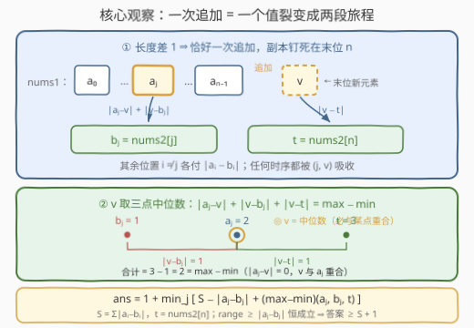
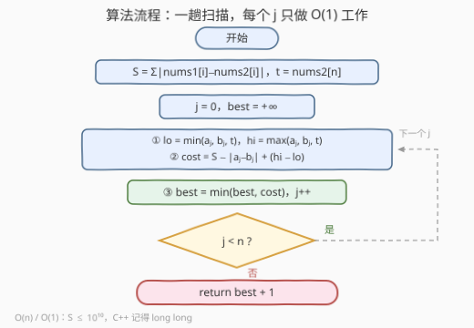

# 转换数组的最少操作次数

- **题目名称**：转换数组的最少操作次数
- **链接**：[3724. 转换数组的最少操作次数](https://leetcode.cn/problems/minimum-operations-to-transform-array/)
- **难度**：中等
- **标签**：贪心、数组、数学

## 1. 题目概述

给你两个整数数组：`nums1` 长度为 $n$，`nums2` 长度为 $n + 1$。目标是用**最少**的操作次数将 `nums1` 转换为 `nums2`。

你可以执行以下操作任意次，每次选择一个下标 $i$：

1. 将 `nums1[i]` 增加 1；
2. 将 `nums1[i]` 减少 1；
3. 将 `nums1[i]` **追加**到数组的**末尾**（数组长度 +1）。

返回将 `nums1` 转换为 `nums2` 所需的最少操作次数。

**示例 1**：

```text
输入：nums1 = [2,8], nums2 = [1,7,3]
输出：4
解释：追加 nums1[0]=2 → [2,8,2]；nums1[0] 减 1 → [1,8,2]；
     nums1[1] 减 1 → [1,7,2]；nums1[2] 加 1 → [1,7,3]。
```

**示例 2**：

```text
输入：nums1 = [1,3,6], nums2 = [2,4,5,3]
输出：4
解释：追加 nums1[1]=3 → [1,3,6,3]；nums1[0] 加 1 → [2,3,6,3]；
     nums1[1] 加 1 → [2,4,6,3]；nums1[2] 减 1 → [2,4,5,3]。
```

**示例 3**：

```text
输入：nums1 = [2], nums2 = [3,4]
输出：3
解释：nums1[0] 加 1 → [3]；追加 nums1[0]=3 → [3,3]；nums1[1] 加 1 → [3,4]。
```

**约束条件**：

- $1 \le n = \text{nums1.length} \le 10^5$
- $\text{nums2.length} = n + 1$
- $1 \le \text{nums1}[i], \text{nums2}[i] \le 10^5$

> 💡 **审题关键**：① 长度差**恰好为 1**——三种操作里只有「追加」改变长度（+1），且没有删除操作，所以**追加恰好执行一次**，这是全题的锚点；② $\pm 1$ 只改值不挪位置，追加永远落在末尾，因此**每个元素的最终归宿由它的下标唯一决定**；③ $n \le 10^5$ 暗示需要 $O(n)$ 或 $O(n \log n)$ 的算法。

---

## 2. 解题思路

### 2.1 暴力思路

最朴素的想法是把「数组当前状态」当搜索节点做 BFS——但状态是长度 $10^5$、值域 $10^5$ 的数组，状态数天文数字，直接排除。

冷静下来会发现，这道题的**决策结构其实极小**：真正需要决策的只有两件事——

- **从哪个下标 $j$ 追加**（$n$ 种选择）；
- **追加那一刻 `nums1[j]` 的值 $v$ 是多少**。表面上「先调再追加 / 先追加再调 / 分几段调」千变万化，其实全部被「追加时刻的值 $v$」这一个数字吸收：位置 $j$ 的值轨迹是一条 $a_j \to v \to b_j$ 的折线，$\pm 1$ 操作只关心总变差，不关心先后顺序。

于是结构化暴力：枚举 $j$（$n$ 种）× 枚举 $v$（值域 $V \approx 2\times10^5$ 种），每个组合 $O(1)$ 汇总代价——$O(nV) \approx 2\times10^{10}$，仍超时。瓶颈全在内层：**对固定的 $j$，最优的 $v$ 难道必须逐个试吗？**

### 2.2 核心观察：一次追加 = 一个值裂变成两段旅程



先做两笔「账」，把整个问题坍缩成一条公式。记 $a_i = \text{nums1}[i]$，$b_i = \text{nums2}[i]$，$t = \text{nums2}[n]$（目标末位）。

**长度账**：只有追加使长度 +1，且无删除操作 $\Rightarrow$ **追加恰好执行一次**。

**位置账**：追加的副本落在末位 $n$，此后 $\pm1$ 不会挪动任何元素 $\Rightarrow$ 最终下标 $n$ 上是副本，下标 $i < n$ 上是原始元素。于是设追加源为 $j$、追加时刻的值为 $v$：

- 位置 $j$ 的值轨迹 $a_j \to v \to b_j$，代价至少 $|a_j - v| + |v - b_j|$（总变差下界）；
- 副本的轨迹 $v \to t$，代价至少 $|v - t|$；
- 其余位置 $i \ne j$ 各付 $|a_i - b_i|$，与追加毫无关系。

总代价（含追加本身那 1 次）：

$$1 + \big(S - |a_j - b_j|\big) + |a_j - v| + |v - b_j| + |v - t|, \qquad S = \sum_{i=0}^{n-1} |a_i - b_i|$$

**为什么这既是下界又可达**：任何合法方案都唯一确定一对 $(j, v)$（$j$ = 追加源，$v$ = 追加那一刻位置 $j$ 的值）；位置 $j$ 上的 $\pm1$ 操作数不少于其值轨迹的总变差，副本同理，其余位置同理，再加 1 次追加——故总操作数 $\ge$ 上式。反过来，按「先把位置 $j$ 调到 $v$ → 追加 → 位置 $j$ 调到 $b_j$、副本调到 $t$、其余位置各自归位」执行，各下标互不干扰，恰好取到上式。

最后一击是内层的**封闭形式**——$v$ 的三项距离和在「三点中位数」处取最小。把 $a_j, b_j, t$ 排序为 $x \le y \le z$：

- 取 $v = y$：和 $= (y - x) + 0 + (z - y) = z - x$；
- 任意 $v$：$|v - x| + |v - z| \ge z - x$（一维三角不等式），再加 $|v - y| \ge 0$。

于是

$$\min_v\ |a_j - v| + |v - b_j| + |v - t| \;=\; \max(a_j, b_j, t) - \min(a_j, b_j, t)$$

> ⚠️ 三个点的中位数**必与其中一点重合**——最优 $v$ 一定是 $a_j$、$b_j$、$t$ 三者之一，对应「先调到某个目标值再追加」的直观策略；不存在「调到某个中间怪值再追加反而更优」的可能。

**最终答案**：

$$\text{ans} = 1 + \min_{0 \le j < n} \Big[\, S - |a_j - b_j| + \max(a_j, b_j, t) - \min(a_j, b_j, t) \,\Big]$$

> 💡 一个漂亮的自检不变量：三点极差 $\max - \min$ 永远 $\ge |a_j - b_j|$（极差包含 $a_j$、$b_j$ 两点），所以**每个候选都 $\ge S$，答案 $\ge S + 1$ 恒成立**。等号成立当且仅当 $t$ 恰好落在 $a_j$ 与 $b_j$ 之间（含相等）——此时「先追加再各自微调」零浪费。

### 2.3 算法流程图



**逻辑执行步骤**：

| 步骤 | 操作 | 说明 |
|------|------|------|
| ① 预处理 | $S = \sum_i |a_i - b_i|$，$t = \text{nums2}[n]$ | 一趟累加 |
| ② 枚举 | $j = 0 \dots n-1$ | 每轮严格 $O(1)$ |
| ③ 三点极值 | 求 $\min/\max(a_j, b_j, t)$ | 6 次比较 |
| ④ 候选代价 | $\text{cost} = S - |a_j - b_j| + (\text{hi} - \text{lo})$ | 一个减法一个加法 |
| ⑤ 收割 | $\text{best} = \min(\text{best}, \text{cost})$ | |
| ⑥ 返回 | $\text{best} + 1$ | 那 $+1$ 就是追加本身 |

### 2.4 示例演算

**示例 2**：`nums1 = [1,3,6]`，`nums2 = [2,4,5,3]`。$S = 1 + 1 + 1 = 3$，$t = 3$：

| $j$ | $(a_j, b_j, t)$ | 极差 $\text{hi}-\text{lo}$ | $S-\|a_j-b_j\|$ | 候选（+1 后） | 最优 $v$ |
|-----|-----------------|---------------------------|-----------------|---------------|----------|
| 0 | (1, 2, 3) | 2 | 2 | 4 → 5 | 2（$= b_j$） |
| 1 | (3, 4, 3) | 1 | 2 | 3 → **4** ✓ | 3（$= a_j = t$） |
| 2 | (6, 5, 3) | 3 | 2 | 5 → 6 | 5（$= b_j$） |

$j = 1$ 胜出，最优 $v = 3 = a_1$：**先追加** `nums1[1]=3`（副本正好就是 $t = 3$，一步不用动），再把位置 1 从 3 加到 4、其余位置各自归位——这正是官方示例给出的操作序列。

**示例 1**：$S = 2$，$t = 3$。$j=0$：极差 $(2,1,3) = 2$，候选 $2 - 1 + 2 = 3$，答案 $3 + 1 = 4$ ✓（$j=1$ 候选 $2-1+5=6$ 更差）。

**示例 3**：$S = 1$，$t = 4$。$n=1$ 只有 $j=0$：极差 $(2,3,4) = 2$，答案 $1 - 1 + 2 + 1 = 3$ ✓。

---

## 3. 参考代码

### C++

```cpp
class Solution {
public:
    long long minOperations(vector<int>& nums1, vector<int>& nums2) {
        int n = nums1.size();
        long long S = 0;
        for (int i = 0; i < n; ++i)
            S += abs(nums1[i] - nums2[i]);
        int t = nums2[n];
        long long best = LLONG_MAX;
        for (int j = 0; j < n; ++j) {
            int lo = min({nums1[j], nums2[j], t});
            int hi = max({nums1[j], nums2[j], t});
            best = min(best, S - abs(nums1[j] - nums2[j]) + hi - lo);
        }
        return best + 1;
    }
};
```

> 💡 **写法要点**：
> - $S$ 最大 $10^5 \times 10^5 = 10^{10}$，超出 `int`，累加器必须 `long long`（返回值签名本身就是 `long long`，是提示也是提醒）；
> - `min({a, b, c})` initializer-list 版本一次取三点极值，`t` 保持 `int` 与元素同类型避免模板推导冲突；
> - 每轮的表达式里 `S` 是 `long long`，整个算式自动提升，无溢出死角；
> - `best` 初始化 `LLONG_MAX` 而非 0——循环至少跑一轮，但语义上「求最小」就应初始化为上界。

### Python

```python
class Solution:
    def minOperations(self, nums1: List[int], nums2: List[int]) -> int:
        S = sum(abs(a - b) for a, b in zip(nums1, nums2))
        t = nums2[-1]
        best = min(S - abs(a - b) + max(a, b, t) - min(a, b, t)
                   for a, b in zip(nums1, nums2))
        return best + 1
```

> 💡 **写法要点**：
> - `zip(nums1, nums2)` 天然在较短的 `nums1` 处截断，恰好配对出 $(a_i, b_i)$，$i < n$；末位目标用 `nums2[-1]` 取，省去下标计算；
> - `max(a, b, t)` / `min(a, b, t)` 是 Python 内置多参数版，比 `sorted` 取端点更快更直白；
> - 全程整数运算无溢出之忧，两行核心逻辑即公式本身。

---

## 4. 复杂度分析

| 维度 | 复杂度 | 说明 |
|------|--------|------|
| **时间** | $O(n)$ | 预处理 $S$ 一趟 + 枚举 $j$ 一趟，每轮 6 次比较 + 常数次加减 |
| **空间** | $O(1)$ | 只有 $S, t, \text{best}$ 等常数个变量 |
| **对比暴力** | $O(nV) \to O(n)$ | 内层对 $v$ 的整段枚举被「三点中位数」封闭形式一次性消掉，约 $2\times10^{10} \to 10^5$ |

---

## 5. 扩展：前缀和视角、中位数家族与 k 次追加变体

**官方 hints 为何提「前缀和」**：hints 建议用前缀和计算「位置 $j$ 之外所有位置的代价」，即 $\text{pre}[j] + \text{suf}[j+1]$。但由于代价可以**整体减去**单个位置的贡献（$S - |a_j - b_j|$），一个总量变量就够，无需真的构造前缀和数组——这是「可减性」带来的简化，遇到不可减的量（如乘积模意义下）才需要前后缀分解。

**中位数家族**：$\min_v \sum_k |v - x_k|$ 在中位数处取到，是本题三点版背后的母定理，一整族考题都长在它上面：

| 题目 | 变体 |
|------|------|
| [462](https://leetcode.cn/problems/minimum-moves-to-equal-array-elements-ii/) | 无权版：所有点凑向同一个 $v$ |
| [2448](https://leetcode.cn/problems/minimum-cost-to-make-array-equal/) | 加权版：斜率/加权中位数 |
| [2602](https://leetcode.cn/problems/minimum-operations-to-make-all-array-elements-equal/) | 在线批量版：排序 + 前缀和 $O(1)$ 回答每个查询 |
| 本题 | 三点特例 + 「一个点要被轨迹经过两次」的裂变结构 |

**若长度差为 $k > 1$（允许多次追加）**：$k$ 个副本按追加顺序占据末 $k$ 位，每个源位置可裂变多次、值轨迹需依次经过多个追加值，问题从「一行公式」升级为区间 DP / 分配问题（$O(n^2)$ 级别）——一次追加的可解性恰恰来自「决策自由度只有 $(j, v)$ 两个标量」。

---

## 6. 面试要点

**Q1：为什么追加恰好执行一次？**

> 长度账：三种操作里只有追加改变长度（+1），没有删除。初始长度 $n$、目标长度 $n+1$，操作净效果必须恰为 +1，故追加次数 = 1，一次也不能多、一次也不能少。

**Q2：为什么追加副本必然对应 `nums2` 的最后一个元素，而不是中间某个？**

> 位置账：追加永远落在当前末尾，之后没有任何操作能移动元素位置，$\pm1$ 只原地改值。所以最终末位 $n$ 上就是那个副本，其余下标 $i$ 上的元素从始至终原地不动——最终数组与 `nums2` 逐位相等时，副本只能对应 $\text{nums2}[n]$。

**Q3：「先调整再追加」和「先追加再调整」需要分别讨论吗？**

> 不需要。任何调度都可参数化为 $(j, v)$：位置 $j$ 的值轨迹是折线 $a_j \to v \to b_j$，其 $\pm1$ 操作代价只依赖总变差 $|a_j - v| + |v - b_j|$，与时间顺序无关；副本从 $v$ 走到 $t$ 付 $|v - t|$。时序的全部自由度被 $v$ 一个标量吸收——这是本题最值得学的降维手法。

**Q4：$\min_v$ 为什么等于 $\max - \min$？**

> 三点排序 $x \le y \le z$：$v = y$ 时和恰为 $(y-x) + 0 + (z-y) = z - x$；任意 $v$ 由三角不等式 $|v-x| + |v-z| \ge z - x$，再加 $|v - y| \ge 0$，下界也是 $z - x$。两碰即合，且最优 $v$ 必与三点之一重合。

**Q5：写代码时最容易翻车的点？**

> 溢出：$S$ 上界 $10^5 \times 10^5 = 10^{10}$ 超出 32 位 int，C++ 必须 `long long` 累加（幸好函数签名已提示）；Python 无此忧。另可用「答案 $\ge S + 1$」做提交前自检——若算出小于它，公式必错。

> 💡 **一句话总结**：3724 = 长度账（恰一次追加）+ 位置账（副本钉死末位）把调度坍缩成 $(j, v)$ 二元组 + 三点中位数封闭式 $\max - \min$ 消掉内层枚举。三个要点带走：极差 $\ge$ 两点距离 ⇒ 答案 $\ge S+1$ 的自检不变量、时序被参数吸收的降维思想、$S$ 达 $10^{10}$ 的溢出提醒。

---

## 7. 同类练习题

- [462. 最小操作次数使数组元素相等 II](https://leetcode.cn/problems/minimum-moves-to-equal-array-elements-ii/)（[题解](../0401-0500/462_最小操作次数使数组元素相等II.md)）：$\min_v \sum |v - x_k|$ 的中位数母定理，本题三点版的直接推广源
- [2448. 使数组相等的最小开销](https://leetcode.cn/problems/minimum-cost-to-make-array-equal/)（[题解](../2401-2500/2448_使数组相等的最小开销.md)）：加权中位数——每点带权 cost，凸函数斜率论证取最优落点
- [2602. 使数组元素全部相等的最少操作次数](https://leetcode.cn/problems/minimum-operations-to-make-all-array-elements-equal/)（[题解](../2501-2600/2602_使数组元素全部相等的最少操作次数.md)）：中位数 + 排序前缀和 $O(1)$ 批量回答查询，本题「消内层枚举」思路的进阶版
- [296. 最佳的碰头地点](https://leetcode.cn/problems/best-meeting-point/)：行、列独立取中位数，中位数性质在二维网格的延伸
- [1558. 得到目标数组的最少函数调用次数](https://leetcode.cn/problems/minimum-numbers-of-function-calls-to-make-target-array/)（[题解](../1501-1600/1558_得到目标数组的最少函数调用次数.md)）：另一类「把数组变成目标」的最少操作计数——逆向「全体除二 / 单点减一」逐位统计贪心
