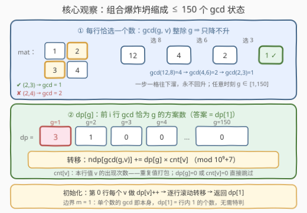
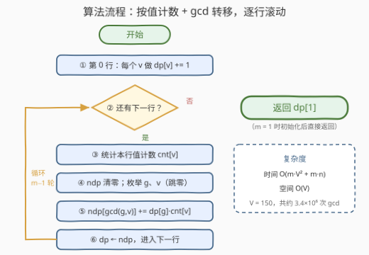

# LeetCode 统计每一行选择互质整数的方案数 题解

## 1. 题目概述

- **标题 / 题号**：统计每一行选择互质整数的方案数（#3725，hard）
- **链接**：https://leetcode.cn/problems/count-ways-to-choose-coprime-integers-from-rows/
- **难度**：困难
- **标签**：数组、数学、动态规划、组合数学、矩阵、数论

**题意**：给你一个由正整数组成的 $m \times n$ 矩阵 `mat`。要求从 `mat` 的**每一行**中**恰好**选择一个整数，返回所有被选整数的**最大公约数为 1** 的选择方案数量。答案可能很大，对 $10^9 + 7$ 取模后返回。

**示例 1**：

```text
输入：mat = [[1,2],[3,4]]
输出：3
解释：逐组合计算 gcd：
      (1,3)→1 ✓  (1,4)→1 ✓  (2,3)→1 ✓  (2,4)→2 ✗
      共 3 种组合的 gcd 为 1。
```

**示例 2**：

```text
输入：mat = [[2,2],[2,2]]
输出：0
解释：所有组合的 gcd 都是 2，没有 gcd 为 1 的方案。
```

**约束**：

- $1 \le m = \text{mat.length} \le 150$
- $1 \le n = \text{mat}[i].\text{length} \le 150$
- $1 \le \text{mat}[i][j] \le 150$

> 💡 **审题关键**：① 「每行恰好选一个」意味着总方案数是 $n^m$，直接枚举组合必然爆炸；② 目标事件是「全体 gcd $= 1$」——一个**全局聚合量**，天然的 DP 状态候选；③ 元素值 $\le 150$ 是最大的提示：**gcd 的中间结果也被值域封顶**，状态空间极小。困难难度难在想到「数 gcd 而不是数组合」，想到之后实现平平无奇。

## 2. 解题思路

### 2.1 暴力思路

最朴素的做法是枚举全部 $n^m$ 种选法，对每种组合求一遍 gcd。$n^m$ 最高 $150^{150}$，天文数字，直接排除。

稍作挣扎可以想到按行 BFS/DFS：一行一行地选，途中维护已选数的 gcd。但朴素的搜索仍会把**相同的中间 gcd 展开成指数级条路**——比如前 10 行已经选出 gcd $= 2$ 的 500 万条路径，它们后续的命运**完全相同**（只取决于 gcd $=2$ 这个状态）。这提示我们：合并同构状态。

### 2.2 核心观察：在 gcd 值域上做 DP



两条性质把指数问题压成多项式：

**性质一（单调下滑）**：$\gcd(g, v)$ **整除** $g$，因此每选一个新数，gcd 只会沿 $g$ 的因子链**下滑或原地不动，永不上升**。组合的细节（具体选了哪些数）在聚合之后全部湮灭，只有 gcd 这个标量在传递——这正是 DP 可行的无后效性来源。

**性质二（值域封顶）**：所有元素 $\le 150$，任意时刻的 gcd 也 $\le 150$。状态总数被值域 $V = 150$ 封死，与 $m$、$n$ 无关。

于是定义：

$$dp_i[g] = \text{前 } i \text{ 行各选一数、且已选数的 gcd 恰为 } g \text{ 的方案数}$$

**初始化**（第 0 行）：对每个元素 $v$，$dp_0[v] \mathrel{+}= 1$。

**转移**（第 $i$ 行，先统计该行的值计数 $cnt[v]$）：

$$dp_i\big[\gcd(g, v)\big] \mathrel{+}= dp_{i-1}[g] \times cnt[v]$$

**答案**：$dp_{m-1}[1]$。

> 💡 **为什么按值计数而不是逐元素转移**：同一行里重复出现的值命运完全相同，用 $cnt[v]$ 把它们**打包成一次转移**。逐元素转移复杂度 $O(m \cdot n \cdot V)$，按值计数是 $O(m \cdot V^2)$——本题 $n \le V$，两者同阶（都是 $150^3 \approx 3.4 \times 10^6$），但后者把转移规模与 $n$ 解耦，且天然跳过零计数。
>
> ⚠️ **$m = 1$ 的边界**：单个数的 gcd 是它本身，所以答案就是第 0 行中 **1 的个数**。DP 无需特判——初始化后直接读 $dp[1]$ 即是。

### 2.3 算法流程图



**逻辑执行步骤**：

| 步骤 | 操作 | 说明 |
|------|------|------|
| ① 初始化 | 对第 0 行每个 $v$：$dp[v] \mathrel{+}= 1$ | $m=1$ 时到这一步已可直接返回 $dp[1]$ |
| ② 逐行推进 | $i = 1 \dots m-1$ | 滚动数组，旧 $dp$ 用完即弃 |
| ③ 值计数 | $cnt[v]$：第 $i$ 行值 $v$ 出现次数 | 重复值打包 |
| ④ 双层枚举 | $g$（跳过 $dp[g]=0$）× $v$（跳过 $cnt[v]=0$） | 只碰非零状态 |
| ⑤ 转移 | $ndp[\gcd(g,v)] \mathrel{+}= dp[g] \cdot cnt[v]$ | 边乘边取模 |
| ⑥ 收割 | 返回 $dp[1]$ | gcd 恰为 1 的方案数 |

### 2.4 示例演算

**示例 1**：`mat = [[1,2],[3,4]]`。

**第 0 行** `[1,2]` 初始化：$dp[1] = 1$，$dp[2] = 1$。

**第 1 行** `[3,4]`，$cnt[3] = cnt[4] = 1$，转移表：

| $g$ | $dp[g]$ | 选 $v=3$：$\gcd(g,3)$ | 选 $v=4$：$\gcd(g,4)$ | 贡献 |
|-----|---------|----------------------|----------------------|------|
| 1 | 1 | $\gcd(1,3)=1$ | $\gcd(1,4)=1$ | $ndp[1] \mathrel{+}= 1+1 = 2$ |
| 2 | 1 | $\gcd(2,3)=1$ | $\gcd(2,4)=2$ | $ndp[1] \mathrel{+}= 1$；$ndp[2] \mathrel{+}= 1$ |

得 $ndp[1] = 3$，$ndp[2] = 1$，返回 $dp[1] = 3$ ✓。

**示例 2**：`mat = [[2,2],[2,2]]`。初始化 $dp[2] = 2$；第 1 行 $cnt[2] = 2$，唯一转移 $ndp[\gcd(2,2)] = ndp[2] \mathrel{+}= 2 \times 2 = 4$，$dp[1] = 0$ ✓。

## 3. 参考代码

### C++

```cpp
class Solution {
public:
    int countCoprime(vector<vector<int>>& mat) {
        constexpr long long MOD = 1'000'000'007;
        constexpr int V = 150;
        int m = mat.size();
        vector<long long> dp(V + 1);
        for (int v : mat[0]) dp[v]++;
        for (int i = 1; i < m; ++i) {
            vector<int> cnt(V + 1);
            for (int v : mat[i]) cnt[v]++;
            vector<long long> ndp(V + 1);
            for (int g = 1; g <= V; ++g) {
                if (dp[g] == 0) continue;
                for (int v = 1; v <= V; ++v) {
                    if (cnt[v] == 0) continue;
                    int h = __gcd(g, v);
                    ndp[h] = (ndp[h] + dp[g] * cnt[v]) % MOD;
                }
            }
            dp = move(ndp);
        }
        return (int)dp[1];
    }
};
```

> 💡 **写法要点**：
> - **溢出**：$dp[g] < 10^9+7$，$cnt[v] \le 150$，乘积约 $1.5 \times 10^{11}$ 超 32 位 int，`dp`/`ndp` 必须 `long long`（`cnt` 是小值可留 `int`）；
> - **跳零**：`dp[g] == 0` / `cnt[v] == 0` 的两层 continue 是常数级剪枝——值域 150 个格子里多数时刻是稀疏的；
> - **滚动**：`dp = move(ndp)` 直接移交所有权，无拷贝；
> - `__gcd` 是 GCC 内建，换平台可用 `std::gcd`（需 `<numeric>`）。

### Python

```python
from math import gcd

class Solution:
    def countCoprime(self, mat: List[List[int]]) -> int:
        MOD = 10**9 + 7
        V = 150
        dp = [0] * (V + 1)
        for v in mat[0]:
            dp[v] += 1
        for row in mat[1:]:
            cnt = [0] * (V + 1)
            for v in row:
                cnt[v] += 1
            ndp = [0] * (V + 1)
            for g in range(1, V + 1):
                if dp[g]:
                    for v in range(1, V + 1):
                        if cnt[v]:
                            ndp[gcd(g, v)] = (ndp[gcd(g, v)] + dp[g] * cnt[v]) % MOD
            dp = ndp
        return dp[1]
```

> 💡 **写法要点**：
> - `gcd` 需从 `math` 导入（LeetCode 环境不自动注入）；大整数无溢出之忧，取模只为防数变大变慢；
> - `mat[1:]` 复制了一层行引用，$m \le 150$ 无伤大雅，换来循环体干净；
> - 若追求极致可用 `for g, ways in enumerate(dp)` 直接跳零，写法见仁见智。

## 4. 复杂度分析

| 维度 | 复杂度 | 说明 |
|------|--------|------|
| **时间** | $O(m \cdot V^2 + m \cdot n)$ | 每行值计数 $O(n)$，转移 $O(V^2)$ 次 gcd（$V = 150$，约 $3.4 \times 10^6$ 次） |
| **空间** | $O(V)$ | 两个长度 151 的滚动数组（`cnt` 同阶） |
| **对比暴力** | $n^m \to O(m V^2)$ | $150^{150} \to 3.4 \times 10^6$：组合爆炸坍缩为值域上的状态计数 |

## 5. 扩展：Möbius 反演视角

「gcd 恰为 1」的计数有一个对称的经典变换——**不数恰等，数倍数再反演**。

记 $f(d)$ = 全体 gcd **恰为** $d$ 的方案数，$F(d)$ = 全体 gcd **是 $d$ 的倍数**的方案数。后者极好算：$d$ 整除 gcd 当且仅当**每行选的数都是 $d$ 的倍数**，各行独立，直接乘起来：

$$F(d) = \prod_{i=0}^{m-1} c_i(d), \qquad c_i(d) = \#\{\text{第 } i \text{ 行中 } d \text{ 的倍数}\}$$

由 $F(d) = \sum_{d \mid e} f(e)$（倍数卷积），Möbius 反演给出：

$$f(1) = \sum_{d=1}^{V} \mu(d)\, F(d) = \sum_{d=1}^{V} \mu(d) \prod_{i} c_i(d)$$

实现：每行做一次值计数，再对每个 $d$ 枚举其倍数求 $c_i(d)$（调和级数 $\sum_d V/d \approx V \ln V$），最后按上式求和。总复杂度 $O(m \cdot V \log \log V + m \cdot V)$，比 DP 版还少一个 $V$ 因子，且全程只有乘法没有 gcd。

> 💡 两条路殊途同归：DP 是「**自底向上数状态**」，Möbius 是「**从上往下容斥**」。互为验证：示例 1 中 $F(1) = 2 \times 2 = 4$，$F(2) = 0 \times 0 = 0$（第 0 行没有 2 的倍数？有——$c_0(2) = 1$，$c_1(2) = 1$，故 $F(2) = 1$），$F(d \ge 3) = 0$，于是 $f(1) = \mu(1) \cdot 4 + \mu(2) \cdot 1 = 4 - 1 = 3$ ✓。这种「恰等 ↔ 倍数」的转换是数论计数的母套路，与狄利克雷前缀和一脉相承。

## 6. 面试要点

**Q1：为什么 gcd 可以作为 DP 状态？状态数为什么小？**

> 无后效性：后续选数只通过「当前 gcd」影响最终结果，与具体选了哪些数无关。状态数小靠两条：$\gcd(g, v) \mid g$ 保证 gcd 沿因子链单调不增；元素值 $\le 150$ 把任意中间 gcd 封顶在值域内，故状态 $\le 150$ 个，与 $m$、$n$ 无关。

**Q2：转移为什么要统计 $cnt[v]$，直接逐元素转移不行吗？**

> 行。逐元素转移是 $O(m \cdot n \cdot V)$，按值计数是 $O(m \cdot V^2)$，本题 $n \le V = 150$ 两者同阶。按值计数的价值在于：重复值打包一次算清、把转移规模与行宽 $n$ 解耦、且天然跳过零计数——是「值域小时用计数数组消重复」的通用手法。

**Q3：$m = 1$ 时算法还成立吗？**

> 成立。单个数的 gcd 是它本身，初始化后 $dp[1]$ 恰为第 0 行中 1 的个数，主循环一次不进，直接返回即可——无需特判，这是把边界「免费」含进 DP 定义的红利。

**Q4：写代码时最容易翻车的点？**

> 溢出：$dp[g] \cdot cnt[v]$ 约 $10^9 \times 150 = 1.5 \times 10^{11}$，超 32 位 int，C++ 累加器必须 `long long`；取模时机在每次累加处，不能攒到最后。Python 无溢出但仍要取模，否则大整数乘法越来越慢。

**Q5：不改 DP，还有别的解法吗？**

> Möbius 反演（见第 5 节）：$f(1) = \sum_d \mu(d) \prod_i c_i(d)$，其中 $c_i(d)$ 是第 $i$ 行中 $d$ 的倍数个数。复杂度更低且无 gcd 调用，但需要线性筛 $\mu$。面试中先讲 DP（直观、好写），再提 Möbius 展示数论功底，是完整的加分路径。

> 💡 **一句话总结**：3725 = 「每行选一个」的组合爆炸 + gcd 只沿因子链下滑的单调性 + 值域 150 封顶 ⇒ 在 gcd 值域上开 150 个状态做计数 DP，$ndp[\gcd(g,v)] \mathrel{+}= dp[g] \cdot cnt[v]$，答案 $dp[1]$。三个要点带走：聚合量当状态的无后效性论证、重复值打包计数、Möbius 的「恰等 ↔ 倍数」反演变体。

## 同类练习题

| # | 题目 | 与本题的关联 |
|---|------|-------------|
| 1819 | [序列中不同最大公约数的数目](https://leetcode.cn/problems/number-of-different-subsequences-gcds/)（[题解](../1801-1900/1819_序列中不同最大公约数的数目.md)） | 枚举值域内的候选 gcd 再判定可达——同为「gcd 落在小值域」的枚举套路 |
| 1735 | [生成乘积数组的方案数](https://leetcode.cn/problems/count-ways-to-make-array-with-product/)（[题解](../1701-1800/1735_生成乘积数组的方案数.md)） | 把 gcd 换成乘积、对值域做因数计数 DP，同为「值域封顶的计数 DP」 |
| 914 | [卡牌分组](https://leetcode.cn/problems/x-of-a-kind-in-a-deck-of-cards/)（[题解](../0901-1000/914_卡牌分组.md)） | 统计频次后对频次求 gcd——gcd 与计数结合的入门热身 |
| 878 | [第 N 个神奇数字](https://leetcode.cn/problems/nth-magical-number/)（[题解](../0801-0900/878_第N个神奇数字.md)） | 二分 + 容斥（lcm）计数，与第 5 节 Möbius 扩展同源的「按倍数计数」思想 |
