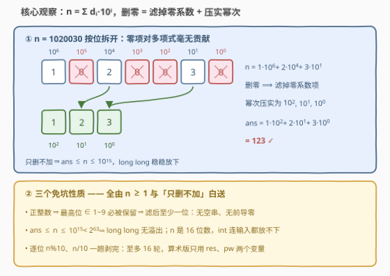
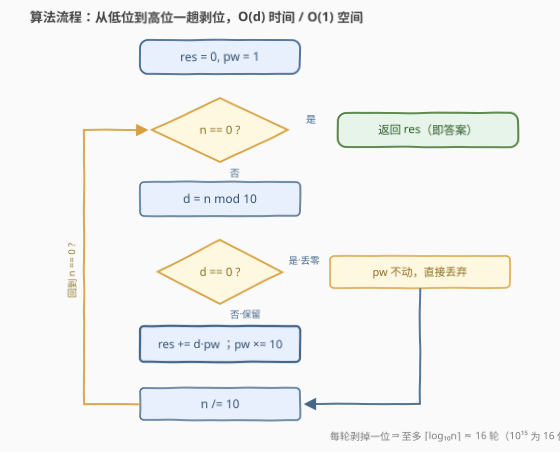

# LeetCode 移除十进制表示中的所有零 题解

## 1. 题目概述

- **标题 / 题号**：移除十进制表示中的所有零（#3726，easy）
- **链接**：https://leetcode.cn/problems/remove-zeros-in-decimal-representation/
- **难度**：简单
- **标签**：数学、模拟

**题意**：给你一个**正整数** $n$。返回一个整数，该整数是将 $n$ 的十进制表示中**所有的零**都移除后得到的结果。

**示例 1**：

```text
输入：n = 1020030
输出：123
解释：从 1020030 中移除所有的零后，得到 123。
```

**示例 2**：

```text
输入：n = 1
输出：1
解释：1 的十进制表示中没有零，因此结果为 1。
```

**约束**：

- $1 \le n \le 10^{15}$

> 💡 **审题关键**：① $n$ 是**正整数**，最高位必为 $1\sim9$，所以滤完零**至少剩一位**，结果永不为空——这是本题能放心一行过的隐藏保障；② $10^{15}$ 是 16 位数，超出 32 位 `int`（上限约 $2.1\times10^9$），C++ 必须 `long long`（函数签名也确实如此）；③ 只删数字不加数字，结果 $\le n$，全程无溢出之忧。

## 2. 解题思路

### 2.1 暴力思路

最直觉的写法：转字符串 → 逐字符过滤 `'0'` → 转回整数。

```cpp
long long removeZeros(long long n) {
    string s = to_string(n), t;
    for (char c : s) if (c != '0') t += c;
    return stoll(t);
}
```

这已经是对的、$O(d)$ 的做法。真正值得琢磨的是两件事：一是**为什么它不会出边界问题**——空串、前导零、溢出这三颗雷，全都恰好被 $n\ge1$ 这个条件挡掉；二是能不能**不开字符串**、纯算术一趟循环解决——面试里这往往是从「会做」到「理解深」的分水岭。

### 2.2 核心观察：数字是幂次的系数，删零 = 过滤系数再压实幂次



把 $n$ 写成按位展开的多项式：

$$n = \sum_{i=0}^{k} d_i \cdot 10^{i}, \qquad d_i \in \{0,\dots,9\},\ d_k \ne 0$$

「删掉所有零」等价于：**把系数为 0 的项从多项式中剔除，再把剩下的项的幂次从低到高重新编号**（$10^0, 10^1, 10^2, \dots$）。以 $n = 1020030$ 为例：

$$1020030 = 1\cdot10^6 + 0\cdot10^5 + 2\cdot10^4 + 0\cdot10^3 + 0\cdot10^2 + 3\cdot10^1 + 0\cdot10^0$$

剔除三个零系数项，剩下的 $1,2,3$ 重新配上 $10^2,10^1,10^0$：

$$\text{ans} = 1\cdot10^2 + 2\cdot10^1 + 3\cdot10^0 = 123$$

于是得到**纯算术重建**：从最低位开始剥数字（`n % 10`），维护结果 `res` 和「下一个保留位的位权」`pw`——遇到非零位就 `res += d * pw` 并让 `pw` 进一位；遇到零位直接丢弃，`pw` 原地不动。

三个免坑性质（详见上图面板二）：

- **结果非空**：$n \ge 1 \Rightarrow d_k \ge 1$，最高位必被保留，滤后至少一位（字符串版不会得到空串）；
- **无前导零**：保留的最高位就是 $d_k \ge 1$，天然合法；
- **无溢出**：只删不加 $\Rightarrow \text{ans} \le n \le 10^{15} < 2^{63}$，`long long` 稳稳放下。

### 2.3 算法流程图



**逻辑执行步骤**：

| 步骤 | 操作 | 说明 |
|------|------|------|
| ① 初始化 | `res = 0, pw = 1` | `pw` 是「下一个保留位」的位权 |
| ② 循环条件 | `n > 0`？ | 否则跳出循环，返回 `res` |
| ③ 取低位 | `d = n % 10` | 从个位开始剥 |
| ④ 零位判定 | `d == 0`？丢弃，`pw` 不动 | 零不占保留位 |
| ⑤ 非零保留 | `res += d * pw; pw *= 10` | 保留位进位 |
| ⑥ 剥掉低位 | `n /= 10` | 回到 ② |

### 2.4 示例演算

**示例 1**：`n = 1020030`（从低位到高位逐轮推进）：

| 轮次 | $n$ | $d=n\bmod 10$ | 动作 | `res` | `pw` |
|------|-----|---------------|------|-------|------|
| 1 | 1020030 | 0 | 丢弃 | 0 | 1 |
| 2 | 102003 | 3 | 保留 | 3 | 10 |
| 3 | 10200 | 0 | 丢弃 | 3 | 10 |
| 4 | 1020 | 0 | 丢弃 | 3 | 10 |
| 5 | 102 | 2 | 保留 | 23 | 100 |
| 6 | 10 | 0 | 丢弃 | 23 | 100 |
| 7 | 1 | 1 | 保留 | **123** | 1000 |

循环 7 轮（$n$ 共 7 位），返回 $123$ ✓。注意 `res` 的生长轨迹 $3 \to 23 \to 123$：低位先落座，高位后来者乘着更大的 `pw` 压到左边——这正是「重新编号幂次」的代码形态。

**示例 2**：`n = 1`：一轮即 $d=1$，`res = 1`，返回 $1$ ✓。

## 3. 参考代码

### C++

```cpp
class Solution {
public:
    long long removeZeros(long long n) {
        long long res = 0, pw = 1;
        while (n > 0) {
            long long d = n % 10;
            if (d != 0) {
                res += d * pw;
                pw *= 10;
            }
            n /= 10;
        }
        return res;
    }
};
```

> 💡 **写法要点**：
> - 全程 `long long`：$n$ 上界 $10^{15}$，32 位 `int` 连输入都放不下（函数签名已明示）；
> - `pw *= 10` 放在 `if` **内部**——零被丢弃时不占保留位，位权不该前进；若手抖移到外面，`res` 会原样拼回 $n$（位权没压实，等于什么都没删），这是全题唯一易错行；
> - 结果 $\le n$，中间量不超过 $n$，无隐藏溢出点。

### Python

```python
class Solution:
    def removeZeros(self, n: int) -> int:
        return int(str(n).replace('0', ''))
```

> 💡 **写法要点**：
> - $n \ge 1$ 保证至少一位非零，`replace` 后不会是空串，`int('')` 的雷被题目条件天然排掉；
> - 想练算术版：`res, pw = 0, 1`，循环内 `d, n = n % 10, n // 10`，与 C++ 逐行对应。

## 4. 复杂度分析

| 维度 | 复杂度 | 说明 |
|------|--------|------|
| **时间** | $O(d) = O(\log_{10} n)$ | 一趟剥完所有位，至多 16 轮（$10^{15}$ 为 16 位数） |
| **空间** | $O(1)$ | 算术版只有 `res`、`pw` 两个变量；字符串版 $O(d)$ |
| **对比** | 算术版 ≈ 字符串版 | 时间量级相同，差别只在常数与一次字符串分配 |

## 5. 扩展：删别的数字、换进制、允许 n = 0

**删任意数字 $k$**：把判定 `d == 0` 换成 `d == k`，其余一字不改——「过滤系数 + 压实幂次」的框架与删谁无关。

**换进制 $b$**：`n % 10 → n % b`、`n /= 10 → n /= b`、`pw *= 10 → pw *= b`。例如二进制删零：$0b1010$ 滤零压实成 $0b11$，即「把所有 1 位向低位压缩」，这正是一族位运算题的算术内核。

**允许 $n = 0$**：唯一会翻车的输入——滤后为空。字符串版 `int('')` 直接抛异常，需特判 `return t.empty() ? 0 : stoll(t)`；算术版循环不执行、**天然返回 0，一行不用改**——这是算术版鲁棒性的小加分项。

## 6. 面试要点

**Q1：为什么不用担心结果是空串或 0？**

> $n \ge 1$ 是正整数，最高位 $d_k \in [1,9]$ 永远非零、必被保留，所以滤后至少剩一位；且保留的最高位非零，天然无前导零问题。若题目放宽到 $n=0$，字符串版需特判空串，算术版自动返回 0。

**Q2：为什么必须用 `long long`？**

> $n \le 10^{15}$ 而 $\text{INT\_MAX} \approx 2.1\times10^9$，32 位 `int` 连输入都放不下；$10^{15} < 2^{63}-1 \approx 9.2\times10^{18}$，`long long` 余量充足。且只删不加 ⇒ 结果 $\le n$，中间量也不超过 $n$，无隐藏溢出点。

**Q3：算术版和字符串版怎么选？**

> 时间量级同为 $O(d)$。算术版 $O(1)$ 空间、无字符串分配、对 $n=0$ 天然鲁棒，白板手写更稳；字符串版胜在 Python 一行 `int(str(n).replace('0',''))`，工程可读性更好。能说出取舍本身，比背出某一种更加分。

**Q4：`pw *= 10` 为什么必须放在 `if` 内部？**

> `pw` 的语义是「下一个保留位的位权」。零位被丢弃、不占位，位权不该前进。若移到 `if` 外，`pw` 会把零也计成一位，`res` 恰好原样拼回 $n$——位权没有压实，等于什么都没删。这一行是全题唯一容易手抖的地方。

**Q5：这个「过滤 + 压实」框架还能用在哪？**

> 任何「按位映射 + 重排」的题都是同族：整数反转（Q7）是把位序倒过来压实；回文数（Q9）是反转一半后比对；十进制补数（Q1009）是二进制按位取反后按原幂次重建。掌握「系数 × 幂次」的视角，一族题一起带走。

> 💡 **一句话总结**：3726 = 把 $n$ 看成 $\sum d_i 10^i$，删零即过滤零系数、压实幂次。代码上一趟 `%10 / 10` 剥位循环，`pw` 只在保留位进位；结果非空、无前导零、无溢出三个免坑性质全部由 $n\ge1$ 与「只删不加」保证。

## 同类练习题

| # | 题目 | 与本题的关联 |
|---|------|-------------|
| 7 | [整数反转](https://leetcode.cn/problems/reverse-integer/)（[题解](../0001-0100/7_整数反转.md)） | 同样的 `%10 / 10` 剥位循环，只是把位序倒过来重建，另附溢出判断的经典坑 |
| 9 | [回文数](https://leetcode.cn/problems/palindrome-number/)（[题解](../0001-0100/9_回文数.md)） | 反转一半数字做比对，剥位循环的高频出场 |
| 1009 | [十进制整数的补数](https://leetcode.cn/problems/complement-of-base-10-integer/)（[题解](../1001-1100/1009_十进制整数的补数.md)） | 二进制按位取反 + 权重重建，「系数 × 幂次」视角的直接练习 |
| 1317 | [将整数转换为两个无零整数的和](https://leetcode.cn/problems/convert-integer-to-the-sum-of-two-no-zero-integers/)（[题解](../1301-1400/1317_将整数转换为两个无零整数的和.md)） | 同样围绕「数字里有没有 0」做判定，练十进制逐位检查 |
| 2578 | [最小和分割](https://leetcode.cn/problems/split-with-minimum-sum/)（[题解](../2501-2600/2578_最小和分割.md)） | 拆位、排序、重新组数——十进制数字操作的另一面 |
