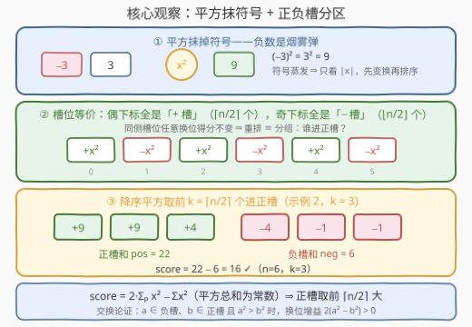
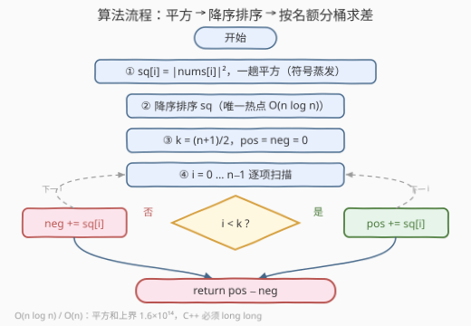

# LeetCode 最大交替平方和 题解

## 1. 题目概述

- **标题 / 题号**：最大交替平方和（#3727，medium）
- **链接**：https://leetcode.cn/problems/maximum-alternating-sum-of-squares/
- **难度**：中等
- **标签**：贪心、数组、排序

**题意**：给你一个整数数组 `nums`。你可以以**任意顺序重新排列元素**。

数组 `arr` 的**交替得分**定义为：

$$\text{score} = arr_0^2 - arr_1^2 + arr_2^2 - arr_3^2 + \cdots$$

在对 `nums` 重新排列后，返回其**最大可能的交替得分**。

**示例 1**：

```text
输入：nums = [1,2,3]
输出：12
解释：一种最优重排为 [2,1,3]：score = 2² − 1² + 3² = 4 − 1 + 9 = 12。
```

**示例 2**：

```text
输入：nums = [1,-1,2,-2,3,-3]
输出：16
解释：一种最优重排为 [-3,-1,-2,1,3,2]：
      score = 9 − 1 + 4 − 1 + 9 − 4 = 16。
```

**约束**：

- $1 \le \text{nums.length} \le 10^5$
- $-4 \times 10^4 \le \text{nums}[i] \le 4 \times 10^4$

> 💡 **审题关键**：① 得分里只有**平方项**——$(−x)^2 = x^2$，原符号毫无信息量，题目给出负数纯属烟雾弹；② 下标**偶数位一律 +、奇数位一律 −**，同奇偶的下标彼此**完全等价**（换位不改变得分），所以「重排」的真正自由度不是 $n!$ 种排列，而是「**谁分到正槽、谁分到负槽**」；③ 正槽有 $\lceil n/2 \rceil$ 个、负槽有 $\lfloor n/2 \rfloor$ 个——长度奇偶只影响两侧名额数，不影响策略；④ $n \le 10^5$ 要求 $O(n \log n)$ 以内的算法。

## 2. 解题思路

### 2.1 暴力思路

最朴素的想法是枚举全排列，每个排列 $O(n)$ 求一次得分——$O(n \cdot n!)$，$n$ 上到 $10^5$ 后是天文数字，直接排除。

冷静观察会发现，得分根本**不依赖具体排列**：元素 $x$ 放在任何一个偶数下标，贡献都是 $+x^2$；放在任何一个奇数下标，贡献都是 $-x^2$。于是 $n!$ 种排列坍缩成 $\binom{n}{\lceil n/2 \rceil}$ 种「正槽集合」的选法——组合数依然是天文数字，但问题已经从「排列」降维成「**分组**」：选 $\lceil n/2 \rceil$ 个元素进正槽、其余 $\lfloor n/2 \rfloor$ 个进负槽，最大化两组平方和之差。

分组仍有指数级选法，必须找出最优解的结构性条件——这正是贪心登场的位置。

### 2.2 核心观察：平方抹符号 + 正负槽分区



三步把问题化成一句话。

**第一步：平方抹掉符号**。$(−x)^2 = x^2$，得分只由 $|\text{nums}[i]|$ 决定，负号在进入平方的瞬间蒸发。先全体取绝对值（或直接平方），不损失任何一般性。

**第二步：槽位等价 ⇒ 问题坍缩为分组**。记正槽集合为 $P$（偶数下标，$|P| = \lceil n/2 \rceil$）、负槽集合为 $Q$（奇数下标，$|Q| = \lfloor n/2 \rfloor$）。任何大小为 $\lceil n/2 \rceil$ 的子集都能放进正槽（槽内顺序随便排），于是：

$$\text{score} = \sum_{x \in P} x^2 \;-\; \sum_{x \in Q} x^2$$

**第三步：恒等变形 ⇒ 贪心自证**。注意 $P \cup Q$ 恰好是全体元素，把负槽改写成「总和减正槽」：

$$\text{score} = \sum_{x \in P} x^2 - \Big( \sum_{\text{all}} x^2 - \sum_{x \in P} x^2 \Big) = 2 \sum_{x \in P} x^2 - \sum_{\text{all}} x^2$$

**平方总和是常数**——最大化得分 $\iff$ 最大化 $\sum_{x \in P} x^2$。而非负数中选 $\lceil n/2 \rceil$ 个使平方和最大，答案不言自明：**取平方最大的前 $\lceil n/2 \rceil$ 个**。

**交换论证**（严格版）：若某最优解中存在 $a \in Q$、$b \in P$ 且 $a^2 > b^2$，交换二者，得分变化 $2(a^2 - b^2) > 0$，与最优性矛盾。故最优解中正槽的每个平方 $\ge$ 负槽的每个平方，即正槽恰为前 $\lceil n/2 \rceil$ 大的平方。$\blacksquare$

> ⚠️ **两个常见坑**：
> - **按原值排序**（带着符号）会错。例如 $[-5, 4]$：按值降序排 $[4, -5]$ 得 $16 - 25 = -9$；按绝对值排 $[5, 4]$ 得 $25 - 16 = 9$。平方/取绝对值必须发生在排序**之前**。
> - **奇数长度不必特判**：$n$ 为奇数时正槽恰好多一个名额，$k = \lceil n/2 \rceil$ 自动覆盖（$n = 1$ 时答案就是 $\text{nums}[0]^2$）。

**最终答案**：

$$\text{ans} = \underbrace{\sum_{i=0}^{k-1} sq_i}_{\text{前 } k \text{ 大平方和}} \;-\; \underbrace{\sum_{i=k}^{n-1} sq_i}_{\text{其余}}, \qquad sq \text{ 为降序平方序列},\ k = \Big\lceil \frac{n}{2} \Big\rceil$$

### 2.3 算法流程图



**逻辑执行步骤**：

| 步骤 | 操作 | 说明 |
|------|------|------|
| ① 平方 | $sq_i = \text{nums}_i^2$ | 符号蒸发，等价于先取绝对值 |
| ② 排序 | $sq$ 降序 | $O(n \log n)$，全流程唯一热点 |
| ③ 定名额 | $k = \lceil n/2 \rceil$ | 正槽个数；奇数长度自动多一 |
| ④ 分桶求和 | $\text{pos} = \sum_{i < k} sq_i$，$\text{neg} = \sum_{i \ge k} sq_i$ | 一趟扫描 |
| ⑤ 输出 | $\text{pos} - \text{neg}$ | 等价于 $2\,\text{pos} - \text{total}$，可互验 |

### 2.4 示例演算

**示例 2**：`nums = [1,-1,2,-2,3,-3]`，$n = 6$，$k = 3$：

| 阶段 | 数据 |
|------|------|
| 原数组（符号无用） | $[1, -1, 2, -2, 3, -3]$ |
| 平方 | $[1, 1, 4, 4, 9, 9]$ |
| 降序排序 | $[\boxed{9, 9, 4},\ 4, 1, 1]$ |
| 分桶 | 正槽 $P = \{9, 9, 4\}$ 和为 $22$；负槽 $Q = \{4, 1, 1\}$ 和为 $6$ |
| 得分 | $22 - 6 = \mathbf{16}$ ✓ |

一个实现该分组的重排：正槽（下标 0/2/4）放 $3, -3, -2$，负槽（下标 1/3/5）放 $2, 1, -1$，即 $[3, 2, -3, 1, -2, -1]$：$9 - 4 + 9 - 1 + 4 - 1 = 16$ ✓。注意**同一个分组对应许多排列**（槽内顺序随意）——官方给的 $[-3,-1,-2,1,3,2]$ 与这里是同一分组的不同排列，殊途同归。

**示例 1**：`nums = [1,2,3]`，$k = 2$：平方降序 $[9, 4, 1]$，$(9 + 4) - 1 = \mathbf{12}$ ✓（官方的 $[2,1,3]$ 与 $[3,1,2]$ 同属一个分组）。

## 3. 参考代码

### C++

```cpp
class Solution {
public:
    long long maxAlternatingSum(vector<int>& nums) {
        int n = nums.size();
        vector<long long> sq;
        sq.reserve(n);
        for (int x : nums) {
            long long a = abs(x);
            sq.push_back(a * a);
        }
        sort(sq.begin(), sq.end(), greater<long long>());
        long long pos = 0, neg = 0;
        for (int i = 0; i < n; ++i)
            (i < (n + 1) / 2 ? pos : neg) += sq[i];
        return pos - neg;
    }
};
```

> 💡 **写法要点**：
> - **溢出是本题唯一的工程陷阱**：单个平方 $\le (4\times10^4)^2 = 1.6\times10^9$ 恰好还在 `int` 范围内，但平方**和**可达 $10^5 \times 1.6\times10^9 = 1.6\times10^{14}$——平方值与累加器都必须 `long long`（先 `long long a = abs(x)` 再自乘，杜绝 `int × int` 中间结果的边缘风险）；
> - 整数除法 $(n+1)/2$ 天然等于 $\lceil n/2 \rceil$，奇偶长度统一处理，无需任何分支；
> - 也可写成 `ans += (i % 2 == 0 ? sq[i] : -sq[i])`，与「前 $k$ 个之和减其余」完全等价。

### Python

```python
class Solution:
    def maxAlternatingSum(self, nums: List[int]) -> int:
        sq = sorted((x * x for x in nums), reverse=True)
        k = (len(sq) + 1) // 2
        return sum(sq[:k]) - sum(sq[k:])
```

> 💡 **写法要点**：
> - 直接 `x * x` 连 `abs` 都省了——平方天然吞符号，这正是第一步观察的代码化；
> - `(n + 1) // 2` 是 $\lceil n/2 \rceil$ 的标准整除写法，切片 `sq[:k]` / `sq[k:]` 恰好切出正负两桶；
> - Python 大整数无溢出之忧（答案上界 $1.6\times10^{14}$），C++ 侧则必须 `long long`。

## 4. 复杂度分析

| 维度 | 复杂度 | 说明 |
|------|--------|------|
| **时间** | $O(n \log n)$ | 排序主导；平方与分桶求和均为一趟 $O(n)$ |
| **空间** | $O(n)$ | 平方数组（若对 `nums` 原地取绝对值再排序，可降到 $O(1)$ 辅助空间） |
| **对比暴力** | $O(n \cdot n!) \to O(n \log n)$ | 「槽位等价」把排列自由度坍缩成分组，再被恒等式 + 交换论证一刀定死 |

## 5. 扩展：免排序的 O(n) 路线与「不许重排」变体

**平均 $O(n)$ 的快速选择**：我们只需要「前 $k$ 大平方之和」，并不需要完整有序序列。`nth_element`（C++）/ 快速选择把第 $k$ 大放到位置 $k$、左侧元素都不小于它，随后两侧各自求和即可——平均 $O(n)$，最坏 $O(n^2)$（随机化基准后可忽略最坏情形）。

**值域计数排序**：$|x| \le 4\times10^4$，值域 $V = 4\times10^4 + 1$，开桶计数后从大到小累计——确定性 $O(n + V)$，代价是 $O(V)$ 空间。

**恒等式自检**：$\text{ans} = 2\,\text{pos} - \text{total}$（$\text{total}$ 为平方总和）。两条算路互相验证可防手滑；提交前拿 $n=1$ 与示例 2 各测一遍，恰好覆盖奇偶两种长度。

**变体对比**——把平方换成**原值**（可正可负、允许重排）：框架原封不动，$\text{score} = 2\sum_{x \in P} x - \sum_{\text{all}} x$，取**前 $\lceil n/2 \rceil$ 大的原值**进正槽即可（负数天然沉底进负槽，负负得正变增益）。但若**不许重排**、只能在保持相对顺序的子序列上求最大交替和，就变成 [1911. 最大交替子序列和](https://leetcode.cn/problems/maximum-alternating-subsequence-sum/)——得用 $O(n)$ DP（维护「以偶/奇位置结尾的最大交替和」两个状态），排序贪心彻底失效。「**能不能重排**」是这类题的第一审题点。

## 6. 面试要点

**Q1：为什么负数是烟雾弹？**

> 得分中每个元素都以平方出现，$(−x)^2 = x^2$。符号在进入计算的第一步就被吞噬，整个问题只关于 $|\text{nums}[i]|$——先取绝对值（或直接平方）再谈策略。

**Q2：为什么 $n!$ 种排列可以坍缩成「分组」？**

> 得分对「同奇偶下标」完全对称：元素 $x$ 放在哪个偶数下标都是 $+x^2$，放在哪个奇数下标都是 $-x^2$。排列 = 「选 $\lceil n/2 \rceil$ 个进正槽」×「槽内任意排」，后者对得分零影响，故唯一有效的决策就是分组。

**Q3：贪心取前 $\lceil n/2 \rceil$ 大的平方，怎么证明？**

> 恒等式：$\text{score} = 2\sum_{x \in P} x^2 - \sum_{\text{all}} x^2$，总和为常数，最大化 $\sum_P$ 即取前 $k$ 大。或交换论证：若 $a \in Q$、$b \in P$ 且 $a^2 > b^2$，交换后得分 $+2(a^2 - b^2) > 0$，最优解中不可能存在这样的逆序对，故 $P$ 恰为前 $k$ 大。

**Q4：$n$ 为奇数时要特判吗？**

> 不用。奇数长度只是让正槽多一个名额（$k = \lceil n/2 \rceil$），代码里 `(n + 1) / 2` 自动处理；$n = 1$ 时答案退化为单个平方，也被同一公式覆盖。

**Q5：工程上最容易翻车的点？**

> 溢出。单个平方 $1.6\times10^9$ 勉强在 `int` 内，但总和上界 $1.6\times10^{14}$ 远超 32 位——C++ 中平方值与累加器都要 `long long`；Python 无此忧。另一个坑是「按带符号的原值排序」，务必先平方/取绝对值再排。

> 💡 **一句话总结**：3727 = 平方抹符号 + 槽位等价把 $n!$ 排列坍缩成 $\binom{n}{k}$ 分组 + 恒等式 $\text{score} = 2\sum_P - \text{total}$ 让贪心自证。三个要点带走：「先变换再排序」的顺序不可颠倒、$(n+1)/2$ 整除技巧免奇偶特判、平方和 $1.6\times10^{14}$ 的 `long long` 警报。

## 同类练习题

| # | 题目 | 与本题的关联 |
|---|------|-------------|
| 561 | [数组拆分](https://leetcode.cn/problems/array-partition/)（[题解](../0501-0600/561_数组拆分.md)） | 排序后隔位取数——同款「排序决定奇偶归属」结构的最小值配对版 |
| 1877 | [数组中最大数对和的最小值](https://leetcode.cn/problems/minimize-maximum-pair-sum-in-array/)（[题解](../1801-1900/1877_数组中最大数对和的最小值.md)） | 排序 + 首尾配对，「排序后按下标分组」的孪生套路，与本题恰为最大化/最小化的对偶 |
| 1913 | [两个数对之间的最大乘积差](https://leetcode.cn/problems/maximum-product-difference-between-two-pairs/) | 排序取两极——「取前 k 大」贪心的四元特例 |
| 2144 | [打折购买糖果的最小开销](https://leetcode.cn/problems/minimum-cost-of-buying-candies-with-discount/)（[题解](../2101-2200/2144_购买糖果的最低成本.md)） | 排序贪心 + 名额分配，「买二赠一」与「正负槽名额」同构 |
| 1911 | [最大交替子序列和](https://leetcode.cn/problems/maximum-alternating-subsequence-sum/) | 同样追求最大交替和但不许重排、只能选子序列——DP 版对照组，凸显「可重排 ⇒ 分组贪心」这一前提 |
