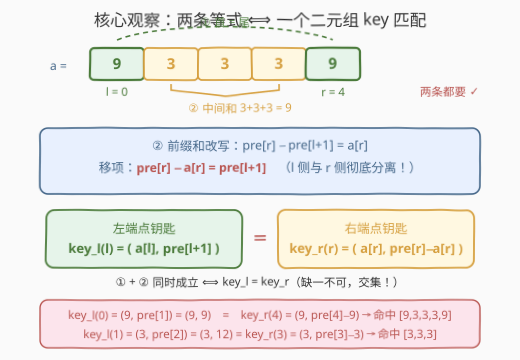
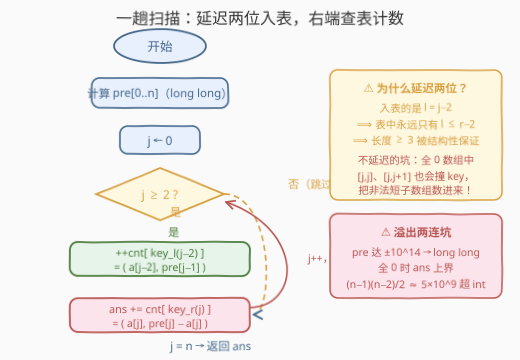

# 边界与内部和相等的稳定子数组

- **题目名称**：边界与内部和相等的稳定子数组
- **链接**：[3728. 边界与内部和相等的稳定子数组](https://leetcode.cn/problems/stable-subarrays-with-equal-boundary-and-interior-sum/)
- **难度**：中等
- **标签**：数组、哈希表、前缀和

## 1. 题目概述

给你一个整数数组 `capacity`。当满足以下条件时，子数组 `capacity[l..r]` 被视为**稳定**数组：

- 其长度**至少**为 3；
- **首**元素与**尾**元素都等于它们之间所有元素的**和**，即 `capacity[l] = capacity[r] = capacity[l+1] + capacity[l+2] + ... + capacity[r-1]`。

返回一个整数，表示**稳定子数组**的数量（子数组是数组中连续且非空的元素序列）。

**示例 1**：

```text
输入：capacity = [9,3,3,3,9]
输出：2
解释：[9,3,3,3,9] 稳定（首尾都是 9，中间和 3+3+3 = 9）；
      [3,3,3] 稳定（首尾都是 3，中间和 3）。
```

**示例 2**：

```text
输入：capacity = [1,2,3,4,5]
输出：0
解释：不存在首尾元素相等的子数组，答案为 0。
```

**示例 3**：

```text
输入：capacity = [-4,4,0,0,-8,-4]
输出：1
解释：[-4,4,0,0,-8,-4] 稳定（首尾都是 -4，中间和 4+0+0+(-8) = -4）。
```

**约束条件**：

- $3 \le \text{capacity.length} \le 10^5$
- $-10^9 \le \text{capacity}[i] \le 10^9$

> 💡 **审题关键**：① 判定条件其实是**两条独立等式**——首尾相等 $a_l = a_r$、中间和等于首尾 $\sum_{l<i<r} a_i = a_r$，两者必须同时成立；② 长度至少为 3 意味着 $r \ge l + 2$，中间段**非空**但可以为零和（含负数，见示例 3）；③ $n \le 10^5$ 暗示 $O(n)$ / $O(n \log n)$ 算法，$O(n^2)$ 枚举端点对（约 $5 \times 10^9$ 对）必超时。

---

## 2. 解题思路

### 2.1 暴力思路

枚举所有满足 $l + 2 \le r$ 的端点对，逐对用区间和判断——前缀和预处理后每对 $O(1)$，总计 $O(n^2) \approx 5 \times 10^9$，对 $n = 10^5$ 而言必然超时。

一个常见的优化念头：既然要求 $a_l = a_r$，把**相同元素值的下标分组**，只在组内两两配对。但最坏情况（全 0 数组）所有下标都在一组，组内配对仍是平方级——分组剪枝救不了最坏情形。

瓶颈的本质：判定一个 $(l, r)$ 对需要**同时**核对两条等式，而暴力把这两条等式的核对成本摊到了每一对上。要想突破 $O(n^2)$，必须让「满足等式的对」被**批量**数出来，而不是逐对验证。

### 2.2 核心观察：两条等式坍缩成一个二元组 key 的哈希匹配



引入前缀和 $\text{pre}[i] = a_0 + a_1 + \cdots + a_{i-1}$（$\text{pre}[0] = 0$），则中间和可以 $O(1)$ 表达：

$$\sum_{i=l+1}^{r-1} a_i = \text{pre}[r] - \text{pre}[l+1]$$

把两条判定等式改写为「左边只含 $l$、右边只含 $r$」的形式：

**等式 ①（首尾相等）**：

$$a_l = a_r$$

**等式 ②（中间和等于首尾）**：$\text{pre}[r] - \text{pre}[l+1] = a_r$，移项得

$$\text{pre}[r] - a_r = \text{pre}[l+1]$$

> 💡 **移项是全题的点睛之笔**：把 $l$ 侧与 $r$ 侧彻底分离后，「$l$ 处的一个数」与「$r$ 处的一个数」相等——这正是 560 题「和为 K 的子数组」用前缀和 + 哈希表数对子的经典结构。

现在给每个位置造两把「钥匙」：

$$\text{key}_l(l) = \big(\,a_l,\ \text{pre}[l+1]\,\big) \qquad \text{key}_r(r) = \big(\,a_r,\ \text{pre}[r] - a_r\,\big)$$

**子数组 $[l, r]$（$r \ge l+2$）稳定 $\iff$ $\text{key}_l(l) = \text{key}_r(r)$**。

于是原问题变成：数满足 key 相等**且** $l \le r - 2$ 的位置对个数——从左到右扫一遍，用哈希表维护「已激活左端点」的 key 计数，右端点到达时查一次表即可，整体 $O(n)$。

> ⚠️ **key 必须是二元组，缺一不可**：只留 $a_l = a_r$ 会把首尾相等但中间和不对的对数进来；只留 $\text{pre}[r] - a_r = \text{pre}[l+1]$ 会数进首尾不等的对。两条等式各自把候选集过滤一遍，取**交集**才等于答案——交集恰好由「两个分量都相等」的联合 key 表达。

**示例 1 中的两次命中**（$a = [9,3,3,3,9]$，$\text{pre} = [0,9,12,15,18,27]$）：

- $\text{key}_l(1) = (3,\ \text{pre}[2]) = (3, 12)$，$\text{key}_r(3) = (3,\ \text{pre}[3]-3) = (3, 12)$ → 命中，对应 $[3,3,3]$；
- $\text{key}_l(0) = (9,\ \text{pre}[1]) = (9, 9)$，$\text{key}_r(4) = (9,\ \text{pre}[4]-9) = (9, 9)$ → 命中，对应 $[9,3,3,3,9]$。

### 2.3 算法流程图



**逻辑执行步骤**：

| 步骤 | 操作 | 说明 |
|------|------|------|
| ① 预处理 | 计算 $\text{pre}[0..n]$ | $O(n)$，C++ 必须 `long long` |
| ② 扫描 | $j = 0 \dots n-1$ | $j$ 扮演右端点 $r$ |
| ③ 延迟插入 | 若 $j \ge 2$，把 $\text{key}_l(j-2)$ 计入哈希表 | 此刻 $r = j$ 首次允许 $l = j-2$ |
| ④ 查询计数 | $\text{ans} \mathrel{+}= \text{cnt}[\text{key}_r(j)]$ | 表中只可能有 $l \le j-2$ 的 key |
| ⑤ 返回 | $\text{ans}$ | |

> ⚠️ **为什么必须延迟两位再插入**：若 $j$ 一到就把自己作为左端点入表再查询，$l = r$、$l = r-1$ 的非法对可能撞 key。反例：全 0 数组中 $\text{key}_l(j) = (0, \text{pre}[j+1]) = (0, \text{pre}[j]) = \text{key}_r(j)$，会把长度 1 的 $[a_j]$ 误计入；同理 $\text{key}_l(j+1)$ 可能与 $\text{key}_r(j)$ 相撞误计入长度 2 的对。「先让 $j-2$ 入表、再以 $j$ 查询」保证表内任意 $l$ 都满足 $l \le j - 2$，长度约束被结构性满足，无需任何额外判断。

### 2.4 示例演算

**示例 1**：$a = [9,3,3,3,9]$，$\text{pre} = [0,9,12,15,18,27]$。

| $j$ | 入表 $\text{key}_l(j-2)$ | 查询 $\text{key}_r(j)$ | 命中 | ans |
|-----|--------------------------|------------------------|------|-----|
| 0 | —（$j<2$ 不入表） | $(9,\ \text{pre}[0]-9) = (9, -9)$ | 0 | 0 |
| 1 | —（$j<2$ 不入表） | $(3,\ \text{pre}[1]-3) = (3, 6)$ | 0 | 0 |
| 2 | $(9,\ \text{pre}[1]) = (9, 9)$ | $(3,\ \text{pre}[2]-3) = (3, 9)$ | 0 | 0 |
| 3 | $(3,\ \text{pre}[2]) = (3, 12)$ | $(3,\ \text{pre}[3]-3) = (3, 12)$ | 1 | 1 ← $[3,3,3]$ |
| 4 | $(3,\ \text{pre}[3]) = (3, 15)$ | $(9,\ \text{pre}[4]-9) = (9, 9)$ | 1 | 2 ← $[9,3,3,3,9]$ |

输出 $2$ ✓。

**示例 3**：$a = [-4,4,0,0,-8,-4]$，$\text{pre} = [0,-4,0,0,0,-8,-12]$。唯一命中在 $j=5$：入表 $\text{key}_l(3) = (0, \text{pre}[4]) = (0, 0)$，查询 $\text{key}_r(5) = (-4, \text{pre}[5]-(-4)) = (-4, -4)$；而更早入表的 $\text{key}_l(0) = (-4, \text{pre}[1]) = (-4, -4)$ 与之相等——命中 1 次，输出 $1$ ✓（注意中间段含负数照样成立，零和中间段是合法的）。

---

## 3. 参考代码

### C++

```cpp
class Solution {
private:
    struct PairHash {
        size_t operator()(const pair<long long, long long>& p) const {
            return hash<long long>()(p.first) ^ (hash<long long>()(p.second) << 1);
        }
    };
public:
    long long countStableSubarrays(vector<int>& capacity) {
        int n = capacity.size();
        vector<long long> pre(n + 1);
        for (int i = 0; i < n; ++i) pre[i + 1] = pre[i] + capacity[i];

        unordered_map<pair<long long, long long>, int, PairHash> cnt;
        long long ans = 0;
        for (int j = 0; j < n; ++j) {
            if (j >= 2)                       // 延迟两位：此刻 l = j-2 首次可配对
                ++cnt[{(long long)capacity[j - 2], pre[j - 1]}];
            auto key = make_pair((long long)capacity[j], pre[j] - capacity[j]);
            auto it = cnt.find(key);
            if (it != cnt.end()) ans += it->second;
        }
        return ans;
    }
};
```

> 💡 **写法要点**：
> - $\text{pre}$ 值域 $\pm 10^{14}$（$10^5 \times 10^9$），累加必须 `long long`，key 第二元同理；
> - `unordered_map` 没有针对 `pair` 的默认哈希，`PairHash` 用异或 + 移位把两个 64 位分量揉成一个 `size_t`（C++20 起可用 `boost::hash_combine` 风格写法，或退一步用 `map`，$O(n \log n)$ 也能过）；
> - 先插入 $j-2$、后查询 $j$，两步顺序不可颠倒——顺序本身就编码了 $l \le r - 2$ 的约束。

### Python

```python
class Solution:
    def countStableSubarrays(self, capacity: List[int]) -> int:
        n = len(capacity)
        presum = [0] * (n + 1)
        for i, v in enumerate(capacity):
            presum[i + 1] = presum[i] + v

        cnt = {}
        ans = 0
        for j in range(n):
            if j >= 2:                        # 延迟两位：l = j-2 首次可配对
                k = (capacity[j - 2], presum[j - 1])
                cnt[k] = cnt.get(k, 0) + 1
            ans += cnt.get((capacity[j], presum[j] - capacity[j]), 0)
        return ans
```

> 💡 **写法要点**：
> - 元组天然可哈希，直接当字典 key，无需自定义哈希；
> - 用 `cnt.get(key, 0)` 而非 `defaultdict` 查询，避免为不存在的右端 key 空占哈希桶（查询的 key 种类可能远多于入表的）；
> - Python 大整数无溢出之忧；C++ 玩家则要同时盯住 `pre` 与 `ans` 两处 `long long`。

---

## 4. 复杂度分析

| 维度 | 复杂度 | 说明 |
|------|--------|------|
| **时间** | $O(n)$ | 预处理一趟 + 扫描一趟，每轮哈希插入/查询均摊 $O(1)$ |
| **空间** | $O(n)$ | 前缀和数组 $O(n)$ + 哈希表最多存 $n - 2$ 个 key |
| **对比暴力** | $O(n^2) \to O(n)$ | 逐对验证 $5 \times 10^9$ 次 → 每个位置一次入表一次查表，约 $2 \times 10^5$ 次哈希操作 |

---

## 5. 扩展：上界、变体与「key 设计」的一般化

**答案的上界有多大？** 全 0 数组中**每个**长度 $\ge 3$ 的子数组都稳定（首尾都是 0，中间和也是 0），此时答案 $= \sum_{k=3}^{n}(n-k+1) = \frac{(n-1)(n-2)}{2} \approx 5 \times 10^9$，超出 32 位有符号整数上限（$2^{31}-1 \approx 2.1 \times 10^9$）——这就是函数签名返回 `long long` 的原因，也是本题最隐蔽的 WA 来源。顺带一提，全 0 数组同时是「延迟两位插入」必要性的最小反例（若不延迟，$[a_j]$ 与 $[a_j, a_{j+1}]$ 都会撞 key）。

**若把「长度至少 3」改成「长度恰好为 $k$」**：key 匹配结构不变，但哈希表要改造成「滑窗」——位置 $j$ 入表 $l = j-k+1$ 的 key、同时把 $l = j-k$ 的 key **移出**表（或改用计数减一），保证表内恰好是窗口内的合法左端点。定长约束天然适配滑动窗口。

**key 设计的一般化视角**：这一族题目的母模板是「把 $(l, r)$ 对的约束改写成 $F(l) = G(r)$，再用哈希表数相等对」：

| 题目 | 约束改写后的 key |
|------|------------------|
| 560 和为 K 的子数组 | $\text{pre}[l] = \text{pre}[r] - k$（单值 key） |
| 974 和可被 K 整除的子数组 | $\text{pre}[l] \equiv \text{pre}[r] \pmod k$（取模降维 key） |
| 930 和相同的二元子数组 | $\text{pre}[l] = \text{pre}[r] - \text{goal}$（单值 key） |
| **本题** | $(a_l, \text{pre}[l+1]) = (a_r, \text{pre}[r] - a_r)$（**二元组 key**） |

当约束含**多条独立等式**时，key 就从单值升维成元组——识别「几条等式 → 几元 key」是套用模板前最值得停下来想的一步。

---

## 6. 面试要点

**Q1：如何把「中间和等于首尾」转化为 $O(1)$ 可判定的形式？**

> 前缀和改写：$\sum_{l<i<r} a_i = \text{pre}[r] - \text{pre}[l+1]$，与 $a_r$ 相等并移项得 $\text{pre}[r] - a_r = \text{pre}[l+1]$。移项后 $l$ 侧、$r$ 侧彻底分离，为哈希计数铺平道路——这是所有「前缀和 + 哈希」题目的共同起手式。

**Q2：为什么 key 必须是 $(a_i, \text{pre 衍生值})$ 二元组？单独用一个前缀和行不行？**

> 不行。原判定是**两条独立等式**（首尾相等、中间和等于首尾），单用任何一条都会数进只满足一半条件的对。联合 key 表达的是两条约束的**交集**：二元组完全相等当且仅当两条等式同时成立。等式条数 = key 元数，这是模板的一般规律。

**Q3：「延迟两位插入」防的是什么？不用它会错在哪？**

> 防 $l > r - 2$ 的非法对撞 key。反例是全 0 数组：$\text{key}_l(j) = (0, \text{pre}[j+1]) = (0, \text{pre}[j]) = \text{key}_r(j)$，若查询前表中已有 $j$ 自己（或 $j+1$），长度 1 或 2 的子数组会被误计入。「处理 $j$ 前先插入 $l = j - 2$」让长度约束 $r \ge l + 2$ 被表的时序结构自动保证。

**Q4：哪些地方会溢出？**

> 三处：① 前缀和 $|\text{pre}| \le 10^{14}$，C++ 用 `int` 必爆；② key 第二元 $\text{pre} \pm a$ 同样达 $10^{14}$ 量级；③ 答案上界 $\frac{(n-1)(n-2)}{2} \approx 5 \times 10^9$（全 0 数组取到），超 32 位 int——返回值签名 `long long` 既是提示也是考点。Python 无此忧虑。

**Q5：能否先把同值下标分组再在组内配对，避免哈希？**

> 分组只利用了等式①，组内配对仍需逐对核对等式②，最坏（全同值）仍 $O(n^2)$。哈希方案的本质是把等式②也编进 key，让「组内配对 + 和校验」坍缩成一次查表——两条约束都消化进 key，才配得上 $O(n)$。

> 💡 **一句话总结**：3728 = 前缀和移项（分离 $l$/$r$ 侧）+ 双等式合成二元组 key + 延迟两位插入（结构性保证长度 $\ge 3$）。带走三点：移项分离是哈希计数的门票、等式条数决定 key 元数、全 0 数组既是上界反例也是时序陷阱。

---

## 7. 同类练习题

- [560. 和为K的子数组](https://leetcode.cn/problems/subarray-sum-equals-k/)（[题解](../0501-0600/560_和为K的子数组.md)）：「前缀和 + 哈希计数」母题，单值 key $\text{pre}[l] = \text{pre}[r] - k$，本题的二元组 key 是它的升维版
- [930. 和相同的二元子数组](https://leetcode.cn/problems/binary-subarrays-with-sum/)（[题解](../0901-1000/930_和相同的二元子数组.md)）：同结构单值 key 计数，适合用来对照「多一条等式就多一元 key」的分寸感
- [974. 和可被K整除的子数组](https://leetcode.cn/problems/subarray-sums-divisible-by-k/)（[题解](../0901-1000/974_和可被K整除的子数组.md)）：key 是前缀和取模——观察 key 的「变换」而非「元数」的变体
- [1248. 统计优美子数组](https://leetcode.cn/problems/count-number-of-nice-subarrays/)（[题解](../1201-1300/1248_统计优美子数组.md)）：把奇偶性压进前缀和，等价改写 $\text{pre}[l] \equiv \text{pre}[r] \pmod 2$ 后同模板数对
- [1524. 和为奇数的子数组数目](https://leetcode.cn/problems/number-of-sub-arrays-with-odd-sum/)（[题解](../1501-1600/1524_和为奇数的子数组数目.md)）：奇偶前缀和计数，模 2 降维 key 的又一实例
