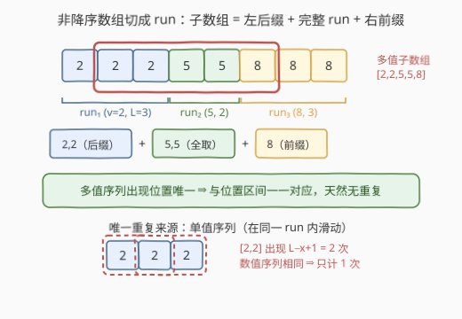
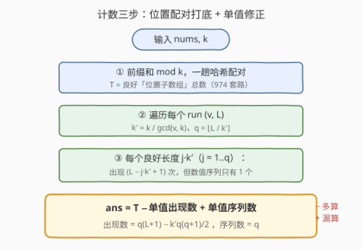

# LeetCode 统计有序数组中可被 K 整除的子数组数量 题解

## 1. 题目概述

- **标题 / 题号**：统计有序数组中可被 K 整除的子数组数量（#3729，hard）
- **链接**：https://leetcode.cn/problems/count-distinct-subarrays-divisible-by-k-in-sorted-array/
- **难度**：困难
- **标签**：数组、哈希表、前缀和

**题意**：给你一个按**非降序**排列的整数数组 `nums` 和一个正整数 `k`。如果 `nums` 的某个**子数组**的元素和可以被 `k` **整除**，则称其为**良好**子数组。返回 `nums` 中**不同的**良好子数组的数量。

当两个子数组的**数值序列**不同时，它们被视为**不同**的子数组。例如在 `[1, 1, 1]` 中，有 3 个不同的子数组：`[1]`、`[1, 1]` 和 `[1, 1, 1]`。

**示例 1**：

```text
输入：nums = [1,2,3], k = 3
输出：3
解释：良好子数组为 [1,2]、[3] 和 [1,2,3]。[1,2,3] 是良好的，因为 1+2+3=6，且 6 % 3 = 0。
```

**示例 2**：

```text
输入：nums = [2,2,2,2,2,2], k = 6
输出：2
解释：良好子数组为 [2,2,2]（和 6）与 [2,2,2,2,2,2]（和 12）。[2,2,2] 只计数一次。
```

**约束**：

- $1 \le \text{nums.length} \le 10^5$
- $1 \le \text{nums}[i] \le 10^9$
- `nums` 按非降序排列
- $1 \le k \le 10^9$

> 💡 **审题关键**：①「不同」按**数值序列**去重，不是按位置——`[2,2,2]` 里区间 $[0,1]$ 和 $[1,2]$ 是同一个子数组 `[2,2]`；② **非降序**是全题的钥匙：它决定了子数组必然呈「同值段后缀 + 完整同值段 + 同值段前缀」的规整结构，去重才能被线性解决；③ $n$ 达 $10^5$，$O(n^2)$ 枚举必超时；元素和最大 $10^5 \times 10^9 = 10^{14}$，前缀和必须用 64 位整数。

## 2. 解题思路

### 2.1 暴力思路：枚举所有子数组 + 哈希去重

双重循环枚举全部 $O(n^2)$ 个子数组，把每个良好子数组的数值序列（元组）塞进哈希集合，最后返回集合大小。

正确性无疑，但 $n = 10^5$ 时子数组个数达 $5 \times 10^9$，序列化总长度更是天文数字——时间与空间双双爆炸。必须利用「非降序」的结构，把**按数值序列去重**转化为**按位置计数**。

### 2.2 核心观察：多值子数组与位置区间一一对应，单值子数组才需要去重



**观察一（结构）**：把非降序数组按值切成若干 **run**（极大同值连续段）。子数组是连续区间，它覆盖每个 run 的方式只有三种：整段吞下（中间的 run）、只取一段**后缀**（左端所在的 run）、只取一段**前缀**（右端所在的 run）。

**观察二（多值双射）**：含至少 2 个不同值的子数组，其数值序列**唯一确定**它的出现位置——设序列首值为 $v_i$、出现 $x_i$ 次，尾值为 $v_j$（$i < j$）、出现 $x_j$ 次，则区间左端必须**贴着 run$_i$ 的末尾**（否则会多带一个 $v_i$，序列对不上），右端必须**贴着 run$_j$ 的开头**，中间的 run 只能整段吞下。因此：

> **多值数值序列 ↔ 跨 run 的位置区间，一一对应，零重复。**

这意味着「数多值的不同良好子数组」完全等价于「数跨 run 的良好位置区间」——后者就是经典的前缀和同余配对！

**观察三（单值重复）**：单值序列 $[v] \times x$ 在 run $(v, L)$ 内有 $L - x + 1$ 个出现（滑动窗口），这是**唯一的重复来源**。而它的和 $x \cdot v$ 只依赖长度 $x$，与窗口位置无关——同一个序列要么全都良好，要么全不良好，去重后每个序列只计一次。

于是得到本题的总公式：

$$\text{ans} = \underbrace{T}_{\text{良好位置子数组总数}} - \underbrace{S_{\text{occ}}}_{\text{单值良好「出现」数}} + \underbrace{S_{\text{seq}}}_{\text{单值良好「序列」数}}$$

**位置计数打底，只在单值处修正**——$T$ 用前缀和配对一把抓，多值部分天然无重复自动算对，单值部分扣掉多算的出现、补回真正的序列数。

### 2.3 算法流程图



**① 计算 $T$（所有良好位置子数组数）**：前缀和 $P_0 = 0$，$P_t = \text{nums}[0..t-1]$ 之和，区间 $[l, r]$ 良好 $\iff P_{r+1} \equiv P_l \pmod k$。一趟扫描，哈希表统计每个余数的出现次数，$T = \sum_r \binom{\text{cnt}[r]}{2}$（逐个累加等价实现）。

**② 单值修正之扣除出现数 $S_{\text{occ}}$**：对每个 run $(v, L)$，窗口长度 $x$ 良好 $\iff x \cdot v \equiv 0 \pmod k$。设 $g = \gcd(v, k)$，$k' = k / g$，则条件等价于 $k' \mid x$（把 $v/g$ 约掉，它与 $k'$ 互质）。良好长度为 $k', 2k', \dots, qk'$，其中 $q = \lfloor L / k' \rfloor$。每个长度 $jk'$ 有 $L - jk' + 1$ 个出现，等差数列求和：

$$S_{\text{occ}} = \sum_{j=1}^{q} (L - jk' + 1) = q(L+1) - k' \cdot \frac{q(q+1)}{2}$$

**③ 单值修正之补回序列数 $S_{\text{seq}}$**：同样的 $q$——每个良好长度对应恰好 1 个数值序列，故 $S_{\text{seq}} = q$。

三步全是线性扫描，每个 run 的修正是 $O(1)$（一次 gcd 加等差求和）。

### 2.4 示例演算

**示例 1：nums = [1,2,3], k = 3（答案 3）**：

$P \bmod 3 = [0, 1, 0, 0]$，余数 0 出现 3 次、1 出现 1 次，$T = \binom{3}{2} = 3$，对应位置良好子数组 `[1,2]`、`[1,2,3]`、`[3]`。runs 为 $(1,1), (2,1), (3,1)$：

| run (v, L) | $k' = k/\gcd(v,k)$ | $q = \lfloor L/k' \rfloor$ | 贡献到 $S_{\text{seq}}$ | 贡献到 $S_{\text{occ}}$ |
|-----------|-----|-----|------|------|
| (1, 1) | 3 | 0 | 0 | 0 |
| (2, 1) | 3 | 0 | 0 | 0 |
| (3, 1) | 1 | 1 | 1 | $1 \times 2 - 1 \times 1 = 1$ |

$\text{ans} = T - S_{\text{occ}} + S_{\text{seq}} = 3 - 1 + 1 = \textbf{3}$ ✓

**示例 2：nums = [2,2,2,2,2,2], k = 6（答案 2）**：

$P \bmod 6 = [0,2,4,0,2,4,0]$，$T = \binom{3}{2} + \binom{2}{2}\!+\!\binom{2}{2} = 3 + 1 + 1 = 5$（4 个长度 3 的窗口 + 1 个全长窗口，位置上一共 5 个良好子数组）。唯一 run $(2, 6)$：$k' = 6/\gcd(2,6) = 3$，$q = 2$，$S_{\text{seq}} = 2$（`[2,2,2]` 与 `[2,2,2,2,2,2]`），$S_{\text{occ}} = 2 \times 7 - 3 \times \frac{2 \times 3}{2} = 14 - 9 = 5$。

$\text{ans} = 5 - 5 + 2 = \textbf{2}$ ✓——位置计数把 `[2,2,2]` 的 4 个出现全算了，修正后只剩 2 个不同序列。

## 3. 参考代码

### C++

```cpp
class Solution {
public:
    long long numGoodSubarrays(vector<int>& nums, int k) {
        int n = nums.size();
        // ① 前缀和 mod k 配对：T = 良好「位置子数组」总数
        long long T = 0;
        unordered_map<long long, long long> cnt;
        cnt[0] = 1;
        long long P = 0;
        for (int x : nums) {
            P = (P + x) % k;
            auto it = cnt.find(P);
            if (it != cnt.end()) T += it->second;
            cnt[P]++;
        }
        // ②③ 逐 run 修正单值序列的重复计数
        long long subOcc = 0, subSeq = 0;
        for (int i = 0, j; i < n; i = j) {
            j = i;
            while (j < n && nums[j] == nums[i]) ++j;
            long long L = j - i, v = nums[i];
            long long kp = k / std::gcd((long long)v, (long long)k); // 良好单值的最小长度
            long long q = L / kp;
            subSeq += q;                                   // 不同良好序列数
            subOcc += q * (L + 1) - kp * q * (q + 1) / 2;  // 良好出现总数（等差求和）
        }
        return T - subOcc + subSeq;
    }
};
```

> 💡 **写法要点**：
> - `P = (P + x) % k` 每步取模，`P` 始终小于 $10^9$，既避免溢出又缩小哈希键域；答案用 `long long`（$T$ 可达 $\binom{10^5+1}{2} \approx 5 \times 10^9$）；
> - run 的划分用双指针 `i, j` 内联完成，不显式建 run 数组；
> - `std::gcd` 对 `long long` 重载安全；$v \bmod k = 0$ 时 $k' = 1$，$q = L$，公式依然成立。

### Python

```python
from math import gcd

class Solution:
    def numGoodSubarrays(self, nums: List[int], k: int) -> int:
        n = len(nums)
        cnt = {0: 1}
        P = T = 0
        for x in nums:
            P = (P + x) % k
            c = cnt.get(P, 0)
            T += c
            cnt[P] = c + 1
        sub_occ = sub_seq = 0
        i = 0
        while i < n:
            j = i
            while j < n and nums[j] == nums[i]:
                j += 1
            L, v = j - i, nums[i]
            kp = k // gcd(v, k)
            q = L // kp
            sub_seq += q
            sub_occ += q * (L + 1) - kp * q * (q + 1) // 2
            i = j
        return T - sub_occ + sub_seq
```

> 💡 **写法要点**：
> - 配对计数用「先查再插」的顺序，天然枚举每一对 $(l, r)$ 恰好一次；
> - `gcd(v, k)` 保证 `kp = k // gcd` 是使 $x \cdot v \equiv 0 \pmod k$ 的**最小**正整数 $x$——这是单值修正一行搞定 $O(1)$ 的核心。

## 4. 复杂度分析

| 维度 | 复杂度 | 说明 |
|------|--------|------|
| **时间** | $O(n)$ 期望 | 一趟前缀和配对 $O(n)$ 哈希操作 + 一趟 run 划分与 $O(1)$ 公式修正（每 run 一次 gcd 为 $O(\log)$，总计 $O(n \log \max(v,k))$） |
| **空间** | $O(\min(n, k))$ | 哈希表至多存 $\min(n+1, k)$ 个余数键 |
| **对比暴力法** | $O(n^2) \to O(n)$ | 暴力需枚举并序列化所有子数组；本题把「按内容去重」结构化为「按位置计数 + 单值修正」，重复信息被 run 结构完全吸收 |

## 5. 扩展：为什么「非降序」不可去掉？

本题的整个去重机制建立在 run 结构上：**多值序列 ↔ 位置区间一一对应**。若数组无序：

- 同一个数值序列的出现位置不再连续对齐（如 `[1,2]` 在 `[2,1,1,2]` 中出现于不相邻的模式），「贴 run 末尾」的论证全部失效；
- 「不同良好子数组」退化为「数值序列不同的和为 $k$ 倍数的子串计数」，一般需要后缀数组 / 后缀自动机级别的重型工具，且和条件与序列条件不再可分离。

另一个方向的变体：若把「不同」改成「按位置计数」，本题立即退回 [974. 和可被 K 整除的子数组](https://leetcode.cn/problems/subarray-sums-divisible-by-k/)——只保留第 ① 步，答案就是 $T$。可以说 3729 = 974 的计数 + 有序数组的去重修正，两问对照着做，对「前缀和同余配对」的理解会立体很多。

## 6. 面试要点

**Q1：为什么多值子数组完全不需要去重？**

> 非降序下，多值子数组的数值序列唯一确定其位置区间：首值个数固定 ⇒ 左端贴首 run 的末尾；尾值个数固定 ⇒ 右端贴尾 run 的开头；中间 run 只能整段吞下。序列与出现区间构成双射，按位置计数天然不重不漏。

**Q2：单值序列的良好长度为什么是 $k/\gcd(v,k)$ 的倍数？**

> $x \cdot v \equiv 0 \pmod k \iff k \mid xv$。令 $g = \gcd(v, k)$，两边约去 $g$ 后 $v/g$ 与 $k/g$ 互质，故条件等价于 $(k/g) \mid x$。$k' = k/g$ 就是「最小良好长度」，$[1, L]$ 内有其倍数 $\lfloor L/k' \rfloor$ 个。

**Q3：公式「$T - S_{\text{occ}} + S_{\text{seq}}$」的直观含义？**

> $T$ 按位置数了所有良好子数组：多值部分恰好每序列一次（对）；单值部分每个序列被数了「出现次数」次（多算）。扣除单值的全部出现 $S_{\text{occ}}$，再把每个良好单值序列加回一次 $S_{\text{seq}}$，即得按数值序列的去重计数。

**Q4：与 974「和可被 K 整除的子数组」的本质区别是什么？**

> 974 是**按位置**计数，直接前缀和同余配对即得答案；本题是**按数值序列**计数，多了一层去重。若无「非降序」条件，去重与整除判定不可分离，复杂度完全不同——有序性把去重压缩成了 run 上的一段等差修正。

**Q5：实现上有哪些数值范围的坑？**

> ① 元素和上限 $10^5 \times 10^9 = 10^{14}$，前缀和必须 `long long`（或每步取模）；② $T$ 可达约 $5 \times 10^9$，答案类型必须 64 位；③ $k$ 本身可达 $10^9$，余数值域大，计数必须用哈希表而非数组；④ Python 整数无溢出问题，但 C++ 里 `k / gcd` 的类型转换要落在 64 位上。

> 💡 **一句话总结**：3729 = 前缀和同余配对（974 套路）打底 + 「非降序 ⇒ 多值序列与位置区间双射」的结构观察 + 单值 run 上 $O(1)$ 的 gcd 等差修正。三个要点带走：去重的唯一来源是单值滑动窗口、良好长度是 $k/\gcd(v,k)$ 的倍数、答案 = $T - S_{\text{occ}} + S_{\text{seq}}$。

## 同类练习题

| # | 题目 | 与本题的关联 |
|---|------|-------------|
| 974 | [和可被 K 整除的子数组](https://leetcode.cn/problems/subarray-sums-divisible-by-k/)（[题解](../0901-1000/974_和可被K整除的子数组.md)） | 本题第 ① 步的原型，前缀和同余配对的标准打法 |
| 560 | [和为 K 的子数组](https://leetcode.cn/problems/subarray-sum-equals-k/)（[题解](../0501-0600/560_和为K的子数组.md)） | 前缀和哈希配对计数的另一经典，条件从同余换成相等 |
| 828 | [统计子串中的唯一字符](https://leetcode.cn/problems/count-unique-characters-of-all-substrings-of-a-given-string/)（[题解](../0801-0900/828_统计子串中的唯一字符.md)） | 同样要避开「按位置重复计数」的陷阱，用贡献法换视角 |
| 2083 | [求以相同字母开头和结尾的子串总数](https://leetcode.cn/problems/substrings-that-begin-and-end-with-the-same-letter/)（[题解](../2001-2100/2083_求以相同字母开头和结尾的子串总数.md)） | 子串计数中按首尾字符分桶去重的组合贡献，与本题「结构化去重」思想相通 |
