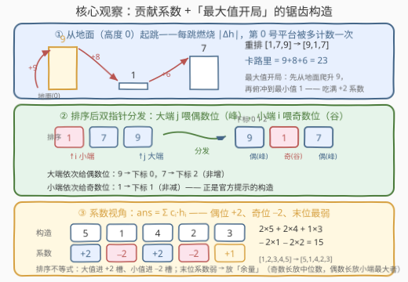
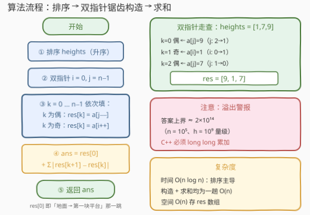

# LeetCode 跳跃燃烧的最大卡路里 题解

## 1. 题目概述

- **标题 / 题号**：跳跃燃烧的最大卡路里（#3730，medium）
- **链接**：https://leetcode.cn/problems/maximum-calories-burnt-from-jumps/
- **难度**：中等
- **标签**：贪心、数组、双指针、排序

> ⚠️ 本题为 LeetCode 付费题（Plus 会员专享），官方题面无法直接获取。以下题意根据官方示例用例（`[1,7,9]`、`[5,2,4]`、`[3,3]`）、官方提示（hints：排序后贪心分发；较大值从排序数组尾部按非增序放偶数位；较小值从头部按非减序放奇数位）与函数签名 `long maxCaloriesBurnt(vector<int> heights)` 重建，**可能与官方题面有出入**；示例输出为按重建题意计算的结果。

**题意**：给你一个整数数组 `heights`，表示 `n` 个平台的高度。你可以**以任意顺序重新排列**这些平台。

跳跃者从**地面（高度 0）**出发，先跳上第一个平台，然后依次跳到下一个平台，直到最后一个平台。每次跳跃（包括从地面跳上第一个平台的那一次）燃烧的卡路里都等于**两次所处高度之差的绝对值**。

在对 `heights` 重新排列后，返回能燃烧的**最大总卡路里**。

**示例 1**：

```text
输入：heights = [1,7,9]
输出：23
解释：一种最优重排为 [9,1,7]：地面→9 燃烧 9，9→1 燃烧 8，1→7 燃烧 6，合计 23。
```

**示例 2**：

```text
输入：heights = [5,2,4]
输出：10
解释：输入本身已是最优锯齿排列：地面→5 燃烧 5，5→2 燃烧 3，2→4 燃烧 2，合计 10。
```

**示例 3**：

```text
输入：heights = [3,3]
输出：3
解释：两平台等高：地面→3 燃烧 3，3→3 燃烧 0，合计 3。
```

**约束条件**（按返回类型 `long` 与常见数据规模推断，官方原文未知）：

- $1 \le n \le 10^5$
- $1 \le \text{heights}[i] \le 10^9$
- 答案上界约 $2 \times 10^{14}$，超出 32 位整数范围——这正是返回类型为 64 位 `long` 的原因

> 💡 **审题关键**：①「从地面起跳」让**第 0 号平台被额外计数一次**——首位是全数组唯一的「黄金位」，谁开局谁多吃一次；② 卡路里是**所有跳跃**的 $|\Delta h|$ 之和，与「重排使相邻绝对差之和最大」的经典题同源，但**地面那一跳彻底改变了端点的最优取值**——经典题要把 top 中较小的值放两端，本题恰恰要把**最高平台放到最前面**；③ 官方提示明说「偶数位非增、奇数位非减」，说明**槽内顺序也有讲究**，不是随便摆个锯齿就行。

## 2. 解题思路

### 2.1 暴力思路

枚举全排列，每个排列 $O(n)$ 算一遍总卡路里——$O(n \cdot n!)$，$n$ 上到 $10^5$ 后是天文数字，直接排除。

冷静观察会发现答案可以写成「系数 × 高度」的线性组合，而排列的巨大自由度会坍缩成「**谁分到高系数槽、谁分到低系数槽**」的分组问题——这正是贪心登场的位置。

### 2.2 核心观察：贡献系数 + 「最大值开局」的锯齿构造



**第一步：把答案写成「系数 × 高度」的求和。**

记 $\varepsilon_i = \operatorname{sign}(h_i - h_{i+1}) \in \{+1, -1\}$（相等时取 0，不影响结论）。由 $|h_{i+1} - h_i| = \varepsilon_i (h_i - h_{i+1})$ 展开可得：

$$\text{ans} = h_0 + \sum_{i=0}^{n-2} \varepsilon_i (h_i - h_{i+1}) = \sum_{i=0}^{n-1} c_i\, h_i$$

其中系数由跳跃方向决定：

- $c_0 = 1 + \varepsilon_0 \in \{0, 2\}$——**开局向下跌**（$\varepsilon_0 = +1$）时第 0 位同时吃到「起跳贡献」和「下坡贡献」，系数封顶 $+2$；开局向上跳则两者一加一减互相抵消，系数归 0；
- 内部 $c_i = \varepsilon_i - \varepsilon_{i-1} \in \{-2, 0, +2\}$——方向翻转处才有非零系数，且 $+2$（谷底反弹）与 $-2$（峰顶跌落）**必须交替出现**；
- 末位 $c_{n-1} = -\varepsilon_{n-2} \in \{-1, +1\}$——只参与最后一跳，系数天然减半；
- 恒等式 $\sum c_i = 1$ 与跳跃方向无关。

直觉版「计数视角」：每个平台要么是**峰**（被登上一次 $+1$、再跳下一次 $+1$，合计 $+2$），要么是**谷**（被落入一次 $-1$、再起跳一次 $-1$，合计 $-2$），要么躺在斜坡上（正负抵消为 0）；第 0 位额外多一个「起跳 $+1$」；末位只有半份计数。

**第二步：选出最优系数轮廓。**

让 $\varepsilon$ 从 $+1$ 开始严格交替——即**开局下跌的全程锯齿**——得到轮廓：

$$[\,+2,\ -2,\ +2,\ -2,\ \cdots\,]\quad\text{末位：}n \text{ 奇数时为 } +1,\ n \text{ 偶数时为 } -1$$

可以验证（逐前缀和比较，即控制序/majorization）：该轮廓**逐项控制**一切可行轮廓——$+2$ 名额开到上限、$-2$ 名额全部压给小值、末位拿到同侧最弱的系数。任何「开局上涨」「中途不严格交替」的排法都会损失系数。

**第三步：排序不等式完成分配。**

给定系数轮廓后，$\sum c_i h_i$ 的最大化就是**排序不等式**：最大的值配最大的系数。于是：

- **偶数位（$+2$ 槽，含开局黄金位）**放上排序后**较大的一半**，从尾部（最大值）开始非增排列；
- **奇数位（$-2$ 槽）**放上**较小的一半**，从头部（最小值）开始非减排列；
- **末位弱系数槽**放「余量」：$n$ 奇数时末位系数 $+1$，放 top 中最小的那个（即中位数）；$n$ 偶数时末位系数 $-1$，放 bottom 中最大的那个。

——这正是官方提示所描述的构造：**偶数位从尾部非增、奇数位从头部非减**。最高平台开局站上第 0 位（起跳 + 首次俯冲吃满 $+2$），最小值紧随其后（制造最大的首跳落差）。

> ⚠️ **与经典题「重排使相邻绝对差之和最大」的差异**：经典题没有地面起跳，两端系数只有 $\pm 1$，最优解要把 top 中**较小**的值放在两端（端点只计一次，别浪费大值）；本题第 0 位系数高达 $+2$，**最大值必须开局**。一字之差，构造方向相反。也正因如此，官方提示才强调槽内的具体顺序——奇数长度时把中位数留在末位、偶数长度时把小半段的最大值留在末位，都是系数分配的必然结果。

**最终构造**：排序后令 $\text{res}[2k] = a[n-1-k]$（偶数位从尾部倒取）、$\text{res}[2k+1] = a[k]$（奇数位从头部顺取），答案 $= \text{res}[0] + \sum_k |\text{res}[k+1] - \text{res}[k]|$。

### 2.3 算法流程图



**逻辑执行步骤**：

| 步骤 | 操作 | 说明 |
|------|------|------|
| ① 排序 | `heights` 升序 | $O(n \log n)$，全流程唯一热点 |
| ② 双指针 | `i = 0, j = n-1` | 前指针喂奇数位，后指针喂偶数位 |
| ③ 构造 | `k` 偶取 `a[j--]`，`k` 奇取 `a[i++]` | 一趟填出锯齿数组，正合官方提示 |
| ④ 求和 | `res[0] + Σ|res[k+1]-res[k]|` | 别漏掉「地面 → 第一块平台」的首项 |
| ⑤ 返回 | 64 位整数 | 答案上界 $\approx 2 \times 10^{14}$ |

### 2.4 示例演算

**示例 1**：`heights = [1,7,9]`（$n=3$，奇数长度，中位数放末位）：

| 阶段 | 数据 |
|------|------|
| 排序（升序） | $[1, 7, 9]$ |
| 偶数位（下标 0、2）← 尾部非增 | $9 \to$ 下标 0，$7 \to$ 下标 2 |
| 奇数位（下标 1）← 头部非减 | $1 \to$ 下标 1 |
| 构造结果 | $[9, 1, 7]$ |
| 卡路里 | $9 + |9-1| + |1-7| = 9+8+6 = \mathbf{23}$ |

系数自检：$c = [+2, -2, +1]$，$\text{ans} = 2 \times 9 - 2 \times 1 + 1 \times 7 = 23$ ✓

**示例 2**：`heights = [5,2,4]`：排序 $[2,4,5]$ → 构造 $[5,2,4]$（恰好是输入本身），卡路里 $= 5+3+2 = \mathbf{10}$；系数自检 $2 \times 5 - 2 \times 2 + 1 \times 4 = 10$ ✓

**再演一个奇偶不同侧的**：`heights = [1,2,3,4]`（$n=4$，偶数长度，末位放小半段最大值）：

| 阶段 | 数据 |
|------|------|
| 排序（升序） | $[1, 2, 3, 4]$ |
| 偶数位（0、2）← 尾部非增 | $4 \to$ 下标 0，$3 \to$ 下标 2 |
| 奇数位（1、3）← 头部非减 | $1 \to$ 下标 1，$2 \to$ 下标 3 |
| 构造结果 | $[4, 1, 3, 2]$ |
| 卡路里 | $4 + 3 + 2 + 1 = \mathbf{10}$ |

系数自检：$c = [+2, -2, +2, -1]$，$\text{ans} = 2 \times 4 - 2 \times 1 + 2 \times 3 - 1 \times 2 = 10$ ✓。若把奇数位顺序摆反成 $[4,2,3,1]$，答案是 $4+2+1+2=9$——槽内顺序确实影响答案，官方提示的「非增/非减」不是废话。

## 3. 参考代码

### C++

```cpp
class Solution {
public:
    long long maxCaloriesBurnt(vector<int>& heights) {
        int n = heights.size();
        sort(heights.begin(), heights.end());
        vector<int> res(n);
        int i = 0, j = n - 1;
        for (int k = 0; k < n; ++k)
            res[k] = (k % 2 == 0) ? heights[j--] : heights[i++];
        long long ans = res[0];
        for (int k = 0; k + 1 < n; ++k)
            ans += llabs((long long)res[k + 1] - res[k]);
        return ans;
    }
};
```

> 💡 **写法要点**：
> - **溢出是本题最大的工程陷阱**：答案上界约 $2 \times 10^{14}$，累加器必须 `long long`；两平台高度差经 `long long` 显式转换后再取绝对值，杜绝 `int` 减法在极端值域下的边缘风险；
> - `res[0]` 单独作为初值——它就是「地面 → 第一块平台」的首跳，之后循环只管相邻差；
> - `(k % 2 == 0) ? heights[j--] : heights[i++]` 一行完成双指针分发，与官方提示逐字对应。

### Python

```python
class Solution:
    def maxCaloriesBurnt(self, heights: List[int]) -> int:
        heights.sort()
        n = len(heights)
        res = [0] * n
        i, j = 0, n - 1
        for k in range(n):
            if k % 2 == 0:
                res[k] = heights[j]
                j -= 1
            else:
                res[k] = heights[i]
                i += 1
        return res[0] + sum(abs(res[k + 1] - res[k]) for k in range(n - 1))
```

> 💡 **写法要点**：
> - Python 大整数无溢出之忧，C++ 侧则必须 `long long`；
> - 也可以不显式构造数组，直接在循环里滚动维护「上一个值」累加相邻差，省 $O(n)$ 空间；
> - `n = 1` 时循环体不执行，答案就是 `heights[0]`（跳上唯一平台），无需特判。

## 4. 复杂度分析

| 维度 | 复杂度 | 说明 |
|------|--------|------|
| **时间** | $O(n \log n)$ | 排序主导；双指针构造与求和均为一趟 $O(n)$ |
| **空间** | $O(n)$ | 存放构造数组 `res`（滚动维护可降到 $O(1)$ 辅助空间） |
| **对比暴力** | $O(n \cdot n!) \to O(n \log n)$ | 「系数视角」把排列自由度坍缩成分组，再被排序不等式一刀定死 |

## 5. 扩展：闭式公式与经典变体

**闭式公式**：把系数轮廓直接乘上去，连构造数组都可省。设 $a$ 为升序序列：

- $n = 2m+1$（奇数）：$\text{ans} = 2\sum_{i=m+1}^{2m} a_i + a_m - 2\sum_{i=0}^{m-1} a_i$——前 $m$ 大各计两次、中位数计一次、后 $m$ 小各倒扣两次；
- $n = 2m$（偶数）：$\text{ans} = 2\sum_{i=m}^{2m-1} a_i - 2\sum_{i=0}^{m-2} a_i - a_{m-1}$——末位（小半段最大者）只倒扣一次。

两条算路（闭式 vs 构造后模拟）互相验证可防手滑；提交前拿 $n=1$、$n=2$ 与两个示例各测一遍，恰好覆盖全部奇偶形态。

**经典变体（去掉地面起跳）**：若卡路里只算平台间的 $\sum |h_{i+1} - h_i|$ 而没有「从地面出发」的首跳，则第 0 位系数退化为 $\pm 1$，最优解变成「top 中**较小**的值放两端、较大的值放内部」——例如 $[1,2,3,4,5]$ 的最优是 $[3,1,5,2,4]$（相邻差和 $11$），而不是本题的 $[5,1,4,2,3]$（相邻差和仅 $10$，但加上首跳 $5$ 后总分 $15$ 反超）。审题时「**首末位置有没有额外计数**」必须第一时间确认。

**免排序的 $O(n)$ 路线**：答案只需要「较大一半之和、较小一半之和、两个余量值」，用 `nth_element`（C++）/ 快速选择按中位数划开后分别求和即可，平均 $O(n)$。

## 6. 面试要点

**Q1：为什么最高平台必须放在第 0 位？**

> 第 0 位是唯一带「起跳加成」的位置：开局向下跌时它同时吃到「地面跳贡献 $+1$」和「首跳下坡贡献 $+1$」，系数 $+2$ 封顶；开局向上涨则两项抵消归 0。把最大值放到别处、让小值开局，等于浪费全数组唯一的黄金槽。反例可拿 $[1,2,3,100]$：$[100,1,3,2]$ 得 102，而 $[3,1,100,2]$ 虽相邻差和高达 199，总分只有 $3+199=202$……而 $[100,1,3,2]$ 是 $100+102=202$ 打平，$[1,100,2,3]$ 则是 $1+198=199$ 落败——首位系数差异就是分水岭。

**Q2：锯齿排列内部为什么还要「偶位非增、奇位非减」？槽内顺序影响答案吗？**

> 影响。系数轮廓里末位是最弱槽（奇数长 $+1$、偶数长 $-1$），比同侧其他槽少一次计数。排序不等式要求把「余量」放到最弱槽：奇数长度时中位数（top 中最小者）留末位，偶数长度时小半段最大者留末位。$[1,2,3,4]$ 中 $[4,1,3,2]$ 得 10 而 $[4,2,3,1]$ 只有 9，差的就是末位那一次计数。

**Q3：如何证明这个构造是最优的？**

> 三段论：① 展开绝对值，答案 $= \sum c_i h_i$，系数只由跳跃方向决定且 $\sum c_i = 1$；② 枚举方向序列可证「开局下跌的严格锯齿」轮廓在控制序意义下逐项压过一切可行轮廓（$+2$ 名额最多、$-2$ 全压小值、末位同侧最弱）；③ 对该轮廓用排序不等式分配——大值进 $+2$ 槽、小值进 $-2$ 槽、余量进末位，恰好就是构造本身。

**Q4：工程上最容易翻车的点？**

> 溢出。$n = 10^5$、高度 $10^9$ 时答案上界约 $2 \times 10^{14}$，超出 32 位整数三个数量级——C++ 累加器必须 `long long`（题目返回 `long` 本身就是提示）。其次是漏掉 `res[0]` 首项，或把「地面高度 0」误当平台处理。

**Q5：这题和 3727「最大交替平方和」是什么关系？**

> 同一批「重排 + 最大化」的姊妹题，方法论同构：都先把答案写成「系数 × 值」的线性组合，再看槽位等价性。3727 的系数是固定的 $\pm 1$ 交替（槽位完全等价，纯分组题）；本题的系数由跳跃方向动态决定（槽位不等价，需先论证最优轮廓），多了一层「形状选择」——难度也就从「分组」升到了「构造」。

> 💡 **一句话总结**：3730 = 系数视角（起跳加成让首位系数 $+2$）+ 控制序选出「开局下跌的锯齿轮廓」+ 排序不等式完成「大值进偶位、小值进奇位、余量进末位」的分配。三个要点带走：最大值必须开局、槽内顺序有讲究（末位放余量）、答案 $2 \times 10^{14}$ 的 `long long` 警报。

## 同类练习题

| # | 题目 | 与本题的关联 |
|---|------|-------------|
| 324 | [摆动排序 II](https://leetcode.cn/problems/wiggle-sort-ii/)（[题解](../0301-0400/324_摆动排序II.md)） | 同款「大一半进偶数位、小一半进奇数位」的锯齿构造，只是目标从「最大化」换成「满足摆动约束」 |
| 1968 | [数组元素不等于邻居平均值](https://leetcode.cn/problems/array-with-elements-not-equal-to-average-of-neighbors/)（[题解](../1901-2000/1968_数组元素不等于邻居平均值.md)） | 排序后交错放置的开身题，构造思路同源 |
| 3727 | [最大交替平方和](https://leetcode.cn/problems/maximum-alternating-sum-of-squares/)（[题解](../3701-3800/3727_最大交替平方和.md)） | 同期姊妹题，「系数 × 值 + 槽位分组」方法论的纯分组版 |
| 2498 | [青蛙过河 II](https://leetcode.cn/problems/frog-jump-ii/)（[题解](../2401-2500/2498_青蛙过河II.md)） | 同为「跳跃平台」故事的贪心构造，往返两趟的分配问题 |
| 1877 | [数组中最大数对和的最小值](https://leetcode.cn/problems/minimize-maximum-pair-sum-in-array/)（[题解](../1801-1900/1877_数组中最大数对和的最小值.md)） | 排序首尾配对思想，与本题「大端喂一侧、小端喂另一侧」互为镜像 |
