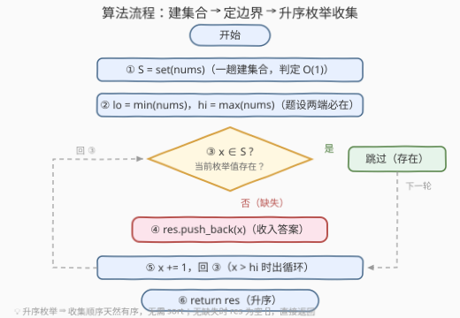

# LeetCode 找出缺失的元素 题解

## 1. 题目概述

- **标题 / 题号**：找出缺失的元素（#3731，easy）
- **链接**：https://leetcode.cn/problems/find-missing-elements/
- **难度**：简单
- **标签**：数组、哈希表、排序

**题意**：给你一个整数数组 `nums`，数组由若干**互不相同**的整数组成。

数组 `nums` 原本包含了某个范围内的**所有整数**，但现在其中可能**缺失**部分整数。该范围内的**最小**整数和**最大**整数仍然存在于 `nums` 中。

返回一个**有序**列表，包含该范围内缺失的所有整数，并**按从小到大排序**。如果没有缺失的整数，返回一个**空**列表。

**示例 1**：

```text
输入：nums = [1,4,2,5]
输出：[3]
解释：最小整数为 1，最大整数为 5，因此完整的范围应为 [1,2,3,4,5]。其中只有 3 缺失。
```

**示例 2**：

```text
输入：nums = [7,8,6,9]
输出：[]
解释：最小整数为 6，最大整数为 9，因此完整的范围为 [6,7,8,9]。所有整数均已存在，因此没有缺失的整数。
```

**示例 3**：

```text
输入：nums = [5,1]
输出：[2,3,4]
解释：最小整数为 1，最大整数为 5，因此完整的范围应为 [1,2,3,4,5]。缺失的整数为 2、3 和 4。
```

**约束**：

- $2 \le \text{nums.length} \le 100$
- $1 \le \text{nums}[i] \le 100$
- `nums` 中的元素互不相同

> 💡 **审题关键**：① 枚举范围被两端锁定——题设保证范围内的最小/最大整数仍在 `nums` 中，缺失者只能藏在 $(\min, \max)$ **开区间内部**；② 元素**互不相同**——每个值至多出现一次，集合判定没有重复计数的困扰；③ 要求返回有序列表——若枚举本身就按升序进行，收集顺序**天然有序**，连排序这一步都能省掉。

## 2. 解题思路

### 2.1 暴力思路：逐个候选线性查数组

最直接的写法：先扫一遍求出 $lo = \min$、$hi = \max$，然后让 $x$ 从 $lo$ 到 $hi$ 逐个取值，对每个候选 $x$ 都从头到尾扫一遍 `nums` 判断是否出现过，没找到就收入结果。

正确性没有问题，但每个候选都要付出一趟 $O(n)$ 的扫描，总时间 $O(D \cdot n)$（$D = hi - lo + 1$ 为范围宽度）。本题规模小无伤大雅，可瓶颈不在「枚举」而在「**判定是否在数组中**」这一步——值域放大后线性查找立刻拖垮整个算法。

### 2.2 核心观察：哈希集合 + 区间升序枚举

![核心观察：区间 [lo, hi] 逐格点名，哈希集合 O(1) 判定](../images/p3731_missing_elements_concept.svg)

**观察一：枚举范围由题设锁定为闭区间 $[lo, hi]$。** 最小、最大整数必在 `nums` 中，意味着缺失只可能发生在内部——枚举 $x \in [lo, hi]$ 恰好覆盖所有候选，一个不多、一个不少。⚠️ 最常见的 WA 就是把枚举范围写成全值域 $[1, 100]$：`nums = [5,1]` 时会把 6~100 全部误报成「缺失」，而它们根本不在原本的范围内。

**观察二：把「判定」降到 O(1)。** 先花 $O(n)$ 把 `nums` 全部倒进**哈希集合**，之后每个候选 $x$ 的存在性判定都是 $O(1)$ 查表。「枚举沿区间升序推进、判定落在集合里」——这是所有「找缺失」题目的标准分工。

**观察三：升序枚举 ⇒ 结果天然有序。** $x$ 从 $lo$ 递增走到 $hi$，中途收集的缺失值本身就是升序序列，**无需再排序**——题目标签里的「排序」只是一条可选路线（见第 5 节），并非必需。

**观察四（校验用）：缺失个数恰为 $D - n$。** 范围内共 $D = hi - lo + 1$ 个整数、数组实有 $n$ 个互异值且全在范围内，故缺失数恰为 $D - n$——结果长度可直接校验。

> 💡 一句话：本题 = 「`nums` 入集合」+「$x$ 从 $lo$ 到 $hi$ 升序枚举，不在集合里的收入结果」。边界锁定范围、判定进集合、升序免排序。

### 2.3 算法流程图



**逻辑执行步骤**：

| 步骤 | 操作 | 说明 |
|------|------|------|
| ① 建集合 | `S = set(nums)` | 一趟扫描，此后每次判定 O(1) |
| ② 定边界 | `lo = min(nums)`，`hi = max(nums)` | 题设保证两端必在数组中 |
| ③ 成员判定 | `x ∈ S` ? | 是 → 跳过；否 → ④ |
| ④ 收集 | `res.push_back(x)` | 缺失值按升序天然入列 |
| ⑤ 推进 | `x += 1`，回到 ③ | $x > hi$ 时出循环 |
| ⑥ 返回 | `return res` | 已升序，无需 sort；无缺失时为 `[]` |

> ⚠️ ② 必须先于枚举完成：边界来自「数组实有值」的 min/max，而不是值域常数 1/100。用错边界是本题唯一有含量的坑。

### 2.4 示例演算

**示例 3：nums = [5,1]（答案 [2,3,4]）**，$S = \{1,5\}$，$lo = 1$，$hi = 5$：

| 候选 $x$ | 1 | 2 | 3 | 4 | 5 |
|----------|---|---|---|---|---|
| $x \in S$ ? | ✓ | ✗ | ✗ | ✗ | ✓ |
| 收集 | — | 2 | 3 | 4 | — |

两端 $1, 5$ 恰好存在（题设保证），中间 $2,3,4$ 全部落空，按枚举顺序收集得 `[2,3,4]`。

**示例 2：nums = [7,8,6,9]（答案 []）**：$S = \{6,7,8,9\}$，范围 $[6,9]$ 内每个候选都被挡住，一个没收——空列表直接返回，无需特判。

**边界情形**：`nums = [1,100]` 时 $D = 100$、$n = 2$，缺失数多达 98 个（$2 \sim 99$）——这是值域约束下结果最长的时刻，也印证观察四的公式 $D - n = 98$。

## 3. 参考代码

### C++

```cpp
class Solution {
public:
    vector<int> findMissingElements(vector<int>& nums) {
        unordered_set<int> s(nums.begin(), nums.end());
        int lo = *min_element(nums.begin(), nums.end());
        int hi = *max_element(nums.begin(), nums.end());
        vector<int> res;
        for (int x = lo; x <= hi; ++x)
            if (!s.count(x)) res.push_back(x);
        return res;
    }
};
```

> 💡 **写法要点**：
> - `unordered_set` 用迭代器区间构造，建集合一行搞定；
> - `min_element` / `max_element` 分别求边界（返回迭代器要解引用），也可一趟手写循环同时求出；
> - 升序枚举 ⇒ `res` 天然升序，全程不碰 `sort`；
> - 结果长度 = $hi - lo + 1 - n \le 98$，`vector` 毫无压力。

### Python

```python
class Solution:
    def findMissingElements(self, nums: List[int]) -> List[int]:
        s = set(nums)
        return [x for x in range(min(nums), max(nums) + 1) if x not in s]
```

> 💡 **写法要点**：
> - 列表推导一行收工；`range` 左闭右开，右端记得 `+ 1`；
> - 无缺失时推导式自然产出 `[]`（示例 2），无需任何特判；
> - 值域放大、键类型变复杂时该写法原样成立——这正是哈希集合版比定长数组版（第 5 节）更通用的地方。

## 4. 复杂度分析

| 维度 | 复杂度 | 说明 |
|------|--------|------|
| **时间** | $O(n + D)$ | 建集合、求 $lo/hi$ 共 $O(n)$；枚举 $D = hi - lo + 1$ 个候选各 $O(1)$ 判定。本题值域 $\le 100$ ⇒ $D \le 100$ |
| **空间** | $O(n)$ | 哈希集合存 $n$ 个互异值（输出数组 $O(D - n)$ 按惯例不计） |
| **对比暴力法** | $O(D \cdot n) \to O(n + D)$ | 暴力每个候选线性扫数组；哈希集合把单次判定降到 $O(1)$，枚举轮数本身就是 $D$ |

## 5. 扩展：值域定长数组与排序缝隙扫描

### 5.1 定长 `bool` 数组：一趟同时建表定边界

$1 \le \text{nums}[i] \le 100$ 意味着只有 $1 \sim 100$ 的值影响判定，开一个 `bool seen[101]` 代替哈希表，判定走下标直达、零哈希常数；建表与求 $lo/hi$ 可合并成同一趟循环：

```cpp
class Solution {
public:
    vector<int> findMissingElements(vector<int>& nums) {
        bool seen[101] = {false};
        int lo = 101, hi = 0;
        for (int x : nums) {
            seen[x] = true;
            lo = min(lo, x);
            hi = max(hi, x);
        }
        vector<int> res;
        for (int x = lo; x <= hi; ++x)   // ⚠️ 仍须枚举 [lo, hi]，不能枚举 [1, 100]
            if (!seen[x]) res.push_back(x);
        return res;
    }
};
```

> ⚠️ 换成数组后**边界坑更隐蔽**：`seen[6..100]` 在 `nums = [5,1]` 时全为假，若顺手枚举全值域会把它们全部误报。定长数组只优化「判定」，不改变「范围必须来自 min/max」这一事实。

### 5.2 排序 + 缝隙扫描：O(1) 额外空间

允许改动输入时，可排序后看**相邻缝隙**：升序数组中若 $a_{i+1} > a_i + 1$，则 $a_i + 1 \sim a_{i+1} - 1$ 整段缺失，且天然升序：

```cpp
class Solution {
public:
    vector<int> findMissingElements(vector<int>& nums) {
        sort(nums.begin(), nums.end());
        vector<int> res;
        for (size_t i = 1; i < nums.size(); ++i)
            for (int x = nums[i - 1] + 1; x < nums[i]; ++x)
                res.push_back(x);
        return res;
    }
};
```

三种实现的取舍：

| 方式 | 时间 | 额外空间 | 适用前提 |
|------|------|----------|----------|
| 哈希集合 | $O(n + D)$ | $O(n)$ | 任意值域、任意键类型 |
| 定长 `bool` 数组 | $O(n + D)$ | $O(1)$（值域 101） | 值域小且已知（本题 $\le 100$） |
| 排序 + 缝隙扫描 | $O(n \log n)$ | $O(1)$ | 允许改动输入、追求省空间 |

再往前一步：448 题「找到所有数组中消失的数字」的值域恰为 $[1, n]$，**下标即值**，可以原地取负标记做到 $O(1)$ 空间。本题值域 $[lo, hi]$ 的宽度 $D$ 可达 $100 > n$、且起点未必是 1，原地标记无处安放——只能退回定长数组或排序扫描。同一句「找全部缺失」，**值域约束的形状直接决定数据结构的选择**，这是面试官爱追问的递进链。

## 6. 面试要点

**Q1：为什么枚举范围是 $[\min, \max]$ 而不是 $[1, 100]$？**

> 题设保证范围内的最小/最大整数仍在 `nums` 中，缺失只发生在内部；若枚举全值域，`nums = [5,1]` 会把 6~100 全部误报成缺失。边界必须来自数组实有值的 min/max，而不是值域常数——这是本题最核心的审题点。

**Q2：结果为什么不用排序？**

> $x$ 从 $lo$ 到 $hi$ **升序枚举**，收集顺序天然升序。标签里的「排序」是一条可选路线（排序后扫相邻缝隙），并非必需；认清「枚举顺序即输出顺序」能少写一次 `sort`。

**Q3：缺失元素最多可能有多少个？**

> $D - n = (hi - lo + 1) - n$。本题 $D \le 100$、$n \ge 2$，至多 98 个（`nums = [1,100]`）。这个公式也是天然的**结果长度校验**：写完代码拿它对拍一遍。

**Q4：暴力法慢在枚举还是慢在判定？**

> 慢在判定。枚举每轮只是自增，暴力却对每个候选线性扫 `nums`（$O(n)$）；哈希集合把判定降到 $O(1)$，总复杂度从 $O(D \cdot n)$ 降到 $O(n + D)$。认清瓶颈在「查存在性」，是「找缺失」一族题目的第一直觉。

**Q5：本题与 448、268 的异同？**

> 三题同属「值域-集合」家族：268 恰缺一个，可用求和差/异或**闭式**直接算；448 值域恰为 $[1, n]$，可**原地取负**标记做到 O(1) 空间；本题值域 $[lo, hi]$ 宽度可超 $n$ 且起点非 1，原地标记失效，用定长 `bool` 数组或排序缝隙扫描兜底。值域约束的松紧与形状，决定从闭式、原地标记到哈希集合的选择梯度。

> 💡 **一句话总结**：3731 = `set(nums)` + 升序枚举 $[\min, \max]$ 收集不在集合中的数。三个要点带走：边界锁定枚举范围、判定进集合、升序免排序。

## 同类练习题

| # | 题目 | 与本题的关联 |
|---|------|-------------|
| 448 | [找到所有数组中消失的数字](https://leetcode.cn/problems/find-all-numbers-disappeared-in-an-array/)（[题解](../0401-0500/448_找到所有数组中消失的数字.md)） | 值域恰为 $[1, n]$ 的「找全部缺失」，原地取负标记 O(1) 空间 |
| 268 | [丢失的数字](https://leetcode.cn/problems/missing-number/)（[题解](../0201-0300/268_丢失的数字.md)） | 恰缺一个数的闭式解（求和差 / 异或），本题的「单一缺失」特例 |
| 41 | [缺失的第一个正整数](https://leetcode.cn/problems/first-missing-positive/)（[题解](../0001-0100/41_缺失的第一个正数.md)） | 值域无界找第一个缺失，原地哈希做到 O(n)/O(1) |
| 1539 | [第 k 个缺失的正整数](https://leetcode.cn/problems/kth-missing-positive-number/)（[题解](../1501-1600/1539_第k个缺失的正整数.md)） | 从「全部缺失」聚焦到「第 k 个缺失」，有序数组上可二分加速 |
| 645 | [错误的集合](https://leetcode.cn/problems/set-mismatch/)（[题解](../0601-0700/645_错误的集合.md)） | 定长计数桶同时揪出「缺失 + 重复」，判存在性数组化的又一应用 |
