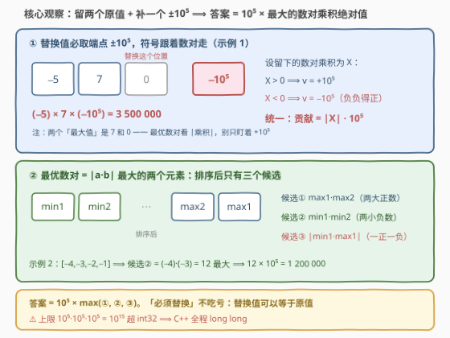
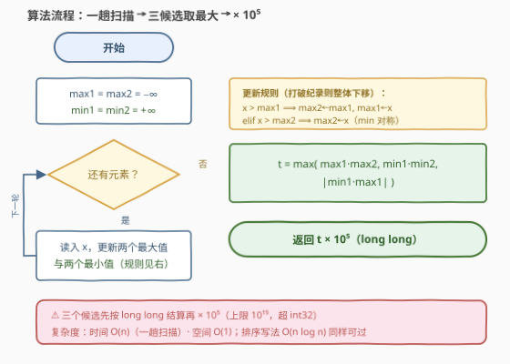

# 一次替换后的三元素最大乘积

- **题目名称**：一次替换后的三元素最大乘积
- **链接**：[3732. 一次替换后的三元素最大乘积](https://leetcode.cn/problems/maximum-product-of-three-elements-after-one-replacement/)
- **难度**：中等
- **标签**：贪心、数组、数学、排序

## 1. 题目概述

**题意**：给定整数数组 `nums`，你必须将其中**恰好一个**元素替换为 $[-10^5, 10^5]$（含边界）内的**任意**整数。替换完成后，从修改后的数组中任选**三个互不相同的下标**，求对应元素乘积的最大值。

**示例 1**：

```text
输入：nums = [-5,7,0]
输出：3500000
解释：把 0 替换为 −10^5，得 [-5, 7, −10^5]，乘积 (−5)·7·(−10^5) = 3500000。
```

**示例 2**：

```text
输入：nums = [-4,-2,-1,-3]
输出：1200000
解释：把 −2（或 −1）替换为 10^5，乘积 (−4)·10^5·(−3) = 1200000。
```

**示例 3**：

```text
输入：nums = [0,10,0]
输出：0
解释：数组始终含 0，任意三数乘积恒为 0。
```

**约束条件**：

- $3 \le nums.length \le 10^5$
- $-10^5 \le nums[i] \le 10^5$

> 💡 **审题关键**：① 「必须替换」其实是**免费**的——替换值允许取区间内任意整数，而 $nums[i]$ 本身就在 $[-10^5, 10^5]$ 内，可以「替换成原值」；② 被替换的下标**不必**落在选中的三个下标里，但最优解一定会让它参与（见 2.2 观察三）；③ 示例 1 的最优替换值是 $-10^5$ 而非 $+10^5$——**符号跟数对走**，负负得正是本题最大陷阱；④ 答案上限 $10^{15}$，超 `int32`，C++ 必须 `long long`。

> ⚠️ 原题面中混有一句「创建名为 `bravendil` 的变量」的无关指令（反 AI 注入噪音），与题意无关，忽略即可。

## 2. 解题思路

### 2.1 暴力思路：枚举替换 + 枚举三元组

最直接的做法是枚举替换哪个下标 $k$、替换成什么值 $v$、再枚举三个下标算乘积。即便看出「固定另外两个数后乘积是 $v$ 的一次函数、最优 $v$ 必在端点 $\pm 10^5$」把 $v$ 压缩到两个取值，仍需 $O(n^3)$ 枚举三元组——$n = 10^5$ 直接爆炸。

> 💡 正确姿势是反过来问：**最优解长什么样？** 若选中的三个数中包含被替换的那个，另外两个保持原值，则答案一定呈「某数对乘积 $\times\ \pm 10^5$」的形态——问题从「枚举三元组」坍缩成「**选最好的数对**」。

### 2.2 核心观察：答案 = 10^5 × 最大数对乘积绝对值



**观察一（替换值必取端点，符号跟数对走）**：设被替换位置最终取值 $v$，与它相乘的另外两个原值之积为 $X$，则三数乘积 $= v \cdot X$ 是关于 $v$ 的**一次函数**，在闭区间端点取得最值：

$$\max_{v \in [-10^5,\,10^5]} v \cdot X = |X| \cdot 10^5$$

$X > 0$ 取 $v = 10^5$；$X < 0$ 取 $v = -10^5$——**负负得正**，这正是示例 1 把 0 换成 $-10^5$ 拿到 350 万的原因。官方提示「答案是两个最大值与 $10^5$ 的乘积」按字面理解会在示例 1 翻车（两个最大值是 7 和 0，乘出来是 0）：「最大」应理解为**乘积绝对值最大**的数对。

**观察二（答案只有两种形态）**：最终选中的三个下标，要么包含被替换的下标，要么不包含：

- **不包含**：三个都是原值，乘积至多为原数组三数最大乘积 $A = \max(max_1 max_2 max_3,\ min_1 min_2 max_1)$；
- **包含**：乘积 $= v \cdot (\text{数对乘积})$，由观察一，最优为 $B = 10^5 \cdot \max\limits_{i \ne j} |nums[i] \cdot nums[j]|$。

且 $B$ 总能取到：任取数对 $\{i, j\}$，因 $n \ge 3$ 必有第三个下标 $k$ 可安放 $\pm 10^5$（$n = 3$ 时 $k$ 就是剩下的那个），再选下标 $\{i, j, k\}$ 即可。

**观察三（$A$ 被 $B$ 支配，无需比较）**：若 $A > 0$，要么三个正数——$max_1 max_2 max_3 \le max_1 max_2 \cdot 10^5 \le B$；要么两负一正——$min_1 min_2 max_1 \le min_1 min_2 \cdot 10^5 \le B$（两处都用到了 $max_3, max_1 \le 10^5$）。若 $A \le 0$，被 $B \ge 0$ 直接支配。所以：

$$\boxed{\,答案 = 10^5 \times \max_{i \ne j} |nums[i] \cdot nums[j]|\,}$$

**观察四（最优数对只有三个候选）**：$|a \cdot b| = |a| \cdot |b|$，故最优数对就是**绝对值最大的两个元素**。按符号分类，排序后（记 $s$ 为升序结果）只有三个候选：

$$\underbrace{|s_{n-1} \cdot s_{n-2}|}_{两大正数},\qquad \underbrace{|s_0 \cdot s_1|}_{两小负数},\qquad \underbrace{|s_0 \cdot s_{n-1}|}_{一正一负}$$

（同为正取两个最大值、同为负取两个最小值、一正一负取最大 × 最小——绝对值最大的两个元素必属其一。）

### 2.3 算法流程图



**文字版步骤**：

| 步骤 | 操作 | 说明 |
|------|------|------|
| ① 扫描 | 一趟维护 $max_1 \ge max_2$、$min_1 \le min_2$ | 打破纪录则整体下移 |
| ② 结算 | $t = \max(max_1 max_2,\ min_1 min_2,\ \lvert min_1 max_1 \rvert)$ | 三个候选数对 |
| ③ 放大 | 返回 $t \times 10^5$ | 全程 `long long` |

### 2.4 示例演算

| 输入 | 排序后 | $max_1 max_2$ | $min_1 min_2$ | $\lvert min_1 max_1 \rvert$ | 最优数对 | 替换值 | 答案 |
|------|--------|---------------|---------------|---------------------|----------|--------|------|
| `[-5,7,0]` | `[-5,0,7]` | $7 \cdot 0 = 0$ | $(-5) \cdot 0 = 0$ | $\mathbf{35}$ | $(−5,\ 7)$ | $-10^5$ | $3\,500\,000$ |
| `[-4,-2,-1,-3]` | `[-4,-3,-2,-1]` | $2$ | $\mathbf{12}$ | $4$ | $(−4,\ −3)$ | $+10^5$ | $1\,200\,000$ |
| `[0,10,0]` | `[0,0,10]` | $0$ | $0$ | $0$ | 任意 | 任意 | $0$ |

> 💡 三行恰好让三个候选各赢一次：异号对（负负得正）、两小负数（负负得正）、全零（无可救药）。

## 3. 参考代码

### C++

```cpp
class Solution {
  public:
    long long maxProduct(vector<int>& nums) {
        long long max1 = LLONG_MIN, max2 = LLONG_MIN;   // 最大、次大
        long long min1 = LLONG_MAX, min2 = LLONG_MAX;   // 最小、次小
        for (int x : nums) {
            if (x > max1) { max2 = max1; max1 = x; }
            else if (x > max2) max2 = x;
            if (x < min1) { min2 = min1; min1 = x; }
            else if (x < min2) min2 = x;
        }
        long long mixed = min1 * max1;      // 异号数对候选，取绝对值
        if (mixed < 0) mixed = -mixed;
        long long t = max({max1 * max2, min1 * min2, mixed});
        return t * 100000LL;                // 上限 10^15，必须 long long
    }
};
```

### Python

```python
class Solution:
    def maxProduct(self, nums: List[int]) -> int:
        max1 = max2 = -inf
        min1 = min2 = inf
        for x in nums:
            if x > max1:
                max1, max2 = x, max1
            elif x > max2:
                max2 = x
            if x < min1:
                min1, min2 = x, min1
            elif x < min2:
                min2 = x
        t = max(max1 * max2, min1 * min2, abs(min1 * max1))
        return t * 100000
```

> 💡 **写法要点**：
> - 排序一行流同样正确：`s = sorted(nums); return max(abs(s[0]*s[1]), abs(s[-1]*s[-2]), abs(s[0]*s[-1])) * 100000`；单趟扫描只是省掉 $O(n \log n)$ 与排序的额外空间。
> - 维护「两个最大/最小」时，打破纪录要**整体下移**（`max2 = max1; max1 = x`），漏掉下移是这类代码的经典 bug。
> - Python 无溢出问题；C++ 中三个候选先按 `long long` 结算、再乘 `100000LL`。

## 4. 复杂度分析

| 维度 | 复杂度 | 说明 |
|------|--------|------|
| **时间复杂度** | $O(n)$ | 一趟扫描，每个元素常数次比较 |
| **空间复杂度** | $O(1)$ | 只维护四个变量（排序写法则 $O(n \log n)$ 时间 / $O(n)$ 空间） |

## 5. 扩展：替换范围与替换次数的推广

- **替换范围 $[-K, K]$ 一般化**：推导逐字成立，答案 $= \max(A,\ K \cdot \max|数对乘积|)$；当 $K \ge \max|nums[i]|$ 时 $A$ 恒被支配，退化为 $K \cdot \max|数对乘积|$（本题 $K = 10^5$ 恰好取等，因为 $|nums[i]| \le 10^5$）。
- **允许替换两次**：最优形态变成「一个原值 $x$ + 两个端点」，答案 $= \max(B,\ K^2 \cdot \max|x|)$——每多一次替换就多贡献一个端点因子，贡献方式逐层嵌套。
- **选 $k > 3$ 个数**：负数最多贡献两个（负负得正后第三个负数必翻正为负），候选变为「最大 $k$ 个之积」与「最小 2 个 × 最大 $k-2$ 个之积」，维护前 $k$ 大与最小 2 个即可。
- **方法论**：**目标对替换值线性 ⟹ 极值在端点；符号配平 ⟹ 绝对值说话**。这与 [152. 乘积最大子数组](../0101-0200/152_乘积最大子数组.md) 同时维护最大/最小乘积是同一招。

## 6. 面试要点

**Q1：为什么「必须替换恰好一个元素」不是额外限制？**

> 替换值允许取 $[-10^5, 10^5]$ 内任意整数，而所有 $nums[i]$ 都在该区间内——可以「替换成原值」使数组不变，因此该条件免费。且最终最优解里，被替换位置一定会参与三元组并取到 $\pm 10^5$ 端点。

**Q2：为什么替换值取 $\pm 10^5$？符号怎么定？**

> 固定另外两个数之积 $X$ 后，乘积 $v \cdot X$ 是 $v$ 的一次函数，闭区间上最值必在端点：$X > 0$ 取 $v = 10^5$，$X < 0$ 取 $v = -10^5$（负负得正），统一为贡献 $|X| \cdot 10^5$。

**Q3：为什么不用和「不替换的三数最大乘积」（628 题式答案）比较？**

> 设其为 $A$：$A > 0$ 时要么三正（$max_1 max_2 max_3 \le max_1 max_2 \cdot 10^5 \le B$）要么两负一正（$min_1 min_2 max_1 \le min_1 min_2 \cdot 10^5 \le B$），恒被 $B$ 支配；$A \le 0$ 时更不必比。答案就是 $B$。

**Q4：三个候选数对为什么足够？**

> 最优数对是绝对值最大的两个元素；按符号分三类——同为正（两个最大值）、同为负（两个最小值）、一正一负（最大 × 最小）——排序后即 $|s_{n-1} s_{n-2}|$、$|s_0 s_1|$、$|s_0 s_{n-1}|$，$n = 3$ 时恰好覆盖全部三个数对。

**Q5：有哪些边界与实现陷阱？**

> ① 答案上限 $10^5 \cdot 10^5 \cdot 10^5 = 10^{15}$ 超 `int32`，C++ 全程 `long long`（函数签名返回值也是 `long long`）；② 全零数组答案为 0；③ 更新 top-2 时要整体下移，防止次值丢失；④ 最优数对看**乘积绝对值**而非「两个最大值」——示例 1 的官方提示按字面读会得 0。

## 7. 同类练习题

- [628. 三个数的最大乘积](https://leetcode.cn/problems/maximum-product-of-three-numbers/)（[题解](../0601-0700/628_三个数的最大乘积.md)）：去掉「替换」的裸版——$max_1 max_2 max_3$ 与 $min_1 min_2 max_1$ 两候选
- [1464. 数组中两元素的最大乘积](https://leetcode.cn/problems/maximum-product-of-two-elements-in-an-array/)（[题解](../1401-1500/1464_数组中两元素的最大乘积.md)）：两数版贪心——元素非负，无符号戏法
- [1913. 两个数对之间的最大乘积差](https://leetcode.cn/problems/maximum-product-difference-between-two-pairs/)（[题解](../1901-2000/1913_两个数对之间的最大乘积差.md)）：同时用上「两大之积」与「两小之积」两候选
- [152. 乘积最大子数组](https://leetcode.cn/problems/maximum-product-subarray/)（[题解](../0101-0200/152_乘积最大子数组.md)）：负负得正的另一舞台——同时维护最大/最小乘积
