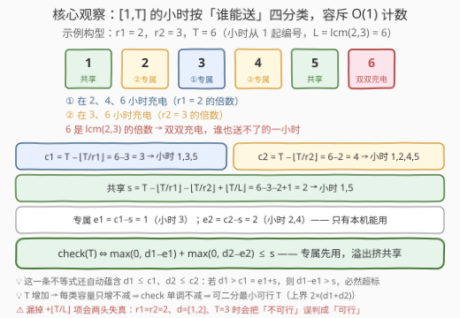
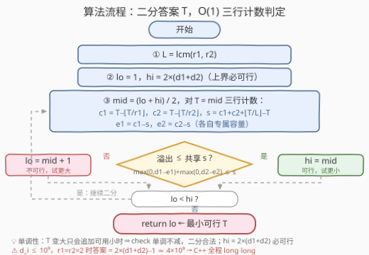

# LeetCode 完成所有送货任务的最少时间 题解

## 1. 题目概述

- **标题 / 题号**：完成所有送货任务的最少时间（#3733，medium）
- **链接**：https://leetcode.cn/problems/minimum-time-to-complete-all-deliveries/
- **难度**：中等
- **标签**：数学、二分查找

**题意**：给你两个大小为 2 的整数数组 `d = [d1, d2]` 和 `r = [r1, r2]`。两架送货无人机负责完成送货任务，无人机 $i$ 必须完成 $d_i$ 次送货。

- 每次送货花费**正好一小时**，且**任意给定小时内只有一架**无人机可以送货；
- 无人机 $i$ 必须每 $r_i$ 小时充电一次——即在 $r_i$ 的**倍数小时**（$r_i, 2r_i, 3r_i, \dots$）充电，充电期间不能送货。

返回完成所有送货所需的**最小总时间**（以小时为单位）。

**示例 1**：

```text
输入：d = [3,1], r = [2,3]
输出：5
解释：机①在第 1、3、5 小时送货（第 2、4 小时充电）；机②在第 2 小时送货（第 3 小时充电）。
```

**示例 2**：

```text
输入：d = [1,3], r = [2,2]
输出：7
解释：机①在第 3 小时送货（第 2、4、6 小时充电）；机②在第 1、5、7 小时送货。
```

**示例 3**：

```text
输入：d = [2,1], r = [3,4]
输出：3
解释：机①在第 1、2 小时送货（第 3 小时充电）；机②在第 3 小时送货。
```

**约束**：

- $1 \le d_i \le 10^9$
- $2 \le r_i \le 3 \times 10^4$

> 💡 **审题关键**：① 小时**从 1 开始编号**，机 $i$ 恰在 $r_i$ 的倍数小时被「锁死」（示例 1 中 $r_1=2$：第 2、4 小时不可用）；② 两机充电时刻表**互相独立**，一小时可能是「机①充电、机②可用」，也可能是「双双充电」——后者这一小时谁也送不了；③ $d_i$ 高达 $10^9$，答案可逼近 $2(d_1+d_2) \approx 4\times 10^9$，**超出 `int` 范围**（函数签名返回 `long long` 正是提示）。

## 2. 解题思路

### 2.1 暴力思路：逐小时排程模拟

最朴素的想法：让 $T$ 从 1 起逐一尝试，对每个 $T$ 贪心构造一张合法时间表（每小时把「当前可用且还有剩余任务」的无人机派出去），构造成功即答案。

两个层面都行不通：

- **答案规模**：$d_1+d_2$ 可达 $2\times 10^9$，逐个枚举 $T$ 本身就是几十亿次；
- **判定成本**：即便固定 $T$，「一小时只许一架」+「两机充电表交织」让局部贪心并不可靠——把共享小时提前挥霍掉，后面就无解了；严谨判定要回到二分图匹配，单次 $O(T)$ 起步。

正确方向是把两个瓶颈一起干掉：**可行性判定压缩到 $O(1)$，再二分答案**。

### 2.2 核心观察：小时四分类 + 容斥计数



**观察一：可行性关于 $T$ 单调，可以二分。** $T$ 增加只是往时间表尾部追加小时，已有小时的可用性一个不少——「$T$ 小时内能完成」是单调不减的谓词。求最小可行 $T$，标准**二分答案**框架直接套。

**观察二：固定 $T$，三行计数算出全部容量。** 记 $L = \mathrm{lcm}(r_1, r_2)$，把 $[1, T]$ 的小时按「谁能送货」分类：

- 机①可用小时数：$c_1 = T - \lfloor T/r_1 \rfloor$（总数刨去充电的倍数小时）；
- 机②可用小时数：$c_2 = T - \lfloor T/r_2 \rfloor$；
- **两机都可用（共享）**小时数，由**容斥原理**：

$$s = T - \lfloor T/r_1 \rfloor - \lfloor T/r_2 \rfloor + \lfloor T/L \rfloor$$

（双双充电的小时——即 $L$ 的倍数——在前两步被减了两次，要加回一次）；

- 进而得**专属**小时数：$e_1 = c_1 - s$（只有机①能用），$e_2 = c_2 - s$（只有机②能用）。

**观察三：「专属先用，溢出挤共享」——一条不等式完成判定。** 专属小时只有本机能用，所以最优安排一定是：机①先用 $e_1$ 个专属小时消化 $\min(d_1, e_1)$ 个任务，剩余 $\max(0,\, d_1-e_1)$ 个**只能**落进共享小时；机②同理。共享小时一小时至多服务一架，于是：

$$\text{check}(T) \iff \max(0, d_1-e_1) + \max(0, d_2-e_2) \le s$$

> 💡 这条不等式还**自动蕴含** $d_1 \le c_1$、$d_2 \le c_2$：若 $d_1 > c_1 = e_1 + s$，则 $d_1 - e_1 > s$，左端必然超标——所以一条顶三条，代码里只需判这一条。

**观察四：上界 $2(d_1+d_2)$ 必可行，二分不会落空。** 记 $S = d_1 + d_2$、$T = 2S$。由 $r_1, r_2, L \ge 2$ 得两条基本不等式：$c_i \ge T/2 = S$ 与 $e_1+e_2+s = T - \lfloor T/L \rfloor \ge T/2 = S$。对溢出项分情形：两项皆正时和为 $S - (e_1+e_2) \le S - (S - s) = s$；仅一项为正时该项 $\le d_i - e_i \le c_i - e_i = s$；皆零时恒成立。∎（完整论证见第 5 节。）

### 2.3 算法流程图



**逻辑执行步骤**：

| 步骤 | 操作 | 说明 |
|------|------|------|
| ① 预计算 | $L = \mathrm{lcm}(r_1, r_2)$ | 容斥要用；$L \le 9\times 10^8$，64 位轻松容纳 |
| ② 定区间 | $lo=1,\ hi=2(d_1+d_2)$ | 观察四保证 $hi$ 可行，二分必有解 |
| ③ 三行计数 | $c_1, c_2, s \to e_1, e_2$ | 全是 $\lfloor T/\cdot \rfloor$，$O(1)$ |
| ④ 判定 | $\max(0, d_1-e_1)+\max(0, d_2-e_2) \le s$？ | 一条不等式，蕴含单机容量条件 |
| ⑤ 收敛 | 可行 $hi=mid$；不可行 $lo=mid+1$ | 找左边界模板，$lo=hi$ 时即答案 |

> ⚠️ 容斥的 $+\lfloor T/L \rfloor$ 项**千万别漏**：漏掉会同时虚增专属容量、虚减共享容量，判定两头失真——例如 $r_1=r_2=2$、$d=[1,2]$、$T=3$ 时真实不可行（可用小时只有 1、3 两个，装不下 3 单），漏项后却算出「可行」。

### 2.4 示例演算

**示例 1：d = [3,1]，r = [2,3]（答案 5）**：

| $T$ | $c_1$ | $c_2$ | $s$ | $e_1$ | $e_2$ | 溢出 $\max(0,3{-}e_1)+\max(0,1{-}e_2)$ | 判定 |
|-----|-------|-------|-----|-------|-------|------|------|
| 4 | 2 | 3 | 1 | 1 | 2 | $2+0=2>1$ | ✗ |
| 5 | 3 | 4 | 2 | 1 | 2 | $2+0=2\le 2$ | ✓ |

$T=5$ 时机①可用 $\{1,3,5\}$、机②可用 $\{1,2,4,5\}$：机①吃专属小时 3 + 共享小时 1、5（第 1、3、5 小时送货），机②吃专属小时 2（第 2 小时送货）——与官方解释的时间表完全一致。

**示例 2：d = [1,3]，r = [2,2]（答案 7）**：$L=2$。$T=6$：$c_1=c_2=3$、$s=3$、$e_1=e_2=0$，溢出 $1+3=4>3$ ✗；$T=7$：$c_1=c_2=4$、$s=4$，溢出 $4\le 4$ ✓。两机充电表完全重合、专属小时为零，全靠共享小时硬扛——这正是答案最「膨胀」的形态。

**边界与极端**：$r_1=r_2=2$、$d=[10^9,10^9]$ 时所有可用小时都是共享小时（$e_1=e_2=0$），需 $\lceil T/2 \rceil \ge 2\times 10^9$，答案 $= 4\times 10^9 - 1$——逼出 `long long`；$r_1, r_2$ 互素（如 2 与 3）时 $L$ 最大 $9\times 10^8$，仍在 64 位范围内。

## 3. 参考代码

### C++

```cpp
class Solution {
public:
    long long minimumTime(vector<int>& d, vector<int>& r) {
        long long d1 = d[0], d2 = d[1];
        long long r1 = r[0], r2 = r[1];
        long long L = std::lcm(r1, r2);

        auto ok = [&](long long T) {
            long long c1 = T - T / r1;
            long long c2 = T - T / r2;
            long long s = c1 + c2 + T / L - T;
            long long e1 = c1 - s, e2 = c2 - s;
            return max(0LL, d1 - e1) + max(0LL, d2 - e2) <= s;
        };

        long long lo = 1, hi = 2 * (d1 + d2);
        while (lo < hi) {
            long long mid = lo + (hi - lo) / 2;
            if (ok(mid)) hi = mid;
            else lo = mid + 1;
        }
        return lo;
    }
};
```

> 💡 **写法要点**：
> - 全程 `long long`：$T$ 与上界达 $4\times 10^9$、$L$ 可达 $9\times 10^8$，都压着 `int` 红线；
> - `std::lcm`（C++17，`<numeric>`）对整数类型直接可用；
> - `ok` 只判一条不等式——$d_i \le c_i$ 已被它蕴含（见 2.2 观察三）；
> - `hi` 取 $2(d_1+d_2)$，由观察四保证可行，二分必然命中。

### Python

```python
from math import lcm

class Solution:
    def minimumTime(self, d: List[int], r: List[int]) -> int:
        d1, d2 = d
        r1, r2 = r
        L = lcm(r1, r2)

        def ok(T: int) -> bool:
            c1 = T - T // r1
            c2 = T - T // r2
            s = c1 + c2 + T // L - T
            e1, e2 = c1 - s, c2 - s
            return max(0, d1 - e1) + max(0, d2 - e2) <= s

        lo, hi = 1, 2 * (d1 + d2)
        while lo < hi:
            mid = (lo + hi) // 2
            if ok(mid):
                hi = mid
            else:
                lo = mid + 1
        return lo
```

> 💡 **写法要点**：`math.lcm` 需 Python 3.9+（LeetCode 环境满足）；Python 整数无溢出之忧，只有 C++ 要操心 `long long`。

## 4. 复杂度分析

| 维度 | 复杂度 | 说明 |
|------|--------|------|
| **时间** | $O(\log(d_1+d_2))$ | 二分约 31 轮（$d_1+d_2 \le 2\times 10^9 < 2^{31}$），每轮 5 次整除 $O(1)$ |
| **空间** | $O(1)$ | 仅一圈局部变量 |
| **对比暴力法** | $O(T^2)$ 级 → $O(\log T)$ | 暴力逐小时排程连「读完答案」的时间都不够；单不等式 $O(1)$ 判定 + 二分把量级压到 31 轮 |

## 5. 扩展：上界证明细节与推广到 k 架无人机

**(a) 上界 $2(d_1+d_2)$ 必可行的完整论证。** 记 $S=d_1+d_2$、$T=2S$，由 $r_1, r_2, L \ge 2$：

$$c_i = T - \lfloor T/r_i \rfloor \ge T - T/2 = S, \qquad e_1 + e_2 + s = T - \lfloor T/L \rfloor \ge T - T/2 = S.$$

于是 $d_i \le S \le c_i$。再看溢出项 $\max(0, d_1-e_1)+\max(0, d_2-e_2)$，分四种情形：两项皆正时和 $= S-(e_1+e_2) \le S-(S-s) = s$；仅 $d_1$ 项为正时它 $\le d_1 - e_1 \le c_1 - e_1 = s$；仅 $d_2$ 项为正时对称；皆零时恒成立。∎ 这个证明同时点出答案的**最坏形态**：$r_1=r_2=2$ 时 $e_1=e_2=0$（所有可用小时全共享），吞吐减半，答案贴着 $2S$ 走（见 2.4 的 $4\times 10^9-1$ 例）——上界紧到只差 1。

**(b) 推广到 k 架无人机。** 容斥计数可机械推广：对每个非空子集 $U$，「子集内机器**都**可用」的小时数为 $T - \lfloor T/\mathrm{lcm}(U) \rfloor$，专属容量由这些量做容斥反演得到。但**判定**不再是一条不等式：$k$ 台机器争抢共享小时是通用的**二分图匹配/流**问题（Hall 条件须对所有机器子集成立），只有 $k=2$ 时才坍缩成「先专属后共享」的闭式。这正是本题的妙处——它是流问题在双机情形下的解析特例。

## 6. 面试要点

**Q1：为什么可以二分？单调性怎么论证？**

> 「$T$ 小时内能完成所有送货」是关于 $T$ 的单调谓词：$T$ 增大只是在时间表尾部追加小时，已有小时的可用性不变，$T$ 可行则 $T+1$ 必可行。单调谓词求最小真值 = 二分找左边界。

**Q2：共享小时数的容斥公式是怎么来的？**

> 「两机都可用」= 全集 $[1,T]$ 减去「机①充电 $\cup$ 机②充电」。并集容斥：$|\text{充}_1 \cup \text{充}_2| = \lfloor T/r_1\rfloor + \lfloor T/r_2\rfloor - \lfloor T/L\rfloor$，其中 $L=\mathrm{lcm}(r_1,r_2)$——既是 $r_1$ 又是 $r_2$ 倍数的小时恰为 $L$ 的倍数。移项即得 $s = T - \lfloor T/r_1\rfloor - \lfloor T/r_2\rfloor + \lfloor T/L\rfloor$。

**Q3：为什么「专属小时先用」是最优策略？判定为什么只剩一条不等式？**

> 专属小时只能服务本机，共享小时是两机争抢的公共资源——交换论证：若机①在共享小时送货而自己的专属小时闲着，把这一单挪到专属小时，不劣。于是机 $i$ 挤进共享的需求恰为 $\max(0, d_i - e_i)$，共享小时一小时至多一单，得 $\max(0,d_1-e_1)+\max(0,d_2-e_2) \le s$。又若 $d_1 > c_1$，则 $d_1 - e_1 > c_1 - e_1 = s$，不等式自动失败——所以它还蕴含 $d_i \le c_i$，一条顶三条。

**Q4：二分的上界怎么定？**

> 取 $2(d_1+d_2)$。由 $r_i \ge 2$：$c_i \ge T/2$、$e_1+e_2+s = T-\lfloor T/L\rfloor \ge T/2$，分情形代入可证必可行（第 5 节）。最坏形态 $r_1=r_2=2$ 时答案 $=2(d_1+d_2)-1$，说明该界紧到只差 1。

**Q5：这题有哪些实现层面的坑？**

> ① 溢出：$d_i \le 10^9$、答案与上界都到 $4\times 10^9$，C++ 全程 `long long`；② 小时从 1 起编号，「$r_i$ 的倍数小时充电」直接对应 $\lfloor T/r_i \rfloor$ 个不可用小时，别错用上取整；③ 容斥的 $+\lfloor T/L\rfloor$ 别漏——漏掉会虚增专属、虚减共享两头失真（$r=[2,2]$、$d=[1,2]$、$T=3$ 即反例）。

> 💡 **一句话总结**：3733 = 二分答案 + 容斥计数。三行计数（$c_i$、$s$、$e_i$），一条不等式（溢出 $\le s$），上界 $2(d_1+d_2)$ 兜底。

## 同类练习题

| # | 题目 | 与本题的关联 |
|---|------|-------------|
| 1201 | [丑数 III](https://leetcode.cn/problems/ugly-number-iii/)（[题解](../1201-1300/1201_丑数III.md)） | 同款「二分 + 容斥 + lcm」——$\le T$ 且被 $a,b,c$ 整除的个数与本题 $s$ 的计数如出一辙 |
| 2187 | [完成旅途的最少时间](https://leetcode.cn/problems/minimum-time-to-complete-trips/)（[题解](../2101-2200/2187_完成旅途的最少时间.md)） | 二分总时间 + $\sum \lfloor T/t_i \rfloor$ 计数判定，无充电约束的姊妹题 |
| 2594 | [修车的最少时间](https://leetcode.cn/problems/minimum-time-to-repair-cars/)（[题解](../2501-2600/2594_修车的最少时间.md)） | 二分时间 + $\sum \lfloor \sqrt{T/r_i} \rfloor$ 计数，判定同样是闭式 |
| 875 | [爱吃香蕉的珂珂](https://leetcode.cn/problems/koko-eating-bananas/)（[题解](../0801-0900/875_爱吃香蕉的珂珂.md)） | 二分答案 + $O(n)$ 验证的入门母题 |
| 410 | [分割数组的最大值](https://leetcode.cn/problems/split-array-largest-sum/)（[题解](../0401-0500/410_分割数组的最大值.md)） | 二分答案 + 贪心验证的经典困难题 |
