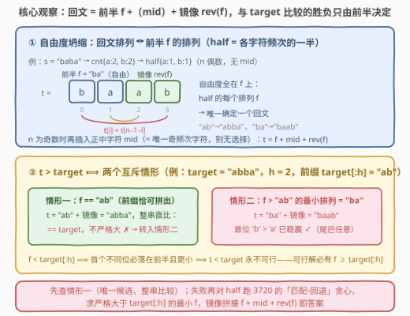
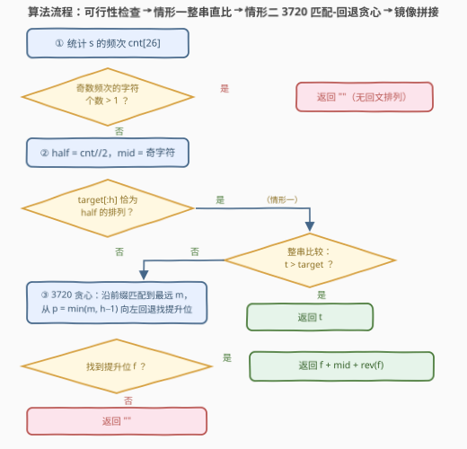

# LeetCode 大于目标字符串的最小字典序回文排列 题解

## 1. 题目概述

- **标题 / 题号**：大于目标字符串的最小字典序回文排列（#3734，hard）
- **链接**：https://leetcode.cn/problems/lexicographically-smallest-palindromic-permutation-greater-than-target/
- **难度**：困难
- **标签**：贪心、字符串、计数、枚举

**题意**：给定两个长度均为 $n$ 且仅由小写英文字母组成的字符串 $s$ 和 $target$。返回**字典序最小**的字符串，它**既是** $s$ 的一个**回文排列**，又**字典序严格大于** $target$；若不存在这样的排列，返回空字符串 `""`。

**示例 1**：

```text
输入：s = "baba", target = "abba"
输出："baab"
解释：s 的回文排列（按字典序）是 "abba" 和 "baab"，严格大于 target 的最小者是 "baab"。
```

**示例 2**：

```text
输入：s = "baba", target = "bbaa"
输出：""
解释："abba" 和 "baab" 都不大于 "bbaa"，返回空字符串。
```

**示例 3**：

```text
输入：s = "abc", target = "abb"
输出：""
解释：s 没有任何回文排列（三个字符频次全为奇数）。
```

**示例 4**：

```text
输入：s = "aac", target = "abb"
输出："aca"
解释：s 唯一的回文排列是 "aca"，它严格大于 "abb"。
```

**约束**：

- $1 \le n = s.length = target.length \le 300$
- $s$ 和 $target$ 仅由小写英文字母组成

> 💡 **审题关键**：① 这是 [3720. 大于目标字符串的最小字典序排列](3720_大于目标字符串的最小字典序排列.md) 的回文加强版：候选从「$s$ 的任意排列」收缩为「$s$ 的**回文**排列」——回文由前半唯一决定，**自由度从整串坍缩到前半 $h = \lfloor n/2 \rfloor$ 位**；② 回文排列可能根本不存在（示例 3：奇频次字符超过一个），须先做可行性判定；③ $target$ 不必是回文、也不必是 $s$ 的排列；④ 要求**严格**大于——最大回文排列恰等于 $target$ 时也要返回 `""`（示例 2）。

## 2. 解题思路

### 2.1 暴力思路

回文由前半决定（见 2.2），所以暴力不必枚举 $s$ 的全部排列——把每种字符的 $\text{cnt}[c]/2$ 个组成前半多重集 `half`，排序后不断 `next_permutation` 枚举前半的每个排列 $f$，拼出回文 $t = f + \text{mid} + \mathrm{rev}(f)$，筛出 $> target$ 的最小者。前半排列数最坏仍是多重组合数 $\binom{h}{h/2,\dots}$ 量级（$h = 150$ 时天文数字），爆炸；但「自由度只剩前半」这个事实本身，就是下一步的全部燃料。

### 2.2 核心观察：自由度坍缩到前半 + 两情形分解



**观察一（回文排列 ↔ 前半排列）**：统计 $s$ 的频次 $\text{cnt}$。回文排列存在 $\iff$ **奇数频次的字符至多一个**（$n$ 偶则必须全偶，$n$ 奇则恰一个奇）。令 $h = \lfloor n/2 \rfloor$，前半多重集为 $\text{half}[c] = \text{cnt}[c]/2$；$n$ 为奇数时正中字符 $\text{mid}$ **被唯一确定为那个奇频次字符**——回文中每个字符的出现次数 = 两半的成对贡献（偶数）+ 中心至多 $1$ 个，奇频次只能落在中心。于是：

$$\text{half 的每个排列 } f \;\longmapsto\; \text{唯一回文 } t = f + \text{mid} + \mathrm{rev}(f)$$

**观察二（胜负只看前半）**：$t > target \iff$ 两者首个不同位 $p$ 上 $t[p] > target[p]$。按 $p$ 的落点完备分割：

- $p \ge h$：前 $h$ 位全等，即 $f = target[0..h-1]$——**情形一**；
- $p < h$：$f[0..p-1] = target[0..p-1]$ 且 $f[p] > target[p]$，即 $f > target[0..h-1]$——**情形二**；
- 反之 $f < target[0..h-1]$ 时，首个不同位必落在前半且更小 $\Rightarrow t < target$，**永不可行**。

**情形一（$f = target[0..h-1]$）**：仅当 $target$ 的前半恰为 `half` 的排列才可能，此时候选**唯一**：$t = target[0..h-1] + \text{mid} + \mathrm{rev}(target[0..h-1])$，直接整串与 $target$ 比较（示例 4：`"a" + "c" + "a" = "aca" > "abb"` ✓；示例 1：`"abba" == target` ✗）。注意此时**必须整串比较**——前半打平后，胜负转移到了 mid 和镜像后半上，大、小、等三种结局都可能出现。

**情形二（$f > target[0..h-1]$）**：首个不同位出现在前半且 $t$ 更大——**后半镜像成什么样都不影响胜负**。于是问题化归为 [3720](3720_大于目标字符串的最小字典序排列.md) 的原题形态：求多重集 `half` 中**严格大于** $T = target[0..h-1]$ 的**最小排列**，直接套用其「贪心匹配 + 回退」。且拼接算子 $\mathrm{build}(f) = f + \text{mid} + \mathrm{rev}(f)$ **严格单调**：若 $f_1 < f_2$，首个不同位 $q < h$ 处 $\mathrm{build}(f_1)[q] < \mathrm{build}(f_2)[q]$ 且之前全等，故 $\mathrm{build}(f_1) < \mathrm{build}(f_2)$——**最小的 $f$ 给出最小的 $t$**。

**优先级**：情形一的候选（若可行且严格更大）前半恰等于 $target$ 前半，必小于任何情形二候选（后者前半严格更大，首个不同位处直接落败）——**先查情形一，失败再跑情形二**。

> ⚠️ **为什么不能对整个串直接跑 3720 再「修成回文」？** 3720 的最小性依赖「尾巴自由取剩余升序」；而回文的尾巴被 $\mathrm{rev}(\text{前半})$ 钉死。反例：$s = $ `"aabcb"`，$target = $ `"abcca"`，全串贪心给出 `"acabb"`（前缀 `"a"` + 提升 `c` + 升序尾巴 `"abb"`）——不是回文；正确答案是 `"bacab"`（$\text{mid} = $ `c`，$f = $ `"ba"`）。最小化必须搬进「半串空间」做，这正是本题在 3720 之上多出的一层结构。

### 2.3 算法流程图



**文字版步骤**：

| 步骤 | 操作 | 说明 |
|------|------|------|
| ① 统计 | 数 $s$ 的频次 `cnt[26]` | 奇频次字符 $> 1$ 个 → 返回 `""` |
| ② 坍缩 | `half[c] = cnt[c]/2`，`mid` = 奇字符（$n$ 奇时） | 自由度全部落在前半 $h$ 位 |
| ③ 情形一 | 若 `target[:h]` 恰为 `half` 的排列：拼出 $t$ 整串比较 | $t > target$ → 直接返回 |
| ④ 情形二 | 3720 贪心：沿 $T = $ `target[:h]` 匹配到最远 $m$，从 $p = \min(m, h-1)$ 向左回退，找「剩余中 $> T[p]$ 的最小字符」 | 找到提升位 → 构造最小 $f$；退到 $p < 0$ → 返回 `""` |
| ⑤ 镜像 | 返回 $f + \text{mid} + \mathrm{rev}(f)$ | 回文约束在此自动满足 |

### 2.4 示例演算

**示例 1**：$s = $ `"baba"`, $target = $ `"abba"`。`cnt = {a:2, b:2}` 全偶，$h = 2$，`half = {a:1, b:1}`，无 mid：

| 步骤 | 操作 | 计数变化 | 结果 |
|------|------|----------|------|
| ③ 情形一 | `target[:2] = "ab"` 恰为 half 的排列 | — | $t = $ `"abba"` $== target$，✗ 转情形二 |
| ④ 匹配 | 沿 $T = $ `"ab"` 匹配：`a`、`b` 有则扣，$m = 2 = h$ | 还回 `b` 得 $\{$b:1$\}$ | $p = 1$，前缀 `"a"` 已扣 |
| ④ 检查 $p{=}1$ | 剩余 $\{b\}$ 中无 $>$ `b` 的字符 | 还回 `a` 得 $\{a{:}1, b{:}1\}$ | $p = 0$ |
| ④ 检查 $p{=}0$ | 剩余 $\{a, b\}$ 中 $>$ `a` 的最小是 `b` | $\{a{:}1\}$ | $f = $ `b` + 升序 `"a"` $=$ `"ba"` |
| ⑤ 镜像 | `"ba"` $+$ `"ab"` | — | **`"baab"`** ✓ |

**示例 4**（奇数长度）：$s = $ `"aac"`, $target = $ `"abb"`。`cnt = {a:2, c:1}`，奇字符 `c` 即 mid，$h = 1$，`half = {a:1}`。情形一：`target[:1] = "a"` 恰为 half 的排列 → $t = $ `"a" + "c" + "a"` $=$ `"aca"`，整串比较 `"aca" > "abb"`（位置 1 上 `c > b`）✓，直接返回，情形二无需启动。

**示例 2**（穷尽失败）：$s = $ `"baba"`, $target = $ `"bbaa"`：情形一 `"bb"` 不是 half 的排列；情形二沿 `"bb"` 匹配 $m = 1$，回退检查 $p = 1, 0$ 均无更大字符 → 返回 `""`。

## 3. 参考代码

### C++

```cpp
class Solution {
  public:
    string lexPalindromicPermutation(string s, string target) {
        int n = s.size();
        array<int, 26> cnt{};
        for (char c : s) ++cnt[c - 'a'];

        int oddCnt = 0, oddChar = -1;               // 可行性：奇频次字符至多一个
        for (int k = 0; k < 26; ++k)
            if (cnt[k] & 1) { ++oddCnt; oddChar = k; }
        if (oddCnt > 1) return "";

        int h = n / 2;
        string mid = (n & 1) ? string(1, char('a' + oddChar)) : "";

        array<int, 26> half{};                       // 前半的多重集
        for (int k = 0; k < 26; ++k) half[k] = cnt[k] / 2;

        // 情形一：target 前半恰为 half 的排列 → 唯一候选，整串比较
        array<int, 26> pre{};
        for (int i = 0; i < h; ++i) ++pre[target[i] - 'a'];
        if (pre == half) {
            string f = target.substr(0, h);
            string t = f + mid + string(f.rbegin(), f.rend());
            if (t > target) return t;
        }

        // 情形二：half 中严格大于 target[:h] 的最小排列（3720 套路），再镜像
        string f = smallestGreater(half, target.substr(0, h));
        if (f.empty()) return "";
        return f + mid + string(f.rbegin(), f.rend());
    }

  private:
    // 多重集 cnt（共 h 个字符）中严格大于 T 的最小排列；无则返回 ""
    string smallestGreater(array<int, 26> cnt, const string& T) {
        int h = T.size();
        if (h == 0) return "";
        int m = 0;                                   // 贪心匹配：最远可满足前缀
        while (m < h && cnt[T[m] - 'a'] > 0) {
            --cnt[T[m] - 'a'];
            ++m;
        }
        int p = min(m, h - 1);
        if (m > p) ++cnt[T[m - 1] - 'a'];            // m == h：整前缀恰可拼出，回退一位
        while (p >= 0) {                             // cnt 恰为扣除 T[0..p-1] 后的剩余
            int c = T[p] - 'a', hi = -1;             // 剩余中 > T[p] 的最小字符
            for (int k = c + 1; k < 26 && hi < 0; ++k)
                if (cnt[k] > 0) hi = k;
            if (hi >= 0) {                           // 找到提升位：前缀 + 提升 + 升序尾巴
                --cnt[hi];
                string res = T.substr(0, p);
                res.push_back(char('a' + hi));
                for (int k = 0; k < 26; ++k) res.append(cnt[k], char('a' + k));
                return res;
            }
            if (p == 0) break;
            ++cnt[T[p - 1] - 'a'];                   // 前缀缩短一位：还回 T[p-1]
            --p;
        }
        return "";
    }
};
```

### Python

```python
class Solution:
    def lexPalindromicPermutation(self, s: str, target: str) -> str:
        n = len(s)
        cnt = Counter(s)
        odd = [c for c, v in cnt.items() if v % 2]
        if len(odd) > 1:                          # 奇频次字符 > 1 个：拼不出回文
            return ""
        h, mid = n // 2, (odd[0] if odd else "")

        half = Counter({c: v // 2 for c, v in cnt.items() if v >= 2})

        # 情形一：target 前半恰为 half 的排列 → 唯一候选，整串比较
        if Counter(target[:h]) == half:
            t = target[:h] + mid + target[:h][::-1]
            if t > target:
                return t

        # 情形二：half 中严格大于 target[:h] 的最小排列（3720 套路），再镜像
        T = target[:h]
        if h == 0:
            return ""
        m = 0                                      # 贪心匹配：最远可满足前缀
        while m < h and half[T[m]] > 0:
            half[T[m]] -= 1
            m += 1
        p = min(m, h - 1)
        if m > p:                                  # m == h：整前缀恰可拼出，回退一位
            half[T[m - 1]] += 1
        while p >= 0:                              # half 恰为扣除 T[:p] 后的剩余
            hi = next((chr(k) for k in range(ord(T[p]) + 1, 123)
                       if half[chr(k)] > 0), "")
            if hi:                                 # 找到提升位：前缀 + 提升 + 升序尾巴
                half[hi] -= 1
                f = T[:p] + hi + "".join(
                    k * v for k, v in sorted(half.items()) if v)
                return f + mid + f[::-1]
            if p == 0:
                break
            half[T[p - 1]] += 1                    # 前缀缩短一位：还回 T[p-1]
            p -= 1
        return ""
```

> 💡 **写法要点**：
> - 情形一的判等用 26 个桶逐一比对（C++ 的 `pre == half`、Python 的 `Counter` 相等），别整串排序再比——$O(n + 26)$ 足够。
> - 情形二直接把 3720 的「匹配-回退」搬过来，**作用对象换成 `half` 和 `target[:h]`**：匹配沿前缀走，回退每步还回 $T[p-1]$，提升位取「剩余中 $> T[p]$ 的最小字符」。
> - $n = 1$ 时 $h = 0$：情形一恒触发（空前缀 == 空排列），$t$ 就是那个字符本身，整串比较后情形二空手而归，逻辑自然闭合；但 $h = 0$ 时别去下标 $T[m-1]$，先短路。
> - 镜像一步完成：`string(f.rbegin(), f.rend())` / `f[::-1]`。
> - Python 的 `Counter` 相等性忽略零计数的差异，但构造 `half` 时已用 `if v >= 2` 过滤零桶，两侧都是「仅正计数」，比较安全。

## 4. 复杂度分析

| 维度 | 复杂度 | 说明 |
|------|--------|------|
| **时间复杂度** | $O(26n)$ | 频次统计与可行性 $O(n + 26)$；情形一 $O(n + 26)$；情形二匹配-回退至多 $h$ 步、每步查 26 桶；镜像拼接 $O(n)$ |
| **空间复杂度** | $O(26)$ | 几个计数数组（输出字符串不计） |

> 💡 $n = 300$ 时 $26n \approx 7.8 \times 10^3$，瞬间完成；即便 $n$ 放大到 $10^6$ 依然线性可过。本题难点完全不在复杂度，而在**把回文约束正确投影到半串空间**的推理。

## 5. 扩展：字典序构造族的三级台阶

「跨过 target 的最小字典序构造」家族可以排成台阶：

| 台阶 | 题目 | 约束 | 尾巴自由度 |
|------|------|------|------------|
| 1 | [31. 下一个排列](../0001-0100/31_下一个排列.md) / [556. 下一个更大元素 III](../0501-0600/556_下一个更大元素\ III.md) | $target = $ 输入串自身，同一排列格 | 后缀升序 |
| 2 | [3720. 大于目标字符串的最小字典序排列](3720_大于目标字符串的最小字典序排列.md) | $target$ 任意，多重集全串自由 | 完全自由（升序） |
| 3 | [1842. 下个由相同数字构成的回文串](../1801-1900/1842_下个由相同数字构成的回文串.md) | 回文约束，$target = s$ 自身（数字） | 钉死为 $\mathrm{rev}(\text{前半})$ |
| 4 | **本题 3734** | 回文约束 $\cap$ 任意 $target$ | 钉死为 $\mathrm{rev}(\text{前半})$ |

本题 $=$ 3720 的「任意 target」$\cap$ 1842 的「回文约束」，是家族目前的最大公约数。两个对称变体值得顺手想一遍：

- **求小于 $target$ 的最大回文排列**：情形二镜像化——求 half 中严格**小于** $target[0..h-1]$ 的**最大**排列（分界位放「剩余中 $< T[p]$ 的最大字符」、尾巴降序）；情形一改为整串比较 $t < target$ 是否成立。
- **字符集大小 $\sigma$ 一般化**：26 替换为 $\sigma$，复杂度 $O(n\sigma)$；$\sigma$ 巨大时用有序多重集合维护剩余，单步查找 $O(\log \sigma)$，总 $O(n \log \sigma)$。

## 6. 面试要点

**Q1：回文排列的存在性判据是什么？为什么奇数长度时中间字符没有选择余地？**

> 奇数频次的字符至多一个。回文中位置 $i$ 与 $n-1-i$ 成对相等，每个字符的总频次 $=$ 两半的成对贡献（偶数）$+$ 中心至多 $1$ 个。$n$ 偶要求全部频次为偶；$n$ 奇恰一个奇频次字符，且它多出的那一个只能放在中心——$\text{mid}$ 被频次奇偶性唯一钉死。因此 $\text{half}[c] = \text{cnt}[c]/2$ 完整描述了前半的全部资源。

**Q2：为什么说「与 target 的胜负只看前半」？两个情形是怎么完备分割的？**

> 等长串比较只看首个不同位 $p$：$t > target \iff t[p] > target[p]$ 且之前全等。若 $p < h$，则 $f > target[0..h-1]$（情形二）；若 $p \ge h$，则前半全等 $f = target[0..h-1]$（情形一）。加上 $f < target[0..h-1] \Rightarrow t < target$ 的排除，三种关系（$<$、$==$、$>$）恰好完备覆盖，不重不漏。

**Q3：为什么情形二可以直接套 3720，且最小的 $f$ 一定给出最小的 $t$？**

> $f > target[0..h-1]$ 时首个不同位 $p < h$ 已分出胜负，镜像后半完全不影响比较结果——回文约束只作用于 $f$ 的取值集合（必须是 half 的排列），不引入额外的比较耦合，所以子问题恰是「half 中 $> T$ 的最小排列」，即 3720 原题。又 $\mathrm{build}(f) = f + \text{mid} + \mathrm{rev}(f)$ 严格单调：$f_1 < f_2$ 时首个不同位 $q < h$ 处 $\mathrm{build}(f_1)[q] < \mathrm{build}(f_2)[q]$ 且之前全等，故最小 $f$ 给出最小 $t$。

**Q4：情形一为什么必须把整串拼出来比较，而不能只比较前半？**

> $f = target[0..h-1]$ 只保证前半打平，胜负转移到 mid 和镜像后半上，三种结局都可能出现：$s = $ `"aabb"`、$f = $ `"ab"` 时，$target = $ `"abab"` 有 $t = $ `"abba" > target$（尾部获胜）；$target = $ `"abba"` 时恰好相等；$target = $ `"abbb"` 时 $t < target$。所以必须整串比较；且情形一失败（$t \le target$）不能返回 `""`，要继续落入情形二。

**Q5：能不能对整个串直接跑 3720 求出最小排列，再把它调整成回文？**

> 不能。反例 $s = $ `"aabcb"`、$target = $ `"abcca"`：全串贪心给出 `"acabb"`（前缀 `"a"` + 提升 `c` + 升序尾巴 `"abb"`），不是回文；正确答案是 `"bacab"`（$f = $ `"ba"` 镜像拼 `c` 与 `ab`）。3720 的最小性恰恰依赖「尾巴自由取剩余升序」，而回文的尾巴 $= \mathrm{rev}(\text{前半})$ 被钉死——一旦尾巴不自由，最小化就必须在半串空间里做，这就是本题的核心增量。

## 同类练习题

| # | 题目 | 与本题的关联 |
|---|------|-------------|
| 3720 | [大于目标字符串的最小字典序排列](https://leetcode.cn/problems/lexicographically-smallest-permutation-greater-than-target/)（[题解](3720_大于目标字符串的最小字典序排列.md)） | 去掉回文约束的前作，本题情形二的「匹配-回退」贪心直接移植自它 |
| 3517 | [最小回文排列 I](https://leetcode.cn/problems/smallest-palindromic-rearrangement-i/)（[题解](../3501-3600/3517_最小回文排列I.md)） | 同一「半串坍缩」但没有 target 压力——half 升序即最小回文，可当本题的热身 |
| 1842 | [下个由相同数字构成的回文串](https://leetcode.cn/problems/next-palindrome-using-same-digits/)（[题解](../1801-1900/1842_下个由相同数字构成的回文串.md)） | target = s 自身的回文特例（会员题） |
| 31 | [下一个排列](https://leetcode.cn/problems/next-permutation/)（[题解](../0001-0100/31_下一个排列.md)） | 「保前缀 + 最小提升 + 升序尾巴」骨架的鼻祖 |
| 556 | [下一个更大元素 III](https://leetcode.cn/problems/next-greater-element-iii/)（[题解](../0501-0600/556_下一个更大元素\ III.md)） | 数字版「下一个排列」，多了位数溢出判定 |
