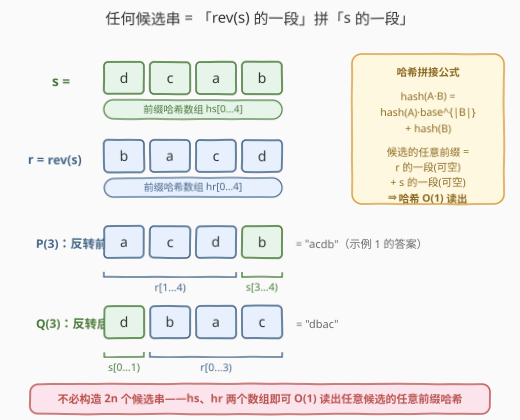
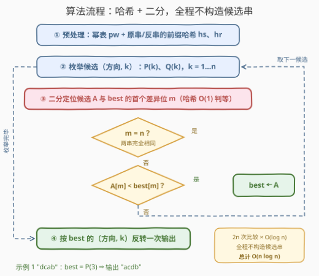

# LeetCode 反转后字典序最小的字符串 II 题解

## 1. 题目概述

- **标题 / 题号**：反转后字典序最小的字符串 II（#3735，hard）
- **链接**：https://leetcode.cn/problems/lexicographically-smallest-string-after-reverse-ii/
- **难度**：困难
- **标签**：字符串、哈希函数、滚动哈希、二分查找、后缀数组

> ⚠️ 本题为 LeetCode 付费题，题意描述根据官方示例用例与 hints 重建，可能与官方题面有出入。

**题意**：给你一个由小写英文字母组成、长度为 $n$ 的字符串 `s`。你必须**恰好执行一次**操作：选择一个整数 $k$（$1 \le k \le n$），然后执行以下两个选项之一：

- 反转 `s` 的**前 $k$ 个**字符；或
- 反转 `s` 的**后 $k$ 个**字符。

返回在恰好执行一次此类操作后可以获得的**字典序最小**的字符串。

本题是 [3722. 反转后字典序最小的字符串](https://leetcode.cn/problems/lexicographically-smallest-string-after-reverse/)（[题解](../3701-3800/3722_反转后字典序最小的字符串.md)）的**数据范围放大版**：操作语义与三个示例完全相同，但 $n$ 大幅提升——I 版 $n \le 1000$ 放行 $O(n^2)$ 暴力，II 版按官方标签（哈希 / 二分 / 后缀数组）与提示推断为 $10^5$ 量级，逐个构造候选再比较的做法会超时。官方提示只有一句：

> Use binary search and hashing for faster lexicographically smaller comparisons.

**示例 1**：

```text
输入：s = "dcab"
输出："acdb"
解释：选择 k = 3，反转前 3 个字符，"dca" → "acd"，得到 "acdb"。
```

**示例 2**：

```text
输入：s = "abba"
输出："aabb"
解释：选择 k = 3，反转后 3 个字符，"bba" → "abb"，得到 "aabb"。
```

**示例 3**：

```text
输入：s = "zxy"
输出："xzy"
解释：选择 k = 2，反转前 2 个字符，"zx" → "xz"，得到 "xzy"。
```

**约束**：

- $1 \le n = |s|$（II 版官方约束不可见，按标签与提示推断为 $10^5$ 量级；本文解法实测 $n = 10^6$ 亦稳定通过）
- `s` 仅由小写英文字母组成

> 💡 **审题关键**：① 操作语义与 3722 完全一致——自由度仍是「方向（前/后）× 长度 $k$」，可达结果至多 $2n$ 个，且 $k = 1$ 是"空转"，**答案 $\preceq s$ 恒成立**；② 变的只有 $n$：$O(n^2)$ 的「构造 + 比较」双双爆表，必须把**每次比较**从 $O(n)$ 压到 $O(\log n)$——这正是官方提示的指向；③ 比较的对象是"虚拟的候选串"：只要能 $O(1)$ 读出任意候选的任意前缀哈希，就根本不必把候选串造出来。

## 2. 解题思路

### 2.1 暴力思路：I 版的 $O(n^2)$ 死在哪里

回顾 3722 的暴力：候选全集 $\{P(k)\} \cup \{Q(k)\}$ 共 $2n$ 个，每个花 $O(n)$ 构造字符串、再花 $O(n)$ 逐字符比较，总计 $O(n^2)$。$n = 1000$ 时约 $4 \times 10^6$ 次字符操作稳过；$n = 10^5$ 时飙到 $4 \times 10^{10}$，铁定超时。

瓶颈拆开看：

- **候选个数 $2n$ 无法再降**——这是操作空间的结构，题面决定的；
- **单次比较 $O(n)$ 可以压到 $O(\log n)$**——两个等长串比字典序，本质是找**最长公共前缀（LCP）**后比较下一个字符；LCP 长度满足单调性，可以**二分**，而"前 $m$ 个字符是否相等"用**哈希** $O(1)$ 判定。

于是总复杂度变成 $2n \times O(\log n) = O(n \log n)$。剩下的问题只有一个：候选串不构造出来，它的前缀哈希从哪来？

### 2.2 核心观察：候选都是「rev(s) 的一段 + s 的一段」



记 $r = \mathrm{rev}(s)$。把两类候选统一改写（$\mathrm{rev}(s[0..k)) = r[n{-}k..n)$）：

$$P(k) = r[n{-}k..n) + s[k..n) \qquad Q(k) = s[0..n{-}k) + r[0..k)$$

也就是说，**任何候选都是「$r$ 的一段」拼「$s$ 的一段」**（两段均可为空，$k=n$ 时各退化为单独一段）。于是候选的任意长度 $m$ 的前缀只有两种形态：

- $m$ 没跨过拼接缝：是 $r$（或 $s$）的一个**子串**；
- $m$ 跨过拼接缝：是「$r$ 的一段 + $s$ 的一段」。

对 $s$ 与 $r$ 各预处理一套**前缀哈希** $h_s[\,],\,h_r[\,]$ 和幂表 $pw[\,]$ 后，两种形态都能 $O(1)$ 取哈希：

- 子串哈希：$h(i, len) = h[i{+}len] - h[i] \cdot pw[len]$；
- 拼接哈希：$\mathrm{hash}(A \cdot B) = \mathrm{hash}(A) \cdot base^{|B|} + \mathrm{hash}(B)$——多项式哈希天然支持 $O(1)$ 拼接。

**候选串从头到尾不必构造**。有了 $O(1)$ 的前缀哈希，比较候选 $A$ 与当前最优 $best$ 就是经典套路：

1. **二分**最大的 $m$，使 $A[0..m)$ 与 $best[0..m)$ 哈希相等（即 LCP 长度）——谓词「前 $m$ 个相等」随 $m$ 单调递减，二分合法；
2. 若 $m = n$，两串相同，$A$ 不更小；否则比较第 $m$ 位字符 $A[m]$ 与 $best[m]$ 定胜负。

每次比较 $O(\log n)$，全程维护擂主 $best$，$2n$ 个候选逐个打擂，总 $O(n \log n)$。

再加两个**不改复杂度、只省常数**的实用加速：

- **整串哈希预判**：进入二分前先 $O(1)$ 比较两候选的整串哈希，相同直接跳过——重复度高的串（如 `"aaaa"`、`"abab…"`）大量短路，实测最坏用例提速约一个数量级；
- **首位剪枝**（正是 3722 题解扩展节预告的结论）：$P(k)$ 首位为 $s[k{-}1]$，只有等于 $c = \min(s)$ 才可能最优；$Q(k)$（$k<n$）首位恒为 $s[0]$，若 $s[0] > c$ 则整族剪掉、只剩 $Q(n)$（且仅当 $s[n{-}1] = c$ 才留）。随机数据下候选数骤减——`"dcab"` 的 8 个候选剪到 1 个。

> 💡 一句话：候选的结构「$r$ 的一段 + $s$ 的一段」让**任意候选的任意前缀哈希都能 $O(1)$ 拼出来**，比较从 $O(n)$ 压到 $O(\log n)$，$2n$ 次打擂总代价 $O(n \log n)$——把 3722 的枚举骨架原样保留，只换了"比较引擎"。

### 2.3 算法流程图



**逻辑执行步骤**：

| 步骤 | 操作 | 说明 |
|------|------|------|
| ① 预处理 | 幂表 $pw$ + $s$、$r$ 的前缀哈希 $h_s$、$h_r$ | $O(n)$；此后任意候选任意前缀哈希 $O(1)$ 可读 |
| ② 枚举候选 | $(方向, k)$：$P(k)$、$Q(k)$，$k = 1 \dots n$ | 首位剪枝后实际参与比较的候选大幅减少 |
| ③ 二分 LCP | 找最大的 $m$ 使 $A[0..m)$ 与 $best[0..m)$ 哈希相等 | 每步哈希判等 $O(1)$，共 $O(\log n)$ 步 |
| ④ 判定更新 | $m = n$ 则相同跳过；否则比 $A[m]$ 与 $best[m]$ | 更小则 $best \leftarrow A$；回到 ② |
| ⑤ 物化输出 | 按 $best$ 的 $(方向, k)$ 真正反转一次 | 全程唯一一次字符串操作，$O(n)$ |

> ⚠️ ③ 之前先做**整串哈希预判**（图省略）：整串哈希相同直接跳过，是应对高重复串的常数利器；④ 中 $A[m] < best[m]$ 才更新，相等（$m = n$）或更大都不动。

### 2.4 示例演算

**示例 1：`s = "dcab"`，候选剪枝 + 一次打擂**。

首位剪枝：$c = $ `'a'` 仅出现在下标 $2$ → 前缀候选只剩 $P(3)$；$s[0] = $ `'d' > 'a'`，检查 $Q(n) = \mathrm{rev}(s)$ 的首位 $s[3] = $ `'b' > 'a'` 也剪掉 → 后缀候选全灭。**8 个候选只剩 1 个**。

比较 $A = P(3)$ 与 $best = P(1) = s$（即 `"acdb"` vs `"dcab"`，$n = 4$）：

| 二分区间 | $m$ | 哈希判「前 $m$ 个相等」 | 结果 |
|----------|-----|------------------------|------|
| $[0, 4]$ | 2 | `"ac"` vs `"dc"` 不等 | 收缩到 $[0, 1]$ |
| $[0, 1]$ | 1 | `"a"` vs `"d"` 不等 | 收缩到 $[0, 0]$ |

LCP $m = 0$，比较首位：$'a' < 'd'$ → $P(3)$ 更小，$best = P(3)$，输出 `"acdb"` ✓。

**示例 2：`s = "abba"`，后缀侧一个都不能剪**。$c = $ `'a'` 且 $s[0] = c$，后缀候选**全保留**；前缀候选只剩 $P(1), P(4)$。打擂最终 $Q(3) = $ `"aabb"` 胜出——比如它对 $best = P(1) = $ `"abba"`：LCP $= 1$（首位同为 `'a'`），第 1 位 $'a' < 'b'$ 即分胜负。这正是 3722 里"贪心直觉失效、后缀侧必须老实枚举"在高数据量下的延续。

**边界情形**：$n = 1$ 直接返回；整串已最优（如 `"abc"`）时 $k = 1$ 空转，$best$ 保持 $P(1)$，输出原串。

## 3. 参考代码

### C++

```cpp
class Solution {
public:
    string lexSmallest(string s) {
        using ull = unsigned long long;
        const ull MOD = (1ULL << 61) - 1;                    // 61 位 Mersenne 素数
        int n = (int)s.size();
        if (n <= 1) return s;
        string r(s.rbegin(), s.rend());

        static mt19937_64 rng(chrono::steady_clock::now().time_since_epoch().count());
        const ull BASE = 131 + rng() % (MOD - 300);          // 随机底数防对抗构造

        auto mul = [&](ull a, ull b) -> ull {                // (a*b) mod 2^61-1
            __uint128_t c = (__uint128_t)a * b;
            ull t = (ull)(c & MOD) + (ull)(c >> 61);
            return t >= MOD ? t - MOD : t;
        };
        auto add = [&](ull a, ull b) { ull t = a + b; return t >= MOD ? t - MOD : t; };

        vector<ull> pw(n + 1), hs(n + 1), hr(n + 1);         // 幂表 + 两套前缀哈希
        pw[0] = 1;
        for (int i = 1; i <= n; ++i) {
            pw[i] = mul(pw[i - 1], BASE);
            hs[i] = add(mul(hs[i - 1], BASE), (ull)(unsigned char)s[i - 1]);
            hr[i] = add(mul(hr[i - 1], BASE), (ull)(unsigned char)r[i - 1]);
        }
        auto sub = [&](const vector<ull>& h, int i, int len) {  // hash(t[i..i+len))
            ull t = h[i + len] + MOD - mul(h[i], pw[len]);
            return t >= MOD ? t - MOD : t;
        };

        // 候选编码 (isP, k)：isP=1 为 P(k)=r[n-k..n)+s[k..n)，否则 Q(k)=s[..n-k)+r[..k)
        auto candHash = [&](int isP, int k, int m) -> ull {  // 候选前 m 个字符的哈希
            if (isP) {
                if (m <= k) return sub(hr, n - k, m);
                return add(mul(sub(hr, n - k, k), pw[m - k]), sub(hs, k, m - k));
            }
            if (m <= n - k) return sub(hs, 0, m);
            return add(mul(sub(hs, 0, n - k), pw[m - n + k]), sub(hr, 0, m - n + k));
        };
        auto candChar = [&](int isP, int k, int i) -> char { // 候选第 i 个字符
            if (isP) return i < k ? s[k - 1 - i] : s[i];
            return i < n - k ? s[i] : r[i - n + k];
        };
        auto smaller = [&](int isPa, int ka, int isPb, int kb) -> bool {
            if (candHash(isPa, ka, n) == candHash(isPb, kb, n))
                return false;                                // 整串哈希预判：相同直接跳过
            int lo = 0, hi = n;                              // 二分最长公共前缀长度
            while (lo < hi) {
                int mid = (lo + hi + 1) >> 1;
                if (candHash(isPa, ka, mid) == candHash(isPb, kb, mid)) lo = mid;
                else hi = mid - 1;
            }
            return candChar(isPa, ka, lo) < candChar(isPb, kb, lo);
        };

        char c = *min_element(s.begin(), s.end());           // 首位剪枝（见 2.2）
        vector<pair<int, int>> cands;
        for (int p = 0; p < n; ++p)
            if (s[p] == c) cands.push_back({1, p + 1});      // P(p+1) 首位为 s[p] = c
        if (s[0] == c)
            for (int k = 1; k <= n; ++k) cands.push_back({0, k});
        else if (s[n - 1] == c)
            cands.push_back({0, n});                         // 仅 Q(n) 可能翻盘

        int bP = 1, bK = 1;                                  // best 初始为 P(1) = s
        for (auto& [isP, k] : cands)
            if (smaller(isP, k, bP, bK)) { bP = isP; bK = k; }

        if (bP) reverse(s.begin(), s.begin() + bK);          // 物化：全程唯一一次反转
        else     reverse(s.end() - bK, s.end());
        return s;
    }
};
```

> 💡 **写法要点**：
> - `MOD` 取 $2^{61} - 1$（Mersenne 素数）：乘法用 `__uint128_t` 中转后 `lo + hi` 一步归约，无除法、快且安全；底数用 `chrono` 种子的 `mt19937_64` 随机选取，防止被针对性构造碰撞；
> - `candHash` 是全篇的心脏：$P(k)$ 与 $Q(k)$ 都按「先 $r$ 后 $s$ / 先 $s$ 后 $r$」两段拼出，`m <= k`（或 `m <= n-k`）分支处理"没跨过拼接缝"的退化情形；
> - 候选只以 `(isP, k)` 二元组存在，**直到最后一步才真正反转**——内存里从来没有出现过第 $n + 1$ 个长为 $n$ 的字符串；
> - 结构化绑定 `auto& [isP, k]` 需要 C++17；`static rng` 避免多组用例反复播种。

### Python

```python
import random


class Solution:
    def lexSmallest(self, s: str) -> str:
        n = len(s)
        if n <= 1:
            return s
        r = s[::-1]
        MOD = (1 << 61) - 1
        BASE = random.randrange(256, MOD - 2)          # 随机底数防碰撞

        pw = [1] * (n + 1)                             # 幂表 + 两套前缀哈希
        hs, hr = [0] * (n + 1), [0] * (n + 1)
        for i in range(1, n + 1):
            pw[i] = pw[i - 1] * BASE % MOD
            hs[i] = (hs[i - 1] * BASE + ord(s[i - 1])) % MOD
            hr[i] = (hr[i - 1] * BASE + ord(r[i - 1])) % MOD

        def sub(h, i, ln):                             # hash(t[i:i+ln])
            return (h[i + ln] - h[i] * pw[ln]) % MOD

        def cand_hash(isP, k, m):                      # 候选前 m 个字符的哈希
            if isP:                                    # P(k) = r[n-k:] + s[k:]
                if m <= k:
                    return sub(hr, n - k, m)
                return (sub(hr, n - k, k) * pw[m - k] + sub(hs, k, m - k)) % MOD
            if m <= n - k:                             # Q(k) = s[:n-k] + r[:k]
                return sub(hs, 0, m)
            return (sub(hs, 0, n - k) * pw[m - n + k] + sub(hr, 0, m - n + k)) % MOD

        def cand_char(isP, k, i):                      # 候选第 i 个字符
            if isP:
                return s[k - 1 - i] if i < k else s[i]
            return s[i] if i < n - k else r[i - n + k]

        def smaller(a, b):                             # 候选 a 是否字典序小于候选 b
            if cand_hash(a[0], a[1], n) == cand_hash(b[0], b[1], n):
                return False                           # 整串哈希预判：相同直接跳过
            lo, hi = 0, n                              # 二分最长公共前缀长度
            while lo < hi:
                mid = (lo + hi + 1) >> 1
                if cand_hash(a[0], a[1], mid) == cand_hash(b[0], b[1], mid):
                    lo = mid
                else:
                    hi = mid - 1
            return cand_char(a[0], a[1], lo) < cand_char(b[0], b[1], lo)

        c = min(s)                                     # 首位剪枝（见 2.2）
        cands = [(True, p + 1) for p in range(n) if s[p] == c]
        if s[0] == c:
            cands += [(False, k) for k in range(1, n + 1)]
        elif s[n - 1] == c:
            cands.append((False, n))

        best = (True, 1)                               # best 初始为 P(1) = s
        for a in cands:
            if smaller(a, best):
                best = a

        isP, k = best
        return s[:k][::-1] + s[k:] if isP else s[:n - k] + s[n - k:][::-1]
```

> 💡 **写法要点**：
> - Python 大整数天然免溢出，`sub` 里 `% MOD` 自动处理负数；瓶颈是解释器开销——整串预判 + 首位剪枝两板斧下去，$n = 10^5$ 随机串实测 0.2s 内，最坏形态（`s[0]` 即最小字符且重复度高，如 `"abab…"`）约 2s；
> - 若评测环境更紧，可换 C++ 版（$n = 10^6$ 最坏 0.16s），或将 `cand_hash` 的两段拼接手工内联进 `smaller` 的二分循环；
> - 候选同样只以 `(isP, k)` 元组流转，最后的切片反转（`s[:k][::-1] + s[k:]`）是全程唯一一次字符串构造。

## 4. 复杂度分析

| 维度 | 复杂度 | 说明 |
|------|--------|------|
| **时间** | $O(n \log n)$ | 预处理幂表与前缀哈希 $O(n)$；至多 $2n$ 个候选 × 每次比较二分 $O(\log n)$ 步、每步哈希 $O(1)$；首位剪枝与整串预判只降常数 |
| **空间** | $O(n)$ | $pw$、$h_s$、$h_r$ 三个长度 $n{+}1$ 的数组；候选以 $(方向, k)$ 编码，不占字符串空间 |
| **可靠性** | 碰撞概率 $\approx \frac{2n \log n \cdot n}{2^{61}}$ | 随机底数下两个不同串哈希相等的概率 $\le n / \mathrm{MOD}$；$n = 10^6$ 时全程失误率上界约 $10^{-5}$（已是极宽松的并集界），双哈希可再平方级压低 |

> 💡 与 I 版对比：3722 是 $O(n^2)$ / $O(n)$，本题 $O(n \log n)$ / $O(n)$——题目把 $n$ 抬高两个数量级，解法把每次比较压低两个数量级，一升一降正好对冲。

## 5. 扩展：确定性方案与两个陷阱

**① 用后缀数组去掉哈希的随机性（标签里 Suffix Array 的由来）。** 哈希判等有小概率碰撞，追求确定性可以改用后缀数组：对 $T = s \,\#\, r$（$\#$ 为分隔符）建 SA + 高度数组 + 稀疏表，任意两个 $s$ / $r$ 的子串字典序比较都能 $O(1)$ 完成。而本题候选间的比较恰可拆成常数次子串比较——例如比较 $Q(k)$ 与 $Q(j)$（$k < j$）：两者共享前缀 $s[0..n{-}j)$，随后是「$r[0..j{-}k)$ 对 $s[n{-}j..n{-}k)$」的子串比较、再是「$r[j{-}k..k)$ 对 $r[0..n{-}j)$」的错位子串比较。SA 构建 $O(n \log n)$，总复杂度同为 $O(n \log n)$ 但零碰撞风险；代价是实现长度和常数都显著高于哈希，面试中通常口头提及即可。

**② "反转旋转"陷阱：别把这题化归成最小旋转。** 有个诱人的观察：$\mathrm{rev}(Q(k)) = s[n{-}k..n) + s[0..n{-}k)$ 恰是 $s$ 的一个旋转。但**反转操作既不保持也不翻转字典序**：`"ab" < "ba"` 反转后变成 `"ba" > "ab"`（方向翻转），而 `"ab" < "bb"` 反转后 `"ba" < "bb"`（方向不变）——序关系在反转下根本不稳定。因此「$Q$ 侧取最小」不能等价转化为「$s$ 的旋转取最大/最小」（Booth 算法那套），老实用哈希比较才是正道。

**③ 为什么不比较 $\mathrm{rev}$ 侧来省一套哈希？** 同理由 ②：比较 $A \prec B$ 与比较 $\mathrm{rev}(A) \succ \mathrm{rev}(B)$ 不等价，两套前缀哈希（$s$ 与 $r$）都必须预处理，好在只是常数翻倍。

## 6. 面试要点

**Q1：为什么比较两个候选可以「二分 + 哈希」？谓词为什么单调？**

> 两个等长串比字典序 = 先找 LCP 长度 $m^*$，再比第 $m^*$ 位。谓词「前 $m$ 个字符相等」随 $m$ 单调递减（前缀不等则更长的前缀必不等），所以可以二分出最大真值点 $m^*$；每步判等用前缀哈希 $O(1)$ 完成。若 $m^* = n$ 两串相同，否则比较第 $m^*$ 位字符即可——只在该位置取真实字符，其余全程只碰哈希。

**Q2：候选串不构造出来，前缀哈希怎么算？**

> 关键结构：$P(k) = r[n{-}k..n) + s[k..n)$、$Q(k) = s[0..n{-}k) + r[0..k)$，任何候选都是「$r$ 的一段 + $s$ 的一段」。候选的前 $m$ 个字符要么落在单段内（$O(1)$ 子串哈希），要么跨缝（拼接公式 $\mathrm{hash}(A \cdot B) = \mathrm{hash}(A) \cdot base^{|B|} + \mathrm{hash}(B)$，$O(1)$ 合成）。预处理 $h_s$、$h_r$、$pw$ 三张表即可覆盖全部 $2n$ 个候选。

**Q3：哈希碰撞怎么防？**

> ① 模数取 $2^{61} - 1$（Mersenne 素数，乘法可用 128 位中转 + 位运算归约，无除法）；② 底数运行期随机选取，防针对性构造；③ 随机底数下任意两个长度 $\le n$ 的不同串碰撞概率 $\le n/\mathrm{MOD}$，全程约 $2n\log n$ 次判等，$n = 10^6$ 时失误率上界也只有约 $10^{-5}$；④ 仍不放心就双哈希（两套独立底数取交集），或换后缀数组做确定性比较。

**Q4：首位剪枝的依据是什么？什么时候失效？**

> $P(k)$ 首位为 $s[k{-}1]$：若 $s[k{-}1] > c = \min(s)$，则存在首位为 $c$ 的前缀候选在第一位就严格压死它。$Q(k)$（$k < n$）首位恒为 $s[0]$、与 $k$ 无关：$s[0] > c$ 时整族被压死（仅 $Q(n)$ 且 $s[n{-}1] = c$ 时有翻盘可能）；但 $s[0] = c$ 时（如 `"abba"`）首位不携带任何区分 $k$ 的信息，后缀候选一个都不能剪——剪枝只降常数，最坏仍是 $2n$ 个候选，复杂度保证靠的是 $O(\log n)$ 比较。

**Q5：本题与 3722 的本质差别？**

> 操作空间（至多 $2n$ 个候选、$k=1$ 空转保证答案 $\preceq s$）完全一样，差别全在 $n$ 的量级倒逼「比较引擎」升级：3722 造串 + 逐字符比（$O(n)$ / 次），本题虚拟候选 + 哈希二分 LCP（$O(\log n)$ / 次）。工程启示：数据范围抬两个数量级时，先找"每一步贵在哪"，再换掉那一步的引擎，骨架不必推倒重来。

> 💡 **一句话总结**：II 版 = 3722 的枚举骨架 + 「候选都是 $r$ 的一段拼 $s$ 的一段」的哈希视图 + 二分 LCP 的比较引擎。三个要点带走：前缀哈希 $O(1)$ 拼接（候选永不落地）、整串预判与首位剪枝省常数、$2^{61} - 1$ 随机底数防碰撞。

## 同类练习题

| # | 题目 | 与本题的关联 |
|---|------|-------------|
| 3722 | [反转后字典序最小的字符串](https://leetcode.cn/problems/lexicographically-smallest-string-after-reverse/)（[题解](../3701-3800/3722_反转后字典序最小的字符串.md)） | 本题 I 版，$O(n^2)$ 全枚举；其扩展节预告的「哈希 + 二分 LCP」正是本题正解 |
| 1044 | [最长重复子串](https://leetcode.cn/problems/longest-duplicate-substring/)（[题解](../1001-1100/1044_最长重复子串.md)） | 二分答案 + 滚动哈希判等，「二分 + 哈希」套式的经典原型 |
| 214 | [最短回文串](https://leetcode.cn/problems/shortest-palindrome/)（[题解](../0201-0300/214_最短回文串.md)） | 同样在 $s$ 与 $\mathrm{rev}(s)$ 之间做前缀哈希匹配，对照两套哈希数组的用法 |
| 1392 | [最长快乐前缀](https://leetcode.cn/problems/longest-happy-prefix/)（[题解](../1301-1400/1392_最长快乐前缀.md)） | 前缀哈希判「前缀 = 后缀」的基础操作，本题 `sub` 函数的同款练手 |
| 1316 | [不同的循环子字符串](https://leetcode.cn/problems/distinct-echo-substrings/)（[题解](../1301-1400/1316_不同的循环子字符串.md)） | 滚动哈希对子串去重，体会哈希「以算代存」的通用思路 |
