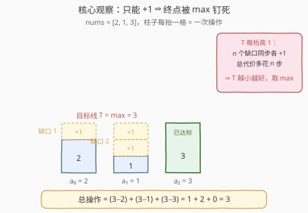
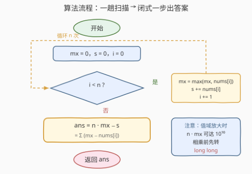

# 最小操作次数使数组元素相等 III

- **题目名称**：最小操作次数使数组元素相等 III
- **链接**：[3736. 最小操作次数使数组元素相等 III](https://leetcode.cn/problems/minimum-moves-to-equal-array-elements-iii/)
- **难度**：简单
- **标签**：数组、数学

## 1. 题目概述

给你一个整数数组 `nums`。

在一步操作中，你可以将任意**单个**元素 `nums[i]` 的值**增加 1**。

返回使数组中的**所有元素都相等**所需的**最小总操作次数**。

**示例 1**：

```text
输入：nums = [2,1,3]
输出：3
解释：
- 将 nums[0] = 2 增加 1，变为 3；
- 将 nums[1] = 1 增加 1，变为 2；
- 将 nums[1] = 2 增加 1，变为 3。
此时所有元素都等于 3，共 3 步。
```

**示例 2**：

```text
输入：nums = [4,4,5]
输出：2
解释：将 nums[0] 和 nums[1] 各增加 1，全部变为 5。
```

**约束条件**：

- $1 \le \text{nums.length} \le 100$
- $1 \le \text{nums}[i] \le 100$

> 💡 **审题关键**：① 操作只有 **+1 一个方向**——不能减，这直接把终点的可行域钉死在 $[\max, +\infty)$；② 每步只动**一个**元素——各元素的抬升彼此独立，总代价可以按元素拆开直接求和；③ 最小化的是**总操作次数**而非终值——终值越低越好，但它压不过 $\max$。

---

## 2. 解题思路

### 2.1 暴力思路：一次一格地「填坑」

按题面直接模拟：只要数组还没全相等，就挑一个**尚未达到当前最大值**的元素给它 +1，直到所有元素都等于 $\max$。

正确性没问题，但总步数恰好等于答案本身 $\sum_i (\max - \text{nums}[i])$——本题值域下至多 $(n-1)(\max - \min) \le 9801$ 步尚可接受；一旦值域放大（如 $n, \text{nums}[i] \le 10^5$），步数膨胀到 $10^{10}$ 级，逐步模拟彻底失效。**答案本身是个一次函数的值，却用「一次一格」的方式去凑**——这正是闭式公式要消灭的浪费。

另一个方向的徒劳：从 $\max$ 向上枚举目标值 $T$ 逐一试代价——$C(T)$ 随 $T$ 严格递增，第一个候选就是最优，枚举纯属仪式感。

### 2.2 核心观察：只能加不能减 ⇒ 终点钉死在 max



**观察一：公共终点 $T \ge \max$ 是铁律。** 操作只有 +1，任何元素都下不来——初始的最大值只增不减，其余元素想追平它至少得到 $\max$；而最大值自己一旦越过 $\max$，所有人的目标又被一起抬高。相等的终点不可能低于 $\max$。

**观察二：代价按元素拆开，互不干扰。** 每步只抬一个元素，于是元素 $i$ 恰好要被抬 $T - \text{nums}[i]$ 次才能到达终点 $T$，总代价为

$$C(T) = \sum_{i}\bigl(T - \text{nums}[i]\bigr) = n \cdot T - \sum_i \text{nums}[i]$$

**观察三：$C(T)$ 关于 $T$ 严格递增 ⇒ 最优终点取 $T = \max$。** $T$ 每抬高 1，$n$ 个元素的缺口**同步**各多一格，代价增加 $n$。可行域 $T \ge \max$ 上的最小值取在左端点：

$$\text{ans} = \sum_i \bigl(\max - \text{nums}[i]\bigr) = n \cdot \max - \sum_i \text{nums}[i]$$

> 💡 一句话：把每根柱子与 $\max$ 之间的**缺口**加起来就是答案——一趟扫描 $O(n)$ 收工；全相等时缺口全为 0，天然无需特判。

### 2.3 算法流程图



**逻辑执行步骤**：

| 步骤 | 操作 | 说明 |
|------|------|------|
| ① 初始化 | `mx = 0`，`s = 0` | 值域 $\ge 1$，`mx = 0` 会被首个元素立即覆盖 |
| ② 扫描 | `mx = max(mx, nums[i])`，`s += nums[i]` | 一个循环同时维护两个统计量 |
| ③ 闭式 | `ans = n * mx - s` | 等价于 $\sum (\max - \text{nums}[i])$ |
| ④ 返回 | `return ans` | $n = 1$ 或全相等时自然得 0 |

> ⚠️ 本题 $n, \text{nums}[i] \le 100$，答案 $\le 9801$，`int` 稳；但同一条公式在 $n, \text{nums}[i] \le 10^5$ 时 $n \cdot \max$ 达 $10^{10}$ 会**静默溢出**——这族题的常规坑，相乘前先转 `long long`。

### 2.4 示例演算

**示例 1：nums = [2,1,3]（答案 3）**，$\max = 3$，$n = 3$，$\Sigma = 6$：

| 元素 $a_i$ | 2 | 1 | 3 | 求和 |
|------------|---|---|---|------|
| 缺口 $\max - a_i$ | 1 | 2 | 0 | **3** |

与官方解释一致：`nums[0]` 抬 1 步、`nums[1]` 抬 2 步、`nums[2]` 不动，共 3 步。

**示例 2：nums = [4,4,5]（答案 2）**：缺口 $1 + 1 + 0 = 2$，两根 4 各抬一步到 5。

**边界情形**：`nums = [7]`（$n=1$）与 `nums = [4,4,4]`（全相等）的缺口和都是 0——闭式天然覆盖，无需特判。

---

## 3. 参考代码

### C++

```cpp
class Solution {
public:
    int minMoves(vector<int>& nums) {
        int mx = *max_element(nums.begin(), nums.end());
        long long ans = 0;
        for (int x : nums) ans += mx - x;
        return (int)ans;
    }
};
```

> 💡 **写法要点**：
> - 逐元素累加缺口 $\sum (\max - x)$，全程不出现 $n \cdot \max$ 的乘法，**天然免疫溢出**；
> - 闭式写法 `(long long)nums.size() * mx - accumulate(nums.begin(), nums.end(), 0LL)` 等价，但相乘前必须先转型；
> - `ans` 声明成 `long long` 是防值域放大的肌肉记忆，本题白给但无害。

### Python

```python
class Solution:
    def minMoves(self, nums: List[int]) -> int:
        mx = max(nums)
        return sum(mx - x for x in nums)
```

> 💡 **写法要点**：
> - `max` + 生成器求和，两趟 $O(n)$ 一行收工；
> - 闭式 `len(nums) * mx - sum(nums)` 等价，Python 大整数自动扩位，没有溢出烦恼；
> - $n = 1$、全相等的输入都自然返回 0。

---

## 4. 复杂度分析

| 维度 | 复杂度 | 说明 |
|------|--------|------|
| **时间** | $O(n)$ | 一趟扫描同时求 $\max$ 与 $\Sigma$（拆成 `max_element` + `accumulate` 两趟仍是 $O(n)$） |
| **空间** | $O(1)$ | 只维护 `mx`、`ans` 两个标量 |
| **对比逐步模拟** | $O(\text{ans} \cdot n) \to O(n)$ | 模拟步数 = 答案本身（本题 $\le 9801$ 尚可，值域放大即 $10^{10}$ 步爆炸）；闭式一步读出 |

---

## 5. 扩展：「使数组元素相等的最小操作」家族三姊妹

本题是家族第三代：453（I）、462（II）、3736（III）。**单步操作语义一变，最优目标统计量随之移动**：

| 题目 | 单步操作 | 等价转化 | 最优目标 | 答案公式 |
|------|----------|----------|----------|----------|
| 453 | $n-1$ 个元素各 +1 | ⟺ 让 1 个元素 −1 | $\min$ | $\sum (a_i - \min)$ |
| 462 | 1 个元素 +1 或 −1 | 就是它本身 | 中位数 | $\sum \lvert a_i - \text{med} \rvert$ |
| **3736（本题）** | 1 个元素 +1 | 缺口填平 | $\max$ | $n \cdot \max - \sum a_i$ |

**453 的转化为什么成立？** 给 $n-1$ 个元素各 +1，等价于给剩下的那个元素 −1 之后**再让全体 +1**——后者是整体平移，不改变「是否相等」。于是「每步挑 $n-1$ 个加」⟺「每步挑 1 个减」，只能减 ⇒ 终点钉死在 $\min$，答案 $\sum (a_i - \min)$。它与本题互为镜像：**一个把 $\min$ 压成不可击穿的下界，一个把 $\max$ 钉成不可逾越的上界**。

**462 为什么换了目标？** ±1 双向自由 ⇒ 终点可以落在任意位置，代价函数变成 $\sum \lvert a_i - T \rvert$，最小值在**中位数**处取到（经典 L1 拟合结论）。2602 把 462 加强成多次区间查询：排序 + 前缀和预处理，每次二分定位临界元素即可 $O(\log n)$ 回答。

再往远处：1551 是等差数组上的中位数配对闭式，1827 把「目标相等」放宽成「目标严格递增」的只加不减贪心。一句「最少操作次数」，**谁动、往哪个方向动，决定终点选 $\min$、中位数还是 $\max$**——这是这族题在面试里的递进链。

---

## 6. 面试要点

**Q1：为什么目标是 max，而不是均值或中位数？**

> 只能 +1 不能减 ⇒ 终值 $T \ge \max$ 是硬约束；代价 $C(T) = nT - \Sigma$ 随 $T$ 严格递增，可行域左端点即最优。均值/中位数是 462（±1 双向）那一族的答案，硬套本题会得到不可行的 $T < \max$。

**Q2：答案的上界是多少？会溢出吗？**

> $\sum (\max - a_i) \le (n-1)(\max - \min) \le 99 \times 99 = 9801$（$\max$ 本身缺口为 0），`int` 稳。但闭式含乘法 $n \cdot \max$，值域放大到 $10^5$ 级别时达 $10^{10}$ 溢出——相乘前先转 `long long`；逐元素累加缺口的写法则天然免疫。

**Q3：与 453 相比，本题为什么不需要「逆向转化」？**

> 453 的操作「$n-1$ 个元素 +1」是集体动作，借助整体平移不变性转化为「1 个元素 −1」后才看得出目标是 $\min$。本题的操作本身就是单个元素 +1，缺口按元素独立拆开直接求和——**需要转化的从来不是题目，而是操作语义与直觉不符的那部分**。

**Q4：一趟扫描如何同时维护 max 与总和？**

> 单循环内 `mx = max(mx, x); s += x;` 两个标量同步更新；写成 `max_element` + `accumulate` 是两趟版本，复杂度同为 $O(n)$，本题规模下无感。

**Q5：若一步可以 +1 或 −1，还要支持多次区间查询呢？**

> 那是 2602：单点 ±1 的代价模型不变（中位数），但需排序 + 前缀和预处理，每次查询二分找中位数两侧的临界元素，用前缀和 $O(\log n)$ 求距离和——把「一次求解」升级成「可重复查询的数据结构题」。

> 💡 **一句话总结**：3736 = $\sum (\max - \text{nums}[i])$。三个要点带走：只能加 ⇒ $T \ge \max$；代价随 $T$ 单调递增 ⇒ 取 $\max$；缺口按元素独立求和，闭式免模拟。

---

## 7. 同类练习题

- [453. 最小操作次数使数组元素相等](https://leetcode.cn/problems/minimum-moves-to-equal-array-elements/)（[题解](../0401-0500/453_最小操作次数使数组元素相等.md)）：镜像姊妹题，每步 $n-1$ 个元素 +1 ⟺ 1 个元素 −1，目标换成 $\min$
- [462. 最小操作次数使数组元素相等 II](https://leetcode.cn/problems/minimum-moves-to-equal-array-elements-ii/)（[题解](../0401-0500/462_最小操作次数使数组元素相等II.md)）：每步 ±1 双向自由，目标换到中位数
- [1551. 使数组中所有元素相等的最小操作数](https://leetcode.cn/problems/minimum-operations-to-make-array-equal/)（[题解](../1501-1600/1551_使数组中所有元素相等的最小操作数.md)）：等差数组上的构造闭式，中位数两侧配对求和
- [1827. 最少操作使数组递增](https://leetcode.cn/problems/minimum-operations-to-make-the-array-increasing/)（[题解](../1801-1900/1827_最少操作使数组递增.md)）：同款「只加不减」贪心，目标从相等放宽为严格递增
- [2602. 使数组元素全部相等的最少操作数](https://leetcode.cn/problems/minimum-operations-to-make-all-array-elements-equal/)：462 的查询加强版，排序 + 前缀和 + 二分定位中位数
