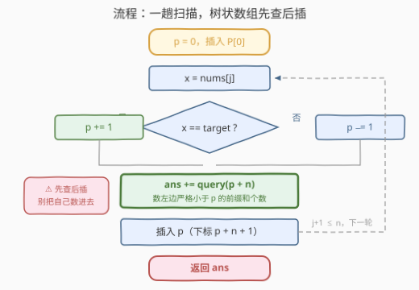

# LeetCode 统计主要元素子数组数目 I 题解

## 1. 题目概述

- **标题 / 题号**：统计主要元素子数组数目 I（#3737，medium）
- **链接**：https://leetcode.cn/problems/count-subarrays-with-majority-element-i/
- **难度**：中等
- **标签**：数组、前缀和、树状数组、归并排序、分治、计数

**题意**：给你一个整数数组 `nums` 和一个整数 `target`，返回数组 `nums` 中满足 `target` 是**主要元素**的**子数组**的数目。

一个子数组的**主要元素**是指该元素在该子数组中出现的次数**严格大于**其长度的**一半**（即 $2 \times \text{count} > \text{len}$）。

子数组是数组中的一段**连续且非空**的元素序列。

**示例 1**：

```text
输入：nums = [1,2,2,3], target = 2
输出：5
解释：以 target = 2 为主要元素的子数组有：
  - nums[1..1] = [2]
  - nums[2..2] = [2]
  - nums[1..2] = [2,2]
  - nums[0..2] = [1,2,2]
  - nums[1..3] = [2,2,3]
因此共有 5 个这样的子数组。
```

**示例 2**：

```text
输入：nums = [1,1,1,1], target = 1
输出：10
解释：所有 10 个子数组都以 1 为主要元素。
```

**示例 3**：

```text
输入：nums = [1,2,3], target = 4
输出：0
解释：target = 4 完全没有出现在 nums 中，不可能有任何以 4 为主要元素的子数组。
```

**约束**：

- $1 \le \text{nums.length} \le 1000$
- $1 \le \text{nums}[i] \le 10^9$
- $1 \le \text{target} \le 10^9$

> 💡 **审题关键**：① 「严格大于一半」是 $2 \times \text{count} > \text{len}$，等号不算——恰好占一半（如 `[2,3]` 里的 2）**不是**主要元素；② 判定对象只有一个值 `target`，不是「这个子数组的众数是谁」——与 169/229 那族「求多数元素」的题完全不同，本题是**对固定值做计数**；③ 数组中可以根本没有 `target`（示例 3），答案天然为 0，无需特判。

## 2. 解题思路

### 2.1 暴力思路：枚举左端点向右扩

$n \le 1000$，子数组总数至多 $\frac{n(n+1)}{2} \approx 5 \times 10^5$ 个。最自然的暴力：**枚举左端点 $l$，向右扩右端点 $r$，顺手维护窗口内 `target` 的出现次数 `cnt`**——每扩一步 `cnt` 至多变化 1，判定 $2 \cdot \text{cnt} > r - l + 1$ 即可，总计 $O(n^2) \approx 10^6$，对 I 版完全够用。

⚠️ 别写成一重循环套重扫的 $O(n^3)$：对每个子数组从头数一遍 `target` 出现次数，$5 \times 10^5$ 个子数组各付 $O(n)$，最坏 $10^9$ 级别，白丢一个数量级。「扩一格、计数增量更新」才是暴力的正确姿势。

暴力够过，但把 $n$ 抬到 $10^5$（II 版 3739 就是这么干的）它立刻爆炸——需要一个不依赖「窗口重数」的判定结构。

### 2.2 核心观察：±1 转化 + 前缀和 + 数顺序对

![核心观察：±1 转化后，子数组合法 ⟺ 前缀和 P[j] > P[i]](../images/p3737_majority_prefix_concept.svg)

**观察一：把「占多数」翻译成一条不等式。** 设子数组长度为 $\text{len}$、`target` 出现 $\text{cnt}$ 次，主要元素条件是

$$2 \cdot \text{cnt} > \text{len} \iff \text{cnt} - (\text{len} - \text{cnt}) > 0$$

而 $\text{cnt} - (\text{len} - \text{cnt})$ 恰好是「`target` 的个数减非 `target` 的个数」。于是令

$$B[i] = \begin{cases} +1, & \text{nums}[i] = \text{target} \\ -1, & \text{nums}[i] \ne \text{target} \end{cases}$$

**子数组合法 $\iff$ 其对应的 $B$ 区间和 $> 0$**。整数 $10^9$ 的值域、`target` 是否出现，全被这个 ±1 映射一次性抹平——只关心「是不是它」，不关心「是多少」。

**观察二：区间和问题 → 前缀和之差。** 取前缀和 $P[0] = 0$，$P[j] = B[0] + \cdots + B[j-1]$，则

$$\sum_{k=i}^{j-1} B[k] = P[j] - P[i] > 0 \iff P[i] < P[j] \quad (i < j)$$

**答案 = 序列 $P[0..n]$ 中满足 $i < j$ 且 $P[i] < P[j]$ 的对数**（「顺序对」）。一次转化，「数子数组」就变成了经典的「数对计数」。

**观察三：顺序对怎么数才快。** 从左往右扫 $j$，需要知道左边已出现的前缀和里**严格小于** $P[j]$ 的个数。$P$ 的值域是 $[-n, n]$（每步 ±1），共 $2n+1$ 种取值——值域窄且为整数，**树状数组**天然合身：把值 $v$ 平移到下标 $v + n + 1 \in [1, 2n+1]$，每次「查前缀 $[1, P[j]+n]$ 的个数，再插入 $P[j]$」，单次 $O(\log n)$，总体 $O(n \log n)$。

> ⚠️ 必须是**严格小于**：$P[i] = P[j]$ 时差为 0，对应「恰好一半」，不是主要元素。树状数组查询区间写成 $[1, P[j]+n]$（即值 $\le P[j]-1$）正是为了把等号挡在门外。

> 💡 一句话：本题 = 「`target` 记 +1、其余记 −1」+「前缀和严格递增对计数」。与 2488（中位数为 K）、1124（表现良好的最长时间段）是同一个 ±1 家族——**把占比条件翻译成区间和，再把区间和翻译成前缀和之差**。

### 2.3 算法流程图



**逻辑执行步骤**：

| 步骤 | 操作 | 说明 |
|------|------|------|
| ① 映射 | 遍历 `nums`，`target` 记 +1，其余记 −1 | 不必显式建数组 `B`，滚动维护 `p` 即可 |
| ② 种子 | 把 $P[0] = 0$ 插入树状数组 | 平移下标 $n+1$ |
| ③ 更新前缀和 | `p += (nums[j] == target) ? 1 : -1` | 得到 $P[j+1]$ |
| ④ 查询 | 累加树状数组中值 $\le p - 1$ 的个数 | 即左边严格小于 $p$ 的前缀和数目 |
| ⑤ 插入 | 把 `p` 插入树状数组 | 供后续 $j$ 查询 |
| ⑥ 循环收尾 | ③–⑤ 跑满 $n$ 轮，返回累加值 | 每对 $(i, j)$ 恰在其右端点处被数一次 |

> ⚠️ ④⑤ 顺序不能反：先查后插，否则会把 $P[j]$ 自己（以及与 $P[j]$ 相等的左值）数进去。这是此类「边扫边数」模板最常见的笔误。

### 2.4 示例演算

**示例 1：nums = [1,2,2,3]，target = 2（答案 5）**

| 下标 $i$ | 0 | 1 | 2 | 3 |
|----------|---|---|---|---|
| nums | 1 | 2 | 2 | 3 |
| $B$ | −1 | +1 | +1 | −1 |
| 前缀和 $P$ | $P[0]=0$ | $P[1]=-1$ | $P[2]=0$ | $P[3]=1$ | $P[4]=0$ |

在 $P = [0, -1, 0, 1, 0]$ 中数满足 $i < j$、$P[i] < P[j]$ 的顺序对：

| 顺序对 $(i,j)$ | $P[i] < P[j]$ | 对应子数组 | 合法？ |
|----------------|----------------|------------|--------|
| (1,2) | $-1 < 0$ ✓ | nums[1..1] = [2] | ✓ |
| (1,3) | $-1 < 1$ ✓ | nums[1..2] = [2,2] | ✓ |
| (1,4) | $-1 < 0$ ✓ | nums[1..3] = [2,2,3] | ✓ |
| (0,3) | $0 < 1$ ✓ | nums[0..2] = [1,2,2] | ✓ |
| (2,3) | $0 < 1$ ✓ | nums[2..2] = [2] | ✓ |

恰好 5 对，与示例逐一吻合（相等对如 $(0,2)$、$(0,4)$ 因差为 0 被严格不等号排除，正对应 `[1]`、`[1,2]` 这类不合法前缀）。

**示例 2：nums = [1,1,1,1]，target = 1**：$P = [0,1,2,3,4]$ 严格递增，$\binom{5}{2} = 10$ 对全数——所有子数组都合法。

**示例 3：nums = [1,2,3]，target = 4**：$B$ 全为 −1，$P = [0,-1,-2,-3]$ 严格递减，顺序对 0 个。

## 3. 参考代码

### C++

```cpp
class Solution {
public:
    int countMajoritySubarrays(vector<int>& nums, int target) {
        int n = nums.size();
        vector<int> tree(2 * n + 2);          // 值域 [-n, n] 平移到 [1, 2n+1]

        auto update = [&](int i) {            // 单点 +1
            for (; i <= 2 * n + 1; i += i & (-i)) tree[i] += 1;
        };
        auto query = [&](int i) {             // 前缀 [1, i] 计数
            int s = 0;
            for (; i > 0; i -= i & (-i)) s += tree[i];
            return s;
        };

        long long ans = 0, p = 0;             // p = 当前前缀和
        update(n + 1);                        // 插入 P[0] = 0
        for (int x : nums) {
            p += (x == target) ? 1 : -1;
            ans += query(p + n);              // 值 <= p-1 的个数 = 严格小于 p
            update(p + n + 1);                // 先查后插
        }
        return ans;
    }
};
```

> 💡 **写法要点**：
> - 平移规则：值 $v \to$ 下标 $v + n + 1$，保证最小值 $-n$ 落在下标 1（树状数组下标不能为 0）；
> - 「严格小于 $p$」= 值域 $[-n, p-1]$ = 下标 $[1, p+n]$，所以查询传 `p + n`；当 $p = -n$ 时 `p + n = 0`，`query(0)` 自然返回 0，无需特判；
> - 答案上界 $\frac{n(n+1)}{2} \approx 5 \times 10^5$，`int` 装得下，`long long` 更稳；
> - 先查后插，避免把自己数进去。

### Python

```python
class Solution:
    def countMajoritySubarrays(self, nums: List[int], target: int) -> int:
        n = len(nums)
        tree = [0] * (2 * n + 2)

        def update(i):
            while i <= 2 * n + 1:
                tree[i] += 1
                i += i & (-i)

        def query(i):
            s = 0
            while i > 0:
                s += tree[i]
                i -= i & (-i)
            return s

        ans = p = 0
        update(n + 1)                     # 插入 P[0] = 0
        for x in nums:
            p += 1 if x == target else -1
            ans += query(p + n)           # 严格小于 p 的前缀和个数
            update(p + n + 1)
        return ans
```

> 💡 **写法要点**：
> - 与 C++ 版逐行同构；`query(p + n)` 里 `p + n` 可为 0，`while i > 0` 直接短路；
> - $n \le 1000$ 时树状数组仅 2002 个桶，函数调用开销可忽略；Python 觉得树状数组啰嗦的话，第 5 节的 $O(n^2)$ 双循环版在本题数据规模下同样轻松通过。

## 4. 复杂度分析

| 维度 | 复杂度 | 说明 |
|------|--------|------|
| **时间** | $O(n \log n)$ | 一趟扫描，每步树状数组查询 + 插入各 $O(\log(2n+1))$ |
| **空间** | $O(n)$ | 树状数组 $2n+1$ 个计数桶（前缀和滚动维护，$O(1)$ 附加） |
| **对比暴力法** | $O(n^2) \to O(n \log n)$ | 暴力「枚举左端点扩右端点」对 I 版够用；$n = 10^5$ 时相差约 $\frac{n}{\log n} \approx 6000$ 倍，II 版必挂 |

## 5. 扩展：从 $O(n^2)$ 到数顺序对的多种武器

### 5.1 $O(n^2)$ 双循环版：I 版的「够用解」

官方 hint 直说「Use brute force」。枚举左端点、增量维护计数，$10^6$ 次整数运算，一行不多想：

```cpp
class Solution {
public:
    int countMajoritySubarrays(vector<int>& nums, int target) {
        int n = nums.size();
        long long ans = 0;
        for (int l = 0; l < n; ++l) {
            int cnt = 0;
            for (int r = l; r < n; ++r) {
                cnt += (nums[r] == target);
                ans += (2 * cnt > r - l + 1);
            }
        }
        return ans;
    }
};
```

它甚至不需要 ±1 转化——**但一旦 $n$ 放大（II 版 3739：$n \le 10^5$），这版就废了**，而 ±1 转化 + 数顺序对的结构原封不动升到 $O(n \log n)$ 继续服役。这正是 LeetCode 拆 I/II 双题的用意：I 验证思路，II 逼出复杂度。

### 5.2 数顺序对的三种实现选型

转化后的「统计 $i<j$ 且 $P[i]<P[j]$」是经典子问题，实现按需选：

| 方式 | 时间 | 空间 | 备注 |
|------|------|------|------|
| 双层循环 | $O(n^2)$ | $O(1)$ | $n \le 1000$ 时最省事，II 版不可用 |
| 树状数组（本文） | $O(n \log n)$ | $O(n)$ | 值域 $2n+1$ 为正整数时最顺手，可在线维护 |
| 归并排序 | $O(n \log n)$ | $O(n)$ | 题目标签里「归并/分治」的由来，值域无关 |

值域为负不友好（需要平移或离散化）时归并版更稳；要边插入边查询（在线）时树状数组更稳——本题两者皆可。

## 6. 面试要点

**Q1：「主要元素」条件怎么一步转成可计算的不等式？**

> $2 \cdot \text{cnt} > \text{len}$ 两边同乘后移项得 $\text{cnt} - (\text{len} - \text{cnt}) > 0$，即「`target` 个数 − 非 `target` 个数 $> 0$」。把 `target` 映射为 $+1$、其余 $-1$，条件就变成**区间和 $> 0$**——这是整题最关键的一步翻译。

**Q2：为什么数前缀和时要「严格小于」，等于不算？**

> 区间和 $= P[j] - P[i]$，要求严格 $> 0$ 即 $P[i] < P[j]$。$P[i] = P[j]$ 对应区间和为 0，即 `target` 恰好占一半——题面「严格大于一半」明确排除。示例 1 中 $(0,2)$ 这对相等前缀和正对应 `[1]` 这种不合法前缀。

**Q3：负数前缀和怎么进树状数组？**

> $P \in [-n, n]$，树状数组下标必须 $\ge 1$，统一平移：值 $v$ 放到下标 $v + n + 1 \in [1, 2n+1]$。查询「严格小于 $p$」即值域 $[-n, p-1]$，对应下标前缀 $[1, p+n]$，传 `query(p + n)` 即可。

**Q4：先查后插、先插后查有什么区别？**

> 先插后查会把 $P[j]$ 自己也算进「左边严格小于它的数」里——但 $p < p$ 恒假，恰好不误报自己；真正的坑在与后续元素比较时已把自己算作「左边元素」，逻辑上没错但极易把「严格小于」误写成「小于等于」造成等值误计。规范写法是**先查后插**：查询时集合里只有货真价实的左端点。

**Q5：本题与 2488「统计中位数为 K 的子数组数目」是什么关系？**

> 同属 ±1 转化家族：2488 把「大于 K 记 +1、小于 K 记 −1」，中位数条件转成区间和的奇偶分档讨论，用**哈希表**数前缀和；本题把「是 target 记 +1」转成区间和严格为正，用**树状数组**数顺序对。套路同源，后端数据结构不同——面试中能对比这两题的异同，就是「转化」这一步真正吃透的标志。

> 💡 **一句话总结**：3737 = `target` 记 +1、其余记 −1 + 前缀和严格递增对计数。三个要点带走：占比条件翻成区间和、区间和翻成前缀和之差、负值域平移后树状数组数顺序对。

## 同类练习题

| # | 题目 | 与本题的关联 |
|---|------|-------------|
| 3739 | [统计主要元素子数组数目 II](https://leetcode.cn/problems/count-subarrays-with-majority-element-ii/) | 姊妹题，$n$ 放大到 $10^5$，逼出本文的 $O(n \log n)$ 解法 |
| 2488 | [统计中位数为 K 的子数组数目](https://leetcode.cn/problems/count-subarrays-with-median-k/)（[题解](../2401-2500/2488_统计中位数为K的子数组.md)） | ±1 转化 + 前缀和哈希计数，本题最近的亲戚 |
| 1124 | [表现良好的最长时间段](https://leetcode.cn/problems/longest-well-performing-interval/)（[题解](../1101-1200/1124_表现良好的最长时间段.md)） | 同样「+1/−1 + 前缀和」，目标从「数对数」换成「最长区间」 |
| 315 | [计算右侧小于当前元素的个数](https://leetcode.cn/problems/count-of-smaller-numbers-after-self/)（[题解](../0301-0400/315_计算右侧小于当前元素的个数.md)） | 树状数组/归并数「逆序对」的模板题，本题数的是顺序对 |
| 169 | [多数元素](https://leetcode.cn/problems/majority-element/) | 「主要元素」概念的入门，摩尔投票求整个数组的多数元素，与本题的计数视角互补 |
