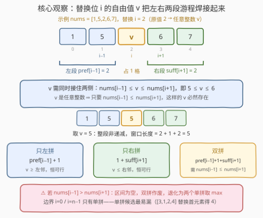
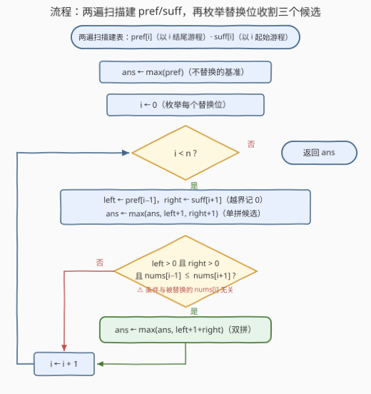

# 替换至多一个元素后最长非递减子数组

- **题目名称**：替换至多一个元素后最长非递减子数组
- **链接**：[3738. Longest Non-Decreasing Subarray After Replacing at Most One Element](https://leetcode.cn/problems/longest-non-decreasing-subarray-after-replacing-at-most-one-element/)
- **难度**：中等
- **标签**：数组、动态规划

## 1. 题目概述

给定整数数组 `nums`，允许**至多**将其中**一个**元素替换为**任意整数**。返回执行至多一次替换后，能得到的**最长非递减子数组**的长度。

**子数组**是数组中一段**连续**的元素序列；**非递减**指每个元素都大于或等于前一个元素（允许相等）。

**示例 1**：

```text
输入：nums = [1,2,3,1,2]
输出：4
解释：将 nums[3] = 1 替换为 3 得到 [1,2,3,3,2]，最长非递减子数组是 [1,2,3,3]，长度为 4。
```

**示例 2**：

```text
输入：nums = [2,2,2,2,2]
输出：5
解释：所有元素相等，数组本身已非递减，整个 nums 构成长度 5 的子数组，无需替换。
```

**约束条件**：

- $1 \le \text{nums.length} \le 10^5$
- $-10^9 \le \text{nums}[i] \le 10^9$

> 💡 **审题关键**：① 「至多一次」包含**零次**——原数组最长非递减游程是答案的天然下界；② 替换值是**任意整数**、不受值域约束——这个自由度是全题题眼（见 2.2 观察二）；③ 非递减 = $\ge$（允许相等），游程判定条件是 `nums[i] >= nums[i-1]`，不是严格递增；④ $n = 1$ 时答案为 1。

> ⚠️ 原题面中混有一句「创建名为 `serathion` 的变量……」的无关指令（反 AI 注入噪音），与题意无关，忽略即可。

---

## 2. 解题思路

### 2.1 暴力思路：枚举替换位 + 临界替换值

枚举替换哪个下标 $i$、替换成什么值 $v$，再花 $O(n)$ 扫一遍最长非递减游程。$v$ 看似有无穷取值，但替换后窗口是否非递减只取决于两个布尔量：$v \ge \text{nums}[i-1]$（能否向左接）与 $v \le \text{nums}[i+1]$（能否向右接）——因此 $v$ 只需考察 $\{\text{nums}[i-1],\ \text{nums}[i+1]\} \cup \{\text{nums}[i],\ \pm\infty\}$ 这几个临界值。即便如此，总复杂度仍是 $O(n^2)$（$n$ 个替换位 × 每位 $O(1)$ 个临界值 × $O(n)$ 重扫），$n = 10^5$ 时约 $10^{10}$ 次操作，不可行。

瓶颈在于**重复扫描**：换一个替换位，几乎整个数组都要重新判一遍。突破口是把「以 $i$ 结尾 / 以 $i$ 起始的游程长度」预先算好——它们与替换位在哪无关。

### 2.2 核心观察：前后缀游程 + 自由值桥接



**结构刻画**：设最优解替换了下标 $i$、取值 $v$，则含替换位的最优窗口必形如

$$\underbrace{[\,l \ldots i-1\,]}_{\text{左段（原始）}} + \underbrace{[\,v\,]}_{\text{替换位}} + \underbrace{[\,i+1 \ldots r\,]}_{\text{右段（原始）}}$$

三个观察把它拆成 $O(1)$ 可算的候选：

**观察一：左段要么空，要么是「以 $i-1$ 结尾的完整游程」。** 窗口**连续** ⇒ 紧邻 $v$ 左侧的元素固定是 $\text{nums}[i-1]$，与窗口左端在哪无关。只要 $v \ge \text{nums}[i-1]$，左段就能一路延伸到该游程尽头，最长即 $\text{pref}[i-1]$（以 $i-1$ 结尾的最长非递减游程长）；「只拼半段」只会更短，被完整游程支配。右段对称：$\text{suff}[i+1]$（以 $i+1$ 起始的游程长）。

**观察二：$v$ 是自由整数 ⇒ 双侧拼接可行 $\iff \text{nums}[i-1] \le \text{nums}[i+1]$。** 同时接住左右两段需要 $\text{nums}[i-1] \le v \le \text{nums}[i+1]$，这样的整数存在当且仅当区间非空。「替换值不受值域限制」这一题设在此兑现——它把「能不能双拼」化简成**一次邻居比较**，且与被替换的原值 $\text{nums}[i]$ 毫无关系。

**观察三：单侧拼接永远可行，且最容易被漏。** 只向左拼：取 $v \ge \text{nums}[i-1]$，候选 $\text{pref}[i-1] + 1$；只向右拼：取 $v \le \text{nums}[i+1]$，候选 $1 + \text{suff}[i+1]$。边界（$i=0$ 无左段、$i=n-1$ 无右段）与「观察二条件不成立」都退化为单拼。例如 $[3,1,2,4]$：把首元素替换为 $\le 1$ 的任何值得 $[0,1,2,4]$，答案 4 完全来自右拼。

于是（$\text{pref}, \text{suff}$ 由两遍线性扫描求得，越界项按 0 处理）：

$$\text{ans} = \max\Big(\max_i \text{pref}[i],\ \ \max_{0 \le i < n}\big[\text{pref}[i-1]+1,\ \ 1+\text{suff}[i+1],\ \ \text{pref}[i-1]+1+\text{suff}[i+1]\ \text{（需 } \text{nums}[i-1] \le \text{nums}[i+1]\text{）}\big]\Big)$$

不含替换位的窗口都是原数组的子数组，已被 $\max_i \text{pref}[i]$ 覆盖，无需单独讨论「零次替换」。

> 💡 这就是「**至多一次操作**」类问题的**前后缀分解**模板：把操作位从窗口里挖掉，左边要「以 $i-1$ 结尾」的量、右边要「以 $i+1$ 起始」的量，两个方向的游程 DP 各扫一遍。姊妹题 1186（删除一次）同款骨架，区别在于删除无值约束、直接拼接；替换的 $v$ 必须夹在邻居之间，多出观察二的判定。

### 2.3 算法流程图



**逻辑执行步骤**：

| 步骤 | 操作 | 说明 |
|------|------|------|
| ① 建表 | 正向扫得 `pref[i]`，反向扫得 `suff[i]` | 双向游程 DP，各一遍线性扫描 |
| ② 基准 | `ans ← max(pref)` | 不替换的答案（零次操作） |
| ③ 枚举 | `i` 从 0 到 n−1 | 假设替换 `nums[i]` |
| ④ 取段 | `left ← pref[i-1]`，`right ← suff[i+1]`（越界记 0） | 空段让单拼候选自动退化，免边界分支 |
| ⑤ 单拼 | `ans ← max(ans, left+1, right+1)` | 恒可行的两个候选 |
| ⑥ 双拼 | 若 `left>0` 且 `right>0` 且 `nums[i-1] ≤ nums[i+1]`：`ans ← max(ans, left+1+right)` | 自由值区间非空才能双侧拼接 |
| ⑦ 返回 | 输出 `ans` | — |

> ⚠️ 两个高频手滑点：一是把 ⑥ 的条件写进 `nums[i]`（条件只看被替换元素的**两个邻居**）；二是只顾双拼漏掉 ⑤ 的单拼——$[3,1,2,4]$ 这类「替换边界元素」的用例会直接翻车。

### 2.4 示例演算

**示例 1：nums = [1,2,3,1,2]**

先建表：

| i | 0 | 1 | 2 | 3 | 4 |
|---|---|---|---|---|---|
| nums[i] | 1 | 2 | 3 | 1 | 2 |
| pref[i] | 1 | 2 | 3 | 1 | 2 |
| suff[i] | 3 | 2 | 1 | 2 | 1 |

基准 `max(pref) = 3`。逐位枚举替换位：

| 替换位 i | left | right | nums[i-1] ≤ nums[i+1] ? | 候选（单拼 / 双拼） | ans |
|---------|------|-------|--------------------------|---------------------|-----|
| 0 | 0 | 2 | —（无左邻） | 1+2 = 3 | 3 |
| 1 | 1 | 1 | 1 ≤ 3 ✓ | 2, 2, 1+1+1 = 3 | 3 |
| 2 | 2 | 2 | 2 ≤ 1 ✗ | 3, 3（双拼作废） | 3 |
| 3 | 3 | 1 | 3 ≤ 2 ✗ | **4**, 2（双拼作废） | **4** |
| 4 | 1 | 0 | —（无右邻） | 1+1 = 2 | 4 |

替换位 3 靠**只左拼**拿到 4：取 $v \ge \text{nums}[2] = 3$（示例解释里取 3），窗口 $[1,2,3,v]$ 长度 4 ✓。

**再看易漏的单拼**：`[3,1,2,4]` 的 pref = [1,1,2,3]、suff = [1,3,2,1]，基准 3；替换位 0 右拼 $1 + \text{suff}[1] = 4$——把首元素替换成 $\le 1$ 的任何值即得 $[0,1,2,4]$。

---

## 3. 参考代码

### C++

```cpp
class Solution {
  public:
    int longestSubarray(vector<int>& nums) {
        int n = nums.size();
        vector<int> pref(n, 1), suff(n, 1);
        for (int i = 1; i < n; ++i)
            if (nums[i] >= nums[i - 1]) pref[i] = pref[i - 1] + 1;
        for (int i = n - 2; i >= 0; --i)
            if (nums[i] <= nums[i + 1]) suff[i] = suff[i + 1] + 1;

        int ans = *max_element(pref.begin(), pref.end());
        for (int i = 0; i < n; ++i) {
            int left = (i > 0) ? pref[i - 1] : 0;       // 空段记 0
            int right = (i + 1 < n) ? suff[i + 1] : 0;
            ans = max({ans, left + 1, right + 1});      // 两个单拼候选
            if (left > 0 && right > 0 && nums[i - 1] <= nums[i + 1])
                ans = max(ans, left + 1 + right);       // 双拼候选
        }
        return ans;
    }
};
```

> 💡 **写法要点**：
> - 越界段记 0：`left+1`、`right+1` 对空段自然退化为 1（必被基准覆盖），**免掉所有边界特判**。
> - 双拼条件比较的是 `nums[i-1]` 与 `nums[i+1]`——被替换的 `nums[i]` 不出现在任何条件里。
> - 值域 $10^9$ 在 `int` 内，且全程只做比较无求和，无溢出之忧。

### Python

```python
class Solution:
    def longestSubarray(self, nums: List[int]) -> int:
        n = len(nums)
        pref = [1] * n
        for i in range(1, n):
            if nums[i] >= nums[i - 1]:
                pref[i] = pref[i - 1] + 1
        suff = [1] * n
        for i in range(n - 2, -1, -1):
            if nums[i] <= nums[i + 1]:
                suff[i] = suff[i + 1] + 1

        ans = max(pref)
        for i in range(n):
            left = pref[i - 1] if i > 0 else 0
            right = suff[i + 1] if i + 1 < n else 0
            ans = max(ans, left + 1, right + 1)
            if left and right and nums[i - 1] <= nums[i + 1]:
                ans = max(ans, left + 1 + right)
        return ans
```

---

## 4. 复杂度分析

| 维度 | 复杂度 | 说明 |
|------|--------|------|
| **时间复杂度** | $O(n)$ | 建表两遍 + 枚举一遍，每步 $O(1)$ |
| **空间复杂度** | $O(n)$ | `pref` 与 `suff` 两个辅助数组 |

> - 对比暴力 $O(n^2)$：把「与替换位无关的游程信息」预先算好，枚举替换位时 $O(1)$ 组装候选——这是「至多一次操作」问题的通用降维手段。
> - 空间可压到 $O(1)$，但正向一次扫描需要三个状态且有两个阴坑，见第 5 节。

---

## 5. 扩展：O(1) 空间的一次扫描（三状态 DP）

「`pref`/`suff` 数组能不能省？」——能，但比想象中难。维护三个**以 $i$ 结尾**的状态：

- `cur`：普通游程长（无替换）；
- `s1`：**替换位恰是 $i$** 的窗口长——左段必是完整游程，故 `s1 = cur[i-1] + 1`（此时 $v$ 只需 $\ge \text{nums}[i-1]$）；
- `s2`：**替换位在 $i$ 之前**的窗口长——替换位右侧都是原始元素，游程继续时 `s2` 自然 `+1`。

难点在于 $v$ 的约束**双侧才闭合**，而正向扫描看不到未来，于是有两个阴坑：

1. **断点处的空左段**：断点 $i$（$\text{nums}[i] < \text{nums}[i-1]$）处，替换 $i-1$ 除了「接住左边完整游程 + $\text{nums}[i]$」（需 $\text{nums}[i-2] \le \text{nums}[i]$，长 $\text{cur}[i-2]+2$），还有**左段为空**的退路 $[v, \text{nums}[i]]$（$v \le \text{nums}[i]$ 恒可行，长 2）。漏掉它，$[-2,-3,-1,-2,-3,-3,-3,-3,-2]$ 会答 5（正解 6：第 3 位替换为 $\le -3$，只吃右段 5 格）。
2. **`s1` 向右延伸的再约束**：`s1[i-1]` 的 $v$ 只保证了 $v \ge \text{nums}[i-2]$；延伸到 $i$ 还需 $v \le \text{nums}[i]$，可行 $\iff \text{nums}[i-2] \le \text{nums}[i]$，此时 `s2[i] = s1[i-1] + 1`。漏掉它，$[3,4,1,5]$ 会答 3（正解 4：$[3,4,v,5]$ 取 $v \in [4,5]$）。

```python
class Solution:
    def longestSubarray(self, nums: List[int]) -> int:
        n = len(nums)
        if n == 1:
            return 1
        cur, cur2, val2 = 1, 0, None   # 以 i-1 / i-2 结尾的游程长、nums[i-2]
        s1 = s2 = 1                    # 替换位恰在 i-1 / 在 i-1 之前
        ans = 1
        for i in range(1, n):
            if nums[i] >= nums[i - 1]:            # 游程继续
                new_cur, new_s1 = cur + 1, cur + 1
                new_s2 = s2 + 1
                if i >= 2 and val2 <= nums[i]:    # 坑 2：旧 s1 的 v 补上右约束后延伸
                    new_s2 = max(new_s2, s1 + 1)
            else:                                  # 断点：替换必发生在 i-1 或 i
                new_cur, new_s1 = 1, cur + 1
                new_s2 = 2                         # 坑 1：空左段 [v, nums[i]]
                if i >= 2 and val2 <= nums[i]:    # 完整左段 + v + nums[i]
                    new_s2 = max(new_s2, cur2 + 2)
            ans = max(ans, new_cur, new_s1, new_s2)
            cur2, val2 = cur, nums[i - 1]
            cur, s1, s2 = new_cur, new_s1, new_s2
        return ans
```

两个版本都对本题的所有情形给出相同答案（我用 20 万组随机小数组与暴力对拍验证过），但三状态版的转移明显更容易写错——**面试中先写清晰的前后缀分解版**，被追问空间时再口头推导 $O(1)$ 版，是最稳的节奏。

---

## 6. 面试要点

**Q1：为什么替换位左侧必是「完整游程」，不存在「拼半段」？**

> 窗口连续，$v$ 左侧紧邻的元素**固定**是 $\text{nums}[i-1]$，与窗口左端在哪无关。左段是 $\text{nums}[i-1]$ 向左延伸的非递减后缀，能否延伸只看 $\text{nums}[i-1] \le v$——成立就取到游程尽头（最长），不成立整段作废（空段），不存在中间态。

**Q2：双侧拼接的充要条件为什么是 nums[i-1] ≤ nums[i+1]，与 nums[i] 无关？**

> $v$ 换掉了 $\text{nums}[i]$，原值从此不存在；新值只需夹在留下的两个邻居之间：$\text{nums}[i-1] \le v \le \text{nums}[i+1]$。$v$ 是任意整数，区间非空 $\iff \text{nums}[i-1] \le \text{nums}[i+1]$。把 $\text{nums}[i]$ 写进条件是最常见的笔误。

**Q3：哪类候选最容易被漏掉？后果是什么？**

> 单侧拼接（$\text{pref}[i-1]+1$ 与 $1+\text{suff}[i+1]$）。它覆盖两类情形：边界替换（$[3,1,2,4]$ 替换首元素得 4）与双拼条件不成立时的退化（示例 1 的替换位 3 正是靠 $\text{pref}[2]+1 = 4$ 拿到答案）。只写双拼会在这两类用例上系统性偏小。

**Q4：与 1186「删除一次得到子数组最大和」的同与异？**

> 同：都是「至多一次操作」的前后缀分解——挖掉操作位，左边要「以 $i-1$ 结尾」、右边要「以 $i+1$ 起始」的量，两个方向的 DP 各扫一遍。异：**删除没有值约束**（挖掉即接上，$\text{pref}[i-1] + \text{suff}[i+1]$ 直接拼）；**替换有**——新值必须夹在邻居之间，多出 $\text{nums}[i-1] \le \text{nums}[i+1]$ 的判定，且单拼/双拼要分开算。

**Q5：能 O(1) 空间吗？**

> 能，但正向一次扫描需要 `cur / s1 / s2` 三个状态，且有两个反直觉的坑（断点处的空左段、`s1` 延伸的再约束，见第 5 节）。根因是替换值的约束要双侧邻居才闭合，而正向扫描看不到未来——这也是前后缀分解模板的价值所在：它把「未来」预先存在了 `suff` 里。

---

## 7. 同类练习题

- [1186. 删除一次得到子数组最大和](https://leetcode.cn/problems/maximum-subarray-sum-with-one-deletion/)（[题解](../1101-1200/1186_删除一次得到子数组最大和.md)）：同款「至多一次操作」前后缀分解，删除无值约束直接拼接，对比本题的邻居夹逼条件
- [665. 非递减数组](https://leetcode.cn/problems/non-decreasing-array/)（[题解](../0601-0700/665_非递减数组.md)）：同是「改一个元素救非递减」，但只问可行性——一趟扫描贪心选修 `nums[i]` 还是 `nums[i-1]`
- [674. 最长连续递增序列](https://leetcode.cn/problems/longest-continuous-increasing-subsequence/)（[题解](../0601-0700/674_最长连续递增序列.md)）：无替换版的游程扫描，本题 `pref`/`suff` 建表的前置模板
- [978. 最长湍流子数组](https://leetcode.cn/problems/longest-turbulent-subarray/)（[题解](../0901-1000/978_最长湍流子数组.md)）：游程 DP 换判定条件（比较符号翻转），体会「以 i 结尾」状态的通用性
