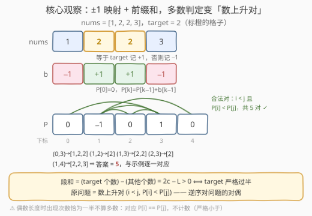
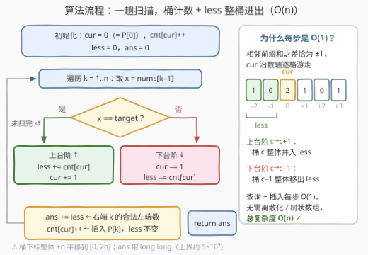

# 统计主要元素子数组数目 II

- **题目名称**：统计主要元素子数组数目 II
- **链接**：[3739. 统计主要元素子数组数目 II](https://leetcode.cn/problems/count-subarrays-with-majority-element-ii/)
- **难度**：困难
- **标签**：数组、哈希表、前缀和、树状数组、归并排序、分治

## 1. 题目概述

给你一个整数数组 `nums` 和一个整数 `target`。返回 `nums` 中满足 `target` 是**主要元素**的**子数组**数目。

一个子数组的**主要元素**是指该元素在该子数组中出现的次数**严格大于**其长度的**一半**。子数组是数组中一段连续且非空的元素序列。

**示例 1**：

```text
输入：nums = [1,2,2,3], target = 2
输出：5
解释：以 2 为主要元素的子数组：[2]、[2]、[2,2]、[1,2,2]、[2,2,3]。
```

**示例 2**：

```text
输入：nums = [1,1,1,1], target = 1
输出：10
解释：全部 10 个子数组都以 1 为主要元素。
```

**示例 3**：

```text
输入：nums = [1,2,3], target = 4
输出：0
解释：target 未在 nums 中出现，答案为 0。
```

**约束条件**：

- $1 \le \text{nums.length} \le 10^5$
- $1 \le \text{nums}[i] \le 10^9$
- $1 \le \text{target} \le 10^9$

> 💡 **审题关键**：① 「严格大于一半」对**偶数长度**卡得很死——长度 4、出现 2 次不算多数（$2 \times 2 = 4$ 不大于 4）；② $n$ 达 $10^5$，$O(n^2)$ 约 $10^{10}$ 次判定必超时（I 版 3737 的 $n \le 1000$ 才放行暴力）；③ 答案上界是子数组总数 $\frac{n(n+1)}{2} \approx 5 \times 10^9$，C++ 必须用 64 位整数。

---

## 2. 解题思路

### 2.1 暴力思路：枚举子数组 + 增量计数

固定左端 $i$，向右扩展右端 $j$，顺手维护 `target` 出现次数 $c$：每右移一格 $O(1)$ 更新，判定 $2c > j - i + 1$ 即累加答案。

正确性显然，总复杂度 $O(n^2)$。$n \le 1000$ 的 I 版（3737）可以过，但本题 $n = 10^5$ 需要至少 $O(n \log n)$——而且这题的结构红利足够大，可以直接压到 $O(n)$。

### 2.2 核心观察：±1 映射 + 前缀和，把「多数判定」变成「数上升对」



**第一步（值域压缩）**：判定只关心「是不是 target」，把数组映射为

$$b[i] = \begin{cases} +1, & \text{nums}[i] = \text{target} \\ -1, & \text{nums}[i] \ne \text{target} \end{cases}$$

**第二步（判定转化）**：设子数组长度为 $L$、`target` 出现 $c$ 次，则该段 $b$ 之和为 $c - (L - c) = 2c - L$。于是

> **`target` 是主要元素 $\iff 2c > L \iff$ 该段 $b$ 之和 $> 0$。**

偶数长度「恰好一半」的边界也被自动排除——$c = L/2$ 时段和恰为 $0$，不满足「$> 0$」。

**第三步（前缀和配对）**：令 $P_0 = 0$，$P_k = P_{k-1} + b[k-1]$，则「段和 $> 0$」即 $P_j - P_i > 0$。原问题彻底变成：

> **数满足 $i < j$ 且 $P_i < P_j$ 的下标对 $(i, j)$ 个数。**

这是逆序对问题的**对偶**（数「上升对」），树状数组 / 归并排序的经典战场——本题标签里的 Segment Tree / Merge Sort / Divide and Conquer 说的就是它。用示例 1 验证：$b = [-1,1,1,-1]$，$P = [0,-1,0,1,0]$，上升对恰有 $(0,3),(1,2),(1,3),(1,4),(2,3)$ 共 5 个，对应题面里那 5 个子数组，分毫不差。

### 2.3 算法流程：利用「相邻差 ±1」把数对计数压到 O(n)



通用做法是离散化 + 树状数组（$O(n \log n)$，见第 5 节）。但本题的前缀和有**额外结构**：

> **相邻前缀和之差恰为 $\pm 1$**（每步要么 $+1$ 要么 $-1$），$P$ 是一条**随机游走路径**，值域 $[-n, n]$。

于是不必离散化：直接开桶 `cnt[v]` 记录「已插入的前缀和中值为 $v$ 的个数」，再维护一个标量

$$\text{less} = \text{已插入的前缀和中，值严格小于当前 } cur \text{ 的个数}。$$

每读一个元素，`cur` 上/下一个台阶，`less` 只需在**台阶口整桶进出**：

- **上台阶** $cur \to cur + 1$：原本等于 `cur` 的那桶整体「升格」为小于新值 → `less += cnt[cur]`，再 `cur++`；
- **下台阶** $cur \to cur - 1$：先 `cur--`，此时等于新 `cur` 的那桶整体「降格」退出 → `less -= cnt[cur]`。

每步先做台阶转移，则 `ans += less` 正是「以当前下标 $k$ 为右端的合法左端数」（随后才 `cnt[cur]++` 插入 $P_k$；自身不小于自身，插入不影响 `less`）。全程每个元素 $O(1)$。

### 2.4 示例演算

**nums = [1,2,2,3], target = 2**（$b = [-1,+1,+1,-1]$）：

| $k$ | 元素 | 台阶 | $P_k$ | less 更新 | less | ans 累加 | cnt（值: 个数） |
|-----|------|------|-------|-----------|------|----------|-----------------|
| 0 | — | — | 0 | 初始化 | 0 | — | {0:1} |
| 1 | 1 | 下 | $-1$ | $0 - \text{cnt}(-1) = 0$ | 0 | 0 | {0:1, −1:1} |
| 2 | 2 | 上 | 0 | $0 + \text{cnt}(-1) = 1$ | 1 | 1 | {0:2, −1:1} |
| 3 | 2 | 上 | 1 | $1 + \text{cnt}(0) = 3$ | 3 | 4 | {0:2, −1:1, 1:1} |
| 4 | 3 | 下 | 0 | $3 - \text{cnt}(0) = 1$ | 1 | 5 | {0:3, −1:1, 1:1} |

$\text{ans} = \textbf{5}$ ✓。每步的 `less` 恰是「以 $k$ 为右端的合法子数组数」：$k=2$ 贡献 1 个（`[2]`）、$k=3$ 贡献 3 个（`[1,2,2]`、`[2]`、`[2,2]`）、$k=4$ 贡献 1 个（`[2,2,3]`），合计 5。

**示例 2**：nums = [1,1,1,1]：一路只上台阶，`less` 依次为 1、2、3、4，`ans` 依等差累加为 $1+3+6+10 = 10$ ✓。

**示例 3**：target 未出现，全程下台阶，`less` 恒为 0，`ans = 0` ✓（开头判存在性早退只是常数优化，不判也对）。

---

## 3. 参考代码

### C++

```cpp
class Solution {
public:
    long long countMajoritySubarrays(vector<int>& nums, int target) {
        int n = nums.size();
        int offset = n;                 // P ∈ [−n, n]，整体平移到 [0, 2n]
        vector<int> cnt(2 * n + 2, 0);
        int cur = 0;                    // P_0 = 0
        cnt[cur + offset]++;            // 插入 P_0
        long long less = 0;             // 已插入值中严格小于 cur 的个数
        long long ans = 0;
        for (int k = 1; k <= n; ++k) {
            if (nums[k - 1] == target) {        // 上台阶
                less += cnt[cur + offset];      // 桶 cur 整体并入 less
                ++cur;
            } else {                             // 下台阶
                --cur;
                less -= cnt[cur + offset];      // 桶 cur 整体移出 less
            }
            ans += less;                         // 以 k 为右端的合法左端数
            cnt[cur + offset]++;                 // 插入 P_k
        }
        return ans;
    }
};
```

> 💡 **写法要点**：
> - `ans` 必须 `long long`：上界 $\binom{n+1}{2} \approx 5 \times 10^9$ 超 `int`（`less` 单值不超过 $n$，但累计会超）；
> - 桶用 `int` 足够（单桶计数 $\le n+1$），尺寸 $2n + 2$ 留出两端余量；
> - **顺序不能乱**：先台阶转移、再 `ans += less`、最后插入——下台阶时若先插入自身，`less -= cnt[cur]` 会把自己也扣掉，差一错误。

### Python

```python
class Solution:
    def countMajoritySubarrays(self, nums: List[int], target: int) -> int:
        n = len(nums)
        offset = n
        cnt = [0] * (2 * n + 2)
        cur = 0
        cnt[cur + offset] = 1          # 插入 P_0
        less = ans = 0
        for x in nums:
            if x == target:            # 上台阶
                less += cnt[cur + offset]
                cur += 1
            else:                      # 下台阶
                cur -= 1
                less -= cnt[cur + offset]
            ans += less
            cnt[cur + offset] += 1
        return ans
```

---

## 4. 复杂度分析

| 维度 | 复杂度 | 说明 |
|------|--------|------|
| **时间** | $O(n)$ | 一趟扫描，每元素 $O(1)$（一次比较 + 桶更新）；通用树状数组写法 $O(n \log n)$，暴力 $O(n^2)$ |
| **空间** | $O(n)$ | 计数桶 $2n + 2$；±1 映射把值域压到 $[-n, n]$，无需离散化 |
| **对比暴力** | $O(n^2) \to O(n)$ | 两次关键跳跃：多数判定 → 前缀和数对（计数问题化归）；相邻差 $\pm 1$ → 桶 + 增量 `less`（把 log 也省掉） |

---

## 5. 扩展：通用武器——离散化 + 树状数组 / 归并排序

若把 ±1 映射换成任意权值（如「段和 $> k$」「段和在区间内」等一般条件），相邻前缀和之差不再是 $\pm 1$，桶 + `less` 平移维护失效，退回两条经典路：

1. **树状数组**：所有 $P$ 值离散化排序去重；从左到右，每次先查询「已插入值中严格小于 $P_k$ 的个数」（BIT 前缀和），再插入 $P_k$。$O(n \log n)$。
2. **归并排序**：分治数跨中点的合法对——左半有序后对右半每个值双指针/二分数小于它的左半元素个数，与 493 翻转对、327 区间和的个数同构。

BIT 版参考（本题可直接替换提交，作为对照验证）：

```cpp
class Solution {
public:
    long long countMajoritySubarrays(vector<int>& nums, int target) {
        int n = nums.size();
        vector<int> P(n + 1);
        for (int k = 1; k <= n; ++k)
            P[k] = P[k - 1] + (nums[k - 1] == target ? 1 : -1);
        vector<int> vals(P);
        sort(vals.begin(), vals.end());
        vals.erase(unique(vals.begin(), vals.end()), vals.end());
        int m = vals.size();
        vector<int> bit(m + 1, 0);
        auto add = [&](int i) { for (; i <= m; i += i & -i) ++bit[i]; };
        auto query = [&](int i) { int s = 0; for (; i > 0; i -= i & -i) s += bit[i]; return s; };
        long long ans = 0;
        for (int k = 0; k <= n; ++k) {
            int r = lower_bound(vals.begin(), vals.end(), P[k]) - vals.begin();
            ans += query(r);   // 下标 1..r 对应的值全部 < P[k]
            add(r + 1);
        }
        return ans;
    }
};
```

> 💡 `r` 是 $P_k$ 在离散化数组中的 0 基排名，`query(r)` 恰好数出已插入的、严格小于 $P_k$ 的值个数；线段树同样可做（单点加 + 区间求和），但常数大于 BIT，本题规模下没有必要。

---

## 6. 面试要点

**Q1：为什么「target 是主要元素」等价于「±1 映射后的段和 > 0」？**

> 设段长 $L$、`target` 出现 $c$ 次，则段和 $= c - (L - c) = 2c - L$。「严格大于一半」即 $2c > L$，与「段和 $> 0$」一字不差。偶数长度 $c = L/2$ 时段和为 $0$，恰好被严格不等号排除——**严格性被自动保住**。

**Q2：O(n) 做法里 `less` 的两条更新公式如何推导？**

> 上台阶 $cur \to cur+1$：「$< cur+1$」=「$< cur$」∪「$= cur$」，两集合不交，故 `less += cnt[cur]`；下台阶 $cur \to cur-1$：「$< cur-1$」=「$< cur$」−「$= cur-1$」，先 `--cur` 再 `less -= cnt[cur]`。两条都只碰**台阶口那一桶**，$O(1)$。

**Q3：为什么必须「先转移/累加、后插入」？**

> 每步的转移必须基于**尚未插入 $P_k$** 的桶状态：下台阶时 `less -= cnt[cur]`，若先插入了自身（$P_k$ 恰等于新 `cur`），会把自己也扣掉，`less` 少 1。上台阶虽不受影响，统一「先查后插」是这类数历史对问题的标准顺序，与 560/974 的哈希配对完全一致。

**Q4：什么时候必须退回树状数组 / 归并？**

> 判据只有一条：**`cur` 每步是否恰移动一格**。±1 映射保证相邻前缀和差 $\pm 1$，桶 + `less` 平移才成立；换成任意权值、区间和条件、带模同余等，「小于当前值的集合」每步变化不可整桶描述，必须离散化 + BIT 或归并，$O(n \log n)$。

**Q5：实现上有哪些坑？**

> ① `ans` 用 64 位（上界约 $5 \times 10^9$）；② 桶下标整体 `+n` 平移，尺寸 $2n + 2$，别忘了 $P_0 = 0$ 也要插入；③「严格大于/严格小于」不能写成 $\ge$——偶数长度恰一半是最大的 WA 来源；④ 判 `target` 存在性可早退，不判结果也对。

> 💡 **一句话总结**：多数判定 → ±1 映射段和 $> 0$ → 前缀和上升对计数；再吃下「相邻差 $\pm 1$」的结构红利，用桶 + `less` 整桶进出，把树状数组的 $\log$ 也省掉，一步到位 $O(n)$。

---

## 7. 同类练习题

- [3737. 统计主要元素子数组数目 I](https://leetcode.cn/problems/count-subarrays-with-majority-element-i/)：同一题面的 $n \le 1000$ 版本，$O(n^2)$ 增量计数可过，适合先写暴力再对照本题的 O(n) 优化
- [315. 计算右侧小于当前元素的个数](https://leetcode.cn/problems/count-of-smaller-numbers-after-self/)（[题解](../0301-0400/315_计算右侧小于当前元素的个数.md)）：「数历史中小于当前的值」的树状数组原型，即本题第 5 节的骨架
- [327. 区间和的个数](https://leetcode.cn/problems/count-of-range-sum/)（[题解](../0301-0400/327_区间和的个数.md)）：前缀和 + 条件配对计数的最经典困难题，离散化 / BIT / 归并三种写法都练得到
- [493. 翻转对](https://leetcode.cn/problems/reverse-pairs/)（[题解](../0401-0500/493_翻转对.md)）：归并排序数跨中点对的标准模板，与上升对计数互为镜像
- [930. 和相同的二元子数组](https://leetcode.cn/problems/binary-subarrays-with-sum/)（[题解](../0901-1000/930_和相同的二元子数组.md)）：同样把 0/1 数组转前缀和后数配对，不过是**等值**配对，哈希表一趟即可
