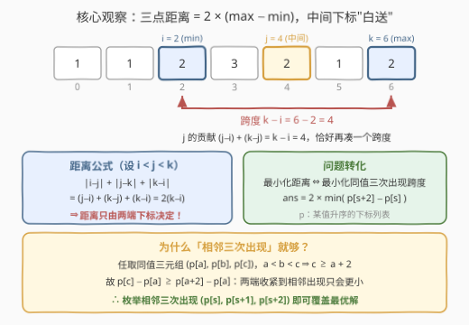
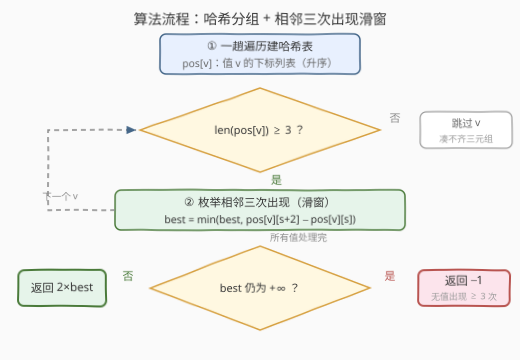

# LeetCode 三个相等元素之间的最小距离I 题解

## 1. 题目概述

- **标题 / 题号**：三个相等元素之间的最小距离I（#3740，easy）
- **链接**：https://leetcode.cn/problems/minimum-distance-between-three-equal-elements-i/
- **难度**：简单
- **标签**：数组、哈希表

**题意**：给你一个整数数组 `nums`。

如果满足 $\text{nums}[i] = \text{nums}[j] = \text{nums}[k]$，且 $(i, j, k)$ 是 3 个**不同**下标，那么三元组 $(i, j, k)$ 被称为**有效三元组**。

**有效三元组**的**距离**被定义为 $\lvert i - j \rvert + \lvert j - k \rvert + \lvert k - i \rvert$，其中 $\lvert x \rvert$ 表示 $x$ 的绝对值。

返回一个整数，表示**有效三元组**的**最小**可能距离。如果不存在**有效三元组**，返回 `-1`。

**示例 1**：

```text
输入：nums = [1,2,1,1,3]
输出：6
解释：最小距离对应的有效三元组是 (0, 2, 3)。nums[0] == nums[2] == nums[3] == 1，
距离为 |0−2| + |2−3| + |3−0| = 2 + 1 + 3 = 6。
```

**示例 2**：

```text
输入：nums = [1,1,2,3,2,1,2]
输出：8
解释：最小距离对应的有效三元组是 (2, 4, 6)。nums[2] == nums[4] == nums[6] == 2，
距离为 |2−4| + |4−6| + |6−2| = 2 + 2 + 4 = 8。
```

**示例 3**：

```text
输入：nums = [1]
输出：-1
解释：不存在有效三元组，因此答案为 -1。
```

**约束**：

- $1 \le n = \text{nums.length} \le 100$
- $1 \le \text{nums}[i] \le n$

> 💡 **审题关键**：① 三个下标只需**互不相同**且值相等，$(i,j,k)$ 的任意排列算出的距离相同——绝对值天然对称，不必纠结"顺序"；② $n \le 100$，官方 hint 直说 "Use bruteforce"，三重循环即可通过；③ 无解条件天然对应"没有任何值出现至少 3 次"。

## 2. 解题思路

### 2.1 暴力思路

按 $i < j < k$ 枚举全部 $\binom{n}{3}$ 个下标三元组，三者相等则用距离公式更新答案：

```python
class Solution:
    def minimumDistance(self, nums: List[int]) -> int:
        n, ans = len(nums), inf
        for i in range(n):
            for j in range(i + 1, n):
                for k in range(j + 1, n):
                    if nums[i] == nums[j] == nums[k]:
                        ans = min(ans, abs(i - j) + abs(j - k) + abs(k - i))
        return -1 if ans == inf else ans
```

$n = 100$ 时三元组至多 $\binom{100}{3} \approx 1.6 \times 10^5$ 个，轻松通过。但把 $n$ 放大到 II 版（[3741](https://leetcode.cn/problems/minimum-distance-between-three-equal-elements-ii/)）的 $10^5$，$O(n^3)$ 直接爆炸，值得提前想好线性做法。

### 2.2 核心观察：三点距离 = 2 × (max − min)



**排序引理**：设三个下标排序后为 $a \le b \le c$（最小、中间、最大），则

$$\lvert i-j \rvert + \lvert j-k \rvert + \lvert k-i \rvert = (b-a) + (c-b) + (c-a) = 2(c-a)$$

中间下标无论取谁，$(b-a) + (c-b)$ 恒好等于 $c - a$——**中间点"白送"一个跨度，距离只由两端下标决定**。示例 2 中三元组 $(2, 4, 6)$：跨度 $6 - 2 = 4$，距离 $2 \times 4 = 8$，中间的 $4$ 换成同值的其他下标也不会更小或更大。

于是问题转化为：**对每个值，找三次出现的最小下标跨度**。再用一步**收紧论证**（见上图底部）：任取同值三元组 $(p[a], p[b], p[c])$（$p$ 为该值升序的下标列表），由 $a < b < c$ 得 $c \ge a + 2$，故

$$p[c] - p[a] \ge p[a+2] - p[a]$$

即把两端收紧到**相邻三次出现** $(p[s], p[s+1], p[s+2])$ 只会更小——最小跨度必在其中取得（且中间的 $p[s+1]$ 天然夹在两端之间，合法性自动满足）。最终：

$$\text{ans} = 2 \times \min_{\text{值 } v} \min_{s} \big(p_v[s+2] - p_v[s]\big)$$

> ⚠️ **边界自动成立**：`best` 初始化为 $+\infty$；出现不足 3 次的值，滑窗循环体一次都不执行，天然跳过；结束时 `best` 仍为 $+\infty$ 即返回 `-1`——全程无需任何 if 特判。

### 2.3 算法流程



| 步骤 | 操作 | 说明 |
|------|------|------|
| ① 建表 | 一趟遍历，`pos[v].append(i)` | 值 → 下标列表，按下标顺序追加**天然升序** |
| ② 滑窗 | 对每个值 $v$，若 $\lvert \text{pos}[v] \rvert \ge 3$，枚举 $s$：$\text{best} = \min(\text{best},\ \text{pos}[v][s+2] - \text{pos}[v][s])$ | 相邻三次出现的跨度 |
| ③ 收尾 | `best` 仍为 $+\infty$ 返回 `-1`，否则返回 `2 * best` | 公式乘 2 别忘 |

### 2.4 示例演算

以示例 2 `nums = [1,1,2,3,2,1,2]` 为例：

| 值 $v$ | 出现位置 $\text{pos}[v]$ | 相邻三次出现 | 跨度 $p[s+2]-p[s]$ | 候选距离 |
|---|---|---|---|---|
| 1 | $[0, 1, 5]$ | $(0, 1, 5)$ | $5 - 0 = 5$ | $10$ |
| 2 | $[2, 4, 6]$ | $(2, 4, 6)$ | $6 - 2 = 4$ | $\mathbf{8}$ |
| 3 | $[3]$ | —（不足 3 次，跳过） | — | — |

最小跨度为 $4$，答案 $= 2 \times 4 = 8$，与示例一致。

## 3. 参考代码

### C++

```cpp
class Solution {
public:
    int minimumDistance(vector<int>& nums) {
        unordered_map<int, vector<int>> pos;
        for (int i = 0; i < (int)nums.size(); i++) {
            pos[nums[i]].push_back(i);          // 天然升序
        }
        int best = INT_MAX;
        for (auto& [v, ps] : pos) {
            for (int s = 0; s + 2 < (int)ps.size(); s++) {
                best = min(best, ps[s + 2] - ps[s]);   // 相邻三次出现的跨度
            }
        }
        return best == INT_MAX ? -1 : 2 * best;
    }
};
```

### Python

```python
class Solution:
    def minimumDistance(self, nums: List[int]) -> int:
        pos = defaultdict(list)
        for i, x in enumerate(nums):
            pos[x].append(i)                          # 天然升序
        best = inf
        for ps in pos.values():
            for a, _, c in zip(ps, ps[1:], ps[2:]):   # 相邻三次出现
                best = min(best, c - a)
        return -1 if best == inf else 2 * best
```

## 4. 复杂度分析

| 维度 | 复杂度 | 说明 |
|------|--------|------|
| **时间复杂度** | $O(n)$ | 一趟遍历建哈希表；所有值的滑窗总数 $\sum (\lvert \text{pos}[v] \rvert - 2) \le n$，每个下标至多进入常数个窗口 |
| **空间复杂度** | $O(n)$ | 哈希表存全部下标，$\sum \lvert \text{pos}[v] \rvert = n$ |

对比暴力 $O(n^3)$：$n = 100$ 时都绰绰有余，但 $n$ 放大到 $10^5$（II 版规模）时只有 $O(n)$ 能活。

## 5. 扩展：II 版与「相等元素距离」家族

**[3741. 三个相等元素之间的最小距离 II](https://leetcode.cn/problems/minimum-distance-between-three-equal-elements-ii/)** 是同系列加强版，题意相同、$n$ 放大到 $10^5$。其官方三条 hints 与本文观察逐条对应：距离公式化简为 $2 \times (\max - \min)$、按值分组且至少出现 3 次、在排序下标表中枚举**相邻三个**下标——本文的线性做法可直接迁移。

本题也属于"相等元素定位"家族，都靠**哈希表记录出现位置**吃饭：

- [219. 存在重复元素 II](https://leetcode.cn/problems/contains-duplicate-ii/)：两个相等元素的距离上界判定，一次遍历只记**最近一次**出现位置；
- [697. 数组的度](https://leetcode.cn/problems/degree-of-an-array/)：同值**首末出现**的最大跨度，与本题"相邻三次的最小跨度"互为镜像；
- [243. 最短单词距离](https://leetcode.cn/problems/shortest-word-distance/) / [245. 最短单词距离 III](https://leetcode.cn/problems/shortest-word-distance-iii/)：两个目标值间的最小跨度，一次遍历维护两值最近位置。

## 6. 面试要点

**Q1：为什么距离只由两端下标决定？**

> 设排序后 $a \le b \le c$，则 $\lvert i-j \rvert + \lvert j-k \rvert + \lvert k-i \rvert = (b-a) + (c-b) + (c-a) = 2(c-a)$。中间下标的贡献 $(b-a) + (c-b)$ 恰好抵消成 $c - a$，等于"白送"一个跨度。

**Q2：为什么枚举"相邻三次出现"就够？**

> 收紧论证：任取同值三元组 $(p[a], p[b], p[c])$，由 $a < b < c$ 得 $c \ge a + 2$，故 $p[c] - p[a] \ge p[a+2] - p[a]$——把两端收紧到相邻出现只会更小，最优解必在 $(p[s], p[s+1], p[s+2])$ 中取得。

**Q3：什么时候返回 -1？需要特判吗？**

> 没有任何值出现至少 3 次时。`best` 初始化为 $+\infty$，出现不足 3 次的值滑窗循环体不执行、天然跳过，结束时检查 `best` 是否仍为 $+\infty$ 即可——好的初始化应当能吞掉边界，全程无需 if 特判。

**Q4：暴力为什么能过？什么时候必须线性？**

> $n \le 100$ 时 $\binom{100}{3} \approx 1.6 \times 10^5$，官方 hint 也直说 "Use bruteforce"。但 II 版 $n$ 放大到 $10^5$ 后 $O(n^3)$ 完全不可行，必须哈希分组 + 相邻三次出现滑窗的 $O(n)$ 做法。

**Q5：为什么 pos[v] 不需要排序？**

> 建表时按下标 $0, 1, \dots, n-1$ 的顺序遍历并 `append`，每个值的下标列表天然升序——排序的成本在遍历顺序中已经"预付"了。

> 💡 **一句话总结**：3740 = **排序引理 + 相邻收紧**；三点距离恒为 $2 \times (\max - \min)$，最小化距离坍缩成找同值相邻三次出现的最小跨度，哈希分组一趟滑窗 $O(n)$ 收工。

## 同类练习题

| # | 题目 | 与本题的关联 |
|---|------|-------------|
| 3741 | [三个相等元素之间的最小距离 II](https://leetcode.cn/problems/minimum-distance-between-three-equal-elements-ii/) | 同系列加强版（$n \le 10^5$），hints 正是本文的公式化简 + 相邻三下标观察 |
| 219 | [存在重复元素 II](https://leetcode.cn/problems/contains-duplicate-ii/)（[站内题解](../0201-0300/219_存在重复元素II.md)） | 两个相等元素的最小距离判定，哈希记最近出现位置一趟扫描 |
| 697 | [数组的度](https://leetcode.cn/problems/degree-of-an-array/)（[站内题解](../0601-0700/697_数组的度.md)） | 同值首末最大跨度，与本题相邻三次最小跨度互为镜像 |
| 243 | [最短单词距离](https://leetcode.cn/problems/shortest-word-distance/)（[站内题解](../0201-0300/243_最短单词距离.md)） | 两目标值间的最小跨度，一次遍历维护两值最近位置 |
| 245 | [最短单词距离 III](https://leetcode.cn/problems/shortest-word-distance-iii/)（[站内题解](../0201-0300/245_最短单词距离III.md)） | 243 的变体，两单词可能相同，须避免自身配对 |
