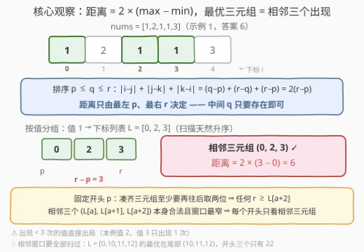
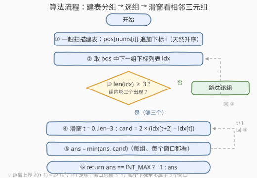

# 三个相等元素之间的最小距离 II

- **题目名称**：三个相等元素之间的最小距离 II
- **链接**：[3741. 三个相等元素之间的最小距离 II](https://leetcode.cn/problems/minimum-distance-between-three-equal-elements-ii/)
- **难度**：中等
- **标签**：数组、哈希表

## 1. 题目概述

给你一个整数数组 `nums`。

如果满足 `nums[i] == nums[j] == nums[k]`，且 `(i, j, k)` 是 3 个**不同**下标，那么三元组 `(i, j, k)` 被称为**有效三元组**。

**有效三元组**的**距离**定义为 `abs(i - j) + abs(j - k) + abs(k - i)`，其中 `abs(x)` 表示 `x` 的**绝对值**。

返回一个整数，表示**有效三元组**的**最小**可能距离。如果不存在有效三元组，返回 `-1`。

**示例 1**：

```text
输入：nums = [1,2,1,1,3]
输出：6
解释：最小距离对应的有效三元组是 (0, 2, 3)。
nums[0] == nums[2] == nums[3] == 1，距离为 abs(0-2) + abs(2-3) + abs(3-0) = 2 + 1 + 3 = 6。
```

**示例 2**：

```text
输入：nums = [1,1,2,3,2,1,2]
输出：8
解释：最小距离对应的有效三元组是 (2, 4, 6)。
nums[2] == nums[4] == nums[6] == 2，距离为 abs(2-4) + abs(4-6) + abs(6-2) = 2 + 2 + 4 = 8。
```

**示例 3**：

```text
输入：nums = [1]
输出：-1
解释：不存在有效三元组，因此答案为 -1。
```

**约束条件**：

- $1 \le n = \text{nums.length} \le 10^5$
- $1 \le \text{nums}[i] \le n$

> 💡 **审题关键**：① 三个下标必须**互不相同**——每个值至少要出现 3 次才有资格参赛；② 距离公式 `abs(i-j) + abs(j-k) + abs(k-i)` 看着吓人，实则能坍缩成「两倍端点跨度」；③ 这是 I 版（3740，$n \le 100$）的放大版，$n$ 升到 $10^5$ 后暴力必然超时，逼你找结构；④ $1 \le \text{nums}[i] \le n$ 的紧值域是个隐藏福利（见第 5 节）。

---

## 2. 解题思路

### 2.1 暴力思路：三重循环枚举三元组

最朴素的写法：三重循环枚举 $i < j < k$，值相等时用公式更新答案，总时间 $O(n^3)$。

I 版（3740）的 $n \le 100$ 下这是 $10^6$ 量级、轻松通过；但 II 版 $n \le 10^5$ 时是 $10^{15}$ 量级，完全不可行。稍微改进一档——按值分组后在**组内**做三重循环——最坏情形（整个数组同一个值）依然退化 $O(n^3)$。要过 II 版必须挖掘距离公式的结构，把「选三元组」坍缩成线性扫描。

### 2.2 核心观察：距离化简 + 按值分组 + 相邻三元组



**观察一：距离公式可以坍缩。** 把 $i, j, k$ 排序成 $p \le q \le r$，绝对值脱壳后两两抵消：

$$|i-j| + |j-k| + |k-i| = (q-p) + (r-q) + (r-p) = 2(r-p)$$

即**距离 = 2 × (最右下标 − 最左下标)**。中间下标 $q$ 对距离毫无贡献——它只要「存在」并落在 $p, r$ 之间即可。于是「最小化距离」等价于「最小化 $r - p$，且 $p, r$ 之间还塞得下一个同值下标」。

**观察二：按值分组，天然升序。** 一趟扫描把每个值的下标收进哈希表 $\text{pos}[v]$，由于 $i$ 从左到右递增，**每个列表天然升序**，免排序。出现次数不足 3 的值直接出局。

**观察三：最优三元组必是列表中「相邻三个」。** 固定开头 $p = L[a]$（$L$ 为某值的下标列表）：凑齐三元组至少还要再往后取两个元素，故任何以 $p$ 开头的合法三元组都满足 $r \ge L[a+2]$；而相邻三元组 $(L[a], L[a+1], L[a+2])$ 本身合法，且右端恰为 $L[a+2] \le r$。也就是说，**每个开头位置只看相邻三元组就取到了该开头的最优**，跳着取只会把窗口拉宽、白白浪费。全局答案即：

$$\text{ans} = \min_{\text{各值 } v}\ \min_{t}\ 2 \times \bigl(L_v[t+2] - L_v[t]\bigr)$$

> 💡 一句话：本题 = 「距离化简成 $2(r-p)$」+「哈希表按值收集下标」+「组内滑窗只看相邻三个」。三个观察各砍一刀，$O(n^3)$ 坍缩到 $O(n)$。

### 2.3 算法流程图



**逻辑执行步骤**：

| 步骤 | 操作 | 说明 |
|------|------|------|
| ① 建表 | `pos[nums[i]].push_back(i)` | 一趟扫描，每个列表天然升序 |
| ② 取组 | 遍历 `pos` 的每个下标列表 `idx` | 值本身不重要，只有下标列表重要 |
| ③ 判资格 | `len(idx) >= 3` ? | 否 → 跳过该组，回 ② |
| ④ 滑窗 | `t` 从 `0` 到 `len-3` | 候选 `cand = 2 * (idx[t+2] - idx[t])` |
| ⑤ 更新 | `ans = min(ans, cand)` | 每组、每个窗口都要看 |
| ⑥ 返回 | `ans == INT_MAX ? -1 : ans` | 一次都没更新 ⇒ 无有效三元组 |

> ⚠️ ④ 的窗口必须**扫完整个列表**，不能只看开头——最优可能出现在尾部（见 2.4 反例）。

### 2.4 示例演算

**示例 1：nums = [1,2,1,1,3]（答案 6）**，分组结果：值 1 → `[0,2,3]`，值 2 → `[1]`，值 3 → `[4]`。

| 组 | 下标列表 | 相邻三元组 | 候选距离 |
|----|----------|------------|----------|
| 值 1 | [0, 2, 3] | (0, 2, 3) | $2 \times (3-0) = \mathbf{6}$ |
| 值 2 | [1] | 不足 3 个，出局 | — |
| 值 3 | [4] | 不足 3 个，出局 | — |

$\text{ans} = 6$ ✓。

**示例 2：nums = [1,1,2,3,2,1,2]（答案 8）**，分组结果：值 1 → `[0,1,5]`，值 2 → `[2,4,6]`，值 3 → `[3]`。

| 组 | 下标列表 | 相邻三元组 | 候选距离 |
|----|----------|------------|----------|
| 值 1 | [0, 1, 5] | (0, 1, 5) | $2 \times 5 = 10$ |
| 值 2 | [2, 4, 6] | (2, 4, 6) | $2 \times 4 = \mathbf{8}$ |
| 值 3 | [3] | 出局 | — |

$\text{ans} = \min(10, 8) = 8$ ✓。

**反例（为什么窗口要扫全）**：某值的下标列表 $L = [0, 10, 11, 12]$，若只看开头三个 $(0,10,11)$ 得 22，而尾部的 $(10,11,12)$ 才是最优 4——相邻窗口必须逐个看过去，好在窗口总数不超过 $n$（每个下标至多属于 3 个窗口），全扫也不贵。

---

## 3. 参考代码

### C++

```cpp
class Solution {
public:
    int minimumDistance(vector<int>& nums) {
        unordered_map<int, vector<int>> pos;
        for (int i = 0; i < (int)nums.size(); ++i)
            pos[nums[i]].push_back(i);

        int ans = INT_MAX;
        for (auto& [_, idx] : pos)
            for (int t = 0; t + 2 < (int)idx.size(); ++t)
                ans = min(ans, 2 * (idx[t + 2] - idx[t]));

        return ans == INT_MAX ? -1 : ans;
    }
};
```

> 💡 **写法要点**：
> - 下标从左到右入表，**天然升序**，全程不碰 `sort`；
> - 距离上界 $2(n-1) < 2 \times 10^5$，`int` 足够，无需 `long long`；
> - `INT_MAX` 哨兵同时承担「无有效三元组」的判断——一次都没更新即返回 `-1`，与示例 3 对齐。

### Python

```python
class Solution:
    def minimumDistance(self, nums: List[int]) -> int:
        pos = {}
        for i, x in enumerate(nums):
            pos.setdefault(x, []).append(i)

        cands = [idx[t + 2] - idx[t]
                 for idx in pos.values()
                 for t in range(len(idx) - 2)]
        return 2 * min(cands) if cands else -1
```

> 💡 **写法要点**：
> - `setdefault` 一行完成「键不存在则建空表再追加」，不依赖额外导入；
> - `range(len(idx) - 2)` 在不足 3 个时自动为空，**无需显式判 `len >= 3`**；
> - 没有任何组凑齐三次出现时 `cands` 为空，`min` 前置判空返回 `-1`。

---

## 4. 复杂度分析

| 维度 | 复杂度 | 说明 |
|------|--------|------|
| **时间** | $O(n)$ | 建表一趟 $O(n)$；组内滑窗每个下标至多被 3 个窗口覆盖，全部窗口总代价仍为 $O(n)$ |
| **空间** | $O(n)$ | 哈希表存所有下标（各组列表长度之和恰为 $n$） |
| **对比暴力法** | $O(n^3) \to O(n)$ | 暴力三重循环在 $n = 10^5$ 时约 $10^{15}$ 次比较；三个观察各砍一刀——公式化简砍掉「中间下标的搜索」、分组砍掉「跨值组合」、相邻窗口砍掉「组内组合」 |

---

## 5. 扩展：定长桶与一趟「最近两次出现」

### 5.1 值域定长桶：免哈希常数

$1 \le \text{nums}[i] \le n$ 意味着值本身就是合法下标，可用 `vector<vector<int>> pos(n + 1)` 代替 `unordered_map`——免哈希、免冲突、缓存友好，其余逻辑一行不改：

```cpp
class Solution {
public:
    int minimumDistance(vector<int>& nums) {
        int n = nums.size();
        vector<vector<int>> pos(n + 1);
        for (int i = 0; i < n; ++i)
            pos[nums[i]].push_back(i);

        int ans = INT_MAX;
        for (auto& idx : pos)
            for (int t = 0; t + 2 < (int)idx.size(); ++t)
                ans = min(ans, 2 * (idx[t + 2] - idx[t]));

        return ans == INT_MAX ? -1 : ans;
    }
};
```

### 5.2 一趟滚动：只记「最近两次出现」

观察三还有另一种表述：**每个相邻三元组都以某个下标 $i$ 结尾**，它的前两位正是值 $\text{nums}[i]$ 在 $i$ 之前的最近两次出现。于是不必存完整列表，边扫边滚动维护「每个值最近两次出现的下标」，遇到第三次及以后的出现就地出候选：

```cpp
class Solution {
public:
    int minimumDistance(vector<int>& nums) {
        int n = nums.size();
        vector<array<int, 2>> last(n + 1, {-1, -1});
        int ans = INT_MAX;
        for (int i = 0; i < n; ++i) {
            auto& pr = last[nums[i]];
            if (pr[0] != -1)
                ans = min(ans, 2 * (i - pr[0]));
            pr[0] = pr[1], pr[1] = i;
        }
        return ans == INT_MAX ? -1 : ans;
    }
};
```

两种实现的取舍：

| 方式 | 扫描趟数 | 额外空间 | 特点 |
|------|----------|----------|------|
| 分组 + 组内滑窗 | 两趟（建表 + 遍历组） | $O(n)$ | 结构清晰，组信息可复用（如 2615 要算整组两两距离和） |
| 最近两次滚动 | 一趟 | $O(n)$（定长桶）或 $O(\text{不同值数})$（哈希只存两项） | 最省事，天然**在线**——数据流场景（只追加不回头）也成立 |

> 💡 滚动版本质是一个**大小恒为 3 的滑动窗口**贴着每个值的下标序列右移——「相邻三个」的结构把整道题变成了定宽滑窗题。

---

## 6. 面试要点

**Q1：距离公式为什么能化简成 $2(r-p)$？**

> 把 $i, j, k$ 排序为 $p \le q \le r$，绝对值全部脱壳：$|i-j|+|j-k|+|k-i| = (q-p)+(r-q)+(r-p) = 2(r-p)$。本质是「数轴上三个点两两距离之和 = 最远两点距离的两倍」——中间点在哪都不改变总和，这也解释了为什么中间下标只需「存在」。

**Q2：为什么最优三元组一定是同值下标列表中相邻的三个？给出证明。**

> 设最优三元组在某值的下标列表 $L$ 中对应位置 $a < b < c$。固定开头 $p = L[a]$：凑齐三个不同下标至少要取到 $L[a+2]$，故 $r = L[c] \ge L[a+2]$；而 $(L[a], L[a+1], L[a+2])$ 本身合法且距离 $2(L[a+2]-L[a]) \le 2(r-p)$。故对每个开头，相邻三元组不劣于任何跳着取的选择——全局最优必落在某个相邻三元组上。

**Q3：I 版（3740）和 II 版（3741）差在哪？**

> 题面一字不差，只差数据范围：I 版 $n \le 100$，$O(n^3)$ 暴力 $10^6$ 可过；II 版 $n \le 10^5$ 逼出 $O(n)$ 结构解。这是 LeetCode「I/II 对配」的常见套路——先给小数据版练手感，再用规模逼你找不变量。面试遇到 II 版，可以先口述暴力再主动升级，展示分析路径。

**Q4：为什么每组要扫完所有相邻窗口，只看每组前三个不行吗？**

> 不行。窗口宽度 $L[t+2]-L[t]$ **没有单调性**，最优窗口可能在列表任何位置：$L = [0, 10, 11, 12]$ 的最优是尾部的 $(10,11,12)$ 距离 4，开头三个只有 22。好在所有窗口总数 $\sum (\text{len}-2) \le n$（每个下标至多属于 3 个窗口），全扫也不贵。

**Q5：值域 $1 \le \text{nums}[i] \le n$ 有什么用？**

> 值可直接当数组下标：`vector<vector<int>>` 定长桶替代哈希表，省掉哈希常数（5.1）；进一步可用「最近两次出现」的一趟滚动版（5.2），空间与代码量都更小，还天然支持在线数据流。紧值域是题目送的优化入口，面试值得主动点出。

> 💡 **一句话总结**：3741 = 距离化简 $2(r-p)$ + 按值哈希分组 + 组内只看相邻三个下标。$O(n^3)$ 坍缩成 $O(n)$，三个观察各记一笔。

---

## 7. 同类练习题

- [3740. 三个相等元素之间的最小距离 I](https://leetcode.cn/problems/minimum-distance-between-three-equal-elements-i/)：同一题面的小数据版（$n \le 100$），三重循环可过，对照体会 II 版为何必须找结构
- [2615. 等值距离和](https://leetcode.cn/problems/sum-of-distances/)（[题解](../2601-2700/2615_等值距离和.md)）：同款「按值收集下标」套路，从「最小三元组」换成「整组两两距离和」，组内还需配前缀和
- [244. 最短单词距离 II](https://leetcode.cn/problems/shortest-word-distance-ii/)（[题解](../0201-0300/244_最短单词距离II.md)）：分组下标后看相邻对最小化——本题的「二元组」版本
- [1512. 好数对的数目](https://leetcode.cn/problems/number-of-good-pairs/)（[题解](../1501-1600/1512_好数对的数目.md)）：等值对计数，从「对」到「三元组」的维度升级
- [2206. 将数组划分成相等数对](https://leetcode.cn/problems/divide-array-into-equal-pairs/)：按值计数判出现次数奇偶，「等值分组」家族的纯计数侧
