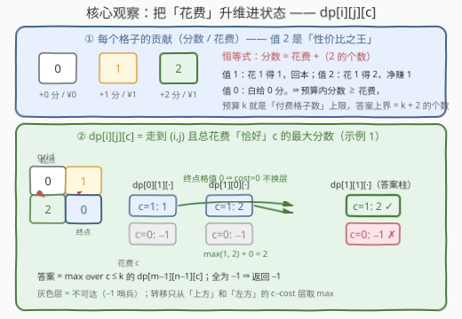
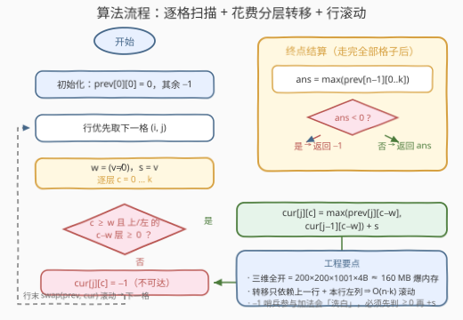

# 网格中得分最大的路径

- **题目名称**：网格中得分最大的路径
- **链接**：[3742. 网格中得分最大的路径](https://leetcode.cn/problems/maximum-path-score-in-a-grid/)
- **难度**：中等
- **标签**：数组、动态规划、矩阵

## 1. 题目概述

给你一个 $m \times n$ 的网格 `grid`，每个单元格的值为 **0、1 或 2**。另给一个整数 $k$。

你从**左上角** $(0, 0)$ 出发，目标是到达**右下角** $(m-1, n-1)$，只能向**右**或向**下**移动。每个单元格按其值对路径产生贡献：

| 格子值 | 分数增量 | 花费增量 |
|--------|----------|----------|
| 0 | $+0$ | $+0$ |
| 1 | $+1$ | $+1$ |
| 2 | $+2$ | $+1$ |

返回在**总花费不超过 $k$** 的前提下能获得的**最大分数**；若不存在满足约束的路径，返回 $-1$。

**示例 1**：

```text
输入：grid = [[0, 1], [2, 0]], k = 1
输出：2
解释：走 (0,0)→(1,0)→(1,1)：值依次 0, 2, 0，分数 0+2+0 = 2，花费 0+1+0 = 1 ≤ 1。
另一条路径 (0,0)→(0,1)→(1,1) 分数只有 1，故最大分数为 2。
```

**示例 2**：

```text
输入：grid = [[0, 1], [1, 2]], k = 1
输出：-1
解释：两条路径的花费都是 0+1+1 = 2 > 1，均超预算，返回 -1。
```

**约束条件**：

- $1 \le m, n \le 200$
- $0 \le k \le 10^3$
- $\text{grid}[0][0] = 0$（起点免费，保证花费从 0 起步）
- $0 \le \text{grid}[i][j] \le 2$

> 💡 **审题关键**：① 分数与花费是**双目标耦合**——分数大的路径可能花费超标，这正是不能只跑一遍 64 题「最小路径和」式 DP 的原因；② 花费上界天然很小：起点外每个格子至多花 1，故任何路径花费 $\le m+n-2 \le 398$，$k$ 再大也被这个上界钳住；③ 「不存在有效路径」只可能因**预算不足**——右/下移动总能走到终点，路径本身必存在。

---

## 2. 解题思路

### 2.1 暴力思路

从 $(0,0)$ 到 $(m-1,n-1)$ 共需 $m+n-2$ 步，每步右或下，路径总数 $\binom{m+n-2}{m-1}$——$m=n=200$ 时约 $\binom{398}{199} \approx 10^{118}$，天文数字。每条路径还要 $O(m+n)$ 统计分数与花费，彻底排除。

暴力不可行的根因是**路径之间存在大量重叠子结构**：两条路径只要经过同一个格子，后续的决策就完全同源——这正是 DP 的用武之地。但普通「走到 $(i,j)$ 的最大分数」会把花费信息丢掉，必须想办法把**预算约束带进状态**。

### 2.2 核心观察：把「花费」升维进状态



**观察一：贡献表里藏着一条恒等式。** 设一条路径上值为 2 的格子有 $a$ 个、值为 1 的有 $b$ 个，则

$$\text{分数} = 2a + b,\qquad \text{花费} = a + b$$

两式相减：**分数 = 花费 +（2 的个数）**。直觉解读：值 1 的格子「花 1 得 1」回本，值 2 的格子「花 1 得 2」净赚 1，值 0 的格子白给。由此得到两个推论：

- 预算内答案 $\ge$ 该路径花费（每个付费格子至少回本），答案上界为 $k + $ 路径上 2 的个数；
- 「性价比排序」是 2 ≻ 1 ≻ 0，但**不能据此贪心**——路径必须右/下连通地走，格子不是任你挑选的物品。

**观察二：花费必须进状态，且用「恰好」口径最干净。** 定义

$$dp[i][j][c] = \text{走到 } (i,j) \text{ 且总花费\textbf{恰好}为 } c \text{ 时的最大分数（不可达记 } -1\text{）}$$

转移时记 $w = [\,\text{grid}[i][j] \ne 0\,] \in \{0,1\}$（本格花费）、$s = \text{grid}[i][j]$（本格分数）：

$$dp[i][j][c] = \max\big(\,dp[i-1][j][c-w],\; dp[i][j-1][c-w]\,\big) + s$$

即从**上方**和**左方**格子的 $c - w$ 层汇聚过来——本格花费 $w$，所以来源层要**退 $w$ 层**。答案为 $\max_{0 \le c \le k} dp[m-1][n-1][c]$，全为 $-1$ 则返回 $-1$。

> 💡 **为什么「恰好」而不是「至多」？**「至多 $c$」的口径下 $dp$ 关于 $c$ 单调不减，转移后还要做一遍前缀 $\max$ 才能维持口径，容易漏做出错；「恰好 $c$」让每个状态语义纯净——同一格子的不同 $c$ 层互不掺水，转移只需严格从 $c-w$ 层取值（官方 hints 同款口径）。两者答案等价。

> ⚠️ **$-1$ 哨兵的「洗白」陷阱**：不可达态记 $-1$，但 $-1 + 2 = 1 \ge 0$ 会把无效态伪装成有效态！转移时必须**先判断来源 $\ge 0$ 再加 $s$**（或用 $-\infty$ 哨兵但防止下溢）。这是本题最典型的实现 bug。

**空间压缩**：$m \cdot n \cdot k \approx 200 \times 200 \times 1001$ 个 int ≈ **160 MB**，直接开三维数组会爆内存。观察转移只依赖**上一行同列**（$dp[i-1][j]$）与**本行左列**（$dp[i][j-1]$），按行滚动后只需两个 $n \times (k+1)$ 的矩阵，约 1.6 MB。

### 2.3 算法流程图



**逻辑执行步骤**：

| 步骤 | 操作 | 说明 |
|------|------|------|
| ① 初始化 | `prev[0][0] = 0`，其余 $-1$ | 起点值必为 0：花费 0、分数 0 |
| ② 遍历 | 行优先扫描每格 $(i,j)$ | 行优先保证左方、上方都已算好 |
| ③ 定参 | $w = [v \ne 0]$，$s = v$ | 本格的花费与分数 |
| ④ 分层转移 | 逐层 $c = 0..k$，从上/左的 $c-w$ 层取 $\max$ 后 $+s$ | 来源 $\ge 0$ 才可用；否则写 $-1$ |
| ⑤ 滚动 | 行末 `swap(prev, cur)` | 空间 $O(n \cdot k)$ |
| ⑥ 结算 | $\max_{c \le k} \text{prev}[n-1][c]$ | 全 $-1$ 返回 $-1$，否则返回最大值 |

### 2.4 示例演算

**示例 1**：`grid = [[0, 1], [2, 0]]`，$k = 1$。逐格填写 $dp$（每格两层 $c=0/1$）：

| 格子 | 值 | $(w, s)$ | $dp[\cdot][0]$ | $dp[\cdot][1]$ |
|------|----|----------|----------------|----------------|
| $(0,0)$ | 0 | $(0, 0)$ | $0$ | $-1$ |
| $(0,1)$ | 1 | $(1, 1)$ | $-1$ | $dp[0][0][0] + 1 = 1$ |
| $(1,0)$ | 2 | $(1, 2)$ | $-1$ | $dp[0][0][0] + 2 = 2$ |
| $(1,1)$ | 0 | $(0, 0)$ | $\max(-1, -1) = -1$ | $\max(1, 2) + 0 = 2$ |

答案 $= \max(dp[1][1][0], dp[1][1][1]) = \max(-1, 2) = \mathbf{2}$ ✓。注意 $(1,1)$ 值为 0，$w=0$ 转移**不换层**，从同层 $c=1$ 直接汇聚。

**示例 2**：`grid = [[0, 1], [1, 2]]`，$k = 1$：

| 格子 | 值 | $dp[\cdot][0]$ | $dp[\cdot][1]$ |
|------|----|----------------|----------------|
| $(0,0)$ | 0 | $0$ | $-1$ |
| $(0,1)$ | 1 | $-1$ | $1$ |
| $(1,0)$ | 1 | $-1$ | $1$ |
| $(1,1)$ | 2 | $-1$ | 需来源 $c-w=0$ 层，均为 $-1$ ⇒ $-1$ |

终点两层全 $-1$，返回 $\mathbf{-1}$ ✓——终点格值 2 要花 1，可前两个付费格已把 $k=1$ 的预算花光。

---

## 3. 参考代码

### C++

```cpp
class Solution {
public:
    int maxPathScore(vector<vector<int>>& grid, int k) {
        int m = grid.size(), n = grid[0].size();
        const int NEG = -1;
        // prev / cur：上一行 / 当前行，第二维为花费 c（0..k），-1 表示不可达
        vector<vector<int>> prev(n, vector<int>(k + 1, NEG)),
                            cur(n, vector<int>(k + 1, NEG));
        for (int i = 0; i < m; ++i) {
            for (int j = 0; j < n; ++j) {
                if (i == 0 && j == 0) {      // 起点值必为 0：花费 0、分数 0
                    cur[0][0] = 0;
                    continue;
                }
                int v = grid[i][j], w = v ? 1 : 0;
                for (int c = 0; c <= k; ++c) {
                    int best = NEG;
                    if (c >= w) {
                        if (i > 0 && prev[j][c - w] >= 0) best = max(best, prev[j][c - w]);
                        if (j > 0 && cur[j - 1][c - w] >= 0) best = max(best, cur[j - 1][c - w]);
                    }
                    cur[j][c] = best >= 0 ? best + v : NEG;   // 先判有效再加 s，防 -1 被洗白
                }
            }
            swap(prev, cur);   // 行滚动；cur 的旧值会被下轮无条件覆盖，无需清空
        }
        int ans = NEG;
        for (int c = 0; c <= k; ++c) ans = max(ans, prev[n - 1][c]);
        return ans;
    }
};
```

> 💡 **写法要点**：
> - 循环体对每个 $(j, c)$ **无条件赋值**，因此 `swap` 后 `cur` 残留的旧数据会在下一行被整体覆盖，省去显式清空；
> - `i > 0` / `j > 0` 两个条件天然挡住数组越界，首行只从左侧转移、首列只从上方转移，无需特判；
> - 分数上界 $2(m+n-1) \approx 800$，`int` 绰绰有余。

### Python

$O(mnk) = 4 \times 10^7$ 的三重循环在 CPython 下会超时，这里用 **numpy 把内层 $c$ 维整体向量化**：`np.maximum` 合并上/左两来源、`concatenate` 平移实现「退 $w$ 层」、`np.where` 掩码防止 $-1$ 被 $+s$ 洗白。

```python
import numpy as np

class Solution:
    def maxPathScore(self, grid: List[List[int]], k: int) -> int:
        m, n = len(grid), len(grid[0])
        NEG = -1                                  # 不可达哨兵；恰与题目要求的 -1 同值
        prev = np.full((n, k + 1), NEG, dtype=np.int64)
        prev[0, 0] = 0                            # 起点：花费 0、分数 0
        for i in range(m):
            cur = np.full((n, k + 1), NEG, dtype=np.int64)
            for j in range(n):
                if i == 0 and j == 0:
                    cur[0, 0] = 0
                    continue
                w = 1 if grid[i][j] else 0
                s = grid[i][j]
                src = prev[j].copy()              # 上方来源
                if j > 0:
                    np.maximum(src, cur[j - 1], out=src)   # 并入左侧来源
                if w:                             # 花费 1：整轴右移一层 = 来源退一层
                    src = np.concatenate([np.full(w, NEG, dtype=np.int64), src[:-w]])
                cur[j] = np.where(src >= 0, src + s, NEG)  # 掩码：无效态保持 -1
            prev = cur
        return int(prev[n - 1].max())             # 全 -1 时 max 恰为 -1，正是要返回的值
```

> 💡 **写法要点**：
> - $\max$ 与平移可交换（同为逐元素操作），所以「先合并两来源再整体平移 $w$」与「分别平移再合并」等价，少写一次 `concatenate`；
> - `np.where(src >= 0, src + s, NEG)` 是防洗白的关键——$-1$ 永远不会参与加法；
> - 终点行的 `.max()` 在全无效时输出 $-1$，与题目约定的返回值天然一致，免去二次判断。

---

## 4. 复杂度分析

| 维度 | 复杂度 | 说明 |
|------|--------|------|
| **时间** | $O(m \cdot n \cdot k)$ | $200 \times 200 \times 1001 \approx 4 \times 10^7$ 次常数转移，C++ 几十 ms；Python 需 numpy 向量化 |
| **空间** | $O(n \cdot k)$ | 按行滚动；朴素三维要 $O(mnk) \approx 160\,\text{MB}$ 直接爆内存 |
| **对比暴力** | $\binom{m+n-2}{m-1} \to O(mnk)$ | 路径重叠子结构被「位置 × 花费」的状态折叠 |

---

## 5. 扩展：口径变体与方向变体

**「至多 $c$」口径**：定义 $f[i][j][c]$ = 走到 $(i,j)$ 且花费**至多** $c$ 的最大分数，则转移后需对 $c$ 做前缀 $\max$ 维持单调性（$f[i][j][c] = \max(f[i][j][c],\, f[i][j][c-1])$），答案直接取 $f[m-1][n-1][k]$。两种口径等价，「恰好」版不易漏做前缀 max，更推荐。

**预算钳制**：任何路径花费 $\le m+n-2$（起点外每格至多花 1），所以可先做 $k \gets \min(k,\, m+n-2)$，当 $k$ 巨大时直接把约束退化掉——此时问题坍缩为无约束的网格最大分数路径（64 题「最小路径和」的 max 镜像版），$O(mn)$ 一趟即解。

**方向变体**：若允许向四个方向移动，$(i,j)$ 不再有拓扑序，需要把 $(i, j, c)$ 建成分层图跑 **Dijkstra**（边权 0/1 时用 0-1 BFS 更佳）；若格子值域扩大到 $[0, V]$，状态第三维换成分段点数或改用「分数-花费」斜率优化的双关键字比较，属于另一族题了。

---

## 6. 面试要点

**Q1：为什么必须把花费升进状态？只记「走到 $(i,j)$ 的最大分数」为什么错？**

> 分数与花费双目标耦合：到某格分数最高的路径可能花费已超 $k$，后续无论怎么走都注定无效；而一条分数暂时落后、花费更省的路径反而可能笑到最后。只记单值会把低花费路径的信息丢掉，反例一抓一把——如示例 2 的前缀里「多花预算的分数」与「省预算的分数」必须分桶保存。这正是背包类问题「容量必须进状态」的网格版。

**Q2：「恰好 $c$」与「至多 $c$」两种口径怎么选？**

> 都正确。「恰好」口径状态纯净、转移直接从 $c-w$ 层取值；「至多」口径对 $c$ 单调不减，转移后要做前缀 $\max$ 维持口径，漏做就错。面试推荐「恰好」——语义清晰、不易埋 bug，且答案对 $c$ 取 $\max$ 的收尾两种口径通用。

**Q3：$-1$ 哨兵有哪些坑？**

> 最大的坑是「洗白」：$-1 + 2 = 1$，无效态加个分数就伪装成有效态。必须先判来源 $\ge 0$ 再加 $s$（C++ 的三目、Python numpy 的 `where` 掩码都是干这个的）。另一个坑是边界语义：$-1$ 表示「不可达」，而 $0$ 是合法分数（全 0 路径），两者绝不能混——这也是终点结算「全 $-1$ 才返回 $-1$」的判断依据。

**Q4：三维数组 160 MB，怎么压？**

> 转移只读**上一行同列** `prev[j][c-w]` 与**本行左列** `cur[j-1][c-w]`，按行滚动成两个 $n \times (k+1)$ 矩阵即可，$\approx 1.6$ MB。注意「先合并来源再平移」与「先平移再合并」等价（逐元素 $\max$ 与平移可交换），numpy 版据此少一次平移。

**Q5：什么时候返回 $-1$？$k$ 很大时会怎样？**

> 右/下移动总能到达终点，路径必然存在，$-1$ 只可能因为**所有路径花费都超过 $k$**（如示例 2）。又因起点免费、其余每格至多花 1，任何路径花费 $\le m+n-2$，故 $k \ge m+n-2$ 时约束必然失效，退化为无约束最大分数路径，可以 $k \gets \min(k, m+n-2)$ 提前钳制（对正确性无影响，对常数有利）。

> 💡 **一句话总结**：3742 = 网格路径 DP + 背包式「容量进状态」——$dp[i][j][c]$ 恰好花费 $c$ 的最大分数，转移从上/左的 $c - w$ 层汇聚；三个工程要点带走：$-1$ 哨兵先判再加防洗白、160 MB 三维数组按行滚动、恒等式「分数 = 花费 + 2 的个数」给出答案上界。

---

## 7. 同类练习题

- [64. 最小路径和](https://leetcode.cn/problems/minimum-path-sum/)（[题解](../0001-0100/64_最小路径和.md)）：无约束版网格路径 DP，本题去掉花费维的退化形态，先写它再升维最顺
- [2435. 矩阵中和能被 K 整除的路径](https://leetcode.cn/problems/paths-in-matrix-whose-sum-is-divisible-by-k/)（[题解](../2401-2500/2435_矩阵中和能被K整除的路径.md)）：同款「第三维挂在和/余数上」的三维路径 DP，状态设计与本题完全同构
- [1594. 矩阵的最大非负积](https://leetcode.cn/problems/maximum-non-negative-product-in-a-matrix/)（[题解](../1501-1600/1594_矩阵的最大非负积.md)）：路径最值的另一变体，负数存在时须同时维护 max/min 两套状态
- [2304. 网格中的最小路径代价](https://leetcode.cn/problems/minimum-path-cost-in-a-grid/)：每格代价入路径、跨行跳列的转移泛化，体会「代价怎么进状态」的不同挂法
- [2510. 检查网格中是否存在路径](https://leetcode.cn/problems/check-if-there-is-a-path-with-equal-number-of-0s-and-1s/)：路径上 0/1 计数入状态的存在性判定，是本题 DP 的「可行性版」孪生题
