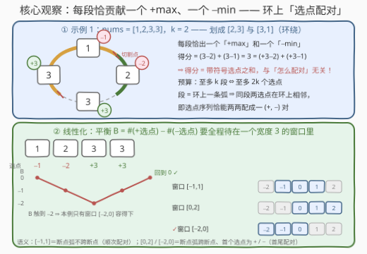
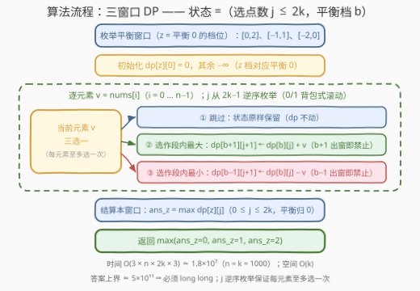

# 循环划分的最大得分

- **题目名称**：循环划分的最大得分
- **链接**：[3743. 循环划分的最大得分](https://leetcode.cn/problems/maximize-cyclic-partition-score/)
- **难度**：困难
- **标签**：数组、动态规划

## 1. 题目概述

给你一个**循环数组** `nums` 和一个整数 $k$。将 `nums` **划分**为**最多 $k$ 个子数组**。由于 `nums` 是循环数组，这些子数组可以从数组末尾环绕回起点。子数组的**范围**定义为其**最大值**与**最小值**的差值。划分的**得分**是所有子数组范围的总和。返回所有循环划分方案中可能获得的**最大得分**。

**示例 1**：

```text
输入：nums = [1,2,3,3], k = 2
输出：3
解释：将 nums 划分为 [2, 3] 和 [3, 1]（环绕）。
[2, 3] 的范围是 3 − 2 = 1；[3, 1] 的范围是 3 − 1 = 2。总得分 1 + 2 = 3。
```

**示例 2**：

```text
输入：nums = [1,2,3,3], k = 1
输出：2
解释：只能不切分，[1, 2, 3, 3] 的范围是 3 − 1 = 2。
```

**示例 3**：

```text
输入：nums = [1,2,3,3], k = 4
输出：3
解释：与示例 1 相同——可以划分成少于 k 个子数组。
```

**约束条件**：

- $1 \le \text{nums.length} \le 1000$
- $1 \le \text{nums}[i] \le 10^9$
- $1 \le k \le \text{nums.length}$

> 💡 **审题关键**：① **循环数组**——划分可以从末尾环绕回开头，等于在**环**上切几刀；② 「**最多** $k$ 个」而非「恰好 $k$ 个」——切得少甚至不切都合法；③ 每段得分 $\max - \min \ge 0$，故答案 $\ge 0$；④ $n \le 1000$ 暗示 $O(n^2)$ 量级可过，而朴素枚举切法是 $2^n$ 级——必须挖掘结构。

---

## 2. 解题思路

### 2.1 暴力思路

环上有 $n$ 个「间隙」，每个间隙切或不切；切 $c$ 刀（$1 \le c \le k$）得到 $c$ 段。方案数为 $\sum_{c=1}^{k}\binom{n}{c} \le 2^n$，$n = 1000$ 时是天文数字，且每个方案还要 $O(n)$ 统计各段的 $\max - \min$，彻底排除。

暴力不可行的根因是：**「怎么切」的决策之间强耦合**，直接枚举切点组合爆炸。出路是换元——把「划分的得分」改写成另一种只关乎「选哪些元素」的等价形式，让划分结构退居幕后。

### 2.2 核心观察：把「划分得分」改写成「带符号选点之和」



**观察一：每段恰贡献一个 $+\max$ 和一个 $-\min$。**

$$\text{得分} = \sum_{\text{段 } P} \big(\max(P) - \min(P)\big) = \sum_{\text{段}} (+\text{选点}) - \sum_{\text{段}} (-\text{选点})$$

于是「划分」被解耦成「**选点**」：每段挑一个元素记 $+$（它的 $\max$）、一个记 $-$（它的 $\min$），得分就是**带符号选点之和**。预算「至多 $k$ 段」$\Leftrightarrow$ 「**至多 $2k$ 个选点**」。两个方向合璧得到严格等价：

- 任何划分的得分 = 其**正典选点**（$+$ 记在每段 $\arg\max$、$-$ 记在 $\arg\min$）之和；
- 反过来，任何满足「配对结构」的选点方案，按配对切弧成段后，每段 $\max \ge$ 该段 $+$ 选点的值、$\min \le$ 该段 $-$ 选点的值，故**实际得分 $\ge$ 选点之和**。

因此 **最大得分 = 满足配对结构的带符号选点之和的最大值**。（全等段、单元素段贡献为 0，其选点可直接丢弃——这正是「至多 $k$ 段」比「恰好 $k$ 段」宽松的地方。）

**观察二：配对结构 ⟺ 环上「相邻配对」。** 段是环上一条弧，同段的两个选点之间不会夹着别段的选点——把选点沿环排成 $q_1, q_2, \dots, q_{2m}$，可行结构就是**相邻两两配对、每对一 $+$ 一 $-$**。而环上只用相邻边的完美匹配只有两种形态：**顺次配对** $(q_1,q_2),(q_3,q_4),\dots$ 与**错位配对** $(q_2,q_3),\dots,(q_{2m},q_1)$。

**观察三：线性化 + 平衡窗口。** 固定在下标 0 前断开成线性，跟踪**平衡** $B = \#(+\text{选点}) - \#(-\text{选点})$ 的前缀值：

| 断点所在弧的形态 | 配对方式 | $B$ 的活动范围 |
|------|------|------|
| 不跨断点 | 顺次配对 $(q_1,q_2),(q_3,q_4),\dots$ | $[-1, 1]$，每对内 $B$ 先 $\pm 1$ 后归零 |
| 跨断点、首个选点为 $+$ | 首尾配对 $(q_{2m},q_1)$ + 中间顺次 | $[s_1-1,\ s_1+1] = [0, 2]$ |
| 跨断点、首个选点为 $-$ | 首尾配对 + 中间顺次 | $[s_1-1,\ s_1+1] = [-2, 0]$ |

反向也成立（归纳）：以 $[0,2]$ 为例，$B_1 = 1$；若某个错位对 $(q_{2t}, q_{2t+1})$ 同号，$B$ 一步 $\pm 2$ 必冲出窗口，故每对异号，且 $B_{2m-1} = 1 \Rightarrow$ 末选点为 $-$，首尾对也异号。于是：

$$\textbf{可行选点方案} \iff B \text{ 起于 } 0 \text{、终于 } 0\text{，且全程待在 } [0,2],\ [-1,1],\ [-2,0] \text{ 三个窗口之一}$$

> ⚠️ **三个窗口缺一不可**（官方 hints 只点了 $[0,2]$，单独用它会在一半实例上翻车）：
>
> | 实例 | 最优选点 | $B$ 路径 | 只有哪个窗口容得下 |
> |------|----------|----------|----------|
> | $[1,2,3,3],\ k=2$（示例 1） | $-1,-2,+3,+3$ | $0,-1,-2,-1,0$ | $[-2,0]$（得 3，另两个窗口只得 0 / 2） |
> | $[5,1,1,5],\ k=2$ | $+5,-1,-1,+5$ | $0,1,0,-1,0$ | $[-1,1]$（得 8，另两个只得 4） |
> | $[9,8,1,2],\ k=2$ | $+9,+8,-1,-2$ | $0,1,2,1,0$ | $[0,2]$（得 14，另两个只得 8 / 1） |
>
> 三个实例把三个窗口各「点」了一遍——只跑单个窗口的 DP 会系统性漏解。

### 2.3 算法流程图



**逻辑执行步骤**：

| 步骤 | 操作 | 说明 |
|------|------|------|
| ① 枚举窗口 | $z \in \{0,1,2\}$ 对应窗口 $[0,2]$ / $[-1,1]$ / $[-2,0]$ | $z$ = 平衡 0 所在档位，各跑一遍 DP |
| ② 初始化 | $dp[z][0] = 0$，其余 $-\infty$ | $dp[b][j]$：平衡处于第 $b$ 档、已选 $j$ 个点 |
| ③ 逐元素 | 对每个 $v = \text{nums}[i]$，$j$ 从 $2k-1$ **逆序** | 逆序滚动保证每元素至多选一次（0/1 背包） |
| ④ 三选一 | 跳过；$+v \to (b{+}1, j{+}1)$；$-v \to (b{-}1, j{+}1)$ | 档位越界 = 冲出窗口，直接禁止 |
| ⑤ 结算 | $ans_z = \max_{0 \le j \le 2k} dp[z][j]$ | 平衡回到 0 $\Leftrightarrow$ $+/- $ 数量相等、配对完整 |
| ⑥ 汇总 | 返回 $\max(ans_0, ans_1, ans_2)$ | 三窗口取 max；不选点时 $dp[z][0]=0$ 兜底 |

### 2.4 示例演算

以示例 1 `nums = [1,2,3,3], k = 2`（$2k = 4$）走一遍选点视角：最优选点是 $-1$（下标 0）、$-2$（下标 1）、$+3$（下标 2）、$+3$（下标 3），和为 $-1-2+3+3 = 3$。$B$ 的路径 $0 \to -1 \to -2 \to -1 \to 0$ 触到 $-2$，只有窗口 $[-2,0]$ 容得下；对应**错位配对**：$(-2, +3)$ 配成段 $[2,3]$（范围 $3-2=1$），$(+3, -1)$ 跨断点配成段 $[3,1]$（环绕，范围 $3-1=2$）——与官方解释完全吻合，总得分 $3$ ✓。

各窗口单独跑 DP 的结果对比（体现三窗口必要性）：

| 实例 | $[0,2]$ | $[-1,1]$ | $[-2,0]$ | 真实答案 |
|------|---------|----------|----------|----------|
| $[1,2,3,3],\ k=2$ | $0$ | $2$ | $\mathbf{3}$ | $3$ |
| $[1,2,3,3],\ k=1$ | $0$ | $\mathbf{2}$ | $\mathbf{2}$ | $2$ |
| $[5,1,1,5],\ k=2$ | $4$ | $\mathbf{8}$ | $4$ | $8$ |
| $[9,8,1,2],\ k=2$ | $\mathbf{14}$ | $8$ | $1$ | $14$ |
| $[3,1,7,4,2,8],\ k=2$ | $7$ | $\mathbf{12}$ | $\mathbf{12}$ | $12$ |

---

## 3. 参考代码

### C++

```cpp
class Solution {
public:
    long long maximumScore(vector<int>& nums, int k) {
        int n = nums.size(), K2 = 2 * k;
        const long long NEG = LLONG_MIN / 4;
        long long ans = 0;
        // z = 平衡 0 所在档位：0 → 窗口 [0,2]，1 → [−1,1]，2 → [−2,0]
        for (int z = 0; z <= 2; ++z) {
            // dp[b][j]：平衡处于窗口第 b 档（真实平衡 = b − z，第 z 档即平衡 0）、已选 j 个点的最大和
            vector dp(3, vector<long long>(K2 + 1, NEG));
            dp[z][0] = 0;
            for (int i = 0; i < n; ++i) {
                long long v = nums[i];
                for (int j = K2 - 1; j >= 0; --j) {      // 逆序：每个元素至多选一次
                    for (int b = 0; b < 3; ++b) {
                        long long cur = dp[b][j];
                        if (cur == NEG) continue;
                        if (b < 2) dp[b + 1][j + 1] = max(dp[b + 1][j + 1], cur + v);  // 选作段内最大
                        if (b > 0) dp[b - 1][j + 1] = max(dp[b - 1][j + 1], cur - v);  // 选作段内最小
                    }
                }
            }
            for (int j = 0; j <= K2; ++j) ans = max(ans, dp[z][j]);  // 平衡归 0 才结算
        }
        return ans;
    }
};
```

> 💡 **写法要点**：
> - 状态只存「档位 $b$」而非绝对平衡——三个窗口统一成 $b \in \{0,1,2\}$，仅 $z$（平衡 0 的档位）随窗口变化；
> - 越界（$b+1 = 3$ 或 $b-1 = -1$）天然实现「冲出窗口即禁止」；
> - 答案上界约 $500 \times 10^9 = 5 \times 10^{11}$（$n = 1000$ 时至多 1000 个选点），**必须 `long long`**；
> - $dp[z][0] = 0$ 永远可达（全部跳过），故 $ans \ge 0$ 自然成立，无需额外兜底。

### Python

纯 Python 三重循环约 $1.8 \times 10^7$ 步会超时，这里用 **numpy 把「选点数 $j$」维整体向量化**：`concatenate` 补 $-\infty$ 实现右移一位（$j+1$），`np.maximum` 合并三来源。

```python
import numpy as np

class Solution:
    def maximumScore(self, nums: List[int], k: int) -> int:
        K2 = 2 * k
        NEG = -(1 << 60)
        ans = 0
        for z in (0, 1, 2):                     # z = 平衡 0 的档位：窗口 [0,2] / [−1,1] / [−2,0]
            R = [np.full(K2 + 1, NEG, dtype=np.int64) for _ in range(3)]
            R[z][0] = 0
            for v in nums:
                s1 = np.concatenate(([NEG], R[1][:-1]))    # 中档右移一位（选点数 +1）
                n0 = np.maximum(R[0], s1 - v)              # 取 −：从档 1 落到档 0
                n2 = np.maximum(R[2], s1 + v)              # 取 +：从档 1 升到档 2
                n1 = np.maximum(np.maximum(R[1],
                                np.concatenate(([NEG], R[0][:-1])) + v),
                                np.concatenate(([NEG], R[2][:-1])) - v)
                R = [n0, n1, n2]                           # 三行同时由旧值算出
            ans = max(ans, int(R[z].max()))                # 平衡归 0（第 z 档）才结算
        return ans
```

> 💡 **写法要点**：
> - 三行 `n0/n1/n2` 全部从**旧** `R` 计算（先算后整体替换），等价于同步转移，避免读到半新半旧的值；
> - `np.concatenate(([NEG], R[i][:-1]))` 就是「$j$ 右移一位」——选一个点预算 $j$ 加一；
> - `NEG = -(1 << 60)`：$-\infty$ 加减 $10^9$ 后仍远离有效值域，不会污染结果。

---

## 4. 复杂度分析

| 维度 | 复杂度 | 说明 |
|------|--------|------|
| **时间** | $O(n \cdot k)$ | $3$ 窗口 $\times\ n$ 元素 $\times\ 2k$ 预算 $\times\ 3$ 档 $\times\ O(1)$ 转移；$n = k = 1000$ 时约 $1.8 \times 10^7$ |
| **空间** | $O(k)$ | 滚动数组 $3 \times (2k+1)$；逆序枚举 $j$ 实现 0/1 式原位滚动 |
| **对比暴力** | $2^n \to O(nk)$ | 「划分」被换元成「选点 + 平衡窗口」，环形结构折叠进 3 个档位 |

---

## 5. 扩展：变体与环形套路对比

**线性版（非循环数组）**：不存在跨断点的弧，配对永远是顺次形态，**只需单窗口 $[-1,1]$ 跑一遍**；当然线性版也有经典 $O(nk)$ 区间 DP（$dp[i][j]$ = 前 $i$ 个元素切 $j$ 段）可做，选点模型的优势在环形。

**「恰好 $k$ 段」变体**：把结算从「$\max_{j \le 2k}$」改成「只在 $j = 2k$ 处结算」即可（$j$ 奇偶性与平衡 0 绑定，天然为偶数）。注意此时不能丢弃全等段 / 单元素段的选点贡献——但它们贡献为 0，只需 $j = 2k$ 处取值即可，实现无需改动。

**环形问题的三种线性化套路**：

| 套路 | 代价 | 代表题 |
|------|------|--------|
| 枚举断点，跑 $n$ 遍线性 DP | 乘 $O(n)$ | 环形区间 DP 通用兜底 |
| 复制数组成 $2n$ 长度 | 乘 2，常配合定长窗口 | 918 环形子数组的最大和（分类讨论版更优） |
| **把环的约束折叠进少量附加状态**（本题：平衡窗口） | 乘 3（三个窗口） | 本题、括号匹配类环形题 |

本题若用「枚举断点」套路，状态还得带「当前弧是否已取 $+$ / 取 $-$」（4 个子状态），再乘 $n$ 倍断点，$O(16nk^2)$ 量级直接爆炸——「平衡窗口」把配对可行性压缩成 3 档平衡，是能过 $n, k \le 1000$ 的关键一步。

---

## 6. 面试要点

**Q1：为什么「划分得分」能换元成「带符号选点之和」？**

> 双向论证：正向，任何划分的得分恰等于其正典选点（$+$ 记 $\arg\max$、$-$ 记 $\arg\min$）之和；反向，任何满足配对结构的选点方案按配对切弧后，每段实际 $\max - \min \ge$ 所配 $+$ 值 $-$ 所配 $-$ 值（段内其他元素只会让范围更大）。两向合璧：最大得分 = 最大可行选点和。换元后「预算」也顺下来：至多 $k$ 段 $\Leftrightarrow$ 至多 $2k$ 个选点。

**Q2：为什么要三个窗口？只跑官方 hints 提到的 $[0,2]$ 会怎样？**

> $[0,2]$ 只覆盖「断点所在弧跨断点、且首个选点为 $+$」的情形。反例 $[5,1,1,5], k=2$：最优 $8 = +5 -1 -1 +5$，$B$ 路径 $0,1,0,-1,0$ 同时用到 $+1$ 和 $-1$，只能落在 $[-1,1]$，$[0,2]$ 只得 $4$。对称地 $[1,2,3,3]$（示例 1）只有 $[-2,0]$ 能取到 $3$。三窗口各对应一种配对形态，缺一不可——这是本题最隐蔽的坑。

**Q3：窗口与配对为什么一一对应？**

> 归纳：窗口 $[0,2]$ 中 $B_1 = 1$；若某个错位对同号，$B$ 一步变化 $\pm 2$ 必冲出宽度 3 的窗口，故每对异号、奇数位 $B$ 恒为 1，且末选点符号与首选点相反，首尾配对也合法。$[-1,1]$ 同理（偶数位 $B$ 恒 0，顺次配对每对异号）。反过来任何合法划分的正典选点按断点位置分两类（弧跨 / 不跨断点），$B$ 必落在对应窗口。

**Q4：环形 DP 还有哪些处理套路？本题为什么不能用？**

> 常见三种：枚举断点乘 $n$ 倍、复制数组乘 2（配合定长窗口）、把环约束折叠进附加状态。本题若枚举断点，状态需带「当前弧是否已取 $+/- $」共 4 个子态，总量乘 $n$ 后约 $O(16nk^2)$，$n,k \le 1000$ 不可行；「平衡窗口」把环形配对可行性压成 3 档平衡 × 3 个窗口的常数因子，才落在 $O(nk)$。

**Q5：「至多 $k$ 段」和「恰好 $k$ 段」在代码里差在哪？**

> 结算口径：至多——$\max_{0 \le j \le 2k} dp[z][j]$；恰好——只在 $j = 2k$ 结算。全等段 / 单元素段贡献 0，其选点可丢弃，因此「至多」语义下最优解总能避开它们；DP 里表现为 $j$ 维取 max 而非定值。

> 💡 **一句话总结**：3743 = 划分换元成带符号选点 + 环形配对折叠成平衡窗口——每段一个 $+\max$ 一个 $-\min$，配对可行性 $\iff$ $B$ 全程待在 $[0,2]$ / $[-1,1]$ / $[-2,0]$ 之一；三窗口各跑一遍 0/1 背包式 DP（状态：选点数 $\le 2k$ × 平衡 3 档），$O(nk)$ 收官，答案须 `long long`。

---

## 7. 同类练习题

- [918. 环形子数组的最大和](https://leetcode.cn/problems/maximum-sum-circular-subarray/)：环形线性化的经典套路（分类讨论 + 两遍 Kadane），对比本题的「平衡窗口」折叠手法
- [2104. 子数组范围和](https://leetcode.cn/problems/sum-of-subarray-ranges/)：同样是 $\sum(\max - \min)$，但要对**所有**子数组求和，换用单调栈做贡献统计
- [2551. 将珠子放入背包中](https://leetcode.cn/problems/put-marbles-in-bags/)：划分 $k$ 段的得分被改写成「切割点对贡献之和」——与本题「选点带符号求和」同款换元思想
- [410. 分割数组的最大值](https://leetcode.cn/problems/split-array-largest-sum/)：划分数组成 $k$ 段的最优化（二分答案 / DP），划分类问题的另一形态
- [689. 三个无重叠子数组的最大和](https://leetcode.cn/problems/maximum-sum-of-3-non-overlapping-subarrays/)：固定段数的选段 DP，「段数进状态」的基础练习
