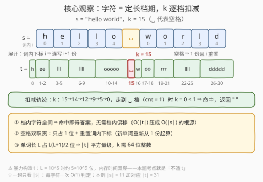
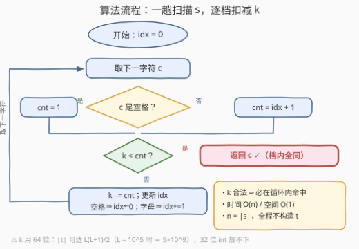

# 在展开字符串中查找第 K 个字符

- **题目名称**：在展开字符串中查找第 K 个字符
- **链接**：[3744. 在展开字符串中查找第 K 个字符](https://leetcode.cn/problems/find-kth-character-in-expanded-string/)
- **难度**：中等
- **标签**：字符串、模拟

## 1. 题目概述

> ⚠️ 本题为 LeetCode 付费题，题意描述根据官方示例用例与 hints 重建，可能与官方题面有出入。

给你一个字符串 `s` 和一个整数 $k$。`s` 由若干**单词**组成，单词之间由单个空格分隔。将 `s` 展开为字符串 $t$，规则如下：

- 对每个单词，**词内下标为 $i$（从 0 开始）的字符，在 $t$ 中连续出现 $i+1$ 次**；
- 每个空格在 $t$ 中只保留**一个**空格字符；
- 单词内的下标在每个新单词处**重置为 0**。

返回展开串 $t$ 中**下标为 $k$**（从 0 开始）的字符。数据保证 $k$ 是 $t$ 的合法下标。

**示例 1**：

```text
输入：s = "hello world", k = 0
输出："h"
解释："hello" 中词内下标 0 的 'h' 只出现 1 次，它就是 t 的第 0 个字符。
```

**示例 2**：

```text
输入：s = "hello world", k = 15
输出：" "
解释："hello" 展开为 "h" + "ee" + "lll" + "llll" + "ooooo"，共占 1+2+3+4+5 = 15 位
      （下标 0 ~ 14），紧随其后的单个空格正是 t[15]。
```

**约束条件**（按题意重建，原始约束以官方为准）：

- $1 \le |s|$，$s$ 由小写英文字母和空格组成，单词间以单个空格分隔；
- $0 \le k < |t|$。注意 $|t|$ 是**平方量级**：长为 $L$ 的单词展开占 $L(L+1)/2$ 位。

> 💡 **审题关键**：① $t$ **造不出来**——$L = 10^5$ 的单词展开约 $5\times10^9$ 位，暴力构造内存时间双爆，本题考点就是把 $O(|t|)$ 的定位压成 $O(|s|)$；② **空格双职责**——只占 1 位 + 重置词内下标，漏掉重置会让第二个单词按累计下标展开直接 WA；③ $|t|$ 超 32 位 `int` 上限，$k$ 必须 64 位。

---

## 2. 解题思路

### 2.1 暴力思路

老老实实把 $t$ 拼出来再取 `t[k]`：

```python
def brute(s, k):
    t, idx = [], 0
    for c in s:
        if c == ' ':
            t.append(' ')
            idx = 0
        else:
            t.append(c * (idx + 1))
            idx += 1
    return ''.join(t)[k]
```

正确性没问题，但复杂度是 $O(|t|)$：一个长 $L$ 的单词展开占 $L(L+1)/2$ 位，$L = 10^5$ 时约 $5\times 10^9$——**时间与内存双双爆炸**。真正要回答的问题是：能不能**不碰 $t$ 的本体**，只用 $s$ 自身的信息定位第 $k$ 位？

### 2.2 核心观察：每个字符是一段「定长档期」，k 逐段扣减



把 $t$ 看成一串首尾相接的**档期**：$s$ 中每个字符对应 $t$ 中一段**长度确定、内容全同**的区块——

| $s$ 中的字符 | 档期长度 | 档期内容 |
|---|---|---|
| 单词内下标 $i$ 的字母 $c$ | $i + 1$ | 连续 $i+1$ 个 $c$ |
| 空格 | $1$ | 单个空格 |

于是「找 $t[k]$」=「找第 $k$ 位落在哪个档期」。从左到右扫 $s$，维护**剩余里程 $k$**，每遇到一个长度为 `cnt` 的档期：

- 若 $k < \text{cnt}$：第 $k$ 位就落在当前档期内——而**档期内字符全部相同**，无论偏移多少答案都是该字符，**命中即返回**；
- 否则 $k \mathrel{-}= \text{cnt}$，整段跳过。

以 `s = "hello world", k = 15` 为例（见上图）：五个字母档期 $1+2+3+4+5 = 15$ 位恰好把 $k$ 扣到 $0$，走到空格档期（`cnt = 1`）时 $k = 0 < 1$，命中——答案就是空格。

> 💡 **为什么能整段跳过**：档期内字符全同，所以根本不需要知道 $k$ 落在档期**内部**的哪个偏移——这正是 $O(|t|)$ 压缩成 $O(|s|)$ 的全部秘密。同理，$|t|$ 的总长我们从头到尾也没算过。

### 2.3 算法流程图



**逻辑执行步骤**：

| 步骤 | 操作 | 说明 |
|------|------|------|
| ① 初始化 | `idx = 0` | 词内下标 |
| ② 取字符 | `c = s[i]`，`i++` | 从左到右一趟 |
| ③ 定档期 | 空格 ⇒ `cnt = 1`；否则 `cnt = idx + 1` | 空格是特殊的「1 长档」 |
| ④ 命中判定 | `k < cnt`？是 ⇒ **返回 `c`** | 档内全同，命中即答案 |
| ⑤ 扣减推进 | `k -= cnt`；`idx` = 空格 ? 0 : `idx + 1` | 空格重置、字母递增 |
| ⑥ 循环 | 回到 ② | $k$ 合法 ⇒ 必在循环内返回 |

注意 ⑤ 中**重置发生在命中判定之后**：空格自己也是一个档期，先让它接受 $k < 1$ 的检验，再谈重置。

### 2.4 示例演算

**示例 2**：`s = "hello world", k = 15`（逐档扣减）：

| 字符 | 词内下标 | 档期 `cnt` | 判定前 `k` | `k < cnt`？ | 判定后 `k` |
|------|---------|-----------|-----------|------------|-----------|
| h | 0 | 1 | 15 | 否 | 14 |
| e | 1 | 2 | 14 | 否 | 12 |
| l | 2 | 3 | 12 | 否 | 9 |
| l | 3 | 4 | 9 | 否 | 5 |
| o | 4 | 5 | 5 | 否 | 0 |
| ␣ | — | 1 | 0 | **是** | 返回 `" "` ✓ |

全程只扫了 6 个字符就把 $t[15]$ 定位出来，而 $t$ 实际有 31 位——规模越大，这套「记账」省得越多。

---

## 3. 参考代码

### C++

```cpp
class Solution {
public:
    char findKthCharacter(string s, long long k) {
        long long idx = 0;                                // 词内下标
        for (char c : s) {
            long long cnt = (c == ' ') ? 1 : idx + 1;     // 档期长度
            if (k < cnt) return c;                        // 命中：档内全同
            k -= cnt;
            idx = (c == ' ') ? 0 : idx + 1;               // 空格重置
        }
        return ' ';                                       // k 合法时不可达
    }
};
```

> 💡 **写法要点**：
> - **空格统一成 `cnt = 1` 的档期**：命中判定 `k < cnt` 对空格自然退化为 `k == 0`，避免单独写一个分支，两种字符共享同一条主干逻辑；
> - **`idx` 的更新放在扣减之后**：空格先作为档期参与判定，再执行重置——顺序颠倒会在 $k$ 恰好落在空格上时错过命中；
> - **`k` 必须 `long long`**：$|t|$ 可达 $L(L+1)/2 \approx 5\times10^9$，超出 32 位 `int`；
> - 付费题无官方代码模板，函数签名（参数/返回类型）按题意推定，提交时以实际签名为准微调。

### Python

```python
class Solution:
    def findKthCharacter(self, s: str, k: int) -> str:
        idx = 0
        for c in s:
            cnt = 1 if c == ' ' else idx + 1
            if k < cnt:
                return c
            k -= cnt
            idx = 0 if c == ' ' else idx + 1
        return ' '
```

> 💡 **写法要点**：Python 大整数无溢出之忧，其余与 C++ 逐行对应；返回值可能是字符或单字符串，按官方签名适配即可。

---

## 4. 复杂度分析

| 维度 | 复杂度 | 说明 |
|------|--------|------|
| **时间** | $O(n)$，$n = \|s\|$ | 每个字符一次 $O(1)$ 档期判定，与 $|t|$ 的大小无关 |
| **空间** | $O(1)$ | 只维护 `k` 与 `idx` 两个变量 |
| **对比** | 暴力 $O(\|t\|)$ | $|t|$ 是平方量级（$\sim L^2/2$），记账法把定位代价与展开规模解耦 |

---

## 5. 扩展：同一字符串的多次查询

如果要对**同一个** `s` 回答很多次 $k$ 查询，逐个线性扫就浪费了。可以先花 $O(n)$ 预处理**档期长度前缀和**数组 `pre`（`pre[j]` = 前 `j` 个档期的总长），每次查询二分找**第一个** `pre[j] > k` 的档期 `j`，再回读该档期对应的字符——单次查询 $O(\log n)$。

进一步的花式变体：逆向输出 $t$ 的某个区间（从右往左扫，维护「右侧总长」）；或流式消费超大 $t$（生成器逐档 `yield c * cnt`，内存仍是 $O(1)$）。套路不变：**永远只记账，不落盘**。

---

## 6. 面试要点

**Q1：为什么不能直接构造 t？**

> 长为 $L$ 的单词展开占 $L(L+1)/2$ 位，$|t|$ 是平方量级；$L = 10^5$ 时约 $5\times10^9$ 位，构造的时间与内存都不可接受。正解是把「定位第 $k$ 位」转化成「逐档扣减 $k$」，复杂度只与 $|s|$ 相关。

**Q2：为什么命中档期后不需要知道档内偏移？**

> 每个档期的内容是**同一个字符的连续重复**，落在档期内任意位置的答案都是该字符。「命中即返回」依赖的全部条件就是档内全同——这也是能整段跳过的充要条件。

**Q3：空格的处理有哪两件事？为什么容易写错？**

> ① 空格自身是一个长度为 1 的档期，要参与 $k < 1$ 的命中判定（$k = 15$ 的示例正是考这个）；② 经过空格后词内下标重置为 0，下一单词从「1 份」重新起算。易错点在于把重置放在命中判定之前——那样 $k$ 恰落在空格上时会错过返回。

**Q4：k 为什么要用 64 位整数？**

> $|t|$ 可达 $L(L+1)/2 \approx 5\times10^9$，超过 32 位 `int` 上限（约 $2.1\times10^9$）。C++ 用 `long long`；Python 原生大整数无此顾虑，但要意识到数据范围在考这一点。

**Q5：这个「长度记账 + 定位第 k 位」的套路还出现在哪些题里？**

> 一整族「目标串造不出来」的题都是同一内核：880（索引处的解码字符串，正向记账逆向还原）、1545（第 N 个二进制字符串的第 K 位，长度倍增逆向走链）、3304/3307（字符串游戏的第 K 个字符，位翻转变换下同样只推长度不推内容）。识别标志：**变换只影响长度，或内容可由位置反推**。

> 💡 **一句话总结**：3744 = 把 $t$ 看成一串「字符 × 定长」的档期，扫一遍 $s$ 让 $k$ 逐档扣减，`k < cnt` 即命中。空格是 `cnt=1` 且重置下标的特殊档期；$k$ 用 64 位；全程不构造 $t$。

---

## 7. 同类练习题

- [3304. 找出第 K 个字符 I](https://leetcode.cn/problems/find-the-k-th-character-of-string-game-i/)（[题解](../3301-3400/3304_找出第K个字符I.md)）：同样在「造不出的串」上找第 K 个字符，展开规则换成位翻转倍增
- [3307. 找出第 K 个字符 II](https://leetcode.cn/problems/find-the-k-th-character-of-string-game-ii/)（[题解](../3301-3400/3307_找出第K个字符II.md)）：多操作版的第 K 字符定位，逆向走链思想的进阶练习
- [880. 索引处的解码字符串](https://leetcode.cn/problems/decoded-string-at-index/)（[题解](../0801-0900/880_索引处的解码字符串.md)）：正向长度记账 + 逆向位置还原，「不构造目标串」的最经典模板
- [1545. 找出第 N 个二进制字符串的第 K 位](https://leetcode.cn/problems/find-kth-bit-in-nth-binary-string/)（[题解](../1501-1600/1545_找出第N个二进制字符串的第K位.md)）：长度倍增 + 逆向走链定位第 K 位，与本题的「扣减」互为正反两面
- [779. 第 K 个语法符号](https://leetcode.cn/problems/k-th-symbol-in-grammar/)（[题解](../0701-0800/779_第K个语法符号.md)）：行倍增 + 逆向推导，找第 k 位一族的高频经典
