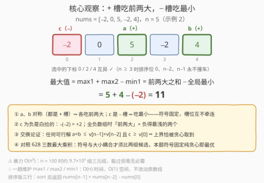
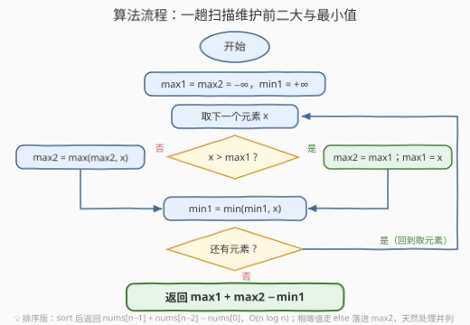

# LeetCode 三元素表达式的最大值 题解

## 1. 题目概述

- **标题 / 题号**：三元素表达式的最大值（#3745，easy）
- **链接**：https://leetcode.cn/problems/maximize-expression-of-three-elements/
- **难度**：简单
- **标签**：贪心、数组、排序、枚举

**题意**：给你一个整数数组 `nums`。

从 `nums` 中选择三个元素 $a$、$b$ 和 $c$，它们的下标需**互不相同**，使表达式 $a + b - c$ 的值最大化。

返回该表达式可能的**最大值**。

**示例 1**：

```text
输入：nums = [1,4,2,5]
输出：8
解释：可以选 a = 4，b = 5，c = 1，表达式的值为 4 + 5 − 1 = 8，这是可能的最大值。
```

**示例 2**：

```text
输入：nums = [-2,0,5,-2,4]
输出：11
解释：可以选 a = 5，b = 4，c = −2，表达式的值为 5 + 4 − (−2) = 11，这是可能的最大值。
```

**约束**：

- $3 \le \text{nums.length} \le 100$
- $-100 \le \text{nums[i]} \le 100$

> 💡 **审题关键**：① $a$、$b$、$c$ 只要求**下标互异**，不要求值互异，也不要求保持原数组中的相对顺序——`[5,5,5]` 里照样能选出 $a=b=c=5$；② $c$ 带**负号**参与表达式，数组里有负数时 $-c$ 反而是加项（示例 2 正是靠 $-(-2)=+2$ 多赚 2 分）；③ $n \ge 3$ 这个下界不是废话：它保证「前两大 + 最小值」永远取得到三个互异下标（见 2.2）。

## 2. 解题思路

### 2.1 暴力思路

三层循环枚举所有下标三元组 $(i, j, k)$（两两互异），直接计算 $\text{nums}[i] + \text{nums}[j] - \text{nums}[k]$ 取最大：

```python
def brute(nums):
    n, best = len(nums), float('-inf')
    for i in range(n):
        for j in range(n):
            for k in range(n):
                if len({i, j, k}) == 3:      # 两两互异
                    best = max(best, nums[i] + nums[j] - nums[k])
    return best
```

复杂度 $O(n^3)$：$n = 100$ 时约 $9.7 \times 10^5$ 组三元组，本题数据范围下**完全能过**——但这显然是给「想清楚再动手」的人留的分：表达式里三个槽位的**符号是固定的**，根本不需要枚举。

### 2.2 核心观察：+ 槽吃前两大，− 槽吃最小



把表达式 $a + b - c$ 看成三个**槽位**：两个带 $+$ 号（$a$、$b$），一个带 $-$ 号（$c$）。设排序后 $v_0 \le v_1 \le \cdots \le v_{n-1}$，则答案就是

$$
\text{answer} = v_{n-1} + v_{n-2} - v_0 = \max_1 + \max_2 - \min_1
$$

支撑这个结论的有三个事实：

**事实一（$a$、$b$ 对称，摆放自由）**：$a$ 和 $b$ 在表达式里地位完全相同（都是加项），选出的三个值怎么装槽是自由的——把较大的两个装进 $+$ 槽、最小的装进 $-$ 槽一定不劣。

**事实二（交换论证定上界）**：对**任意**下标互异的 $(a, b, c)$：

- $a + b \le v_{n-1} + v_{n-2}$：两个互异下标的元素，较大者 $\le v_{n-1}$（全局最大）；较小者 $\le v_{n-2}$——否则两个都严格大于次大值，而「严格大于 $v_{n-2}$」的值只能占据排序位 $n-1$ 这一个位置，两个互异下标挤不进去，矛盾；
- $c \ge v_0$，即 $-c \le -v_0$。

两式相加：任何可行解 $\le v_{n-1} + v_{n-2} - v_0$。

**事实三（上界可达）**：$n \ge 3$ 时排序位 $0$、$n-2$、$n-1$ 是**三个不同位置**，映射回原数组的下标天然互异（$n = 3$ 时恰好就是仅有的三个位置）；值相等也不妨事——`[5,5,5]` 三个 5 各占一个下标。上界取得到，它就是答案。

> 💡 **为什么这么"无脑"**：三个槽位的**符号预先固定**（$+, +, -$），每个槽选谁只影响自己那一项、互不牵连，于是「各槽分别取极值」就是全局最优。对照 [628. 三个数的最大乘积](https://leetcode.cn/problems/maximum-product-of-three-numbers/)：乘积的**符号**与**大小**耦合（两个大负数相乘翻身变正），纯贪心取前三大会翻车，必须额外比较 $\min_1 \cdot \min_2 \cdot \max_1$——本题没有这种耦合，纯贪心即最优。

### 2.3 算法流程图



**逻辑执行步骤**：

| 步骤 | 操作 | 说明 |
|------|------|------|
| ① 初始化 | `max1 = max2 = −∞`，`min1 = +∞` | 前二大与全局最小 |
| ② 取元素 | `x = nums[i]`，从左到右一趟 | 每个元素只看一次 |
| ③ 更新前二大 | `x > max1`？⇒ `max2 = max1; max1 = x`；否则 `max2 = max(max2, x)` | 相等值走 else 落进 `max2`，天然处理并列 |
| ④ 更新最小 | `min1 = min(min1, x)` | 与 ③ 相互独立 |
| ⑤ 循环 | 还有元素 ⇒ 回到 ② | |
| ⑥ 输出 | 返回 `max1 + max2 − min1` | |

排序版只要三行：`sort` 后返回 `nums[n-1] + nums[n-2] - nums[0]`，$O(n \log n)$；一趟版 $O(n)$、$O(1)$ 空间、不改动原数组。

### 2.4 示例演算

**示例 2**：`nums = [-2, 0, 5, -2, 4]`（一趟扫描状态表）：

| x | max1 | max2 | min1 | 说明 |
|---|------|------|------|------|
| 初始 | −∞ | −∞ | +∞ | 三个哨兵 |
| −2 | −2 | −∞ | −2 | 首个元素同时填入 max1 与 min1 |
| 0 | 0 | −2 | −2 | 0 > −2 晋级 max1，原 max1 降级为 max2 |
| 5 | 5 | 0 | −2 | 5 > 0 再度晋级 |
| −2 | 5 | 0 | −2 | 不大于 max1、不大于 max2、不小于 min1，全不动 |
| 4 | 5 | 4 | −2 | 4 < 5 但 4 > 0，顶掉 max2 |

返回 $5 + 4 - (-2) = 9 + 2 = 11$ ✓

## 3. 参考代码

### C++

```cpp
class Solution {
public:
    int maximizeExpressionOfThree(vector<int>& nums) {
        int max1 = INT_MIN, max2 = INT_MIN, min1 = INT_MAX;
        for (int x : nums) {
            if (x > max1) {              // 晋级最大：原最大降级为次大
                max2 = max1;
                max1 = x;
            } else {
                max2 = max(max2, x);     // 并列或更小：尝试顶掉次大
            }
            min1 = min(min1, x);
        }
        return max1 + max2 - min1;
    }
};
```

> 💡 **写法要点**：
> - **相等的值走 `else` 分支**：`[5,5,5]` 里第二个 5 不大于 `max1`，落进 `max2`——这正是我们要的（两个 + 槽可以装相等的值）。若只写 `if (x > max1)` 忘了 else，`max2` 会残留 `INT_MIN`，全等数组直接翻车；
> - 值域 $[-100, 100]$，答案上界 $100 + 100 - (-100) = 300$，`int` 绰绰有余；
> - 排序版 `sort(nums.begin(), nums.end()); return nums[n-1] + nums[n-2] - nums[0];` 同样正确，代价是 $O(n \log n)$ 且改动原数组。

### Python

```python
class Solution:
    def maximizeExpressionOfThree(self, nums: List[int]) -> int:
        max1 = max2 = -inf
        min1 = inf
        for x in nums:
            if x > max1:
                max1, max2 = x, max1      # 元组解包：右值先整体求值再赋值
            else:
                max2 = max(max2, x)
            min1 = min(min1, x)
        return max1 + max2 - min1
```

> 💡 **写法要点**：`max1, max2 = x, max1` 一步完成「晋级 + 降级」，无中间变量；追求极简也可以 `return sum(nlargest(2, nums)) - min(nums)`（`heapq.nlargest`），或 `nums.sort()` 后取 `nums[-1] + nums[-2] - nums[0]`。

## 4. 复杂度分析

| 维度 | 复杂度 | 说明 |
|------|--------|------|
| **时间** | $O(n)$ | 一趟扫描，每个元素 $O(1)$ 更新三个变量 |
| **空间** | $O(1)$ | 只维护 `max1` / `max2` / `min1` 三个变量 |
| **对比** | 暴力 $O(n^3)$、排序 $O(n \log n)$ | $n = 100$ 时暴力也才 $10^6$ 级，但符号固定的表达式轮不到枚举 |

## 5. 扩展：若要求下标有序（i < j < k）

把题面改成「$a$、$b$、$c$ 的下标需满足 $i < j < k$」（$a$ 在 $b$ 前、$b$ 在 $c$ 前），槽位之间就有了**顺序约束**，「各槽独立取极值」随之失效——全局最大可能根本不在 $b$ 左边的可选范围里。此时改用**枚举中间 + 两边极值预处理**的骨架：

- 预处理 `pre[j] = max(nums[0..j])`（位置 $j$ 左侧的最大值，$a$ 的候选）与 `suf[j] = min(nums[j..n-1])`（右侧最小值，$c$ 的候选）；
- 枚举中间下标 $j$：答案 $= \max_j \big(\text{pre}[j-1] + \text{nums}[j] - \text{suf}[j+1]\big)$。

仍是 $O(n)$ / $O(n)$（滚动可压到 $O(1)$）。这提醒我们：**「各槽取极值」成立的前提是槽位之间没有约束**——一旦加上顺序，就得回到「枚举中间变量、两边预处理极值」的通用套路。

## 6. 面试要点

**Q1：为什么「前两大减最小」一定是合法解（下标互异）？**

> 排序后取排序位 $0$、$n-2$、$n-1$：$n \ge 3$ 时它们是三个不同位置，映射回原数组下标必然互异；$n = 3$ 时恰好是仅有的三个位置。值相等也不影响——`[5,5,5]` 三个 5 各占一个下标，照样合法。

**Q2：负数会破坏贪心吗？**

> 不会，反而是助力：$c$ 槽取最小值，负得越深 $-c$ 贡献越大（示例 2 靠 $-(-2) = +2$ 多赚 2 分）；$a$、$b$ 槽取前两大，全负数组时就是「负得最浅的两个」，依然是 $a + b$ 的最大可能。符号固定（$+, +, -$）保证了贪心与正负无关。

**Q3：一趟维护「前二大」时，并列相等怎么处理？**

> 标准写法 `if (x > max1) {max2 = max1; max1 = x;} else max2 = max(max2, x);`——相等的值走 else 落进 `max2`，两个 + 槽正好各装一个。易错点：只写 `if (x > max1)` 漏掉 else 分支，`[5,5,5]` 中第二个 5 进不了 `max2`，返回 $5 + \text{INT\_MIN} - 5$ 直接溢出出错误答案。写完拿全等数组自测一遍。

**Q4：本题与 628（三个数的最大乘积）的本质区别是什么？**

> **符号是否与选择耦合**。本题槽位符号固定为 $+, +, -$，各槽独立取极值即最优；628 的乘积符号取决于「负数选了几个」，两个大负数相乘翻身变正，所以必须比较 $\max_1 \max_2 \max_3$ 与 $\min_1 \min_2 \max_1$ 两组候选。看到「选 k 个数做运算」先问：运算结果的方向能否被选择翻转——能翻转就要分组比较，不能就纯贪心。

**Q5：如果还要求下标递增（i < j < k）呢？**

> 各槽独立贪心失效（前两大可能都挤在 $c$ 的右边）。改为枚举中间下标 $j$：左侧用前缀最大值当 $a$，右侧用后缀最小值当 $c$，一趟 $O(n)$ 收工——「枚举中间变量 + 两边预处理极值」是处理顺序约束的通用骨架（见第 5 节）。

> 💡 **一句话总结**：3745 = 符号固定的三槽位各自取极值——$+$ 槽吃前两大、$-$ 槽吃最小，$n \ge 3$ 保证下标互异、交换论证保证是上界，一趟扫描 $O(n)$ / $O(1)$ 收工。

## 同类练习题

| # | 题目 | 与本题的关联 |
|---|------|-------------|
| 628 | [三个数的最大乘积](https://leetcode.cn/problems/maximum-product-of-three-numbers/)（[题解](../0601-0700/628_三个数的最大乘积.md)） | 同为三元素极值挑选，但乘积符号与大小耦合须比两组候选——理解本题为何不用比 |
| 1913 | [两个数对之间的最大乘积差](https://leetcode.cn/problems/maximum-product-difference-between-two-pairs/)（[题解](../1901-2000/1913_两个数对之间的最大乘积差.md)） | 两大 × 两小的固定组合，无符号歧义版的三元素贪心 |
| 561 | [数组拆分](https://leetcode.cn/problems/array-partition/)（[题解](../0501-0600/561_数组拆分.md)） | 排序后按位配对取小，「极值配对」思想的入门版 |
| 414 | [第三大的数](https://leetcode.cn/problems/third-maximum-number/)（[题解](../0401-0500/414_第三大的数.md)） | 一趟维护前三大（含并列去重），本题「前二大」维护技巧的进阶版 |
| 1005 | [K 次取反后最大化的数组和](https://leetcode.cn/problems/maximize-sum-of-array-after-k-negations/)（[题解](../1001-1100/1005_K次取反后最大化的数组和.md)） | 符号可以主动分配的贪心，与本题「符号固定」互为镜像 |
