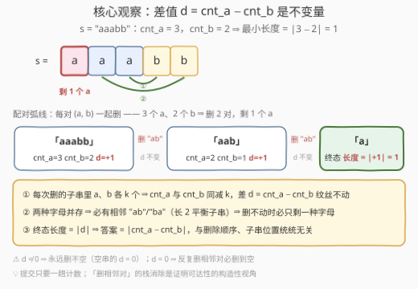
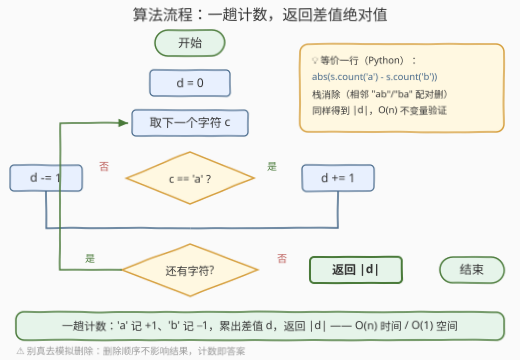

# 等量移除后的字符串最小长度

- **题目名称**：等量移除后的字符串最小长度
- **链接**：[3746. 等量移除后的字符串最小长度](https://leetcode.cn/problems/minimum-string-length-after-balanced-removals/)
- **难度**：中等
- **标签**：栈、字符串、计数

## 1. 题目概述

给你一个仅由字符 `'a'` 和 `'b'` 组成的字符串 `s`。你可以**反复移除任意子字符串**，只要该子字符串中 `'a'` 和 `'b'` 的**数量相等**（平衡子串）。每次移除后，剩余部分无缝拼接在一起。返回经过任意次数操作后，字符串可能的**最小长度**。

**示例 1**：

```text
输入：s = "aabbab"
输出：0
解释：整个字符串有 3 个 'a'、3 个 'b'，数量相等，可整体移除，最小长度 0。
```

**示例 2**：

```text
输入：s = "aaaa"
输出：4
解释：任何子串都只含 'a'，一个都删不掉，长度仍为 4。
```

**示例 3**：

```text
输入：s = "aaabb"
输出：1
解释：先移除 "ab" 得 "aab"，再移除 "ab" 得 "a"，无法继续，最小长度 1。
```

**约束条件**：

- $1 \le |s| \le 10^5$
- $s_i$ 是 `'a'` 或 `'b'`

> 💡 **审题关键**：① 子串是**任意**的——不要求相邻、不限长度，只要 a、b 数量相等就能删；② 删除后**两端拼接**会拼出新的相邻关系，所以"还能删什么"是动态变化的；③ 问的是**最小**长度——本能反应是"小心翼翼地模拟删除顺序"，但真正的考点是发现**结果与删除顺序、子串位置统统无关，只由两种字母的个数决定**。

---

## 2. 解题思路

### 2.1 暴力思路

老老实实模拟：每轮在当前串里找一个平衡子串删掉，直到找不到为止。找平衡子串可用**前缀和**：令 `'a'` 记 $+1$、`'b'` 记 $-1$，则**两个相等前缀值之间的子串就是平衡的**。

```python
def brute(s):
    while True:
        pre, seen, cut = 0, {0: -1}, None     # seen: 前缀值 -> 最早下标
        for i, c in enumerate(s):
            pre += 1 if c == 'a' else -1
            if pre in seen:                   # 找到一段平衡子串
                cut = (seen[pre] + 1, i)
                break
            seen[pre] = i
        if cut is None:                       # 再也删不动了
            return len(s)
        l, r = cut
        s = s[:l] + s[r + 1:]                 # 删除并拼接
```

问题在于：每次删除要**重扫整个串**，而每轮至多删掉 2 个字符（长度减半也要 $\lfloor n/2 \rfloor$ 轮），总计 $O(n^2)$——$n = 10^5$ 时约 $5 \times 10^9$ 次字符操作，不可接受。更麻烦的是，模拟者还会被一个问题折磨：**先删哪段、后删哪段，会不会影响最终结果？** 暴力模拟给不出答案，必须换视角。

### 2.2 核心观察：数量差是不变量，答案 = |cnt_a − cnt_b|



设 $\text{cnt}_a$、$\text{cnt}_b$ 为两种字母的个数，考虑**差值** $d = \text{cnt}_a - \text{cnt}_b$，有三条性质环环相扣：

**性质一（不变量 ⇒ 下界）**：每次删除的子串中 a、b 数量相等，设各 $k$ 个，则操作后 $\text{cnt}_a \mathrel{-}= k$、$\text{cnt}_b \mathrel{-}= k$，**差值 $d$ 纹丝不动**。于是**任何**删法得到的中间状态都满足 $\text{len} = \text{cnt}_a + \text{cnt}_b \ge |\text{cnt}_a - \text{cnt}_b| = |d|$——空串的 $d = 0$，所以 $d \ne 0$ 的串**永远删不空**。

**性质二（并存 ⇒ 可删）**：若当前串中 a、b **并存**，则串中必有某处**相邻字符互异**（字母发生切换的位置，否则整串恒同一种字母），即存在长度为 2 的平衡子串 `"ab"` 或 `"ba"`——**总能继续删**。逆否命题：删不动的终态必然只剩一种字母。

**性质三（合起来 ⇒ 答案唯一）**：终态是纯 `a` 或纯 `b` 的串，其差值为 $\pm$ 长度；不变量保证差值始终是 $d$，故**终态长度恰为 $|d| = |\text{cnt}_a - \text{cnt}_b|$**。这个值既是下界（性质一卡死），又可达（性质二保证反复删相邻异对一定能删到只剩 $|d|$ 个多数字母），**与删除顺序、子串位置完全无关**。

用示例验证：`"aabbab"`：$|3-3| = 0$ ✓；`"aaaa"`：$|4-0| = 4$ ✓；`"aaabb"`：$|3-2| = 1$ ✓。

> 💡 **为什么"任意子串"帮不上忙**：删除条件看似极其宽松（任意位置、任意长度的平衡子串都能删），但不变量 $d$ 把下界卡死了——删得再聪明，每步 a、b 同减，差距永远追不平。而"相邻异对"这种最保守的删法已经足够触到 $|d|$，所以宽松条件不改变答案。**审题时的恐惧（选择困难）恰恰是不变量要消灭的对象**。

> 💡 **栈视角（标签 Stack 的来历）**："反复删相邻 ab/ba"正是经典的**栈消除**：从左到右扫串，栈顶与当前字符互异则弹栈（两者配对删除），否则入栈。终态栈内必然全是同一种字母（若出现相邻互异对，后入者当初就不可能被压进去），栈大小 $= |d|$。它给出的是**构造性证明**，用于理解"可达性"；真正提交时连栈都不用，计数即可（见第 5 节扩展）。

### 2.3 算法流程图



**逻辑执行步骤**：

| 步骤 | 操作 | 说明 |
|------|------|------|
| ① 初始化 | `d = 0` | 差值累加器 |
| ② 取字符 | `c = s[i]`，一趟从左到右 | 不需要真的"删"任何东西 |
| ③ 计数 | `'a'` ⇒ `d += 1`；`'b'` ⇒ `d -= 1` | 等价于数出两种字母的个数 |
| ④ 循环 | 未到串尾回到 ② | 每字符 $O(1)$ |
| ⑤ 返回 | `abs(d)` | 差的绝对值 = 终态长度 |

### 2.4 示例演算

**示例 3**：`s = "aaabb"`，用栈消除逐步走（读入字符，栈底→栈顶）：

| 读入 | 栈（底→顶） | 动作 |
|------|------------|------|
| a | `a` | 栈空，入栈 |
| a | `a a` | 栈顶同为 a，入栈 |
| a | `a a a` | 同上 |
| b | `a a` | 栈顶 a 与 b 互异 ⇒ 弹栈（配对删一对） |
| b | `a` | 同上 |

终态栈 = `a`，长度 $1 = |3-2|$ ✓。再看计数法：$d = +1+1+1-1-1 = +1$，$|d| = 1$——**一趟出答案，连栈都不用**。

**示例 1**：`s = "aabbab"`，$d = 1+1-1-1+1-1 = 0$，整体平衡必能删空，答案 $0$ ✓。

---

## 3. 参考代码

### C++

```cpp
class Solution {
public:
    int minLengthAfterRemovals(string s) {
        int d = 0;                              // 差值累加器
        for (char c : s) d += (c == 'a') ? 1 : -1;
        return abs(d);                          // 终态长度 = |cnt_a - cnt_b|
    }
};
```

> 💡 **写法要点**：
> - `'a'` 记 $+1$、`'b'` 记 $-1$ 累加，一趟结束 $d$ 就是两种字母的个数差；
> - $|s| \le 10^5$，`int` 无溢出之忧；
> - 千万别写成"模拟删除"——那是 $O(n^2)$ 且完全多余。

### Python

```python
class Solution:
    def minLengthAfterRemovals(self, s: str) -> int:
        return abs(s.count('a') - s.count('b'))
```

> 💡 **写法要点**：`str.count` 两趟扫描仍为 $O(n)$，语义最直白；在意常数可改成单趟累加（与 C++ 版逐行对应）。

---

## 4. 复杂度分析

| 维度 | 复杂度 | 说明 |
|------|--------|------|
| **时间** | $O(n)$，$n = \|s\|$ | 每字符一次 $O(1)$ 计数 |
| **空间** | $O(1)$ | 只维护一个差值变量 |
| **对比** | 暴力模拟 $O(n^2)$ | 省掉的是"找子串—删除—拼接"的整套模拟；换来的代价是想清楚不变量 |

---

## 5. 扩展：条件一变，"计数即答案"还成立吗？

**栈消除写法**（构造性等价，$O(n)/O(n)$）：

```python
class Solution:
    def minLengthAfterRemovals(self, s: str) -> int:
        st = []
        for c in s:
            if st and st[-1] != c:   # 栈顶与当前互异 ⇒ "ab"/"ba" 配对删除
                st.pop()
            else:
                st.append(c)
        return len(st)               # 终态全同字母，长度 = |cnt_a - cnt_b|
```

它与计数版答案相同，是对"可达性"的现场验证，也是本题标签带 Stack 的原因。但**同样的框架换个删除条件，结论立刻分化**：

- **对照 2696（删除子串后的字符串最小长度）**：那题只能删 `"AB"` 或 `"CD"`——平衡条件从"数量相等"收紧为"特定字母对"，计数立刻失效（`"ACBD"` 里 a、b 数量再平衡也一个都删不掉），**必须栈模拟**。本题能退化为纯计数，全靠"数量相等"这一宽松条件配合不变量。
- **三种字母的反例**：若改成删 a、b、c **三者数量相等**的子串，性质二直接失效——并存不再保证有平衡子串。反例 `"aabbcbc"`（a、b、c = 2, 3, 2）：长度 3 的窗口没有"各 1 个"，长度 6 的窗口没有"各 2 个"，**任何操作都做不了**，答案是整串长 7；而按"总数减 $3 \times \min$"之类的计数公式会算出 1。可见**两种字母时"计数即答案"是特征而非常态**——不变量给下界的思路可推广，"并存 ⇒ 相邻可删"不可。

---

## 6. 面试要点

**Q1：为什么删除顺序不影响最终能得到的最小长度？**

> 每次删除的子串中 a、b 数量相等，所以差值 $d = \text{cnt}_a - \text{cnt}_b$ 是全程**不变量**；任何可达状态长度 $\ge |d|$。而反复删相邻异对（一定存在，见 Q2）总能把串削减到只剩 $|d|$ 个多数字母。下界与可达性夹逼，答案唯一等于 $|\text{cnt}_a - \text{cnt}_b|$，与顺序无关。

**Q2：为什么只要两种字母并存，就一定能继续删？**

> 并存意味着串中存在字母切换的位置，即某处相邻字符互异，而 `"ab"`/`"ba"` 是长度为 2 的平衡子串。逆否命题：删不动的终态必为纯一种字母，其长度等于 $|d|$。

**Q3："任意子串"比"只删相邻对"强得多，为什么答案没有变得更小？**

> 宽松的删除条件不改变不变量：每一步无论删多长的平衡子串，a、b 都同减 $k$，$d$ 不动。空串要求 $d=0$，故 $d \ne 0$ 时再宽松也删不空；而 $d = 0$ 时保守的相邻对删法也能删空。条件强弱只影响"过程"，不影响"极限"。

**Q4：标签里的 Stack 什么时候真的要用？**

> 本题栈消除（栈顶与当前互异则弹栈）只是**构造性证明**，提交用计数即可。一旦删除条件收紧为"特定模式"（如 2696 只能删 `"AB"`/`"CD"`、1047 删相邻重复对），计数失效，栈模拟就是正解。识别标志：**删除条件是"计数型"（数量关系）还是"模式型"（具体字母对）**。

**Q5：换成三种字母、删三量相等子串，还能用计数吗？**

> 不能。"并存 ⇒ 可删"失效：`"aabbcbc"` 中三种字母并存，却不存在任何平衡子串（长度 3 窗口非"各 1"、长度 6 窗口非"各 2"），答案 7 与任何简单计数公式都对不上。两种字母的"计数即答案"依赖于差值是**一维**不变量且相邻异对天然平衡。

> 💡 **一句话总结**：平衡删除的差值 $d$ 是不变量（卡下界），相邻异对总能删（达上界），两下一夹——答案就是 `abs(s.count('a') - s.count('b'))`，一趟计数 $O(n)/O(1)$。

---

## 7. 同类练习题

- [2696. 删除子串后的字符串最小长度](https://leetcode.cn/problems/minimum-string-length-after-removing-substrings/)（[题解](../2601-2700/2696_删除子串后的字符串最小长度.md)）：题名几乎相同，但只能删固定字母对 `"AB"`/`"CD"`——计数失效、必须栈模拟，与本题互为对照
- [1047. 删除字符串中的所有相邻重复项](https://leetcode.cn/problems/remove-all-adjacent-duplicates-in-string/)（[题解](../1001-1100/1047_删除字符串中的所有相邻重复项.md)）：相邻等价对消除的栈模板，即本题"可达性"构造的通用形态
- [1544. 整理字符串](https://leetcode.cn/problems/make-the-string-great/)（[题解](../1501-1600/1544_整理字符串.md)）：相邻大小写配对消除，同一栈套路的换皮练习
- [921. 使括号有效的最少添加](https://leetcode.cn/problems/minimum-add-to-make-parentheses-valid/)（[题解](../0901-1000/921_使括号有效的最少添加.md)）：答案 = 无法配对的字符数，同款"计数定答案"的不变量思想
- [1963. 使字符串平衡的最小交换次数](https://leetcode.cn/problems/minimum-number-of-swaps-to-make-the-string-balanced/)（[题解](../1901-2000/1963_使字符串平衡的最小交换次数.md)）：括号串的平衡性度量，计数 + 前缀差不变量思想的近亲
