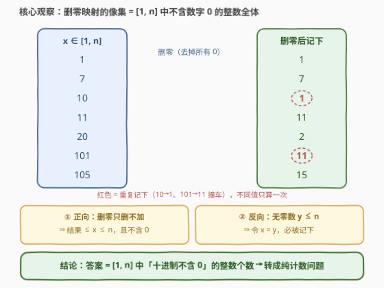
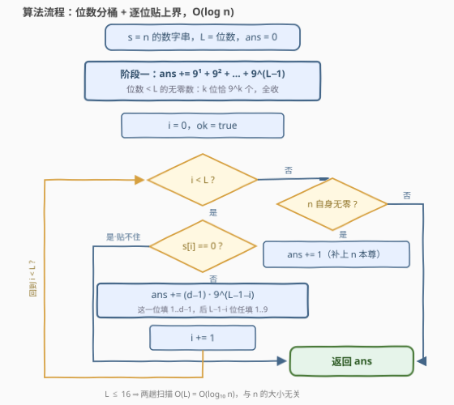

# 统计移除零后不同整数的数目

- **题目名称**：统计移除零后不同整数的数目
- **链接**：[3747. 统计移除零后不同整数的数目](https://leetcode.cn/problems/count-distinct-integers-after-removing-zeros/)
- **难度**：中等
- **标签**：数学、动态规划（数位 DP）

## 1. 题目概述

给你一个**正整数** $n$。对于从 $1$ 到 $n$ 的每个整数 $x$，我们记下通过移除 $x$ 的十进制表示中的**所有零**而得到的整数。返回一个整数，表示记下的**不同**整数的数量。

**示例 1**：

```text
输入：n = 10
输出：9
解释：我们记下的整数是 1, 2, 3, 4, 5, 6, 7, 8, 9, 1。
     有 9 个不同的整数 (1, 2, 3, 4, 5, 6, 7, 8, 9)。
```

**示例 2**：

```text
输入：n = 3
输出：3
解释：我们记下的整数是 1, 2, 3。有 3 个不同的整数。
```

**约束条件**：

- $1 \le n \le 10^{15}$

> 💡 **审题关键**：① $n$ 上界 $10^{15}$（16 位数）——**逐个枚举必死**，答案要「算」不要「数」；② 问的是**不同值的个数**（集合基数），不是求和也不是最值——这个信号把思路推向「先刻画像集，再对像集计数」；③ 它是 [3726. 移除十进制表示中的所有零](../3701-3800/3726_移除十进制表示中的所有零.md) 的姊妹题：3726 练「对一个数怎么删」，3747 问「对 $1\sim n$ 全删一遍后，像集有多大」。

---

## 2. 解题思路

### 2.1 暴力思路

最直觉的写法：哈希集合去重。

```python
def countDistinct(n):
    seen = set()
    for x in range(1, n + 1):
        seen.add(int(str(x).replace('0', '')))
    return len(seen)
```

正确性没问题，复杂度 $O(n \cdot d)$：$n = 10^{15}$ 时要跑千万亿次迭代。**换方向枚举也不行**——$[1, 10^{15}]$ 内的无零数约有 $2.3 \times 10^{14}$ 个（见 2.4 的上界自查），逐个生成同样枚不完。结论：必须把「个数」**直接算**出来，一步到位。

### 2.2 核心观察：记下的集合 = [1, n] 中的无零数



设 $r(x)$ 为 $x$ 删零后的结果，从**两个方向**夹逼 $r$ 的像集：

- **正向（像落在哪）**：删零**只删不加**——$x$ 无零时 $r(x) = x$；$x$ 含零时删掉的至少一位使位数严格变少（最高位非零必被保留，无前导零问题），故 $r(x) < x$。总之 $r(x) \le x \le n$，且 $r(x)$ 由 $x$ 的非零位拼接而成，**不含数字 0**。
- **反向（池子里的都取得到吗）**：任取无零数 $y \le n$，令 $x = y$——没有零可删，$r(y) = y$，所以 $y$ **必被记下**。

两个方向一夹，得到严格相等：

$$\{\,r(x) : 1 \le x \le n\,\} \;=\; \{\,y : 1 \le y \le n,\ y \text{ 的十进制表示不含 } 0\,\}$$

于是「不同整数的数目」$=$ **$[1,n]$ 中无零数的个数**——一个纯计数问题，从此再也不用管任何一个具体的 $x$。

### 2.3 算法流程图：按位数分桶 + 逐位贴上界



设 $n$ 共 $L$ 位（$L \le 16$），分两阶段清点无零数：

**阶段一（位数 $< L$ 的，必 $\le n$）**：位数少的数一定更小，全部合法。$k$ 位无零数每位从 $1\sim9$ 任选，共 $9^k$ 个，整段收进答案：

$$S_1 = 9^1 + 9^2 + \dots + 9^{L-1}$$

**阶段二（恰 $L$ 位且 $\le n$ 的）**：从最高位起**贴上界**逐位统计。设已确认前 $i$ 位与 $n$ 完全相同，看 $n$ 的第 $i$ 位数字 $d$：

- $d \ge 1$：这一位若填 $1 \sim d-1$（共 $d-1$ 种），后面 $L-1-i$ 位随便填非零数（各 $9$ 种），贡献 $(d-1)\cdot 9^{L-1-i}$；随后**贴着 $d$** 进入下一位；
- $d = 0$：无零数这一位**填不了 0**，上界贴不住，阶段二**提前收工**；
- 扫完全部 $L$ 位都没断：$n$ 自身就是无零数，**补上 1**（$n$ 本尊）。

> ⚠️ **唯一易错点**：$d = 0$ 时 $(d-1)\cdot 9^{k}$ 会算出**负数**——必须先判零再累加，判到零就 `break`。以 $n = 101$ 为例：漏判会算出 $82$，正确答案是 $90$。

### 2.4 示例演算

**示例 1**：$n = 10$（$L = 2$）

| 阶段 | 计算 | 小计 |
|------|------|------|
| 一 | $9^1$（一位数全收） | 9 |
| 二 | $i=0$：$d=1$，$0 \cdot 9 = 0$；$i=1$：$d=0$ → 贴不住，收工 | 0 |
| **合计** | | **9** ✓ |

**再演 $n = 205$**（$L=3$，上界中间藏 0 的典型）：

| 阶段 | 计算 | 小计 |
|------|------|------|
| 一 | $9 + 81$ | 90 |
| 二 | $i=0$：$d=2$，$1 \cdot 81 = 81$（首位填 1，后两位自由）；$i=1$：$d=0$ → 收工 | 81 |
| **合计** | | **171** |

**再演 $n = 319$**（$L=3$，全程贴得住）：

| 阶段 | 计算 | 小计 |
|------|------|------|
| 一 | $9 + 81$ | 90 |
| 二 | $i=0$：$2\cdot81=162$；$i=1$：$d=1$，$0\cdot9=0$；$i=2$：$d=9$，$8\cdot1=8$；没断 → $+1$ | 171 |
| **合计** | | **261** |

**上界自查**：$n = 10^{15}$ 时阶段一 $= \sum_{k=1}^{15} 9^k = \dfrac{9^{16}-9}{8} = 231627523606479$，阶段二在 $i=1$ 即遇 0 收工——这同时也是全题的最大可能答案。

---

## 3. 参考代码

### C++

```cpp
class Solution {
public:
    long long countDistinct(long long n) {
        string s = to_string(n);
        int L = s.size();

        long long pow9[17];
        pow9[0] = 1;
        for (int k = 1; k <= L; ++k) pow9[k] = pow9[k - 1] * 9;

        long long ans = 0;
        for (int k = 1; k < L; ++k) ans += pow9[k];   // 阶段一

        bool ok = true;                                // 前缀是否仍贴着 n
        for (int i = 0; i < L && ok; ++i) {
            int d = s[i] - '0';
            if (d == 0) ok = false;                    // 0 贴不住，提前收工
            else ans += 1LL * (d - 1) * pow9[L - 1 - i];
        }
        if (ok) ++ans;                                 // n 自身无零，补上它
        return ans;
    }
};
```

> 💡 **写法要点**：
> - `ok` 就是数位 DP 里的「贴上界」标志：它为真时，第 $i$ 位才享受「填小即自由」的计数；
> - `d == 0` 的分支绝不能省——省掉后 $(d-1)\cdot 9^k$ 变负数，$n=101$ 会算出 $82$（正确 $90$）；
> - `pow9` 最大用到 $9^{15} \approx 2.06\times10^{14}$，`long long` 稳稳放下，全程无溢出点。

### Python

```python
class Solution:
    def countDistinct(self, n: int) -> int:
        s = str(n)
        L = len(s)
        # 阶段一：位数不足 L 的无零数，k 位恰 9^k 个
        ans = sum(9 ** k for k in range(1, L))
        # 阶段二：恰 L 位且不超过 n 的无零数，逐位贴上界
        for i, ch in enumerate(s):
            d = int(ch)
            if d == 0:
                break                      # 这一位贴不住 0，提前收工
            ans += (d - 1) * 9 ** (L - 1 - i)
        else:
            ans += 1                       # 循环没 break：n 自身无零，补上
        return ans
```

> 💡 **写法要点**：
> - `for-else` 是本题的题眼语法：`else` 只在循环**自然跑完**（没 `break`）时执行，恰好编码「$n$ 自身无零」这一条件，比手写标志位干净；
> - $L \le 16$，`9 ** k` 现算毫无压力，不必预处理幂表。

---

## 4. 复杂度分析

| 维度 | 复杂度 | 说明 |
|------|--------|------|
| **时间** | $O(L) = O(\log_{10} n)$ | 至多 16 位，两趟线性扫描 |
| **空间** | $O(L)$ | 数字串；改用逐位除法拆位可压到 $O(1)$ |
| **对比** | 暴力 $O(n \cdot d)$ | $n = 10^{15}$ 时相差约 14 个数量级 |

---

## 5. 扩展：数位 DP 的通用视角与变体

**通用框架**：本题属于「数 $[1,n]$ 中**每位都满足性质 $P$** 的数的个数」这一族。通用解法是**数位 DP**：状态 $(\text{位置 } i,\ \text{是否贴上界})$，逐位枚举合法数字转移。本题 $P$ =「数字 $\ne 0$」，合法数字集 $D=\{1,\dots,9\}$ 与位置无关，DP 退化成一遍乘法计数。[902. 最大为 N 的数字组合](https://leetcode.cn/problems/numbers-at-most-n-given-digit-set/)（[题解](../0901-1000/902_最大为N的数字组合.md)）就是 $D$ 任给时的同款题；若 $P$ 依赖前一位（如「不含连续 1」），状态加一维「上一位填了啥」即可（[600. 不含连续 1 的非负整数](https://leetcode.cn/problems/non-negative-integers-without-consecutive-ones/)）。

**变体一：删的不是 0 而是 $k$**。像集照样等于「$[1,n]$ 中不含数字 $k$ 的数」，计数框架不变；但若 $k \ne 0$，合法数字集含 0——**首位只剩 8 种**（非零且非 $k$），其余位 9 种，阶段一的 $9^k$ 要相应改成 $8\cdot 9^{k-1}$。

**变体二：换进制 $b$**。「无零」推广为「$b$ 进制表示不含数字 0」：$k$ 位无零数共 $(b-1)^k$ 个，贴上界部分逐字替换即可。

---

## 6. 面试要点

**Q1：为什么删零的结果一定不超过 $n$？**

> 删零只删不加：$x$ 无零时结果就是 $x$；含零时位数严格变少（最高位非零必被保留，无前导零问题），值严格变小。两种情况都有 $r(x) \le x \le n$，像集天然被压在 $[1,n]$ 里。

**Q2：怎么证明「$[1,n]$ 中每个无零数都被记下」？反过来像集里会有含零的数吗？**

> 正向取 $x=y$：无零数删零不变，必被记下。反向：像的每一位都来自 $x$ 的非零位，天然无零。两个方向一夹，像集 $=$ 无零数集合，严格相等——这一步是把问题化简成纯计数的关键，值得在面试里主动讲清楚。

**Q3：贴上界时遇到 $d=0$ 为什么直接 break？会不会漏数？**

> 前缀仍贴着 $n$ 时，第 $i$ 位想继续贴只能填 $d$ 本身；$d=0$ 时无零数填不了，贴不下去；而比 0 还小的非零数字不存在，这一位没有「填小」的贡献。也不会漏：每个 $\le n$ 的 $L$ 位无零数与 $n$ 从高往低比，**第一次不同处必然填了更小的数**（更大则超过 $n$），那一步的 $(d-1)$ 分支已把它数进去；一路全同则是 $n$ 本尊，由最后的 $+1$ 负责。

**Q4：最后的 `+1` 什么时候加，为什么？**

> 循环扫完 $L$ 位都没 break $\iff$ $n$ 每一位非零 $\iff$ $n$ 自己是无零数。前面的 $(d-1)\cdot 9^{k}$ 只数「某一位严格填小」的数，贴满上界的 $n$ 本尊谁也没数——补 1。中途 break 则 $n$ 含零、不在池子里，不补。

**Q5：这题和 3726 是什么关系？**

> 同一个「删零」操作：3726 对**单个** $n$ 求结果，$O(d)$ 模拟即可；3747 把操作铺满 $1\sim n$ 问**像集基数**，模拟失效，必须数位计数。一题练手、一题升华，正好展示「问题形态决定算法档位」。

> 💡 **一句话总结**：3747 = 先证「删零像集 $=$ $[1,n]$ 内的无零数」，再用「位数分桶 $9^k$ + 贴上界 $(d-1)\cdot 9^{L-1-i}$（遇 0 即断，全程贴住补 1）」两阶段清点，$O(\log n)$ 收工。

---

## 7. 同类练习题

- [902. 最大为 N 的数字组合](https://leetcode.cn/problems/numbers-at-most-n-given-digit-set/)（[题解](../0901-1000/902_最大为N的数字组合.md)）：本题的推广版——合法数字集从 $\{1,\dots,9\}$ 换成任意给定集合，贴上界计数一模一样
- [233. 数字 1 的个数](https://leetcode.cn/problems/number-of-digit-one/)（[题解](../0201-0300/233_数字1的个数.md)）：逐位统计 $[1,n]$ 中数字 1 的出现总数，贴上界思想的经典款
- [357. 统计各位数字都不同的数字个数](https://leetcode.cn/problems/count-numbers-with-unique-digits/)（[题解](../0301-0400/357_统计各位数字都不同的数字个数.md)）：按位数分桶的乘法计数（$9\times9\times8\times\cdots$），「阶段一」同款套路
- [600. 不含连续 1 的非负整数](https://leetcode.cn/problems/non-negative-integers-without-consecutive-ones/)：数位 DP 加「上一位」状态的标准练习，本题框架的下一步
- [3726. 移除十进制表示中的所有零](https://leetcode.cn/problems/remove-zeros-in-decimal-representation/)（[题解](../3701-3800/3726_移除十进制表示中的所有零.md)）：同族姊妹题，单个数的删零模拟，本题的地基
