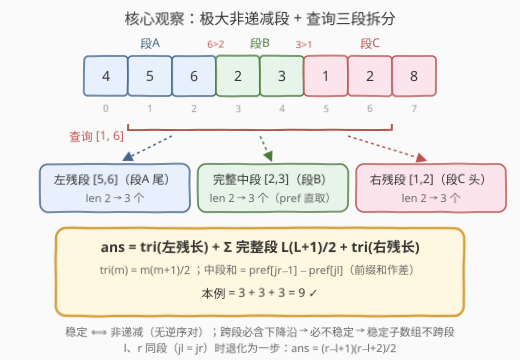
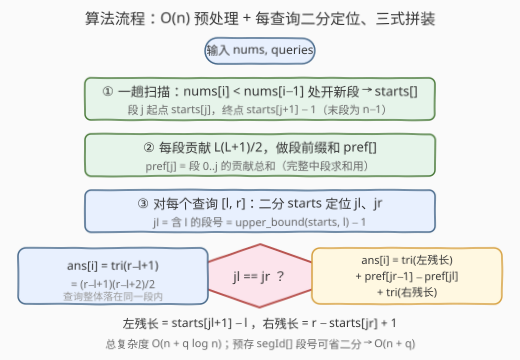

# LeetCode 统计稳定子数组的数目 题解

## 1. 题目概述

- **标题 / 题号**：统计稳定子数组的数目（#3748，hard）
- **链接**：https://leetcode.cn/problems/count-stable-subarrays/
- **难度**：困难
- **标签**：数组、二分查找、前缀和

**题意**：给你一个整数数组 `nums`。如果 `nums` 的一个**子数组**中**没有逆序对**——即不存在满足 $i < j$ 且 $\text{nums}[i] > \text{nums}[j]$ 的下标对——则该子数组被称为**稳定**子数组。

同时给你一个长度为 $q$ 的二维整数数组 `queries`，其中每个 `queries[i] = [li, ri]` 表示一个查询。对于每个查询 $[l_i, r_i]$，请你计算**完全包含**在 $\text{nums}[l_i..r_i]$ 内的稳定子数组的数量。

返回一个长度为 $q$ 的整数数组 `ans`，其中 `ans[i]` 是第 $i$ 个查询的答案。

注意：

- 子数组是数组中一个**连续**且**非空**的元素序列；
- 单个元素的子数组被认为是稳定的。

**示例 1**：

```text
输入：nums = [3,1,2], queries = [[0,1],[1,2],[0,2]]
输出：[2,3,4]
解释：
- 查询 [0,1]：稳定的有 [3]、[1]，共 2 个（[3,1] 含逆序对 3>1，不稳定）。
- 查询 [1,2]：稳定的有 [1]、[2]、[1,2]，共 3 个。
- 查询 [0,2]：稳定的有 [3]、[1]、[2]、[1,2]，共 4 个（[3,1,2]、[3,1]、[1,2] 之外的跨下降沿者均不稳定）。
```

**示例 2**：

```text
输入：nums = [2,2], queries = [[0,1],[0,0]]
输出：[3,1]
解释：
- 查询 [0,1]：稳定的有 [2]、[2]、[2,2]，共 3 个——相等不算逆序，[2,2] 稳定。
- 查询 [0,0]：只有 [2]，共 1 个。
```

**约束**：

- $1 \le \text{nums.length} \le 10^5$
- $1 \le \text{nums}[i] \le 10^5$
- $1 \le \text{queries.length} \le 10^5$
- `queries[i] = [li, ri]` 且 $0 \le l_i \le r_i \le \text{nums.length} - 1$

> 💡 **审题关键**：①「没有逆序对」⇔ **非递减**——只需相邻对全部 $\le$，允许相等（示例 2 的 `[2,2]` 稳定），别误读成严格递增；② $n$、$q$ 均达 $10^5$，逐查询独立枚举子数组是 $O(q \cdot n^2)$ 量级，必须**一次预处理、每查询快速应答**；③ 单查询答案上限 $\frac{n(n+1)}{2} \approx 5 \times 10^9$，超出 32 位整数范围，C++ 计数必须落在 `long long` 上。

## 2. 解题思路

### 2.1 暴力思路：每个查询独立枚举

对每个查询 $[l, r]$，双重循环枚举其中所有子数组 $[i, j]$（$l \le i \le j \le r$）并检查非递减。利用「固定左端 $i$ 向右扩展 $j$，一旦 $\text{nums}[j] < \text{nums}[j-1]$ 即可停止」的短路，单查询最坏 $O(\text{len}^2)$——查询覆盖一个完全非递减数组时取满。

$n = q = 10^5$ 且数组整体非递减时，总量达 $q \cdot n^2 / 4 \approx 2.5 \times 10^{14}$，彻底超时。瓶颈在于：**同一个位置的稳定结构被不同查询反复计算**。稳定子数组由数组的「非递减段」结构完全决定，应当把这个结构一次性提取出来，让每个查询只做轻量拼装。

### 2.2 核心观察：极大非递减段 + 查询三段拆分



**观察一（结构）**：把 `nums` 按「下降沿」切分——每遇到 $\text{nums}[i] < \text{nums}[i-1]$ 就开新段——得到若干**极大非递减段**。任一稳定子数组必然**完整落在某一个段内**：一旦跨过两个段，就必然包含某个下降沿 $\text{nums}[i-1] > \text{nums}[i]$，即含逆序对（相邻逆序 $\Rightarrow$ 子数组有逆序对）。反过来，段内任意连续子数组都非递减，都稳定。

**观察二（段内计数）**：长度为 $L$ 的段内，任意区间 $[i, j]$ 都是稳定子数组，共 $L + (L-1) + \cdots + 1 = \frac{L(L+1)}{2}$ 个（$L$ 个长度 1、$L-1$ 个长度 2、……、1 个长度 $L$）。

**观察三（查询三段拆分）**：查询 $[l, r]$ 与段的结构只有三种交：

- **左残段**：含 $l$ 的段被 $[l, r]$ 截去左部，剩下 $[l, \dots]$，设长 $L_{\text{left}}$，贡献 $\frac{L_{\text{left}}(L_{\text{left}}+1)}{2}$；
- **完整中段**：被 $[l, r]$ 完整吞下的段，每段按观察二贡献 $\frac{L_j(L_j+1)}{2}$；
- **右残段**：含 $r$ 的段被截去右部，剩下 $[\dots, r]$，设长 $L_{\text{right}}$，贡献 $\frac{L_{\text{right}}(L_{\text{right}}+1)}{2}$。

三部分互不重叠，又覆盖了 $[l, r]$ 内所有稳定子数组（因为稳定子数组不跨段），**不重不漏**。当 $l, r$ 同段时，唯一一段同时扮演「左残」与「右残」，直接对 $r - l + 1$ 套观察二即可。于是答案公式（$l, r$ 不同段时）：

$$\text{ans} = \underbrace{\frac{L_{\text{left}}(L_{\text{left}}+1)}{2}}_{\text{左残段}} + \underbrace{\sum_{\text{完整中段 } j} \frac{L_j(L_j+1)}{2}}_{\text{前缀和一把抓}} + \underbrace{\frac{L_{\text{right}}(L_{\text{right}}+1)}{2}}_{\text{右残段}}$$

完整中段是**编号连续**的一批段，用段贡献的**前缀和** $O(1)$ 求和；含 $l$ / 含 $r$ 的段号用**二分**在段起点数组上定位——这正是标签里 Prefix Sum 与 Binary Search 的由来。上图中 `nums = [4,5,6,2,3,1,2,8]` 切出三段，查询 $[1, 6]$ 拆成「段A 尾部 + 段B 整段 + 段C 头部」，$3 + 3 + 3 = 9$。

### 2.3 算法流程图



**预处理（$O(n)$）**：

1. 扫描一遍 `nums`，遇到 $\text{nums}[i] < \text{nums}[i-1]$ 就记录新段起点，得 `starts[]`（段起点下标，天然升序，`starts[0] = 0`）；段 $j$ 的终点即 `starts[j+1] - 1`（末段终点为 $n - 1$）。
2. 对每段计算贡献 $\frac{L_j(L_j+1)}{2}$ 并做前缀和 `pref[j]`。

**应答查询（$O(\log n)$）**：对 $[l, r]$：

1. `jl = upper_bound(starts, l) - 1`：起点 $\le l$ 的最大段号，即含 $l$ 的段；同理得 `jr`；
2. 若 `jl == jr`：$\text{ans} = \frac{(r-l+1)(r-l+2)}{2}$；
3. 否则：左残长 $= \text{starts}[jl+1] - l$，右残长 $= r - \text{starts}[jr] + 1$，中段和 $= \text{pref}[jr-1] - \text{pref}[jl]$，三项相加。

### 2.4 示例演算

**示例 1：nums = [3,1,2]（答案 [2, 3, 4]）**：

下降沿出现在下标 1（$1 < 3$），划分出两段：段 0 = `[3]`（$L=1$，贡献 1）、段 1 = `[1,2]`（$L=2$，贡献 3）。`starts = [0, 1]`，`pref = [1, 4]`。

| 查询 | jl / jr | 左残段 | 完整中段 | 右残段 | ans |
|------|---------|--------|----------|--------|-----|
| [0, 1] | 0 / 1 | `[3]`，len 1 → 1 | 无（pref[0]−pref[0] = 0） | `[1]`，len 1 → 1 | **2** |
| [1, 2] | 1 / 1 | 同段：tri(2) = 2×3/2 | — | — | **3** |
| [0, 2] | 0 / 1 | `[3]` → 1 | 无 | `[1,2]`，len 2 → 3 | **4** |

**示例 2：nums = [2,2]**：无下降沿，只有一段 `[2,2]`（贡献 3）。查询 [0,1] 同段 → tri(2) = 3；查询 [0,0] 同段 → tri(1) = 1。✓

## 3. 参考代码

### C++

```cpp
class Solution {
public:
    vector<long long> countStableSubarrays(vector<int>& nums, vector<vector<int>>& queries) {
        int n = nums.size();
        // ① 一趟扫描划分极大非递减段：starts[j] 为段 j 的起点
        vector<int> starts;
        starts.push_back(0);
        for (int i = 1; i < n; ++i) {
            if (nums[i] < nums[i - 1]) starts.push_back(i);
        }
        int k = (int)starts.size();
        // ② 每段贡献 L(L+1)/2，做段前缀和；段 j 终点 = starts[j+1] - 1（末段为 n-1）
        vector<long long> pref(k);
        for (int j = 0; j < k; ++j) {
            long long L = (j + 1 < k ? starts[j + 1] : n) - starts[j];
            pref[j] = (j ? pref[j - 1] : 0) + L * (L + 1) / 2;
        }
        auto segOf = [&](int x) {   // 含 x 的段号 = 起点 <= x 的最大段号
            return int(upper_bound(starts.begin(), starts.end(), x) - starts.begin()) - 1;
        };
        auto tri = [](long long m) { return m * (m + 1) / 2; };  // 1+2+...+m
        vector<long long> ans;
        ans.reserve(queries.size());
        for (auto& qry : queries) {
            int l = qry[0], r = qry[1];
            int jl = segOf(l), jr = segOf(r);
            if (jl == jr) {
                ans.push_back(tri(r - l + 1));            // l、r 同段：直接套公式
            } else {
                long long lenL = starts[jl + 1] - l;      // 左残段长
                long long lenR = r - starts[jr] + 1;      // 右残段长
                long long mid = pref[jr - 1] - pref[jl];  // 完整中段贡献和
                ans.push_back(tri(lenL) + mid + tri(lenR));
            }
        }
        return ans;
    }
};
```

> 💡 **写法要点**：
> - `starts[0] = 0` 恒存在，任何下标 $x \ge 0$ 二分结果 $\ge 0$，不会越界；`l ≤ r` 保证 `jl ≤ jr`；
> - `jl < jr` 时 `jl + 1 ≤ jr ≤ k-1`，`starts[jl+1]` 必然合法，左残长直接写成 `starts[jl+1] - l` 无需分支；`jr - 1 ≥ jl ≥ 0`，`pref` 作差安全；
> - 贡献 $\frac{L(L+1)}{2}$ 在 $L = 10^5$ 时约 $5 \times 10^9$，`pref` 与答案都必须 `long long`（本题返回类型已是 `vector<long long>`）；
> - `l == r` 时必然 `jl == jr`，走同段分支得 1，无需特判。

### Python

```python
from bisect import bisect_right

class Solution:
    def countStableSubarrays(self, nums: List[int], queries: List[List[int]]) -> List[int]:
        n = len(nums)
        # ① 一趟扫描划分极大非递减段
        starts = [0]
        for i in range(1, n):
            if nums[i] < nums[i - 1]:
                starts.append(i)
        k = len(starts)
        # ② 每段贡献 L(L+1)/2，做段前缀和
        pref = [0] * k
        for j in range(k):
            L = (starts[j + 1] if j + 1 < k else n) - starts[j]
            pref[j] = (pref[j - 1] if j else 0) + L * (L + 1) // 2

        def seg_of(x: int) -> int:      # 含 x 的段号
            return bisect_right(starts, x) - 1

        def tri(m: int) -> int:         # 1+2+...+m
            return m * (m + 1) // 2

        ans = []
        for l, r in queries:
            jl, jr = seg_of(l), seg_of(r)
            if jl == jr:
                ans.append(tri(r - l + 1))
            else:
                len_l = starts[jl + 1] - l          # 左残段长
                len_r = r - starts[jr] + 1          # 右残段长
                mid = pref[jr - 1] - pref[jl]       # 完整中段贡献和
                ans.append(tri(len_l) + mid + tri(len_r))
        return ans
```

> 💡 **写法要点**：
> - `bisect_right(starts, x) - 1` 与 C++ `upper_bound - 1` 同义：返回「起点 ≤ x 的最大段号」，即包含下标 x 的段；
> - 段划分、前缀和、查询拼装三段逻辑与 C++ 版一一对应，Python 整数无溢出问题。

## 4. 复杂度分析

| 维度 | 复杂度 | 说明 |
|------|--------|------|
| **时间** | $O(n + q \log n)$ | 预处理一趟扫描 + 段前缀和 $O(n)$；每查询两次二分 $O(\log n)$（预存 `segId[]` 可降到每查询 $O(1)$，见第 5 节） |
| **空间** | $O(n)$ | 段起点数组 `starts` 与前缀和 `pref`，长度为段数 $\le n$ |
| **对比暴力法** | $O(q \cdot n^2) \to O(n + q \log n)$ | 暴力对每个查询独立枚举；本题把「稳定 ⟺ 段内」的结构一次性提取，每个查询退化为三次 $O(1)$ 公式 + 两次二分 |

## 5. 扩展：O(1) 应答与「以 i 结尾」前缀和视角

**改法一：预存段号，去掉二分**。预处理时直接为每个下标计算 `segId[i]`（含 $i$ 的段号）与 `segStart[i]` / `segEnd[i]`（该段起终点），查询时 `jl = segId[l]`、`jr = segId[r]`、左残长 = `segEnd[jl] - l + 1`，全部 $O(1)$，总复杂度 $O(n + q)$——空间仍是 $O(n)$，只是多两个满长度数组。二分版的优势是预处理只存 $O(\text{段数})$ 个信息：数组近乎有序时段数极少，缓存更友好。

**改法二（官方 hint 的视角）：以 $i$ 结尾计数 + 前缀和作差**。令 $f[i] = i - \text{start}[i] + 1$（以 $i$ 结尾的稳定子数组个数，即从 $i$ 向左能延伸到段头的长度），$P[i] = \sum_{t \le i} f[t]$，则 $[0, r]$ 内稳定子数组总数为 $P[r]$，于是

$$\text{ans}(l, r) = P[r] - P[l-1] - \text{cross}, \qquad \text{cross} = (\min(r, e) - l + 1) \cdot (l - s)$$

其中 $s$、$e$ 是含 $l$ 的段的起点与终点：跨界子数组（起点在 $l$ 之前、终点落在 $[l, r]$ 内）只可能属于这一段，每个终点 $j \in [l, \min(r, e)]$ 各贡献 $l - s$ 个起点。两个视角代数上完全等价——**段拆分版**把修正集中在边界两段、几何直觉更顺；**作差版**把修正集中成左边界一个乘积式、代码更短。面试时讲清其一、点出另一即可。

## 6. 面试要点

**Q1：「没有逆序对」为什么等价于非递减？**

> 若存在 $i < j$ 且 $\text{nums}[i] > \text{nums}[j]$，则 $i$ 到 $j$ 之间必有某相邻对下降（否则相邻全 $\le$ 传递出 $\text{nums}[i] \le \text{nums}[j]$，矛盾）；反之相邻对下降本身就是逆序对。故「无逆序对」⇔「相邻全非降」⇔ 非递减，允许相等元素。

**Q2：为什么长度 $L$ 的段贡献 $\frac{L(L+1)}{2}$？**

> 段内任意连续区间都非递减、都稳定，子数组总数即区间数 $L + (L-1) + \cdots + 1$。按右端点看更直观：以 $j$ 结尾的稳定子数组恰有 $j - \text{start} + 1$ 个（左端可取段头到 $j$），对 $j$ 求和即得。

**Q3：三段拆分为什么不重不漏？**

> 稳定子数组不跨段 ⇒ $[l, r]$ 内每个稳定子数组落在唯一一段。按「段与 $[l, r]$ 的交」分类：含 $l$ 的段交出左残、含 $r$ 的段交出右残（同段时合并特判）、中间的段被完整包含。各交是互不相交的连续区间，段内计数公式对任意连续子区间成立，拼装即得总数。

**Q4：二分在哪个数组上做？边界如何保证？**

> 在段起点数组 `starts`（升序，`starts[0] = 0` 恒存在）上 `upper_bound(x) - 1`，得「起点 ≤ x 的最大段号」即含 x 的段。因 `starts[0] = 0 ≤` 任何下标，结果 ≥ 0 永不越界；`l ≤ r` 保证 `jl ≤ jr`，作差下标全部合法。

**Q5：数值与边界上有哪些坑？**

> ① 答案上界 $\binom{n+1}{2} \approx 5 \times 10^9$ 超 int32，C++ 用 `long long`；② `l == r` 时同段分支自然给出 1，无需特判；③ 查询恰好覆盖若干整段（`l`、`r` 都贴段边界）时，左残 = 含 $l$ 段全长、右残 = 含 $r$ 段全长，公式自动成立；④ 切段条件是**严格小于**——相等元素不切段（`[2,2]` 是一个段）。

> 💡 **一句话总结**：稳定 ⟺ 非递减 ⟺ 不跨段 ⇒ 按下降沿切成极大非递减段；段内贡献 $\frac{L(L+1)}{2}$ 做前缀和，查询拆「左残 + 完整中段 + 右残」三式拼装，二分定位段号，$O(n + q\log n)$ 收工。

## 同类练习题

| # | 题目 | 与本题的关联 |
|---|------|-------------|
| 674 | [最长连续递增序列](https://leetcode.cn/problems/longest-continuous-increasing-subsequence/)（[题解](../0601-0700/674_最长连续递增序列.md)） | 同样的「极大单调段」结构意识，本题结构预处理一步的单查询版 |
| 3738 | [替换至多一个元素后最长非递减子数组](https://leetcode.cn/problems/longest-non-decreasing-subarray-after-replacing-at-most-one-element/)（[题解](../3701-3800/3738_替换至多一个元素后最长非递减子数组.md)） | 同样围绕非递减游程做文章，换成「前后缀游程桥接」求最长 |
| 303 | [区域和检索 - 数组不可变](https://leetcode.cn/problems/range-sum-query-immutable/)（[题解](../0301-0400/303_区域和检索 - 数组不可变.md)） | 前缀和应答区间查询的母题，本题把「数值前缀和」换成「段贡献前缀和」 |
| 713 | [乘积小于K的子数组](https://leetcode.cn/problems/subarray-product-less-than-k/)（[题解](../0701-0800/713_乘积小于K的子数组.md)） | 以右端点计数合法子数组的一趟统计，与「以 i 结尾」视角同源 |
| 2444 | [统计定界子数组的数目](https://leetcode.cn/problems/count-subarrays-with-fixed-bounds/)（[题解](../2401-2500/2444_统计定界子数组的数目.md)） | 另一种「按最近违规位置划段」的子数组计数，与本题的下降沿切分思想相通 |
