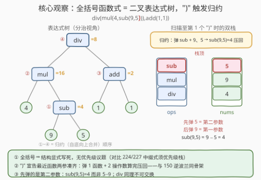
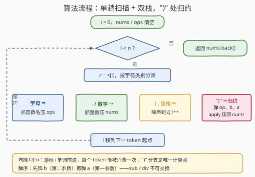

# 计算有效表达式

- **题目名称**：计算有效表达式
- **链接**：[3749. 计算有效表达式](https://leetcode.cn/problems/evaluate-valid-expressions/)
- **难度**：困难
- **标签**：栈、哈希表、数学、字符串、分治

## 1. 题目概述

> ⚠️ 本题为 LeetCode 付费题，题意描述根据官方示例用例与 hints 重建，可能与官方题面有出入。

给你一个字符串 `expression` 表示一个算术表达式。题目保证表达式**合法**（题名中的 *valid* 即指输入无需校验），它由以下成分构成：

- **整数字面量**：十进制整数，可带负号，如 `42`、`-42`；
- **二元函数调用**：`add(a, b)`、`sub(a, b)`、`mul(a, b)`、`div(a, b)`，分别计算 $a+b$、$a-b$、$a \times b$、$a \div b$；
- 每个函数**恰好两个参数**，参数本身可以是任意嵌套的表达式。

其中 `div` 为整数除法，**向零截断**（与 C++ / Java 的 `/` 语义一致，重建口径）。请计算并返回整个表达式的值。

**示例 1**：

```text
输入：expression = "add(2,3)"
输出：5
解释：add(2, 3) = 2 + 3 = 5。
```

**示例 2**：

```text
输入：expression = "-42"
输出：-42
解释：单独一个（负）整数字面量也是合法表达式。
```

**示例 3**：

```text
输入：expression = "div(mul(4,sub(9,5)),add(1,1))"
输出：8
解释：sub(9,5) = 4 → mul(4,4) = 16 → add(1,1) = 2 → div(16,2) = 8。
```

**约束条件**（按题意重建，原始约束以官方为准）：

- $1 \le |\text{expression}| \le 10^5$；
- 字面量与中间结果均在 **64 位整数**范围内（返回类型为 `long`）；
- 表达式合法：括号匹配、函数名属于上述四种、每函数恰两参数、`div` 的除数非零。

> 💡 **审题关键**：① 语法是**函数式全括号前缀式**（Lisp S 表达式的换皮）——没有中缀运算符，`-` 只作为字面量的符号位出现，**运算符优先级的整个议题不存在**；② `div` 向零截断，Python 的 `//` 是向下取整，负数场景两者不同；③ 结果 64 位，C++ 必须 `long long`；④ 嵌套深度可达 $O(n)$，递归写法有爆栈风险。

---

## 2. 解题思路

### 2.1 暴力思路：递归 + 子串切片

最直觉的写法：整体是一个「函数(参数1,参数2)」或单独一个字面量——

```python
def brute(s):
    if not s[0].isalpha():              # 字面量
        return int(s)
    k = s.index('(')
    fn = s[:k]
    depth = 0                           # 扫出顶层逗号（深度为 1 处的那个）
    for j in range(k, len(s)):
        if s[j] == '(': depth += 1
        elif s[j] == ')': depth -= 1
        elif s[j] == ',' and depth == 1: break
    a, b = brute(s[k + 1:j]), brute(s[j + 1:-1])
    return apply(fn, a, b)
```

正确，但每层递归都要**重新扫描并切片复制**子串：深度为 $d$ 时总代价 $O(n \cdot d)$，链式嵌套（如 `add(add(add(...)))`）退化为 $O(n^2)$；递归栈深也是 $O(n)$。问题出在「同一批字符被反复扫、反复复制」——能不能每个字符**只看一次**？

### 2.2 核心观察：全括号前缀式，`)` 触发归约



三个层层递进的观察：

**观察一：优先级议题整个消失。** 中缀式 `2+3*4` 需要优先级规则，是因为同一个记号流对应多棵语法树；而 `mul(add(2,3),4)` 与 `add(2,mul(3,4))` 是**两个不同的字符串**、对应两棵不同的树——结构在字面上已经写死。这是本题与 [224](../0201-0300/224_基本计算器.md)/227 计算器系列的**本质区别**：后者必须维护优先级栈，前者完全不需要。

**观察二：表达式是一棵二叉树。** 内节点是函数、叶子是字面量（见上图左侧）。求值 = 自底向上把子树值合并进父节点——这正是「分治」标签的来源，递归下降天然对应。

**观察三：`)` 是「右子树完工」的信号。** 括号的嵌套保证：**读到某个 `)` 时，离它最近的那个未完成函数的两个参数必然恰好都在操作数栈顶**。于是自底向上的合并可以摊平成单趟扫描，`(` 与 `,` 只是结构噪声，每遇到 `)` 做一次**归约**（reduce）：

- 弹 `ops` 栈顶 1 个函数名；
- 弹 `nums` 栈顶 2 个操作数——**先弹的是第二个参数 $b$，后弹的是第一个参数 $a$**（`sub`/`div` 不可交换，顺序不能反）；
- 计算 $\text{apply}(fn, a, b)$，结果压回 `nums`。

> 💡 这与 [150. 逆波兰表达式求值](../0101-0200/150_逆波兰表达式求值.md)是同一副骨架：**操作数栈 + 「触发器到来即归约」**。RPN 的触发器是运算符 token 本身，本题的触发器是 `)`；每次归约消耗的操作数个数，RPN 是 2，本题也是 2（二元函数）。此外「函数名 → 运算」的映射（`add→+` 等）就是哈希表标签的出处——参考代码用 `if` 分支展开，等价于查一张四行的小表。

### 2.3 算法流程图



**逻辑执行步骤**：

| 步骤 | 操作 | 说明 |
|------|------|------|
| ① 初始化 | `i = 0`，`nums`/`ops` 清空 | 双栈：操作数 + 待完成函数 |
| ② 终止判定 | `i < n`？否 ⇒ 返回 `nums` 顶 | 合法表达式终态 `nums` 恰剩 1 个数 |
| ③ 取字符 | `c = s[i]` 按类别分派 | 四类 token 四条路 |
| ④ 字母 | 抓完整函数名压 `ops` | `add`/`sub`/`mul`/`div` |
| ⑤ `−`/数字 | 抓完整（负）整数压 `nums` | `-` 只作符号位，直通数字分支 |
| ⑥ `(` `,` 空格 | 跳过 | 纯结构噪声 |
| ⑦ `)` | **归约**：弹 `op`、弹 `b`、弹 `a` → `apply` 压回 | 全算法唯一的计算发生点 |
| ⑧ 推进 | `i` 移到下一 token 起点 | 回到 ② |

### 2.4 示例演算

**示例 3**：`div(mul(4,sub(9,5)),add(1,1))` 的双栈轨迹（栈底 → 栈顶）：

| 读到 | 动作 | nums | ops |
|------|------|------|-----|
| `div` `(` | 函数名入栈 | （空） | div |
| `mul` `(` | 函数名入栈 | （空） | div, mul |
| `4` `,` | 整数入栈 | 4 | div, mul |
| `sub` `(` | 函数名入栈 | 4 | div, mul, sub |
| `9` `,` `5` | 整数入栈 | 4, 9, 5 | div, mul, sub |
| `)` | **归约** sub：先弹 $b=5$ 再弹 $a=9$ → 4 | 4, 4 | div, mul |
| `)` | **归约** mul：$b=4$, $a=4$ → 16 | 16 | div |
| `,` `add` `(` | 函数名入栈 | 16 | div, add |
| `1` `,` `1` | 整数入栈 | 16, 1, 1 | div, add |
| `)` | **归约** add：$b=1$, $a=1$ → 2 | 16, 2 | div |
| `)` | **归约** div：$b=2$, $a=16$ → **8** | 8 | （空） |

扫描结束 `nums` 恰剩 `[8]`，即为答案。注意连续两个 `)` 的**级联归约**：内层 `sub` 的结果 4 刚压回，立刻成为外层 `mul` 的第二参数——树的自底向上合并就这样被括号序列「编码」进了线性扫描。

---

## 3. 参考代码

### 方法一：双栈单趟扫描（推荐）

### C++

```cpp
class Solution {
  public:
    long long evaluateExpression(string expression) {
        const string& s = expression;
        int n = s.size(), i = 0;
        vector<long long> nums;   // 操作数栈
        vector<string> ops;       // 待完成函数栈

        auto apply = [](const string& op, long long a, long long b) -> long long {
            if (op == "add") return a + b;
            if (op == "sub") return a - b;
            if (op == "mul") return a * b;
            long long q = llabs(a) / llabs(b);          // div：向零截断
            return ((a < 0) ^ (b < 0)) ? -q : q;
        };

        while (i < n) {
            char c = s[i];
            if (c == ' ' || c == '(' || c == ',') {
                i++;                                       // 结构噪声
            } else if (c == ')') {                         // 归约触发器
                string op = move(ops.back()); ops.pop_back();
                long long b = nums.back(); nums.pop_back(); // 第二参数先弹
                long long a = nums.back(); nums.pop_back(); // 第一参数
                nums.push_back(apply(op, a, b));
                i++;
            } else if (c == '-' || isdigit((unsigned char)c)) {
                int j = (c == '-') ? i + 1 : i;             // 负数字面量
                while (j < n && isdigit((unsigned char)s[j])) j++;
                nums.push_back(stoll(s.substr(i, j - i)));
                i = j;
            } else {                                       // 函数名
                int j = i;
                while (j < n && isalpha((unsigned char)s[j])) j++;
                ops.emplace_back(s.substr(i, j - i));
                i = j;
            }
        }
        return nums.back();
    }
};
```

### Python

```python
class Solution:
    def evaluateExpression(self, expression: str) -> int:
        s, n, i = expression, len(expression), 0
        nums, ops = [], []

        def apply(op, a, b):
            if op == 'add': return a + b
            if op == 'sub': return a - b
            if op == 'mul': return a * b
            q = abs(a) // abs(b)                # div：向零截断
            return -q if (a < 0) != (b < 0) else q

        while i < n:
            c = s[i]
            if c in ' (,':
                i += 1                          # 结构噪声
            elif c == ')':                      # 归约触发器
                op = ops.pop()
                b = nums.pop()                  # 第二参数先弹
                a = nums.pop()
                nums.append(apply(op, a, b))
                i += 1
            elif c == '-' or c.isdigit():       # 负数字面量
                j = i + 1 if c == '-' else i
                while j < n and s[j].isdigit():
                    j += 1
                nums.append(int(s[i:j]))
                i = j
            else:                               # 函数名
                j = i
                while j < n and s[j].isalpha():
                    j += 1
                ops.append(s[i:j])
                i = j
        return nums[-1]
```

> 💡 **写法要点**：
> - **弹序即语义**：`b` 先弹、`a` 后弹，`sub(9,5)` 算 $9-5$ 而非 $5-9$——`sub`/`div` 不可交换，这是本题最典型的 WA 点；
> - **div 的 Python 实现**：`//` 对负数向下取整（$-7 \,//\, 2 = -4$，而向零截断应为 $-3$）；`int(a/b)` 走浮点，$|a|>2^{53}$ 时丢精度。正解是「绝对值商 + 异号取负」；
> - **`-` 直通数字分支**：语法中没有中缀减法（减法是 `sub` 函数），见到 `-` 必是字面量符号位；
> - **`long long` / `stoll`**：64 位返回值，`int` 与 `atoi` 都会静默溢出；
> - 付费题无官方代码模板，函数签名（参数/返回类型）按 `long` 推定，提交时以实际签名为准微调。

### 方法二：递归下降（分治视角）

每个 `parse()` 调用消费「一个完整子表达式」，共享游标 `i` 前进、不切片——比 2.1 的暴力版省掉了重复扫描与复制。

### Python

```python
class Solution:
    def evaluateExpression(self, expression: str) -> int:
        s, n = expression, len(expression)
        i = 0

        def apply(op, a, b):
            if op == 'add': return a + b
            if op == 'sub': return a - b
            if op == 'mul': return a * b
            q = abs(a) // abs(b)
            return -q if (a < 0) != (b < 0) else q

        def parse() -> int:              # 消费一个完整子表达式并返回其值
            nonlocal i
            while s[i] == ' ':                     # 跳过空格
                i += 1
            if s[i] == '-' or s[i].isdigit():      # 字面量
                j = i + 1 if s[i] == '-' else i
                while j < n and s[j].isdigit():
                    j += 1
                val = int(s[i:j]); i = j
                return val
            j = i                                    # 函数名
            while s[j] != '(':
                j += 1
            op = s[i:j]
            i = j + 1                                # 跳过 '('
            a = parse()                              # 第一参数（分治左）
            while s[i] != ',':
                i += 1
            i += 1                                   # 跳过 ','
            b = parse()                              # 第二参数（分治右）
            i += 1                                   # 跳过 ')'
            return apply(op, a, b)

        return parse()
```

### C++

```cpp
class Solution {
    string s;
    int n, i = 0;

    long long apply(const string& op, long long a, long long b) {
        if (op == "add") return a + b;
        if (op == "sub") return a - b;
        if (op == "mul") return a * b;
        long long q = llabs(a) / llabs(b);
        return ((a < 0) ^ (b < 0)) ? -q : q;
    }

    long long parse() {
        while (s[i] == ' ') i++;                         // 跳过空格
        if (s[i] == '-' || isdigit((unsigned char)s[i])) {   // 字面量
            int j = (s[i] == '-') ? i + 1 : i;
            while (j < n && isdigit((unsigned char)s[j])) j++;
            long long val = stoll(s.substr(i, j - i));
            i = j;
            return val;
        }
        int j = i;                                          // 函数名
        while (s[j] != '(') j++;
        string op = s.substr(i, j - i);
        i = j + 1;                                          // '('
        long long a = parse();                              // 左分治
        while (s[i] != ',') i++;
        i++;                                                // ','
        long long b = parse();                              // 右分治
        i++;                                                // ')'
        return apply(op, a, b);
    }

  public:
    long long evaluateExpression(string expression) {
        s = move(expression);
        n = s.size();
        i = 0;                                              // 游标复位，支持多次调用
        return parse();
    }
};
```

> ⚠️ **深度警告**：链式嵌套（`add(add(add(…)))`）使递归深度达 $O(n)$。Python 默认递归上限 1000，深嵌套直接 `RecursionError`；C++ 栈帧小通常能扛，但保险起见**面试首选方法一**——迭代栈把「深度」放进堆上的 `vector`，天然免疫。

---

## 4. 复杂度分析

| 维度 | 方法 | 复杂度 | 说明 |
|------|------|--------|------|
| 时间 | 双栈扫描 | $O(n)$ | 每个 token 恰被消费一次，`)` 的归约均摊 $O(1)$ |
| 空间 | 双栈扫描 | $O(n)$ | 栈深 ∝ 嵌套深度，链式嵌套最坏 $O(n)$ |
| 时间 | 递归下降 | $O(n)$ | 共享游标不切片，每字符常数次访问 |
| 空间 | 递归下降 | $O(d)$ | $d$ 为嵌套深度（递归栈），最坏 $O(n)$ |
| 时间 | 暴力切片 | $O(n \cdot d)$ | 每层重扫子串定位分隔符，链式嵌套退化 $O(n^2)$ |

> ⚠️ 双栈版 `while` 里嵌了「抓 token」的内层循环，看似两层，实则**游标 `i` 单调前进**——内层循环消费的字符外层不会再碰，总扫描量就是 $n$，属均摊 $O(n)$，与 42 接雨水的「每下标进出栈各一次」同理。

---

## 5. 扩展：如果表达式不保证合法

本题题名承诺 *valid*，若去掉该保证，求值器要升级为「校验 + 求值」一体：

- **括号匹配**：`)` 到来时 `ops` 为空 ⇒ 不匹配；扫描结束 `ops` 非空 ⇒ 有 `(` 未闭合；
- **函数名合法**：归约时查函数表（哈希表）查不到即报错——把 `apply` 从 `if` 链换成 `unordered_map<string, Fn>`，正是标签里「哈希表」的正统用法；
- **参数个数**：二元函数要求 `)` 之前恰有一个**顶层逗号**（深度为 1 处），且 `nums` 可弹出 2 个数——弹不够即参数缺失；
- **除零**：`div` 的 $b = 0$ 时报错或按题意返回哨兵值；
- **残留噪声**：扫描结束 `nums` 元素个数 ≠ 1（如 `add(1,2)3`）⇒ 非法。

进一步的变体：函数支持**变长参数**（`add(1,2,3)`，归约时数逗号）；支持**变量**（`let(x,5,add(x,x))`，需哈希表环境 + 作用域栈）；支持**一元负号函数** `neg(x)`。骨架不变：token 分派 + `)` 归约，变的只是归约时的动作。

---

## 6. 面试要点

**Q1：为什么本题完全不需要处理运算符优先级？**

> 语法是全括号前缀式：`mul(add(2,3),4)` 与 `add(2,mul(3,4))` 是不同字符串、对应不同语法树，结构由括号显式给出，记号流到树不存在第二种拼法。中缀式才需要优先级规则消歧，这正是本题比 224/227 系列反而好写的地方。

**Q2：归约时操作数的弹出顺序为什么重要？**

> 栈顶是**后压入**的值，而第二参数在第一参数之后被扫描、之后压入，所以**先弹的是 $b$（第二参数）**。`add`/`mul` 可交换无所谓，但 `sub(9,5)` 弹反了会算成 $5-9$、`div` 同理——这是本题最高频的 WA 点。

**Q3：Python 里如何正确实现向零截断的除法？为什么 `int(a/b)` 不行？**

> `//` 是向下取整，$-7 \,//\,2=-4$ 而向零截断应为 $-3$；`int(a/b)` 依赖浮点，$|a|>2^{53}$ 时精度丢失会算错。正解：$q = |a| \,//\, |b|$，异号取负。C++ 的 `/` 对整数本就是向零截断，直接用。

**Q4：递归解法在什么输入下会出问题？**

> 链式嵌套使深度达 $O(n)$：Python 默认递归上限 1000 会 `RecursionError`（可 `sys.setrecursionlimit` 续命但有爆栈风险）；C++ 栈帧小通常可过但不保险。迭代双栈版把深度转移到堆上的栈容器，彻底免疫。

**Q5：本题与 150 逆波兰表达式求值的同构关系？**

> 同一副骨架：操作数栈 + 触发器归约。RPN 触发器是运算符 token（后缀），本题触发器是 `)`（全括号前缀式的「子表达式完工」信号），每次归约同样消费 2 个操作数。进一步：中缀式 227 的触发器是「新运算符优先级 ≤ 栈顶」——三种记法，一个栈。

> 💡 **一句话总结**：3749 = 把全括号函数式当二叉树的前序序列做**线性化自底向上求值**——字母段压函数名、`−`/数字段压操作数、`(``,` 跳过、`)` 处弹 1 函数 + 2 操作数归约压回；先弹的是第二参数，div 向零截断，全程 `long long`，单趟 $O(n)$。

---

## 7. 同类练习题

- [150. 逆波兰表达式求值](https://leetcode.cn/problems/evaluate-reverse-polish-notation/)（[题解](../0101-0200/150_逆波兰表达式求值.md)）：同一副「操作数栈 + 触发器归约」骨架，后缀记法版
- [224. 基本计算器](https://leetcode.cn/problems/basic-calculator/)（[题解](../0201-0300/224_基本计算器.md)）：中缀 + 括号 + 一元符号，体会「需要优先级处理」的对照面
- [227. 基本计算器 II](https://leetcode.cn/problems/basic-calculator-ii/)（[题解](../0201-0300/227_基本计算器II.md)）：本题官方相似题，中缀优先级栈的标准模板
- [726. 原子的数量](https://leetcode.cn/problems/number-of-atoms/)（[题解](../0701-0800/726_原子的数量.md)）：同为全括号文法的递归/栈解析，归约时合并的是计数表
- [394. 字符串解码](https://leetcode.cn/problems/decode-string/)（[题解](../0301-0400/394_字符串解码.md)）：括号嵌套展开的栈处理，`]` 处归约的结构与本题 `)` 同型
