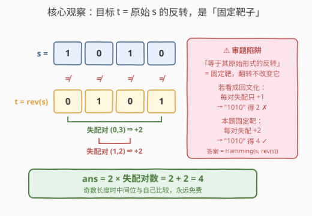
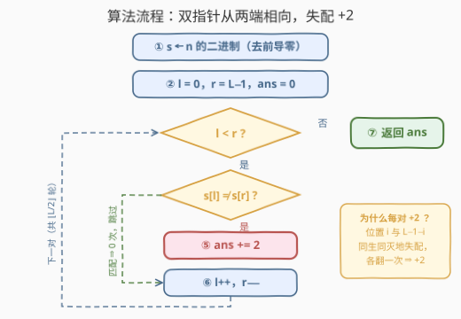

# 最少翻转次数得到反转二进制字符串

- **题目名称**：最少翻转次数得到反转二进制字符串
- **链接**：[3750. 最少翻转次数得到反转二进制字符串](https://leetcode.cn/problems/minimum-number-of-flips-to-reverse-binary-string/)
- **难度**：简单
- **标签**：位运算、数学、双指针、字符串

## 1. 题目概述

给你一个**正**整数 $n$。令 $s$ 为 $n$ 的**二进制表示**（不含前导零）。

二进制字符串 $s$ 的**反转**是指将 $s$ 中的字符按相反顺序排列得到的字符串。

你可以翻转 $s$ 中的任意一位（将 `0 → 1` 或 `1 → 0`）。每次翻转**仅**影响一位。

请返回使 $s$ 等于其**原始形式**的反转所需的**最少**翻转次数。

**示例 1**：

```text
输入：n = 7
输出：0
解释：7 的二进制表示为 "111"。其反转也是 "111"，两者相同，因此不需要翻转。
```

**示例 2**：

```text
输入：n = 10
输出：4
解释：10 的二进制表示为 "1010"，其反转为 "0101"。
      必须翻转所有四位才能使它们相等，因此最少翻转次数为 4。
```

**约束条件**：

- $1 \le n \le 10^9$（即二进制长度 $L \le 30$）

> 💡 **审题关键**：① 目标是**固定靶子**——「其原始形式的反转」在第一次翻转发生之前就已定格，之后无论怎么翻都不变；② 因此本题**不是**「最少翻转使 $s$ 回文化」——回文化每对失配翻任意一边即可（每对 $+1$），本题两端都得翻（每对 $+2$），`"1010"` 是试金石：本题答案 $4$，回文化答案 $2$；③ 每次翻转只影响一位 ⇒ 各位置需求**相互独立**，答案可以逐位判定后直接相加。

---

## 2. 解题思路

### 2.1 暴力思路

枚举翻转方案：$L$ 位每一位「翻 / 不翻」共 $2^L$ 种组合，每种组合翻转后再与目标串逐位比对验证。$L \le 30$ 时 $2^{30} \approx 10^9$，时间直接爆炸。

真正该发现的是：**每一位是否需要翻转只取决于它自己**——翻转第 $i$ 位不会影响其他任何位置与目标的差距。把「全局最少」拆成「逐位独立判定」之后，枚举就完全多余了。

### 2.2 核心观察：固定靶子 + 位独立 ⇒ 汉明距离



设目标串 $t = \text{reverse}(s)$（由**原始** $s$ 一次性生成，之后不变）。$s$ 翻转后等于 $t$，当且仅当每一位都满足 $s[i] = t[i]$。而一次翻转恰好能把 $s[i]$ 改成任意想要的值、且不动其他位，所以：

- $s[i] \ne t[i]$ 的位置：**恰好**需要 $1$ 次翻转；
- $s[i] = t[i]$ 的位置：$0$ 次（翻了还得翻回来，纯浪费）。

各位独立 ⇒ 最少总次数就是**不同位置的个数**，即**汉明距离** $\text{Hamming}(s, \text{reverse}(s))$。

再由对称性进一步压缩：$t[i] = s[L-1-i]$，所以「位置 $i$ 失配」$\iff$ $s[i] \ne s[L-1-i]$——它与「位置 $L-1-i$ 失配」是**同一个条件**，同生同灭。于是失配总是**成对出现**，每对贡献 $2$ 次翻转；奇数长度时中间位与自己比较，**永远免费**：

$$\text{ans} \;=\; 2 \times \#\{\, i < \lfloor L/2 \rfloor \;:\; s[i] \neq s[L-1-i] \,\}$$

以 $s = \text{"1010"}$ 为例（见上图）：$(s[0], s[3]) = (\texttt{1},\texttt{0})$ 失配、$(s[1], s[2]) = (\texttt{0},\texttt{1})$ 失配，两对全中，答案 $2 \times 2 = 4$，与示例 2 一致；$s = \text{"111"}$ 无失配对，答案 $0$，与示例 1 一致。

> ⚠️ **对照陷阱**：若把题意读成「使 $s$ 变成回文」（即与自己**动态的**反转相等），同样的双指针扫描每对失配只加 $1$，`"1010"` 会算出 $2$——错。区分两类题：**目标是固定串**（本题，汉明距离，每对 $+2$）vs **目标是自反性质**（回文化，每对 $+1$，见第 7 节 2697）。

### 2.3 算法流程图



**逻辑执行步骤**：

| 步骤 | 操作 | 说明 |
|------|------|------|
| ① 转二进制 | `s = bin(n)` 去前导零 | $L \le 30$ |
| ② 初始化 | `l = 0, r = L-1, ans = 0` | 双指针从两端相向 |
| ③ 终止判定 | `l >= r`？是 ⇒ **返回 `ans`** | 奇数长度中间位自动跳过（`l == r`） |
| ④ 失配判定 | `s[l] != s[r]`？是 ⇒ `ans += 2` | 一对失配 = 两个位置都要翻 |
| ⑤ 推进 | `l++`，`r--` | 无论失配与否 |
| ⑥ 循环 | 回到 ③ | 共 $\lfloor L/2 \rfloor$ 轮 |

注意 ④ 中失配时**两端各计一次**（$+2$ 而非 $+1$），这是本题与回文化一族题目的全部区别所在。

### 2.4 示例演算

**示例 2**：`n = 10`，`s = "1010"`（下标 `0..3`）：

| 轮次 | `l` | `r` | `s[l]` | `s[r]` | 失配？ | `ans` |
|------|-----|-----|--------|--------|--------|-------|
| 1 | 0 | 3 | `1` | `0` | 是 ⇒ `+2` | 2 |
| 2 | 1 | 2 | `0` | `1` | 是 ⇒ `+2` | 4 |
| — | 2 | 1 | — | — | `l >= r`，终止 | **4** ✓ |

**示例 1**：`n = 7`，`s = "111"`：对 $(0,2)$ 同为 `1` 匹配，中间位 `1` 免费 ⇒ `ans = 0` ✓

---

## 3. 参考代码

### C++

```cpp
class Solution {
public:
    int minimumFlips(int n) {
        string s = bitset<32>(n).to_string();
        s = s.substr(s.find('1'));                 // 去前导零（n ≥ 1 必含 '1'）
        int ans = 0;
        for (int l = 0, r = (int)s.size() - 1; l < r; ++l, --r)
            if (s[l] != s[r]) ans += 2;            // 一对失配 ⇒ 两端各翻一次
        return ans;
    }
};
```

> 💡 **写法要点**：
> - `bitset<32>(n).to_string()` 自带 32 位定长，`find('1')` 一步去掉前导零（$n \ge 1$ 保证存在）；
> - 失配加 **2** 不是 1——目标串固定，两端位置与目标都不一致，各翻一次；
> - `l < r` 的循环条件天然跳过奇数长度的中间位。

### Python

```python
class Solution:
    def minimumFlips(self, n: int) -> int:
        s = bin(n)[2:]                              # 自带去前导零
        return 2 * sum(s[i] != s[-1 - i] for i in range(len(s) // 2))
```

> 💡 **写法要点**：`bin(n)[2:]` 从高位到低位输出且无前导零；`s[-1 - i]` 即 `s[L-1-i]`。若更喜欢「先造反转串再数差异」的直白写法 `sum(a != b for a, b in zip(s, s[::-1]))`，结果完全等价——失配对数乘 2 就是逐位汉明距离。

---

## 4. 复杂度分析

| 维度 | 复杂度 | 说明 |
|------|--------|------|
| **时间** | $O(\log n)$ | $L \le 30$，双指针共 $\lfloor L/2 \rfloor$ 轮，每轮 $O(1)$ |
| **空间** | $O(\log n)$ | 存二进制串本身（第 5 节可压到 $O(1)$） |
| **对比** | 暴力 $O(2^L \cdot L)$ | 位独立把指数枚举压成一趟线性扫描 |

---

## 5. 扩展：不落地字符串的纯位运算实现

其实不必真的构造 $s$：$n$ 的第 $i$ 位是 $(n \gg i) \,\&\, 1$，位数 $L = 32 - \mathrm{clz}(n)$，直接比较第 $i$ 位与第 $L-1-i$ 位即可，空间降到 $O(1)$：

```cpp
class Solution {
public:
    int minimumFlips(int n) {
        int L = 32 - __builtin_clz(n);             // n 的二进制位数
        int ans = 0;
        for (int i = 0; i < L / 2; ++i)
            if (((n >> i) & 1) != ((n >> (L - 1 - i)) & 1)) ans += 2;
        return ans;
    }
};
```

另一个方向的对照：若题目改成「使 $s$ 成为**回文**」（如 2697 字典序最小回文串那类），同样的双指针每对失配只加 $1$，并且「翻左还是翻右」还存在次级优化空间（如字典序最小、代价最小）。把两种题对比着各写一遍，「固定目标串」与「目标性质」的边界感就建立起来了。

---

## 6. 面试要点

**Q1：本题与「最少翻转使字符串回文化」有何区别？**

> 目标不同。本题目标是**固定串**（原始 $s$ 的反转，翻转开始前已定格），答案 = 汉明距离，每对失配 $+2$；回文化的目标是**性质**（等于自身反转的任意串），每对失配翻任意一边即可，$+1$。`"1010"` 是最好的检验：本题答 $4$，回文化答 $2$。

**Q2：为什么最少翻转次数就等于汉明距离？**

> 每次翻转只影响一位，且目标串固定 ⇒ 各位置的需求相互独立；失配位恰好 $1$ 次翻转就该翻、也只需翻，配位 $0$ 次最优（多翻必多翻回）。独立子问题的最优解直接相加即全局最优。

**Q3：为什么失配一定成对出现？中间位呢？**

> $\text{rev}(s)[i] = s[L-1-i]$，故位置 $i$ 与位置 $L-1-i$ 的失配条件都是 $s[i] \ne s[L-1-i]$，同生同灭，每对贡献 $2$。奇数长度时中间位 $t[\text{mid}] = s[\text{mid}]$，永不失配，天然免费。

**Q4：$n \le 10^9$ 对实现意味着什么？**

> 二进制长度 $L \le 30$，任何 $O(L)$ 甚至 $O(L^2)$ 的写法都绰绰有余；本题的考点全在**审题**（固定靶子 vs 回文化）而不在复杂度。数值用 32 位 `int` 即可，无溢出风险。

**Q5：还有哪些题是「固定目标 + 逐位独立」的模板？**

> 2220（`start → goal` 的最少位翻转 = $\text{popcount}(\text{start} \oplus \text{goal})$）、461（两数汉明距离 = $\text{popcount}(x \oplus y)$）——目标定死、位间无耦合、答案 = 差异位数。反过来 2697、680 是「目标为回文性质」一族，双指针写法相似但计数差一倍，混做极易张冠李戴。

> 💡 **一句话总结**：目标 = 原始串的反转（固定靶）⇒ 答案 = $\text{Hamming}(s, \text{rev}(s)) = 2 \times$ 失配对数；双指针从两端扫 $\lfloor L/2 \rfloor$ 对，失配加 2，中间位免费。

---

## 7. 同类练习题

- [461. 汉明距离](https://leetcode.cn/problems/hamming-distance/)（[题解](../0401-0500/461_汉明距离.md)）：逐位比较统计差异的最纯模板，$\text{popcount}(x \oplus y)$
- [2220. 转换数字的最少位翻转次数](https://leetcode.cn/problems/minimum-bit-flips-to-convert-number/)（[题解](../2201-2300/2220_转换数字的最少位翻转次数.md)）：同样「固定目标 + 位独立」，载体从字符串换成两个整数
- [2697. 字典序最小回文串](https://leetcode.cn/problems/lexicographically-smallest-palindrome/)（[题解](../2601-2700/2697_字典序最小回文串.md)）：对照题——目标是回文性质，每对失配只翻 $1$ 位，还需兼顾字典序
- [680. 验证回文串 II](https://leetcode.cn/problems/valid-palindrome-ii/)（[题解](../0601-0700/680_验证回文串II.md)）：双指针从两端相向而行的经典载体，多一个「容忍一次删除」的分支
