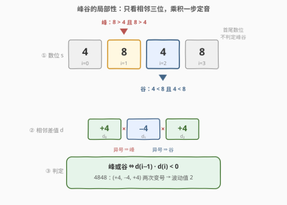
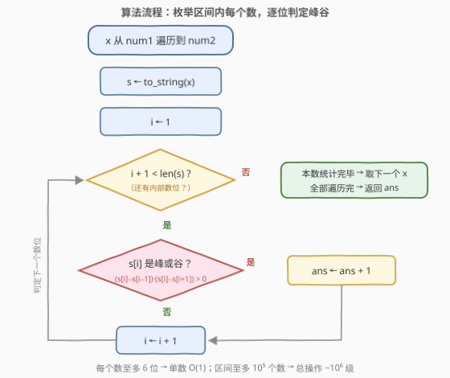

# LeetCode 范围内总波动值 I 题解

## 1. 题目概述

- **标题 / 题号**：范围内总波动值 I（#3751，medium）
- **链接**：https://leetcode.cn/problems/total-waviness-of-numbers-in-range-i/
- **难度**：中等
- **标签**：数学、枚举、动态规划

**题意**：给你两个整数 `num1` 和 `num2`，表示一个**闭区间** $[num1, num2]$。

一个数字的**波动值**定义为该数字中**峰**和**谷**的总数：

- 如果一个数位**严格大于**其两个相邻数位，则该数位为**峰**；
- 如果一个数位**严格小于**其两个相邻数位，则该数位为**谷**；
- 数字的**第一个和最后一个数位不能**是峰或谷；
- 任何**少于 3 位**的数字，其波动值均为 $0$。

返回范围 $[num1, num2]$ 内所有数字的波动值之和。

**示例 1**：

```text
输入：num1 = 120, num2 = 130
输出：3
解释：120 的中间数位 2 是峰；121 的 2 是峰；130 的 3 是峰；范围内其余数字波动值均为 0。
总波动值 = 1 + 1 + 1 = 3。
```

**示例 2**：

```text
输入：num1 = 198, num2 = 202
输出：3
解释：198 的 9 是峰；201 的 0 是谷；202 的 0 是谷；其余数字波动值为 0。
```

**示例 3**：

```text
输入：num1 = 4848, num2 = 4848
输出：2
解释：4848 的第二个数位 8 是峰、第三个数位 4 是谷，波动值为 2。
```

**约束**：

- $1 \le num1 \le num2 \le 10^5$

> 💡 **审题关键**：① **严格比较**——相邻数位相等（如 `199` 的两个 9、`200` 的两个 0）既非峰也非谷；② **端点豁免**——首尾数位只有单侧邻居，定义上就不参与判定，「少于 3 位为 0」是同一条规则的极端情形；③ 本题是 I 版，$10^5$ 的范围配上官方 hint「Use bruteforce」已经明示——**暴力枚举就是正解**，功夫全在把峰谷判定写得又对又简洁。

## 2. 解题思路

### 2.1 暴力思路（本题正解）

先算规模账：区间内至多 $10^5 + 1$ 个数；每个数至多 6 位（$10^5 = 100000$），其中**内部数位**（拥有完整左右邻居的）至多 4 个；每个内部数位判定只需 4 次比较。总计约 $10^5 \times 4 \times 4 \approx 1.6 \times 10^6$ 次常数操作——任何语言都是毫秒级。**暴力就是正解**，剩下的只是把判定逻辑写干净。

流程：遍历 $x \in [num1, num2]$，把 $x$ 转成数位串 $s$，对每个内部位置 $i \in [1, n-2]$ 判定峰谷并累加。

### 2.2 核心观察：峰谷是纯局部判定，可转化为差值同号



**观察一：局部性。** $s[i]$ 是否为峰/谷只取决于三元组 $(s[i-1],\ s[i],\ s[i+1])$，与其他数位、与 $x$ 的整体大小统统无关。因此波动值可以逐位独立累加：

$$\text{waviness}(x) = \sum_{i=1}^{n-2} \big[\,s[i] \text{ 是峰或谷}\,\big]$$

**观察二：差值同号判别。** 峰要求两侧差值**同为正**，谷要求两侧差值**同为负**，统一为两侧差值**同号且非零**：

$$\text{峰或谷} \iff \big(s[i] - s[i-1]\big) \cdot \big(s[i] - s[i+1]\big) > 0$$

一个乘积式覆盖全部四种情形：

| 两侧差值 | 乘积 | 结论 |
|----------|------|------|
| 同正（左升右降） | $> 0$ | **峰** ✓ |
| 同负（左降右升） | $> 0$ | **谷** ✓ |
| 有一侧为 0（相邻相等） | $= 0$ | 排除 ✓（严格性自动满足） |
| 一正一负（单调穿过） | $< 0$ | 排除 ✓ |

> 💡 **等价视角**：定义相邻差值 $d_j = s[j+1] - s[j]$，则峰谷 $\iff d_{i-1} \cdot d_i < 0$——**差值序列发生一次严格变号**。$4848$ 的差值序列 $(+4, -4, +4)$ 变号两次，波动值恰为 2（示例 3）。

**观察三：边界条款被循环边界无痕吸收。** 内层循环 $i \in [1, n-2]$ 天然跳过首尾端点；$n < 3$ 时循环体一次都不执行，波动值自动为 0——题面两条特殊规则**不需要任何 `if` 特判**。

**观察四：答案规模。** $[1, 10^5]$ 内单个数的波动值至多 3（如 $25252$；唯一的 6 位数 $100000$ 差值全 0，波动值为 0），总和 $\le 3 \times 10^5$，`int` 绰绰有余——这正是函数签名返回 `int` 的底气。

> ⚠️ **实现小技巧**：数位以字符串存放时，`'0'`–`'9'` 的 ASCII 码单调递增，**字符相减即数位相减**（`'8' - '4' == 4`），无需逐位转 int。

### 2.3 算法流程图



**逻辑执行步骤**：

| 步骤 | 操作 | 说明 |
|------|------|------|
| ① 外层枚举 | $x$ 从 $num1$ 到 $num2$ | 共至多 $10^5+1$ 个数 |
| ② 取数位 | $s \leftarrow \text{to\_string}(x)$ | 字符比较即数位比较 |
| ③ 内层枚举 | $i$ 从 $1$ 到 $n-2$ | 循环边界天然豁免端点与短数 |
| ④ 判定 | 两侧差值乘积 $> 0$ ？ | 同号非零 ⇒ 峰或谷 |
| ⑤ 累加 | $ans \mathrel{+}= 1$ | 布尔判定直接计数 |
| ⑥ 收尾 | 返回 $ans$ | $\le 3\times 10^5$，`int` 足够 |

### 2.4 示例演算

**示例 1**：$[120, 130]$。3 位数只有中间位 $i=1$ 参与判定：

| $x$ | 数位 | 中间位判定 | 波动值 |
|-----|------|-----------|--------|
| 120 | 1, 2, 0 | $2>1$ 且 $2>0$ → 峰 | 1 |
| 121 | 1, 2, 1 | $2>1$ 且 $2>1$ → 峰 | 1 |
| 122 | 1, 2, 2 | $2>1$ 但 $2=2$，非严格 | 0 |
| 123 | 1, 2, 3 | $2>1$ 但 $2<3$，单调穿过 | 0 |
| 124–129 | 1, 2, $d$ | $d \ge 4 > 2$，单调穿过 | 0 |
| 130 | 1, 3, 0 | $3>1$ 且 $3>0$ → 峰 | 1 |

总计 $1+1+1 = \mathbf{3}$ ✓

**示例 3**：$4848$，差值序列 $(+4, -4, +4)$：$i=1$ 处变号（峰）、$i=2$ 处变号（谷），波动值 $\mathbf{2}$ ✓

## 3. 参考代码

### C++

```cpp
class Solution {
public:
    int totalWaviness(int num1, int num2) {
        int ans = 0;
        for (int x = num1; x <= num2; ++x) {
            string s = to_string(x);
            int n = s.size();
            for (int i = 1; i + 1 < n; ++i) {
                int dl = s[i] - s[i - 1];   // 左侧差值：s[i] − s[i−1]
                int dr = s[i] - s[i + 1];   // 右侧差值：s[i] − s[i+1]
                if (dl * dr > 0) ++ans;     // 同号且非零：峰或谷
            }
        }
        return ans;
    }
};
```

> 💡 **写法要点**：
> - `dl * dr > 0` 一个乘积覆盖峰、谷、含相等、单调四种情形，**零分支**；
> - 字符相减即数位相减，省去 `s[i] - '0'`；
> - 想再抠常数可改用 `%10 / 10` 数位分解避免 `to_string` 的分配开销，但 $10^5$ 规模下无感。

### Python

```python
class Solution:
    def totalWaviness(self, num1: int, num2: int) -> int:
        ans = 0
        for x in range(num1, num2 + 1):
            s = str(x)
            for a, b, c in zip(s, s[1:], s[2:]):   # 枚举所有相邻三元组
                if a < b > c or a > b < c:          # 峰：a<b>c；谷：a>b<c
                    ans += 1
        return ans
```

> 💡 **写法要点**：
> - `zip(s, s[1:], s[2:])` 直接枚举全部相邻三元组，$n < 3$ 时自然为空——端点豁免与短数规则零特判；
> - `a < b > c` 是 Python **链式比较**（等价于 `a < b and b > c`），把「峰」的字面定义直接抄成代码；谷写成镜像 `a > b < c`。

## 4. 复杂度分析

| 维度 | 复杂度 | 说明 |
|------|--------|------|
| **时间** | $O\big((num2-num1+1) \cdot D\big)$，$D \le 6$ | 约 $6 \times 10^5$ 次常数操作，毫秒级 |
| **空间** | $O(D)$ | 仅数位串本身（≤ 6 字符） |
| **对比正解门槛** | — | 官方 hint 明示暴力可行；II 版（3753）范围升至 $10^{15}$ 后必须换数位 DP |

## 5. 扩展：II 版本的前缀和 + 数位 DP 预告

[3753. 范围内总波动值 II](https://leetcode.cn/problems/total-waviness-of-numbers-in-range-ii/)（困难）把范围扩到 $1 \le num1 \le num2 \le 10^{15}$，暴力彻底失效，套路升级为两件套：

**① 前缀和相减**：定义 $f(N) = \sum_{x=1}^{N} \text{waviness}(x)$，则答案 $= f(num2) - f(num1-1)$，把「区间求和」化归为「前缀统计」——数位 DP 只需会算 $f(N)$。

**② 数位 DP，贡献在右邻放置时结算**：从高位到低位逐位填数，状态挂 $(pos,\ prev_1,\ prev_2,\ tight)$——当前位置、已填的最后两个数位、是否贴着 $N$ 的上界。关键在于：**填第 $pos$ 位时，第 $pos-1$ 位才首次同时拥有左右邻居**，其峰/谷身份在此刻确定；把这一位的贡献（0 或 1）乘上「剩余位置任意填的方案数」计入答案。记忆化后有效状态只有 $O(L \times 10 \times 10)$（$L$ 为位数），与 $N$ 的大小无关。答案规模达 $10^{15}$ 量级，必须 64 位整数。

> 💡 「相邻数位关系进状态 + 贡献延迟结算」是数位 DP 的通用范式：233（数 1）是单变量版，2719/2376 是带约束版，本题 II 版是**成对相邻关系**版——状态里要同时背两个数位。

## 6. 面试要点

**Q1：如何第一时间判断本题可以暴力？**

> 算规模账：$10^5$ 个数 × 每数 ≤ 6 位 × 每位 4 次比较 ≈ $10^6$ 级常数操作。LeetCode 的难度常常写在数据范围里——本题 hint 更是直说 "Use bruteforce"。先估上限再选算法，避免对着中等题空想数位 DP。

**Q2：峰谷判定有哪些等价写法？**

> 三种：① 定义式双分支 `s[i]>s[i-1] && s[i]>s[i+1] || s[i]<s[i-1] && s[i]<s[i+1]`；② **乘积式** `(s[i]-s[i-1]) * (s[i]-s[i+1]) > 0`——两侧差值同号且非零，一个式子覆盖全部情形，乘积为 0 恰好排除「相邻相等」；③ **差值变号式** $d_{i-1} \cdot d_i < 0$（其中 $d_j = s[j+1]-s[j]$）。Python 还可用链式比较 `a < b > c or a > b < c` 直译字面定义。

**Q3：相邻相等（如 199、200）为什么不算峰谷？**

> 定义要求**严格**大于/小于。`199` 的第二个 9 与第三个 9 相等，右差值为 0；`200` 的两个 0 相等，左差值为 0——乘积式下都归零出局。这类「平台」数位既非峰也非谷，是本题最典型的边界用例（示例 2 中 199、200 的波动值均为 0 正是为此服务）。

**Q4：首尾豁免和「少于 3 位为 0」需要特判吗？**

> 不需要。内层循环 $i \in [1, n-2]$ 的边界天然跳过首尾；$n < 3$ 时区间为空、循环不执行。把特殊规则吸收进循环边界，是这类模拟题减少 bug 的通用手法。

**Q5：范围扩到 $10^{15}$ 怎么办（II 版本）？**

> 前缀和相减 + 数位 DP：$ans = f(num2) - f(num1-1)$；DP 状态 $(pos, prev_1, prev_2, tight)$，填第 $pos$ 位时结算第 $pos-1$ 位的峰谷贡献 × 后缀方案数，记忆化后复杂度与 $N$ 数值无关、只随位数增长。另注意答案改用 `long long`。

> 💡 **一句话总结**：3751 = 「算清规模账，暴力即正解」+ 一个乘积式 $(s[i]-s[i-1]) \cdot (s[i]-s[i+1]) > 0$ 干净收掉峰谷判定；边界条款（端点豁免、短数为 0）全部被循环边界吸收，零特判。

## 同类练习题

| # | 题目 | 与本题的关联 |
|---|------|-------------|
| 3753 | [范围内总波动值 II](https://leetcode.cn/problems/total-waviness-of-numbers-in-range-ii/) | 本题 Hard 版，范围 $10^{15}$，暴力失效，须用第 5 节的数位 DP |
| 233 | [数字 1 的个数](https://leetcode.cn/problems/number-of-digit-one/)（[题解](../0201-0300/233_数字1的个数.md)） | 数位统计经典入门，「前缀和相减 + 逐位贡献」的思想源头 |
| 2719 | [统计整数数目](https://leetcode.cn/problems/count-of-integers/)（[题解](../2701-2800/2719_统计整数数目.md)） | 数位 DP 带数位和约束的状态设计，tight 边界处理的标准练习 |
| 2376 | [统计特殊整数](https://leetcode.cn/problems/count-special-integers/)（[题解](../2301-2400/2376_统计特殊整数.md)） | 数位 DP + 出现掩码，体会「相邻数位关系进状态」的另一种挂法 |
| 902 | [最大为 N 的数字组合](https://leetcode.cn/problems/numbers-at-most-n-given-digit-set/)（[题解](../0901-1000/902_最大为N的数字组合.md)） | 受限数字集的数位计数，前缀统计的另一变体 |
