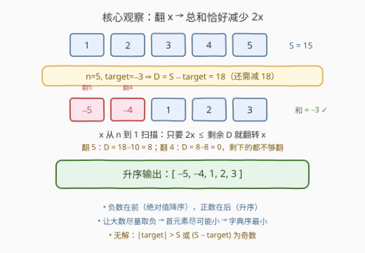

# 字典序最小和为目标值且绝对值是排列的数组

- **题目名称**：字典序最小和为目标值且绝对值是排列的数组
- **链接**：[3752. 字典序最小和为目标值且绝对值是排列的数组](https://leetcode.cn/problems/lexicographically-smallest-negated-permutation-that-sums-to-target/)
- **难度**：中等
- **标签**：贪心、数组、数学

## 1. 题目概述

给你一个正整数 `n` 和一个整数 `target`，请返回一个大小为 `n` 的**字典序最小**的整数数组，满足：

- 其元素**和**等于 `target`；
- 其元素的**绝对值**组成一个大小为 `n` 的**排列**（即对 `1, 2, ..., n` 重新排列后逐个取绝对值）。

如果不存在这样的数组，则返回一个空数组。

**示例 1**：

```text
输入：n = 3, target = 0
输出：[-3,1,2]
解释：和为 0 且绝对值组成大小为 3 的排列的数组有很多，
      字典序最小的是 [-3, 1, 2]。
```

**示例 2**：

```text
输入：n = 1, target = 10000000000
输出：[]
解释：不存在和为 10000000000 且绝对值组成大小为 1 的排列的数组。
```

**约束条件**：

- $1 \le n \le 10^5$
- $-10^{10} \le target \le 10^{10}$

---

## 2. 解题思路

### 2.1 暴力思路

每个绝对值 $x \in \{1, \dots, n\}$ 可以取 $+x$ 或 $-x$，暴力枚举所有 $2^n$ 种符号组合，筛出和等于 `target` 的，各自升序排序后取字典序最小者。时间复杂度 $O(2^n \cdot n)$，在 $n \le 10^5$ 下完全不可行。

### 2.2 核心观察：翻转 $x$ 恰好让总和减少 $2x$



**第一步：把"构造"转化为"选翻转集合"。**

全部取正时数组和为 $S = \frac{n(n+1)}{2}$。把某个 $x$ 从 $+x$ 改成 $-x$，总和恰好减少 $2x$。于是：

- 令 $D = S - target$（还需要"砍掉"的总量）；
- 我们要选出子集 $P \subseteq \{1, \dots, n\}$，使得 $\sum_{x \in P} 2x = D$，即 $\sum_{x \in P} x = D/2$。

**无解判定**由此直接得出，以下三种情况返回空数组：

1. $target > S$（全正都不够大）或 $target < -S$（全负都不够小），等价于 $|target| > S$；
2. $D$ 为奇数（每次砍掉的 $2x$ 都是偶数，奇偶性对不上）。

**第二步：字典序最小 ⟺ 从大到小"能翻则翻"。**

> 💡 关键点：题目只约束**绝对值**是排列，数组元素的**顺序是自由的**。同一组带符号的数，升序排列就是其所有排列中字典序最小的那个。

升序后的数组形如 $[-x_k, \dots, -x_1, y_1, \dots, y_m]$：负数在前且绝对值递减，正数在后且递增。比较两个候选时先比负数段——首元素越小越好，也就是**尽量让大的数取负**（首元素最小可到 $-n$）。

于是得到贪心：**$x$ 从 $n$ 到 $1$ 扫描，只要 $2x \le$ 剩余的 $D$ 就翻转 $x$**。

**正确性（可行性）**：归纳可证不变量"处理完 $x$ 后，剩余 $D \le x(x-1)$"，恰好等于更小的数 $1 \sim x-1$ 全部翻转所能砍掉的总量 $2 \cdot \frac{x(x-1)}{2}$，即剩余差值总能被更小的数消化：

- 处理 $x$ 之前有 $D \le x(x+1)$（$x = n$ 时由 $D \le 2S$ 保证，$x < n$ 时是处理完 $x+1$ 后的不变量）；
- 若翻转：$D' = D - 2x \le x(x+1) - 2x = x(x-1)$；
- 若不翻转：$D < 2x$ 且 $D$ 为偶数，故 $D \le 2x - 2 \le x(x-1)$。

处理完 $x = 1$ 后 $D \le 0$，而翻转过程始终保持 $D \ge 0$，故最终 $D = 0$，贪心一定恰好凑出 `target`。

**正确性（最优性）**：只要 $n \le D/2$ 且剩余需求能由 $1 \sim n-1$ 凑出（后者由上面的不变量自动保证），任何最优解都必须包含 $n$——否则首元素大于 $-n$，字典序必然更大；这恰好对应贪心的翻转条件 $2n \le D$。固定 $n$ 取负后，剩余问题在 $\{1, \dots, n-1\}$ 上同构，归纳即得贪心解字典序最小。

### 2.3 算法流程图


流程总结：

1. 计算 $S$ 与 $D = S - target$，做无解判定（越界或奇偶性不符返回 `[]`）；
2. $x$ 从 $n$ 递减到 $1$：若 $2x \le D$，标记 $x$ 取负并令 $D \gets D - 2x$；
3. 构造答案：先按绝对值从大到小输出被翻转的负数，再从小到大输出未翻转的正数——两段拼接天然升序，无需排序。

### 2.4 示例演算

以 `n = 3, target = 0` 为例，$S = 6$，$D = 6$：

| 步骤 | 检查 | 是否翻转 | 剩余 D |
|------|------|----------|--------|
| x = 3 | 2×3 = 6 ≤ 6 | ✅ 翻转 | 0 |
| x = 2 | 2×2 = 4 > 0 | ❌ | 0 |
| x = 1 | 2×1 = 2 > 0 | ❌ | 0 |

取负集合为 $\{3\}$，升序输出 `[-3, 1, 2]`，与示例一致。

---

## 3. 参考代码

### C++

```cpp
class Solution {
  public:
    vector<int> lexSmallestNegatedPerm(int n, long long target) {
        long long S = 1LL * n * (n + 1) / 2;
        long long D = S - target;
        if (target > S || target < -S || D % 2 != 0) return {};

        vector<char> neg(n + 1, 0);
        for (long long x = n; x >= 1; x--) {
            if (2 * x <= D) {
                neg[x] = 1;
                D -= 2 * x;
            }
        }

        vector<int> res;
        res.reserve(n);
        for (int x = n; x >= 1; x--)
            if (neg[x]) res.push_back(-x);
        for (int x = 1; x <= n; x++)
            if (!neg[x]) res.push_back(x);
        return res;
    }
};
```

> ⚠️ `target` 范围达 $\pm 10^{10}$，超出 `int`，C++ 参数需用 `long long`；返回的元素都在 $[-n, n]$ 内，用 `int` 即可。

### Python

```python
class Solution:
    def lexSmallestNegatedPerm(self, n: int, target: int) -> List[int]:
        S = n * (n + 1) // 2
        D = S - target
        if target > S or target < -S or D % 2 != 0:
            return []

        neg = [False] * (n + 1)
        for x in range(n, 0, -1):
            if 2 * x <= D:
                neg[x] = True
                D -= 2 * x

        return [-x for x in range(n, 0, -1) if neg[x]] + \
               [x for x in range(1, n + 1) if not neg[x]]
```

---

## 4. 复杂度分析

| 维度 | 复杂度 | 说明 |
|------|--------|------|
| 时间复杂度 | O(n) | 一次从 $n$ 到 $1$ 的贪心扫描 + 一次线性构造输出（免排序） |
| 空间复杂度 | O(n) | 符号标记数组与结果数组（不含输出则标记可压缩为 O(1) 之外的空间） |

---

## 5. 扩展：与「目标和」的关联

本题与 [494. 目标和](https://leetcode.cn/problems/target-sum/) 是同一个"给 $1 \sim n$ 分配正负号凑 `target`"的数学模型：494 求**方案数**（转化为 $D/2$ 的 0-1 背包计数，$O(n \cdot D/2)$），本题求**字典序最小的构造**（贪心 $O(n)$）。一个模型的两副面孔：计数用背包，构造用贪心——面试中若被追问"方案数怎么求"，直接迁移 494 的做法即可。

---

## 6. 面试要点

1. **为什么翻转 $x$ 恰好减少 $2x$？**
   - $+x$ 变 $-x$，变化量是 $(-x) - (+x) = -2x$，与当前的符号无关。

2. **无解的判定条件是什么？**
   - $|target| > S$（总和范围为 $[-S, S]$），或 $S - target$ 为奇数（每次调整量 $2x$ 均为偶数）。

3. **为什么"从大到小能翻则翻"得到的数组字典序最小？**
   - 数组顺序自由，升序排列即字典序最小；首元素越小说明越大的数被取负。含 $n$ 的方案可行时任何最优解必含 $n$（否则首元素 $> -n$），归纳到子问题即得贪心正确。

4. **贪心为什么保证最后 $D$ 恰好归零、不会翻过头或翻不够？**
   - 不变量"处理完 $x$ 后剩余 $D \le x(x-1)$"说明剩余差值总能被更小的数补齐；且翻转条件 $2x \le D$ 保证 $D$ 非负，最终 $D = 0$。

5. **需要注意的溢出点？**
   - $S$ 最大约 $5 \times 10^9$、`target` 达 $\pm 10^{10}$，C++ 中中间量必须用 64 位整数；返回元素本身在 `int` 范围内。

---

## 7. 同类练习题

- [494. 目标和](https://leetcode.cn/problems/target-sum/)：同一正负号分配模型的计数版（0-1 背包）
- [1798. 你能构造出连续值的最大数目](https://leetcode.cn/problems/maximum-number-of-consecutive-values-you-can-make/)：从大到小/从小到大的贪心构造可行性论证
- [2160. 拆分数位的最小和](https://leetcode.cn/problems/minimum-sum-of-four-digit-number-after-splitting-digits/)：排序 + 贪心构造最小值
- [976. 三角形的最大周长](https://leetcode.cn/problems/largest-perimeter-triangle/)：排序后贪心选取的典型模式
