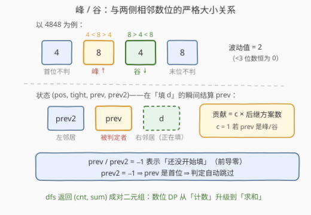
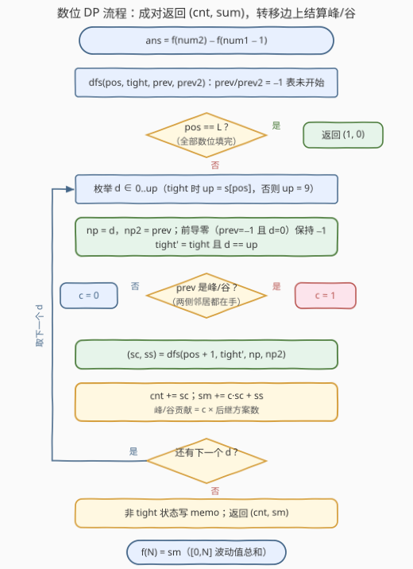

# 范围内总波动值 II

- **题目名称**：范围内总波动值 II
- **链接**：[3753. 范围内总波动值 II](https://leetcode.cn/problems/total-waviness-of-numbers-in-range-ii/)
- **难度**：困难
- **标签**：数学、动态规划、数位 DP

## 1. 题目概述

给你两个整数 `num1` 和 `num2`，表示一个**闭**区间 `[num1, num2]`。

一个数字的**波动值**定义为该数字中**峰**和**谷**的总数：

- 如果一个数位**严格大于**其两个相邻数位，则该数位为**峰**；
- 如果一个数位**严格小于**其两个相邻数位，则该数位为**谷**；
- 数字的第一个和最后一个数位**不能**是峰或谷；
- 任何少于 3 位的数字，其波动值均为 0。

返回范围 `[num1, num2]` 内所有数字的波动值之和。

**示例 1**：

```text
输入：num1 = 120, num2 = 130
输出：3
解释：120（2 是峰）、121（2 是峰）、130（3 是峰）各贡献 1，其余为 0。
```

**示例 2**：

```text
输入：num1 = 198, num2 = 202
输出：3
解释：198（9 是峰）、201（0 是谷）、202（0 是谷）各贡献 1，其余为 0。
```

**示例 3**：

```text
输入：num1 = 4848, num2 = 4848
输出：2
解释：4848 中第二个数位 8 是峰、第三个数位 4 是谷，波动值为 2。
```

**约束条件**：

- $1 \le \text{num1} \le \text{num2} \le 10^{15}$

> 💡 **审题关键**：三件事决定解法形态——① 判定对象是**相邻三位数位的严格大小关系**，是与数值大小无关的「数位属性」，且判定窗口只看**两个历史数位**（`prev`、`prev2`）；② 区间求和且上界 $10^{15}$（16 位），线性枚举 $O(\text{num2}-\text{num1})$ 必超时——**区间计数/求和 + 大上界 + 位级约束**是数位 DP 的标准触发信号；③ 答案量级：至多 $10^{15}$ 个数 × 每数至多 14 个内部位 $\approx 1.4 \times 10^{16}$，C++ 必须用 64 位整数（好在远小于 `long long` 上界 $9.2 \times 10^{18}$）。

---

## 2. 解题思路

### 2.1 暴力思路：逐数扫描 + 一趟判峰谷

枚举 $[num1, num2]$ 中每个数 $x$，转成字符串一趟扫描：对每个内部位 $i$（$1 \le i \le L-2$），判 `s[i]` 是否严格大于/严格小于两侧邻居，累计波动值。

单数判定 $O(L)$，总复杂度 $O((\text{num2}-\text{num1}) \times L)$。I 版（3751）上界 $10^5$ 可以过；本题 $10^{15}$ 差了十个数量级，必须换主轴——**从「枚举数值」改为「逐位填数」**。

### 2.2 核心观察：前缀差 + 成对返回 (cnt, sum) 的数位 DP



**第一步（前缀差）**：数位 DP 天然处理「$\le$ 某上界」，把双端区间拆成两个单端前缀之差：

$$ans = f(num2) - f(num1 - 1)$$

其中 $f(N)$ 是 $[0, N]$ 内所有整数的波动值之和。本题 $num1, num2 \le 10^{15}$ 在 64 位整数范围内，`num1 - 1` 直接算，无需 [2719](../2701-2800/2719_统计整数数目.md) 那样的字符串大数减一。

**第二步（状态设计）**：峰/谷的判定只依赖**相邻三个数位**。从高到低逐位填数时，记：

| 状态 | 含义 | 取值 |
|------|------|------|
| `pos` | 当前填到第几位 | $0 \dots L-1$，$L \le 16$ |
| `tight` | 前缀是否仍**贴住** $N$ 的上界 | `True` / `False` |
| `prev` | 上一位数字；$-1$ 表示**还没开始填** | $-1$ 或 $0 \dots 9$ |
| `prev2` | 上上一位数字；$-1$ 表示之前不足两位 | $-1$ 或 $0 \dots 9$ |

`prev = -1` 恰好等价于「还没填过有效数位」，**一个哨兵同时当了 `started` 用**——前导零永远不会被存进 `prev/prev2`，比标准四状态模板还少一维。

**第三步（求和的关键：成对返回）**：数位 DP 平时只**计数**，本题要**求和**。标准手法是让 `dfs` 返回**二元组** $(cnt, sm)$：当前后继的填法总数、这些填法贡献的波动值总和。而峰/谷的**结算时机**选在「填入 $d$ 的瞬间」——此时 `prev` 的左邻居 `prev2` 与右邻居 $d$ **恰好同时在手**：

$$c = \begin{cases} 1, & \text{prev} \ne -1 \text{ 且 } \text{prev2} \ne -1 \text{ 且 } (\text{prev} \gt \text{prev2} \wedge \text{prev} \gt d) \lor (\text{prev} \lt \text{prev2} \wedge \text{prev} \lt d) \\ 0, & \text{否则} \end{cases}$$

`c = 1` 意味着**共享该前缀的每一个后继**（共 `sc` 种填法）各得 +1，故：

$$sm \mathrel{+}= c \times sc + ss$$

> 💡 **为什么首尾规则不用特判？** 首位：`prev2 = -1` 时 `prev` 必是数的第一个数位，判定条件自动跳过；末位：判定对象永远是 `prev`（不是刚填的 $d$），而 `prev` 后面还有 $d$，天然不是末位；位数不足 3：`prev = -1` 或 `prev2 = -1` 直接零贡献。**三条题目规则全部被两个 $-1$ 哨兵无声消化**，代码里一行特判都不用写。
>
> ⚠️ **前导零的坑**：若把前导零当普通数字存进 `prev/prev2`，`023`（即 23）里的 `2` 会被拿去和左边的 `0` 比大小——但 `2` 其实是首位，不该参与判定。`prev = -1 且 d = 0` 时保持 `np = np2 = -1`，让短位数的数自动归并进「晚开始」的分支。

### 2.3 算法流程



汇总：`f(N)` 从 `dfs(0, True, -1, -1)` 出发；`pos == L` 返回 `(1, 0)`（一种填法、零贡献）；每位枚举 $d \in [0, up]$，推进 `np/np2`（前导零保持 $-1$），边转移边结算 $c \times sc$；**非贴界**状态写入 memo（贴界路径唯一、无重复子问题，不必缓存）；最终 `ans = f(num2) 的 sm − f(num1−1) 的 sm`。

### 2.4 示例演算

以求 $f(130)$（示例 1 的上界）为例，$s = \text{"130"}$，从 $(pos{=}0, tight{=}T, prev{=}{-}1, prev2{=}{-}1)$ 出发：

- **pos=0（tight，up=1）**：$d=0$ → 仍是前导零（$prev=prev2=-1$）；$d=1$ → 贴界，$prev=1, prev2=-1$；
- **pos=1（tight，up=3）**：$d=0,1,2$ → 脱界（free）；$d=3$ → 继续贴界；
  - 前缀「12」（free）：pos=2 枚举 $d=0..9$，即 $120..129$。每次结算「$prev=2, prev2=1$」：

    | $d$ | 数 | 判定（$2$ 与左 $1$、右 $d$） | 贡献 |
    |----|------|------------------------------|------|
    | 0 | 120 | $2>1$ 且 $2>0$ → **峰** | 1 |
    | 1 | 121 | $2>1$ 且 $2>1$ → **峰** | 1 |
    | 2 | 122 | $2>1$ 但 $2=2$ 不严格 | 0 |
    | 3..9 | 123..129 | $2>1$ 但 $2<d$ | 0 |

  - 前缀「13」（tight，up=0）：$d=0$ → $130$，结算「$prev=3, prev2=1$」：$3>1$ 且 $3>0$ → **峰**，贡献 1；
  - 前缀「10」「11」（free）：$prev2=-1$（`prev` 是首位）→ 判定跳过，零贡献；
- $f(119)$ 不含 $120..130$ 任何一个，故 $ans = f(130) - f(119) = 2 + 1 = \textbf{3}$ ✓。

**示例 3**（单点 $4848$）：填第 3 位 $d=8$ 时结算「$prev=4, prev2=4$」？不——填**末位** $d=8$ 结算的是 $prev=4$（$4<8$ 且 $4<8$ → **谷**）；$8$ 这个**峰**是在更早一步、填第 3 位 $d=4$ 时结算的（$prev=8, prev2=4$：$8>4$ 且 $8>4$ → **峰**）。两步各 +1，波动值 $= 2$ ✓——体会「**每个数位在它被后一位覆盖时才定性**」的流水线节奏。

---

## 3. 参考代码

### C++

```cpp
class Solution {
public:
    long long totalWaviness(long long num1, long long num2) {
        return totalLe(num2) - totalLe(num1 - 1);
    }
private:
    // [0, n] 内所有整数的波动值总和
    static long long totalLe(long long n) {
        string s = to_string(n);
        int L = s.size();
        // memo[(pos, prev+1, prev2+1)]：非贴界状态的 (方案数, 波动值总和)，first=-1 表未算
        vector<pair<long long,long long>> memo(L * 11 * 11, {-1, -1});
        function<pair<long long,long long>(int,bool,int,int)> dfs =
            [&](int pos, bool tight, int prev, int prev2) -> pair<long long,long long> {
            if (pos == L) return {1LL, 0LL};                  // 填完：一种填法、零贡献
            int key = ((pos * 11) + prev + 1) * 11 + prev2 + 1;
            if (!tight && memo[key].first >= 0) return memo[key];
            int up = tight ? s[pos] - '0' : 9;
            long long cnt = 0, sm = 0;
            for (int d = 0; d <= up; ++d) {
                int np  = (prev == -1 && d == 0) ? -1 : d;    // 前导零：保持未开始
                int np2 = (prev == -1) ? -1 : prev;           // 不足两位：prev2 保持 -1
                long long c = 0;                              // prev 是否被 d 定性为峰/谷
                if (prev != -1 && prev2 != -1 &&
                    ((prev > prev2 && prev > d) || (prev < prev2 && prev < d)))
                    c = 1;
                auto [sc, ss] = dfs(pos + 1, tight && d == up, np, np2);
                cnt += sc;
                sm  += c * sc + ss;                           // 峰/谷贡献 × 后继方案数
            }
            if (!tight) memo[key] = {cnt, sm};                // 贴界路径唯一，不缓存
            return {cnt, sm};
        };
        return dfs(0, true, -1, -1).second;
    }
};
```

### Python

```python
from functools import lru_cache

class Solution:
    def totalWaviness(self, num1: int, num2: int) -> int:
        def total_le(n: int) -> int:
            # [0, n] 内所有整数的波动值总和（0/1/2 位数波动值为 0，天然不贡献）
            s = str(n)

            @lru_cache(None)
            def dfs(pos: int, tight: bool, prev: int, prev2: int) -> tuple:
                # prev / prev2：上一位 / 上上一位数字，-1 表示还没开始填（前导零）
                # 返回 (cnt, sm)：后继填法数 与 这些填法的波动值总和
                if pos == len(s):
                    return (1, 0)
                up = int(s[pos]) if tight else 9
                cnt = sm = 0
                for d in range(up + 1):
                    if prev == -1 and d == 0:                 # 仍是前导零
                        np, np2 = -1, -1
                    elif prev == -1:                          # 首个有效数位
                        np, np2 = d, -1
                    else:                                     # 正常推进
                        np, np2 = d, prev
                    c = 0                                      # prev 是否被 d 定性为峰/谷
                    if prev != -1 and prev2 != -1:
                        if (prev > prev2 and prev > d) or (prev < prev2 and prev < d):
                            c = 1
                    sub_cnt, sub_sm = dfs(pos + 1, tight and d == up, np, np2)
                    cnt += sub_cnt
                    sm += c * sub_cnt + sub_sm                # 峰/谷贡献 × 后继方案数
                return (cnt, sm)

            return dfs(0, True, -1, -1)[1]

        return total_le(num2) - total_le(num1 - 1)
```

> 💡 **写法要点**：
> - **贡献千万别忘了乘 `sc`**：`sm += c * sub_cnt + sub_sm` 少乘 `sub_cnt` 是本题最典型的 WA——峰/谷是**前缀级**属性，共享前缀的所有后继都要各记一次；
> - Python 版把 `tight` 编进 `lru_cache` 的 key（写法最省事）；C++ 版只缓存非贴界状态——贴界状态沿唯一前缀路径各出现一次，缓存与否不影响复杂度，只影响表大小；
> - `num1 - 1` 直接整数减法即可（$10^{15}$ 远在 64 位内），无需字符串借位；
> - 判定的两个前提 `prev != -1 && prev2 != -1` 缺一不可，它们分别挡住「还没开始填」与「prev 是首位」两种情况。

---

## 4. 复杂度分析

| 维度 | 复杂度 | 说明 |
|------|--------|------|
| **时间** | $O(L \cdot 11^2 \cdot 10)$ | 非贴界状态 $(pos, prev, prev2)$ 共 $16 \times 11 \times 11 \approx 1.9 \times 10^3$ 个，每个枚举 10 个数字；两次前缀查询合计约 $4 \times 10^4$ 次转移，微秒级 |
| **空间** | $O(L \cdot 11^2)$ | memo 表约 $1.9 \times 10^3$ 项 + $O(L)$ 递归栈 |
| **对比暴力** | $O((\text{num2}-\text{num1}) \cdot L) \to O(L)$ | 暴力最坏 $\sim 1.6 \times 10^{16}$ 次判定；数位 DP 的运行时间与区间长度、数值大小**完全无关**——$10^{15}$ 与 $10^{9}$ 同价 |

---

## 5. 扩展：数位 DP 从「计数」到「求和」

「统计区间内某数位属性的**总和**」是一族题，通用骨架都是前缀差 $f(b) - f(a-1)$，差别在**求和的实现口径**：

1. **成对返回 $(cnt, sum)$（本文）**：`dfs` 同时携带「方案数」与「价值和」，在转移边上结算贡献。适用于任何「逐位属性求和」——[233. 数字 1 的个数](../0201-0300/233_数字1的个数.md)（$\sum$ 每个数中 1 的出现次数）正是同一思想的按位公式版。
2. **求和进状态**：像 [2719](../2701-2800/2719_统计整数数目.md) 把数位和本身当状态维。适用于「求和对象天然是 DP 状态」的场景；本题若改问「**波动值恰好为 $k$ 的数有多少个**」，就把已计峰谷数加进状态（至多 $L$ 维），末位判 $=k$。
3. **枚举贡献位置**：对每个内部位 $i$ 单独跑一遍「第 $i$ 位是峰/谷」的数位 DP，状态可瘦到 $(pos, tight, prev)$，但要跑 $O(L)$ 遍。本文的「边转移边结算」把位置维折叠进 `prev/prev2`，一遍流更优雅。

另有一个可爱的变体：若改问「$\le N$ 的数中**最大**波动值」，不必 DP——贪心构造交替谷峰数字串（如 $9090\ldots$ 型），从高位往低位贴界调整即可，考察的是另一套构造功夫。

---

## 6. 面试要点

**Q1：数位 DP 平时只数个数，本题要求和，怎么改？**

> 让 `dfs` 返回 $(cnt, sm)$ **成对二元组**：转移时 `cnt += sc`、`sm += c·sc + ss`。核心是把「每个数的峰谷」改记为「**每条转移边的贡献 × 该边下面的方案数**」——峰/谷在被后一位覆盖的瞬间定性，此后共享该前缀的所有后继各分摊一次。任何「数位属性求和」都能套这副骨架。

**Q2：`prev/prev2 = -1` 哨兵为什么能同时消化三条特判规则？**

> ① 少于 3 位：`prev = -1` 或 `prev2 = -1` 时判定直接跳过；② 首位不能是峰/谷：`prev2 = -1` 恰表示 `prev` 是首个数位；③ 末位不能是峰/谷：判定对象永远是 `prev` 而非刚填的 `d`，`prev` 后必有 `d`。外加前导零：`prev = -1 且 d = 0` 时状态保持未开始，短位数自动归并——**一个哨兵身兼 `started` 与两条豁免规则**。

**Q3：为什么 memo 只缓存非贴界（tight = False）状态？**

> 贴界状态 $(pos, tight{=}T, prev, prev2)$ 只能经「前 $pos$ 位与 $N$ 完全相同」的唯一前缀到达，整条贴界路径上每个状态至多出现一次，**没有重复子问题可省**；缓存它们只会白白占表。非贴界状态才被大量不同路径共享，是记忆化收益所在。这是所有数位 DP 的通用结论。

**Q4：答案会溢出吗？**

> 上界约 $10^{15}$ 个数 × 每数至多 14 个内部位 $\approx 1.4 \times 10^{16}$，小于 `long long` 上界 $9.2 \times 10^{18}$，安全；`cnt` 分量同理（$\le 10^{15}$）。Python 无此虑。真正要警惕的是**中间式** `c * sc`：若顺手写成 32 位会截断，全程 `long long` 即可。

**Q5：本题与 233 / 1067 / 600 的亲缘关系？**

> 同属「区间数位统计」族：[233](https://leetcode.cn/problems/number-of-digit-one/)（$\sum$ 数字 1 出现次数）与本题最像——都是「数位属性求和 + 前缀差」，233 因属性只看单一位，可推闭合公式；本题峰谷依赖**相邻三位**，公式难闭式化，数位 DP 加 `prev/prev2` 维度是标准出路（[600](https://leetcode.cn/problems/non-negative-integers-without-consecutive-ones/) 把这一维用在二进制上）。[1067](https://leetcode.cn/problems/digit-count-in-range/) 则示范了前缀差 + 前导零的细节处理。

> 💡 **一句话总结**：前缀差 $f(num2) - f(num1-1)$ 化区间为单端；数位 DP 状态 $(pos, tight, prev, prev2)$，两个 $-1$ 哨兵统一管前导零与首尾豁免；`dfs` 成对返回 $(cnt, sum)$，在「填下一位」的瞬间结算峰谷贡献 $c \times$ 后继方案数。$O(L \cdot 11^2 \cdot 10)$ 解决 $10^{15}$ 级求和。

---

## 7. 同类练习题

- [3751. 范围内总波动值 I](https://leetcode.cn/problems/total-waviness-of-numbers-in-range-i/)：同题面的 $num2 \le 10^5$ 版本，$O(nL)$ 暴力可过，适合先写暴力对拍、再体会数位 DP 的降维
- [233. 数字 1 的个数](https://leetcode.cn/problems/number-of-digit-one/)（[题解](../0201-0300/233_数字1的个数.md)）：「区间数位属性求和」母题，$\sum$ 每个数中 1 的出现次数，本题把「1 的个数」换成「峰谷数」
- [1067. 范围内的数字计数](https://leetcode.cn/problems/digit-count-in-range/)（[题解](../1001-1100/1067_范围内的数字计数.md)）：前缀差 $f(b)-f(a-1)$ + 前导零处理的标准范式，与本题第 2.2 节第一步同源
- [600. 不含连续 1 的非负整数](https://leetcode.cn/problems/non-negative-integers-without-consecutive-ones/)（[题解](../0501-0600/600_不含连续1的非负整数.md)）：数位 DP 的 `prev` 状态维度——约束涉及相邻位时的标准出路，本题是其「双 prev」加强版
- [2719. 统计整数数目](https://leetcode.cn/problems/count-of-integers/)（[题解](../2701-2800/2719_统计整数数目.md)）：四状态数位 DP（`pos/tight/started/sum`）+ 前缀差，对照「求和进状态」与「(cnt, sum) 成对返回」两种求和口径
