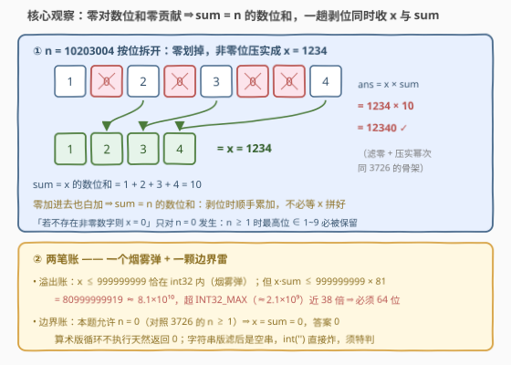
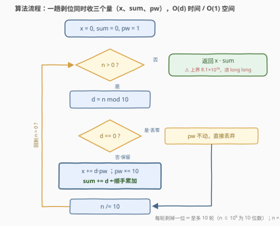

# LeetCode 连接非零数字并乘以其数字和 I 题解

## 1. 题目概述

- **标题 / 题号**：连接非零数字并乘以其数字和 I（#3754，easy）
- **链接**：https://leetcode.cn/problems/concatenate-non-zero-digits-and-multiply-by-sum-i/
- **难度**：简单
- **标签**：数学、模拟

**题意**：给你一个整数 $n$。将 $n$ 中所有的**非零数字**按照它们的原始顺序连接起来，形成一个新的整数 $x$；如果不存在非零数字，则 $x = 0$。令 $sum$ 为 $x$ 中所有数字的**数字和**。返回 $x \times sum$ 的值。

**示例 1**：

```text
输入：n = 10203004
输出：12340
解释：非零数字是 1、2、3、4，因此 x = 1234；
     数字和 sum = 1 + 2 + 3 + 4 = 10；
     答案 = x * sum = 1234 * 10 = 12340。
```

**示例 2**：

```text
输入：n = 1000
输出：1
解释：非零数字只有 1，因此 x = 1 且 sum = 1，答案 = 1 * 1 = 1。
```

**约束**：

- $0 \le n \le 10^9$

> 💡 **审题关键**：① 本题允许 $n = 0$（对照姊妹题 [3726](../3701-3800/3726_移除十进制表示中的所有零.md) 的 $n \ge 1$）——「不存在非零数字则 $x=0$」这句只对 $n=0$ 生效，字符串解法在这里埋着一颗空串雷；② **溢出账是最隐蔽的坑**：$x \le 999999999$ 恰好塞得进 32 位 `int`（上限约 $2.1\times10^9$），但 $x \cdot sum$ 最大 $999999999 \times 81 \approx 8.1\times10^{10}$，超 `INT32_MAX` 近 38 倍——官方签名返回 `long long` 正是为此；③ 三步操作（拼 $x$、求数位和、相乘）里藏着一条免费捷径：**零对数位和零贡献**，$sum$ 根本不必等 $x$ 拼好再算。

## 2. 解题思路

### 2.1 暴力思路

最直觉的写法：转字符串 → 滤掉 `'0'` 拼成 $x$ → 数位求和 → 相乘。

```python
def sumAndMultiply(n):
    x = int(''.join(c for c in str(n) if c != '0') or '0')   # 防空串！
    return x * sum(int(c) for c in str(x))
```

这已经是对的、$O(d)$ 的做法（$d$ 为位数，至多 10）。真正值得琢磨的是三件事：一是 `or '0'` 这个兜底**为什么不能省**——$n=0$ 滤完是空串，`int('')` 直接抛异常；二是乘法**为什么必须 64 位**——见 2.2 的溢出账；三是能不能**免字符串、一趟循环**同时收齐 $x$ 与 $sum$——这是从「会做」到「理解深」的分水岭。

### 2.2 核心观察：零对数位和零贡献，一趟剥位同时收两个量



**观察一（$x$ 的构造）**：把 $n$ 写成按位展开 $n = \sum d_i \cdot 10^i$，「连接非零数字」= **过滤零系数 + 压实幂次**——这正是 [3726. 移除十进制表示中的所有零](../3701-3800/3726_移除十进制表示中的所有零.md) 的骨架：从低位剥数字，维护「下一个保留位的位权」`pw`，遇零丢弃 `pw` 不动，遇非零位 `x += d * pw` 后 `pw` 进位。

**观察二（$sum$ 的免费捷径）**：$x$ 的数位恰好是 $n$ 的全部非零位，而 $0$ 加进数位和等于没加，所以

$$\text{sum}(x) = \sum_{d_i \ne 0} d_i = \sum_i d_i = \text{sum}(n)$$

即 **$sum$ 就是 $n$ 的数位和**——剥位时顺手累加即可，不必先拼好 $x$ 再遍历一遍。这一步省掉的不是一轮 10 次的循环，而是「两个量必须分两趟算」的思维定势；它也是 II 版（3756）把区间查询摊成 $O(1)$ 的种子。

**观察三（两笔账）**：

- **溢出账**：$n \le 10^9$ 中数字全非零的最大者是 $999999999$（9 位），故 $x \le 999999999$、$sum \le 81$，乘积上界 $999999999 \times 81 = 80\,999\,999\,919 \approx 8.1\times10^{10}$，必须 `long long`；而 $x$ 本身塞得进 `int`——**中间量合法、最终乘积爆表**，这个烟雾弹让 `int x, sum; return x * sum;` 悄悄 UB。
- **边界账**：$n = 0$ 时无非零数字，$x = sum = 0$，答案 0。算术版循环一次不执行、天然返回 0；字符串版滤出空串需要特判。

### 2.3 算法流程图



**逻辑执行步骤**：

| 步骤 | 操作 | 说明 |
|------|------|------|
| ① 初始化 | `x = 0, sum = 0, pw = 1` | `pw` 是「下一个保留位」的位权 |
| ② 循环条件 | `n > 0`？ | 否则跳出，返回 `x * sum`（64 位） |
| ③ 取低位 | `d = n % 10` | 从个位开始剥 |
| ④ 零位判定 | `d == 0`？丢弃，`pw` 不动 | 零不占保留位，也不进 `sum`（进了也是 +0） |
| ⑤ 非零保留 | `x += d * pw; sum += d; pw *= 10` | 拼位与求和一趟完成 |
| ⑥ 剥掉低位 | `n /= 10` | 回到 ② |

### 2.4 示例演算

**示例 1**：`n = 10203004`（从低位到高位逐轮推进）：

| 轮次 | $n$ | $d=n\bmod 10$ | 动作 | `x` | `sum` | `pw` |
|------|-----|---------------|------|-----|-------|------|
| 1 | 10203004 | 4 | 保留 | 4 | 4 | 10 |
| 2 | 1020300 | 0 | 丢弃 | 4 | 4 | 10 |
| 3 | 102030 | 0 | 丢弃 | 4 | 4 | 10 |
| 4 | 10203 | 3 | 保留 | 34 | 7 | 100 |
| 5 | 1020 | 0 | 丢弃 | 34 | 7 | 100 |
| 6 | 102 | 2 | 保留 | 234 | 9 | 1000 |
| 7 | 10 | 0 | 丢弃 | 234 | 9 | 1000 |
| 8 | 1 | 1 | 保留 | **1234** | **10** | 10000 |

循环 8 轮（$n$ 共 8 位），返回 $1234 \times 10 = 12340$ ✓。注意 `x` 的生长轨迹 $4 \to 34 \to 234 \to 1234$：低位先落座，高位后来者乘着更大的 `pw` 压到左边；`sum` 同步长到 $10 = 1+2+3+4$，恰是 $n$ 的数位和。

**示例 2**：`n = 1000`：仅第 1 轮 $d=1$ 保留（`x=1, sum=1`），其余三轮全丢，返回 $1 \times 1 = 1$ ✓。

**边界**：`n = 0`：循环不执行，返回 $0 \times 0 = 0$ ✓。

## 3. 参考代码

### C++

```cpp
class Solution {
public:
    long long sumAndMultiply(int n) {
        long long x = 0, sum = 0, pw = 1;
        while (n > 0) {
            int d = n % 10;
            if (d != 0) {
                x += d * pw;
                sum += d;
                pw *= 10;
            }
            n /= 10;
        }
        return x * sum;
    }
};
```

> 💡 **写法要点**：
> - `x`、`sum` **从声明起就是 `long long`**：若图省事写成 `int`，$x \le 999999999$ 中间全程合法，偏偏最后一步 `x * sum` 静默溢出——$n = 999999999$ 时返回值错误且无任何报错，全题最阴的坑；
> - `sum += d` 与 `pw *= 10` 同在 `if` 内：零位既不占位也不进和（进和也只是 +0，但把 `pw *= 10` 移出 `if` 会让 `x` 原样拼回 $n$，同 3726 的唯一易错行）；
> - $n = 0$ 时循环不执行，天然返回 0，零特判。

### Python

```python
class Solution:
    def sumAndMultiply(self, n: int) -> int:
        x = s = 0
        pw = 1
        while n > 0:
            d = n % 10
            if d:
                x += d * pw
                s += d
                pw *= 10
            n //= 10
        return x * s
```

> 💡 **写法要点**：
> - Python 大整数免溢出之忧，但**思维上仍要会算溢出账**——换 C++/Java 就要命；
> - 一行版 `x = int(str(n).replace('0', '') or '0'); return x * sum(map(int, str(x)))` 同样正确，`or '0'` 兜的是 $n=0$ 的空串；算术版胜在 $O(1)$ 空间、无字符串分配，且与 II 版的前缀和推导一脉相承。

## 4. 复杂度分析

| 维度 | 复杂度 | 说明 |
|------|--------|------|
| **时间** | $O(d) = O(\log_{10} n)$ | 一趟剥完所有位，$n \le 10^9$ 至多 10 轮 |
| **空间** | $O(1)$ | 算术版只有 `x`、`sum`、`pw` 三个变量；字符串版 $O(d)$ |
| **对比** | 一趟版 vs 两趟版 | 「拼好 $x$ 再数位求和」同为 $O(d)$，一趟版免二次遍历，更是 II 版 $O(1)$ 查询的地基 |

## 5. 扩展：II 版（3756）怎么把查询摊成 O(1)

[3756. 连接非零数字并乘以其数字和 II](https://leetcode.cn/problems/concatenate-non-zero-digits-and-multiply-by-sum-ii/) 把单个 $n$ 换成数字字符串 $s$（长度可达 $10^5$）与 $10^5$ 个区间查询 $[l, r]$，答案模 $10^9+7$。逐查询模拟是 $O(q \cdot |s|) \approx 10^{10}$，必须前缀化，而 I 版的两个观察恰好各捐一条腿：

- **数位和可前缀减**：$sum$ = 区间数位和 = 前缀和数组相减（零贡献零，直接对全体数位做前缀和即可）；
- **$x$ 的位权只依赖「非零位的全局名次」**：第 $c$ 个非零位在 $x$ 中的幂次由名次差决定。给每个非零位配**全局名次**的 10 的幂作权重 $w_p = 10^{M-1-c_p}$（$M$ 为全串非零位总数），做加权和前缀 $A$；查询时 $A$ 相减后多除了一个 $10$ 的幂——用**模逆元**（$\text{inv}_{10}$ 预处理幂）补回，即得区间内 $x$ 的值。

于是每个查询 = 两次前缀相减 + 一次逆元幂乘法，$O(1)$ 应答，总复杂度 $O(|s| + q)$。单查询的一趟剥位看似平平无奇，把「位权随端点平移」「零不进和」两条不变量提炼出来，才是能迁移到 II 版的资产。

## 6. 面试要点

**Q1：为什么必须用 `long long`？`int` 到底哪一步爆？**

> $x \le 999999999 < 2^{31}-1$，中间量全程合法——这正是烟雾弹。但 $sum \le 81$，乘积上界 $999999999 \times 81 = 80\,999\,999\,919 \approx 8.1\times10^{10}$，约为 `INT32_MAX`（$2.1\times10^9$）的 38 倍。两个 `int` 相乘在 C++ 中静默溢出（有符号溢出是 UB），必须从声明起就用 64 位。

**Q2：`n = 0` 怎么处理？为什么字符串版在这里翻车？**

> $n=0$ 无非零数字，$x = sum = 0$，答案 0。算术版 `while (n > 0)` 一次不执行，天然返回 $0 \times 0 = 0$；字符串版 `str(0)` 滤掉 `'0'` 后是**空串**，`int('')` 抛异常、`stoi("")` 是 UB，必须 `or '0'` 兜底或显式特判。任何 $n \ge 1$ 的最高位都是 $1\sim9$，滤后必非空——所以这颗雷**只**在 $n=0$ 踩响，容易漏测。

**Q3：$sum$ 为什么可以不等 $x$ 拼好就算？**

> $x$ 的数位 = $n$ 的非零位全体，而 $0$ 对数位和零贡献，故 $\text{sum}(x) = \text{sum}(n)$。剥位循环里 `sum += d` 顺手累加，一趟收齐两个量。更重要的是它揭示 $sum$ 是**区间可减**的量——II 版的前缀和方案直接由此生长。

**Q4：这题和 3726 是什么关系？**

> 3726 只做「拼 $x$」（过滤零系数 + 压实幂次）；3754 = 拼 $x$ + 数位和 + 相乘三合一，剥位骨架逐行复用，新增考点只有两个：乘积溢出账与 $n=0$ 边界（3726 的 $n\ge1$ 条件在本题被放宽）。一题练手、一题考账，正好展示「老骨架 + 新边界」的出题套路。

**Q5：`pw *= 10` 为什么必须在 `if` 内部？**

> `pw` 的语义是「下一个保留位的位权」。零位被丢弃、不占位，位权不该前进；移到 `if` 外则 `pw` 把零也计成一位，`x` 恰好原样拼回 $n$——位权没压实，等于什么都没删。这是从 3726 原样继承的唯一易错行。

> 💡 **一句话总结**：3754 = 3726 的剥位压实骨架 + 一条「零不进和」的免费捷径。代码上一趟 `%10 / 10` 同时收 $x$ 与 $sum$；答卷上写清两笔账——乘积上界 $8.1\times10^{10}$ 逼出 `long long`，$n=0$ 逼出空串特判。

## 同类练习题

| # | 题目 | 与本题的关联 |
|---|------|-------------|
| 3726 | [移除十进制表示中的所有零](https://leetcode.cn/problems/remove-zeros-in-decimal-representation/)（[题解](../3701-3800/3726_移除十进制表示中的所有零.md)） | 本题「拼 $x$」的地基——过滤零系数 + 压实幂次，剥位循环逐行同款 |
| 3756 | [连接非零数字并乘以其数字和 II](https://leetcode.cn/problems/concatenate-non-zero-digits-and-multiply-by-sum-ii/) | 本题的区间查询版，加权前缀和 + 模逆元把单次 $O(d)$ 摊成每次 $O(1)$ |
| 1281 | [整数的各位积和之差](https://leetcode.cn/problems/subtract-the-product-and-sum-of-digits-of-an-integer/)（[题解](../1201-1300/1281_整数各位积和之差.md)） | 同为「数位积与数位和」家族，练剥位循环的基本功 |
| 258 | [各位相加](https://leetcode.cn/problems/add-digits/)（[题解](../0201-0300/258_各位相加.md)） | 数位和的反复施用与 $O(1)$ 数字根公式（$\text{dr}(n) = 1 + (n-1) \bmod 9$） |
| 1945 | [字符串转化后的各位数字之和](https://leetcode.cn/problems/sum-of-digits-of-string-after-convert/)（[题解](../1901-2000/1945_字符串转化后的各位数字之和.md)） | 数位和的多轮变换与累加上限分析，练「算清楚中间量范围」的功夫 |
