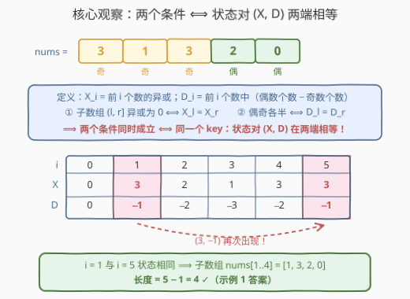
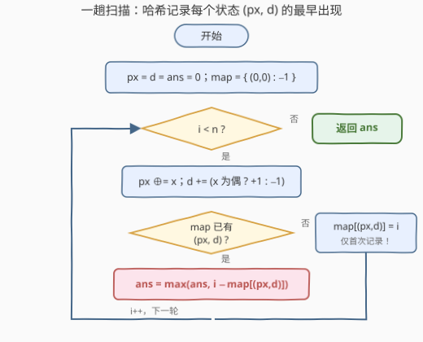

# 最大平衡异或子数组的长度

- **题目名称**：最大平衡异或子数组的长度
- **链接**：[3755. 最大平衡异或子数组的长度](https://leetcode.cn/problems/find-maximum-balanced-xor-subarray-length/)
- **难度**：中等
- **标签**：位运算、数组、哈希表、前缀和

## 1. 题目概述

给你一个整数数组 `nums`，返回同时满足以下两个条件的**最长子数组**的**长度**：

1. 子数组的按位异或（XOR）为 **0**；
2. 子数组包含的**偶数**和**奇数**数量**相等**。

如果不存在这样的子数组，则返回 `0`。**子数组**是数组中的一个连续、非空元素序列。

**示例 1**：

```text
输入：nums = [3,1,3,2,0]
输出：4
解释：子数组 [1,3,2,0] 的按位异或为 1 XOR 3 XOR 2 XOR 0 = 0，且包含 2 个偶数和 2 个奇数。
```

**示例 2**：

```text
输入：nums = [3,2,8,5,4,14,9,15]
输出：8
解释：整个数组的按位异或为 0，且包含 4 个偶数和 4 个奇数。
```

**示例 3**：

```text
输入：nums = [0]
输出：0
解释：没有非空子数组同时满足两个条件。
```

**约束条件**：

- $1 \le \text{nums.length} \le 10^5$
- $0 \le \text{nums}[i] \le 10^9$

> 💡 **审题关键**：① 两个条件都是**区间整体性质**，且都能表达成「前缀量之差 / 前缀量之异或」——这是**前缀 + 哈希配对**的强烈信号；② $n$ 达 $10^5$，子数组个数约 $5 \times 10^9$，$O(n^2)$ 枚举必然超时；③ 注意示例 3 的坑：单个元素 `0` 的异或确实是 0，但「1 个偶数、0 个奇数」不满足偶奇相等——**两个条件缺一不可**；④ 偶奇各半 ⟹ 合法子数组长度必为偶数，但这只是必要条件，不能拿来替代判定。

---

## 2. 解题思路

### 2.1 暴力思路：枚举所有子数组

双重循环枚举每个子数组 $[l, r]$，一边右扩一边维护区间异或值与偶/奇计数，满足两条就更新最长长度。

正确性显然，但 $n = 10^5$ 时要考察约 $5 \times 10^9$ 个子数组，时间直接爆炸。必须找到让「区间性质」能被 $O(1)$ 判定的表达——前缀量化是标准出路。

### 2.2 核心观察：两个条件合并成一个状态对 $(X, D)$



定义两个**前缀量**（$i$ 表示前 $i$ 个元素，$i = 0$ 为空前缀）：

- $X_i$ = 前 $i$ 个元素的**异或和**；
- $D_i$ = 前 $i$ 个元素中「**偶数个数 − 奇数个数**」。

子数组 $\text{nums}[l..r-1]$（即前缀区间 $(l, r]$）的两个条件可以完全「拆到两端」：

- **条件 ①**：区间异或 $= X_l \oplus X_r$，为 0 $\iff$ $X_l = X_r$（异或的「前缀相消」性质，与前缀和相减完全同构）；
- **条件 ②**：区间内偶数个数 $-$ 奇数个数 $= D_r - D_l$，偶奇相等 $\iff$ $D_r = D_l$。

于是两条要求合并成**一句话**：

> **子数组 $(l, r]$ 平衡 $\iff$ 状态对 $(X_l, D_l) = (X_r, D_r)$。**

「最长平衡子数组」就变成了「**同一状态对在序列上相距最远的两次出现**」——经典的前缀状态哈希问题：一趟扫描，哈希表记录每个状态对**首次出现**的下标；状态再次出现时，用当前下标减去首次下标更新答案（首次出现绝不更新，保最早才能拉出最长距离）。

> ⚠️ **必须初始化 `map = {(0, 0): -1}`**：空前缀的状态是 $(X_0, D_0) = (0, 0)$，记录在「下标 $-1$」处。没有它，所有从下标 0 开始的平衡子数组（如示例 2 的整个数组）都会漏掉。

### 2.3 算法流程图



三个实现要点：

- **状态更新**：每个元素只做两件事——`px ^= x`，`d += (x 为偶 ? +1 : -1)`，都是 $O(1)$；
- **只在首次出现时写入哈希表**：状态重复出现时不覆盖（保留最早位置才能最大化距离）；若题目改成求**最短**平衡子数组，则改为记录**最后**一次出现；
- **空前缀占位 $(0,0) \mapsto -1$**：让「从下标 0 开始的答案」与一般情况统一处理，不需要特判。

### 2.4 示例演算

**示例 1：nums = [3,1,3,2,0]（答案 4）**，奇偶性为 奇/奇/奇/偶/偶：

| 前缀长度 $i$ | 0 | 1 | 2 | 3 | 4 | 5 |
|------|---|---|---|---|---|---|
| $X_i$（前缀异或） | 0 | 3 | 2 | 1 | 3 | 3 |
| $D_i$（偶 − 奇） | 0 | −1 | −2 | −3 | −2 | −1 |

逐个状态对：$(0,0), (3,-1), (2,-2), (1,-3), (3,-2), (3,-1)$。状态 $(3,-1)$ 在 $i=1$ 与 $i=5$ 各出现一次 ⟹ 子数组 $\text{nums}[1..4] = [1,3,2,0]$，长度 $5 - 1 = \textbf{4}$ ✓（与官方解释一致）。其余状态均只出现一次，无更长的配对。

**示例 3：nums = [0]**：状态序列 $(0,0) \to (0,-1)$，无重复状态，返回 $\textbf{0}$ ✓——这正是「单个 0 异或为 0 但偶奇不等」的陷阱直观化：$X$ 回到了 0，但 $D$ 从 0 走到了 $-1$，**二元组必须整体相等**。

---

## 3. 参考代码

### C++

```cpp
class Solution {
public:
    int maxBalancedSubarray(vector<int>& nums) {
        int n = nums.size();
        // 把 (px, d) 打包成一个 long long 键：d + n ∈ [0, 2n] < 2^18
        auto key = [&](int px, int d) -> long long {
            return ((long long)px << 18) | (unsigned)(d + n);
        };
        unordered_map<long long, int> first;
        first[key(0, 0)] = -1;                 // 空前缀状态 (0, 0) 出现在 i = -1
        int px = 0, d = 0, ans = 0;
        for (int i = 0; i < n; ++i) {
            px ^= nums[i];
            d += (nums[i] % 2 == 0) ? 1 : -1;
            auto it = first.find(key(px, d));
            if (it != first.end()) {
                ans = max(ans, i - it->second);   // 只查不写，保最早出现
            } else {
                first[key(px, d)] = i;
            }
        }
        return ans;
    }
};
```

> 💡 **写法要点**：
> - `unordered_map` 没有内置的 pair 哈希，把 $(px, d)$ 打包成单个 `long long` 键最省事：$px < 2^{30}$、$d + n \in [0, 2 \times 10^5] < 2^{18}$，左移 18 位无冲突；若不想打包，`map<pair<int,int>,int>` 也可以，只是多一个 $\log$ 因子；
> - **空前缀的键也必须走同一个打包函数**：`first[0] = -1` 是常见笔误——字面键 0 对应的是 $(px, d) = (0, -n)$（全奇数组的真实状态），而非空状态的 $(0, 0)$；用 `key(0, 0)` 统一编码，示例 2 才能正确配对、`[1,1]` 才不会被误判；
> - $D$ 用「偶 − 奇」还是「奇 − 偶」都行，配对条件只关心**相等**；
> - `0 ≤ nums[i] ≤ 10^9`，`px` 始终在 `int` 范围内（异或不放大值域），无需 64 位。

### Python

```python
class Solution:
    def maxBalancedSubarray(self, nums: List[int]) -> int:
        first = {(0, 0): -1}          # 空前缀：状态 (0, 0) 在 i = -1
        px = d = ans = 0
        for i, x in enumerate(nums):
            px ^= x
            d += 1 if x % 2 == 0 else -1
            j = first.get((px, d))
            if j is not None:
                ans = max(ans, i - j)  # 已出现过：更新答案，不覆盖
            else:
                first[(px, d)] = i      # 首次出现：记录最早位置
        return ans
```

> 💡 **写法要点**：元组天然可哈希，直接拿 `(px, d)` 当键；「先查再插」的顺序保证重复状态永远不会覆盖首次出现的位置。

---

## 4. 复杂度分析

| 维度 | 复杂度 | 说明 |
|------|--------|------|
| **时间** | $O(n)$ 期望 | 一趟扫描，每步状态更新 $O(1)$ + 一次哈希查询/插入 |
| **空间** | $O(n)$ | 哈希表至多存 $n + 1$ 个不同的状态对 $(X_i, D_i)$ |
| **对比暴力法** | $O(n^2) \to O(n)$ | 暴力要逐个考察约 $n^2/2$ 个子数组；前缀状态把「区间性质判定」压缩成「两端状态相等」，一趟哈希配对解决 |

---

## 5. 扩展：为什么必须用二元组，不能只用一个量？

两个条件看似都能单独化成前缀配对，但**各自都不充分**：

- 只用 $X$（前缀异或相等）：只保证异或为 0。$X$ 的**最低位**恰好等于「前缀中奇数个数的奇偶性」，所以 $X_l = X_r$ 能推出区间内奇数有偶数个——却推不出「奇偶各半」（反例：$[0]$，$X$ 相等但 1 偶 0 奇）；
- 只用 $D$（奇偶差相等）：只保证偶奇相等。反例：$[1, 2]$，1 奇 1 偶满足 $D$ 配对，但 $1 \oplus 2 = 3 \ne 0$。

两个条件各自卡掉对方不管的自由度，**交集**才是答案——所以必须把两个前缀量**绑成一个复合键**。这正是「前缀状态哈希」家族的通用心法：

> **只要区间条件能写成「某个前缀函数在两端相等」，任意多个条件都能打包成复合键（元组 / 位掩码）一次性配对。**

- [525. 连续数组](https://leetcode.cn/problems/contiguous-array/)：0/1 翻译成 $\mp 1$，键是**一个**前缀差（单条件）；
- [1371. 每个元音包含偶数次的最长子字符串](https://leetcode.cn/problems/find-the-longest-substring-containing-vowels-in-even-counts/)：5 个元音的奇偶性打包成 **5 位掩码**（5 个同类条件）；
- 本题：异或 + 奇偶差打包成**二元组**（2 个异质条件）。

三者骨架完全相同：`map[状态] = 首次下标`，扫描时 `ans = max(ans, i - map[状态])`。> 另外若把本题的「最长」改成「**计数**」，配对逻辑不变，把 `max` 换成「累加该状态的历史出现次数」即可（如 [974](https://leetcode.cn/problems/subarray-sums-divisible-by-k/)、[1442](https://leetcode.cn/problems/count-triplets-that-can-form-two-arrays-of-equal-xor/)）。

---

## 6. 面试要点

**Q1：为什么两个条件能合并成一个二元组状态？**

> 两个条件都能拆到前缀的两端：区间异或 $= X_l \oplus X_r$，为 0 $\iff X_l = X_r$；区间偶奇差 $= D_r - D_l$，为零 $\iff D_l = D_r$。「区间性质」于是等价于「两端的前缀状态对相等」，与「子数组和为 0 $\iff$ 前缀和相等」完全同构。

**Q2：哈希表里存什么？为什么只记首次出现？**

> 存「状态对 → 该状态首次出现的下标」。求**最长**距离时要让两次出现的间隔尽量大，所以左端必须尽量早——首次出现一旦记录就永不覆盖。对偶地，求**最短**子数组时应记录最后一次出现。

**Q3：初始化 `map = {(0,0): -1}` 是干什么的？漏掉会怎样？**

> 它代表**空前缀**（前 0 个元素：异或为 0、偶奇差为 0）出现在下标 $-1$。有了它，「从下标 0 开始的平衡子数组」自动参与配对（如示例 2 的整个数组：$X_5 = D_5$ 的状态恰是 $(0,0)$）。漏掉会把所有前缀型答案砍掉，只剩「中间段」答案。

**Q4：这个套路和 525「连续数组」、1371「元音偶数次」是什么关系？**

> 同一模板的三次实例化：525 是单值键（前缀差），1371 是 5 位掩码键（五个奇偶条件），本题是二元组键（异或 + 奇偶差两个异质条件）。面试中说出「任何能写成前缀函数相等的条件都能打包进键里」这句推广，基本就把这族题讲透了。

**Q5：实现上有哪些坑？**

> ① C++ `unordered_map` 不支持 pair 键，需打包成整数（$px$ 左移 18 位拼上 $d + n$）或换 `map<pair<...>>`；② $D$ 的取值范围是 $[-n, n]$，打包偏移别忘了 `+n`；③ **空前缀的键要走同一个打包函数**——`first[0] = -1` 是隐蔽笔误：字面键 0 实际对应状态 $(0, -n)$，既漏掉从下标 0 起的答案（示例 2 全数组），又会让全奇数组如 `[1,1]` 被误判为平衡；④ 重复状态**只查不写**，手滑写成 `map[key] = i` 就会把最早位置覆盖掉，答案悄悄变小；⑤ 单元素 `0` 是经典陷阱——异或为 0 但偶奇不等，状态对 $(0, -1) \ne (0, 0)$，二元组整体比较天然避开这个坑。

> 💡 **一句话总结**：两条区间条件 → 两个前缀量（异或 $X$、奇偶差 $D$）→ 一个复合键 $(X, D)$ → 哈希记首次出现 → 最远配对距离即答案。$O(n)$ 一趟收工。

---

## 7. 同类练习题

- [525. 连续数组](https://leetcode.cn/problems/contiguous-array/)（[题解](../0501-0600/525_连续数组.md)）：本题条件 ② 的原型——0/1 化 $\mp 1$ 前缀差，相等配对求最长
- [1371. 每个元音包含偶数次的最长子字符串](https://leetcode.cn/problems/find-the-longest-substring-containing-vowels-in-even-counts/)（[题解](../1301-1400/1371_每个元音包含偶数次的最长子字符串.md)）：多个奇偶条件打包成位掩码键，框架与本题完全同构
- [974. 和可被 K 整除的子数组](https://leetcode.cn/problems/subarray-sums-divisible-by-k/)（[题解](../0901-1000/974_和可被K整除的子数组.md)）：前缀同余配对的**计数**版（最长 → 计数的对偶变体）
- [1442. 形成两个异或相等数组的三元组数目](https://leetcode.cn/problems/count-triplets-that-can-form-two-arrays-of-equal-xor/)（[题解](../1401-1500/1442_形成两个异或相等数组的三元组数目.md)）：前缀异或相等配对的计数版，与本题条件 ① 互为镜像
- [1915. 最美子字符串的数目](https://leetcode.cn/problems/number-of-wonderful-substrings/)（[题解](../1901-2000/1915_最美子字符串的数目.md)）：状态掩码配对计数 + 至多一个异常位的容差枚举，掩码键的进阶练习
