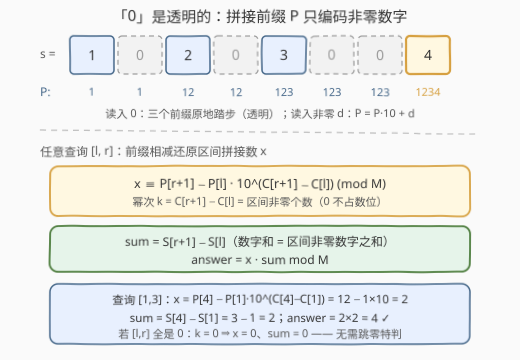
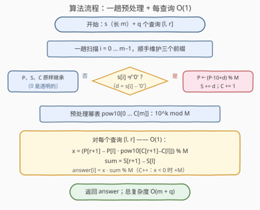

# 连接非零数字并乘以其数字和 II

- **题目名称**：连接非零数字并乘以其数字和 II
- **链接**：[3756. 连接非零数字并乘以其数字和 II](https://leetcode.cn/problems/concatenate-non-zero-digits-and-multiply-by-sum-ii/)
- **难度**：中等
- **标签**：数学、字符串、前缀和

## 1. 题目概述

给你一个长度为 `m` 的字符串 `s`，其中仅包含数字。另给你一个二维整数数组 `queries`，其中 `queries[i] = [l_i, r_i]`。

对于每个 `queries[i]`，提取**子串** `s[l_i..r_i]`，然后执行以下操作：

- 将子串中所有**非零数字**按照原始顺序连接起来，形成一个新的整数 `x`。如果没有非零数字，则 `x = 0`；
- 令 `sum` 为 `x` 中所有数字的**数字和**，答案为 `x * sum`。

返回整数数组 `answer`，其中 `answer[i]` 是第 `i` 个查询的答案。由于答案可能非常大，请返回其对 $10^9 + 7$ 取余数的结果。

**示例 1**：

```text
输入：s = "10203004", queries = [[0,7],[1,3],[4,6]]
输出：[12340, 4, 9]
解释：
- s[0..7] = "10203004"：x = 1234，sum = 1+2+3+4 = 10，答案 = 12340；
- s[1..3] = "020"：x = 2，sum = 2，答案 = 4；
- s[4..6] = "300"：x = 3，sum = 3，答案 = 9。
```

**示例 2**：

```text
输入：s = "1000", queries = [[0,3],[1,1]]
输出：[1, 0]
解释：
- s[0..3] = "1000"：x = 1，sum = 1，答案 = 1；
- s[1..1] = "0"：无非零数字，x = 0，sum = 0，答案 = 0。
```

**示例 3**：

```text
输入：s = "9876543210", queries = [[0,9]]
输出：[444444137]
解释：x = 987654321，sum = 45，987654321 × 45 = 44444444445，
     对 10^9 + 7 取余得 444444137。
```

**约束条件**：

- $1 \le m = \text{s.length} \le 10^5$
- `s` 仅由数字组成
- $1 \le \text{queries.length} \le 10^5$
- $0 \le l_i \le r_i < m$

> 💡 **审题关键**：四件事决定解法形态——① 拼接数 `x` 的位数可达 $10^5$，**不可能精确表示**，必然全程在模 $M = 10^9+7$ 下维护；② 查询 $10^5$ 个、串长 $10^5$，每个查询独立扫子串最坏 $O(m \cdot q) = 10^{10}$，必须**前缀化到每查询 $O(1)$**；③ `x` 的数字和恰等于区间内**非零数字之和**（0 既不贡献数位也不贡献和），一个普通前缀和数组即可；④ 答案取模意味着可以用「前缀相减」还原区间值——这正是**多项式滚动哈希**的骨架。

---

## 2. 解题思路

### 2.1 暴力思路：逐查询扫描 + Horner 递推

对每个查询 `[l, r]` 独立处理：从左到右扫子串，遇到非零数字 `d` 就做 `x = x * 10 + d`（**秦九韶/Horner 递推**）并累加 `sum`，最后 `x * sum % M`。单查询 $O(r - l + 1)$，总复杂度 $O(m \cdot q)$，最坏 $10^{10}$ 次字符操作，必然超时。

I 版 [3754](https://leetcode.cn/problems/concatenate-non-zero-digits-and-multiply-by-sum-i/)（Easy）只有一个 $n \le 10^9$ 的整数，一趟模拟即可；本题把「一次操作」放大成 $10^5$ 次区间查询，逼我们把一次性的递推**前缀化**。

### 2.2 核心观察：「0 透明」的前缀拼接 + 前缀相减



**观察一（sum 是平凡前缀和）**：`x` 由非零数字拼接而成，其数字和就是区间内非零数字之和。维护 $S[i]$ = 前 $i$ 个字符中非零数字之和，则 $\text{sum} = S[r+1] - S[l]$。

**观察二（拼接数是底 10 的多项式）**：把非零数字序列 $d_1 d_2 \cdots d_k$ 拼接成的数，就是多项式 $\sum_j d_j \cdot 10^{k-j}$ 的值。于是定义**拼接前缀**：

$$P[i] = \big(\text{前 } i \text{ 个字符中的非零数字按序拼接成的数}\big) \bmod M$$

递推即是 Horner 公式——遇到非零 $d$ 时 $P[i+1] = (P[i] \cdot 10 + d) \bmod M$，**乘 10 就是整体左移一位、腾出个位**。

**观察三（0 是透明的）**：字符 `'0'` 对 $P$、$S$、$C$（非零个数计数）三个前缀**全部原地踏步**。这不是巧合而是设计：0 既不占 `x` 的数位、也不进数字和。同时维护：

$$C[i] = \text{前 } i \text{ 个字符中的非零数字个数}$$

**观察四（前缀相减还原区间）**：记 $P^{\text{true}}$ 为**不取模的真值**，$k = C[r+1] - C[l]$ 为区间内非零数字个数（即 `x` 的位数）。由拼接的可分解性：

$$P^{\text{true}}[r+1] = P^{\text{true}}[l] \cdot 10^{k} + x \quad\Longrightarrow\quad x = P^{\text{true}}[r+1] - P^{\text{true}}[l] \cdot 10^{C[r+1]-C[l]}$$

同余对加减乘封闭，故两边同时取模仍然成立——存 $\hat P = P \bmod M$ 与幂表 $\widehat{10^k} = 10^k \bmod M$ 就足够：

$$\boxed{\;x \equiv P[r+1] - P[l] \cdot \text{pow10}\,[\,C[r+1]-C[l]\,] \pmod M\;}$$

$$\text{sum} = S[r+1] - S[l], \qquad \text{answer} = x \cdot \text{sum} \bmod M$$

> 💡 **为什么左端 `l` 不需要跳到第一个非零数字？** 因为 0 透明，$P[l]$ 本来就只编码前 $l$ 个字符的非零信息。若 $[l, r]$ 内全是 0，则 $C[r+1] = C[l]$、$P[r+1] = P[l]$，公式自动给出 $x = 0$、$\text{sum} = 0$。无需 next 数组、无需特判——对比 [2055 蜡烛之间的盘子](https://leetcode.cn/problems/plates-between-candles/) 那类必须「跳到关键字符」的题，本题的跳过逻辑被前缀定义本身吸收了。
>
> ⚠️ **两个工程坑**：① 减法取模可能为负——$P[r+1]$ 与 $P[l] \cdot \text{pow10}$ 都是 $[0, M)$ 内的值，大小关系与真值无关（模不保序），C++ 的 `%` 对负数返回负余数，取模后要 `if (x < 0) x += MOD`，Python 的 `%` 天然非负；② 幂次是 $C[r+1]-C[l]$（非零个数）而不是 $r+1-l$（子串长）——**0 不占数位**，误用后者会把 0 也当一位、乘错 10 的幂。

### 2.3 算法流程



汇总：预处理一趟 $O(m)$ 扫描同时构建 $P / S / C$ 三个前缀（非零走 Horner 更新，零透明继承），再花 $O(C[m])$ 构建幂表 `pow10`；随后每个查询 4 次数组访问 + 常数次模运算，$O(1)$ 得解。

### 2.4 示例演算

以示例 1 的 $s = \text{"10203004"}$（$m = 8$）建表：

| $i$ | 0 | 1 | 2 | 3 | 4 | 5 | 6 | 7 | 8 |
|------|---|---|---|---|---|---|---|---|---|
| $s[i{-}1]$ | — | 1 | 0 | 2 | 0 | 3 | 0 | 0 | 4 |
| $P[i]$ | 0 | 1 | 1 | 12 | 12 | 123 | 123 | 123 | 1234 |
| $C[i]$ | 0 | 1 | 1 | 2 | 2 | 3 | 3 | 3 | 4 |
| $S[i]$ | 0 | 1 | 1 | 3 | 3 | 6 | 6 | 6 | 10 |

三个官方查询逐一过公式：

- **[0, 7]**：$x = P[8] - P[0] \cdot 10^{C[8]-C[0]} = 1234 - 0 = 1234$，$\text{sum} = S[8] - S[0] = 10$，答案 $= 12340$ ✓
- **[1, 3]**：$x = P[4] - P[1] \cdot 10^{C[4]-C[1]} = 12 - 1 \times 10 = 2$，$\text{sum} = S[4] - S[1] = 2$，答案 $= 4$ ✓（子串 `"020"` 里的 0 被「透明」消化）
- **[4, 6]**：$x = P[7] - P[4] \cdot 10^{C[7]-C[4]} = 123 - 12 \times 10 = 3$，$\text{sum} = S[7] - S[4] = 3$，答案 $= 9$ ✓

再验两个边界：

- **[5, 6]（全 0 子串 `"00"`）**：$k = C[7] - C[5] = 0$，$x = P[7] - P[5] \cdot 10^0 = 123 - 123 = 0$，$\text{sum} = 0$，答案 $0$ ✓——左端不跳零也不会错的直接例证；
- **示例 3 的取模**：$x = 987654321 < M$ 原样保留，$x \cdot 45 = 44444444445 = 44 \times (10^9 + 7) + 444444137$，答案 $444444137$ ✓。

---

## 3. 参考代码

### C++

```cpp
class Solution {
public:
    vector<int> sumAndMultiply(string s, vector<vector<int>>& queries) {
        const long long MOD = 1'000'000'007LL;
        int m = s.size();
        vector<long long> P(m + 1), S(m + 1);   // 拼接前缀 / 非零数字和前缀
        vector<int> C(m + 1);                   // 非零数字个数前缀
        for (int i = 0; i < m; ++i) {
            P[i + 1] = P[i];                    // 0：透明继承
            S[i + 1] = S[i];
            C[i + 1] = C[i];
            if (s[i] != '0') {
                int d = s[i] - '0';
                P[i + 1] = (P[i] * 10 + d) % MOD;   // Horner 拼接
                S[i + 1] = S[i] + d;
                C[i + 1] = C[i] + 1;
            }
        }
        vector<long long> pow10(C[m] + 1);      // 10 的幂表（mod M）
        pow10[0] = 1;
        for (int i = 1; i <= C[m]; ++i) pow10[i] = pow10[i - 1] * 10 % MOD;

        vector<int> ans;
        ans.reserve(queries.size());
        for (auto& q : queries) {
            int l = q[0], r = q[1];
            long long x = (P[r + 1] - P[l] * pow10[C[r + 1] - C[l]]) % MOD;
            if (x < 0) x += MOD;                // 减法取模防负
            long long sum = S[r + 1] - S[l];
            ans.push_back((int)(x * sum % MOD));
        }
        return ans;
    }
};
```

### Python

```python
class Solution:
    def sumAndMultiply(self, s: str, queries: List[List[int]]) -> List[int]:
        MOD = 10 ** 9 + 7
        m = len(s)
        P = [0] * (m + 1)   # 拼接前缀（mod M）
        S = [0] * (m + 1)   # 非零数字和前缀
        C = [0] * (m + 1)   # 非零数字个数前缀
        for i, ch in enumerate(s):
            P[i + 1], S[i + 1], C[i + 1] = P[i], S[i], C[i]   # 0：透明继承
            if ch != '0':
                d = int(ch)
                P[i + 1] = (P[i] * 10 + d) % MOD               # Horner 拼接
                S[i + 1] = S[i] + d
                C[i + 1] = C[i] + 1
        pow10 = [1] * (C[m] + 1)                               # 10 的幂表
        for i in range(1, C[m] + 1):
            pow10[i] = pow10[i - 1] * 10 % MOD

        ans = []
        for l, r in queries:
            x = (P[r + 1] - P[l] * pow10[C[r + 1] - C[l]]) % MOD   # 天然非负
            sm = S[r + 1] - S[l]
            ans.append(x * sm % MOD)
        return ans
```

> 💡 **写法要点**：
> - 三个前缀用**同一个循环**构建（连 `pow10` 也可顺手接在后面），别写成三趟扫描；
> - `pow10` 只需开到 $C[m]$（非零总个数），不必到 $m$；
> - C++ 全程 `long long`：三处乘法 $P \cdot 10 < 10M$、$P \cdot \text{pow10} < M^2 \approx 10^{18}$、$x \cdot \text{sum} < M \cdot 9 \times 10^5 \approx 9 \times 10^{14}$，`int32` 三处都会截断。

---

## 4. 复杂度分析

| 维度 | 复杂度 | 说明 |
|------|--------|------|
| **时间** | $O(m + q)$ | 预处理一趟 $O(m)$（P/S/C 同循环）+ 幂表 $O(C[m])$；每查询 4 次数组访问与常数次模运算 |
| **空间** | $O(m)$ | 三个长度 $m+1$ 的前缀数组 + 长度 $C[m]+1 \le m+1$ 的幂表 |
| **对比暴力** | $O(m \cdot q) \to O(m + q)$ | 最坏 $10^{10}$ 次字符处理 → $2 \times 10^5$ 次数组操作，约五个数量级的差距 |

---

## 5. 扩展：这就是多项式滚动哈希

本题的公式与**字符串滚动哈希**完全同构，对照着看很有味道：

| 要素 | 滚动哈希 | 本题 |
|------|----------|------|
| 多项式系数 | 每个字符的编码 | 非零数字（0 被跳过） |
| 底数 $b$ | 随机大数（防对抗碰撞） | 固定为 10 |
| 前缀 | $h[i+1] = h[i] \cdot b + c_i$ | $P[i+1] = P[i] \cdot 10 + d$ |
| 区间还原 | $h[r+1] - h[l] \cdot b^{r-l+1}$ | $P[r+1] - P[l] \cdot 10^{C[r+1]-C[l]}$ |
| 模数 | 大素数（防溢出/碰撞） | $10^9+7$（题目指定） |

区别只在两点：哈希的底数与模数是为了**防碰撞**而随机化，本题底数 10、模数 $10^9+7$ 是题目钦定的「天然哈希」；哈希的幂次是子串长 $r-l+1$（每个字符都占位），本题的幂次是非零个数 $C[r+1]-C[l]$（0 不占位）——「跳过某些字符」的推广做法见 [3614](https://leetcode.cn/problems/process-string-with-special-operations-ii/) 一类的位置映射题。若把「跳过 0」换成「跳过任意指定字符集」（比如只拼接奇数数字），公式一字不改照搬——透明性只要求被跳过的字符不改变三个前缀。

另一个方向的变体：[2564. 子字符串异或查询](https://leetcode.cn/problems/substring-xor-queries/) 把子串按**二进制**读成数（底数为 2 的同款），因查询值域 $< 2^{30}$ 甚至可以预处理「值 → 出现位置」的映射。

---

## 6. 面试要点

**Q1：查询左端 `l` 为什么不需要跳到第一个非零数字？**

> 因为 `'0'` 对 $P$、$S$、$C$ 三个前缀都**透明**：$P[l]$ 本来就只编码前 $l$ 个字符的非零信息。若 $[l, r]$ 内没有非零数字，则 $C[r+1] = C[l]$、$P[r+1] = P[l]$，公式自动给出 $x = 0$、$\text{sum} = 0$。对比 2055（蜡烛之间的盘子）必须用 next 数组跳到蜡烛，本题的跳过逻辑被前缀定义本身吸收了——面试时能主动指出这一点是加分项。

**Q2：拼接数最多 $10^5$ 位，怎么在模意义下维护与还原？**

> 维护用 **Horner 递推**：每读一个非零 $d$，$P \leftarrow (P \cdot 10 + d) \bmod M$，乘 10 即整体左移一位。还原用**前缀相减**：$x \equiv P[r+1] - P[l] \cdot 10^{C[r+1]-C[l]}$，幂表预算。合法性根基是同余对加减乘封闭——真值等式 $P^{\text{true}}[r+1] = P^{\text{true}}[l] \cdot 10^k + x$ 两边取模依然成立。

**Q3：C++ 里 `(P[r+1] - P[l]*pow10[k]) % MOD` 为什么可能是负数？怎么修？**

> 两个操作数都是 $[0, M)$ 内的值，其大小关系与真值大小无关（模运算不保序），被减数完全可能更小。C++ 的 `%` 对负被除数返回负余数，所以取模后要 `if (x < 0) x += MOD`；Java 同理。Python 的 `%` 恒返回 $[0, M)$ 内的值，无需处理。

**Q4：哪里会溢出？**

> 三处乘法：$P \cdot 10 < 10^{10}$、$P[l] \cdot \text{pow10}[k] < M^2 \approx 10^{18}$（贴近但仍在 `long long` 的 $9.2 \times 10^{18}$ 之内）、$x \cdot \text{sum} < 9 \times 10^{14}$。全程 64 位整数即可；若模数更大（如 $10^{18}$ 级），$M^2$ 会爆 `long long`，需要 `__int128` 或蒙哥马利乘法。

**Q5：幂次为什么是 $C[r+1] - C[l]$ 而不是 $r + 1 - l$？**

> 幂次的语义是「把 $P[l]$ 左移多少位才能与区间拼接数 $x$ 的数位对齐」，即**区间内非零数字的个数**——也就是 $x$ 的位数。`'0'` 不占位数（这正是题目定义），误用子串长 $r+1-l$ 会把 0 也当数位，乘错 10 的幂。这是本题最容易写错的一个下标。

> 💡 **一句话总结**：非零拼接数 = 底 10 的多项式；$P/S/C$ 三个前缀 + `pow10` 幂表，`'0'` 全程透明免特判；每查询一次减法（防负）一次乘法，$O(m + q)$ 收工。

---

## 7. 同类练习题

- [3754. 连接非零数字并乘以其数字和 I](https://leetcode.cn/problems/concatenate-non-zero-digits-and-multiply-by-sum-i/)：单整数 $n \le 10^9$ 的 Easy 版，一趟模拟即可；II 版把一次操作放大成 $10^5$ 次区间查询，逼出前缀化
- [2055. 蜡烛之间的盘子](https://leetcode.cn/problems/plates-between-candles/)（[题解](../2001-2100/2055_蜡烛之间的盘子.md)）：同样靠「无关字符透明 + 前缀计数 + O(1) 查询」，那里还需跳到蜡烛的映射，本题连跳都不用跳，可对照体会前缀定义如何吸收特判
- [2564. 子字符串异或查询](https://leetcode.cn/problems/substring-xor-queries/)（[题解](../2501-2600/2564_子字符串异或查询.md)）：把子串按**二进制**读成数的查询版，「前缀进制值」的底数 2 特例
- [1177. 构建回文串检测](https://leetcode.cn/problems/can-make-palindrome-from-substring/)（[题解](../1101-1200/1177_构建回文串检测.md)）：前缀计数数组回答区间字符频率查询，本题公式里 $C/S$ 两项的入门形态
- [303. 区域和检索 - 数组不可变](https://leetcode.cn/problems/range-sum-query-immutable/)：最裸的前缀和区间查询模板，本题将它推广到「拼接数 mod」这种非线性前缀
