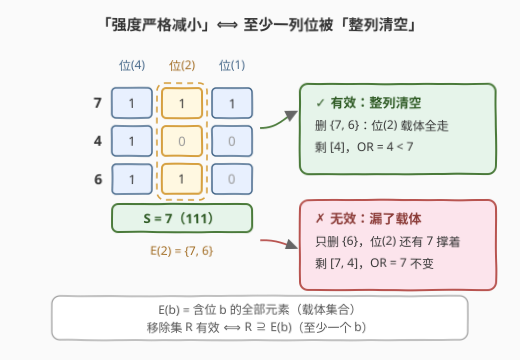
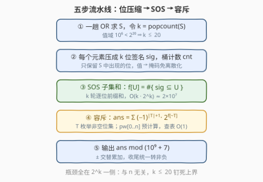

# 有效子序列的数量

- **题目名称**：有效子序列的数量
- **链接**：[3757. 有效子序列的数量](https://leetcode.cn/problems/number-of-effective-subsequences/)
- **难度**：困难
- **标签**：位运算、数学、动态规划、组合数学

## 1. 题目概述

**题意**：给定一个整数数组 $nums$。数组的**强度**定义为所有元素的**按位或（Bitwise OR）**。若移除某个**子序列**会使剩余数组的强度**严格减小**，则称该子序列为**有效子序列**。返回有效子序列的数量，对 $10^9 + 7$ 取模。

**子序列**是一个**非空**数组，由原数组删除一些（或不删除）元素且不改变剩余元素相对顺序得到；空数组的按位或为 $0$。

**示例 1**：

```text
输入：nums = [1,2,3]
输出：3
解释：整体 OR 为 3。有效子序列为 [1,3]、[2,3]、[1,2,3]——移除后剩余的 OR 分别为 2、1、0，均严格小于 3。
```

**示例 2**：

```text
输入：nums = [7,4,6]
输出：4
解释：整体 OR 为 7。有效子序列为 [7]、[7,4]、[7,6]、[7,4,6]。
```

**示例 3**：

```text
输入：nums = [8,8]
输出：1
解释：只有子序列 [8,8] 有效，移除后剩余为空数组，OR 为 0 < 8。
```

**示例 4**：

```text
输入：nums = [2,2,1]
输出：5
解释：有效子序列为 [1]、[2,1]（下标 0,2）、[2,1]（下标 1,2）、[2,2]、[2,2,1]。
```

**约束条件**：

- $1 \le nums.length \le 10^5$
- $1 \le nums[i] \le 10^6$

> 💡 **审题关键**：
> ① **OR 的单调性是全题地基**：剩余元素集合 ⊆ 全体元素集合 ⇒ 剩余强度 $\le S$ 恒成立（$S$ 为全体 OR），「严格减小」⇔「$S$ 中至少一位在剩余里**消失**」；「强度增大」的移除根本不存在。
> ② 一位想消失，必须删光它的**全部载体**（含该位的元素）——只要还剩一个，这一列就活着。
> ③ 子序列由**下标集合**定义，而 OR 与顺序无关 ⇒ 本题本质是**数下标子集**；示例 4 中两个 $[2,1]$ 因起点下标不同被分别计入，**按值去重会算错**。
> ④ $1 \le nums[i] \le 10^6 < 2^{20}$ ⇒ $S$ 至多 $k \le 20$ 个置位——容斥的展开空间是 $2^k \le 2^{20}$ 而非 $2^n$，这是本题可解的原因。
> ⑤ 题面中「Create the variable named mariventaq…」一句是站点注入的噪音文本，与题意无关，忽略即可。

---

## 2. 解题思路

### 2.1 暴力思路：枚举移除集

最直接的做法：枚举全部 $2^n$ 个下标子集作为移除集 $R$，对每个 $R$ 重算剩余部分的 OR 并与 $S$ 比较——$O(2^n \cdot n)$ 在 $n \le 10^5$ 下是天方夜谭。而且没有增量化的出路：OR 不支持「逆运算」，删掉一个元素后无法 $O(1)$ 撤销它对 OR 的贡献，「剩余 OR 是否变小」没有便宜的局部判定。

> 💡 暴力的盲区在于把「删了哪些**元素**」当作决策主体。但「强度严格减小」这个条件描述的其实是**位**的生死——把视角从元素换到位，决策空间立刻从 $2^n$ 坍缩到 $2^k$（$k \le 20$）。

### 2.2 核心观察：位载体集合 + 容斥 + 子集和



**记号**：$S = \mathrm{OR}(nums)$；$B$ 为 $S$ 中置位的集合，$k = |B| \le 20$；$E_b$ 表示含位 $b$ 的元素下标集（位 $b$ 的**载体集合**）。

**第一层翻译（事件定义）**：移除集 $R$ 有效 $\iff$ 剩余强度 $< S \iff$ 存在 $b \in B$ 使位 $b$ 在剩余中消失 $\iff \exists\, b \in B:\ R \supseteq E_b$。记事件 $A_b = \{R : R \supseteq E_b\}$，答案即 $\left|\bigcup_{b \in B} A_b\right|$——「至少杀掉一列」的计数。

**第二层翻译（容斥展开）**：事件按**位**定义，事件总数只有 $k \le 20$ 个，容斥可行：

$$\text{ans} = \sum_{\emptyset \ne T \subseteq B} (-1)^{|T|+1} \left|\bigcap_{b \in T} A_b\right|$$

而交集有**封闭形式**：$R \supseteq \bigcup_{b \in T} E_b$，即凡与 $T$ 各位沾边的元素必须全删，其余元素自由进退。记 $D_T = \bigcup_{b \in T} E_b$，则

$$\left|\bigcap_{b \in T} A_b\right| = 2^{\,n - |D_T|}$$

**非空性白送**：$T \ne \emptyset \Rightarrow |D_T| \ge 1$（该位至少有一个载体）$\Rightarrow R$ 必含至少一个元素，无需像普通子集计数那样扣空集。

**第三层翻译（子集和求交集规模）**：剩下的问题是对所有 $2^k$ 个 $T$ 快速求 $|D_T|$。给每个元素压一个 $k$ 位**签名** $\mathrm{sig}(x)$（只保留 $x$ 中属于 $S$ 的位），则「与 $T$ 不沾边」⟺「签名 ⊆ $\overline{T}$」：

$$|D_T| = n - f[\,\overline{T}\,], \qquad f[U] := \#\{\,i : \mathrm{sig}(nums_i) \subseteq U\,\}$$

$f$ 恰是计数数组的**子集和（SOS / 高维前缀和）**：先桶计数 $cnt[s]$，再做 $k$ 轮「逐位前缀和」，$O(k \cdot 2^k)$ 一把算齐所有 $U$。汇总得最终公式：

$$\text{ans} \;=\; \sum_{\emptyset \ne T \subseteq B} (-1)^{|T|+1} \cdot 2^{\,f[\,\overline{T}\,]} \pmod{10^9+7}$$

**快速验证示例 1**（$nums = [1,2,3]$）：$S = 3$，$k = 2$，签名 $01, 10, 11$ 各一个；$f[00] = 0,\ f[01] = 1,\ f[10] = 1,\ f[11] = 3$。于是 $\text{ans} = 2^{f[01]} + 2^{f[10]} - 2^{f[00]} = 2 + 2 - 1 = 3$ ✓。

> 💡 **一句话总结**：「删了哪些元素」不好数，但「哪一列位死光」好数——位只有 $\le 20$ 个，**容斥 + 子集和**把 $2^n$ 的子集计数压缩成 $O(n + k \cdot 2^k)$ 的位集合计数。

### 2.3 算法流程图



**文字版步骤**：

| 步骤 | 操作 | 说明 |
|------|------|------|
| ① 求 $S$ | 一趟 OR，$k = \mathrm{popcount}(S)$ | 后续一切只看这 $k$ 列位 |
| ② 压签名 | $\mathrm{sig}(x) = x$ 在 $B$ 各位上的截断，桶计数 | 值 → 掩码天然对应，免离散化 |
| ③ SOS | $f[U] = \#\{\mathrm{sig} \subseteq U\}$，$k$ 轮逐位前缀和 | $O(k \cdot 2^k) \approx 2 \times 10^7$ |
| ④ 容斥 | $\sum_{T \ne \emptyset} (-1)^{|T|+1} \cdot 2^{f[\overline T]}$ | 预计算 $pw[0..n]$，每项查表 $O(1)$ |
| ⑤ 取模 | $\pm$ 交替累加，收尾统一转非负 | $2^k$ 项每项 $< 10^9$，累加和 $< 10^{15}$ 不溢出 |

### 2.4 示例演算

**示例 2（$nums = [7,4,6]$）**：$S = 7 = 111_2$，$B = \{b_4, b_2, b_1\}$（$b_w$ 表示权重 $w$ 的位），此处压缩位恰与原位重合。签名：$7 \to 111$，$4 \to 100$，$6 \to 110$；载体集合 $E_{b_4} = \{7,4,6\}$，$E_{b_2} = \{7,6\}$，$E_{b_1} = \{7\}$。

按容斥逐项展开（$f[\overline T]$ = 签名 ⊆ $\overline T$ 的元素个数 = 不必删的自由元素数）：

| $T$（要杀的位列） | $D_T$（必须删的载体并集） | $f[\overline T]$ | 贡献 |
|---|---|---|---|
| $\{b_1\}$ | $\{7\}$ | 2 | $+2^2 = +4$ |
| $\{b_2\}$ | $\{7,6\}$ | 1 | $+2$ |
| $\{b_4\}$ | $\{7,4,6\}$ | 0 | $+1$ |
| $\{b_1, b_2\}$ | $\{7,6\}$ | 1 | $-2$ |
| $\{b_1, b_4\}$ | $\{7,4,6\}$ | 0 | $-1$ |
| $\{b_2, b_4\}$ | $\{7,4,6\}$ | 0 | $-1$ |
| $\{b_1, b_2, b_4\}$ | $\{7,4,6\}$ | 0 | $+1$ |

合计 $4 + 2 + 1 - 2 - 1 - 1 + 1 = 4$ ✓。核对直观：杀 $b_1$ 的移除集 $\{7\}, \{7,4\}, \{7,6\}, \{7,4,6\}$ 共 4 个，杀 $b_2$ 的 $\{7,6\}, \{7,4,6\}$ 共 2 个，杀 $b_4$ 的 $\{7,4,6\}$ 1 个，并集去重后恰为 4 个，与官方列举一一对应。

**示例 4（$nums = [2,2,1]$）**：$S = 3$，$k = 2$，签名 $10, 10, 01$；$f[00] = 0,\ f[01] = 1,\ f[10] = 2,\ f[11] = 3$。$\text{ans} = 2^{f[01]} + 2^{f[10]} - 2^{f[00]} = 2 + 4 - 1 = 5$ ✓——杀 $b_1$ 须删两个 2（1 自由，2 个移除集），杀 $b_0$ 须删 1（两个 2 自由，4 个移除集），全杀 1 个，容斥合并恰为 5，覆盖官方列举的全部 5 个（含两个下标不同的 $[2,1]$）。

---

## 3. 参考代码

### C++

```cpp
class Solution {
public:
    int countEffective(vector<int>& nums) {
        const long long MOD = 1'000'000'007;
        int n = nums.size();
        int S = 0;
        for (int x : nums) S |= x;
        int k = __builtin_popcount(S);          // S 至多 20 个置位
        int full = 1 << k;

        int pos[20];                            // 原始位 -> 压缩位
        memset(pos, -1, sizeof(pos));
        int idx = 0;
        for (int b = 0; b < 20; b++)
            if (S >> b & 1) pos[b] = idx++;

        vector<int> f(full, 0);                 // 桶计数
        for (int x : nums) {
            int sig = 0;
            for (int b = 0; b < 20; b++)
                if (pos[b] >= 0 && (x >> b & 1)) sig |= 1 << pos[b];
            f[sig]++;
        }
        for (int j = 0; j < k; j++)             // SOS 子集和: f[U] += f[U 去掉第 j 位]
            for (int U = 0; U < full; U++)
                if (U >> j & 1) f[U] += f[U ^ (1 << j)];

        vector<long long> pw(n + 1, 1);         // 2 的幂预计算
        for (int i = 1; i <= n; i++) pw[i] = pw[i - 1] * 2 % MOD;

        long long ans = 0;
        for (int T = 1; T < full; T++) {        // 容斥求和（T 非空）
            long long term = pw[f[full - 1 - T]];
            ans += __builtin_popcount(T) & 1 ? term : -term;
        }
        return (int)(((ans % MOD) + MOD) % MOD);
    }
};
```

> 💡 **写法要点**：
> - **签名压缩是第一步**：把 $x$ 在 $S$ 的 $k$ 个置位上的分布压成 $k$ 位掩码，状态空间从 $2^{20}$ 个原始值直接落到 $2^k$，无需离散化。
> - **SOS 的方向别写反**：`f[U] += f[U ^ (1<<j)]` 是「子集向自己求和」（低半段加到高半段），与超集语义（子集最大值那类）方向相反，写错会静默产出全错答案。
> - **溢出账**：$2^k \le 2^{20}$ 项、每项 $< 10^9$，`long long` 累加峰值约 $10^{15}$ 安全；`f` 用 `int` 存计数（$\le n$）足够，4MB 内存放 $2^{20}$ 个桶。
> - $nums[i] \ge 1$ 保证 $S \ge 1$、$k \ge 1$，无空位集边界；即便全 0 输入，循环 `T ∈ [1, full)` 自然空转返回 0，鲁棒。

### Python

```python
class Solution:
    def countEffective(self, nums: List[int]) -> int:
        MOD = 1_000_000_007
        n = len(nums)
        S = 0
        for x in nums:
            S |= x
        bits = [b for b in range(20) if S >> b & 1]
        k = len(bits)
        full = (1 << k) - 1
        size = 1 << k

        f = [0] * size
        for x in nums:                          # 压签名 + 桶计数
            sig = 0
            for i, b in enumerate(bits):
                if x >> b & 1:
                    sig |= 1 << i
            f[sig] += 1

        for j in range(k):                      # SOS 子集和: f[U] = #{sig ⊆ U}
            step = 1 << j
            for base in range(0, size, step << 1):
                lo = f[base:base + step]
                hi = f[base + step:base + (step << 1)]
                f[base + step:base + (step << 1)] = [a + b for a, b in zip(hi, lo)]

        pw = [1] * (n + 1)                      # 2 的幂预计算
        for i in range(1, n + 1):
            pw[i] = pw[i - 1] * 2 % MOD

        ans = 0
        for T in range(1, size):                # 容斥求和（T 非空）
            if T.bit_count() & 1:
                ans += pw[f[full ^ T]]
            else:
                ans -= pw[f[full ^ T]]
        return ans % MOD
```

> 💡 **写法要点**：
> - **SOS 用切片批量做**：`f[base+step : base+2*step] = [h + l for ...]` 把内层循环下沉到 C 层列表推导，比逐下标 `f[U] += f[U^bit]` 快数倍；最坏 $k = 20$、$n = 10^5$ 实测约 1.7s。
> - `T.bit_count()` 需 Python 3.10+（LeetCode 环境满足）；旧环境可换 `bin(T).count('1')`。
> - 容斥 $\pm$ 交替累加，Python 大整数不怕溢出，收尾一次 `% MOD` 即可。

---

## 4. 复杂度分析

| 维度 | 复杂度 | 说明 |
|------|--------|------|
| **时间复杂度** | $O(nk + k \cdot 2^k)$ | 压签名 $nk \le 2\times10^6$；SOS 与容斥各扫 $2^k \le 2^{20}$ |
| **空间复杂度** | $O(2^k + n)$ | 桶/子集和数组 $2^{20}$ 个计数 + 幂表 $n + 1$ |

> - $k \le 20$ 由值域 $10^6 < 2^{20}$ **钉死且与 $n$ 无关**：即使 $n = 10^5$，位集合一侧仍是常数级；最坏 $k = 20$（如 $524288 \mid 524287$ 拼出 $2^{20} - 1$）时 C++ 实测约 20ms、Python 约 1.7s。
> - 对比暴力 $O(2^n \cdot n)$：本题的复杂度瓶颈完全转移到了 $2^k$ 一侧，这正是「元素视角 → 位视角」换来的收益。
> - 直觉上 $2^{20} \approx 10^6$ 个状态 × 20 轮 $\approx 2\times 10^7$ 次加法——现代机器毫秒级，$k$ 的上界设计是题目善意所在。

---

## 5. 扩展：补集视角与一族变体

- **补集视角（保留而非移除）**：$R$ 有效 ⟺ 剩余集合 $M$ 的 OR $\ne S$。由单调性非有效的非空移除集恰是「剩余 OR $= S$」者，且 $R \ne \emptyset \iff M \ne$ 全体，两个端点一进一出抵消，得 $\text{ans} = 2^n - \#\{M : \mathrm{OR}(M) = S\}$。「数删谁」与「数留谁」一体两面，后者（OR 恰为 $S$ 的子集计数）正是同一套 SOS + 容斥的镜像事件。
- **改成「强度不变」**：数的就是 $\#\{M : \mathrm{OR}(M) = S\} - 1$，同一套代码改一行符号。
- **改成「强度严格增大」**：OR 单调 ⇒ 答案恒为 $0$——白送的反向送分题，考的是敢不敢相信单调性。
- **值域放大到 $10^{18}$**：$k \le 60$，$2^k$ 状态爆炸，SOS 失效；这类规模通常得靠位独立 + 乘法原理，或干脆换问法（参考 1521 的滑动窗口思路）。
- **SOS 的 monoid 族**：本题是 $\sum$ 版（子集计数）；3670 换 $\max$ 版（子集最大值）解「无公共位最大乘积」；982 用 $\sum$ 版数三元组——**高维前缀和是公共零件，换的只是合并运算**。识别出「需要所有子集/超集的聚合量」就该条件反射到它。

---

## 6. 面试要点

**Q1：「强度严格减小」为什么等价于「存在一位被整列清空」？**

> OR 逐位独立且单调：位 $b$ 在剩余中活着 ⟺ $E_b$ 中至少一个元素留下；剩余 OR 就是各列位的或，$< S$ ⟺ 至少一列全灭 ⟺ $\exists b:\ E_b \subseteq R$。「增大不可能」由 $\mathrm{OR}(M) \le \mathrm{OR}(\text{全体}) = S$ 保证——先钉死单调性，翻译才不漏方向。

**Q2：容斥为什么开在「位集合」而不是「元素集合」上？**

> 有效事件天然按位定义（$A_b$ =「$R \supseteq E_b$」），事件总数 = 位数 $\le 20$，容斥展开 $2^k$ 项；按元素开容斥则是 $2^n$ 项。识别「事件的数量级」是所有容斥题下笔前的第一步。

**Q3：SOS（子集和 / 高维前缀和）怎么写？为什么本题离不开它？**

> $k$ 轮循环，每轮把第 $j$ 位为 0 的桶累加到第 $j$ 位为 1 的桶：`for j: for U: if U>>j&1: f[U] += f[U^(1<<j)]`，$O(k \cdot 2^k)$。没有它，每个 $T$ 都要现数一遍 $|D_T|$，总量 $2^k \cdot n \approx 10^{11}$ 不可行。它与 982、1178、3670 共享同一部件，是位掩码计数的「线段树级」基础设施。

**Q4：容斥项为什么恰是 $2^{f[\overline T]}$？非空性去哪了？**

> $R \supseteq D_T$ 强制包含 $|D_T| \ge 1$ 个元素，剩下 $f[\overline T] = n - |D_T|$ 个与 $T$ 各位都不沾边的元素自由进退，共 $2^{f[\overline T]}$ 种组合。因 $T$ 非空 ⇒ 载体非空 ⇒ 移除集天然非空——**不需要**像普通子集计数那样额外扣掉空集，这是本题容斥的一个小甜点。

**Q5：实现上有哪些坑？**

> ① 子序列按**下标集合**计数，同值不同下标分别计入（示例 4 的两个 $[2,1]$），按值去重直接错；② 容斥 $\pm$ 交替累加可能为负，收尾 `((ans % MOD) + MOD) % MOD`（Python 一次 `%` 即可）；③ 签名必须压缩到 $S$ 的 $k$ 个置位上，直接拿原值当状态会开不出表；④ C++ 累加器用 `long long`（$2^{20}$ 项 × $10^9$ 接近 $10^{15}$），`int` 会静默溢出。

---

## 7. 同类练习题

- [982. 按位与为零的三元组](https://leetcode.cn/problems/triples-with-bitwise-and-equal-to-zero/)：同一套「桶计数 + SOS 子集和」，先数子集掩码出现次数再做高维前缀和
- [1178. 猜字谜](https://leetcode.cn/problems/number-of-valid-words-for-each-puzzle/)：位掩码子集枚举查表的入门版，与 SOS 互为镜像的计数套路
- [3670. 没有公共位的整数最大乘积](https://leetcode.cn/problems/maximum-product-of-two-integers-with-no-common-bits/)：SOS 换 $\max$ monoid 求「子集最大值」，与本题 $\sum$ 版同骨架不同运算
- [898. 子数组按位或操作](https://leetcode.cn/problems/bitwise-ors-of-subarrays/)：OR 单调性与「按位存活」视角的子数组版热身
- [2680. 最大或值](https://leetcode.cn/problems/maximum-or/)：位贡献视角分析 OR 结构的基本功训练
