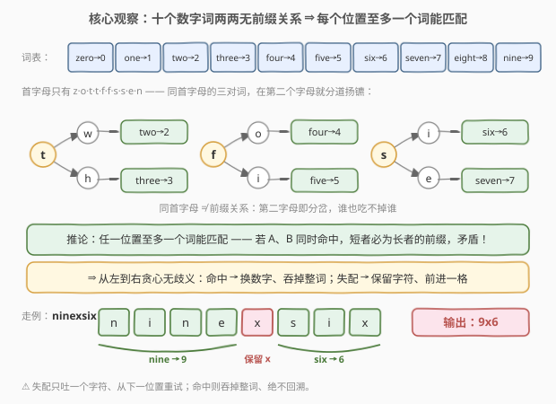
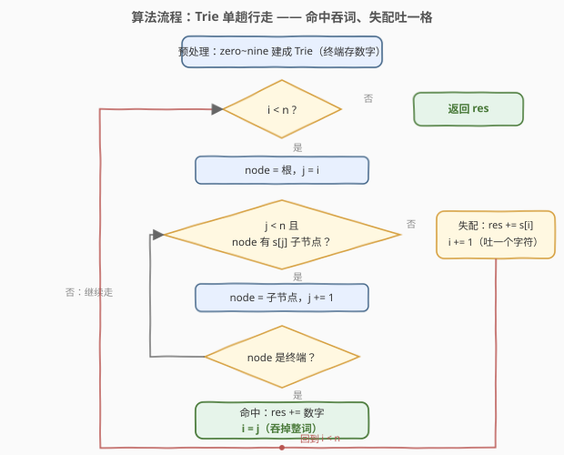
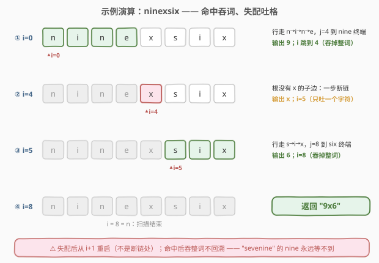

# 将数字词转换为数字

- **题目名称**：将数字词转换为数字
- **链接**：[3758. 将数字词转换为数字](https://leetcode.cn/problems/convert-number-words-to-digits/)
- **难度**：中等
- **标签**：字典树（Trie）、字符串

## 1. 题目概述

> ⚠️ 本题为 LeetCode 付费题（Plus 会员专享），题意描述根据官方示例用例与 hints 重建，可能与官方题面有出入。

**题意**：给定一个由小写英文字母组成的字符串 `s`。`s` 中混着一些英文数字词，请把它们转换成对应的数字字符：

- 数字词共十个：`"zero"`、`"one"`、`"two"`、`"three"`、`"four"`、`"five"`、`"six"`、`"seven"`、`"eight"`、`"nine"`，分别对应 `'0'` ~ `'9'`；
- **从左到右扫描** `s`：在每个位置尝试匹配一个数字词——若匹配成功，输出对应数字并**跳过整个词**继续扫描；若不匹配，当前字符**原样保留**并前进一格；
- 返回转换后的字符串。

**示例 1**：

```text
输入：s = "onefourthree"
输出："143"
解释：one → 1、four → 4、three → 3，三个数字词依次命中。
```

**示例 2**：

```text
输入：s = "ninexsix"
输出："9x6"
解释：nine → 9；x 不是任何数字词的一部分，原样保留；six → 6。
```

**示例 3**：

```text
输入：s = "zeero"
输出："zeero"
解释：zeer ≠ zero——拼写错误的词不替换，整串原样返回。
```

**示例 4**：

```text
输入：s = "tw"
输出："tw"
解释：two 被截断，匹配失败，原样返回。
```

**约束条件**（官方约束未公开，按 hints 与同类题推测）：

- $1 \le s.length \le 10^5$
- $s$ 仅由小写英文字母组成

> 💡 **审题关键**：① **整词匹配**——`"zeero"`、`"tw"` 这类残次词一概不换；② 匹配失败只**吐出一个字符**、从下一位置重试（不是跳到失败处）；③ 匹配成功则**吞掉整个词**，被吞掉的字母不再参与后续匹配（不回溯）。

---

## 2. 解题思路

### 2.1 暴力思路：每个位置把 10 个词挨个试一遍

最直觉的做法：维护位置 $i$，在每个 $i$ 处把 10 个数字词逐一与 $s$ 从 $i$ 开始的前缀比对——命中就输出数字、$i$ 跳过词长；全不命中就保留 $s[i]$、$i$ 前进一格。

```text
i = 0, res = ""
while i < n:
    for w in [zero, one, ..., nine]:
        if s[i : i+len(w)] == w:      # 逐词比对
            res += digit(w); i += len(w); break
    else:
        res += s[i]; i += 1
```

词长至多 5，单个位置至多 $10 \times 5 = 50$ 次字符比较，总代价 $O(50n) \approx 5 \times 10^6$，$n = 10^5$ 时其实能过。真正的问题是**重复劳动**与**不易扩展**：首字母相同的词（`t`、`f`、`s` 各被两词共享）在每个位置都要从第一个字母重新比起，公共前缀被比了一遍又一遍；一旦词表扩到几十上百个（英文数字还有 `twelve`、`twenty`、`hundred`……），这种「每位置 × 每词」的常数随词表线性膨胀。把「10 个词的逐个比对」合并成「一次沿树的行走」，正是 Trie 的用武之地。

### 2.2 核心观察：数字词两两无前缀关系 → 每个位置至多一个词能匹配



**观察一（无前缀关系）**：十个数字词的**首字母**分布为 $z, o, t, t, f, f, s, s, e, n$——只有 `t`、`f`、`s` 各被两个词共享，而这三对（two/three、four/five、six/seven）在**第二个字母**就分道扬镳（$w \leftrightarrow h$、$o \leftrightarrow i$、$i \leftrightarrow e$）。因此**任何两个数字词互不为前缀**。

**推论（匹配唯一性）**：从任意位置 $i$ 出发，**至多只有一个**数字词能匹配——若 $A$、$B$ 都能从 $i$ 匹配且 $|A| \le |B|$，则 $A$ 是 $B$ 的前缀，与无前缀关系矛盾。于是「从左到右能匹配就换、不能匹配就保留」的贪心**没有任何选词歧义**，也不需要回溯：Trie 行走途中撞到的第一个终端节点，就是从该位置出发唯一可能的匹配。

**观察二（Trie 把逐词比对合并成单次行走）**：把十个词建成一棵 Trie（终端节点存对应数字字符），扫描时从根出发沿 $s[i], s[i+1], \ldots$ 行走：

- 走到**终端节点** → 匹配成功：输出数字，$i$ 跳到词尾之后（吞词）；
- 中途**断链**（当前节点没有 $s[j]$ 的子节点）或**串尾先到** → 失配：输出 $s[i]$，$i$ 前进一格，从根重走。

首字母相同的词共享路径前缀，只比一遍；失配时一步断链即知「从 $i$ 出发没戏」，不必把 10 个词都试完。

> ⚠️ **失配后必须从 $i+1$ 重新开始，不能从断链位置继续**。行走从 $i$ 出发断在 $j$，只说明「从 $i$ 开始匹配不了」，并不说明 $i+1 \ldots j-1$ 里没有新词的起点。反例 `"seight"`：从 $i=0$ 沿 `s→e` 断在第三个字符（seven 的第三字母是 v），但 `"eight"` 恰从 $i=1$ 开始——正确结果是 `"s8"`；若从断链处续走就会漏掉它。这与 KMP「失配后模式串右移、文本指针不跳格」是同一个直觉。

### 2.3 算法流程图



整个流程是一个双层循环：外层「位置 $i$ 是否扫完」，内层「沿 Trie 行走」。每个起点至多行走 5 步（词长上限），总代价 $O(5n)$。两条回边对应两种推进方式：**命中吞整词**（$i = j$）与**失配吐一个字符**（$i{+}{=}1$），一快一慢，但 $i$ 永远只前进不后退。

### 2.4 示例演算

以 `s = "ninexsix"` 为例：



| 步 | 起点 $i$ | Trie 行走 | 判定 | 动作 | `res` |
|----|----------|-----------|------|------|-------|
| ① | 0 | `n→i→n→e`，$j=4$ 到达 nine 终端 | 命中 | 输出 `'9'`，$i$ 跳到 4（吞词） | `"9"` |
| ② | 4 | 根没有 `x` 的子边，一步断链 | 失配 | 输出 `'x'`，$i=5$（吐一格） | `"9x"` |
| ③ | 5 | `s→i→x`，$j=8$ 到达 six 终端 | 命中 | 输出 `'6'`，$i=8$（吞词） | `"9x6"` |
| ④ | 8 | $i = n$ | 结束 | 返回 | `"9x6"` |

两个官方失配用例：

| 输入 | 行走过程 | 输出 |
|------|----------|------|
| `"zeero"` | $i{=}0$ 走 `z→e` 断在第二个 `e`（zero 第三字母是 r）→ 吐 `z`；$i{=}1$ 走 `e` 断在 `e`（eight 第二字母是 i）→ 吐 `e`；其后逐位皆失配 | `"zeero"` |
| `"tw"` | $i{=}0$ 走 `t→w`，串尾先到未达终端 → 吐 `t`；$i{=}1$ `w` 无子边 → 吐 `w` | `"tw"` |

> ⚠️ **吞词不回溯**：`"sevenine"` 里 seven 先命中吞掉前 5 个字母，剩下 `"ine"`——藏在交叉处的 nine（位置 4 起）因首字母 `n` 已被吞而无缘匹配，结果是 `"7ine"` 而不是 `"79"`。从左到右的贪心一旦吞词就绝不回头。

---

## 3. 参考代码

### C++

```cpp
class Solution {
  public:
    string convertWordsToDigits(string s) {
        // 建树：zero~nine，终端节点存对应数字字符
        struct Node {
            int child[26] = {};
            char digit = 0; // 0 表示非终端
        };
        vector<Node> trie(1);
        static const string WORDS[10] = {"zero", "one", "two", "three", "four",
                                         "five", "six", "seven", "eight", "nine"};
        for (int d = 0; d < 10; ++d) {
            int cur = 0;
            for (char c : WORDS[d]) {
                int k = c - 'a';
                if (!trie[cur].child[k]) {
                    trie[cur].child[k] = (int)trie.size();
                    trie.emplace_back();
                }
                cur = trie[cur].child[k];
            }
            trie[cur].digit = char('0' + d);
        }

        // 单趟扫描：命中吞词，失配吐一个字符
        string res;
        res.reserve(s.size());
        int n = (int)s.size(), i = 0;
        while (i < n) {
            int cur = 0, j = i, len = 0;
            char digit = 0;
            while (j < n) {
                int k = s[j] - 'a';
                if (k < 0 || k >= 26 || !trie[cur].child[k]) break; // 断链 / 异常字符
                cur = trie[cur].child[k];
                ++j;
                if (trie[cur].digit) { // 首个终端 = 唯一匹配（无前缀关系）
                    digit = trie[cur].digit;
                    len = j - i;
                    break;
                }
            }
            if (len) {
                res += digit;
                i += len;      // 吞掉整个词
            } else {
                res += s[i];   // 失配：只前进一格，从 i+1 重试
                ++i;
            }
        }
        return res;
    }
};
```

> 💡 **写法要点**：
> - **终端即数字**：建树时把 `'0' + d` 直接存在终端节点里，行走命中后零查找。
> - **`k < 0 || k >= 26` 的防御**：即使输入混入非小写字母，也按「无子边」处理走失配分支，天然安全。
> - **`res.reserve`** 预留容量，避免中途扩容搬移；结果长度不超过 $n$。
> - 内层 `while` 撞到终端即 `break`——因无前缀关系，**首个终端就是唯一可能的匹配**，不存在「要不要再走深点找更长的词」的问题。

### Python

```python
class Solution:
    def convertWordsToDigits(self, s: str) -> str:
        words = ["zero", "one", "two", "three", "four",
                 "five", "six", "seven", "eight", "nine"]
        trie = {}                      # 嵌套字典，'#' 键存终端数字
        for d, w in enumerate(words):
            node = trie
            for c in w:
                node = node.setdefault(c, {})
            node['#'] = str(d)

        res = []
        i, n = 0, len(s)
        while i < n:
            node, j, digit, length = trie, i, None, 0
            while j < n:
                nxt = node.get(s[j])
                if nxt is None:        # 断链（含非字母字符）
                    break
                node = nxt
                j += 1
                if '#' in node:        # 首个终端 = 唯一匹配
                    digit, length = node['#'], j - i
                    break
            if digit is not None:
                res.append(digit)
                i += length            # 吞掉整个词
            else:
                res.append(s[i])       # 失配：只前进一格
                i += 1
        return ''.join(res)
```

> 💡 **写法要点**：
> - **嵌套字典当 Trie**：`setdefault` 一行完成「无则建、有则走」，终端用特殊键 `'#'` 存数字——`s` 只含小写字母，与 `'a'..'z'` 键天然不冲突。
> - **`''.join(res)`** 而非循环 `res += c`：避免 CPython 某些场景下拼串退化。
> - 失配分支 `i += 1`、命中分支 `i += length`——两个推进速度就是算法的全部骨架。

---

## 4. 复杂度分析

| 维度 | 复杂度 | 说明 |
|------|--------|------|
| **时间复杂度** | $O(n)$ | 建树为 $O(\sum \text{词长}) = O(40)$，常数；扫描时每个起点至多行走 5 步（词长上限），总体 $O(5n)$ |
| **空间复杂度** | $O(1)$ | Trie 至多约 40 个节点（十词总长 40，共享 3 个首字母节点），与 $n$ 无关；输出缓冲不计入（计入则 $O(n)$） |

> 💡 「每个字符至少要被读一次」决定了 $O(n)$ 是时间下界。暴力逐词比对也是 $O(n)$（常数 50），Trie 的价值不在渐近复杂度，而在**公共前缀只比一遍 + 一步断链即知无解**的干净性，以及词表扩大时退化缓慢（见第 5 节）。

---

## 5. 扩展：免建树的哈希写法与词表变大怎么办

### 5.1 词长分桶 + 哈希表（不建 Trie 的等价 $O(n)$）

十个词的**长度只有 3、4、5 三档**，且互不为前缀 ⇒ 每个位置至多一档命中，查表顺序无关紧要。用 `{词: 数字}` 哈希表，对每个位置截取三种长度直接查：

```python
def convertWordsToDigits(self, s: str) -> str:
    m = {"zero": "0", "one": "1", "two": "2", "three": "3", "four": "4",
         "five": "5", "six": "6", "seven": "7", "eight": "8", "nine": "9"}
    res, i, n = [], 0, len(s)
    while i < n:
        for L in (3, 4, 5):
            d = m.get(s[i:i + L])
            if d:
                res.append(d)
                i += L
                break
        else:                        # 三档都没命中（for-else）
            res.append(s[i])
            i += 1
    return ''.join(res)
```

Python 的切片天然容忍越界（`s[i:i+5]` 不足 5 位时返回短串，不会命中任何词），代码极短。C++ 等价写法用 `unordered_map<string, char>` + `s.substr(i, L)`，但 `substr` 有临时串构造开销，不如 Trie 数组直接。

### 5.2 词表变大：当前缀关系出现、模式串成千上万时

- **出现前缀关系**（如词表换成 0~99 的英文，`six` 是 `sixty` 的前缀）：匹配不再唯一，必须先约定**最长匹配**还是**最短匹配**。Trie 行走要「走到不能再走」再回看途中最后一个终端节点，本题「撞到终端即停」的捷径失效。
- **模式串成千上万、要求所有出现位置**（允许重叠、不允许跳格吞词）：单点重试的 Trie 行走最坏退化为 $O(n \cdot L)$，需要 **Aho–Corasick 自动机**——给 Trie 加 fail 指针，失配沿 fail 链跳转而**文本指针不回退**，整体 $O(n + \text{总匹配数})$。本题的「贪心吞词」语义（命中即吞、失配跳一格重试）比通用多模式匹配宽松得多，朴素 Trie 行走就够——理解本题与 Aho–Corasick 的差距，正是理解「为什么 KMP 要 fail 指针而本题不要」。

---

## 6. 面试要点

1. **为什么从左到右贪心不会漏解、也没有选词歧义？**

   十个数字词两两无前缀关系（同首字母的三对词第二字母即分岔），所以从任一位置出发至多一个词能匹配——若两个词同时命中，短者必为长者的前缀，矛盾。匹配唯一 ⇒ 贪心确定 ⇒ 不需要 DP 或回溯。若词表存在前缀关系，就必须先问清「最长还是最短匹配」。

2. **失配后为什么从 $i+1$ 重启，而不是从断链位置继续？**

   行走从 $i$ 断在 $j$ 只排除「从 $i$ 开始的匹配」，不排除 $i+1 \ldots j-1$ 处有新词起点。反例 `"seight"`：从 $i=0$ 走 `s→e` 断链，但 `eight` 从 $i=1$ 开始，正确答案 `"s8"`。从断链处续走会跳过这些起点——这与 KMP 中「失配后移动模式串而非跳过文本」是同一直觉，也是本题最容易写错的地方。

3. **命中后为什么要跳过整个词？词里嵌着别的词怎么办？**

   题目的贪心语义规定命中即吞、不回溯：`"sevenine"` 里 seven 吞掉前 5 个字母后，交叉处的 nine 因首字母 `n` 已被消耗而无缘匹配，结果 `"7ine"`。若语义改成「找出所有（可重叠的）出现位置」，就变成多模式匹配问题，得请 Aho–Corasick 出场。

4. **Trie 在这里到底比逐词暴力好在哪？诚实地说。**

   渐近复杂度同为 $O(n)$（常数 5 vs 50）。Trie 的实际收益：① 首字母相同的词共享前缀，每个位置只比对一遍；② 一步断链即知「从当前起点无解」，不用把 10 个词都试完；③ 词表扩大时按总词长增长而非「词数 × 词长」膨胀。诚实承认 10 个短词时差异不大，比吹「Trie 快一个量级」更能体现工程判断。

5. **如果把词表换成 0~99 的英文会怎样？**

   出现前缀关系（`six`/`sixty`、`four`/`forty`……）⇒ 匹配歧义出现，必须先定最长/最短匹配策略，Trie 行走要记录「途中最后一个终端」并走到不能走为止；`ninety-nine` 这类复合词还引入分隔符与多词拼接的解析问题——词表一变大，本题就一步步走向词典解析（word break 族）与自动机。

> 💡 **一句话总结**：本题 = 「无前缀关系的词典 ⇒ 匹配唯一 ⇒ 贪心行走」。Trie 建树 $O(1)$、单趟扫描 $O(n)$：命中输出数字并吞词，失配吐一个字符、从下一位置从根重走。两个易错点都在「推进方式」上——失配从 $i+1$ 重启（不是断链处）、命中吞整词不回溯。

---

## 7. 同类练习题

- [208. 实现 Trie (前缀树)](https://leetcode.cn/problems/implement-trie-prefix-tree/)：Trie 数据结构母题，本题建树部分即其 `insert` 操作
- [648. 单词替换](https://leetcode.cn/problems/replace-words/)：同为「Trie + 字符串替换」，用最短词根替换派生词；那里存在前缀关系须沿树找最短终端，与本题「无前缀关系、撞终端即停」互为镜像
- [14. 最长公共前缀](https://leetcode.cn/problems/longest-common-prefix/)：「沿 Trie 行走」的另一种典型场景，体会树上路径与前缀的对应
- [139. 单词拆分](https://leetcode.cn/problems/word-break/)：词典词对整串的**完全覆盖**判定，起点可选 ⇒ 需要 DP；本题匹配唯一、贪心即最优，对照理解「什么时候 DP 不可省」
- [1032. 字符流](https://leetcode.cn/problems/stream-of-characters/)：流式多模式匹配，Trie 倒序建 + 每查询沿树行走，是走向 Aho–Corasick 的中间站
