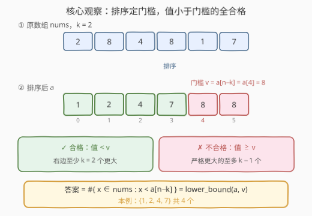
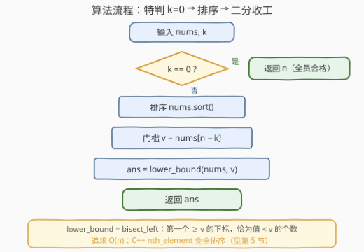

# 统计合格元素的数目

- **题目名称**：统计合格元素的数目
- **链接**：[3759. 统计合格元素的数目](https://leetcode.cn/problems/count-elements-with-at-least-k-greater-values/)
- **难度**：中等
- **标签**：数组、排序、二分查找

## 1. 题目概述

给你一个长度为 $n$ 的整数数组 `nums` 和一个整数 $k$。如果数组中的某个元素满足以下条件，则称其为**合格元素**：存在**至少 $k$ 个元素严格大于它**。返回数组 `nums` 中合格元素的总数。

**示例 1**：

```text
输入：nums = [3,1,2], k = 1
输出：2
解释：元素 1 和 2 均有至少 k = 1 个元素大于它们。
     没有元素比 3 更大。因此答案是 2。
```

**示例 2**：

```text
输入：nums = [5,5,5], k = 2
输出：0
解释：由于所有元素都等于 5，没有任何元素比其他元素大。因此答案是 0。
```

**约束条件**：

- $1 \le n = \text{nums.length} \le 10^5$
- $1 \le \text{nums}[i] \le 10^9$
- $0 \le k < n$

> 💡 **审题关键**：① $n \le 10^5$——对每个元素扫全数组的 $O(n^2)$ 暴力约 $10^{10}$ 次比较，必然超时；②「**严格大于**」意味着重复元素互不算数——示例 2 的三个 5 谁也压不过谁，答案为 0；③ 合格与否只取决于元素的**值**而非位置——同值元素命运必然相同，这提示按「值」而非「下标」思考；④ $k < n$ 保证 $n - k \ge 1$，但 $k = 0$ 仍是有效输入（此时全员合格），公式推导时别让它越界。

---

## 2. 解题思路

### 2.1 暴力思路

最直觉的写法：对每个元素 $x$，扫一遍数组数出严格大于它的元素个数 $\text{cnt}(x)$，满足 $\text{cnt}(x) \ge k$ 则计入答案。

```python
def countElements(nums, k):
    return sum(1 for x in nums
               if sum(1 for y in nums if y > x) >= k)
```

正确性没问题，但复杂度 $O(n^2)$：$n = 10^5$ 时约 $10^{10}$ 次比较。结论：必须让「每个元素的合格判定」**不必逐个数**——找到判定随值变化的整体规律，一刀切出合格段。

### 2.2 核心观察：排序定门槛，值小的一段全合格



**第一步：合格性只依赖值**。设 $\text{cnt}(x)$ 为数组中严格大于 $x$ 的元素个数，合格 $\iff \text{cnt}(x) \ge k$。$\text{cnt}(x)$ 关于 $x$ **单调不增**——值越小，压过它的元素只多不少。于是合格元素必然是**排序后的一段前缀**（值最小的一批），问题从「逐个判定」坍缩成「找切分点」。

**第二步：门槛取 $v = a[n-k]$**（$a$ 为排序后的数组，下标从 0 开始）。断言：**合格 $\iff$ 值严格小于 $a[n-k]$**。

- **值 $x < v$ ⇒ 合格**：排序后位置 $n-k, \dots, n-1$ 这 $k$ 个元素的值都 $\ge v > x$，仅这一段就贡献了 $k$ 个「严格更大」，$\text{cnt}(x) \ge k$ 成立；
- **值 $x \ge v$ ⇒ 不合格**：严格大于 $x$ 的元素，其值必然 $> x \ge v$；而值 $> v$ 的元素只能挤在 $v$ 最后一次出现之后的位置上，又 $v$ 至少出现在位置 $n-k$，故值 $> v$ 的元素至多 $n - 1 - (n-k) = k - 1$ 个，$\text{cnt}(x) \le k - 1 < k$。

> 💡 换个视角：$v = a[n-k]$ 正是数组的**第 $k$ 大的值**。「至少 $k$ 个更大」$\iff$ 「排不进前 $k$ 大」——一个元素的排名够差，它才合格。重复元素（如示例 2 的三个 5）会**并列挤占**前 $k$ 大的名额，这正是「严格大于」语义下门槛必须卡在值上、而不是卡在排名上的原因。

于是答案一步到位：

$$\text{ans} = \#\{\, x \in \text{nums} : x < a[n-k] \,\} = \mathrm{lower\_bound}(a,\ a[n-k])$$

其中 $\mathrm{lower\_bound}$ 返回第一个 $\ge v$ 的位置，恰好就是值 $< v$ 的元素个数。

### 2.3 算法流程图



全流程只有三步：**特判 $k=0$ → 排序 → 二分定位**。$k = 0$ 时「至少 0 个更大」恒真，全员合格，直接返回 $n$——这一步既是语义特判，也避免公式访问 $a[n]$ 越界。

### 2.4 示例演算

**官方示例 1**：`nums = [3,1,2]`，$k = 1$

| 步骤 | 计算 | 结果 |
|------|------|------|
| 排序 | $a = [1,2,3]$，$n = 3$ | — |
| 门槛 | $v = a[n-k] = a[2] = 3$ | — |
| 计数 | 值 $< 3$ 的元素：$1, 2$ | **2** ✓ |

**官方示例 2**：`nums = [5,5,5]`，$k = 2$

| 步骤 | 计算 | 结果 |
|------|------|------|
| 排序 | $a = [5,5,5]$，$n = 3$ | — |
| 门槛 | $v = a[n-k] = a[1] = 5$ | — |
| 计数 | 值 $< 5$ 的元素：无 | **0** ✓（三个 5 并列，谁也压不过谁） |

**再演含重复的 `nums = [2,8,4,8,1,7]`，$k = 2`**（专打「严格」语义）：

| 步骤 | 计算 | 结果 |
|------|------|------|
| 排序 | $a = [1,2,4,7,8,8]$，$n = 6$ | — |
| 门槛 | $v = a[n-k] = a[4] = 8$（第 2 大的值，两个 8 并列占位） | — |
| 计数 | 值 $< 8$ 的元素：$1,2,4,7$ | **4** |

逐个复核：$1$ 有 5 个更大 ✓，$2$ 有 4 个 ✓，$4$ 有 3 个 ✓，$7$ 有 2 个 ✓，两个 $8$ 互不大于、均为 0 个 ✗——答案 4，与公式一致。

---

## 3. 参考代码

### C++

```cpp
class Solution {
public:
    int countElements(vector<int>& nums, int k) {
        int n = nums.size();
        if (k == 0) return n;   // 「至少 0 个更大」恒真，全员合格
        sort(nums.begin(), nums.end());
        // 门槛 v = nums[n-k]：值 < v 的元素全部合格
        return lower_bound(nums.begin(), nums.end(), nums[n - k]) - nums.begin();
    }
};
```

> 💡 **写法要点**：
> - `k == 0` 特判不能省——省掉后 `nums[n - k]` 访问 `nums[n]` 越界；
> - `lower_bound` 返回第一个 $\ge v$ 的迭代器，与起点之差恰为值 $< v$ 的元素个数，一步出答案；
> - 值域达 $10^9$ 不影响任何环节——全程只有比较，无值域运算。

### Python

```python
class Solution:
    def countElements(self, nums: List[int], k: int) -> int:
        if k == 0:
            return len(nums)        # 至少 0 个更大，全员合格
        nums.sort()
        # 门槛 v = nums[-k]：值 < v 的元素全部合格
        return bisect_left(nums, nums[-k])
```

> 💡 **写法要点**：
> - `nums[-k]` 即排序后位置 $n-k$ 的元素，负下标写法免去算 $n$；
> - `bisect_left` 等价 C++ 的 `lower_bound`（第一个 $\ge v$ 的插入点）；若想按定义直写，`bisect_right(nums, x)` 算「严格大于 $x$ 的个数 $= n - \text{idx}$」再判 $\ge k$ 也对，但每个元素二分一次是 $O(n \log n)$ 的循环，不如门槛公式一次二分。

---

## 4. 复杂度分析

| 维度 | 复杂度 | 说明 |
|------|--------|------|
| **时间** | $O(n \log n)$ | 排序主导；`lower_bound` 仅 $O(\log n)$，可忽略 |
| **空间** | $O(1)$ | C++ 原地排序（忽略递归栈）；Python 的 Timsort 需 $O(n)$ 辅助 |
| **对比** | 暴力 $O(n^2)$ | $n = 10^5$ 时约 $10^{10}$ 次比较，相差约 4 个数量级 |

---

## 5. 扩展：Quickselect 免全排序，平均 O(n)

排序的收益只是拿到门槛值 $v = a[n-k]$（第 $k$ 大），并不需要完整的有序数组。两步把它降为**平均线性**：

1. **快选（Quickselect）定位第 $k$ 大**：C++ 一行 `nth_element(nums.begin(), nums.end() - k, nums.end())` 平均 $O(n)$ 即把第 $k$ 大放到位置 $n-k$；
2. **线性扫描计数**：`count_if` 数出值 $< v$ 的元素个数，$O(n)$。

```cpp
class Solution {
public:
    int countElements(vector<int>& nums, int k) {
        int n = nums.size();
        if (k == 0) return n;
        nth_element(nums.begin(), nums.end() - k, nums.end());
        int v = nums[n - k];
        return count_if(nums.begin(), nums.end(),
                        [&](int x) { return x < v; });
    }
};
```

> ⚠️ 注意快选**最坏 $O(n^2)$**（划分始终极度失衡），随机化 pivot 可使期望稳定在 $O(n)$，BFPRT（中位数锚点）可保证最坏 $O(n)$ 但常数大。另：本题值域 $10^9$，计数排序不适用；若值域收敛到 $O(n)$ 级别，桶计数一趟即可，连比较都省了。

---

## 6. 面试要点

**Q1：门槛为什么恰好是 $a[n-k]$，而不是 $a[n-k-1]$ 或别的位置？**

> 两端各一句：值 $< a[n-k]$ 时，排序后位置 $n-k \dots n-1$ 这 $k$ 个元素都严格更大，合格铁证；值 $\ge a[n-k]$ 时，严格更大的元素值必须 $> a[n-k]$，而它们只能排在 $a[n-k]$ 最后一次出现之后，总共至多 $k-1$ 个，不合格铁证。两头一夹，门槛唯一。

**Q2：重复元素为什么天然不出错？**

> 判定只依赖值：同值元素 $\text{cnt}(x)$ 相同，命运必然一致。重复的真正作用是**并列挤占前 $k$ 大的名额**——示例 2 的三个 5 让「值 $> 5$ 的个数」为 0，按 $k-1 = 1$ 的上界直接判死。这也是「严格大于」必须用值门槛而非排名门槛的原因。

**Q3：$k = 0$ 为什么必须特判？**

> 语义上「至少 0 个元素严格大于它」恒真，答案为 $n$；形式上 $n - k = n$，公式会访问 $a[n]$ 越界。条件 $k < n$ 保证了 $k \ge 1$ 时 $n-k \ge 1$ 门槛位置有效，唯独 $k=0$ 需要单独兜底。

**Q4：`lower_bound` 和 `upper_bound` 在本题分别扮演什么角色？**

> 按定义直写时，「严格大于 $x$ 的个数」$= n - \text{upper\_bound}(x)$（`upper_bound` 返回第一个 $> x$ 的位置）；最终的一步公式里，「值 $< v$ 的个数」$= \text{lower\_bound}(v)$（返回第一个 $\ge v$ 的位置）。两者只差一个「等号」——恰好对应「严格大于」与「严格小于」这对镜像语义，面试中能主动讲清这层区分是加分项。

**Q5：能不排序做到 $O(n)$ 吗？**

> 能，平均意义下：快选 `nth_element` 平均 $O(n)$ 拿到第 $k$ 大作门槛，再线性数小于它的个数（见第 5 节）。最坏保证可用 BFPRT。若值域小到 $O(n)$ 级别，计数排序/桶一趟 $O(n + V)$ 更直接——本题值域 $10^9$ 故不适用。

> 💡 **一句话总结**：排序后门槛 $v = a[n-k]$（第 $k$ 大的值），**合格 $\iff$ 值 $< v$**，答案 = `lower_bound(a, v)`——单调性把逐元素判定坍缩成一次二分，$O(n \log n)$ 收工（快选可降至平均 $O(n)$）。

---

## 7. 同类练习题

- [215. 数组中的第K个最大元素](https://leetcode.cn/problems/kth-largest-element-in-an-array/)（[题解](../0201-0300/215_数组中的第K个最大元素.md)）：快选/堆找第 $k$ 大——本题门槛值的来源，也是第 5 节 $O(n)$ 化的核心部件
- [744. 寻找比目标字母大的最小字母](https://leetcode.cn/problems/find-smallest-letter-greater-than-target/)（[题解](../0701-0800/744_寻找比目标字母大的最小字母.md)）：`upper_bound`「严格大于」语义的最小练手，和本题的严格性口径同源
- [1385. 两个数组间的距离值](https://leetcode.cn/problems/find-the-distance-value-between-two-arrays/)（[题解](../1301-1400/1385_两个数组间的距离值.md)）：对每个元素去另一有序数组二分数满足条件的个数，同为「排序 + 二分计数」套路
- [347. 前K个高频元素](https://leetcode.cn/problems/top-k-frequent-elements/)（[题解](../0301-0400/347_前K个高频元素.md)）：top-k 族经典，桶排/快选两种 $O(n)$ 视角，本题第 5 节的近亲
- [973. 最接近原点的K个点](https://leetcode.cn/problems/k-closest-points-to-origin/)（[题解](../0901-1000/973_最接近原点的K个点.md)）：top-k 族在二维键上的推广，快选与堆的取舍范本
