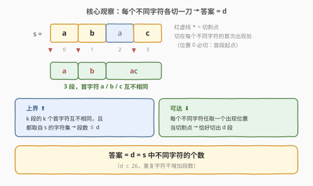
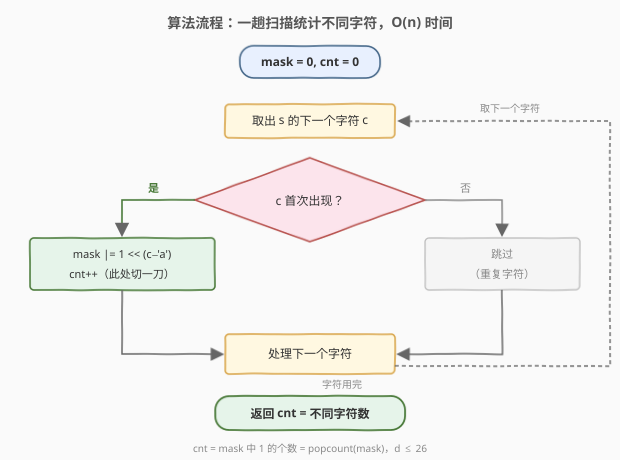

# LeetCode 不同首字母的子字符串数目 题解

## 1. 题目概述

- **标题 / 题号**：不同首字母的子字符串数目（#3760，medium）
- **链接**：https://leetcode.cn/problems/maximum-substrings-with-distinct-start/
- **难度**：中等
- **标签**：哈希表、字符串

**题意**：给定一个仅由小写英文字母组成的字符串 `s`。将其划分为若干**子字符串**（字符串中连续、非空的字符段），要求**任意两个子字符串的首字符互不相同**。返回划分能得到的**最大子字符串数量**。

**示例 1**：

```text
输入：s = "abab"
输出：2
解释：划分为 "a" 和 "bab"，首字符分别为 'a' 和 'b'，互不相同。
```

**示例 2**：

```text
输入：s = "abcd"
输出：4
解释：划分为 "a"、"b"、"c"、"d"，首字符互不相同。
```

**示例 3**：

```text
输入：s = "aaaa"
输出：1
解释：所有字符都是 'a'，只有一个子字符串能以 'a' 开头。
```

**约束**：

- `1 <= s.length <= 10^5`
- `s` 仅由小写英文字母组成

> 💡 表面上是「划分方案优化」问题，实际答案只与 `s` 的**字符集合**有关（见 2.2）。

## 2. 解题思路

### 2.1 暴力思路：枚举切割位置

长为 $n$ 的字符串有 $n-1$ 个「空隙」，每个空隙切或不切，共 $2^{n-1}$ 种划分；对每种划分检查各段首字符是否互不相同，取合法方案的最大段数。$n = 10^5$ 时是天文数字。

退一步想 **DP**：设 `dp[i][S]` 表示前 `i` 个字符、已用作首字符的集合为 `S` 时的最大段数，转移时枚举上一刀位置——状态数 $O(n \cdot 2^{26})$，同样不可行。但这个尝试透露了关键信息：状态里真正起作用的只有**首字符集合**，而集合大小至多 26。

### 2.2 核心观察：答案 = 不同字符的个数



记 $d$ 为 `s` 中**不同字符的个数**。从两个方向夹逼：

**上界（段数 $\le d$）**：每段的首字符都真实出现在 `s` 中，且任意两段首字符互不相同——由抽屉原理，段数不可能超过 `s` 的不同字符数 $d$（显然 $d \le 26$）。

**下界（可以做到 $d$ 段）**：一个划分由切割点集合 $0 = p_0 < p_1 < \dots < p_{k-1}$ 唯一确定，第 $j$ 段的首字符就是 $s[p_j]$。于是：

- 位置 $0$ 必是切割点（第一段从 $0$ 开始），首字符 $s[0]$ 天然占掉一个名额；
- 对其余每个不同字符 $c \ne s[0]$，**任取**它在 `s` 中的一个出现位置作为切割点。

不同字符的出现位置集合**两两不相交**（一个下标只对应一个字符），因此这些切割点天然互不相同、也都不是 $0$；把它们与 $0$ 一起排序后依次切割，就得到恰好 $d$ 段、首字符两两不同的合法划分。

> 💡 直观理解：这道题的约束**松得惊人**——切割点唯一的实质要求是「各段首字符不同」，而「每个不同字符各占一个位置」自动满足这一点，位置怎么选都不冲突。瓶颈不在位置安排，而在字符种类数本身。

**结论**：答案 $= d = \mathrm{len}(\mathrm{set}(s))$。

### 2.3 算法流程图



实现只需一趟扫描：用 26 位整数位掩码 `mask` 记录出现过的字符，遇到新字符就置位并计数；扫描结束时，计数就是不同字符个数 $d$。

### 2.4 示例演算

以 `s = "abab"` 为例（$d = 2$）：

| `i` | `s[i]` | 首次出现？ | 动作 | `mask` | `cnt` |
|-----|--------|-----------|------|--------|-------|
| 0 | `a` | 是 | 置位 `a`，切第 1 刀 | `…0001` | 1 |
| 1 | `b` | 是 | 置位 `b`，切第 2 刀 | `…0011` | 2 |
| 2 | `a` | 否 | 跳过 | `…0011` | 2 |
| 3 | `b` | 否 | 跳过 | `…0011` | 2 |

返回 `cnt = 2`。对应构造：切割点 $\{0, 1\}$（`a`、`b` 的首次出现处）→ `"a" | "bab"`，与示例 1 一致。同理 `"abcd"` 的切割点为 $\{0,1,2,3\}$ → 4 段；`"aaaa"` 只有 $\{0\}$ → 1 段。

## 3. 参考代码

### C++

```cpp
class Solution {
  public:
    int maxDistinct(string s) {
        int mask = 0;
        for (char c : s) mask |= 1 << (c - 'a');
        return __builtin_popcount(mask);
    }
};
```

### Python

```python
class Solution:
    def maxDistinct(self, s: str) -> int:
        return len(set(s))
```

> 💡 代码短到「一行」正说明考点在**证明**而非实现——把 2.2 的双向论证讲清楚才是得分点。

## 4. 复杂度分析

| 维度 | 复杂度 | 说明 |
|------|--------|------|
| 时间复杂度 | $O(n)$ | 单趟扫描，每个字符一次置位/查位判断 |
| 空间复杂度 | $O(1)$ | 26 位整数位掩码（Python 的 `set` 至多存 26 个元素，同为常数） |

## 5. 扩展：贪心视角、构造方案与「约束一旦变紧」

**贪心视角**：从左到右扫描，遇到「还没当过首字符的字符」就切一刀。某字符首次出现时必然未用过，因此切点恰好落在**每个字符的首次出现处**，共切 $d$ 刀——与 2.2 的构造完全一致。这也是 2.3 流程图的另一种读法：置位 `mask` 的时刻就是下刀的时刻。

**构造一个具体方案**（题目只问数量，但面试官可能追问方案本身）：

```python
def construct(s: str) -> list[str]:
    starts = sorted({s.index(c) for c in set(s)})  # 各字符首次出现位置，天然含 0
    starts.append(len(s))
    return [s[a:b] for a, b in zip(starts, starts[1:])]
```

**「约束一旦变紧」**：本题结论依赖「切割点几乎不受限」。一旦附加额外约束，答案就不再等于 $d$，需要回到真正的 DP。例如要求**每段长度 $\ge 2$**：取 `s = "aab"`，$d = 2$，但合法划分只有整段 `["aab"]`（`["a","ab"]` 与 `["aa","b"]` 都含长度 1 的段），答案退化为 1。识别「什么时候能一步到位、什么时候必须 DP」，正是这类划分题的分水岭。

## 6. 面试要点

1. **为什么答案恰好等于不同字符数 $d$？**

   双向夹逼：上界由抽屉原理——$k$ 段的 $k$ 个首字符互不相同且都取自 `s` 的字符集，故 $k \le d$；下界由构造——每个不同字符任取一个出现位置当切割点，位置天然互异，恰好切出 $d$ 段。两界重合。

2. **构造中「任取一个出现位置」为什么不会撞位置？**

   每个下标只对应一个字符，因此不同字符的出现位置集合两两不相交；$d-1$ 个额外切割点互不相同，也都不是位置 $0$（那里站着 $s[0]$ 自己）。

3. **第一段必须从下标 0 开始吗？`s[0]` 会不会与别的段冲突？**

   必须从 0 开始（划分要覆盖整个字符串）。`s[0]` 占用自身字符后，其余字符的出现位置都 $\ge 1$ 且首字符 $\ne s[0]$，不会冲突。

4. **直接写 `len(set(s))` 会不会显得「没有过程」？怎么向面试官论证？**

   把「上界 + 构造」完整讲出来即可；也可补充贪心读法——从左往右遇到没当过首字符的字符就切一刀，切点恰为各字符首次出现处。本题考察的正是把「划分优化」化归为「字符集合计数」的洞察。

5. **若字符集不止 26 个小写字母（含大写、数字甚至 Unicode）呢？**

   结论不变——答案仍是不同字符个数；实现上把位掩码换成哈希集合，空间从 $O(1)$ 变为 $O(\min(n, |\Sigma|))$。

> 💡 **一句话总结**：段与段只比「首字符」，而每个不同字符都能免费占一个切割位置——所以最大段数就是 `s` 的不同字符个数，一趟扫描 $O(n)$ 收工。

## 同类练习题

| # | 题目 | 与本题的关联 |
|---|------|-------------|
| 2405 | [子字符串的最优划分](https://leetcode.cn/problems/optimal-partition-of-string/) | 对偶条件——要求每段**内部**字符互不重复，贪心遇重复即切；与本题「段与段之间首字符互异」互为镜像 |
| 2716 | [最小化字符串长度](https://leetcode.cn/problems/minimize-string-length/) | 答案同样只由「不同字符集合」决定，删除重复字符不影响剩余字符种类 |
| 1525 | [字符串的好分割数目](https://leetcode.cn/problems/number-of-good-ways-to-split-a-string/) | 统计前缀/后缀各自的不同字符数以判定分割合法性，是「字符集合计数」的中等变形 |
| 3 | [无重复字符的最长子串](https://leetcode.cn/problems/longest-substring-without-repeating-characters/) | 用哈希集合维护「字符是否出现过」的母题，本题的一趟扫描即其最简形态 |
