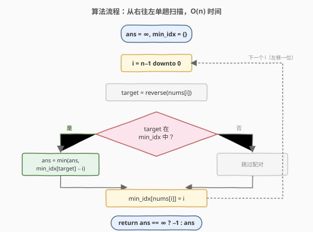
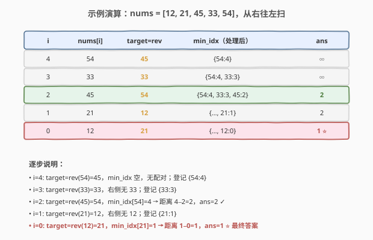

# LeetCode 镜像对之间最小绝对距离 题解

## 1. 题目概述

- **标题 / 题号**：镜像对之间最小绝对距离（#3761，medium）
- **链接**：https://leetcode.cn/problems/minimum-absolute-distance-between-mirror-pairs/
- **难度**：中等
- **标签**：数组、哈希表、数学

**题意**：给定一个整数数组 `nums`。**镜像对**是指一对下标 `(i, j)` 满足：

- `0 <= i < j < nums.length`；
- `reverse(nums[i]) == nums[j]`，其中 `reverse(x)` 表示把整数 `x` 的十进制数字反转后得到的整数，反转后**忽略前导零**（例如 `reverse(120) = 21`）。

返回任意镜像对下标之间的**最小绝对距离** `abs(i - j)`。若不存在镜像对，返回 `-1`。

**示例 1**：

```text
输入：nums = [12,21,45,33,54]
输出：1
解释：镜像对为：
  (0, 1)：reverse(12) = 21 = nums[1]，距离 abs(0-1) = 1
  (2, 4)：reverse(45) = 54 = nums[4]，距离 abs(2-4) = 2
最小绝对距离为 1。
```

**示例 2**：

```text
输入：nums = [120,21]
输出：1
解释：reverse(120) = 21 = nums[1]，距离 1。
```

**示例 3**：

```text
输入：nums = [21,120]
输出：-1
解释：reverse(21) = 12 ≠ 120，不存在镜像对。
```

**约束**：

- `1 <= nums.length <= 10^5`
- `1 <= nums[i] <= 10^9`

> 💡 注意镜像对的判定是**有方向**的：只要求 `reverse(nums[i]) == nums[j]`（`i < j`），并不要求反向也成立。这正是示例 2（`[120,21]` 命中）与示例 3（`[21,120]` 不命中）的区别——`reverse(120)=21` 但 `reverse(21)=12`，所以 `(120, 21)` 是镜像对而 `(21, 120)` 不是。

## 2. 解题思路

### 2.1 暴力思路：枚举所有下标对

最直觉的做法是两层循环枚举所有 `i < j`，对每对计算 `reverse(nums[i])` 并与 `nums[j]` 比较，命中则用 `j - i` 更新答案。

```text
ans = ∞
for i in 0..n-1:
    for j in i+1..n-1:
        if reverse(nums[i]) == nums[j]:
            ans = min(ans, j - i)
return ans == ∞ ? -1 : ans
```

时间复杂度 $O(n^2)$，对 $n = 10^5$ 规模约 $10^{10}$ 次操作，必然超时。问题出在：对每个 `i`，找「右侧第一个等于 `reverse(nums[i])` 的位置」用了 $O(n)$ 线性扫描——而 `reverse(nums[i])` 这个目标值是**确定的**，完全可以用哈希表 $O(1)$ 查到。

### 2.2 核心观察：对每个 i 找「最近的右邻」，从右往左扫一次

![核心直觉：reverse(nums[i])==nums[j]，找最近右邻](../images/mirror_pairs_concept.svg)

关键转化有两步：

1. **目标值确定**：对每个位置 `i`，需要的配对值 `target = reverse(nums[i])` 是固定的。要最小化 `j - i`（`j > i`），就应该找 `i` **右侧第一个**满足 `nums[j] == target` 的下标 `j`——最近的右邻必给该 `i` 的最小距离。
2. **从右往左扫，维护「右侧最近下标」**：用哈希表 `min_idx[v]` 记录值 `v` 在当前已扫过（即位于 `i` 右侧）的部分中出现的**最小下标**。从右端 `n-1` 扫到 `0`：处理 `i` 时表里存的是 `i+1..n-1` 的信息，`min_idx[target]` 正是 `i` 右侧第一个等于 `target` 的下标；处理完 `i` 后把 `min_idx[nums[i]] = i` 写入（`i` 比表中已有的更小，成为新的「右侧最近」供更左的位置查询）。

> 💡 这和 [1. 两数之和](../0001-0100/1_两数之和.md)「一次遍历边查边插」的哈希套路同源——只不过两数之和是从左往右查「补数是否见过」，这里是从右往左查「目标值最近的右侧位置」，方向不同但都是把「线性查找」优化成「哈希 $O(1)$ 查找」。**为何要从右往左？** 因为我们需要的是 `j > i` 的信息；从右往左扫能保证处理 `i` 时表里恰好是「严格在 `i` 右侧」的下标，无需任何过滤。

### 2.3 算法流程图



整个流程是单趟循环：算 `target` → 查 `min_idx` → 命中则用 `min_idx[target] - i` 更新答案 → 把 `nums[i]` 写入 `min_idx`。每个元素只被查一次、写一次，总时间 $O(n)$。

### 2.4 示例演算

以 `nums = [12, 21, 45, 33, 54]` 为例，从右往左扫：



| `i` | `nums[i]` | `target=rev` | `min_idx`（处理后） | 命中？ | `ans` |
|-----|-----------|--------------|---------------------|--------|-------|
| 4 | 54 | 45 | `{54:4}` | 否（45 不在） | `∞` |
| 3 | 33 | 33 | `{54:4, 33:3}` | 否（33 不在） | `∞` |
| 2 | 45 | 54 | `{54:4, 33:3, 45:2}` | 是，`min_idx[54]=4` → `4−2=2` | `2` |
| 1 | 21 | 12 | `{…, 21:1}` | 否（12 不在） | `2` |
| 0 | 12 | 21 | `{…, 12:0}` | 是，`min_idx[21]=1` → `1−0=1` ⭐ | `1` |

最终 `ans = 1`，与示例一致。注意 `reverse` 的前导零处理：`reverse(120)` 在逐位取余反转时天然丢掉前导零（`120 → 0,2,1` 拼回 `21`）。

> ⚠️ **方向性陷阱**：`reverse(nums[i]) == nums[j]` 是单向的。若误把条件写成「`reverse(nums[i]) == nums[j]` **或** `reverse(nums[j]) == nums[i]`」，示例 3 `[21,120]` 会被错误判为命中（`reverse(120)=21=nums[0]`，但此时 `i=0` 在左、`120` 在右，要求的是 `reverse(nums[0])=reverse(21)=12 == nums[1]=120`，并不成立）。务必严格按 `i < j` 且 `reverse(nums[i]) == nums[j]`。

## 3. 参考代码

### C++

```cpp
class Solution {
  public:
    int minMirrorPairDistance(vector<int>& nums) {
        auto rev = [](int x) {
            int r = 0;
            while (x) {
                r = r * 10 + x % 10;
                x /= 10;
            }
            return r;
        };
        int ans = INT_MAX;
        unordered_map<int, int> minIdx; // 值 -> 右侧出现的最小下标
        for (int i = (int)nums.size() - 1; i >= 0; --i) {
            int target = rev(nums[i]);
            auto it = minIdx.find(target);
            if (it != minIdx.end()) {
                ans = min(ans, it->second - i);
            }
            minIdx[nums[i]] = i; // i 比已存的更小，成为新的「右侧最近」
        }
        return ans == INT_MAX ? -1 : ans;
    }
};
```

### Python

```python
class Solution:
    def minMirrorPairDistance(self, nums: List[int]) -> int:
        def rev(x: int) -> int:
            r = 0
            while x:
                r = r * 10 + x % 10
                x //= 10
            return r

        ans = float("inf")
        min_idx = {}  # 值 -> 右侧出现的最小下标
        for i in range(len(nums) - 1, -1, -1):
            target = rev(nums[i])
            if target in min_idx:
                ans = min(ans, min_idx[target] - i)
            min_idx[nums[i]] = i  # i 比已存的更小，成为新的「右侧最近」
        return -1 if ans == float("inf") else ans
```

> 💡 **写表的时机**：先查 `target` 再写 `min_idx[nums[i]] = i`。若先写后查，当 `nums[i]` 本身等于 `reverse(nums[i])`（自镜像数，如 `33`、`121`）时会查到自己刚写入的 `i`，把距离算成 `i - i = 0`，错误地把「同一个元素配自己」当成镜像对。先查后写保证查的时候表里只有严格在 `i` 右侧的下标。这与 [1. 两数之和](../0001-0100/1_两数之和.md) 的「先查后存」防自配是同一个坑。

## 4. 复杂度分析

| 维度 | 复杂度 | 说明 |
|------|--------|------|
| 时间复杂度 | $O(n)$ | 单趟从右往左扫描，每个元素一次 `reverse`（$O(\log v)$，$v \le 10^9$ 即最多 10 位，可视常数）+ 一次哈希查 + 一次哈希写，均 $O(1)$ |
| 空间复杂度 | $O(n)$ | 最坏情况所有元素值各不相同，`min_idx` 存 $n$ 个条目 |

> ⚠️ `reverse` 的位数与 $v$ 的十进制位数成正比，$v \le 10^9$ 至多 10 位，故 `reverse` 单次代价为常数 $O(\lg v) \le 10$，不影响整体 $O(n)$。若 `nums[i]` 值域更大（如高精度数），需把位数计入复杂度。

## 5. 扩展：分组 + 二分（另一种 $O(n \log n)$ 写法）

若一时想不到「从右往左维护最近下标」，也可以按**值分组**再用二分查找：先把每个值出现的所有下标按升序收集到哈希表（自然有序，因为扫描时下标递增），然后对每个 `i`，在 `target = reverse(nums[i])` 对应的下标列表里**二分找第一个大于 `i` 的下标**，即 `upper_bound(i)`。

```cpp
int minMirrorPairDistance(vector<int>& nums) {
    auto rev = [](int x) {
        int r = 0;
        while (x) { r = r * 10 + x % 10; x /= 10; }
        return r;
    };
    unordered_map<int, vector<int>> pos; // 值 -> 升序下标列表
    for (int i = 0; i < (int)nums.size(); ++i) pos[nums[i]].push_back(i);
    int ans = INT_MAX;
    for (int i = 0; i < (int)nums.size(); ++i) {
        auto it = pos.find(rev(nums[i]));
        if (it == pos.end()) continue;
        auto &v = it->second;
        auto ub = upper_bound(v.begin(), v.end(), i); // 第一个 > i 的下标
        if (ub != v.end()) ans = min(ans, *ub - i);
    }
    return ans == INT_MAX ? -1 : ans;
}
```

**两种解法对比**：

| 解法 | 时间 | 空间 | 思路 |
|------|------|------|------|
| 从右往左扫 + 哈希 | $O(n)$ | $O(n)$ | 维护「右侧最近下标」，查 $O(1)$ |
| 分组 + 二分 | $O(n \log n)$ | $O(n)$ | 按值收集下标列表，`upper_bound` 找右邻 |

> 💡 两种写法本质都在回答同一个问题——「`i` 右侧第一个等于 `target` 的下标在哪」。从右往左扫把「右侧信息」在扫描过程中**增量维护**成 $O(1)$ 可查；分组 + 二分则是**预处理后批量查询**。前者更优，后者思路更直白、也更容易在赛场上先想到再优化。

## 6. 面试要点

1. **为什么从右往左扫，而不是从左往右？**

   - 题目要 `j > i` 且 `reverse(nums[i]) == nums[j]`，对每个 `i` 需要「右侧」最近下标。从右往左扫，处理 `i` 时哈希表里恰好是 `i+1..n-1` 的信息，`min_idx[target]` 直接就是右侧第一个等于 `target` 的下标，无需额外过滤。从左往右扫则表里是「左侧」信息，与所需方向相反，需改用分组 + 二分或预计算 `next` 数组。

2. **`reverse` 如何处理前导零？为什么不会出错？**

   - 逐位取余反转：`r = r*10 + x%10; x /= 10`。以 `120` 为例：第一步 `r = 0*10 + 0 = 0`（个位 0 被吸收到低位），第二步 `r = 0*10 + 2 = 2`，第三步 `r = 2*10 + 1 = 21`。前导零在拼接过程中自然丢失，无需特判。`reverse(100) = 1`、`reverse(10) = 1` 同理。

3. **「先查后写」的顺序重要吗？什么情况会踩坑？**

   - 重要。若先写 `min_idx[nums[i]] = i` 再查 `target`，当 `nums[i]` 是**自镜像数**（`reverse(nums[i]) == nums[i]`，如 `33`、`121`、`1`）时，会查到自己刚写入的 `i`，把距离算成 `i - i = 0`，误判「元素和自己配对」。先查后写保证查的时候表里只有严格在 `i` 右侧的下标，规避自配——与两数之和防 `[i, i]` 是同一个坑。

4. **镜像对为何是有方向的？`[120,21]` 命中而 `[21,120]` 不命中的原因？**

   - 条件是 `reverse(nums[i]) == nums[j]`（`i < j`），只考察左元素反转后等于右元素，不要求对称。`[120,21]`：`i=0, j=1`，`reverse(120)=21=nums[1]` ✓。`[21,120]`：`i=0, j=1`，`reverse(21)=12≠nums[1]=120` ✗，且没有其他 `i<j` 对，故返回 `-1`。若把条件误写成双向（任一方向反转相等即可），就会在 `[21,120]` 上错判命中。

5. **值域 $10^9$ 下，哈希表键和 `reverse` 结果会溢出吗？**

   - 不会。`nums[i] <= 10^9`（至多 10 位十进制），`reverse` 仍是同位数以内的整数，最大约 $10^9$ 量级，C++ `int`（上限约 $2.1 \times 10^9$）能容纳；Python 整数无限精度更无虞。若值域升到 $10^{18}$，C++ 需改用 `long long`，复杂度中 `reverse` 的位数代价也要相应计入。

> 💡 **一句话总结**：本题 = 「对每个位置找右侧第一个等于某定值的下标」。从右往左单趟扫描，用哈希表把「右侧最近下标」增量维护成 $O(1)$ 可查，先查后写防自配，$O(n)$ 时间解决。与 [1. 两数之和](../0001-0100/1_两数之和.md) 同属「边查边插」哈希家族，只是扫描方向与「查的目标」从「补数」换成了「反转值」。

## 同类练习题

| # | 题目 | 与本题的关联 |
|---|------|-------------|
| 1 | [两数之和](https://leetcode.cn/problems/two-sum/)（[题解](../0001-0100/1_两数之和.md)） | 同为「一次遍历边查边插」的哈希套路，从左往右查补数；本题从右往左查反转值，方向不同但范式一致 |
| 219 | [存在重复元素 II](https://leetcode.cn/problems/contains-duplicate-ii/) | 维护「每个值最近出现的下标」，查 `abs(i - j) <= k`，与本题维护 `min_idx` 的手法完全相同，只是判定从「最小距离」换成「距离上界」 |
| 242 | [有效的字母异位词](https://leetcode.cn/problems/valid-anagram/) | 本题标签中的「哈希表 + 计数」基础题，对照理解「值 → 计数/下标」哈希表的两种典型用法 |
| 7 | [整数反转](https://leetcode.cn/problems/reverse-integer/) | `reverse(x)` 的纯数学实现母题，本题的 `rev` 函数即其简化版（无需处理负数与溢出） |
