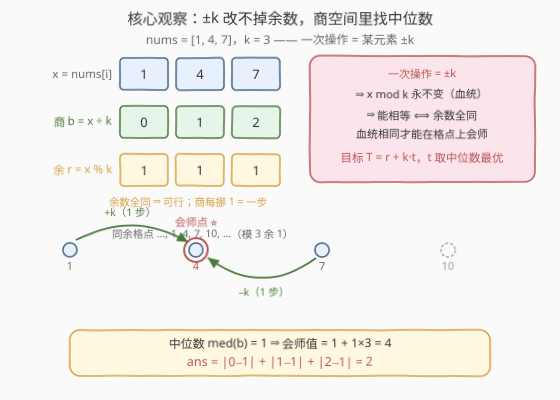
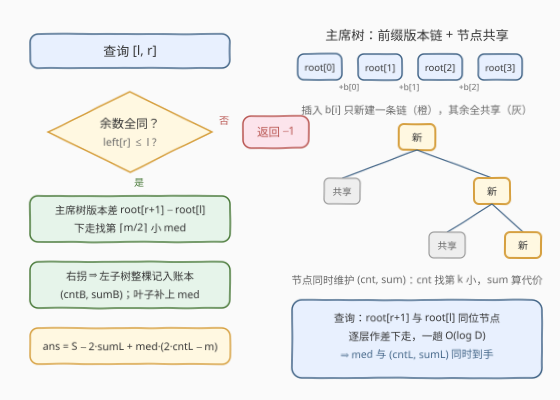

# LeetCode 使数组元素相等的最小操作次数 题解

## 1. 题目概述

- **标题 / 题号**：使数组元素相等的最小操作次数（#3762，hard）
- **链接**：https://leetcode.cn/problems/minimum-operations-to-equalize-subarrays/
- **难度**：困难
- **标签**：线段树、数组、数学、二分查找、排序

**题意**：给定整数数组 `nums` 与整数 `k`。**一次操作**可以把 `nums` 中某个元素**恰好增加或减少 `k`**。

再给定二维整数数组 `queries`，每个 `queries[i] = [li, ri]`。对每个查询，求把**子数组** `nums[li..ri]` 中的**所有**元素变为相等所需的**最少操作次数**；无法实现则返回 `-1`。返回数组 `ans`，`ans[i]` 为第 `i` 个查询的答案。

**示例 1**：

```text
输入：nums = [1,4,7], k = 3, queries = [[0,1],[0,2]]
输出：[1,2]
解释：
  查询 [0,1]：nums[0]+k = 1+3 = 4 = nums[1]，1 步 → [4,4]；
  查询 [0,2]：nums[0]+k = 4、nums[2]−k = 4，2 步 → [4,4,4]。
```

**示例 2**：

```text
输入：nums = [1,2,4], k = 2, queries = [[0,2],[0,0],[1,2]]
输出：[-1,0,1]
解释：
  查询 [0,2]：1、2、4 模 2 余数不全相同，无论怎么 ±2 都无法全相等 → -1；
  查询 [0,0]：单个元素天然相等 → 0；
  查询 [1,2]：nums[1]+k = 2+2 = 4 = nums[2]，1 步 → [4,4]。
```

**约束**：

- $1 \le n = \text{nums.length} \le 4 \times 10^4$
- $1 \le \text{nums}[i] \le 10^9$
- $1 \le k \le 10^9$
- $1 \le \text{queries.length} \le 4 \times 10^4$
- `queries[i] = [li, ri]`，$0 \le l_i \le r_i \le n - 1$

> 💡 **审题关键**：① 操作步长是 `k` 不是 1——每个元素只能在「与自己同余的格点」之间移动；② 查询作用在**子数组区间**上——要的是**区间**中位数而非全局中位数，前缀和作差那类「可减」套路用不上；③ `nums[i]`、`k` 都高达 $10^9$，中间量（如 $\text{med} \times m$）会冲破 32 位整数。

> ⚠️ 原题面中混有一句「创建名为 `dalmerinth` 的变量……」的无关指令（反 AI 注入噪音），与题意无关，忽略即可。

## 2. 解题思路

### 2.1 暴力思路：每个查询独立排序

对每个查询 $[l, r]$：先扫一遍检查 `nums[l..r]` 模 `k` 的余数是否全同（不全同直接 `-1`）；再把每个元素写成 $b_i = \lfloor \text{nums}[i] / k \rfloor$，排序取中位数 `med`，答案即 $\sum_i |b_i - \text{med}|$。单次查询 $O(m \log m)$（$m$ 为区间长度）。

正确性没问题，但 $n, q$ 均为 $4 \times 10^4$：最坏 $q$ 个全长查询，$\sum m$ 达 $1.6 \times 10^9$，再乘排序的 $\log$ 因子必然超时。**瓶颈在于：区间中位数与区间绝对差和都不是「可减」的量**——必须借助按**值域**组织的数据结构，让任意区间都能快速取出「第 $k$ 小 + 部分和」。

### 2.2 核心观察：余数定生死，商空间见中位数



**观察一（可行性 ⟺ 余数全同）**：一次操作 $\pm k$ 不改变 $x \bmod k$；反过来，元素 $x$ 的可达集合恰是 $\{x + t \cdot k \mid t \in \mathbb{Z}\}$。于是两个元素能变为相等 ⟺ 二者模 $k$ **同余**；一个区间能整体相等 ⟺ 区间内余数全同。预处理 `left[i]` =「以 `i` 结尾、余数恒定的连续段的最左端」：

$$\text{left}[i] = \begin{cases} \text{left}[i-1] & r_i = r_{i-1} \\ i & \text{否则} \end{cases}$$

查询 $[l, r]$ 可行 ⟺ $\text{left}[r] \le l$，$O(1)$ 判定。

**观察二（最少代价 = 到中位数的绝对差和）**：设区间公共余数为 $r$，目标值只能取 $T = r + k \cdot t$（$t$ 为整数）。把每个元素写成 $\text{nums}[i] = k \cdot b_i + r$（同余前提下 $b_i$ 恰为整除商 $\lfloor \text{nums}[i]/k \rfloor$，可全局预处理一份 `b` 数组），则元素 $i$ 到目标 $T$ 的最少操作数恰为 $|t - b_i|$。总代价

$$f(t) = \sum_{i=l}^{r} \lvert t - b_i \rvert$$

是经典的**凸分段线性函数**：斜率 $= \#\{b_i < t\} - \#\{b_i > t\}$，随 $t$ 递增，在中位数处变号。故 $t$ 取中位数 `med` 最优（偶数长度时上下中位数之间是水平常数段，任取其一），答案 $= \sum_i |b_i - \text{med}|$。

**观察三（区间中位数 + 区间绝对差和 → 主席树）**：$q$ 个**任意区间**的中位数查询需要「静态区间第 $k$ 小」能力，这正是**可持久化权值线段树（主席树）**的主场：把 `b` 离散化后按值域建树，第 $i$ 个版本对应前缀 $[0..i)$，节点同时维护 $(cnt, sum)$（落在该值域段的元素个数与 $b$ 值之和）；区间 $[l..r]$ 的信息 = 版本 $r+1$ 与版本 $l$ 在**同一位置作差**。

拿到 `med` 后，配合 `b` 的普通前缀和 $S = \sum_{i \in [l,r]} b_i$（$O(1)$ 取出），设区间内 $\le \text{med}$ 的元素有 `cntL` 个、和为 `sumL`，则

$$\text{ans} = \underbrace{(\text{med} \cdot \text{cntL} - \text{sumL})}_{\text{左侧抬上来}} + \underbrace{\bigl((S - \text{sumL}) - \text{med} \cdot (m - \text{cntL})\bigr)}_{\text{右侧压下去}} = S - 2 \cdot \text{sumL} + \text{med} \cdot (2 \cdot \text{cntL} - m)$$

> 💡 **一趟下走同时拿两个量**：找第 $\lceil m/2 \rceil$ 小时逐层下走，每次**向右拐**就把左子树整棵计入「严格小于 med」的账本 $(cntB, sumB)$——左子树的值域整体严格小于最终叶子，且每个小于 med 的元素恰被计入一次；到叶子时再补上叶子自身的重复份数 `leafCnt`。于是 $\text{cntL} = \text{cntB} + \text{leafCnt}$、$\text{sumL} = \text{sumB} + \text{med} \cdot \text{leafCnt}$——中位数与代价所需的全部统计量一趟 $O(\log n)$ 到手，无须第二次查询。

### 2.3 算法流程图



**预处理**（一次，$O(n \log n)$）：

1. 计算 $b_i = \lfloor \text{nums}[i]/k \rfloor$、$r_i = \text{nums}[i] \bmod k$、`left[]`、前缀和 `pre[]`；
2. 将 `b` 离散化为有序去重表 `vals[]`；
3. 依次插入 $b_0, b_1, \dots, b_{n-1}$，建主席树版本 `root[0..n]`。

**查询** $[l, r]$（每次 $O(\log n)$）：

1. 若 `left[r] > l` → 输出 `-1`；
2. 取 $a \gets \text{root}[l]$、$v \gets \text{root}[r+1]$、$k' \gets \lceil m/2 \rceil$，从值域根开始两版本同步下走；
3. 每层比较 $k'$ 与左子树计数差 $cnt_{lc(v)} - cnt_{lc(a)}$：够则向左；否则账本累加左子树 $(cnt, sum)$、$k'$ 减去之、向右；
4. 叶子处读出 `med = vals[lo]`、`leafCnt`，代入 2.2 的公式输出答案。

### 2.4 示例演算

以示例 1 `nums = [1, 4, 7]`，`k = 3` 走全流程：

| 量 | 值 | 说明 |
|----|----|------|
| $b$ | `[0, 1, 2]` | $\lfloor 1/3 \rfloor,\ \lfloor 4/3 \rfloor,\ \lfloor 7/3 \rfloor$ |
| $r$（余数） | `[1, 1, 1]` | 全同 ⇒ 所有查询域都可行 |
| `left` | `[0, 0, 0]` | 同余连续段从 0 开始 |
| `pre` | `[0, 0, 1, 3]` | $b$ 的前缀和 |

**查询 `[0,1]`**：$m = 2$，$k' = 1$。下走取第 1 小 `med = 0`，账本 $(0, 0)$，`leafCnt = 1` ⇒ `cntL = 1, sumL = 0`；$S = 1$。代入：$\text{ans} = 1 - 0 + 0 \times (2 - 2) = 1$ ✓（目标值 $= 1 + 0 \times 3 = 1$，把 4 压到 1，一步；取上中位数 1 则是把 1 抬到 4，同样一步）。

**查询 `[0,2]`**：$m = 3$，$k' = 2$。下走第一层向右拐（左子树只有值 0），账本 $(1, 0)$；叶子 `med = 1`，`leafCnt = 1` ⇒ `cntL = 2, sumL = 1`；$S = 3$。代入：$\text{ans} = 3 - 2 + 1 \times (4 - 3) = 2$ ✓（目标值 $= 1 + 1 \times 3 = 4$：1 抬到 4 一步、7 压到 4 一步）。

对照示例 2 `nums = [1, 2, 4]`，`k = 2`：余数 `[1, 0, 0]`，`left = [0, 1, 1]`。查询 `[0,2]`：`left[2] = 1 > 0` → `-1` ✓；查询 `[0,0]`：$m = 1$，`med = 0`，公式得 $0$ ✓；查询 `[1,2]`：子区间 $b = [1, 2]$，`med = 1`，$\text{ans} = 3 - 2 + 1 \times 0 = 1$ ✓。

## 3. 参考代码

### C++

```cpp
class Solution {
  public:
    vector<long long> minOperations(vector<int>& nums, int k, vector<vector<int>>& queries) {
        int n = (int)nums.size();
        vector<int> b(n), rem(n), L(n, 0);
        for (int i = 0; i < n; ++i) { b[i] = nums[i] / k; rem[i] = nums[i] % k; }
        // left[i]：以 i 结尾、余数恒定的连续段的最左端
        for (int i = 0; i < n; ++i) L[i] = (i > 0 && rem[i] == rem[i - 1]) ? L[i - 1] : i;

        vector<long long> pre(n + 1, 0);   // b 的前缀和
        for (int i = 0; i < n; ++i) pre[i + 1] = pre[i] + b[i];

        vector<int> vals(b);               // 离散化
        sort(vals.begin(), vals.end());
        vals.erase(unique(vals.begin(), vals.end()), vals.end());
        int D = (int)vals.size();

        // 主席树：lc/rc 左右儿子，cnt 个数，sm b 值之和；0 号是共享的空节点
        int cap = n * 20 + 16;
        vector<int> lc(cap, 0), rc(cap, 0), cnt(cap, 0);
        vector<long long> sm(cap, 0);
        int tot = 0;
        vector<int> root(n + 1, 0);

        auto insert = [&](int prev, int pos) {  // 在版本 prev 上插入 vals[pos]
            int lo = 0, hi = D - 1;
            int top = ++tot, cur = top;
            lc[cur] = lc[prev]; rc[cur] = rc[prev];
            cnt[cur] = cnt[prev] + 1; sm[cur] = sm[prev] + vals[pos];
            while (lo < hi) {
                int mid = (lo + hi) >> 1, p, c = ++tot;
                if (pos <= mid) {
                    p = lc[prev];
                    lc[c] = lc[p]; rc[c] = rc[p];
                    cnt[c] = cnt[p] + 1; sm[c] = sm[p] + vals[pos];
                    lc[cur] = c; hi = mid;
                } else {
                    p = rc[prev];
                    lc[c] = lc[p]; rc[c] = rc[p];
                    cnt[c] = cnt[p] + 1; sm[c] = sm[p] + vals[pos];
                    rc[cur] = c; lo = mid + 1;
                }
                prev = p; cur = c;
            }
            return top;
        };
        for (int i = 0; i < n; ++i)
            root[i + 1] = insert(root[i], (int)(lower_bound(vals.begin(), vals.end(), b[i]) - vals.begin()));

        vector<long long> ans;
        ans.reserve(queries.size());
        for (auto& qr : queries) {
            int l = qr[0], r = qr[1];
            if (L[r] > l) { ans.push_back(-1); continue; }  // 余数不全同
            int m = r - l + 1;
            int kk = (m + 1) / 2;              // 下中位数
            int a = root[l], bv = root[r + 1]; // 两版本同步下走
            int lo = 0, hi = D - 1;
            long long cntB = 0, sumB = 0;      // 严格小于 med 的账本
            while (lo < hi) {
                int mid = (lo + hi) >> 1;
                int leftCnt = cnt[lc[bv]] - cnt[lc[a]];
                if (kk <= leftCnt) { a = lc[a]; bv = lc[bv]; hi = mid; }
                else {                          // 右拐：左子树整棵记账
                    cntB += leftCnt;
                    sumB += sm[lc[bv]] - sm[lc[a]];
                    kk -= leftCnt;
                    a = rc[a]; bv = rc[bv]; lo = mid + 1;
                }
            }
            long long med = vals[lo];
            long long leafCnt = cnt[bv] - cnt[a];  // 等于 med 的份数
            long long cntL = cntB + leafCnt;
            long long sumL = sumB + med * leafCnt;
            long long total = pre[r + 1] - pre[l];
            ans.push_back(total - 2 * sumL + med * (2 * cntL - m));
        }
        return ans;
    }
};
```

### Python

```python
class Solution:
    def minOperations(self, nums: List[int], k: int, queries: List[List[int]]) -> List[int]:
        n = len(nums)
        b = [x // k for x in nums]
        rem = [x % k for x in nums]

        # left[i]：以 i 结尾、余数恒定的连续段的最左端
        left = [0] * n
        for i in range(n):
            left[i] = left[i - 1] if i > 0 and rem[i] == rem[i - 1] else i

        pre = [0] * (n + 1)   # b 的前缀和
        for i, v in enumerate(b):
            pre[i + 1] = pre[i] + v

        vals = sorted(set(b))  # 离散化
        D = len(vals)
        idx = {v: i for i, v in enumerate(vals)}

        # 主席树：lc/rc 左右儿子，cnt 个数，sm b 值之和；0 号是共享的空节点
        lc, rc, cnt, sm = [0], [0], [0], [0]
        root = [0] * (n + 1)

        def insert(prev: int, pos: int) -> int:
            lo, hi = 0, D - 1
            cur = len(lc)
            lc.append(lc[prev]); rc.append(rc[prev])
            cnt.append(cnt[prev] + 1); sm.append(sm[prev] + vals[pos])
            top = cur
            while lo < hi:
                mid = (lo + hi) >> 1
                if pos <= mid:
                    p = lc[prev]
                    c = len(lc)
                    lc.append(lc[p]); rc.append(rc[p])
                    cnt.append(cnt[p] + 1); sm.append(sm[p] + vals[pos])
                    lc[cur] = c
                    prev, cur, hi = p, c, mid
                else:
                    p = rc[prev]
                    c = len(lc)
                    lc.append(lc[p]); rc.append(rc[p])
                    cnt.append(cnt[p] + 1); sm.append(sm[p] + vals[pos])
                    rc[cur] = c
                    prev, cur, lo = p, c, mid + 1
            return top

        for i, v in enumerate(b):
            root[i + 1] = insert(root[i], idx[v])

        ans = []
        for l, r in queries:
            if left[r] > l:
                ans.append(-1)
                continue
            m = r - l + 1
            kk = (m + 1) // 2              # 下中位数
            a, bv = root[l], root[r + 1]   # 两版本同步下走
            lo, hi = 0, D - 1
            cntB = sumB = 0                # 严格小于 med 的账本
            while lo < hi:
                mid = (lo + hi) >> 1
                lca, lcb = lc[a], lc[bv]
                leftCnt = cnt[lcb] - cnt[lca]
                if kk <= leftCnt:
                    a, bv, hi = lca, lcb, mid
                else:                      # 右拐：左子树整棵记账
                    cntB += leftCnt
                    sumB += sm[lcb] - sm[lca]
                    kk -= leftCnt
                    a, bv, lo = rc[a], rc[bv], mid + 1
            med = vals[lo]
            leafCnt = cnt[bv] - cnt[a]     # 等于 med 的份数
            cntL = cntB + leafCnt
            sumL = sumB + med * leafCnt
            total = pre[r + 1] - pre[l]
            ans.append(total - 2 * sumL + med * (2 * cntL - m))
        return ans
```

> ⚠️ **溢出提醒**：$\text{med} \le 10^9$、$m \le 4 \times 10^4$，$\text{med} \cdot m$ 可达 $4 \times 10^{13}$；$S$、`sumL` 同量级——所有和值与答案必须用 64 位整数（C++ `long long`）承载，`int` 会静默溢出。

## 4. 复杂度分析

| 维度 | 复杂度 | 说明 |
|------|--------|------|
| 时间复杂度 | $O((n + q) \log n)$ | 建树 $n$ 次插入，每次新建 $O(\log D)$ 个节点（$D \le n$ 为离散化后的值数）；每次查询一趟 $O(\log D)$ 下走（含可行性 $O(1)$ 判定） |
| 空间复杂度 | $O(n \log n)$ | 主席树节点数 $\le n \cdot (\lceil \log_2 D \rceil + 1) \approx 7 \times 10^5$（$n = 4 \times 10^4$ 时约 17 层）；另有 `left`/`pre`/离散化数组 $O(n)$ |

## 5. 扩展：静态区间第 k 小的其他引擎

- **归并树（merge sort tree）**：对**位置**建线段树，每个节点存该段 `b` 的有序表与前缀和。找中位数需在值域上二分、跨节点 `bisect` 计数，单查 $O(\log^2 n) \sim O(\log^3 n)$。实现比主席树省心（无版本指针），代价是查询多一个 $\log$，本题 $q = 4 \times 10^4$ 规模下约 $2 \times 10^7$ 量级比较，仍然能过。
- **整体二分 + 树状数组**：全部查询离线，按值整体二分，BIT 维护「值 ≤ 当前阈值」的元素计数与和，$O((n + q) \log^2 n)$。无须持久化，但「第 $k$ 小」与「$\le \text{med}$ 的 $(cnt, sum)$」要分两轮整体二分才能凑齐，代码量不小。
- **莫队 + 双多重集合**：指针滑动维护区间中位数——对顶堆不支持任意删除，须 `multiset` 或懒删除堆，$O((n + q)\sqrt{n} \log n)$，本题规模下偏慢且实现繁琐，不推荐。

> 💡 三种替代都不改变问题的本质分解：**可行性（余数）→ 目标（中位数）→ 代价（绝对差和公式）**。真正需要数据结构的只有「静态区间第 $k$ 小 + 区间部分和」这一件事，主席树是其中最经典的招牌解法（本题官方 hints 亦直指它）。

## 6. 面试要点

1. **为什么余数不同就一定无解？同余就一定有解吗？**

   一次操作 $\pm k$ 是同余变换，$x \bmod k$ 是元素的「血统」，永远改不掉——余数不同的两个元素不存在公共可达值。反向成立：余数全同则公共目标存在，取 $\{r + t \cdot k \mid t \in \mathbb{Z}\}$ 中任意一个皆可（例如会师到区间内某个已有值上）。

2. **为什么最优目标是中位数而不是平均值？**

   $f(t) = \sum |t - b_i|$ 是凸的分段线性函数，斜率 $= \#\{b_i < t\} - \#\{b_i > t\}$：中位数左侧斜率为负、右侧为正，谷底恰在中位数。平均值最小化的是**平方和** $\sum (t - b_i)^2$（最小二乘），与绝对差和的最优点一般不同（如 $[0, 0, 0, 10]$：中位数 0 代价 10，平均值 2.5 代价 15）。

3. **主席树怎么支持「区间查询」？节点为什么同时存 cnt 和 sum？**

   第 $i$ 个版本是前缀 $[0..i)$ 的权值线段树，插入只新建一条 $O(\log D)$ 的链、其余节点与旧版本共享；区间 $[l..r]$ 的任意节点统计 = 版本 $r+1$ 与版本 $l$ 在**同一位置**的值作差，所以查询是两棵树同步下走。`cnt` 用来「数个数」定位第 $k$ 小；`sum` 用来算绝对差和——只存 `cnt` 的话拿到 `med` 还得再查一次和。

4. **偶数长度区间，上下两个中位数取哪个？结果一样吗？**

   一样。$f(t)$ 在两个中位数之间是水平常数段（该区间内每右移一格，左右元素个数相等，一增一减抵消），故取第 $\lceil m/2 \rceil$ 小（下中位数）或其上一位代价相同；奇数长度则中位数唯一。实现里固定用 $k' = \lceil m/2 \rceil$。

5. **哪些中间量会溢出 32 位？**

   $\text{med} \le 10^9$ 乘 $m \le 4 \times 10^4$ 约 $4 \times 10^{13}$；区间和 $S \le 4 \times 10^{13}$；答案上界同量级（全部元素从 $b = 0$ 拉到 $b = 10^9$）。C++ 从主席树的 `sum` 字段到最终答案全链路 `long long`；Python 整数无限精度无虞。

> 💡 **一句话总结**：把「±k 变相等」翻译成「余数定可行性、商定步数」，问题坍缩为**静态区间中位数 + 区间绝对差和**；主席树每个节点带上 $(cnt, sum)$，一趟下走同时拿到中位数与代价统计量，$O((n+q) \log n)$ 收工。

## 同类练习题

| # | 题目 | 与本题的关联 |
|---|------|-------------|
| 462 | [最少移动次数使数组元素相等 II](https://leetcode.cn/problems/minimum-moves-to-equal-array-elements-ii/) | 本题的「单查询、步长 1」母题，中位数贪心的纯数学版 |
| 2602 | [使数组元素全部相等的最少操作次数](https://leetcode.cn/problems/minimum-operations-to-make-all-array-elements-equal/) | 目标值直接给定无须自己找中位数，排序 + 前缀和 + 二分即可，对照体会「目标要自己找」时为何需要主席树 |
| 1685 | [有序数组中差绝对值之和](https://leetcode.cn/problems/sum-of-absolute-differences-in-a-sorted-array/) | 绝对差和公式 $S - 2 \cdot \text{sumL} + \dots$ 的另一面——有序数组上用前缀和 $O(1)$ 展开 |
| 1497 | [检查数组对是否可以被 k 整除](https://leetcode.cn/problems/check-if-array-pairs-are-divisible-by-k/) | mod k 余数分组配对判定的基础训练，强化「同余类」直觉 |
| 480 | [滑动窗口中位数](https://leetcode.cn/problems/sliding-window-median/) | 动态定长窗口的中位数（对顶堆/可删双集合），与主席树的「静态任意区间」形成场景对照 |
