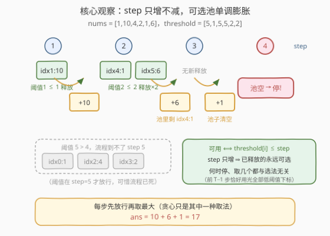
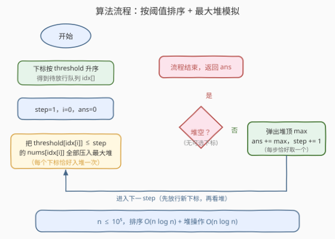

# 带阈值约束的最大总和

- **题目名称**：带阈值约束的最大总和
- **链接**：[3763. 带阈值约束的最大总和](https://leetcode.cn/problems/maximum-total-sum-with-threshold-constraints/)
- **难度**：中等
- **标签**：贪心、数组、排序、堆（优先队列）

## 1. 题目概述

> ⚠️ 本题为 LeetCode 付费题，题面无法直接抓取，题意根据官方示例用例、hints 及 doocs/leetcode 公开镜像重建，可能与官方题面有出入。

给定两个长度均为 $n$ 的整数数组 `nums` 与 `threshold`。从 $\text{step} = 1$ 开始，重复执行下面的流程：

- 找一个**未使用**的下标 $i$，使得 $\text{threshold}[i] \le \text{step}$。若这样的下标不存在，**流程结束**；
- 把 $\text{nums}[i]$ 加进累计总和；
- 将下标 $i$ 标记为已使用，并令 $\text{step} \mathrel{+}= 1$。

返回流程结束时能获得的**最大总和**。

**示例 1**：

```text
输入：nums = [1,10,4,2,1,6], threshold = [5,1,5,5,2,2]
输出：17
解释：
  step=1：threshold[1]=1 ≤ 1，选 i=1，总和 10；
  step=2：threshold[4]=2 ≤ 2，选 i=4，总和 11；
  step=3：threshold[5]=2 ≤ 3，选 i=5，总和 17；
  step=4：下标 0、2、3 的阈值都是 5 > 4，无可选下标，流程结束。
```

**示例 2**：

```text
输入：nums = [4,1,5,2,3], threshold = [3,3,2,3,3]
输出：0
解释：step=1 时没有任何 threshold[i] ≤ 1，流程立刻结束，总和为 0。
```

**示例 3**：

```text
输入：nums = [2,6,10,13], threshold = [2,1,1,1]
输出：31
解释：依次选 i=3（总和 13）、i=2（23）、i=1（29）、i=0（31），
      所有下标用完，流程结束。
```

**约束条件**：

- $n = \text{nums.length} = \text{threshold.length}$
- $1 \le n \le 10^5$
- $1 \le \text{nums}[i] \le 10^9$
- $1 \le \text{threshold}[i] \le n$

> 💡 **审题关键**：① 阈值是**放行条件**不是截止条件——$\text{threshold}[i] \le \text{step}$ 一旦成立便永远成立（step 只增不减），下标不会「过期」；② 某步不存在可选下标时流程**立刻终止**，不能跳过空步去等后面阈值更大的下标（示例 2 直接输出 0）；③ $\text{nums}[i]$ **全为正**，且第 2.2 节会证明：无论每步选谁，最终总和其实是个**定值**，「最大」二字颇有迷惑性；④ $n \times \max(\text{nums}) \approx 10^{14}$，须 64 位整数。

---

## 2. 解题思路

### 2.1 暴力思路：逐步线性扫描

老老实实模拟：第 $\text{step}$ 步从左到右扫一遍全部下标，在「未使用且 $\text{threshold}[i] \le \text{step}$」的候选里挑出 $\text{nums}[i]$ 最大的一个取走。单步 $O(n)$，流程至多走 $n+1$ 步，总计 $O(n^2) = 10^{10}$，必然超时。

瓶颈在于**每一步都从头重扫**，而事实上可选集合只会**单调膨胀**——第 $s$ 步新增的候选只是 $\text{threshold}[i] = s$ 的那一小撮，之前放行的下标若未被取走仍然可选。增量信息完全没有被利用。

### 2.2 核心观察：可选池单调膨胀，流程生死早已注定



**观察一（单调性 ⇒ 排序 + 最大堆）**：step 每轮 +1 只增不减，故「$\text{threshold}[i] \le \text{step}$」一旦成立便永远成立。把下标按 threshold **升序排序**，用指针 $j$ 批量放行：第 $\text{step}$ 步先把所有 $\text{threshold}[\text{idx}[j]] \le \text{step}$ 的值压入**最大堆**（每个下标一生恰好入堆一次），再弹出堆顶。入堆出堆各 $n$ 次，均摊 $O(n \log n)$——这正是官方 hints 的思路（"At each step, use a max-heap and add every index that becomes available"）。

**观察二（结束时刻与选法无关）**：设 $R(s) = \#\{i : \text{threshold}[i] \le s\}$。第 $s$ 步开始时已用掉的 $s-1$ 个下标全是低阈值的（被取下标的阈值 $\le$ 其被取的步数 $\le s-1$），于是「未使用的可选下标」恰有 $R(s) - (s-1)$ 个——**这个数量只依赖 threshold 数组本身，与每步选谁毫无关系**。流程必然停在第

$$T = \min\{\, s \ge 1 : R(s) < s \,\}$$

步（因 $\text{threshold}[i] \le n$ 恒有 $R(n) = n \ge n$，故 $T \le n+1$）。更进一步，被取走的**集合**也是定死的：前 $T-1$ 步每步消耗一个阈值 $\le T-1$ 的下标，共消耗 $T-1$ 个；由 $R$ 单调不减及 $R(T) = T-1$ 可推出 $R(T-1) = T-1$，即阈值 $\le T-1$ 的下标**恰好**只有 $T-1$ 个——计数双射，全部取光。所以无论怎么选，总和都是

$$\text{ans} = \sum_{\text{threshold}[i] \le T-1} \text{nums}[i]$$

官方示例 1 的解释在 step=2 取的是 idx4（值 1）而非更大的 idx5（值 6），最终照样 17——所谓「最大总和」实为**唯一总和**；「贪心取最大」只是模拟流程的自然写法。正数值条件保证不存在「宁可早停」的歧义。

**观察三（h-index 视角 ⇒ 可以不建堆）**：把 threshold 升序排列为 $t_{(1)} \le t_{(2)} \le \dots \le t_{(n)}$，则 $R(s) \ge s \iff t_{(s)} \le s$，故

$$T = \min\{\, k : t_{(k)} > k \,\}$$

沿排序后的下标走，第 $k$ 个位置的阈值一旦超过 $k$ 就「断流」。这与 [274. H 指数](https://leetcode.cn/problems/h-index/)的「至少 $k$ 篇论文引用数 $\ge k$」是同一个**前缀计数与下标的交叉条件**。堆只是题面 hints 给出的模拟视角，排序 + 前缀判定同样精确（第 5 节给出免堆的 $O(n)$ 版本）。

### 2.3 算法流程图



1. 把下标数组按 threshold 升序排序，得放行队列 `idx[]`；
2. 初始化 `step = 1`、放行指针 `j = 0`、最大堆空、`ans = 0`；
3. 把所有 `threshold[idx[j]] ≤ step` 的 `nums[idx[j]]` 压入最大堆（推进 `j`）；
4. 堆空 → 本步无可选下标，流程结束，返回 `ans`；
5. 否则弹出堆顶累加进 `ans`，`step += 1`，回到第 3 步。

### 2.4 示例演算

以示例 1 `nums = [1,10,4,2,1,6]`、`threshold = [5,1,5,5,2,2]` 走一遍：

| step | 新放行（阈值 ≤ step） | 取出前池中 | 本步取出 | ans | 备注 |
|------|----------------------|-----------|---------|-----|------|
| 1 | idx1（阈值 1，值 10） | {10} | 10 | 10 | |
| 2 | idx4（阈值 2，值 1）、idx5（阈值 2，值 6） | {1, 6} | 6 | 16 | 池中剩 idx4 |
| 3 | —（阈值 3、4 无人认领） | {1} | 1 | 17 | 吃存货 |
| 4 | — | {} | — | 停止 | 池空，流程终止 |

阈值 5 的 idx0、idx2、idx3 直到流程死亡也没等到放行，故 $\text{ans} = 10 + 6 + 1 = 17$。

对照另外两例：示例 2 中 $R(1) = 0 < 1$，$T = 1$，一步未走，ans = 0；示例 3 排序后阈值为 $[1,1,1,2]$，$k = 1..4$ 全部满足 $t_{(k)} \le k$，$T = 5$，四个下标全取，ans $= 2+6+10+13 = 31$。

---

## 3. 参考代码

### C++

```cpp
class Solution {
  public:
    long long maxSum(vector<int>& nums, vector<int>& threshold) {
        int n = nums.size();
        vector<int> idx(n);
        iota(idx.begin(), idx.end(), 0);
        sort(idx.begin(), idx.end(), [&](int a, int b) {
            return threshold[a] < threshold[b];
        });

        priority_queue<int> pq;  // 最大堆：已放行、未使用的值
        long long ans = 0;
        int j = 0;
        for (int step = 1;; ++step) {
            while (j < n && threshold[idx[j]] <= step) {  // 批量放行
                pq.push(nums[idx[j]]);
                ++j;
            }
            if (pq.empty()) break;      // 本步无可选下标，流程结束
            ans += pq.top();            // 取最大（取谁其实不影响总和）
            pq.pop();
        }
        return ans;
    }
};
```

### Python

```python
class Solution:
    def maxSum(self, nums: List[int], threshold: List[int]) -> int:
        n = len(nums)
        idx = sorted(range(n), key=lambda i: threshold[i])

        heap = []                          # 存负值的最小堆 = 最大堆
        ans = 0
        j = 0
        step = 1
        while True:
            while j < n and threshold[idx[j]] <= step:    # 批量放行
                heapq.heappush(heap, -nums[idx[j]])
                j += 1
            if not heap:                   # 本步无可选下标，流程结束
                return ans
            ans += -heapq.heappop(heap)    # 取最大（取谁其实不影响总和）
            step += 1
```

> ⚠️ **溢出提醒**：$n \le 10^5$、$\text{nums}[i] \le 10^9$，总和上界 $10^{14}$，超出 32 位范围——C++ 全程 `long long`；Python 整数无限精度无虞。

---

## 4. 复杂度分析

| 维度 | 复杂度 | 说明 |
|------|--------|------|
| 时间复杂度 | $O(n \log n)$ | 下标排序 $O(n \log n)$；放行指针 $j$ 单向推进，每个下标恰好入堆、出堆各一次（均摊），step 循环至多 $n+1$ 轮 |
| 空间复杂度 | $O(n)$ | 下标数组 $O(n)$ + 堆（堆中至多同时存 $n$ 个已放行未取的值） |

---

## 5. 扩展：免堆的 O(n) 计数判定版

由 2.2 的观察三，答案只取决于「阈值升序序列的前缀中 $t_{(k)} \le k$ 能维持多久」。而约束 $\text{threshold}[i] \in [1, n]$ 天然支持**计数排序**：按阈值分桶、桶序展开即为升序，连比较排序都省了；堆更是一步都不用建——沿展开序列走，第 $k$ 个位置的阈值一旦大于 $k$ 就断流：

```python
class Solution:
    def maxSum(self, nums: List[int], threshold: List[int]) -> int:
        n = len(nums)
        buckets = [[] for _ in range(n)]        # buckets[x-1] 存阈值为 x 的下标
        for i, x in enumerate(threshold):
            buckets[x - 1].append(i)

        ans = 0
        step = 0
        for b in buckets:                        # 阈值 1, 2, ..., n 依次放行
            for i in b:
                step += 1
                if step < threshold[i]:          # t_(k) > k：断流，后面永远等不到
                    return ans
                ans += nums[i]
        return ans
```

> 💡 已用官方三例 + 2000 组随机小数据与「穷举所有取法」的暴力对拍验证：堆模拟版、前缀判定版与任何取法的实际总和完全一致——再次印证**选法无关性**。堆版胜在与题面 hints 的模拟视角对应、思路直白；计数版胜在 $O(n)$ 极致。

---

## 6. 面试要点

1. **每步取最大是必须的吗？取别的会不会更差或更好？**

   都不会。结束步 $T = \min\{s : R(s) < s\}$ 只依赖 threshold 数组；且前 $T-1$ 步会把阈值 $\le T-1$ 的下标**全部**用光（每步消耗一个、恰有 $T-1$ 个，计数双射），被取集合是定死的，总和价值唯一。贪心取最大只是流程的自然实现，最小堆、乱取同样得解。

2. **为什么不能跳过空步、等后面阈值更大的下标？**

   题面流程是硬性规定：某步不存在 $\text{threshold}[i] \le \text{step}$ 的未用下标即终止。示例 2（最小阈值是 2）在 step=1 立即终止输出 0。缺口一旦出现（$R(s) < s$）流程即死，后面 step 再大也到不了。

3. **这个结束条件与 H 指数有什么关系？**

   $T = \min\{k : t_{(k)} > k\}$（阈值升序后）与「h = 最大的 $k$ 使至少 $k$ 篇引用 $\ge k$」同构，都是**前缀计数与下标的交叉点**——排序后 $O(n)$ 一趟可扫，本题甚至因 $\text{threshold}[i] \in [1, n]$ 可以计数排序免比较。

4. **堆版为什么是均摊 $O(n \log n)$ 而非 $O(n^2 \log n)$？**

   放行指针单向推进：每个下标只在阈值首次 $\le \text{step}$ 时入堆一次、出堆至多一次；step 外循环虽至多 $n+1$ 轮，但每轮除摊销入堆外只有一次堆操作。「先批量放行再弹一个」是关键写法，切勿每步全量重扫或重复入堆。

5. **哪些量会溢出？**

   总和上界 $n \cdot \max(\text{nums}) = 10^5 \times 10^9 = 10^{14}$，超出 `int`（约 $2.1 \times 10^9$）四个数量级。C++ 从累加变量到返回值全链路 `long long`；Python 天然安全。

> 💡 **一句话总结**：阈值是「放行时刻」，step 只增使可选池单调膨胀——排序 + 指针批量放行 + 最大堆，$O(n \log n)$ 模拟收工；看穿 $R(s) < s$ 的断流条件后更可省掉堆，计数排序 $O(n)$ 直取定值答案。

---

## 7. 同类练习题

- [274. H 指数](https://leetcode.cn/problems/h-index/)：同一「前缀计数 vs 下标」交叉判定（$R(s) \ge s$），排序或计数两种解法对照
- [502. IPO](https://leetcode.cn/problems/ipo/)：逐轮解锁新项目 + 最大堆取当前最优，与本题「每步放行再取一个」的流程结构如出一辙
- [630. 课程表 III](https://leetcode.cn/problems/course-schedule-iii/)：按时间推进 + 堆维护截至当前的最优选择，训练「流程逐步推进」的堆贪心建模
- [1642. 可以到达的最远建筑](https://leetcode.cn/problems/furthest-building-you-can-reach/)：资源耗尽即流程终止的堆贪心，体会「能推进多远」的边界判定
- [871. 最低加油次数](https://leetcode.cn/problems/minimum-number-of-refueling-stops/)：堆中存货决定能走多远，与本题「池子余量决定流程生死」同款直觉
