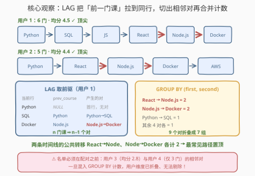
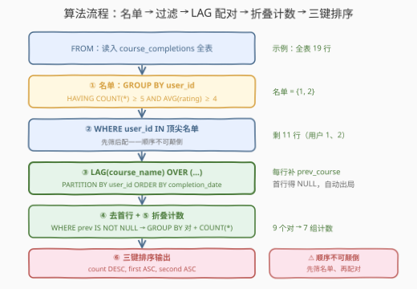

# LeetCode 最常见的课程组合 题解

## 1. 题目概述

- **标题 / 题号**：最常见的课程组合（#3764，hard）
- **链接**：https://leetcode.cn/problems/most-common-course-pairs/
- **难度**：困难
- **标签**：数据库、SQL、窗口函数、`LAG()`、CTE、`GROUP BY` / `HAVING`、序列相邻对（转移频次统计）

**表结构**：`course_completions`

| 列名 | 类型 |
|------|------|
| user_id | int |
| course_id | int |
| course_name | varchar |
| completion_date | date |
| course_rating | int |

- `(user_id, course_id)` 是此表中具有不同值的列的组合（复合唯一键）。
- 每行代表一个用户完成的课程及其评分（1–5 分）。

**目标**：通过分析**顶尖学生**完成课程的序列来识别**课程路径**：

1. 只考虑**顶尖学生**——完成**至少 5 门**课程且**平均评分 4 分或以上**的用户；
2. 对每个顶尖学生，确定其按**时间顺序**完成的课程序列；
3. 找出这些学生所学过的所有**相邻课程对**（课程 A → 课程 B）；
4. 统计每个课程对出现的次数（转移频次），找出最常见的课程路径。

**输出**三列 `first_course, second_course, transition_count`，按 `transition_count` **降序**，频率相同时按 `first_course`、`second_course` **升序**排序。

**示例**：

```text
输入：course_completions 表
+---------+-----------+------------------+-----------------+---------------+
| user_id | course_id | course_name      | completion_date | course_rating |
+---------+-----------+------------------+-----------------+---------------+
| 1       | 101       | Python Basics    | 2024-01-05      | 5             |
| 1       | 102       | SQL Fundamentals | 2024-02-10      | 4             |
| 1       | 103       | JavaScript       | 2024-03-15      | 5             |
| 1       | 104       | React Basics     | 2024-04-20      | 4             |
| 1       | 105       | Node.js          | 2024-05-25      | 5             |
| 1       | 106       | Docker           | 2024-06-30      | 4             |
| 2       | 101       | Python Basics    | 2024-01-08      | 4             |
| 2       | 104       | React Basics     | 2024-02-14      | 5             |
| 2       | 105       | Node.js          | 2024-03-20      | 4             |
| 2       | 106       | Docker           | 2024-04-25      | 5             |
| 2       | 107       | AWS Fundamentals | 2024-05-30      | 4             |
| 3       | 101       | Python Basics    | 2024-01-10      | 3             |
| 3       | 102       | SQL Fundamentals | 2024-02-12      | 3             |
| 3       | 103       | JavaScript       | 2024-03-18      | 3             |
| 3       | 104       | React Basics     | 2024-04-22      | 2             |
| 3       | 105       | Node.js          | 2024-05-28      | 3             |
| 4       | 101       | Python Basics    | 2024-01-12      | 5             |
| 4       | 108       | Data Science     | 2024-02-16      | 5             |
| 4       | 109       | Machine Learning | 2024-03-22      | 5             |
+---------+-----------+------------------+-----------------+---------------+

输出：
+------------------+------------------+------------------+
| first_course     | second_course    | transition_count |
+------------------+------------------+------------------+
| Node.js          | Docker           | 2                |
| React Basics     | Node.js          | 2                |
| Docker           | AWS Fundamentals | 1                |
| JavaScript       | React Basics     | 1                |
| Python Basics    | React Basics     | 1                |
| Python Basics    | SQL Fundamentals | 1                |
| SQL Fundamentals | JavaScript       | 1                |
+------------------+------------------+------------------+
```

**资格判定**：

| 用户 | 课程数 | 平均分 | 顶尖学生？ |
|------|--------|--------|-----------|
| 1 | 6 | 4.5 | ✓ |
| 2 | 5 | 4.4 | ✓ |
| 3 | 5 | 2.8 | ✗ 均分不足 |
| 4 | 3 | 5.0 | ✗ 课程数不足 |

> 💡 **审题关键**：
> ① 输出的是**全部**课程对的频次表（示例共 7 行），不是只保留最高频的——「最常见的路径」靠排序**置顶**呈现；
> ② 顺序是语义的一部分：必须**先筛顶尖学生、再配对**——配对后按 `(first, second)` 分组，用户维度已被折叠，混进来的非法对无法再剔除；
> ③ 「平均评分 4 分或以上」是**用户级**聚合 `AVG(course_rating) >= 4`，不是逐行的 `course_rating >= 4`；
> ④ 「相邻」以完成时间排序为准，每个学生的**首门课**没有前驱、天然不产生对（5 门课 ⇒ 4 个对）。

## 2. 解题思路

### 2.1 暴力思路：自连接找「紧随其后」的课

没有窗口函数时，最直接的做法是**自连接**：对同一用户的任意两行 `t1`、`t2`，用相关子查询判定 `t2` 是否恰好是 `t1` 之后的**下一门课**——

```sql
t2.completion_date = (SELECT MIN(t3.completion_date)
                      FROM course_completions t3
                      WHERE t3.user_id = t1.user_id
                        AND t3.completion_date > t1.completion_date)
```

语义正确，但每行都要回头扫一遍所在用户的全组，最坏 $O(n^2)$；用户课程越多，连接爆炸越猛。

另一个更隐蔽的坑是**顺序颠倒**：先把**所有**用户的相邻对数出来、再想筛掉非顶尖学生——晚了，`GROUP BY (first, second)` 之后用户信息已被折叠，污染进来的计数**无法追溯剔除**。比如本题用户 3（均分 2.8）同样贡献 4 个相邻对，一旦混入，所有频次全部失真。正确心法：**名单在前，配对在后**。

### 2.2 核心观察：`LAG` 取前驱，每行自带一个对



**观察一：相邻对 = 当前行 × 它的前驱行，`LAG` 一行到位。**

```sql
LAG(course_name) OVER (PARTITION BY user_id
                       ORDER BY completion_date) AS prev_course
```

`PARTITION BY user_id` 保证不跨用户取前驱，`ORDER BY completion_date` 把序列按时间排好；除每个分区的**首行**（返回 `NULL`）外，每行都自带一个 `(prev_course, course_name)` 对——用户 1 的 6 门课切出 5 个对，用户 2 的 5 门课切出 4 个对，**无需任何连接**。

**观察二：资格条件是用户级聚合，`GROUP BY` + `HAVING` 生成「顶尖名单」。**

```sql
SELECT user_id
FROM course_completions
GROUP BY user_id
HAVING COUNT(*) >= 5 AND AVG(course_rating) >= 4
```

名单是一个集合，用 `WHERE user_id IN (...)` 半连接回原表即可——只留行、不添列，`IN` 比 `JOIN` 更贴语义。

**观察三：两段式拼装——「塌缩出名单」+「保行配对」各司其职。**

名单是**塌缩**语义（每用户一行，`GROUP BY` 最自然），配对是**保行**语义（每行补一列，必须窗口函数）。先 `IN` 过滤、再 `LAG` 开窗，最后 `GROUP BY (prev, cur)` 跨用户折叠计数——三步正好覆盖题面四条要求。

> 💡 一句话：**`HAVING` 出名单 → `IN` 过滤 → `LAG` 切相邻对 → 首行 `NULL` 自动出局 → `GROUP BY` 计数 → 三键排序收尾。**

### 2.3 算法流程图



| 步骤 | 操作 | 说明 |
|------|------|------|
| ① 名单 | `GROUP BY user_id HAVING COUNT(*) >= 5 AND AVG(course_rating) >= 4` | 塌缩成「顶尖学生集合」，示例中为 `{1, 2}` |
| ② 过滤 | `WHERE user_id IN (名单)` | **必须先于配对**，非顶尖的行从这里就进不来 |
| ③ 配对 | `LAG(course_name) OVER (PARTITION BY user_id ORDER BY completion_date)` | 每行补 `prev_course`；分区首行得 `NULL` |
| ④ 去首行 | `WHERE prev_course IS NOT NULL` | `NULL` 三值逻辑自动出局，无需 `COALESCE` |
| ⑤ 计数 | `GROUP BY prev_course, course_name` + `COUNT(*)` | 跨用户折叠出每个课程对的频次 |
| ⑥ 排序 | `ORDER BY transition_count DESC, first_course, second_course` | 高频置顶，并列时课名字典序破平 |

> ⚠️ 步骤 ④ 的 `WHERE` 引用的是内层 CTE/派生表的**列**（`prev_course`），不是本层 `SELECT` 别名——所以 `LAG` 必须先在 CTE/派生表里落地，外层才能过滤与分组。

### 2.4 示例演算

两个顶尖学生的序列与切出的相邻对：

| 用户 | 时间线（按 completion_date） | 相邻对 |
|------|------------------------------|--------|
| 1 | Python Basics → SQL Fundamentals → JavaScript → React Basics → Node.js → Docker | (Python→SQL)、(SQL→JS)、(JS→React)、(React→Node)、(Node→Docker) |
| 2 | Python Basics → React Basics → Node.js → Docker → AWS Fundamentals | (Python→React)、(React→Node)、(Node→Docker)、(Docker→AWS) |

合并计数（9 个对、7 个不同组合）：

| 课程对 | 出现次数 |
|--------|:--:|
| React Basics → Node.js | **2**（用户 1、2 各一次） |
| Node.js → Docker | **2**（用户 1、2 各一次） |
| 其余 5 个对 | 1 |

排序验证：频次 2 的两个对按 `first_course` 升序，`Node.js` < `React Basics`，故 Node.js → Docker 置顶；频次 1 的五个对按 `(first_course, second_course)` 字典序排为 Docker→AWS、JavaScript→React、Python→React、Python→SQL、SQL→JavaScript——与官方输出完全一致 ✓。

用户 3（5 门、均分 2.8）与用户 4（仅 3 门）在步骤 ② 就被名单拦下，一个对也不贡献。

## 3. 参考代码

### MySQL（解法 A：CTE + `LAG`，推荐）

```sql
# Write your MySQL query statement below
WITH top_students AS (
    SELECT user_id
    FROM course_completions
    GROUP BY user_id
    HAVING COUNT(*) >= 5
       AND AVG(course_rating) >= 4
),
paired AS (
    SELECT course_name,
           LAG(course_name) OVER (
               PARTITION BY user_id
               ORDER BY completion_date
           ) AS prev_course
    FROM course_completions
    WHERE user_id IN (SELECT user_id FROM top_students)
)
SELECT prev_course AS first_course,
       course_name AS second_course,
       COUNT(*)    AS transition_count
FROM paired
WHERE prev_course IS NOT NULL
GROUP BY prev_course, course_name
ORDER BY transition_count DESC, first_course, second_course;
```

> 💡 **写法要点**：
> - `top_students` 只产出 `user_id` 一列——名单是集合，`IN` 半连接只留行、不添列；
> - `LAG` 必须先在 `paired` 里落地成列，外层的 `WHERE prev_course IS NOT NULL` 与 `GROUP BY` 才引用得到；
> - `AVG(course_rating)` 返回精确 decimal，`>= 4` 无整型截断问题；
> - 两个 CTE 各管一段（名单 / 配对），与 2.3 流程图一一对应。

### MySQL（解法 B：自连接找「下一门课」，兼容无窗口函数的老版本）

```sql
# Write your MySQL query statement below
SELECT t1.course_name AS first_course,
       t2.course_name AS second_course,
       COUNT(*)        AS transition_count
FROM course_completions t1
JOIN course_completions t2
  ON t2.user_id = t1.user_id
 AND t2.completion_date = (
        SELECT MIN(t3.completion_date)
        FROM course_completions t3
        WHERE t3.user_id = t1.user_id
          AND t3.completion_date > t1.completion_date
     )
WHERE t1.user_id IN (
        SELECT user_id
        FROM course_completions
        GROUP BY user_id
        HAVING COUNT(*) >= 5 AND AVG(course_rating) >= 4
     )
GROUP BY t1.course_name, t2.course_name
ORDER BY transition_count DESC, first_course, second_course;
```

> 💡 **A vs B**：B 的灵魂是相关子查询定「紧随其后」——`t2` 的日期必须是「晚于 `t1` 的最早日期」，再晚的行都不配做 `t1` 的后继。可移植（MySQL 5.x 可跑），但每行回头扫组，最坏 $O(n^2)$；A 用一次分区排序把前驱送到每行手边，$O(n \log n)$，是首选。

### Pandas

```python
import pandas as pd

def topLearnerCourseTransitions(course_completions: pd.DataFrame) -> pd.DataFrame:
    df = course_completions.copy()
    df['completion_date'] = pd.to_datetime(df['completion_date'])

    df['cnt'] = df.groupby('user_id')['course_id'].transform('size')
    df['avg_rating'] = df.groupby('user_id')['course_rating'].transform('mean')
    df = df[(df['cnt'] >= 5) & (df['avg_rating'] >= 4)]

    df = df.sort_values(['user_id', 'completion_date'])
    df['first_course'] = df.groupby('user_id')['course_name'].shift(1)
    pairs = df.dropna(subset=['first_course']).rename(
        columns={'course_name': 'second_course'})

    ans = (pairs.groupby(['first_course', 'second_course'], as_index=False)
                 .agg(transition_count=('second_course', 'size')))
    return (ans.sort_values(['transition_count', 'first_course', 'second_course'],
                            ascending=[False, True, True])
               .reset_index(drop=True))
```

> 💡 **写法要点**：
> - `groupby('user_id')['col'].transform(...)` 把用户级统计**广播回每一行**，正是「先算名单、再按行过滤」的镜像——等价于解法 A 的 CTE + `IN`，却免了两次物化；
> - `groupby('user_id')['course_name'].shift(1)` 就是 `LAG(course_name) OVER (PARTITION BY user_id ORDER BY ...)`——**先 `sort_values` 再 `shift`**，顺序不能反（`shift` 按当前行序取上一行）；
> - 首行 `shift` 得 `NaN`，`dropna` 对应 SQL 的 `WHERE prev IS NOT NULL`；
> - `agg(transition_count=('second_course', 'size'))` 即 `GROUP BY + COUNT(*)`。

## 4. 复杂度分析

设 $n$ 为 `course_completions` 的行数，$p$ 为通过资格的相邻对总数（$p < n$），$g$ 为不同课程对数（$g \le p$）。

| 维度 | 复杂度 | 说明 |
|------|--------|------|
| **时间复杂度** | $O(n \log n)$（解法 A / pandas） | 名单聚合（哈希分组）$O(n)$ + `LAG` 分区排序 $O(n \log n)$ + 配对后分组 $O(p)$ + 终排 $O(g \log g)$；解法 B 的相关子查询每行回扫所在组，最坏 $O(n^2)$ |
| **空间复杂度** | $O(n)$ | CTE / 派生表物化过滤后的行与 `prev_course` 列；pandas 需整个 DataFrame 在内存 |

> - 排序开销只在 `LAG` 的分区排序一处，其余环节都是线性扫描；
> - 对比暴力自连接：核心收益不在代码量，而在**把「找后继」从每行回扫 $O(k)$ 压成排序后相邻行的 $O(1)$ 查阅**。

## 5. 扩展：一趟窗口版、平局确定性与马尔可夫视角

### 5.1 免 CTE 名单：用户级统计也开窗

`COUNT(*) OVER (PARTITION BY user_id)` 与 `AVG(course_rating) OVER (PARTITION BY user_id)` 把课程数和均分**广播到每一行**，与 `LAG` 同层求值——名单、配对一趟算齐，连 `IN` 半连接都省了：

```sql
SELECT prev_course AS first_course,
       course_name AS second_course,
       COUNT(*)    AS transition_count
FROM (
    SELECT course_name,
           LAG(course_name) OVER w                        AS prev_course,
           COUNT(*)         OVER (PARTITION BY user_id)   AS cnt,
           AVG(course_rating) OVER (PARTITION BY user_id) AS avg_rating
    FROM course_completions
    WINDOW w AS (PARTITION BY user_id ORDER BY completion_date)
) t
WHERE prev_course IS NOT NULL
  AND cnt >= 5
  AND avg_rating >= 4
GROUP BY prev_course, course_name
ORDER BY transition_count DESC, first_course, second_course;
```

代价是窗口版把统计广播在**全部 $n$ 行**上（而非每用户一行），内存足迹略大；换来的是单趟、无连接的扁平结构。两版风格之争与 [3716 题解](3716_寻找流失风险客户.md)的窗口版 vs `GROUP BY` 版完全同构。

### 5.2 同日完成的平局：确定性问题

题面只说「按时间顺序」，未规定同一用户**同日**完成多门课时的先后。仅按 `completion_date` 排序时，同日行的相对顺序取决于引擎实现，结果**不可复现**。工程做法是补第二排序键（如 `ORDER BY completion_date, course_id`），把「下一门课」的定义钉死。本题示例数据中每个用户的日期互异（且 `course_id` 与日期同序），单键排序即可复现官方输出——但要知道这层假设，面试里主动说出来是加分项。

> ⚠️ 解法 B 的自连接在同日平局下会**放大**问题：若两门课同日且都是「晚于 `t1` 的最早日期」，连接会同时命中两行，对被**重复计数**；窗口版 `LAG` 至少保证每行只产生一个前驱。

### 5.3 马尔可夫视角：转移频次与 k 阶路径

本题统计的正是**一阶马尔可夫链的经验转移计数**——把每个学生的课程序列看作状态链，`transition_count` 就是状态对 (A→B) 的观测频次；再除以对应学生的课程数还能得到经验转移概率（推荐系统「学完 A 的人接下来学什么」的原型）。两个方向的自然推广：

- **k 阶路径**：连续 $k+1$ 门课构成的长路径（如三连课 A→B→C），用 `LAG(course_name, k)` 多拉几列、过滤掉前 $k$ 行的 `NULL` 即可；
- **跳邻对**：想知道「学完 A 之后隔一门是什么」（A→C，中间隔着任意 B），`LAG(course_name, 2)` 与当前行配对——武器不变、只改偏移量。

## 6. 面试要点

**Q1：为什么必须「先筛学生、再配对」？反过来行不行？**

> `GROUP BY (first_course, second_course)` 之后，用户维度被折叠——一条 `(A→B, 3)` 的计数无法追溯贡献者。若先对全表配对计数再想剔除非顶尖学生，用户 3（均分 2.8）贡献的 4 个对已经焊死在计数里，只能整体作废。顺序即语义：**名单在前，配对在后**。

**Q2：`LAG` 在分区首行返回什么？需要 `COALESCE` 吗？**

> 返回 `NULL`。`WHERE prev_course IS NOT NULL` 借助三值逻辑天然过滤（`NULL` 参与任何比较都是 `UNKNOWN`），**不需要** `COALESCE` 填占位值——占位串一旦与真实课名相撞，反而会造出幽灵课程对。

**Q3：`AVG(course_rating) >= 4` 有没有整型截断的坑？**

> MySQL 的 `AVG` 总是返回精确 decimal（4.4、4.5 都能正确比较），无截断。真正的坑是把「平均评分 4 分或以上」写成逐行 `WHERE course_rating >= 4`——那筛的是「高分课」而非「高均分学生」，语义完全跑偏。

**Q4：本题里 `GROUP BY` 和窗口函数各扮演什么角色？能互换吗？**

> 名单（每用户一行统计）是**塌缩**语义，`GROUP BY + HAVING` 最自然；配对（每行补前驱列）是**保行**语义，必须窗口函数。二者恰好各得其所；5.1 展示了把名单也改成窗口（`COUNT/AVG OVER` 广播到每行）的一趟写法——可行，但统计量在全部行上冗余展开，代价与收益要掂量。

**Q5：输出的三键排序为什么这样设计？**

> `transition_count DESC` 让「最常见的课程路径」置顶——题面的主诉求；频次并列时 `first_course`、`second_course` 升序保证输出**确定**，判题器需要一个稳定的比对口径。混合方向的多键排序是 SQL 输出规范题的高频考点（对照 3716 的 `days DESC, user_id ASC`）。

> 💡 **一句话总结**：3764 = 用户级资格筛选 + `LAG` 相邻配对 + 跨用户折叠计数。带走三件事：**名单在配对之前**、**`LAG` 首行 `NULL` 自动出局**、**三键排序锁死输出顺序**。

## 同类练习题

| # | 题目 | 与本题的关联 |
|---|------|-------------|
| 2701 | [连续递增交易](https://leetcode.cn/problems/consecutive-transactions-with-increasing-amounts/)（[题解](../2701-2800/2701_连续递增交易.md)） | `LAG` 取前驱 + 相邻比较判递增——同款「序列相邻关系转同行两列」骨架，只是判定从「折叠计数」换成「全组校验」 |
| 180 | [连续出现的数字](https://leetcode.cn/problems/consecutive-numbers/)（[题解](../0101-0200/180_连续出现的数字.md)） | `LAG(num, 1/2)` 判连续三行同值——相邻对/相邻三元组的入门母题 |
| 2474 | [购买量严格增加的客户](https://leetcode.cn/problems/customers-with-strictly-increasing-purchases/)（[题解](../2401-2500/2474_购买量严格增加的客户.md)） | `LAG` 前驱 + 相邻违反计数筛客户——「先窗口后分组过滤」两段式同款 |
| 3060 | [时间范围内的用户活动](https://leetcode.cn/problems/user-activities-within-time-bounds/)（[题解](../3001-3100/3060_时间范围内的用户活动.md)） | `LAG` 取上一行会话结束时间算间隔——相邻行配对在时间间隔维度上的变体 |
| 603 | [连续空余座位](https://leetcode.cn/problems/consecutive-available-seats/)（[题解](../0601-0700/603_连续空余座位.md)） | `LAG/LEAD` 把相邻座位状态拉到同行比较——最轻量的相邻对入门 |
