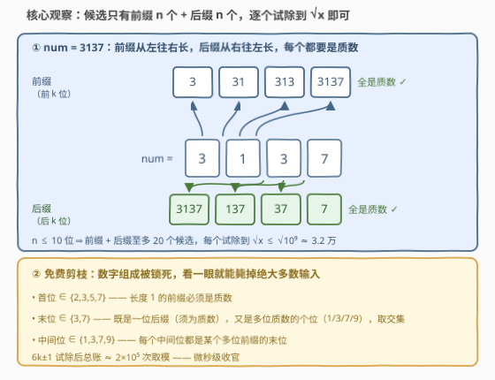
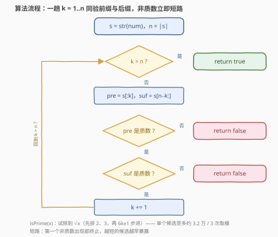
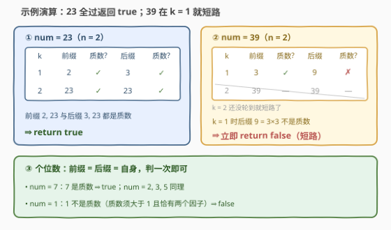

# LeetCode 完全质数 题解

## 1. 题目概述

- **标题 / 题号**：完全质数（#3765，medium）
- **链接**：https://leetcode.cn/problems/complete-prime-number/
- **难度**：中等
- **标签**：数学、数论、枚举

**题意**：给你一个整数 $num$。如果一个数的**每一个前缀**和**每一个后缀**都是**质数**，则称该数为**完全质数**。

如果 $num$ 是完全质数，返回 `true`，否则返回 `false`。

注意：

- 一个数的**前缀**是由该数的**前 $k$ 位数字**构成的数；
- 一个数的**后缀**是由该数的**后 $k$ 位数字**构成的数；
- **质数**是大于 1 且只有两个因子（1 和它本身）的自然数；
- 个位数只有在它是质数时才被视为完全质数。

**示例 1**：

```text
输入：num = 23
输出：true
解释：前缀 2、23 与后缀 3、23 都是质数。
```

**示例 2**：

```text
输入：num = 39
输出：false
解释：前缀 3 是质数，但 39 不是；后缀 9 也不是质数。
```

**示例 3**：

```text
输入：num = 7
输出：true
解释：7 是质数，它的所有前缀和后缀都是 7 本身。
```

**约束**：

- $1 \le num \le 10^{9}$

> 💡 **审题关键**：① 检查对象是**前缀和后缀各 $n$ 个**（共至多 $2n$ 个数），**不是所有子串**——$n \le 10$ 位，候选规模小得离谱；② $10^{9}$ 恰好塞得进 `int`（上限约 $2.1\times10^{9}$），但试除循环里 $i \cdot i$ 已贴着 int 顶，要防溢出；③ 个位数的前缀 = 后缀 = 自身，而 1 不是质数。

## 2. 解题思路

### 2.1 暴力思路

把 $num$ 转成字符串 $s$（长 $n$），枚举全部前缀 $s[0..k)$ 与后缀 $s[n-k..n)$，逐个判质数。判质数用最朴素的试除——从 $2$ 一路除到 $x-1$：

```cpp
bool isPrimeNaive(int x) {
    if (x < 2) return false;
    for (int i = 2; i < x; ++i)
        if (x % i == 0) return false;
    return true;
}
```

这笔账在 $x$ 接近 $10^9$ 时是**单次十亿次取模**，不可接受。而整个算法唯一的优化点恰好就在这里：**试除到 $\sqrt{x}$ 为止**——因数成对出现，$x = a\cdot b$ 且 $a\le b$ 时必有 $a \le \sqrt{x}$，扫过 $[2, \lfloor\sqrt{x}\rfloor]$ 未见因数即可断定质数。

### 2.2 核心观察：候选只有 $2n$ 个，试除到 $\sqrt{x}$ 即可



三笔账算清楚，本题就结束了：

- **候选规模**：$n \le 10$ 位 ⇒ 前缀 $n$ 个 + 后缀 $n$ 个，**至多 20 个数**要判；
- **单个判定成本**：试除到 $\sqrt{x} \le \sqrt{10^9} \approx 31623$；再用 $6k\pm1$ 步进（大于 3 的质数模 6 只能是 1 或 5，先排掉 2、3）省去 $2/3$ 的行程，单次约 $10^4$ 次取模；
- **总账**：$20 \times 10^4 \approx 2\times10^5$ 次取模，微秒级。

再送两份**免费剪枝**——看一眼数字组成就能毙掉绝大多数输入：

- **首位**必须是 $\{2,3,5,7\}$：否则长度为 1 的前缀就不是质数；
- **末位**必须是 $\{3,7\}$：末位既是长度为 1 的后缀（一位质数 $\subseteq \{2,3,5,7\}$），又是整个多位数的个位（多位质数个位只能是 $1,3,7,9$），两约束取交集只剩 $\{3,7\}$。

顺着同样的逻辑还能推出更狠的必要条件：**中间每一位**都是某个位数 $\ge 2$ 的前缀的末位，所以必须 $\in \{1,3,7,9\}$。完全质数的数字组成被锁得死死的——**首位 $\in\{2,3,5,7\}$、中间位 $\in\{1,3,7,9\}$、末位 $\in\{3,7\}$**。例如 $3137$：$3,1,3,7$ 全部合规，才轮得到试除出场。

### 2.3 算法流程图



**逻辑执行步骤**：

| 步骤 | 操作 | 说明 |
|------|------|------|
| ① 转字符串 | `s = to_string(num)` | 拆出每一位，$n = |s|$ |
| ② 循环 | `k = 1..n` | 一趟同时取前缀与后缀 |
| ③ 取前缀 | `s.substr(0, k)` | 前 $k$ 位 |
| ④ 取后缀 | `s.substr(n-k)` | 后 $k$ 位 |
| ⑤ 判质数 | `isPrime(pre)`、`isPrime(suf)` | 试除到 $\sqrt{x}$，$6k\pm1$ 步进 |
| ⑥ 短路 | 任一非质数 → `return false` | 后面的候选不用再看 |
| ⑦ 收尾 | 全部通过 → `return true` | |

### 2.4 示例演算



**示例 1**：`num = 23`（$n = 2$）：

| $k$ | 前缀 | 质数？ | 后缀 | 质数？ |
|-----|------|--------|------|--------|
| 1 | 2 | ✓ | 3 | ✓ |
| 2 | 23 | ✓ | 23 | ✓ |

全部通过 → 返回 `true`。

**示例 2**：`num = 39`（$n = 2$）：

| $k$ | 前缀 | 质数？ | 后缀 | 质数？ |
|-----|------|--------|------|--------|
| 1 | 3 | ✓ | 9 | ✗（$9 = 3\times3$） |
| 2 | 39 | — | 39 | — |

$k=1$ 时后缀 9 已不是质数，**短路返回 `false`**——39 本身、前缀 39 都不用再判（虽然它们也不是质数）。

**示例 3**：`num = 7`：前缀 = 后缀 = 7，是质数 → `true`。而 `num = 1`：前缀 = 后缀 = 1，不是质数 → `false`。

## 3. 参考代码

### C++

```cpp
class Solution {
    bool isPrime(int x) {
        if (x < 2) return false;
        if (x % 2 == 0) return x == 2;
        if (x % 3 == 0) return x == 3;
        for (long long i = 5; i * i <= x; i += 6) {
            if (x % i == 0 || x % (i + 2) == 0) return false;
        }
        return true;
    }
public:
    bool completePrime(int num) {
        string s = to_string(num);
        int n = s.size();
        for (int k = 1; k <= n; ++k) {
            if (!isPrime(stoi(s.substr(0, k)))) return false;
            if (!isPrime(stoi(s.substr(n - k)))) return false;
        }
        return true;
    }
};
```

> 💡 **写法要点**：
> - 试除循环变量用 `long long i`：$i$ 逼近 $31623$ 时 $i\cdot i$ 已约 $10^9$，贴着 `int` 上限，换 `long long` 一劳永逸；
> - 先排掉 2、3，再从 5 开始按 $6k\pm1$ 步进（每轮同时试 `i` 与 `i+2`），试除次数降到朴素版的 $1/3$；
> - 前缀后缀放在**同一个循环**里从小到大验——越短的数越容易被数字组成剪掉，短路来得最快。

### Python

```python
class Solution:
    def completePrime(self, num: int) -> bool:
        def is_prime(x: int) -> bool:
            if x < 2:
                return False
            if x % 2 == 0:
                return x == 2
            if x % 3 == 0:
                return x == 3
            i = 5
            while i * i <= x:
                if x % i == 0 or x % (i + 2) == 0:
                    return False
                i += 6
            return True

        s = str(num)
        n = len(s)
        return all(is_prime(int(s[:k])) and is_prime(int(s[n - k:]))
                   for k in range(1, n + 1))
```

> 💡 **写法要点**：
> - `all(...)` 搭配生成器天然短路——第一个非质数出现即停止，与手写循环等价；
> - 切片 `s[:k]` / `s[n-k:]` 即前缀与后缀；`int()` 会自动容忍前导零（本题不涉及，3556 那种子串题里这个性质会派上用场）。

## 4. 复杂度分析

| 维度 | 复杂度 | 说明 |
|------|--------|------|
| **时间** | $O(d \cdot \sqrt{M})$ | $d \le 10$ 为位数，$M \le 10^9$；$6k\pm1$ 步进后约 $2\times10^5$ 次取模 |
| **空间** | $O(d)$ | 字符串本身；纯算术版可做到 $O(1)$（见第 5 节） |
| **对比** | naive 试除 $O(d \cdot M)$ | 「除到 $\sqrt{x}$」是唯一但致命的优化，差 5 个数量级 |

## 5. 扩展：完全质数的真身——两边可截质数

这类数在数论里有正式名字：

- 所有**前缀**都是质数 = **右可截质数**（right-truncatable prime，OEIS [A024770](https://oeis.org/A024770)）：十进制下共 83 个，最大 $73939133$；
- 所有**后缀**都是质数 = **左可截质数**（left-truncatable prime，OEIS [A024785](https://oeis.org/A024785)）：共 4260 个，最大 357686312646216567629137；
- **完全质数 = 两者交集**，即**两边质数**（two-sided primes，OEIS [A020994](https://oeis.org/A020994)）：十进制下**恰好 15 个**——

$$2,\ 3,\ 5,\ 7,\ 23,\ 37,\ 53,\ 73,\ 313,\ 317,\ 373,\ 797,\ 3137,\ 3797,\ 739397$$

最大者 $739397 < 10^9$。也就是说，**在本题数据范围内，答案是 `true` 的输入只有这 15 个数**——理论上 `return num in {...}` 一行也能过（面试当彩蛋讲，别当正解写）。

两类可截质数都有限，直觉原因是它们生长在一棵「截断树」上：从一位质数出发不断添数字，每位候选只剩 $\{1,3,7,9\}$，可行数越来越稀疏，最终某一层全军覆没，树就枯死了。这也给出**枚举形态**的高效解法：从一位质数出发 BFS 这棵树（右添数字生成右可截、左添数字生成左可截，取交集），比逐一判定 $10^9$ 内每个数快得多——「判定单个」与「枚举全部」是两种问题形态，打法完全不同。

顺带一提纯算术版（不开字符串）：从 $num$ 用 `%10 / 10` 剥低位，反向累积 $t \leftarrow t\cdot10 + d$ 天然得到所有后缀；前缀则可一趟 Horner 式扫描 $p \leftarrow p\cdot10 + d_i$ 得到——$O(1)$ 额外空间即可，思路与 [3726. 移除十进制表示中的所有零](../3701-3800/3726_移除十进制表示中的所有零.md)的剥位循环同源。

## 6. 面试要点

**Q1：为什么只检查前缀和后缀，而不是所有子串？**

> 题目定义如此：完全质数只要求前 $k$ 位与后 $k$ 位（$k=1..n$）都是质数，中间任意截一段不在考察范围。若改成「所有子串都是质数」，候选从 $2n$ 个涨到 $O(n^2)$ 个——[3556. 最大质数子字符串之和](https://leetcode.cn/problems/sum-of-largest-prime-substrings/)就是那个世界的问题形态（那题 $n\le10$ 才让暴力存活）。

**Q2：试除到 $\sqrt{x}$ 为什么就够了？$6k\pm1$ 又是为什么？**

> 因数成对：若 $x = a\cdot b$ 且 $a \le b$，则 $a^2 \le x$ 即 $a \le \sqrt{x}$——只要有非平凡因数，最小的那个必然落在 $[2, \lfloor\sqrt{x}\rfloor]$。$6k\pm1$ 的依据：大于 3 的整数按模 6 分余数 $0,2,3,4$ 的都被 $2$ 或 $3$ 整除，故质数只能落在 $6k\pm1$ 上，步进 6 一次试两个候选。

**Q3：有哪些 $O(1)$ 剪枝？怎么推出来的？**

> 首位 $\in\{2,3,5,7\}$（长度 1 的前缀须为一位质数）；末位 $\in\{3,7\}$（它既是一位后缀须为质数、又是整个多位数的个位只能是 $1,3,7,9$，取交集）；中间位 $\in\{1,3,7,9\}$（每个中间位都是某个位数 $\ge2$ 前缀的末位）。三条合起来，$10^9$ 内能活到试除阶段的数凤毛麟角。

**Q4：个位数怎么处理？1 呢？**

> 个位数的前缀 = 后缀 = 自身，判一次即可（代码里判了两次，无害）。1 不是质数——质数须大于 1 且恰有两个因子——所以 `num = 1` 返回 `false`，`num = 2/3/5/7` 返回 `true`。

**Q5：如果上界提到 $10^{18}$，判质数怎么办？**

> 试除到 $\sqrt{10^{18}} = 10^9$ 每次都要十亿次运算，彻底失效，改用 **Miller-Rabin 素性测试**：对 64 位以内的整数，用固定底数集 $\{2,3,5,7,11,13,17,19,23,29,31,37\}$ 的确定性版本即可，单次 $O(\log^3 x)$ 且无伪素数风险。

> 💡 **一句话总结**：3765 = 枚举 $2n \le 20$ 个前缀后缀 + 试除到 $\sqrt{x}$（$6k\pm1$ 步进），非质数立即短路；首位/末位/中间位的数字约束是免费剪枝。彩蛋：这 15 个「两边质数」在 $10^9$ 内最大才 739397。

## 同类练习题

| # | 题目 | 与本题的关联 |
|---|------|-------------|
| 204 | [计数质数](https://leetcode.cn/problems/count-primes/)（[题解](../0201-0300/204_计数质数.md)） | 埃氏筛 / 线性筛，质数判定的批量形态 |
| 762 | [二进制表示中质数个计算置位](https://leetcode.cn/problems/prime-number-of-set-bits-in-binary-representation/)（[题解](../0701-0800/762_二进制表示中质数个置位.md)） | 值域小到可以直接打表，感受「值域决定打法」 |
| 866 | [回文素数](https://leetcode.cn/problems/prime-palindrome/)（[题解](../0801-0900/866_回文质数.md)） | 构造回文 + 试除判素，判定与构造结合的进阶版 |
| 2523 | [范围内最接近的两个质数](https://leetcode.cn/problems/closest-prime-numbers-in-range/)（[题解](../2501-2600/2523_范围内最接近的两个质数.md)） | 区间筛法应用，练筛的边界处理 |
| 3556 | [最大质数子字符串之和](https://leetcode.cn/problems/sum-of-largest-prime-substrings/)（[题解](../3501-3600/3556_最大质数子字符串之和.md)） | 同一套试除判素换到「所有子串」形态，规模账的近亲 |
