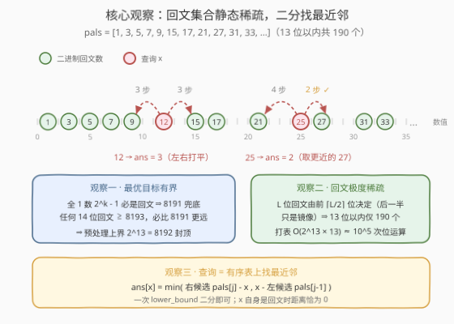
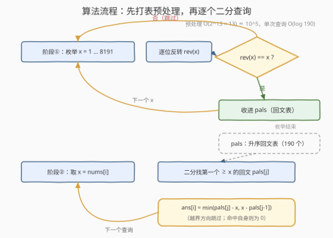

# LeetCode 将数字变成二进制回文数的最少操作 题解

## 1. 题目概述

- **标题 / 题号**：将数字变成二进制回文数的最少操作（#3766，medium）
- **链接**：https://leetcode.cn/problems/minimum-operations-to-make-binary-palindrome/
- **难度**：中等
- **标签**：位运算、数组、双指针、二分查找

**题意**：给你一个整数数组 `nums`。对每个元素 $\text{nums}[i]$，你可以执行以下操作**任意次**（包括零次）：

- 将 $\text{nums}[i]$ 加 1，或
- 将 $\text{nums}[i]$ 减 1。

若一个数的二进制表示（不含前导零）正读和反读相同，则称其为**二进制回文数**（如 $1 = 1$、$3 = 11$、$5 = 101$、$7 = 111$、$9 = 1001$、$15 = 1111$）。

返回数组 `ans`，其中 $\text{ans}[i]$ 表示将 $\text{nums}[i]$ 变成二进制回文数的最少操作次数。

**示例 1**：

```text
输入：nums = [1, 2, 4]
输出：[0, 1, 1]
解释：
  1  = 1     已是回文数              → 0 次
  2  = 10    → 3 = 11（加 1）        → 1 次
  4  = 100   → 3 = 11（减 1）        → 1 次
```

**示例 2**：

```text
输入：nums = [6, 7, 12]
输出：[1, 0, 3]
解释：
  6  = 110   → 5 = 101（减 1）       → 1 次
  7  = 111   已是回文数              → 0 次
  12 = 1100  → 15 = 1111（加 3）     → 3 次
```

**约束**：

- $1 \le \text{nums.length} \le 5000$
- $1 \le \text{nums}[i] \le 5000$

> 💡 **审题关键**：① +1/−1 每次恰好挪动数值 1，故「最少操作次数」就是**数值距离**：$\text{ans}[i] = \min_p \lvert \text{nums}[i] - p \rvert$（$p$ 取遍所有二进制回文数），问题化为**求到最近二进制回文数的距离**；② 合法目标必须是无前导零二进制表示下的正整数，而 $1$ 本身就是回文数，故答案必有上界 $\text{nums}[i] - 1$；③ 值域 $\le 5000$ 极小，且回文数集合是**静态**的（与任何查询无关）——先打表预处理、再逐个二分查询，正是官方 hints 的两句话。

## 2. 解题思路

### 2.1 暴力思路：每次查询都从头现场判定

最直接的暴力：对每个 $x = \text{nums}[i]$，从 1 枚举到某个上界，对每个 $y$ 现场判断是否为回文（反转二进制串比较，$O(\text{位数})$），取距离最小者。上界取 8192 时单次查询约 $8192 \times 13$ 次字符操作，总计 $5000 \times 8192 \times 13 \approx 5 \times 10^8$——每个元素都把「哪些数是回文」从头到尾重判一遍，纯属重复劳动。

稍聪明一点的暴力是从 $d = 0$ 向外逐对试探 $x - d$、$x + d$ 是否回文。由于相邻回文数的间隔很小（13 位以内最大仅 96），这版在本题约束下其实也能过；但它把希望寄托在「间隔恰好不大」上，值域一旦放大（如 $10^{18}$）间隔指数级膨胀，立刻失效。

两路暴力共同的病灶：**回文集合是全局静态的，却在每个查询里被重复计算**。

### 2.2 核心观察：静态稀疏回文表 + 二分最近邻



**观察一（最优目标有界：全 1 数兜底）**：$2^k - 1$ 的二进制是 $k$ 个 1，必为回文数。对任意 $x \le 5000 < 2^{13}$，回文数 $2^{13} - 1 = 8191 \ge x$ 恒存在；而任何 14 位回文数 $p \ge 2^{13} + 1 = 8193$，都有 $\lvert x - p \rvert \ge 8193 - x > 8191 - x$，即 8191 永远更近。故**最优目标必落在 $[1, 8191]$ 内**——预处理上界取 $2^{13} = 8192$ 即可封顶。

**观察二（回文极度稀疏）**：$L$ 位回文数由**前 $\lceil L/2 \rceil$ 位完全决定**（后一半只是前一半的镜像），故 $L$ 位回文数恰有 $2^{\lceil L/2 \rceil - 1}$ 个，13 位以内累计仅 **190 个**——把 $[1, 8191]$ 共 8191 个候选坍缩成 190 个。打表只需 $8192 \times 13 \approx 10^5$ 次位运算。

**观察三（查询 = 有序表上找最近邻）**：把 190 个回文数排成升序数组 `pals`，则最近邻只可能是「$\le x$ 的最大回文」与「$\ge x$ 的最小回文」二者之一。一次 `lower_bound` 二分定位，比较左右两个候选即得答案，$O(\log 190)$；$x$ 自身是回文时二分恰好命中，距离为 0。

> 💡 标签里的「双指针」是同一思路的另一写法：把查询也排序后与 `pals` 做双指针归并，可把 $\log$ 因子省掉（$O(V + P)$）；本题量级下二分版已绰绰有余，且无需还原输出顺序。

### 2.3 算法流程图



1. **预处理（全局一次）**：枚举 $x \in [1, 8192)$，反转其二进制位，若结果仍等于 $x$ 则收入回文表 `pals`（枚举顺序天然升序，共 190 个）；
2. **查询（对每个元素）**：设 $x = \text{nums}[i]$，二分找到 `pals` 中第一个 $\ge x$ 的回文 `pals[j]`；
3. 答案取 $\min(\text{pals}[j] - x,\ x - \text{pals}[j-1])$，越界的方向直接跳过；
4. 收集全部查询结果返回。

### 2.4 示例演算

以示例 2 `nums = [6, 7, 12]` 走一遍，`pals` 开头为 $1, 3, 5, 7, 9, 15, 17, 21, \dots$：

| x | 二分定位 pals[j] | 左候选（≤ x 的最大回文） | 右候选（≥ x 的最小回文） | ans |
|---|-----------------|------------------------|------------------------|-----|
| 6 | 7 | 5（距离 1） | 7（距离 1） | 1 |
| 7 | 7（自身命中） | 5（距离 2） | 7（距离 0） | 0 |
| 12 | 15 | 9（距离 3） | 15（距离 3） | 3 |

$x = 12$ 左右打平（到 9 和 15 都是 3 步），与官方示例「加 3 变成 15」一致。

## 3. 参考代码

### C++

```cpp
class Solution {
  public:
    vector<int> minOperations(vector<int>& nums) {
        // 反转 x 的全部二进制位，结果仍等于 x ⟺ 二进制回文
        auto rev = [](int v) {
            int r = 0;
            for (; v; v >>= 1) r = r << 1 | v & 1;
            return r;
        };
        vector<int> pals;                      // [1, 2^13) 内全部二进制回文（190 个）
        for (int x = 1; x < 8192; ++x)
            if (rev(x) == x) pals.push_back(x);

        vector<int> ans;
        ans.reserve(nums.size());
        for (int x : nums) {
            auto it = lower_bound(pals.begin(), pals.end(), x);
            int best = INT_MAX;
            if (it != pals.end()) best = min(best, *it - x);         // 右候选
            if (it != pals.begin()) best = min(best, x - *prev(it)); // 左候选
            ans.push_back(best);
        }
        return ans;
    }
};
```

### Python

```python
from bisect import bisect_left

class Solution:
    def minOperations(self, nums: List[int]) -> List[int]:
        # 预处理：[1, 2^13) 内全部二进制回文（190 个），枚举中天然升序
        pals = [x for x in range(1, 8192)
                if (s := bin(x)[2:]) == s[::-1]]

        ans = []
        for x in nums:
            i = bisect_left(pals, x)                  # 第一个 >= x 的回文
            best = (pals[i] - x) if i < len(pals) else float('inf')
            if i > 0:                                 # 左候选（<= x 的最大回文）
                best = min(best, x - pals[i - 1])
            ans.append(best)
        return ans
```

> ⚠️ **打表上界为何是 8192 而不是 5000**：见 2.2 观察一——除了「8191 兜底」的论证，还有一个实际原因：$x = 5000$ 的右候选 5049 本身就**越过了 5000**，只打表到 5000 会漏掉所有「最近回文落在 5000 右侧」的查询（5000 的最优解虽然是左侧的 4953，距离 47，但右邻 5049 必须参与比较）。

## 4. 复杂度分析

| 维度 | 复杂度 | 说明 |
|------|--------|------|
| 时间复杂度 | $O(U \log U + n \log P)$ | 预处理枚举 $U = 2^{13} = 8192$ 个数、每个一次 $O(\log U)$ 位反转，约 $10^5$ 次位运算；每次查询在 $P = 190$ 个回文上二分，$O(\log P) \approx 8$ 次比较 |
| 空间复杂度 | $O(P + n)$ | 升序回文表 190 个整数（近乎常数）+ 输出数组 |

## 5. 扩展：值域放大到 $10^{18}$——镜像构造 $O(1)$ 查询

若 $\text{nums}[i] \le 10^{18}$，打表彻底失效（60 位以内的回文数多达 $2^{30}$ 量级）。但由观察二，回文由**高半段**唯一决定，最近的回文必在以下候选之中（与 [564. 寻找最近的回文数](https://leetcode.cn/problems/find-the-closest-palindrome/) 同款套路）：

- 高半段 $h$、$h - 1$、$h + 1$ 各镜像拼出的**同位数**回文；
- 位长减一的最大回文 $2^{L-1} - 1$（全 1）与位长加一的最小回文 $2^L + 1$（`10…01`）。

对候选集取 $\lvert x - c \rvert$ 最小者即为答案，单次查询纯位运算 $O(\log x)$，无需任何打表：

```python
class Solution:
    def minOperations(self, nums: List[int]) -> List[int]:
        def rev(v, m):                       # 反转 v 的低 m 位
            r = 0
            for _ in range(m):
                r = r << 1 | v & 1
                v >>= 1
            return r

        def mirror(h, L):                    # 用高半段 h 拼出 L 位回文
            m = L // 2
            return h << m | rev(h >> (L & 1), m)

        def nearest(x):
            L = x.bit_length()
            h = x >> (L // 2)                # 高半段（ceil(L/2) 位）
            cands = [2 ** (L - 1) - 1, 2 ** L + 1]       # 位长 ±1 的边界候选
            for hh in (h - 1, h, h + 1):
                if 0 < hh.bit_length() == (L + 1) // 2:  # 位长不变才有效
                    cands.append(mirror(hh, L))
            return min(abs(x - c) for c in cands if c >= 1)

        return [nearest(x) for x in nums]
```

> 💡 已用「全量打表 + 逐对外试探」与「宽窗口镜像枚举」两种独立参照对拍验证：小值域（$x \le 10^5$）与 $10^{18}$ 级随机大数全部一致。

## 6. 面试要点

1. **预处理上界为什么取 $2^{13} = 8192$？**

   全 1 数 $2^k - 1$ 必是回文，故 $x \le 5000$ 时恒有回文 $8191 \ge x$ 兜底；任何 14 位回文 $\ge 8193$ 都比 8191 更远，不可能是最优目标。反过来上界也不能只取 5000：$x = 5000$ 的右候选 5049 越过了 5000，打表截断在 5000 会漏掉右侧候选。

2. **为什么打表如此便宜？**

   $L$ 位回文由前 $\lceil L/2 \rceil$ 位决定，后一半是镜像，故 13 位以内只有 190 个回文；打表 $8192 \times 13 \approx 10^5$ 次位运算，毫秒级完成。

3. **为什么最近邻只看二分位置的左右两个候选？**

   `pals` 升序，$\le x$ 的最大回文与 $\ge x$ 的最小回文恰好把 $x$ 夹在中间，其余回文到 $x$ 的距离都不会小于这两者中的较小值；$x$ 自身是回文时 `lower_bound` 恰好命中，距离为 0。

4. **操作次数为什么恰好等于 $\lvert x - p \rvert$，会不会有更省的绕路？**

   不会。每次操作数值恰变化 1，从 $x$ 到 $p$ 至少需要 $\lvert x - p \rvert$ 步（下界）；朝 $p$ 方向逐次 +1/−1 恰好用 $\lvert x - p \rvert$ 步到达（构造）。下界与构造吻合，距离即答案。

5. **$0$ 或负数需要考虑吗？**

   不需要。合法目标是无前导零二进制表示下的正整数；$x \ge 1$ 且 $1$ 本身是回文，$\lvert x - 0 \rvert \ge \lvert x - 1 \rvert$ 恒成立，$0$ 永不占优，负数更无从谈起。

> 💡 **一句话总结**：操作次数 = 数值距离，回文集合静态且 13 位内仅 190 个——一次打表 + 每查询一次 `lower_bound`，$O(2^{13} \cdot 13 + n \log 190)$ 轻松收工；值域再放大就换镜像构造。

## 同类练习题

| # | 题目 | 与本题的关联 |
|---|------|-------------|
| 564 | [寻找最近的回文数](https://leetcode.cn/problems/find-the-closest-palindrome/) | 十进制版「最近回文」，必须镜像高半段构造候选，即第 5 节扩展的完整版 |
| 2081 | [k 镜像数字的和](https://leetcode.cn/problems/sum-of-k-mirror-numbers/) | 按「枚举高半段镜像生成回文」而非逐数判断，k 进制版观察二 |
| 866 | [回文素数](https://leetcode.cn/problems/prime-palindrome/) | 同样靠「构造回文再判素」避开逐数扫描，体会回文的稀疏性 |
| 190 | [颠倒二进制位](https://leetcode.cn/problems/reverse-bits/) | 本题 C++ 回文判定的核心位技巧（反转二进制位） |
| 9 | [回文数](https://leetcode.cn/problems/palindrome-number/) | 回文判定的入门版，对照「无前导零表示」的细节 |
