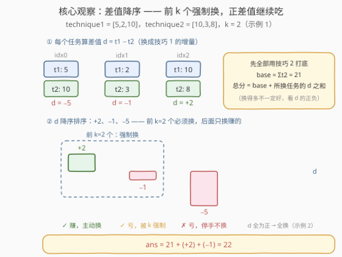
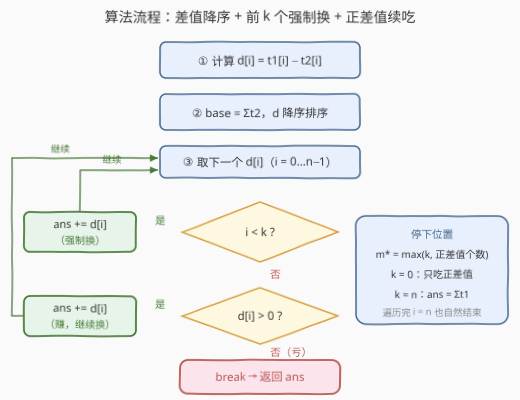

# LeetCode 选择K个任务的最大总分数 题解

## 1. 题目概述

- **标题 / 题号**：选择K个任务的最大总分数（#3767，medium）
- **链接**：https://leetcode.cn/problems/maximize-points-after-choosing-k-tasks/
- **难度**：中等
- **标签**：贪心、数组、排序、堆（优先队列）

**题意**：给你两个长度均为 $n$ 的整数数组 `technique1` 与 `technique2`，$n$ 代表任务数量：

- 第 $i$ 个任务若用**技巧 1** 完成，获得 $\text{technique1}[i]$ 分；
- 若用**技巧 2** 完成，获得 $\text{technique2}[i]$ 分。

再给你一个整数 $k$：你**必须**用技巧 1 完成**至少** $k$ 个任务（不需要是前 $k$ 个任务），其余任务可以用任一技巧完成。返回你能获得的最大总分数。

**示例 1**：

```text
输入：technique1 = [5,2,10], technique2 = [10,3,8], k = 2
输出：22
解释：用技巧 1 完成任务 1、2（得 2 + 10 分），用技巧 2 完成任务 0（得 10 分），
      总分 2 + 10 + 10 = 22。
```

**示例 2**：

```text
输入：technique1 = [10,20,30], technique2 = [5,15,25], k = 2
输出：60
解释：所有任务都用技巧 1 完成最优，总分 10 + 20 + 30 = 60。
```

**示例 3**：

```text
输入：technique1 = [1,2,3], technique2 = [4,5,6], k = 0
输出：15
解释：k = 0 无任何约束，所有任务都用技巧 2 完成，总分 4 + 5 + 6 = 15。
```

**约束**：

- $1 \le n = \text{technique1.length} = \text{technique2.length} \le 10^5$
- $1 \le \text{technique1}[i], \text{technique2}[i] \le 10^5$
- $0 \le k \le n$

> 💡 **审题关键**：①「**至少** $k$ 个」而非「恰好 $k$ 个」——若换成技巧 1 还能赚，完全可以多换（示例 2 中 $k=2$ 却全用了技巧 1）；② 任务之间彼此**独立**、无先后耦合，这是「排序 + 贪心」可解的强信号；③ $k=0$ 退化为逐任务取 $\max$，$k=n$ 时答案即 $\sum \text{technique1}$，两者可作对拍锚点；④ 总分上界 $10^5 \times 10^5 = 10^{10}$，超出 32 位整数范围，C++ 全程 `long long`。

## 2. 解题思路

### 2.1 暴力思路：枚举子集

每个任务有「技巧 1 / 技巧 2」两种选择，共 $2^n$ 种组合，逐一过滤「技巧 1 的任务数 $\ge k$」取最大值。$n \le 10^5$，$2^{10^5}$ 是天文数字，不可行。

瓶颈在于把「每任务二选一」当成无结构的组合爆炸，而没有利用**任务彼此独立**这一性质——选择互不影响，全局看增量即可。

### 2.2 核心观察：差值贪心——全用技巧 2 打底，再「换」出至少 k 个技巧 1



**观察一（增量建模）**：定义差值

$$d_i = \text{technique1}[i] - \text{technique2}[i]$$

即「把任务 $i$ 从技巧 2 换成技巧 1」的**分数增量**。以**全部任务用技巧 2** 打底，$\text{base} = \sum \text{technique2}$，设换用技巧 1 的任务集合为 $S$（约束：$|S| \ge k$），则总分

$$\text{ans}(S) = \text{base} + \sum_{i \in S} d_i$$

问题被改写为：**在 $|S| \ge k$ 的前提下，最大化所选差值之和**。

**观察二（交换论证 ⇒ 最优解必是降序前缀）**：固定 $|S| = m$ 时，选 $d$ 最大的 $m$ 个必然最优——若存在 $i \in S,\ j \notin S$ 且 $d_j > d_i$，把 $j$ 换进来、$i$ 换出去，总分严格变大。于是最优 $S$ 一定是 $d$ **降序排列后的前缀**。再看前缀该取多长：设降序后为 $d_{(1)} \ge d_{(2)} \ge \cdots \ge d_{(n)}$，前缀每延长一位的边际收益恰是 $d_{(m)}$ 本身（单调不增），故最优长度为

$$m^{\*} = \max\{\,k,\ \#\{i : d_i > 0\}\,\}$$

一句话：**前 $k$ 个差值是被约束「强制吃下」的（哪怕为负），之后的差值只在为正时继续吃**（$d_{(m)} = 0$ 时吃不吃无差别）。示例 1 中降序差值为 $[+2, -1, -5]$、$k=2$：强制吃 $+2$ 和 $-1$，$-5$ 亏本弃之；示例 2 中差值全正，一路吃到头。

**观察三（无约束视角，特判快通道）**：先假装约束不存在，逐任务取 $\max(\text{technique1}[i], \text{technique2}[i])$；设「天然偏好技巧 1」（$d_i \ge 0$）的任务有 $p$ 个。若 $p \ge k$，无约束最优解已自动满足约束，就是答案（示例 2 正是如此）；若 $p < k$，才需从 $d_i < 0$ 的任务里挑**亏得最少**的 $k - p$ 个补足名额——仍落在排序贪心框架内。这个视角直观解释了「至少 $k$」相对「恰好 $k$」多出的自由度永远是纯增益。

### 2.3 算法流程图



1. 计算差值 $d_i = \text{technique1}[i] - \text{technique2}[i]$，以及打底分 $\text{base} = \sum \text{technique2}$；
2. 将 $d$ **降序排序**，令 `ans = base`，从头遍历；
3. 若 $i < k$：`ans += d[i]`（约束名额，亏也得吃）；
4. 否则若 $d_i > 0$：`ans += d[i]`（纯赚，继续换）；
5. 否则（名额已满且 $d_i \le 0$）：后面只会更小，`break`；
6. 返回 `ans`。

### 2.4 示例演算

以示例 1 `technique1 = [5,2,10]`、`technique2 = [10,3,8]`、`k = 2` 走一遍（差值降序为 $[+2, -1, -5]$）：

| 步骤 | 当前差值 | 判定 | ans |
|------|---------|------|-----|
| 打底 | — | 全部任务先用技巧 2 | 21 |
| $i=0$ | $+2$ | $i < k=2$，强制换；且为正，本来也想换 | 23 |
| $i=1$ | $-1$ | $i < k=2$，强制换（亏也得吃） | 22 |
| $i=2$ | $-5$ | $i \ge k$ 且为负，停手 | 22 |

对照另外两例：示例 2 差值 $[5,5,5]$ 全正，吃到数组尽头，$\text{ans} = 45 + 15 = 60$；示例 3 中 $k=0$ 且差值全负，一个不换，$\text{ans} = 15$。

## 3. 参考代码

### C++

```cpp
class Solution {
  public:
    long long maxPoints(vector<int>& technique1, vector<int>& technique2, int k) {
        int n = technique1.size();
        vector<int> d(n);
        for (int i = 0; i < n; ++i) d[i] = technique1[i] - technique2[i];
        sort(d.begin(), d.end(), greater<int>());   // 差值降序

        long long ans = 0;
        for (int i = 0; i < n; ++i) ans += technique2[i];   // 全部用技巧 2 打底
        for (int i = 0; i < n; ++i) {
            if (i < k || d[i] > 0) ans += d[i];     // 前 k 个强制吃，后面见正才吃
            else break;                             // 降序保证后面只会更小
        }
        return ans;
    }
};
```

### Python

```python
class Solution:
    def maxPoints(self, technique1: List[int], technique2: List[int], k: int) -> int:
        d = sorted((a - b for a, b in zip(technique1, technique2)), reverse=True)
        ans = sum(technique2)                    # 全部用技巧 2 打底
        for i, x in enumerate(d):
            if i < k or x > 0:                   # 前 k 个强制吃，后面见正才吃
                ans += x
            else:
                break                            # 降序保证后面只会更小
        return ans
```

> ⚠️ **溢出提醒**：$n \le 10^5$、数组元素 $\le 10^5$，总分上界 $10^{10}$，超出 `int`（约 $2.1 \times 10^9$）。C++ 累加器与返回值全链路 `long long`（本题签名已给 `long long`）；Python 整数无限精度无虞。

## 4. 复杂度分析

| 维度 | 复杂度 | 说明 |
|------|--------|------|
| 时间复杂度 | $O(n \log n)$ | 差值计算 $O(n)$ + 降序排序 $O(n \log n)$ + 单趟扫描 $O(n)$，排序为瓶颈 |
| 空间复杂度 | $O(n)$ | 差值数组 $O(n)$（若原地写入 `technique1` 再排序，可降到 $O(1)$ 额外空间） |

## 5. 扩展：O(n log k) 小顶堆——k 很小时免全量排序

排序是全量 $O(n \log n)$；当 $k \ll n$ 时，可用**大小为 $k$ 的小顶堆**一趟维护「当前最大的 $k$ 个差值」：堆未满直接入堆，堆满后遇到更大的差值就弹掉堆顶换入。注意**被挤出堆、以及根本挤不进堆的正差值同样要计入「续吃」收益**，用 `extra` 单独累加——堆里最终留下的就是强制区 top-$k$，`extra` 是前缀之外的全体正差值，两者相加恰为「前 $\max(k, P)$ 个」的差值总和：

```python
class Solution:
    def maxPoints(self, technique1: List[int], technique2: List[int], k: int) -> int:
        ans = sum(technique2)
        heap = []      # 大小至多 k 的小顶堆：当前最大的 k 个差值
        extra = 0      # 进不了 top-k 的正差值，照样要赚
        for a, b in zip(technique1, technique2):
            d = a - b
            if len(heap) < k:
                heapq.heappush(heap, d)
            elif k and d > heap[0]:
                out = heapq.heapreplace(heap, d)   # 弹出旧堆顶，换入更大的 d
                if out > 0:
                    extra += out                   # 被挤出的正差值仍是收益
            elif d > 0:
                extra += d                         # 挤不进 top-k 的正差值
        return ans + sum(heap) + extra
```

时间 $O(n \log k)$、空间 $O(k)$；$k = n$ 时与排序版同为 $O(n \log n)$，$k = 0$ 时堆恒空、正差值全走 `extra`，逻辑自洽。理论上还可用快速选择（quickselect）平均 $O(n)$ 求出前 $k$ 大，但需小心处理「续吃」部分与 top-$k$ 的次序关系，不如堆版直白。

## 6. 面试要点

1. **「至少 k 个」和「恰好 k 个」的解法差在哪？**

   恰好 $k$：答案 $= \sum \text{technique2} + $ 前 $k$ 大差值之和，排序取前缀即可。至少 $k$：前 $k$ 个照样强制吃，但**之后的正差值还要继续吃**，最优长度 $m^{\*} = \max(k, P)$。漏掉「续吃」会在「差值全正 + $k$ 偏小」的用例上翻车（如示例 2，$k=2$ 却该吃 3 个）。

2. **如何向面试官证明贪心的正确性？**

   两步交换论证：① 固定个数 $m$ 时，把更小的差值换成更大的不劣 ⇒ 最优解是降序前缀；② 前缀和的边际 $d_{(m)}$ 单调不增 ⇒ 最优停在 $m^{\*} = \max(k, P)$。整个论证的前提是**任务彼此独立**——若任务间存在依赖（顺序、互斥、共享名额），贪心即失效。

3. **这题能用动态规划吗？**

   能但没必要：$f(i, j)$ 表示前 $i$ 个任务恰有 $j$ 个用技巧 1 的最大分数，$O(nk)$ 时间、$O(k)$ 滚动空间；$n, k$ 均可达 $10^5$，最坏 $10^{10}$ 级转移直接超时。独立性使「全局排序 + 前缀」直接定死最优结构，DP 是杀鸡用牛刀且杀不动。

4. **哪些边界情况值得自测？**

   $k = 0$（纯逐任务取 $\max$）、$k = n$（全用技巧 1，答案 $\sum \text{technique1}$）、差值含 $0$（吃不吃等价，答案不变）、差值全正 / 全负、$n = 1$。建议写完后与暴力枚举 $2^n$ 对拍随机小数据。

5. **哪里会溢出？**

   $\sum \max(\text{technique1}[i], \text{technique2}[i]) \le 10^5 \times 10^5 = 10^{10}$，比 `int32` 上限大一个数量级还多。C++ 从累加变量到返回值全链路 `long long`；Python 天然安全。

> 💡 **一句话总结**：全部用技巧 2 打底，差值 $d = \text{technique1} - \text{technique2}$ 降序排列——前 $k$ 个强制吃，后面见正才吃，$O(n \log n)$ 一趟收工；$k \ll n$ 时换大小为 $k$ 的小顶堆降到 $O(n \log k)$。

## 同类练习题

| # | 题目 | 与本题的关联 |
|---|------|-------------|
| 1710 | [卡车上的最大单元数](https://leetcode.cn/problems/maximum-units-on-a-truck/) | 按单位收益降序装载的纯排序贪心，相当于本题去掉约束后的形态 |
| 2542 | [最大子序列的分数](https://leetcode.cn/problems/maximum-subsequence-score/) | 排序 + 大小为 k 的小顶堆维护「恰选 k 个」的最优组合，与本文扩展篇同款套路 |
| 1005 | [K 次取反后最大化的数组和](https://leetcode.cn/problems/maximize-sum-of-array-after-k-negations/) | 带次数约束的符号贪心，体会「约束名额怎么花最值」 |
| 1642 | [可以到达的最远建筑](https://leetcode.cn/problems/furthest-building-you-can-reach/) | 「至多 k 个名额」的堆贪心，与本题「至少 k 个」构成上下界约束的镜像对照 |
| 502 | [IPO](https://leetcode.cn/problems/ipo/) | 至多 k 轮逐次取当前最优的堆贪心，训练约束名额下的增量选择直觉 |
