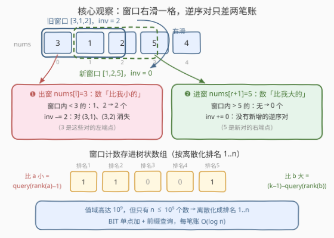
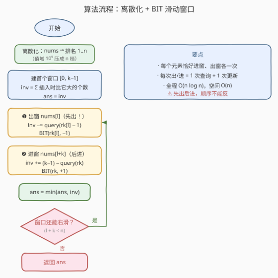

# LeetCode 固定长度子数组中的最小逆序对数目 题解

## 1. 题目概述

- **标题 / 题号**：固定长度子数组中的最小逆序对数目（#3768，hard）
- **链接**：https://leetcode.cn/problems/minimum-inversion-count-in-subarrays-of-fixed-length/
- **难度**：困难
- **标签**：树状数组、线段树、数组、滑动窗口

**题意**：给你一个长度为 $n$ 的整数数组 $\text{nums}$ 和一个整数 $k$。

**逆序对**：下标对 $(i, j)$ 满足 $i < j$ 且 $\text{nums}[i] > \text{nums}[j]$。**子数组的逆序对数量**即该子数组内部的逆序对个数。

返回 $\text{nums}$ 中**所有长度为 $k$ 的子数组**里，逆序对数量的**最小值**。

**示例 1**：

```text
输入：nums = [3,1,2,5,4], k = 3
输出：0
解释：[3,1,2] 有 2 个逆序对：(0,1)、(0,2)
      [1,2,5] 有 0 个逆序对
      [2,5,4] 有 1 个逆序对：(1,2)
      最小值为 0，由 [1,2,5] 取得
```

**示例 2**：

```text
输入：nums = [5,3,2,1], k = 4
输出：6
解释：唯一窗口内部完全逆序，C(4,2) = 6 个对全部逆序。
```

**示例 3**：

```text
输入：nums = [2,1], k = 1
输出：0
解释：单元素窗口内不存在下标对，逆序对恒为 0。
```

**约束**：

- $1 \le n = \text{nums.length} \le 10^5$
- $1 \le \text{nums}[i] \le 10^9$
- $1 \le k \le n$

> 💡 **审题关键**：① 求的是各窗口逆序对数的**最小值**，不是逆序对的总和——逐窗口精确计数、取 min 即可，无需任何全局合并技巧；② 单个窗口逆序对最多 $\binom{k}{2} \le \binom{10^5}{2} \approx 5 \times 10^9$，**必须 64 位整数**；③ 逆序对要求**严格大于**，相等元素不构成对，离散化时须小心处理。

## 2. 解题思路

### 2.1 暴力思路：逐窗口全量重数

枚举全部 $n-k+1$ 个窗口，每个窗口内双重循环数逆序对，总计 $O\big((n-k+1) \cdot k^2\big)$——$n = 10^5$、$k \approx n/2$ 时高达 $10^{14}$ 量级；即便每个窗口内部改用归并排序或树状数组加速到 $O(k \log k)$，总量 $O(n \cdot k \log k)$ 也是 $10^{10}$ 级，均不可行。

瓶颈在于：**相邻窗口重叠 $k-1$ 个元素**，全量重算把共享部分反复重数了一遍又一遍。

### 2.2 核心观察：窗口右滑一格，逆序对只差两笔账



**观察一（增量性）**：窗口 $[l,\, l+k-1]$ 右滑为 $[l+1,\, l+k]$，两者共享中间 $k-1$ 个元素，因此逆序对的**消失与新增只涉及两个元素**：

- **消失的**：所有以出窗元素 $\text{nums}[l]$ 为**左端点**的对 $(l, j)$，$j \in [l+1,\, l+k-1]$——即「窗口内**小于** $\text{nums}[l]$ 的元素个数」；
- **新增的**：所有以进窗元素 $\text{nums}[l+k]$ 为**右端点**的对 $(i,\, l+k)$，$i \in [l+1,\, l+k-1]$——即「窗口内**大于** $\text{nums}[l+k]$ 的元素个数」。

> ⚠️ **方向别记反**：出窗的数是消失对的**左**端点，配对条件是右边元素**比它小**；进窗的数是新增对的**右**端点，配对条件是左边元素**比它大**。此外**必须先出后进**：进窗查询「比它大的个数」时，树状数组里应恰存新窗口的其余 $k-1$ 个元素——若旧队首 $\text{nums}[l]$ 尚未出窗，会把它与进窗元素的一对错误地算进来（二者从不在同一窗口）。

**观察二（离散化 + 树状数组）**：$\text{nums}[i]$ 高达 $10^9$，但总共只有 $n \le 10^5$ 个数——先**离散化**成排名 $1..n$，再用**树状数组**（BIT）维护「当前窗口内每个排名的出现次数」，则两笔账都是一次前缀和查询：

$$\#\{\text{比 } a \text{ 小}\} = \text{query}(\text{rank}(a) - 1), \qquad \#\{\text{比 } b \text{ 大}\} = m - \text{query}(\text{rank}(b))$$

其中 $m$ 为查询时窗口内的元素个数（进窗查询时 $m = k-1$）。首个窗口的初始逆序对同样边插边数：插入 $\text{nums}[i]$ 前，已插入 $i$ 个，其中比它大的有 $i - \text{query}(\text{rank}(\text{nums}[i]))$ 个。每个元素一生恰好进窗、出窗各一次，总计 $O(n \log n)$。

### 2.3 算法流程图



1. **离散化**：`nums` → 排名 `rk[i] ∈ [1, n]`；
2. **建首个窗口** `[0, k-1]`：逐个插入，`inv += i - query(rk[i])`，`BIT(rk[i], +1)`；令 `ans = inv`；
3. 对 `l = 0 .. n-k-1` 循环（窗口 `[l, l+k-1]` → `[l+1, l+k]`）：
   - **出窗** `nums[l]`：`inv -= query(rk[l] - 1)`，`BIT(rk[l], -1)`；
   - **进窗** `nums[l+k]`：`inv += (k-1) - query(rk[l+k])`，`BIT(rk[l+k], +1)`；
   - `ans = min(ans, inv)`；
4. 返回 `ans`。

### 2.4 示例演算

以示例 1 `nums = [3,1,2,5,4]`、`k = 3` 走一遍（本题值恰为 1..5，排名即值本身）：

| 窗口 | 操作 | 细节 | inv |
|------|------|------|-----|
| [3,1,2] | 初始化 | 插 3：+0；插 1：+1（3>1）；插 2：+1（3>2） | 2 |
| [1,2,5] | 出 3、进 5 | 窗口内 <3 的有 {1,2} → −2；窗口内 >5 的无 → +0 | 0 |
| [2,5,4] | 出 1、进 4 | 窗口内 <1 的无 → −0；窗口内 >4 的有 {5} → +1 | 1 |

$\text{ans} = \min(2, 0, 1) = 0$ ✓。示例 2 唯一窗口初始化得 $0+1+2+3 = 6$；示例 3 中 $k=1$ 的窗口无下标对，恒为 0。

## 3. 参考代码

### C++

```cpp
class Solution {
  public:
    long long minInversionCount(vector<int>& nums, int k) {
        int n = nums.size();

        // 离散化：nums[i] -> 排名 rk[i] ∈ [1, n]
        vector<int> sorted(nums);
        sort(sorted.begin(), sorted.end());
        vector<int> rk(n);
        for (int i = 0; i < n; ++i)
            rk[i] = lower_bound(sorted.begin(), sorted.end(), nums[i]) - sorted.begin() + 1;

        vector<int> tree(n + 1, 0);          // 按排名计数
        auto update = [&](int i, int d) {    // 排名 i 计数 ±1
            for (; i <= n; i += i & (-i)) tree[i] += d;
        };
        auto query = [&](int i) {            // 排名 ≤ i 的窗口元素个数
            int s = 0;
            for (; i > 0; i -= i & (-i)) s += tree[i];
            return s;
        };

        long long inv = 0;                   // 当前窗口逆序对数
        for (int i = 0; i < k; ++i) {        // 建首个窗口 [0, k-1]
            inv += i - query(rk[i]);         // 已插入 i 个，比它大的有 i - query(rk[i])
            update(rk[i], 1);
        }
        long long ans = inv;

        for (int l = 0; l + k < n; ++l) {    // [l, l+k-1] → [l+1, l+k]
            inv -= query(rk[l] - 1);         // ❶ 先出：窗口内比它小的对消失
            update(rk[l], -1);
            int r = rk[l + k];
            inv += (long long)(k - 1) - query(r);  // ❷ 后进：窗口内比它大的对出现
            update(r, 1);
            ans = min(ans, inv);
        }
        return ans;
    }
};
```

### Python

```python
from bisect import bisect_left

class Solution:
    def minInversionCount(self, nums: List[int], k: int) -> int:
        n = len(nums)
        sv = sorted(nums)
        rk = [bisect_left(sv, x) + 1 for x in nums]   # 离散化排名 1..n

        tree = [0] * (n + 1)
        def update(i, d):                 # 排名 i 计数 ±1
            while i <= n:
                tree[i] += d
                i += i & (-i)
        def query(i):                     # 排名 ≤ i 的窗口元素个数
            s = 0
            while i > 0:
                s += tree[i]
                i -= i & (-i)
            return s

        inv = 0
        for i in range(k):                # 建首个窗口 [0, k-1]
            inv += i - query(rk[i])       # 已插入中比它大的个数
            update(rk[i], 1)
        ans = inv

        for l in range(n - k):            # [l, l+k-1] → [l+1, l+k]
            inv -= query(rk[l] - 1)       # ❶ 先出：数窗口内比它小的
            update(rk[l], -1)
            r = rk[l + k]
            inv += (k - 1) - query(r)     # ❷ 后进：数窗口内比它大的
            update(r, 1)
            ans = min(ans, inv)
        return ans
```

> ⚠️ **溢出提醒**：单窗口逆序对上界 $\binom{k}{2} \le \binom{10^5}{2} \approx 5 \times 10^9$，超出 32 位 `int`——C++ 从 `inv` 到返回值全链路 `long long`；Python 整数无限精度无虞。

## 4. 复杂度分析

| 维度 | 复杂度 | 说明 |
|------|--------|------|
| 时间复杂度 | $O(n \log n)$ | 离散化排序 $O(n \log n)$；每个元素恰好进窗、出窗各一次，每次出/进为 1 次 BIT 查询 + 1 次 BIT 更新，各 $O(\log n)$ |
| 空间复杂度 | $O(n)$ | 离散化排名数组 + 树状数组，均为 $O(n)$ |

## 5. 扩展：同一副骨架能回答更多问题

- **换聚合**：`inv` 在每个窗口都是精确值，把 `min` 换成 `max` 或求和，即可得到所有窗口逆序对的**最大值**或**总和**，骨架一行不改；
- **换数据结构**：树状数组可等价替换为线段树（单点改 + 区间和）；若还需「窗口内第 $k$ 小」之类查询，线段树上二分更顺手，代价是常数更大；
- **静态退化**：窗口不滑动（整个数组即一个窗口）时，本题退化为经典的「数组逆序对计数」，归并排序与 BIT 都是标准解法。

## 6. 面试要点

1. **为什么「出窗数小、进窗数大」，方向恰好相反？**

   出窗元素位于窗口最左，它参与的逆序对都以它为**左**端点，要求右侧元素**严格小于**它；进窗元素位于窗口最右，参与的逆序对都以它为**右**端点，要求左侧元素**严格大于**它。方向弄反是最常见的 bug。

2. **为什么必须「先出后进」，顺序不能换？**

   进窗查询「窗口内比它大的个数」时，树状数组中必须恰存新窗口的其余 $k-1$ 个元素。若先进后出，旧队首仍在计数里，会把它与进窗元素的一对错误计入——这两个元素从不在同一窗口，且这一误判无法靠简单修正抵消。

3. **值域 $10^9$ 与相等元素分别怎么处理？**

   只有 $n \le 10^5$ 个数，离散化到排名 $1..n$ 后 BIT 才开得下。逆序对要求**严格大于**：相同值离散化后排名相同，`query(r-1)` 统计严格小于、`m - query(r)` 统计严格大于，相等排名被两侧查询天然排除，无需特判。

4. **哪些量会溢出？**

   单窗口逆序对上界 $\binom{10^5}{2} \approx 5 \times 10^9$，超出 `int`（约 $2.1 \times 10^9$）。C++ 中 `inv`、`ans` 与返回值全链路 `long long`；树状数组本身只存计数（$\le n$），用 `int` 即可。

5. **为什么整体是 $O(n \log n)$ 而不是乘上窗口数？**

   每个元素一生恰好进窗一次、出窗一次，共 $2n$ 次 BIT 操作，每次 $O(\log n)$；$n-k+1$ 个窗口只是循环的次数，每个窗口仅做 $O(1)$ 次树状数组调用，不引入额外因子。

> 💡 **一句话总结**：相邻窗口只差「一个出、一个进」——出窗数窗口内**比它小**的，进窗数窗口内**比它大**的；离散化 + 树状数组把两笔账都压成 $O(\log n)$ 的前缀和，增量维护 `inv` 扫一遍取 min 收工。

## 同类练习题

| # | 题目 | 与本题的关联 |
|---|------|-------------|
| 315 | [计算右侧小于当前元素的个数](https://leetcode.cn/problems/count-of-smaller-numbers-after-self/) | 值域 BIT 统计「右边比它小的」，正是本题出窗查询的静态版 |
| 493 | [翻转对](https://leetcode.cn/problems/reverse-pairs/) | 归并/BIT 数满足大小关系的对，体会严格不等号在离散化下的边界处理 |
| 2179 | [统计数组中好三元组](https://leetcode.cn/problems/count-good-triplets-in-an-array/) | 离散化排名 + 双 BIT 数交叉对，排名思想的进阶应用 |
| 480 | [滑动窗口中位数](https://leetcode.cn/problems/sliding-window-median/) | 同为「窗口滑动时增量维护有序结构」，对照双堆与平衡树/BIT 两种实现 |
| 327 | [区间和的个数](https://leetcode.cn/problems/count-of-range-sum/) | 前缀和离散化 + BIT 计数，离散化套路的又一经典场景 |
